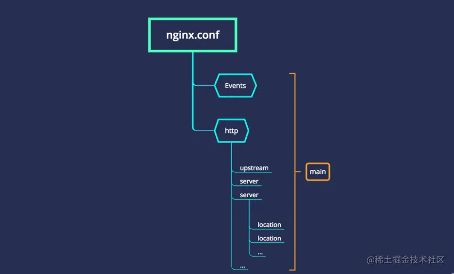
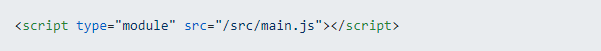
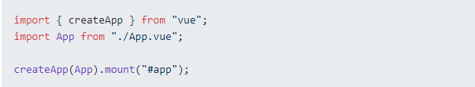
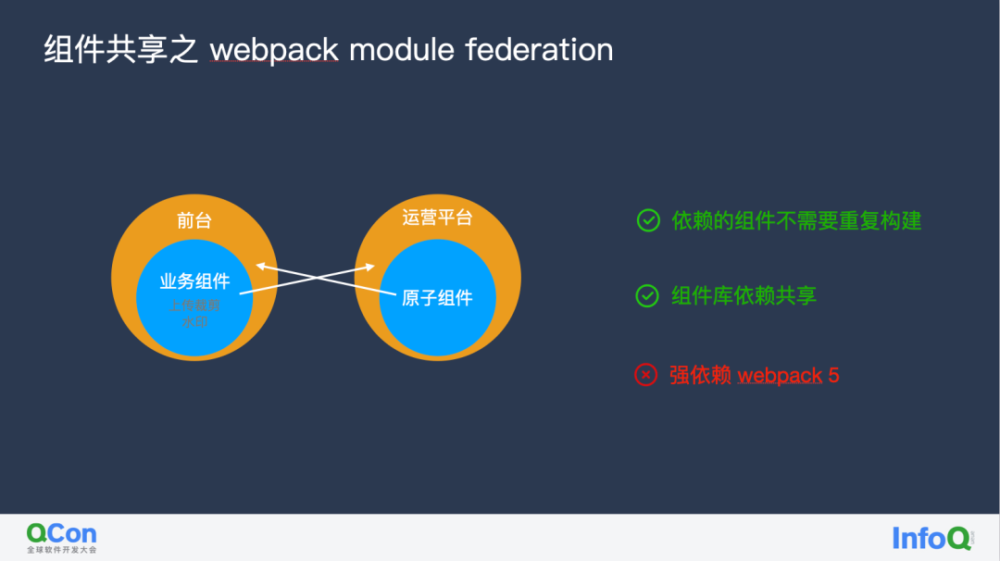
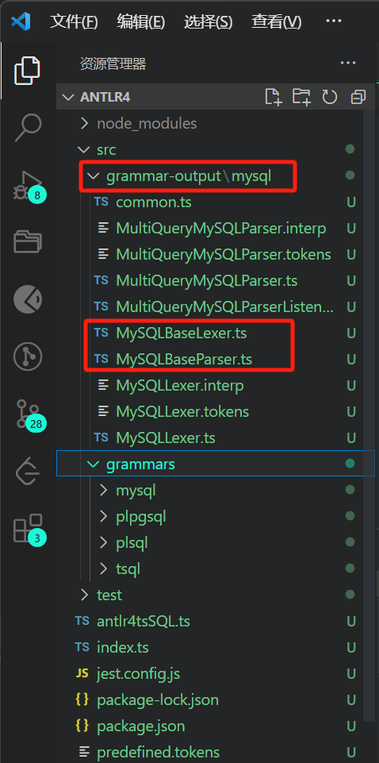

# 网站搭建

## nginx

https://juejin.cn/post/6887135998099062792

https://blog.csdn.net/Charissa2017/article/details/105886521

Nginx是一款轻量级的Web服务器，具有内存占用少，启动极快，高并发能力强的优势，采用事件驱动的异步非阻塞处理方式框架，IO性能好，时常用于服务端的反向代理和负载均衡。 

### 正向代理与反向代理

> 反向代理服务器位于用户与目标服务器之间，但是对于用户而言，反向代理服务器就相当于目标服务器，即用户直接访问反向代理服务器就可以获得目标服务器的资源。同时，**用户不需要知道目标服务器的地址**，也无须在用户端作任何设定。反向代理服务器通常可用来作为Web加速，即使用反向代理作为Web服务器的前置机来降低网络和服务器的负载，提高访问效率

正向代理是什么东东？反向代理又是啥？
 ***「「正向代理」」***
 **「「举个栗子」」** 因为防火墙的原因， 直接访问谷歌是无法访问的， 这时可以借助梯子，即vpn，那么这个vpn(代理)就是代替客户端去访问服务器，然后将数据返回给客户端。服务器并不知道目标客户端，只是与vpn建立联系。
 ***「「反向代理」」***
 **「「举个栗子」」** 你（客户端）去租房时，真正的房东（服务器）将房租给二手房东（代理服务器），而你通过二手房东租到的房子，也就是你与二手房东建立联系， 租到房子，并非真正的房东。
 一句话： **正向代理 “代理”客户端， 反向代理“代理”服务器**

### nginx文件

#### 配置文件

 `ps aux|grep nginx` 查看 配置文件conf目录 

 nginx配置文件的基本结构



```
「「main」」:nginx的全局配置，对全局生效。
「「events」」:配置影响nginx服务器或与用户的网络连接。
「「http」」：可以嵌套多个server，配置代理，缓存，日志定义等绝大多数功能和第三方模块的配置。
「「server」」：配置虚拟主机的相关参数，一个http中可以有多个server。
「「location」」：配置请求的路由，以及各种页面的处理情况。
「「upstream」」：配置后端服务器具体地址，负载均衡配置不可或缺的部分。
```

#####  server 

```bash
server {
  listen 80;
  server_name  localhost;
  root   html;
  index  index.html index.htm;
}
##引入/etc/nginx/conf.d中的server配置
include /etc/nginx/conf.d/*.conf;

## /etc/nginx/conf.d/index.conf
server {
  #端口号
  listen 80;
  #域名或者ip
  #server_name 121.40.61.99;
  server_name tomorrowlm.xyz;
  #文件的路径
  root /root/www;
  #配置默认访问的页面
  index index.html;
  #配置多个项目
  #location注意要和项目中配置的base一样
  location /vue-demo {
 	try_files $uri $uri/ /vue-demo/index.html;
  }
  location /react-demo {
  	try_files $uri $uri/ /react-demo/index.html;
  }

# location / {
#   #当输入错误路径时，跳转到index.html页面
#   try_files $uri $uri/ =404 /index.html;
#  }
}
```

nginx默认监听的就是80端口， 也可以监听其他端口号

server_name就是你服务器的名称，可以精准匹配，也可以使用通配符或正则匹配，没有顺序，一般是先到先得。

root 你项目文件存放路径， 一般是放在html下面，也可放在其他地方， 如/var/local/marking-h5,n那么就改为 `root /var/local/marking-h5`（build打包后的dist文件在服务器上的路径）

index 你的项目入口， 通常是index.html.

```bash
#点击刷新后，页面就会显示（404）,使用try_files（进行内部重定向）
try_files $uri $uri/ /react-demo/index.html;
#$uri  请求文件的路径
#$uri/ 请求目录的路径

try_files是nginx中http_core核心模块所带的指令，主要是能替代一些rewrite的指令，提高解析效率。
当用户请求 http://localhost/example 时，这里的 $uri 就是 /example。 
try_files 会到硬盘里尝试找这个文件。如果存在名为 /$root/example（其中 $root 是项目代码安装目录）的文件，就直接把这个文件的内容发送给用户。 
显然，目录中没有叫 example 的文件。然后就看 $uri/，增加了一个 /，也就是看有没有名为/$root/example/ 的目录。 
```

部署多个网站

```bash
#配置代理
server {
  listen 80;
  server_name name1;
  root /root/www;
  #配置默认访问的页面
  index index.html;
  autoindex on;
  #实现公用80端口 部署多个网站
  location / {
    proxy_pass http://localhost:4300;
  }
}
server {
  listen 4300;
  server_name localhost;
  root /root/www;
  autoindex on;
  location /vue-demo {
    try_files $uri $uri/ /index.html;
  }
}
server {
  listen 80;
  server_name name2;
  root /root/www;
  #配置默认访问的页面
  index index.html;
  autoindex on;
  #实现公用80端口 部署多个网站
  location / {
    proxy_pass http://localhost:4400;
  }
}
server {
  listen 4400;
  server_name localhost;
  root /root/www;
  autoindex on;
  location /vue-demo {
    try_files $uri $uri/ /index.html;
  }
}
```


#### 其他文件

```bash
/run 		nginx.pid
/etc/nginx 	nginx配置
/root 		页面
/var/log/nginx/access.log 	报错信息
```

### nginx命令

```bash
nginx 							#打开 nginx
nginx -t   				        #测试配置文件是否有语法错误
nginx -s reopen					#重启Nginx
nginx -s reload					#重新加载Nginx配置文件，然后以优雅的方式重启Nginx
nginx -s stop  					#强制停止Nginx服务
nginx -s quit  					#停止Nginx服务（即处理完所有请求后再停止服务）
systemctl start nginx			#开启防火墙
service nginx start				#启动nginx
nginx [-?hvVtq] [-s signal] [-c filename] [-p prefix] [-g directives]

-?,-h           : 打开帮助信息
-v              : 显示版本信息并退出
-V              : 显示版本和配置选项信息，然后退出
-t              : 检测配置文件是否有语法错误，然后退出
-q              : 在检测配置文件期间屏蔽非错误信息
-s signal       : 给一个 nginx 主进程发送信号：stop（强制停止）, quit（优雅退出）, reopen（重启）, reload（重新加载配置文件）
-p prefix       : 设置前缀路径（默认是：/usr/share/nginx/）
-c filename     : 设置配置文件（默认是：/etc/nginx/nginx.conf）
-g directives   : 设置配置文件外的全局指令
```

tip:

- nginx: [error] open() "/run/nginx.pid" failed (2: No such file or directory)

  ```
  nginx -c /etc/nginx/nginx.conf
  ```

## PM2

PM2是node进程管理工具，可以利用它来简化很多node应用管理的繁琐任务，如性能监控、自动重启、负载均衡等，而且使用非常简单。

```
pm2 start ./bin/www --watch --name my-api
```

```
用法
$ npm install pm2 -g     # 命令行安装 pm2 
$ pm2 start app.js --name my-api # 命名进程
$ pm2 list               # 显示所有进程状态
$ pm2 monit              # 监视所有进程
$ pm2 logs               #  显示所有进程日志
$ pm2 stop all           # 停止所有进程
$ pm2 restart all        # 重启所有进程
$ pm2 reload all         # 0秒停机重载进程 (用于 NETWORKED 进程)
$ pm2 stop 0             # 停止指定的进程
$ pm2 restart 0          # 重启指定的进程
$ pm2 startup            # 产生 init 脚本 保持进程活着
$ pm2 web                # 运行健壮的 computer API endpoint (http://localhost:9615)
$ pm2 delete 0           # 杀死指定的进程
$ pm2 delete all         # 杀死全部进程
```

## express

https://help.aliyun.com/document_detail/50775.html

https://www.jianshu.com/p/175558881f19

# 前端⼯程化

## 构建历史

https://mp.weixin.qq.com/s/vhkAhBJ2mok43lIlHpu8Gg


前端模块化/构建工具从最开始的基于浏览器**运行时**加载的 `RequireJs/Sea.js` 到将所有资源组装依赖打包 `webpack`/`rollup`/`parcel`的`bundle`类模块化构建工具，再到现在的`bundleless`基于浏览器原生 ES 模块的 `snowpack`/`vite`，前端的模块化/构建工具发展到现在已经快 10 年了。

- Grunt

- browserify

  `browserify`致力于在浏览器端使用`CommonJs`，他使用跟 `NodeJs` 一样的模块化语法，然后将所有依赖文件编译到一个`bundle`文件，在浏览器通过`<script>`标签使用的，并且支持 npm 库。

- Gulp

- webpack

  `webpack1`支持`CommonJs`和`AMD`模块化系统，优化依赖关系，支持分包，支持多种类型 script、image、file、css/less/sass/stylus、mocha/eslint/jshint 的打包，丰富的插件体系。`webpack`的概念更偏向于工程化

  以上的 3 个库 `Grunt/Gulp/browserify` 都是偏向于工具，而 `webpack`将以上功能都集成到一起，相比于工具它的功能大而全。

- rollup

  `rollup`编译`ES6`模块，提出了`Tree-shaking`，根据`ES module`静态语法特性，删除未被实际使用的代码，支持导出多种规范语法，并且导出的代码非常简洁，如果看过 `vue` 的`dist` 目录代码就知道导出的 `vue` 代码完全不影响阅读。

  `rollup`的插件系统支持：`babel`、`CommonJs`、`terser`、`typescript`等功能。

  相比于`browserify`的`CommonJs`，`rollup`专注于`ES module`。
  相比于`webpack`大而全的前端工程化，`rollup`专注于纯`javascript`，大多被用作打包`tool`工具或`library`库。

  react、vue 等库都使用`rollup`打包项目，并且下面说到的`vite`也依赖`rollup`用作生产环境打包 js。

- snowpack 和 vite

  因为 `snowpack`**基于浏览器的模块化** 和 `vite` 比较类似，都是`bundleless`所以一起拿来说。`bundleless`类运行时打包工具的启动速度是毫秒级的，因为不需要打包任何内容，只需要起两个`server`，一个用于页面加载，另一个用于`HMR`的`WebSocket`，当浏览器发出原生的`ES module`请求，`server`收到请求只需编译当前文件后返回给浏览器不需要管依赖。`bundleless`工具在**生产环境**打包的时候依然`bundle`构建所以依赖视图的方式，vite 是利用 `rollup` 打包生产环境的 js 的。

## 基于浏览器的模块化

### CommonJS 和 EsModule

https://es6.ruanyifeng.com/#docs/module-loader

#### CommonJS

> 一切的开始要从CommonJS规范说起。
>
> `CommonJS` 本来叫ServerJs，其目标本来是为**浏览器之外**的`javascript`代码制定规范，在那时`NodeJs`还没有出生，有一些零散的应用于服务端的`JavaScript`代码，但是没有完整的生态。
>
> 之后就是 `NodeJs` 从 `CommonJS` 社区的规范中吸取经验创建了本身的模块系统。

核心思想：允许模块通过 `require` 方法来同步加载所要依赖的其他模块，然后通过 `exports` 或 `module.exports` 来导出需要暴露的接口。

```js
// a.js
//本质上是将要导出的对象赋值给module对象的export属性，然后在其他文件中通过require这个方法访问该属性
exports.a = 'Hello world'; // 相当于：module.exports.a = 'Hello world';
module.exports = {
    a: 'Hello world'
  }
}
// b.js
var moduleA = require('./a.js');
console.log(moduleA.a); // 打印出hello world
```

**优点：**服务器端模块重用，NPM中模块包多，有将近20万个。

**缺点：**加载模块是**同步**的，只有加载完成后才能执行后面的操作，也就是当要用到该模块了，现加载现用，不仅加载速度慢，而且还会导致性能、可用性、调试和跨域访问等问题。Node.js主要用于服务器编程，加载的模块文件一般都存在本地硬盘，加载起来比较快，不用考虑异步加载的方式，因此,CommonJS规范比较适用。然而，这并不适合在浏览器环境，同步意味着阻塞加载，浏览器资源是异步加载的，因此有了AMD CMD解决方案。

> require的加载过程是**同步**的，所以必须等到引入的文件（模块）加载完成之后，才会继续执行其它代码，会产生**阻塞现象**，因为引入一个文件，则该文件内部的所有代码都会被执行一次。

**环境**：

- 服务器端的 [Node.js](http://www.nodejs.org/)
- [Browserify](http://browserify.org/)，浏览器端的 CommonJS 实现，可以使用 NPM 的模块，但是编译打包后的文件体积可能很大
- [modules-webmake](https://github.com/medikoo/modules-webmake)，类似Browserify，还不如 Browserify 灵活
- [wreq](https://github.com/substack/wreq)，Browserify 的前身

#### ES Module

ECMAScript6 标准增加了 JavaScript 语言层面的模块体系定义。[ES6 模块](http://es6.ruanyifeng.com/#docs/module)的设计思想，是尽量的静态化，使得编译时就能确定模块的依赖关系，以及输入和输出的变量。CommonJS 和 AMD 模块，都只能在运行时确定这些东西。**由于ES6目前无法在浏览器中执行，所以，我们只能通过babel将不被支持的import编译为当前受到广泛支持的 require**。

- **命名导出** 

  ```
  // B.js
  /*--------  单个变量或函数导出  ----------*/
  export function show() { console.log('show方法被调用') }
  
  export let count = 3
  
  /*--------  批量导出  ----------*/
  function show() { console.log('show方法被调用') }
  let count = 3
  export {show, count} //  解构赋值语法(as关键字在这里表示将newA作为a的数据接口暴露给外部，外部不能直接访问a)
  ```

  第一种是单个的变量或函数导出，只需要直接在开头使用 `export` 关键字即可；

  第二种情况是批量地把多个变量或函数导出，只需要把它们储存到一个对象中即可

- **默认导出**

  ```
  // B.js
  function show() { console.log('show方法被调用') }
  
  // 默认导出函数show
  export default show
  ```

  默认导出是在 `export` 关键词后面再跟上一个 `default` 表示导出的该变量或函数是匿名的

  > **注意：** 一个模块只能默认导出一次，否则就会报错，具体原因会在后面讲解

- **导入**

  ES6 Module 的导入用到的关键字是 `import` ，具体代码如下

  ```js
  // A.js
  import {show, count} from './B.js'
  
  show()   // show方法被调用
  
  console.log(count)  // 3
  ```

  ES6 Module的导入需要用一对 `{}` 大括号来接收我们需要导入的方法或函数

  > **注意：** 大括号中的变量或函数名必须与导出时的名称一模一样

  那么如果我们想修改导入的变量或函数的名称，可以通过 `as` 关键词来命名，代码如下

  ```js
  // A.js
  import {show as print, count as number} from './B.js'
  
  print()   // show方法被调用
  
  console.log(number)  // 3
  ```

  如果我们要想将所有的变量或函数都导入，可以通过 `*` 来整体导入，代码如下

  ```js
  import * as bModule from './B.js'
  
  bModule.show()  // show方法被调用
  
  console.log(bModule.count)  // 3
  ```

  `*` 表示全部的意思，我们将其全部导入，并赋值给 `bModule`，这样我们就可以通过 `bModule` 获取想要的变量或对象了

  以上所说的都是针对命名导出的变量或函数，那么如何导入一个默认导出的变量或函数呢？

  ```js
  // 将通过 export default 导出的变量导入
  import print from './B.js'
  
  print()  // show方法被调用
  ```

  命名导出的变量都是通过 `{}` 来接收的，那么去掉 `{}` ，接收的就是默认导出的变量了，因为导出的变量是匿名的，因此我们可以随意地起个变量名用于接收

  **补充：** 这里特别提一下，与CommonJS不同，ES6 Module 的导入文件路径是不支持表达式的

优点：

- 容易进行静态分析
- 面向未来的 ECMAScript 标准

缺点：

- 原生浏览器端还没有实现该标准
- 全新的命令字，新版的 Node.js才支持


##### 加载规则

浏览器加载 ES6 模块，也使用`<script>`标签，但是要加入`type="module"`属性。

```html
<script type="module" src="./foo.js"></script>
```

上面代码在网页中插入一个模块`foo.js`，由于`type`属性设为`module`，所以浏览器知道这是一个 ES6 模块。

浏览器对于带有`type="module"`的`<script>`，都是异步加载，不会造成堵塞浏览器，即等到整个页面渲染完，再执行模块脚本，等同于打开了`<script>`标签的`defer`属性。

```html
<script type="module" src="./foo.js"></script>
<!-- 等同于 -->
<script type="module" src="./foo.js" defer></script>
```

如果网页有多个`<script type="module">`，它们会按照在页面出现的顺序依次执行。

```
<script>标签的async属性也可以打开，这时只要加载完成，渲染引擎就会中断渲染立即执行。执行完成后，再恢复渲染。
```

```html
<script type="module" src="./foo.js" async></script>
```

一旦使用了`async`属性，`<script type="module">`就不会按照在页面出现的顺序执行，而是只要该模块加载完成，就执行该模块。

#### CommonJS 与ES Module的区别

https://mp.weixin.qq.com/s/1wUU-i3W4RlR2hf86lZqEA

这两者的主要区别主要有以下两点：

1. 对于模块的依赖，CommonJS是**动态的**，ES6 Module 是**静态的**

   > 对于模块的依赖，何为**动态**？何为**静态**？
   >
   > 动态是指对于模块的依赖关系建立在代码执行阶段；静态是指对于模块的依赖关系建立在代码编译阶段；

   - CommonJS

     - CommonJS导入时，`require` 的路径参数是支持表达式的

       ```
       // A.js
       let fileName = 'example.js'
       const bModule = require('./' + fileName)
       ```

       因为该路径在代码执行时是可以动态改变的，所以如果在代码编译阶段就建立各个模块的依赖关系，那么一定是不准确的，只有在代码运行了以后，才可以真正确认模块的依赖关系，因此说CommonJS是动态的。

     - `CommonJs`支持动态导入,可以在语句中，使用`require`语法

       ```
       let lists = ["./index.js", "./config.js"]
       lists.forEach((url) => require(url)) // 动态导入
       
       if (lists.length) {
           require(lists[0]) // 动态导入
       }
       ```

   - Es Module

     只能声明在该文件的最顶部，不能动态加载语句

     ```
     if (true) {
     	import xxx from 'XXX' // 报错
     }
     ```

2. CommonJS导入的是值的**拷贝**，ES6 Module导入的是值的**引用**

   首先来验证CommonJS，代码如下

   ```js
   // B.js
   let count = 3
   
   function change() {
       count ++    // 变量count + 1
       console.log('原count值为：', count);  // 打印B.js模块中count的值
   }
   
   module.exports = {
       count,
       change
   }
   
   // A.js
   let count = require('./B.js').count 
   let change = require('./B.js').change
   
   console.log('改变前：', count);   
   change()     // 调用模块B.js中的change方法，将原来的count + 1
   console.log('改变后：', count); 
   
   // 运行A.js文件的结果
   改变前：3
   原count值为：4
   改变后：3
   ```

   在上述代码中我们可以看到，在 `A.js` 文件中导入了 `B.js` 文件中的变量 `count` 和 函数 `change`，因为导入的 `count` 只是对原有值的一个拷贝，因此尽管我们调用了函数 `change` 改变了 `B.js` 文件中变量 `count` 的值，也不会影响到 `A.js` 文件中的变量 `count`

   根据这个结果得出结论：CommonJS导入的变量是对原值的拷贝

3. CommonJS 模块的`require()`是同步加载模块，ES6 模块的`import`命令是异步加载，有一个独立的模块依赖的解析阶段。

### RequireJs 和 AMD

> `CommonJs` 是一套同步模块导入规范，但是在浏览器上还没法实现同步加载，这一套规范在浏览器上明显行不通，所以基于浏览器的异步模块 `AMD`规范诞生。AMD规范（Asynchronous Module Definition，异步模块定义）是RequireJS在推广模块化开发的过程中提出的一种规范。

**其核心接口是**：define(id, 『dependencies』, factory) ，它要在声明模块的时候指定所有的依赖 dependencies ，并且还要当做形参传到factory 中，对于依赖的模块**提前执行**，**依赖前置**。

`AMD`规范采用**依赖前置**，先把需要用到的依赖提前写在 `dependencies` 数组里，在所有依赖下载完成后再调用`factory`回调，通过传参来获取模块，同时也支持`require("beta")`的方式来获取模块，但实际上这个`require`只是语法糖，模块并非在`require`的时候导入，而是跟前面说的一样在调用`factory`回调之前就被执行，关于依赖前置和执行时机这点在当时有很大的争议，被 `CommonJs`社区所不容。

```js
define("module", ["dep1", "dep2"], function(d1, d2) {
  return someExportedValue;
});
require(["module", "../file"], function(module, file) { /* ... */ });
```

**优点：**在浏览器环境中异步加载模块；并行加载多个模块；

**缺点：**开发成本高，代码的阅读和书写比较困难，模块定义方式的语义不顺畅；不符合通用的模块化思维方式，是一种妥协的实现；

### Sea.js 和 CMD

> 在不断给 `RequireJs` 提建议，但不断不被采纳后，玉伯结合`RequireJs`和`module/2.0`规范写出了基于 CMD（Common Module Definition）规范的`Sea.js`。

Common Module Definition 规范和 AMD 很相似，尽量保持简单，并与 CommonJS 和 Node.js 的 Modules 规范保持了很大的兼容性。CMD规范（Common Module Definition，通用模块定义）是SeaJS在推广模块化开发的过程中提出的一种规范。

```js
define(function(require, exports, module) {
  var $ = require('jquery');
  var Spinning = require('./spinning');
  exports.doSomething = ...
  module.exports = ...
})
```

**优点：依赖就近，延迟执行**（对于依赖的模块延迟执行，即只在需要用到某个模块的时候再require） 可以很容易在 Node.js 中运行；
**缺点：**依赖 SPM 打包，模块的加载逻辑偏重；
**实现：Sea.js** ；coolie


## rollup

### 概念

2015 年，前端的`ES module`发布后，`rollup`应声而出。

`rollup`编译`ES6`模块，提出了`Tree-shaking`，根据`ES module`静态语法特性，删除未被实际使用的代码，支持导出多种规范语法，并且导出的代码非常简洁。react、vue 等库都使用`rollup`打包项目，并且下面说到的`vite`也依赖`rollup`用作生产环境打包 js。

- 相比于`browserify`的`CommonJs`，`rollup`专注于`ES module`。

- 相比于`webpack`大而全的前端工程化，`rollup`专注于纯`javascript`，可以生成轻量、快速以及低复杂度的library和应用程序。
- `rollup`的插件系统支持：`babel`、`CommonJs`、`terser`、`typescript`等功能。

### Rollup VS Webpack

源码 

webpack打包后的文件 

rollup打包后的文件 

webpack致力于复杂SPA的模块化构建，优势在于：

1. 通过loader处理各种各样的资源依赖
2. HMR模块热替换
3. 按需加载
4. 提取公共模块

rollup致力于打造性能出众的类库，有如下优势：

1. 编译出来的代码`可读性好`
2. rollup打包后生成的bundle内容十分`干净`，没有什么多余的代码，只是将各个模块按照依赖顺序拼接起来，所有模块构建在一个函数内（Scope Hoisting）, 执行效率更高。相比webpack(webpack打包后会生成__webpack_require__等runtime代码)，rollup拥有无可比拟的性能优势，这是由依赖处理方式决定的，`编译时依赖处理（rollup）自然比运行时依赖处理（webpack）性能更好`
3. 对于ES模块依赖库，rollup会静态分析代码中的 import，并将排除任何未实际使用的代码：[tree-shaking](https://link.juejin.cn?target=https%3A%2F%2Fwww.zhihu.com%2Fsearch%3Fq%3Dtree-shaking%26search_source%3DEntity%26hybrid_search_source%3DEntity%26hybrid_search_extra%3D%7B%22sourceType%22%3A%22article%22%2C%22sourceId%22%3A75717476%7D)
4. 支持程序流分析，能更加正确的判断项目本身的代码是否有副作用(配合tree-shaking)
5. 支持导出`es`模块文件（webpack不支持导出es模块） 但是模块过于静态化，HMR很难实现

通过以上的对比可以得出，构建`App应用`时，webpack比较合适，如果是`类库（纯js项目）`，rollup更加适合。

webpack构建App的优势体现在以下几方面：

1. 强大的`插件生态`，主流前端框架都有对应的loader
2. 面向App的特性支持，比如之前提到的`HMR`，`按需加载`，`公共模块`提取等都是开发App应用必要的特性
3. 简化Web开发各个环节，包括`图片自动base64，[资源缓存](https://www.zhihu.com/search?q=%E8%B5%84%E6%BA%90%E7%BC%93%E5%AD%98&search_source=Entity&hybrid_search_source=Entity&hybrid_search_extra=%7B%22sourceType%22%3A%22article%22%2C%22sourceId%22%3A75717476%7D)（chunkId），按路由做代码拆分，懒加载`等
4. 可靠的依赖模块处理，不像rollup那样仅面向ES module，面临cjs的问题（webpack通过`__webpack_require__`实现各种类型的模块依赖问题）

rollup的优势在于构建`高性能的bundle`，这正是类库所需要的。

### 副作用

https://blog.csdn.net/zz_jesse/article/details/108289318

### Tree-shaking


以上代码最终打包后 b 的声明就会被删除掉。

**这依赖`ES module`的静态语法，在编译阶段就可以确定模块的导入导出有哪些变量。**

**`CommonJs` 因为是基于运行时的模块导入，其导出的是一个整体，并且`require(variable)`内容可以为变量，所以在`ast`编译阶段没办法识别为被使用的依赖。**

`webpack4`中也开始支持`tree-shaking`，但是因为历史原因，有太多的基于`CommonJS`代码，需要额外的配置。

### parcel

上面提到过`webpack`的两个缺点，而`parcel`的诞生就是为了解决这两个缺点，parcel 主打**极速零配置**。

| 打包工具            | 时间   |
| ------------------- | ------ |
| browserify          | 22.98s |
| webpack             | 20.71s |
| parcel              | 9.98s  |
| parcel - with cache | 2.64s  |

以上是 `parcel` 官方的一个数据，基于一个合理大小的应用，包含 1726 个模块，6.5M 未压缩大小。在一台有 4 个物理核心 CPU 的 2016 MacBook Pro 上构建。

`parcel` 使用 `worker` 进程去启用多核编译，并且使用文件缓存。

`parcel` 支持 0 配置，内置了 `html、babel、typescript、less、sass、vue`等功能，无需配置，并且不同于`webpack`只能将 js 文件作为入口，在 `parcel` 中万物皆资源，所以 `html` 文件 `css` 文件都可以作为入口来打包。

所以不需要`webpack`的复杂配置，只需要一个`parcel index.html`命令就可以直接起一个自带热更新的`server`来开发`vue/react`项目。

parcel 也有它的缺点：

- 0 配置的代价，0 配置是好，但是如果想要配置一些复杂的配置就很麻烦。
- 生态，相比于`webpack`比较小众，如果遇到错误查找解决方案比较麻烦。

#### **原理**

1. `commander` 获取命令
2. 启动 `server` 服务，启动 `watch`监听文件，启动 `WebSocket` 服务用于 hmr，启动多线程
3. 如果是第一次启动，针对入口文件开始编译
4. 根据扩展名生成对应`asset`资源，例如`jsAsset`、`cssAsset`、`vueAsset`，如果`parcel`识别 `less` 文件后项目内如果没有 `less` 库会自动安装
5. 读取缓存，如果有缓存跳到第 7 步
6. 多线程编译文件，调用 `asset` 内方法`parse -> ast -> 收集依赖 -> transform(转换代码) -> generate(生成代码)`，在这个过程中收集到依赖，编译完结果写入缓存
7. 编译依赖文件，重复第 4 步开始
8. `createBundleTree` 创建依赖树，替换 hash 等，`package`打包生成最终代码
9. 当`watch`文件发生变化，重复第 4 步，并将结果 7 通过`WebSocket`发送到浏览器，进行热更新。

一个完整的模块化打包工具就以上功能和流程。

## webpack

### 概念

webpack是一个前端模块化方案，更侧重模块打包，我们可以把开发中的所有资源（图片、js文件、css文件等）都看成模块，通过loader（加载器）和plugins（插件）对资源进行处理，打包成符合生产环境部署的前端资源。

**网页中常见的静态资源**

**js**--js，jax，coffee，ts(TypeScript,需要编译为js)

**css**-- css,less,sass

**image**--jpg,png,gif,bmp,svg

**字体文件(Fonts)**--svg,ttf,eot,woff,woff2

**模板文件**--ejs,jade,vue(这是在webpack中定义的组件的方式)


**特点**：

- 模块化开发

  在没有各个 webpack 搭建的脚手架（create-react-app、vue-cli 等等）之前，我们通过在 HTML5 文件里引入一个个 Javascript 文件来进行开发，这就可能导致并行请求数量过多、存在重复代码等问题。

  而通过 webpack，**我们可以使用 import、require 来进行模块化开发**。

  **在 webpack 中一切皆模块**，js、css、图片、字体都是模块，而且支持**静态解析、按需打包、动态加载、代码分离**等功能，帮助我们优化代码，提升性能。

- 新语法

  Javascript、CSS 的语法规范在不断更新，但是浏览器的兼容性却不能同步的更新，开发者可以通过 webpack 预处理器进行编译，**自由的使用 JS、CSS 等语言的新语法**。

  webpack 使用 [loader ](https://webpack.docschina.org/concepts/loaders)对文件进行预处理。你可以构建包括 JavaScript 在内的任何静态资源，如 Less、Sass、ES6、TypeScript。

- 主流框架脚手架

  Vue 脚手架 `vue-cli`、React 脚手架 `creact-react-app`、Taro 脚手架 `taro-cli` 都是使用 webpack，开发者掌握 webpack 后，可以自由配置脚手架，根据项目需要，调整 webpack 配置，以提高项目性能。


### 文件搭建

https://juejin.cn/post/6844903968405979144

```
npm init
npm install webpack
```

webpack.base.conf.js  ==> webpack基本配置；

webpack.dev.conf.js  ==> webpack开发环境配置；

webpack.prod.conf.js  ==> webpack生产环境配置；

### 配置

#### entry

```
entry: path.resolve(__dirname, "./src/main.js"),
```

#### output

```js
output: {
    //指定打包好的文件，输出到哪个目录中去
    path: path.resolve(__dirname, "./dist"),
    //输出文件名
    filename: "js/bundle.[hash].js",//打包同步代码
		chunkFilename："js/bundle.chunk.[hash].js",//打包异步代码，动态导入
    //静态文件打包存放的目录.静态文件是指 img 的src ,link ，script 标签等所指向的文件。静态资源最终访问路径 =output.publicPath + 资源loader或插件等配置路径
    publicPath: '',
},
```

#### mode

webpack5 提供了模式选择，包括开发模式、生产模式、空模式，并对不同模式做了对应的内置优化。可通过配置模式让项目性能更优。

#### Sourcemap

https://mp.weixin.qq.com/s/g5GcZ10G89Xb9hZ1SibVrA

**`Sourcemap` 本质上是一个信息文件（储存着代码转换前后的对应位置信息），关联编译后的代码和源码的，通过一个个行列号的映射。**比如编译后代码的第 3 行第 4 列，对应着源码里的第 8 行第 5 列这种，这叫做一个mapping。简单说 `Sourcemap` 构建了处理前以及处理后的代码之间的一座桥梁，方便定位生产环境中出现 `bug` 的位置。

sourcemap 的格式如下：

```
{
    version : 3,
    file: "out.js",
    sourceRoot : "",
    sources: ["foo.js", "bar.js"],
    names: ["a", "b"],
    mappings: "AAgBC,SAAQ,CAAEA;AAAEA",
    sourcesContent: ['const a = 1; console.log(a)', 'const b = 2; console.log(b)']
}
```

version 是版本号，file 是文件名，sourceRoot 是源码根目录，names 是转换前的变量名，sources 是源码文件，sourcesContent 是每个 sources 对应的源码的内容，mappings 就是一个个位置映射了。

**为什么 sources 可以有多个呢？**

因为可能编译产物是多个源文件合并的，比如打包，一个 bundle.js 就对应了 n 个 sources 源文件。

**为什么要把变量名单独摘出来到 names 里呢？**

因为这样就可以通过下标来索引了，mapping 里面就不用保存变量名，只保留 names 的索引就行。

**重点是 mappings 部分：**

mappings 部分是通过分号`;` 和逗号 `,` 分隔的：

```
mappings:"AAAAA,BBBBB;CCCCC"
```

一个分号就代表一行，这样就免去了行的映射。

然后每一行可能有多个位置的映射，用 `,` 分隔

那具体的每一个 mapping 都是啥呢？

比如 AAAAA 一共五位，分别有不同的含义：

- 第一位：转换后代码的第几列（行数通过分号 ; 来确定）
- 第二位：对应转换前的哪个源码文件，保存在 sources 里的，这里通过下标索引
- 第三位：对应转换前的源码的第几行
- 第四位：对应转换前的源码的第几列
- 第五位：对应转换前的源码的哪个变量名，保存在 names 里的，这里通过下标索引

##### 基础配置

- eval：浏览器 devtool 支持通过 sourceUrl 来把 eval 的内容单独生成文件，还可以进一步通过 sourceMappingUrl 来映射回源码，webpack 利用这个特性来简化了 sourcemap 的处理，可以直接从模块开始映射，不用从 bundle 级别。
- cheap：只映射到源代码的某一行，不精确到列，可以提升 sourcemap 生成速度
- source-map：生成 sourcemap 文件，可以配置 inline，会以 dataURL 的方式内联，可以配置 hidden，只生成 sourcemap，不和生成的文件关联。
- nosources：不生成 sourceContent 内容，可以减小 sourcemap 文件的大小
- module：sourcemap 生成时会关联每一步 loader 生成的 sourcemap，配合 sourcemap-loader 可以映射回最初的源码

理解了这些基础配置项，根据 ^(inline-|hidden-|eval-)?(nosources-)?(cheap-(module-)?)?source-map$ 的规律来进行组合，就可以实现各种需求下的 sourcemap 配置。

当然，这种 sourcemap 配置还不够细致，比如 sourcemap 的 url 怎么生成，文件名是什么。如果想对这些做配置，可以关掉 devtool，启用 SourceMapDevToolPlugin 来配置。

虽然 webapck 的 sourcemap 配置方式比较多，但最底层也就是浏览器支持的文件级别的 sourcemap 还有 eval 代码的 source 映射和 sourcemap 这两种机制。其余的方式都是基于这两种机制的封装。

#### devtool

**`Sourcemap` 本质上是一个信息文件**，**关联编译后的代码和源码的，通过一个个行列号的映射**。比如编译后代码的第 3 行第 4 列，对应着源码里的第 8 行第 5 列这种，这叫做一个mapping。

mapping里面储存着代码转换前后的对应位置信息。它记录了转换压缩后的代码所对应的转换前的源代码位置，是源代码和生产代码的映射。简单说 `Sourcemap` 构建了处理前以及处理后的代码之间的一座桥梁，方便定位生产环境中出现 `bug` 的位置。


#### externals

**防止**将某些 `import` 的包打包到 bundle 中，而是在运行时(runtime)再去从外部获取这些*扩展依赖(external dependencies)*。

例如，从 CDN 引入 [jQuery](https://jquery.com/)，而不是把它打包


通过script方式引入后，在文件中直接使用。这里是没有问题的，如果你使用了eslint，它会提示你该变量未定义。但是如果你想在文件中使用import $ from 'jquery';不好意思不行，因为你没有npm install jquery，那么如何让我们像安装了jquery一样使用这个东西呢？这就需要配置externals配置

#### proxy

该配置是为了解决前后端联调时出现的跨域问题，将后端域名下的请求代理到本地，从而避免跨域请求；

```
devServer: {
  proxy: {
    '/mgr': {
      target: 'https://api.douban.com',
      ws: true,
      changeOrigin: true,
      pathRewrite:{
        '^/mgr': ''
      }
    }
  }
},
```

接口是`https://api.douban.com/v2/music/search?q=周杰伦`

调用时就可以将接口写成这样`/mgr/v2/music/search?q=周杰伦`

那这个pathRewrite到底是干嘛用的,为什么有时候需要写,有时候不需要写

其实很简单,用代理, 首先你得有一个标识, 告诉node, 我接口只要是’/mgr’开头的才用代理.所以你的接口就要这么写 /mgr/xx/xx. 最后代理的路径就是 http://xxx.xx.com/mgr/xx/xx.

可是不对啊, 我正确的接口路径里面没有/mgr啊. 所以就需要 pathRewrite,用`'^/mgr':''`, 把’/mgr’去掉, 这样既能有正确标识, 又能在请求接口的时候去掉mgr

#### Resolve

resolve用来解析模块路径，帮助 webpack 找到 bundle 中以require/import引入的模块代码

- extensions：extensions扩展名选项在resolve追踪到的文件如果没有扩展名时，会尝试在其提供的扩展名选项里进行匹配
- alias：通过 `resolve.alias` 来自定义模块路径的映射
- symlinks：用于配置 npm link 是否生效，禁用可提升编译速度。

```js
// webpack.config.js 
const path = require('path');
module.exports = {
  //... 
  resolve: {
  	extensions: ['.js', '.json', '.wasm'],//
    alias: {
      "@": path.resolve(__dirname, './src')
    },
  },
};

```

#### optimization

optimization 用于自定义 webpack 的内置优化配置，一般用于生产模式提升性能，常用配置项如下：

- minimize：是否需要压缩 bundle；
- minimizer：配置压缩工具，如 TerserPlugin、OptimizeCSSAssetsPlugin；
- splitChunks：拆分 bundle；
- runtimeChunk：是否需要将所有生成 chunk 之间共享的运行时文件拆分出来。

```js
module.exports = {
  optimization: {
    runtimeChunk: 'single',//针对下面多个入口文件，相同的模块是不会共享的解决方案,
    minimizer: [
      // 在 webpack@5 中，你可以使用 `...` 语法来扩展现有的 minimizer（即 `terser-webpack-plugin`），将下一行取消注释
      // `...`,
      new CssMinimizerPlugin(),
    ],
    splitChunks: {// 代码分割,提取模块。但是有多个入口文件的话。文件中引入相同的模块是不会共享
      // include all types of chunks
      chunks: 'all',
      // 重复打包问题
      cacheGroups:{
        vendors:{ //node_modules里的代码
          test: /[\\/]node_modules[\\/]/,
          chunks: "all",
          name: 'vendors', //chunks name
          priority: 10, //优先级
          enforce: true 
        }
      }
    },
  },
}  
```

#### loader

**webpack默认只能打包处理 JS类型的文件，无法处理其他的非JS类型的文件**。

##### 使用 loader

在你的应用程序中，有两种使用 loader 的方式：

- [配置方式](https://www.webpackjs.com/concepts/loaders/#configuration)（推荐）：在 **webpack.config.js** 文件中指定 loader。
- [内联方式](https://www.webpackjs.com/concepts/loaders/#inline)：在每个 `import` 语句中显式指定 loader。

##### 配置参数

- `test` 属性，识别出哪些文件会被转换。
- `use` 属性，定义出在进行转换时，应该使用哪个 loader
- `type`，资源模块类型
- generator

##### 资源模块类型

https://blog.csdn.net/qq_41887214/article/details/121631683

资源模块(asset module)是一种模块类型，它允许使用资源文件（字体，图标等）而**无需配置额外 loader**。

- asset/resource 发送一个单独的文件并导出 URL。之前通过使用 file-loader 实现。

- asset/inline 导出一个资源的 data URI。之前通过使用 url-loader 实现。

- asset/source 导出资源的源代码。之前通过使用 raw-loader 实现。

- asset 在导出一个 data URI 和发送一个单独的文件之间自动选择。之前通过使用 url-loader，并且配置资源体积限制实现。

##### css

`js`代码里如果使用`import`导入一个样式文件`style.less`(代码如下),`webpack`碰到`.less`后缀的文件不知所措.因为它默认只能处理以`.js`和`.json`结尾的文件.

```text
//js文件
import "./style.less";
```

有了`loader`的赋能,`webpack`便有能力处理`.less`文件.

比如上面的配置代码,项目中一旦碰到导入以`.less`为后缀的样式文件,`webpack`会先将文件内容发送给`less-loader`处理,`less-loader`将所有`less`语法的样式转变成普通的`css`样式.

普通的`css`样式继续发送给`css-loader`处理,`css-loader`最主要的功能是解析`css`语法中的`@import`和图片路径,处理完后导入的`css`合并在了一起.

合并后的`css`文件再继续传递,发送给`html-loader`处理,它最终将样式内容插入到了`html`头部的`style`标签下,页面也因此添加了样式.

```js
  //loader加载器模块配置
  module: {
    rules: [
      {
        test: /\.less$/,//使用正则匹配
        use: ["style-loader", "css-loader", "less-loader"],//从后往前调用的
      }, //如果想要启用 CSS 模块化，可以为 css-loader 添加 modules 参数即可
    ],
  },
```

**`loader`在上面配置`use`数组中的执行顺序是`从后往前`**


```
module.exports = {
  // sass-loader
  // https://vue-loader.vuejs.org/zh/guide/pre-processors.html#sass
  css: {
    loaderOptions: {
      sass: {
        // webpack.docschina.org/loaders/sass-loader/#options
        // webpack.docschina.org/loaders/sass-loader/#additionaldata
        // cli.vuejs.org/guide/css.html#passing-options-to-pre-processor-loaders
        additionalData: '@import "~@/style/variables.scss";'
      }
    }
  },
}
```


##### img

```
{
      test: /\.(png|svg|jpg|jpeg|gif)$/i,
      type: 'asset/resource',
},
```

在`css`加入img

在`js`中加入img

##### font

```
{
    test: /\.(woff|woff2|eot|ttf|otf)$/i,
    type: 'asset/resource',
    generator: {
    filename: 'fonts/[name]_[hash][ext]'
}
```

##### 加载数据

JSON 文件，CSV、TSV 和 XML，可以使用 [csv-loader](https://github.com/theplatapi/csv-loader) 和 [xml-loader](https://github.com/gisikw/xml-loader)

##### 自定义输出文件名

1.output.assetModuleFilename

```js
const path = require('path');

module.exports = {
  entry: './src/index.js',
  output: {
    filename: 'bundle.js',
    path: path.resolve(__dirname, 'dist'),
    assetModuleFilename: 'images/[hash][ext][query]'
  },
  module: {
    rules: [
      {
        test: /\.png$/,
        type: 'asset/resource'
      }
    ]
  },
};

```

2.generator

```js
const path = require('path');

module.exports = {
  entry: './src/index.js',
  output: {
    filename: 'bundle.js',
    path: path.resolve(__dirname, 'dist'),
+   assetModuleFilename: 'images/[hash][ext][query]'
  },
  module: {
    rules: [
			{
        test: /\.png$/,
        type: 'asset/resource',
       generator: {
         filename: 'images/[hash][ext][query]'
       }
      }
    ]
  },
};

```

使用此配置，所有 png 文件都将被发送到输出目录中的 images 目录中。

Rule.generator.filename 与 output.assetModuleFilename 相同，并且仅适用于 asset 和 asset/resource 模块类型。

但Rule.generator.filename 优先级高于 output.assetModuleFilename

##### **自定义loader**

https://zhuanlan.zhihu.com/p/397174187

背景：项目团队要为每个项目部署监控系统,一旦生产环境下`js`出现异常,要将报错信息及时上传到后台日志服务器.

在项目文件夹下创建一个文件`error-loader.js`,编写下面的测试代码(代码如下).

`loader`本质上是一个函数,参数`content`是一段字符串,存储着文件的内容,最后将`loader`函数导出就可以提供给`webpack`使用了.

`webpack`的配置文件在设置`rules`时(代码如下),只需要将`use`里的`loader`指向上面导出的`loader`函数的文件路径,这样`webpack`就能顺利引用`loader`了.另外我们还可以添加`options`属性给`loader`函数传参.

```
//error-loader.js
//loader函数
module.exports = function (content){
  console.log(this.query); // { name: 'hello' }
  return content;
}

//webpack.config.js
//webpack配置
module.exports = {
   module:{
    rules:[
      {
        test:/\.js$/,
        use:[
          {
            loader:path.resolve(__dirname,"./error-loader.js"),
            options:{
              name:"hello"
            }
          }
        ]
      }
    ]
  }
}
```

项目一旦启动打包,`webpack`检测到`.js`文件,它就会把文件的代码字符串传递给`error-loader.js`导出的`loader`函数执行.

我们上面编写的`loader`函数并没有对代码字符串`content`做任何操作,直接返回了结果.那么我们自定义`loader`的目的就是为了对`content`源代码做各种数据操作,再将操作完的结果返回.

比如我们可以使用正则表达式将`content`中所有的`console.log`语句全部去掉,那么最后我们生成的打包文件里就不会包含`console.log`.

### 插件

#### **webpack**

一个模块打包器，根据entry指示webpack应该使用哪个模块，来**作为构建其内部依赖图的开始**。进入入口起点后，webpack 会找出有哪些模块和库是入口起点（直接和间接）依赖的。
每个依赖项随即被处理，最后输出到output字段指定的文件中

#### **webpack-dev-server**

webpack-dev-server：一个服务器插件，相当于webpack+apache，启动一个web服务并实时更新修改
**启动webpack-dev-server后，在目标文件夹中是看不到编译后的文件的，实时编译后的文件都保存到了内存当中。**

**区别**

- webpack不会实时更新修改，就只是一个打包工具，webpack-dev-server会实时自动更新修改
- webpack打包输出路径，output字段为path，webpack-dev-server打包输出路径，output字段为publicPath(此值为空时默认是项目根目录，  contentBase:'src',//指定托管的根目录)
- webpack打包输出的文件，是真的存在于物理地址path中，而webpack-dev-server打包输出的文件，是保存在内存中的，在项目目录中是找不到的。

模块热更新(Hot Module Replacement)是指在浏览器运行过程中，替换、添加或删除模块，而无需重新加载整个页面。

#### html-webpack-plugin

webpack-dev-server实现了自动编译刷新浏览器，让编译出来的bundle.js托关于服务器根路径（电脑内存）中去。

html-webpack-plugin会创建一个在内存中生成一个html的插件，帮我们自动引入在内存中打包好的bundle.js文件

```
属性
title 生成html的标题
filename 生成html的文件名，默认是index.html，可以添加路径比如：src/index.html
template 模版的路径
templateParameters 模版需要的参数
inject

inject有四个值： true body head false

true 默认值，script标签位于html文件的 body 底部

body script标签位于html文件的 body 底部

head script标签位于html文件的 head中

false 不插入生成的js文件，这个几乎不会用到的

favicon html的favicon路径
meta 插入的meta标签内容 例如 meta: {viewport: 'width=device-width, initial-scale=1, shrink-to-fit=no'}
minify 使用minify会对生成的html文件进行压缩
hash 对所有css 和 js文件追加webpack生成的hash值
cache 缓存，只有内容变化的时候生成新文件
showErrors 是否把错误输出到html文件
chunks chunks主要用于多入口文件，当你有多个入口文件，那就回编译后生成多个打包后的文件，那么chunks 就能选择你要使用那些js文件
excludeChunks 排除掉一些js
xhtml 一个布尔值，默认值是 false ，如果为 true ,则以兼容 xhtml 的模式引用文件。
chunksSortMode script的顺序，默认四个选项： none auto dependency {function}

'dependency' 不用说，按照不同文件的依赖关系来排序。

'auto' 默认值，插件的内置的排序方式，具体顺序....

'none' 无序？

{function} 提供一个函数？

```

#### webpack-manifest-plugin

webpack 通过 manifest，可以追踪所有模块到输出 bundle 之间的映射。通过 [`WebpackManifestPlugin`](https://github.com/shellscape/webpack-manifest-plugin) 插件，可以将 manifest 数据提取为一个 json 文件以供使用。

#### **cross-env**

**1、什么是cross-env?**

它是运行跨平台设置和使用环境变量的脚本。

**2、为什么需要cross-env?**

针对相同的语句和命令，我们希望这条语句能够同时在 Windows 和 Linux 上使用。

这个问题主要是因为不同的操作系统平台对 Shell 脚本的支持情况不一样导致的。

例如，如果你希望在 Windows 中使用命令`NODE_ENV=production` 来设置环境变量的话，大多数Windows 命令提示符都没有办法进行操作。

同样的，Windows 和 POSIX 命令使用环境变量的方式也有所不同。

对于POSIX，您可以使用：`$ENV_VAR` ，但是在 Windows 上需要使用 `%ENV_VAR%` 来设置环境变量。

上面的情况就是针对不同的操作系统平台，设置环境变量中使用的变量引用是不同的。

例如，我们常常用到的设置环境变量。

针对不同的操作系统环境

```
windows
set NODE_ENV=production
linux
export NODE_ENV=production
```

**process**

- process

  在node中，有全局变量process表示的是当前的node进程。


- process.env

  process.env 属性返回的是一个包含用户环境信息的对象，它是区分开发环境或正式环境的依据。**打开终端，输入node,输入process，就可以看到对应的描述信息**

**cross-env添加自定义变量**

https://blog.csdn.net/qq_43277404/article/details/120902111

#### PWA

https://www.jianshu.com/p/7845a13a67d7

https://carljin.com/how-to-add-pwa-on-existed-project

PWA化主要解决了两大问题： 1）使web app有沉浸式体验，也就是更靠近原生体验。如：去掉浏览器的地址栏和底部工具栏；在桌面上生成图标，方便再次进入。 2）提供独立于浏览器的缓存，并且可以接收服务器的推送。如：在没有网络，或者网络状态较差的时候，仍可访问缓存在本地的数据.

## 编译优化

https://jelly.jd.com/article/61179aa26bea510187770aa3

https://www.psvmc.cn/article/2022-08-25-vue-cli-optimization.html

### 编译分析插件

#### webpack-bundle-analyzer

`webpack-bundle-analyzer`可以生成代码分析报告，可以直观地分析打包出的文件有哪些，及它们的大小、占比情况、各文件 Gzipped 后的大小、模块包含关系、依赖项等


`npm i -D webpackbar webpack-bundle-analyzer`

```js
const { BundleAnalyzerPlugin } = require('webpack-bundle-analyzer');

module.exports = {
  // ...
  plugins: [
    new BundleAnalyzerPlugin(),
  ]
}
//package.json
"scripts": {
   "analyz": "webpack-bundle-analyzer --port 8888 ./build/stats.json",
}
```

新版的 vue-cli 也内置了webpack-bundle-analyzer  

```js
"scripts": {
	"analyz": "vue-cli-service build --report",
},
```

配置：

- analyzerMode：server / static / json / disabled

  默认值：server。 在server 模式下，分析器将启动 HTTP 服务器以显示 bundle 报告。 在 static 模式下，将生成带有 bundle 报告的单个 HTML 文件。 在 json 模式下，将生成带有捆绑报告的单个 JSON 文件。 在 disable 模式下，您可以使用此插件通过将 generateStatsFile 设置为 true 来生成 Webpack Stats JSON 文件。

- analyzerHost：默认值：127.0.0.1。 在 server 模式下用于启动 HTTP 服务器的主机。

- analyzerPort：默认值：8888。在 server 模式下用于启动 HTTP 服务器的端口

- reportFilename：默认值：report.html。 在 static 模式下生成的捆绑报告文件的路径。 它可以是绝对路径，也可以是相对于 bundle 文件输出目录的路径（在 webpack 配置中是 output.path）。

- defaultSizes：stat / parsed / gzip

  默认值：parsed。 默认情况下在报告中显示的模块大小。

  stat：这是文件的“输入”大小，在进行任何转换（如缩小）之前。之所以称为“stat size”，是因为它是从 Webpack 的 stats 对象中获取的。

  parsed：这是文件的“输出”大小。 如果你使用的是 Uglify 之类的 Webpack 插件，那么这个值将反映代码的缩小后的大小。

  gzip：这是通过 gzip 压缩运行解析的包/模块的大小。

- openAnalyzer：默认值：true。 在默认浏览器中自动打开报告。

- genarateStatsFile：默认值：false。 如果为 true，将在 bundle 输出目录中生成 webpack stats JSON 文件

#### webpackbar

`webpackbar`提供了友好的编译进度提示

```
const WebpackBar = require('webpackbar');

module.exports = {
  // ...
  plugins: [
    new WebpackBar(),
  ]
}
```

#### speed-measure-webpack-plugin

优化 webpack 构建速度，首先需要知道是哪些插件、哪些 loader 耗时长，方便我们针对性的优化。通过 [speed-measure-webpack-plugin ](https://www.npmjs.com/package/speed-measure-webpack-plugin)插件进行构建速度分析，可以看到各个 loader、plugin 的构建时长，后续可针对耗时 loader、plugin 进行优化。

```
npm i -D speed-measure-webpack-plugin
```

### 构建速度优化

#### 缓存

##### Webpack

Webpack 中几种缓存方式：

- `cache-loader`
- `hard-source-webpack-plugin`

以上这些缓存方式都有首次启动时的开销，即它们会让 “冷启动” 时间会更长，但是二次启动能够节省很多时间

###### babel-loader

babel-loader的options设置中增加cacheDirectory属性，属性值为true。表示：开启babel缓存，第二次构建时会读取之前的缓存，构建速度会更快一点。

```js
{
    test: /\.js$/,
    loader: 'babel-loader',
    options: {
        cacheDirectory: true
    }
}
```

###### cache-loader

https://webpack.docschina.org/loaders/cache-loader/

在一些性能开销较大的 loader 之前添加 cache-loader，将结果缓存中磁盘中。默认保存在 node_modueles/.cache/cache-loader 目录下。

```
module.exports = {
    //...
    
    module: {
        //我的项目中,babel-loader耗时比较长，所以我给它配置了`cache-loader`
        rules: [
            {
                test: /\.jsx?$/,
                use: ['cache-loader','babel-loader']
            }
        ]
    }
}
```

如果你跟我一样，只打算给 babel-loader 配置 cache 的话，也可以不使用 cache-loader，给 babel-loader 增加选项 cacheDirectory。

###### 持久化缓存

通过配置 [webpack 持久化缓存 ](https://webpack.docschina.org/configuration/cache/#root)`cache: filesystem`，来缓存生成的 webpack 模块和 chunk，改善构建速度。

简单来说，通过 `cache: filesystem` 可以将构建过程的 webpack 模板进行缓存，大幅提升二次构建速度、打包速度，当构建突然中断，二次进行构建时，可以直接从缓存中拉取，可提速 **90%** 左右。

```js
module.exports = {
    cache: {
      type: 'filesystem', // 使用文件缓存
    },
}
```

###### hard-source-webpack-plugin

> HardSourceWebpackPlugin 和 speed-measure-webpack-plugin 不能一起使用

##### vue

###### cache-loader

Vue-Cli自带**cache-loader** ，会默认为 `Vue/Babel/TypeScript` 编译开启。文件会缓存在 `node_modules/.cache` 中。

 **`cache-loader`** 进行以下两个的缓存了

- babel-loader 的 cacheDirectory 标志
- vue-loader 的 cacheDirectory 标志

###### hard-source-webpack-plugin

> 这个插件能正常使用的版本是`webpack5`以下的版本。

`npm install --save-dev hard-source-webpack-plugin`

为模块提供中间缓存，缓存路径是：`node_modules/.cache/hard-source`

```js
const HardSourceWebpackPlugin = require('hard-source-webpack-plugin')
module.exports = {
  configureWebpack: config => {
    config.plugin.push(
      // 为模块提供中间缓存，缓存路径是：node_modules/.cache/hard-source
      new HardSourceWebpackPlugin({
        root: process.cwd(),
        directories: [],
        environmentHash: {
          root: process.cwd(),
          directories: [],
          files: ['package.json', 'yarn.lock']
        }
      })
      // 配置了files的主要原因是解决配置更新，cache不生效了的问题，配置后有包的变化，plugin会重新构建一部分cache
    )
  }
}
```

##### hash缓存

**防止编译文件名字重复，部署版本的时候，浏览器使用缓存文件。同时，如果编译时文件未改动，不会改变文件名和文件的**

hash、chunkhash、contenthash

hash是一整个项目，一次打包，只有一个hash值，是项目级的

chunhash是从入口entry出发，到它的依赖，以及依赖的依赖，依赖的依赖的依赖，等等，一直下去，所打包构成的代码块(模块的集合)叫做一个chunk，也就是说，入口文件和它的依赖的模块构成的一个代码块，被称为一个chunk。

contenthash是哈希只跟内容有关系，内容不变，哈希值不变。与chunkhash的区别可以举上面contenthash的例子，同时可以说明contenthash跟内容有关，但是chunkhash会考虑很多因素，比如模块路径、模块名称、模块大小、模块id等等。

```
output: {
      filename: '[name].[contenthash].js', // contenthash 只有在内容发生改变才会变
      path: path.resolve(__dirname, 'dist'), //输出路径   __dirname 代表当前文件的绝对路径
      clean: true, //在生成文件之前清空 output 目录
    },
vue-cli    
configureWebpack -> 
config.output.filename = `js/[name].[contenthash].js`;
config.output.chunkFilename = `js/[name].[contenthash].js`;
```

在提取css时我们也可以这么命名文件名

```text
// css 提取
plugins: [
  new MiniCssExtractPlugin({
     filename: 'css/[name].[contenthash:10].css',
  }),
]
```

##### dll

将我们项目中的依赖使用dll插件进行动态链接，这样依赖就不会进行编译，从而极大地提高编译速度

>  webpack5 开箱即用的持久缓存是比 dll 更优的解决方案

将dll和缓存进行对比可以发现：

| 缓存                           | DLL                                 |
| ------------------------------ | ----------------------------------- |
| 把常用的文件存储到内存或硬盘中 | 把公共代码打包为dll文件放到硬盘中   |
| 再次打包时，直接取读取缓存     | 再次打包时，读取dll文件，不重新打包 |
| 加载时间减少                   | 打包时间减少                        |

autodll-webpack-plugin

#### 多线程

将文件解析任务分解成多个子进程并发执行，发挥多核 CPU 电脑的威力。子进程处理完任务后再将结果发送给主进程。所以可以大大提升 Webpack 的项目构建速度

##### happypack

[happypack ](https://github.com/amireh/happypack)同样是用来设置多线程，但是在 webpack5 就不要再使用 [happypack ](https://github.com/amireh/happypack)了，官方也已经不再维护了，推荐使用 thread-loader。

`npm install happypack -D`

**HappyPack** 参数

- `id: String` 用唯一的标识符 id 来代表当前的 HappyPack 是用来处理一类特定的文件.
- `loaders: Array` 用法和 webpack Loader 配置中一样.
- `threads: Number` 代表开启几个子进程去处理这一类型的文件，默认是3个，类型必须是整数。
- `verbose: Boolean` 是否允许 HappyPack 输出日志，默认是 true。
- `threadPool: HappyThreadPool` 代表共享进程池，即多个 HappyPack 实例都使用同一个共享进程池中的子进程去处理任务，以防止资源占用过多。
- `verboseWhenProfiling: Boolean` 开启`webpack --profile` ,仍然希望HappyPack产生输出。
- `debug: Boolean` 启用debug 用于故障排查。默认 `false`。

```js
//提升 Webpack 构建速度
const HappyPack = require('happypack');
//安装 OS 模块 这个主要是拿到当前电脑的CPU核数
const os = require('os');
//这个是设置共享线程池中的数量 size 控制设置数量 类型 只能是 整数类型
const happyThreadPool = HappyPack.ThreadPool({ size: os.cpus().length });

module.exports = {
  module: {
    rules: [
      {
        test: /\.js$/,
        //把对.js 的文件处理交给id为happyBabel 的HappyPack 的实例执行
        loader: 'happypack/loader?id=happyBabel',
        //排除node_modules 目录下的文件
        exclude: /node_modules/
      },
      {
            test: /\.(css|less)$/,
            use: 'happypack/loader?id=styles'
      },
    ]
  },
plugins: [
    new HappyPack({
       //用id来标识 happypack处理那里类文件
      id: 'happyBabel',
      //用法和loader 的配置一样
      loaders: [{
        loader: 'babel-loader?cacheDirectory=true',
      }],
      //共享进程池
      threadPool: happyThreadPool,
      //允许 HappyPack 输出日志
      verbose: true,
    }),
    new HappyPack({
        id: 'styles',
        loaders: [ 'style-loader', 'css-loader', 'less-loader' ]，
        //共享进程池
        threadPool: happyThreadPool,
    });
  ]
}
```

vue

```
    //把对.js 的文件处理交给id为happyBabel 的HappyPack 的实例执行
    // config.module.rule('js').test(/\.js$/)
    //   .include.add('/src/').end()
    //   .exclude.add('/node_modules/').end()
    //   .use().loader('happypack/loader?id=happyBabel').end()
```

##### thread-loader

- **Webpack**

  npm install --save-dev thread-loader

  ```
  const path = require("path");
  module.exports = {
    module: {
      rules: [
        {
          test: /\.js$/,
          include: path.resolve('src'),
          use: [
            "thread-loader",
            // 耗时的 loader （例如 babel-loader）
          ],
        },
      ],
    },
  };
  ```

- Vue-Cli已经内置`thread-loader`，**thread-loader** 会在多核 CPU 的机器上为 `Babel/TypeScript` 转译开启。

  ```
  module.exports = {
    parallel: true,
  }
  ```

  - Type: `boolean`

  - Default: `require('os').cpus().length > 1`

    是否为 Babel 或 TypeScript 使用 `thread-loader`。

    该选项在系统的 CPU 有多于一个内核时自动启用，仅作用于生产构建。

#### 缩小文件检索解析范围

##### alias

- 为避免无用的检索与递归遍历，可以使用alias指定引用时候的模块

##### extensions 

- extensions 表示需要解析的文件类型列表。

  根据项目中的文件类型，定义 extensions，以覆盖 webpack 默认的 extensions，加快解析速度。

  由于 webpack 的解析顺序是从左到右，因此要将使用频率高的文件类型放在左侧，如下我将 `tsx` 放在最左侧

  ```
  module.exports = {
      resolve: {
          extensions: ['.tsx', '.js'], // 因为我的项目只有这两种类型的文件，如果有其他类型，需要添加进去。
      }
  }
  ```

##### noParse

- noParse，对不依赖本地代码的第三方依赖不进行解析，比如CDN引用的第三方依赖。

##### include

- 为 loader 指定 include，减少 loader 应用范围，仅应用于最少数量的必要模块，。

#### import优化

运用这个插件能在代码使用了import语法的情况下，大大提高代码的编译速度。

安装 `babel-plugin-dynamic-import-node`

```
npm install --save-dev babel-plugin-dynamic-import-node
```

**vue-cli3**

修改babel.config.js文件

```
module.exports = {
  presets: ["@vue/cli-plugin-babel/preset"],
  env: {
    development: {
      plugins: ["dynamic-import-node"]
    }
  }
};
```

**vue.cli2**

.babelrc文件

```
"env": {
        "test": {
                 "plugins": []
                },
        "development":{
                       "presets": ["env", "stage-2"],
                       "plugins": ["dynamic-import-node"]
                      }
       }
```

### 打包/上线运行优化

某些 utility, plugin 和 loader 都只用于生产环境。例如，在开发环境下使用 `TerserPlugin` 来 minify(压缩) 和 mangle(混淆破坏) 代码是没有意义的。通常在开发环境下，应该排除以下这些工具：

- `TerserPlugin`
- `[fullhash]`/`[chunkhash]`/`[contenthash]`

#### 代码分离

https://www.cnblogs.com/Mr-Hou88888/p/16217467.html

https://blog.csdn.net/qq_41887214/article/details/121646392

代码分离code splitting是 webpack 中最引人注目的特性之一。此特性能够把代码分离到不同的 bundle 中，然后可以按需加载或并行加载这些文件。代码分离可以用于获取更小的 bundle，加快打包速度，以及控制资源加载优先级，如果使用合理，会极大影响加载时间。

##### 多入口起点

[入口起点(entry points)](https://webpack.docschina.org/concepts/entry-points/)

**src/index.js**

```
console.log('Hello world!');
```

**src/another-module.js**

```js
import _ from 'lodash'

console.log(_.join(['another', 'module', 'chunk'], ' '));
```

这个模块依赖了 lodash ，需要安装一下：

```bash
npm install lodash
```

**webpack.config.js**

```
module.exports = {
  mode: 'development',
  entry: { // 配置多入口文件
    index: './src/index.js',
    another: './src/another_module.js'
  },
   output: {
      filename: 'bundle.js',
      path: path.resolve(__dirname, './dist'),
    },
}

```

执行`webpack`命令，可以看到报错了￣□￣｜｜


```
module.exports = {
 mode: 'development',
  entry: {
    index: './src/index.js',
    another: './src/another_module.js'
  },
  output: {
    filename: '[name].bundle.js', // 对应多个出口文件名
    path: path.resolve(__dirname, './dist'),
  },
}
```

执行`webpack`命令，可以看到不报错了，并且`dist`输出了两个js文件


文件`another.bundle.js`来源于`entry.another`，即`src/another.js`，文件大小为`554kb`，因为被`lodash`被打包进去了

文件`index.bundle.js`来源于`entry.index`，即`src/index.js`，文件大小为`1.21kb`

但是，如果我们的其他入口也需要使用`lodash`呢？

```
src/index.js
import _ from 'lodash'

console.log(_.join(['index', 'module', 'chunk'], ' '));
```


`lodash`在两个引用文件中都被打包了，我们期望`lodash`应该是公用的

配置 `dependOn option` 选项，这样可以在多个 chunk 之间共享模块

```
module.exports = {
 mode: 'development',
  entry: {
    index: {
      import: './src/index.js', // 启动时需加载的模块
      dependOn: 'common_chunk', // 当前入口所依赖的入口
    },
    another: {
      import: './src/another_module.js',
      dependOn: 'common_chunk',
    },

    common_chunk: 'lodash' // 当上面两个模块有lodash这个模块时，就提取出来并命名为shared chunk
  },
  output: {
    filename: '[name].bundle.js', // 对应多个出口文件名
    path: path.resolve(__dirname, './dist'),
  },
}

```

执行`webpack`命令，可以看到打包结果


已经提取出来`common_chunk.bundle.js`，即为提取打包了`lodash`公用模块

`index.bundle.js` `another.bundle.js`体积也变小

##### 分离 Vendor

chunk-vendors.js ：顾名思义，chunk-vendors.js 是捆绑所有不是自己的模块，而是来自其他方的模块的捆绑包，它们称为第三方模块或供应商模块。

通常，它意味着（仅和）来自项目 /node_modules 目录的所有模块，会将所有 /node_modules 中的第三方包打包到 chunk-vendors.js 中。

将所有的第三方包集中到一个文件，自然也会出现文件过大的问题。


可以看到，当前只有一个 chunk 也就是 app.js ，他是一个 entry chunk 。因为我们的 [webpack](https://so.csdn.net/so/search?q=webpack&spm=1001.2101.3001.7020) 配置是这样子的：

```java
// webpack.config.js
module.exports = {
  entry: {
     app: './src/main.js', // entry chunk
  }
}
```

app.js 包含了我们的第三方库 vue 和 axios ，以及我们的业务代码 src 。

分离 Vendor，最简单方法就是：加一个 entry ( [File Changes](https://link.zhihu.com/?target=https%3A//github.com/lyyourc/webpack-code-splitting-demo/commit/6324e8a591b0c2b1fe5cd6c288a2cdfe56e17550) )：

```java
// webpack.config.js
module.exports = {
  entry: {
    app: './src/main.js',
    vendor: ['vue', 'axios'],
  },
}
```


虽然 vendor.js 这个 entry chunk 包含了我们想要的 vue 和 axios ，但是细心的同学会发现， app.js 也包含了他们！为什么！？

其实这是很正常的事情：每个 entry 都包含了他自己的依赖，这样他才能作为一个入口，独立地跑起来。

很难受，事实上我们并不想 app.js 还包含了 vue 和 axios 。如果可以把他们俩相同的依赖提取出来就好了，就像这样：


###### SplitChunksPlugin

[SplitChunksPlugin](https://webpack.docschina.org/plugins/split-chunks-plugin/) 插件可以将公共的依赖模块提取到已有的 chunk 中，或者提取到一个新生成的 chunk。让我们使用这个插件，将之前的示例中重复的 lodash 模块去除：

**webpack.config.js**

```
module.exports = {
  entry: { // 多入口
    index: './src/index.js',
    another: './src/another_module.js',
  },
  output: {
    filename: '[name].bundle.js', // 对应多个出口文件名
    path: path.resolve(__dirname, './dist'),
  },
  optimization: {
    splitChunks: { // 代码分割
      // include all types of chunks
      chunks: 'all' 
    }
  },
}

```

使用 [`optimization.splitChunks`](https://webpack.docschina.org/plugins/split-chunks-plugin/#optimization-splitchunks) 配置选项之后，现在应该可以看出，`index.bundle.js` 和 `another.bundle.js` 中已经移除了重复的依赖模块。需要注意的是，插件将 `lodash` 分离到单独的 chunk，并且将其从 main bundle 中移除，减轻了大小


###### CommonsChunkPlugin(已废弃)

现在，修改我们的 webpack 配置文件（ [File Changes](https://link.zhihu.com/?target=https%3A//github.com/lyyourc/webpack-code-splitting-demo/commit/4af7b5be5d503a59ac43209747ec2b740d39ebb2) ）：

```php
new webpack.optimize.CommonsChunkPlugin({
  name: 'vendor',
})
```

但是！随着业务的增长，我们依赖的第三方库代码很可能会越来越多，这时候我们的 webpack.config.js 就变成这样了：

```java
module.exports = {
  entry: {
    app: './src/main.js',
    vendor: [
      'vue',
      'axio',
      'vue-router',
      'vuex',
      'element-ui',
      // 很长很长
    ],
  },
}
```

vendor entry 会变成很长很长，更糟糕的是，我们每次引入了新的第三方库，都需要在 vendor 手动增加对应的包名。

##### 动态导入懒加载

- [import()](https://webpack.js.org/api/module-methods/#import-1) 为动态加载脚本，webpack 会生成类似以上动态创建 `script` 标签的代码
- import 里的注释为特殊含义的魔法注释，如果不设置 webpackChunkName，加载的脚本将被按数字次序命名

如果我们想「按需加载」路由组件的话，只要改几行代码就好了。

```js
//index.js
setTimeout(function () {
  //文件会等5秒后加载，实现懒加载
  // webpackChunkName: "dynamicImport"：这是webpack动态导入模块命名的方式。
  //浏览器看到的文件名：dynamicImport.chunk-test.js。output.chunkFilename配置命名格式
  const add = () => import(
    /* webpackChunkName: "dynamicImport" */
    './dynamicImport.js')
  console.log(add(1, 2));
}, 5000)

//dynamicImport.js
export default function add(a,b){
  return a+b;
}
```

动态import使用最多的一个场景是懒加载（比如路由懒加载）

- 封装一个component.js，返回一个component对象；
- 我们可以在一个按钮点击时，加载这个对象；


> 如果你用了 Babel ，就需要装上这个插件@babel/plugin-syntax-dynamic-import：[babel plugin syntax dynamic import](https://link.zhihu.com/?target=https%3A//www.npmjs.com/package/babel-plugin-syntax-dynamic-import) 来解析 import() 语法。

##### 预加载

在声明 import 时，使用下面这些内置指令，可以让 webpack 输出 "resource hint(资源提示)"，来告知浏览器：

- **prefetch**(预获取)：将来某些导航下可能需要的资源。只会缓存资源不会解析
- **preload**(预加载)：当前导航下可能需要资源。会缓存资源并解析

###### prefetch

下面这个 prefetch 的简单示例中，有一个 `HomePage` 组件，其内部渲染一个 `LoginButton` 组件，然后在点击后按需加载 `LoginModal` 组件。

**LoginButton.js**

```js
//...
import(/* webpackPrefetch: true */ './path/to/LoginModal.js');
```

这会生成 `<link rel="prefetch" href="login-modal-chunk.js">` 并追加到页面头部，指示着浏览器在闲置时间预取 `login-modal-chunk.js` 文件。

> 只要父 chunk 完成加载，webpack 就会添加 prefetch hint(预取提示)。


###### 不同

与 prefetch 指令相比，preload 指令有许多不同之处：

- preload chunk 会在父 chunk 加载时，以并行方式开始加载。prefetch chunk 会在父 chunk 加载结束后开始加载。
- preload chunk 具有中等优先级，并立即下载。prefetch chunk 在浏览器闲置时下载。
- preload chunk 会在父 chunk 中立即请求，用于当下时刻。prefetch chunk 会用于未来的某个时刻。
- 浏览器支持程度不同。

#### babel

##### 动态导入

如果你用了 Babel ，就需要装上这个插件@babel/plugin-syntax-dynamic-import：[babel plugin syntax dynamic import](https://link.zhihu.com/?target=https%3A//www.npmjs.com/package/babel-plugin-syntax-dynamic-import) 来解析 import() 语法。

```erlang
// .babelrc 
{
  "plugins": ["syntax-dynamic-import"]
}
```

##### console移除

babel-plugin-transform-remove-console插件，配置在babel.config.js中，vue-cli5实测可行，vue-cli3,4也可行。（尝试后，谷歌浏览器控制台仅websocket的打印输出未清除，其他打印输出都是清除干净了的）

下载依赖

npm install babel-plugin-transform-remove-console -D
or
yarn add babel-plugin-transform-remove-console -D

babel.config.js中

```
const proPlugins = [];
// 判断环境
if (process.env.NODE_ENV === 'production') {
  proPlugins.push('transform-remove-console');
}
module.exports = {
  plugins: [...proPlugins],
};
```

##### 辅助代码

Babel 为编译的每个文件都插入了辅助代码，使代码体积过大！默认情况下会被添加到每一个需要它的文件中。可以将这些辅助代码作为一个独立模块，来避免重复引入。

@babel/plugin-transform-runtiome:禁用了 Babel 自动对每个文件的 runtime 注入，而是引入 @babel/plugin-transform-runtiome 并且使所有辅助代码从这里引用

先下载包：

npm i @babel/plugin-transform-runtime -D


#### 资源模块

使用 [webpack 资源模块 ](https://webpack.docschina.org/guides/asset-modules/)(asset module) 代替旧的 assets loader（如 `file-loader`/`url-loader`/`raw-loader` 等），减少 loader 配置数量。

配置方式如下：

```
module.exports = {
    rules: [
       {
        test: /\.(png|svg|jpg|jpeg|gif)$/i,
        include: [
          paths.appSrc,
        ],
        type: 'asset/resource',
      },
    ]
}
```

#### SourceMap

最佳选择是 `eval-cheap-module-source-map`详细区分可至 [webpack devtool ](https://webpack.docschina.org/configuration/devtool/)查看。

#### css抽离

mini-css-extract-plugin插件会将 CSS 提取到单独的文件中，为每个包含 CSS 的 JS 文件创建一个 CSS 文件，并且支持 CSS 和 SourceMaps 的按需加载

```js
const MiniCssExtractPlugin = require("mini-css-extract-plugin");
plugins: [
	new MiniCssExtractPlugin({
      filename: "css/[name].[hash].css", // 定义抽离的入口文件的文件名
      chunkFilename: "css/[name].[hash].css", // 定义非入口块文件的名称，如动态导入的文件
    })
],
```

#### css压缩

```
const MiniCssExtractPlugin = require("mini-css-extract-plugin");
+ const CssMinimizerPlugin = require("css-minimizer-webpack-plugin");

module.exports = {
  module: {
    rules: [
      {
        test: /.(css|less)$/,
        use: [MiniCssExtractPlugin.loader, "css-loader", "less-loader"],
      },
    ],
  },
+ optimization: {
+   minimizer: [
+     new CssMinimizerPlugin(),
+   ],
+ },
  plugins: [new MiniCssExtractPlugin()],
};
```

这将仅在`mode: production` `生产环境`开启 CSS 优化

如果还想在`开发环境`下启用 CSS 优化，`optimization.minimize` 设置为 `true`

#### gzip压缩

前端将文件打包成 `.gz` 文件，然后通过 `nginx` 的配置，让浏览器直接解析 `.gz` 文件，可以大大提升文件加载的速度，浏览器可以直接解析 `.gz` 文件并解压。

```
启用gzip压缩(需要配置nginx,可以看出压缩后的文件大小明显变化)
highlighter- PHP

const CompressionWebpackPlugin = require('compression-webpack-plugin')
chainWebpack(config) {
  // 生产模式下启用gzip压缩 需要配置nginx支持gzip
    if (process.env.NODE_ENV === 'production') {
      config.plugin('CompressionWebpackPlugin').use(CompressionWebpackPlugin, [
        {
          filename: '[path][base].gz',
          algorithm: 'gzip',
          test: new RegExp('\\.(js|css)$'),
          // 只处理大于xx字节 的文件，默认：0
          threshold: 10240,
          // 示例：一个1024b大小的文件，压缩后大小为768b，minRatio : 0.75
          minRatio: 0.8, // 默认: 0.8
          // 是否删除源文件，默认: false
          deleteOriginalAssets: false
        }
      ])
    }
}
```

#### js压缩

##### [terser-webpack-plugin](https://links.jianshu.com/go?to=https%3A%2F%2Fwebpack.docschina.org%2Fplugins%2Fterser-webpack-plugin%2F)

> ## 关于 source maps 说明
>
> **只对 [`devtool`](https://links.jianshu.com/go?to=https%3A%2F%2Fwebpack.docschina.org%2Fconfiguration%2Fdevtool%2F) 选项的 `source-map`，`inline-source-map`，`hidden-source-map` 和 `nosources-source-map` 有效**。
> 为何如此？
>
> - `eval` 会包裹 modules，通过 `eval("string")`，而 minimizer 不会处理字符串。
> - `cheap` 不存在列信息，minimizer 只产生单行，只会留下一个映射。
>   使用支持的 `devtool` 值可以生成 source dmap。

parallel

使用多进程并发运行以提高构建速度。 并发运行的默认数量： `os.cpus().length - 1 `。并发运行可以显著提高构建速度，因此强烈建议添加此配置。对于实际环境，可以使用`is-wsl`插件来判断是否支持多进程。d

##### webpack

terser-webpack-plugin和uglifyjs-webpack-plugin(不推荐)

> 不再维护 uglify-es ，并且 uglify-js 不支持 ES6 +。
>
> terser 是 uglify-es 的一个分支，主要保留了与 uglify-es 和 uglify-js@3 的 API 和 CLI 兼容性。

webpack5 自带最新的 `terser-webpack-plugin`，无需手动安装。

`terser-webpack-plugin` 默认开启了 `parallel: true` 配置，并发运行的默认数量： `os.cpus().length - 1` ，使用多进程并发运行压缩以提高构建速度。

```js
const TerserPlugin = require('terser-webpack-plugin');
module.exports = {
  optimization: {
    minimizer: [
      new TerserPlugin({
        test: /\.js(\?.*)?$/i,
        parallel: true,
        extractComments: true,
        sourceMap: config.build.productionSourceMap,
        terserOptions: {
          output: {
            // 是否输出可读性较强的代码，即会保留空格和制表符，默认为输出，为了达到更好的压缩效果，可以设置为false
            beautify: false,
            // 是否保留代码中的注释，默认为保留，为了达到更好的压缩效果，可以设置为false
            comments: false
          },
          compress: {
            // 是否在UglifyJS删除没有用到的代码时输出警告信息，默认为输出，可以设置为false关闭这些作用不大的警告
            warnings: false,
            // 是否删除代码中所有的console语句，默认为不删除，开启后，会删除所有的console语句
            drop_console: true,
            drop_debugger: true,
            // 是否内嵌虽然已经定义了，但是只用到一次的变量，比如将 var x = 1; y = x, 转换成 y = 5, 默认为不转换，为了达到更好的压缩效果，可以设				置为false
            collapse_vars: true,
            // 是否提取出现了多次但是没有定义成变量去引用的静态值，比如将 x = 'xxx'; y = 'xxx'  转换成var a = 'xxxx'; x = a; y = a; 默认为				不转换，为了达到更好的压缩效果，可以设置为false
            reduce_vars: true,
            pure_funcs: ['console.log'] // 移除console
          }
        }
      }),
    ]
  }
}
```

##### vue-cli

```js
config.optimization.minimize(true)// 开启压缩js代码
config.optimization.splitChunks({ // 开启代码分割
    chunks: 'all'
})

const TerserPlugin = require("terser-webpack-plugin")
chainWebpack: config => {
    
    config.optimization.minimize(true);// 开启压缩js代码
    config.optimization.minimize(new TerserPlugin({
                terserOptions:{
                  compress:{
                    warnings: false,
                    drop_console: true,
                    drop_debugger: true,
                    pure_funcs: ["console.log"]
                  }
                }
              }));
    config.optimization.splitChunks({// 开启代码分割
        chunks: 'all',
    });
    
}
```

#### img压缩

image-minimizer-webpack-plugin:用来压缩图片的插件 

npm i image-minimizer-webpack-plugin imagemin -D
还有剩下包需要下载，有两种模式：

无损压缩
npm install imagemin-gifsicle imagemin-jpegtran imagemin-optipng imagemin-svgo -D
有损压缩
npm install imagemin-gifsicle imagemin-mozjpeg imagemin-pngquant imagemin-svgo -D

#### 配置CDN

线上使用 cdn ,如何库有问题，项目就会有问题，除非公司有自己的 cdn 库，不过这确实也是一种优化方案，效果也还不错。它的配置也很简单，在 externals 中配置，例子：

```js
module.exports = {
  configureWebpack: config => {
    if (process.env.NODE_ENV === 'production') {
      // 配置 cdn，这里将 vue，vue-router 和 axios 三个包配置成 cdn 引入
      // 其中 Vue，VueRouter 等名称是该库暴露在全局中的变量名
      config.externals = {
        vue: 'Vue',
        'vue-router': 'VueRouter',
        axios: 'axios'
      }
    }
  }
}
```

然后在 `public/index.html` 模板文件中引入 cdn 地址：

```js
<!DOCTYPE html>
<html>
  <head>
    <meta charset="utf-8" />
    <meta http-equiv="X-UA-Compatible" content="IE=edge" />
    <meta name="viewport" content="width=device-width,initial-scale=1.0" />
    <link rel="icon" href="<%= BASE_URL %>favicon.ico" />
    <title></title>
    <!-- 引入 cdn 地址 -->
    <script src="https://cdn.bootcdn.net/ajax/libs/vue/2.5.10/vue.min.js"></script>
    <script src="https://cdn.bootcdn.net/ajax/libs/vue-router/3.0.1/vue-router.min.js"></script>
    <script src="https://cdn.bootcdn.net/ajax/libs/axios/0.18.0/axios.min.js"></script>
  </head>
  <body>
    <div id="app"></div>
  </body>
</html>
```

我这里使用的是 bootcdn 的地址，需要注意版本问题。

也可以**借助 HtmlWebpackPlugin 插件**来方便插入 cdn 的引入。

使用 cdn 引入的方式虽然能极大改善网页加载速度，但我还是不会用这个功能，项目还不需要非得这样的优化，也怕 cdn 不稳定。

借助 HtmlWebpackPlugin 插件来方便插入 cdn 的引入

```js
//生产环境标记
const IS_PRODUCTION = process.env.NODE_ENV === "production";
const path = require("path");
// 生产配置
const cdn_production = {
  js: ["/librarys/vue@2.6.11/vue.min.js"]
};
// 开发配置
const cdn_development = {
  js: ["/librarys/vue@2.6.11/vue.js"]
};

module.exports = {
  configureWebpack: {
    externals: {
      vue: "Vue",
    },
  },
  chainWebpack: config => {
    config.plugin("html").tap(args => {
      args[0].cdn = IS_PRODUCTION ? cdn_production : cdn_development;
      return args;
    });
  }
};
```

index.html中添加

```
<% for (var i in htmlWebpackPlugin.options.cdn&&htmlWebpackPlugin.options.cdn.js) { %>
  <script src="<%= htmlWebpackPlugin.options.cdn.js[i] %>"></script>
<% } %>
```

#### 插件按需加载

**1. lodash**

类似 `import { throttle } from 'lodash'` 就属于有副作用的引用，会将整个 lodash 文件进行打包。

优化方式是使用 `import { throttle } from 'lodash-es'` 代替 `import { throttle } from 'lodash'`， [lodash-es ](https://www.npmjs.com/package/lodash-es)将 [Lodash ](https://lodash.com/)库导出为 [ES ](http://www.ecma-international.org/ecma-262/6.0/)模块，支持基于 ES modules 的 tree shaking，实现按需引入。

**2. ant-design**

[ant-design ](https://ant.design/docs/react/getting-started-cn)默认支持基于 ES modules 的 tree shaking，对于 js 部分，直接引入 `import { Button } from 'antd'` 就会有按需加载的效果。

假如项目中仅引入少部分组件，`import { Button } from 'antd'` 也属于有副作用，webpack不能把其他组件进行tree-shaking。这时可以**缩小引用范围**，将引入方式修改为 `import { Button } from 'antd/lib/button'` 来进一步优化。

#### 未引用代码移除

##### Tree Shaking(已经配置)

tree shaking` 是一个术语，用于描述移除 JavaScript 上下文中的未引用代码(dead-code)。它依赖于 ES2015 模块语法的 静态结构 特性，例如 `import` 和 `export

> **Tree Shaking 只支持 ESM 的引入方式，不支持 Common JS 的引入方式。**
>
> - ESM: export + import
> - Common JS: module.exports + require

sideEffects 有三种情况

- sideEffects:true 所有文件都有副作用，全都不可 tree-shaking

- sideEffects:false 有这些文件有副作用，所有其他文件都可以 tree-shaking，但会保留这些文件
- sideEffects:[] 部分 tree-shaking , 除了数组外都 tree-shaking

"side effect(副作用)" 的定义是，在导入时会执行特殊行为的代码，而不是仅仅暴露一个 export 或多个 export。举例说明，例如 polyfill，它影响全局作用域，并且通常不提供 export。

如果你的代码确实有一些副作用，可以改为提供一个数组：

```json
{
  "name": "your-project",
  "sideEffects": ["./src/some-side-effectful-file.js"]
}
```

所有导入文件都会受到 tree shaking 的影响。这意味着，如果在项目中使用类似 `css-loader` 并 import 一个 CSS 文件，则需要将其添加到 side effect 列表中，以免在生产模式中无意中将它删除：

```json
{
  "name": "your-project",
  "sideEffects": ["./src/some-side-effectful-file.js", "*.css"]
}
//或者
 rules: [
     {
         test: /\.css$/i,
         use: ["style-loader", "css-loader"],
         sideEffects: true
     }
 ]
```

##### IgnorePlugin

1. 这是webpack内置插件
2. 这个插件的作用是：忽略第三方包指定目录，让这些指定目录不要被打包进去

```
//虽然我设置了语言为中文，但是在打包的时候，是会将所有语言都打包进去的。这样就导致包很大，打包速度又慢
plugins:[
	new Webpack.IgnorePlugin(/\.\/locale/,/moment/),//moment这个库中，如果引用了./locale/目录的内容，就忽略掉，不会打包进去
]
```

##### css

打包时把没有用的 CSS 代码摇走，可以大幅减少打包后的 CSS 文件大小。使用 [purgecss-webpack-plugin ](https://github.com/FullHuman/purgecss/tree/main/packages/purgecss-webpack-plugin)对 CSS Tree Shaking。

### 插件

#### autoprefixer兼容css

webpak 引入autoprefixer，自动加上各种前缀让不同的浏览器得以支持

### tip

报错hardsource:a3a09f18: Could not freeze ./node_modules/mini-css-extract-plugin/dist/loader.js

https://blog.csdn.net/weixin_43840202/article/details/124006937

## babel

https://zhuanlan.zhihu.com/p/498461706

https://juejin.cn/post/7051555571451265038#heading-10

https://mp.weixin.qq.com/s/qT0y0JlDP7bxESRKip-f5w


**Babel 是一个 JavaScript 编译器**

Babel 是一个工具链，主要用于将采用 **ECMAScript 2015+** 语法编写的代码转换为向后兼容的 JavaScript 语法，以便能够运行在当前和旧版本的浏览器或其他环境中。

简单来说就是把 JavaScript 中 es2015+ 的新语法转化为 es5，让低端运行环境(如浏览器和 node )能够认识并执行。比如在代码中使用了 ES6 的箭头函数，但是这种写法会在 IE 浏览器中报错，为了让代码能在IE中运行，就需要将代码编译成IE支持的写法，这就是babel的主要工作。


babel 在转译的时候，会将源代码分成 syntax 和 api 两部分来处理：

- syntax：类似于展开对象、optional chain、let、const 等语法
- api：类似于 [1,2,3].includes 等函数、方法

### 工作原理

babel的主要工作流程分为三个阶段，解析(parse)，转换(transform)，生成(generate)

如下图所示:


#### **解析**

通过 `@babel/parser` 把源代码字符串转成抽象语法树(AST)，在解析过程中主要是两个阶段：**词法分析**和**语法分析**

##### **词法分析**

词法分析阶段把字符串形式的代码解析成一个个具有实际意义的语法单元组成的数据，这种数据被称之为**令牌**（tokens）流。

##### **语法分析**

语法解析器把 Tokens 转换为抽象语法树 AST

被解析语法当中具备实际意义的最小单元，举个例子：'2008年奥运会在北京举行'，这句话不论词性主谓等关系，会把这句话拆分成： 2018年、奥运会、在、北京、举行，这就是分词，把整句话拆分成有意义的最小颗粒，这些最小颗粒不能再继续拆分，否则会失去表达意义。

JavaScript 中常见的语法单元如下：

- **空白**：JS中连续的空格、换行、缩进等这些如果不在字符串里，就没有任何实际逻辑意义，所以把连续的空白符直接组合在一起作为一个语法单元。
- **注释**：行注释或块注释，虽然对于人类来说有意义，但是对于计算机来说知道这是个“注释”就行了，并不关心内容，所以直接作为一个不可再拆的语法单元
- **字符串**：对于机器而言，字符串的内容只是会参与计算或展示，里面再细分的内容也是没必要分析的
- **数字**：JS语言里就有16、10、8进制以及科学表达法等数字表达语法，数字也是个具备含义的最小单元
- **标识符**：没有被引号扩起来的连续字符，可包含字母、_、$、及数字（数字不能作为开头）。标识符可能代表一个变量，或者true、false这种内置常量、也可能是if、return、function这种关键字
- **运算符**：+、-、*、/、>、<等等
- **括号**：(...)可能表示运算优先级、也可能表示函数调用，分词阶段并不关注是哪种语义，只把“(”或“)”当做一种基本语法单元
- 还有其他：如中括号、大括号、分号、冒号、点等等不再一一列举

##### 什么是 AST（Abstract Syntax Tree）?

抽象语法树 ，它是源代码语法结构的一种抽象表示。它以树状的形式表现编程语言的语法结构，树上的每个节点都表示源代码中的一种结构。

举例：

console.log('你好，babel')解析成 AST 后的 json格式如下（转换可通过[https://astexplorer.net/#/KJ8AjD6maa进行在线转换）](https://link.zhihu.com/?target=https%3A//astexplorer.net/%23/KJ8AjD6maa%E8%BF%9B%E8%A1%8C%E5%9C%A8%E7%BA%BF%E8%BD%AC%E6%8D%A2%EF%BC%89):


类似于

```text
{
    "type": "Program",
    "start": 0,
    "end": 23,
    "body": [...]
}
```

类似于这样的结构叫做节点，一个 AST 是由单个或者多个这样的节点构成的，节点内部还可以有子节点，构成一棵语法树。详细请见：[https://juejin.cn/post/6844904035271573511](https://link.zhihu.com/?target=https%3A//juejin.cn/post/6844904035271573511)

#### 转换

通过`@babel/traverse`遍历抽象语法树(AST),并调用Babel配置文件中的插件,对抽象语法树(AST)进行增删改

#### 生成

通过`@babel/generator`把转换后的抽象语法书(AST)生成目标代码

### babel插件

#### babel/core

是 babel的核心，主要作用就是根据我们的配置文件转换代码，配置文件一般是.babelrc(静态文件)或 babel.config.js(可编程)，主要作用如下：

- 加载和处理配置(config)
- 加载插件
- 调用 `Parser` 进行语法解析，生成 `AST`
- 调用 `Traverser` 遍历AST，并使用`访问者模式`应用'插件'对 AST 进行转换
- 生成代码，包括SourceMap转换和源代码生成

**核心周边**

- **Parser(** `@babel/parser` **)** ： 将源代码解析为 AST 。

- **Traverser(** `@babel/traverse` **)** ： 对 AST 进行遍历，`转换插件`会通过它获取感兴趣的AST节点，对节点继续操作

- **Generator(** `@babel/generator` **)** ： 将 AST 转换为源代码

  - babel-loader: 负责 es6 语法转化

  - babel-preset-env: 包含 es6、7 等版本的语法转化**规则**


**babel的插件分类**

- 语法插件：

  语法插件仅允许 babel 解析语法，不做转换操作；当添加语法插件后，使得babel能够解析更多的语法

  例如：当我们定义或者调用方法时，最后一个参数之后是不允许增加逗号的，如 func`(param1, param2,)` 就是非法的。如果源码是这种写法，经过 babel 之后就会提示语法错误。

  但最近的 JS 提案中已经允许了这种新的写法(让代码 diff 更加清晰)。为了避免 babel 报错，就需要增加语法插件 `babel-plugin-syntax-trailing-function-commas`

- 转译插件：

  当添加转译插件后，会将源代码进行转译输出。

  例如：箭头函数 `(a) => a` 就会转化为 `function (a) {return a}`。完成这个工作的插件叫做 `babel-plugin-transform-es2015-arrow-functions`。

#### babel-loader

负责 es6 语法转化

#### babel/preset-env

包含 es6、7 等版本的语法转化**规则**

#### babel-polyfill

babel只负责语法转换，比如将ES6的语法转换成ES5。但如果有些对象、方法，浏览器本身不支持，比如：

1. 全局对象：Promise、WeakMap 等。
2. 全局静态函数：Array.from、Object.assign 等。
3. 实例方法：比如 Array.prototype.includes 等。

此时，需要引入@babel/polyfill来模拟实现这些对象、方法。需要安装在生产依赖中

主要缺点：

1. 使用 babel-polufill 导致打出来的包体积比较大，因为 babel-polyfill 是一个整体，把所有方法都会加到原型链上。比如使用了 Array.from，但它会把 Object.defineProperty也给加上，属于一种浪费，要解决这个问题，可以通过单独使用 core-js 的某个类库解决，core-js 是分开的
2. babel-polyfill 会污染全局变量，给很多的原型链上作出修改，所以会比较倾向于使用 babel-plugin-transform-runtime

注意：如果代码中使用了较高版本的 js实例方法， 比如 [1,2,3].includes(1),此时还是需要使用 polyfill

#### babel-runtime

提供各种 helper 函数

####  babel-plugin-transform-runtime

https://blog.windstone.cc/es6/babel/@babel/plugin-transform-runtime.html

该插件会开启对 Babel 注入的`helper code`（`helper`可译为辅助函数）的复用，以节省代码体积。

Babel 使用了一些很小的`helpers`作为通用函数比如`_extend`。默认情况下，这些`helpers`会被添加到需要的每一个文件里。这种代码重复有时是不需要的，尤其是你的应用分散在多个文件里。这也是`@babel/plugin-transform-runtime`插件出现的原因：所有的`helpers`将引用`@babel/runtime`模块以避免在编译输出文件里的代码重复。`@babel/runtime`将编译到构建输出文件里。

@babel/runtime: 提供各种 helper 函数

@babel/plugin-transform-runtime: 自动引入 helper 函数

### 预设

插件只对单个功能进行转换，当配置插件比较多时，就可以封装成预设（presets）以此来简化插件的使用，预设简单说就是一组原先设定好的插件，**是一组插件的集合**，比如 @babel/preset-react 包含以下插件：

- [@babel/plugin-syntax-jsx](https://link.zhihu.com/?target=https%3A//babel.docschina.org/docs/en/babel-plugin-syntax-jsx)
- [@babel/plugin-transform-react-jsx](https://link.zhihu.com/?target=https%3A//babel.docschina.org/docs/en/babel-plugin-transform-react-jsx)
- [@babel/plugin-transform-react-display-name](https://link.zhihu.com/?target=https%3A//babel.docschina.org/docs/en/babel-plugin-transform-react-display-name)

比如 es2015 是一套规范，包含很多转译插件。如果每次要开发者一个个添加并安装，配置文件很长不说，`npm install` 的时间也会很长，为了解决这个问题，babel 还提供了一组插件的集合。因为常用，所以不必重复定义 & 安装。

#### 常见的preset 分为以下几种

官网常推荐的 详见：[https://babel.docschina.org/docs/en/babel-preset-env/](https://link.zhihu.com/?target=https%3A//babel.docschina.org/docs/en/babel-preset-env/)

@babel/preset-env。主要可以根据配置的目标浏览器或者运行环境来自动将ES2015+的代码转换为es5。

@babel/preset-react 。react框架需要的

@babel/preset-flow flow需要的。Flow 是一个静态类型检测工具，进行类型检查，类似于ts

@babel/preset-typescript typescript。需要的

执行顺序原则如下：

- Plugin 会运行在 Preset 之前。
- Plugin 会从前到后顺序执行。
- Preset 的顺序则从后向前。

preset 的逆向顺序主要是为了保证向后兼容，因为大多数用户的编写顺序是 `['es2015', 'stage-0']`。这样必须先执行 `stage-0` 才能确保 babel 不报错。因为低一级的 stage 会包含所有高级 stage 的内容

#### @babel/preset-env

可以根据配置的目标浏览器或者运行环境来自动将 ES5+的代码转换为 ES5

## ESM

ESM:**基于浏览器 ES 模块的构建工具**

`browserify`、`webpack`、`rollup`、`parcel`这些工具的思想都是递归循环依赖，然后组装成依赖树，优化完依赖树后生成代码。
但是这样做的缺点就是慢，需要遍历完所有依赖，即使 `parcel` 利用了多核，`webpack` 也支持多线程，在打包大型项目的时候依然慢可能会用上几分钟，存在性能瓶颈。所以基于浏览器原生 `ESM` 的运行时打包工具出现：

仅打包屏幕中用到的资源，而不用打包整个项目，开发时的体验相比于 `bundle`类的工具只能用极速来形容。（实际生产环境打包依然会构建依赖方式打包）


### bundleless打包原理

**`bundleless`类运行时打包工具的启动速度是毫秒级的，因为不需要打包任何内容，只需要起两个`server`，一个用于页面加载，另一个用于`HMR`的`WebSocket`，当浏览器发出原生的`ES module`请求，`server`收到请求只需编译当前文件后返回给浏览器不需要管依赖。**

`bundleless`工具在**生产环境**打包的时候依然`bundle`构建所有依赖视图的方式，vite 是利用 `rollup` 打包生产环境的 js 的。

原理拿 `vite` 举例：

`vite`在启动服务器后，会预先以所有 html 为入口，使用 `esbuild` 编译一遍，把所有的 `node_modules` 下的依赖编译并缓存起来，例如`vue`缓存为单个文件。

当打开在浏览器中输入链接，渲染`index.html`文件的时候，利用浏览器自带的`ES module`来请求文件。



vite 收到一个`src/main.js`的 `http` 文件请求，使用`esbuild`开始编译`main.js`，这里不进行`main.js`里面的依赖编译。



浏览器获取到并编译`main.js`后，再次发出 2 个请求，一个是 `vue` 的请求，因为前面已经说了 vue 被预先缓存下来，直接返回缓存给浏览器，另一个是`App.vue`文件，这个需要`@vitejs/plugin-vue`来编译，编译完成后返回结果给浏览器（`@vitejs/plugin-vue`会在脚手架创建模板的时候自动配置）。

因为是基于浏览器的`ES module`，所以编译过程中需要把一些 `CommonJs`、`UMD` 的模块都转成 `ESM`。

`Vite` 同时利用 `HTTP` 头来加速整个页面的重新加载（再次让浏览器为我们做更多事情）：源码模块的请求会根据 `304 Not Modified` 进行协商缓存，而依赖模块请求则会通过 `Cache-Control: max-age=31536000,immutable` 进行强缓存，因此一旦被缓存它们将不需要再次请求，即使缓存失效只要服务没有被杀死，编译结果依然保存在程序内存中也会很快返回。

上面多次提到了`esbuild`，`esbuild`使用 `go` 语言编写，所以在 `i/o` 和运算运行速度上比解释性语言 `NodeJs` 快得多，`esbuild` 号称速度是 `node` 写的其他工具的 10~100 倍。


`ES module` 依赖运行时编译的概念 + `esbuild` + 缓存 让 `vite` 的速度远远甩开其他构建工具。

### snowpack 

### vite

https://juejin.cn/post/7004784113706090526

vite配置多入口，多页面应用：https://juejin.cn/post/6985500915969032222

- @vitejs/plugin-vue：

  通过@vitejs/plugin-vue这个插件来支持Vue

- vite-plugin-node-polyfills：https://juejin.cn/post/7145383283038093319

  项目使用的两个第三方库中有使用到 `node`环境的`api`，`vite`本身并不会自动引入这些polyfills，所以需要自己添加他们

## 比较

### Webpack与Vite对⽐

Vite特点： 轻量、按需打包rollup 、HMR (热渲染依赖）

Webpack：由于需要预先编译打包所以启动速度慢，但⽣态成熟。

对⽐

webpack :强调对web开发的⽀持，尤其是内置了HMR的⽀持，插件系统⽐较强⼤，对各种模块系统兼容性最佳

(amd,cjs,umd,esm等，兼容性好的有点过分了，这实际上有利有弊,导致⾯向webpack编程），有丰富的⽣态，缺

点是产物不够⼲净，产物不⽀持⽣成esm格式， 插件开发上⼿较难，不太适合库的开发。

rollup: 强调对库开发的⽀持，基于ESM模块系统，对tree shaking有着良好的⽀持，产物⾮常⼲净，⽀持多种输出

格式，适合做库的开发，插件api⽐较友好，缺点是对cjs⽀持需要依赖插件，且⽀持效果不佳需要较多的hack，不

⽀持HMR，做应⽤开发时需要依赖各种插件。

esbuild: 强调性能，内置了对css、图⽚、react、typescript等内置⽀持，编译速度特别快（是webpack和rollup速

度的100倍+),缺点是⽬前插件系统较为简单，⽣态不如webpack和rollup成熟。

# 微前端

## single-spa

### 概念

Single-spa 从现代框架组件生命周期中获得灵感，将生命周期应用于整个应用程序。 它脱胎于 Canopy 使用 React + React-router 替换 AngularJS + ui-router 的思考，避免应用程序被束缚。

Single-spa 包括以下内容:

1. [Applications](https://zh-hans.single-spa.js.org/docs/building-applications)，每个应用程序本身就是一个完整的 SPA (某种程度上)。 每个应用程序都可以**响应 url 路由事件**，并且必须知道如何**从 DOM 中初始化、挂载和卸载自己**。 传统 SPA 应用程序和 Single SPA 应用程序的主要区别在于，它们必须能够与其他应用程序共存，而且它们**没有各自的 html 页面**。

   例如，React 或 Angular spa 就是应用程序。 当激活时，它们监听 url 路由事件并将内容放在 DOM上。 当它们处于非活动状态时，它们不侦听 url 路由事件，并且完全从 DOM 中删除。

2. 一个 [single-spa-config](https://zh-hans.single-spa.js.org/docs/configuration)配置, 这是html页面和向Single SPA注册应用程序的JavaScript。每个应用程序都注册了三件东西

   - A name
   - A function (加载应用程序的代码)
   - A function (确定应用程序何时处于活动状态/非活动状态)


| 主题         | 应用程序               | 沙箱               | 公共模块           |
| ------------ | ---------------------- | ------------------ | ------------------ |
| 路由         | 有多个路由             | 无路由             | 无路由             |
| API          | 声明API                | 必要的API          | 没有single-spa API |
| 渲染UI       | 渲染UI                 | 渲染UI             | 不直接渲染UI       |
| 生命周期     | single-spa管理生命周期 | 自定义管理生命周期 | 没有生命周期       |
| 什么时候使用 | 核心构建模块           | 仅在多个框架中需要 | 共享通用逻辑时使用 |

### 创建

#### 创建类型

https://zh-hans.single-spa.js.org/docs/separating-applications

#### 初始化

1. 创建一个 html 文件:

```html
<html>
<body>
    <script src="single-spa-config.js"></script>
</body>
</html>
```

1. 创建一个single-spa-config。查看[文档](https://zh-hans.single-spa.js.org/docs/configuration)以获取更多详细信息。

```js
//main.js

import * as singleSpa from 'single-spa';

const name = 'app1';

/* loading 是一个返回 promise 的函数，用于 加载/解析 应用代码。
 * 它的目的是为延迟加载提供便利 —— single-spa 只有在需要时才会下载应用程序的代码。
 * 在这个示例中，在 webpack 中支持 import ()并返回 Promise，但是 single-spa 可以使用任何返回 Promise 的加载函数。
 */
const app = () => import('./app1/app1.js');

/* Single-spa 配置顶级路由，以确定哪个应用程序对于指定 url 是活动的。
 * 您可以以任何您喜欢的方式实现此路由。
 * 一种有用的约定是在url前面加上活动应用程序的名称，以使顶层路由保持简单。
 */
const activeWhen = '/app1';

singleSpa.registerApplication({ name, app, activeWhen });

singleSpa.start();
```

1. 创建一个应用程序。查看[文档](https://zh-hans.single-spa.js.org/docs/building-applications)以获取更多详细信息。

```js
//app1.js

let domEl;

export function bootstrap(props) {
    return Promise
        .resolve()
        .then(() => {
            domEl = document.createElement('div');
            domEl.id = 'app1';
            document.body.appendChild(domEl);
        });
}

export function mount(props) {
    return Promise
        .resolve()
        .then(() => {
            // 在这里通常使用框架将ui组件挂载到dom。请参阅https://single-spa.js.org/docs/ecosystem.html。
            domEl.textContent = 'App 1 is mounted!'
        });
}

export function unmount(props) {
    return Promise
        .resolve()
        .then(() => {
            // 在这里通常是通知框架把ui组件从dom中卸载。参见https://single-spa.js.org/docs/ecosystem.html
            domEl.textContent = '';
        })
}
```

### 注册应用的生命周期

在一个 single-spa 页面，注册的应用会经过下载(loaded)、初始化(initialized)、被挂载(mounted)、卸载(unmounted)和unloaded（被移除）等过程。single-spa会通过“生命周期”为这些过程提供钩子函数。

生命周期函数是 single-spa 在注册的应用上调用的一系列函数，single-spa 会在各应用的主文件中，查找对应的函数名并进行调用。

注:

- `bootstrap`, `mount`, and `unmount`的实现是必须的，`unload`则是可选的
- 生命周期函数必须有返回值，可以是Promise或者`async`函数
- 如果导出的是函数数组而不是单个函数，这些函数会被依次调用，对于promise函数，会等到resolve之后再调用下一个函数
- 如果 single-spa [未启动](https://zh-hans.single-spa.js.org/docs/api#start)，各个应用会被下载，但不会被初始化、挂载或卸载。

> **注**
>
> 在[single-spa 生态](https://zh-hans.single-spa.js.org/docs/ecosystem)中有各个主流框架对于生命周期函数的实现，这些文档有助于理解这些helper执行的操作，也有助于你自己实现生命周期函数。

####  生命周期参数

生命周期函数使用"props" 传参，这个对象包含single-spa相关信息和其他的自定义属性。

```js
function bootstrap(props) {
  const {
    name,        // 应用名称
    singleSpa,   // singleSpa实例
    mountParcel, // 手动挂载的函数
    customProps  // 自定义属性
  } = props;     // Props 会传给每个生命周期函数
  return Promise.resolve();
}
```

#### 内置参数

每个生命周期函数的入参都会保证有如下参数：

- `name`: 注册到 single-spa 的应用名称
- `singleSpa`: 对singleSpa 实例的引用, 方便各应用和类库调用singleSpa提供的API时不再导入它。 可以解决有多个webpack配置文件构建时无法保证只引用一个singleSpa实例的问题。
- `mountParcel`: [mountParcel 函数](https://zh-hans.single-spa.js.org/docs/parcels-api.html#mountparcel).

#### 自定义参数

除single-spa提供的内置参数外，还可以指定自定义参数，在调用各个生命周期函数时传入。指定方法是在调用`registerApplication`时，传入第4个参数。

root.application.js

```js
singleSpa.registerApplication({
  name: 'app1',
  activeWhen,
  app,
  customProps: { authToken: "d83jD63UdZ6RS6f70D0" }
});

singleSpa.registerApplication({
  name: 'app1',
  activeWhen,
  app,
  customProps: (name, location) => {
    return { authToken: "d83jD63UdZ6RS6f70D0" };
  }
});
```


app1.js

```js
export function mount(props) {
  console.log(props.authToken); // 可以在 app1 中获取到authToken参数
  return reactLifecycles.mount(props);
}
```


可能使用到的场景：

- 各个应用共享一个公共的 access token
- 下发初始化信息，如渲染目标
- 传递对事件总线（event bus）的引用，方便各应用之间进行通信

注意如果没有提供自定义参数，则`props.customProps`默认会返回一个空对象。

#### 下载(load)

注册的应用会被懒加载，这指的是该应用的代码会从服务器端下载并执行。注册的应用在[activity function](https://zh-hans.single-spa.js.org/docs/configuration#activity-function) 第一次返回真值(truthy value)时，下载动作会发生。在下载过程中，建议尽可能执行少的操作，可以在`bootstrap`生命周期之后再执行各项操作。若确实有在下载时需要执行的操作，可将代码放入子应用入口文件中，但要放在各导出函数的外部。例如：

```js
console.log("The registered application has been loaded!");

export async function bootstrap(props) {...}
export async function mount(props) {...}
export async function unmount(props) {...}
```

#### 初始化

这个生命周期函数会在应用**第一次**挂载前**执行一次**。

```js
export function bootstrap(props) {
  return Promise
    .resolve()
    .then(() => {
      // One-time initialization code goes here
      console.log('bootstrapped!')
    });
}
```

#### 挂载

每当应用的[activity function](https://zh-hans.single-spa.js.org/docs/configuration#activity-function)返回真值，但该应用处于未挂载状态时，挂载的生命周期函数就会被调用。调用时，函数会根据URL来确定当前被激活的路由，创建DOM元素、监听DOM事件等以向用户呈现渲染的内容。任何子路由的改变（如`hashchange`或`popstate`等）不会再次触发`mount`，需要各应用自行处理。

```js
export function mount(props) {
  return Promise
    .resolve()
    .then(() => {
      // Do framework UI rendering here
      console.log('mounted!')
    });
}
```

#### 卸载

每当应用的[activity function](https://zh-hans.single-spa.js.org/docs/configuration#activity-function)返回假值，但该应用已挂载时，卸载的生命周期函数就会被调用。卸载函数被调用时，会清理在挂载应用时被创建的DOM元素、事件监听、内存、全局变量和消息订阅等。

```js
export function unmount(props) {
  return Promise
    .resolve()
    .then(() => {
      // Do framework UI unrendering here
      console.log('unmounted!');
    });
}
```

#### 移除

“移除”生命周期函数的实现是可选的，它只有在[unloadApplication](https://zh-hans.single-spa.js.org/docs/api#unloadapplication)被调用时才会触发。如果一个已注册的应用没有实现这个生命周期函数，则假设这个应用无需被移除。

移除的目的是各应用在移除之前执行部分逻辑，一旦应用被移除，它的状态将会变成NOT_LOADED，下次激活时会被重新初始化。

移除函数的设计动机是对所有注册的应用实现“热下载”，不过在其他场景中也非常有用，比如想要重新初始化一个应用，且在重新初始化之前执行一些逻辑操作时。

```js
export function unload(props) {
  return Promise
    .resolve()
    .then(() => {
      // Hot-reloading implementation goes here
      console.log('unloaded!');
    });
}
```

#### 超时

默认情况下，所有注册的应用遵循[全局超时配置](https://zh-hans.single-spa.js.org/docs/api#setbootstrapmaxtime)，但对于每个应用，也可以通过在主入口文件导出一个`timeouts`对象来重新定义超时时间。如：

app-1.main-entry.js

```js
export function bootstrap(props) {...}
export function mount(props) {...}
export function unmount(props) {...}

export const timeouts = {
  bootstrap: {
    millis: 5000,
    dieOnTimeout: true,
    warningMillis: 2500,
  },
  mount: {
    millis: 5000,
    dieOnTimeout: false,
    warningMillis: 2500,
  },
  unmount: {
    millis: 5000,
    dieOnTimeout: true,
    warningMillis: 2500,
  },
  unload: {
    millis: 5000,
    dieOnTimeout: true,
    warningMillis: 2500,
  },
};
```


注意`millis`指的是最终控制台输出警告的毫秒数，`warningMillis`指的是将警告打印到控制台(间隔)的毫秒数。


#### 切换应用时过渡

如果你想为应用在挂载和卸载时加一些过渡效果(动画效果等)，则需要将其和`bootstrap`, `mount`, 和 `unmount`等生命周期函数关联。这个[single-spa 过渡](https://github.com/frehner/singlespa-transitions)仓库是个小demo，展示了生命周期之间切换时如何过渡。

对于已经挂载的应用，各个页面之间的过渡效果可由应用本身自行处理，如基于React创建的项目可使用using [react-transition-group](https://github.com/reactjs/react-transition-group)实现过渡效果。

[Edit this page](https://github.com/single-spa/zh-hans.single-spa.js.org/blob/master/website/versioned_docs/version-5.x/building-applications.md)

### API

https://zh-hans.single-spa.js.org/docs/api

#### registerApplication注册

```
singleSpa.registerApplication({
  name: 'myApp',
  app: () => import('src/myApp/main.js'),
  activeWhen: ['/myApp', (location) => location.pathname.startsWith('/some/other/path')],
  customProps: {
    some: 'value',
  },
});
singleSpa.registerApplication({
  name: 'myApp',
  app: () => import('src/myApp/main.js'),
  activeWhen: ['/myApp', (location) => location.pathname.startsWith('/some/other/path')],
  customProps: (name, location) => ({
    some: 'value',
  }),
})
```

###### name

`registerApplication`的第一个参数表示应用名称，`name`必须是string类型

###### Loading Function or Application

`registerApplication`的第二个参数可以是一个Promise类型的 [加载函数](https://zh-hans.single-spa.js.org/docs/configuration#loading-function)，也可以是一个已经被解析的应用。

**加载函数**

registerApplication的第二个参数必须是返回promise的函数((或["async function"](https://ponyfoo.com/articles/understanding-javascript-async-await)方法)。这个函数没有入参，会在应用第一次被下载时调用。返回的Promise resolve之后的结果必须是一个可以被解析的应用。常见的实现方法是使用import加载：() => import('/path/to/application.js')

 **Application**

你可以选择将一个已经被解析过的应用作为`registerApplication`的第二个参数，这个应用其实是一个**包含各个生命周期函数的对象**。我们既可以从另外一个文件中引入该对象，也可以在single-spa的配置文件中定义这个对象。

```js
const application = {
  bootstrap: () => Promise.resolve(), //bootstrap function
  mount: () => Promise.resolve(), //mount function
  unmount: () => Promise.resolve(), //unmount function
}
registerApplication('applicationName', application, activityFunction)
```

##### 激活函数

`registerApplication`的第三个参数需要是一个纯函数，`window.location`会作为第一个参数被调用，当函数返回的值为真(true)值时，应用会被激活。通常情况下，Activity function会根据`window.location`/后面的path来决定该应用是否需要被激活。

另外一种场景是single-spa根据顶级路由查找应用，而每个应用会处理自身的子路由。 在以下场景，single-spa会调用应用的activity function

在以下情况下，single-spa将调用每个应用的活动函数：

- `hashchange` or `popstate`事件触发时
- `pushState` or `replaceState`被调用时
- 在single-spa上手动调用[`triggerAppChange`] 方法
- `checkActivityFunctions`方法被调用时

路径前缀会匹配url，允许以下每一种前缀：

- '/app1'

  ✅ https://app.com/app1

  ✅ https://app.com/app1/anything/everything

  🚫 https://app.com/app2

- '/users/:userId/profile'

  ✅ https://app.com/users/123/profile

  ✅ https://app.com/users/123/profile/sub-profile/

  🚫 https://app.com/users//profile/sub-profile/

  🚫 https://app.com/users/profile/sub-profile/

- '/pathname/#/hash'

  ✅ https://app.com/pathname/#/hash

  ✅ https://app.com/pathname/#/hash/route/nested

  🚫 https://app.com/pathname#/hash/route/nested

  🚫 https://app.com/pathname#/another-hash

- ['/pathname/#/hash', '/app1']

  ✅ https://app.com/pathname/#/hash/route/nested

  ✅ https://app.com/app1/anything/everything

  🚫 https://app.com/pathname/app1

  🚫 https://app.com/app2

##### 自定义属性

`registerApplication`函数可选的第四个参数是 [custom props](https://zh-hans.single-spa.js.org/docs/building-applications/#custom-props)。这个参数会传递给 single-spa 的 `lifecycle` 函数。自定义属性可以是一个对象，也可以是一个返回Object的函数。如果自定属性是一个函数，函数的参数是应用的名字（application name)和当前`window.location`。

#### start

[`start()方法`](https://zh-hans.single-spa.js.org/docs/api#start) **必须**被single-spa配置文件的js调用，这时应用才会被真正挂载。在`start`被调用之前，应用先被下载，但不会初始化/挂载/卸载。`start`方法可以协助我们更好提升应用的性能。举个例子，我们可能会马上注册一个应用(为了立刻下载代码)，但不能马上就在DOM节点上挂载该应用，而是需要等一个AJAX请求(可能会获取用户的登录信息)完成后，再根据结果进行挂载。这种情况下，最佳实践是先调用`registerApplication`，等AJAX请求完成后再调用`start`

```
//single-spa-config.js
import { start } from 'single-spa';
 /*在注册应用之前调用start意味着single-spa可以立即安装应用，无需等待单页应用的任何初始设置。*/
start();
// 注册应用。。。。
```

### tip

#### 公共模块

https://zh-hans.single-spa.js.org/docs/recommended-setup#%E6%A6%82%E8%BF%B0

#### 同时注册两个路由??

emm...也是可以的。 如果你能用正确的方式来实现，这件事并不可怕。一旦你正确实现了，这将非常非常厉害。一种实现方式是为每个app创建一个`<div id="app name"></div>`，这样这两个应用就不会同时修改相同的DOM节点了。[考虑一个path变动，同时有两个应用被激活的场景，译者注]

<div>需要一个id，这个id的以single-spa-application前缀开头，后面接着你的应用的名字。比如，如果你的应用名字叫做app-name，就创建一个id为 single-spa-application:app-name的div。


一个多应用的的例子看着就像这样：

```html
<div id="single-spa-application:app-name"></div>
<div id="single-spa-application:other-app"></div>
```


# 项目构建

## husky + lint-staged

使用`husky` + `lint-staged`助力团队编码规范, husky&lint-staged 安装推荐使用 `mrm`, 它将根据 `package.json` 依赖项中的代码质量工具来安装和配置 husky 和 lint-staged，因此请确保在此之前安装并配置所有代码质量工具，如 `Prettier 和 ESlint`

### 首先安装 mrm

```bash
npm i mrm -D --registry=https://registry.npm.taobao.org
```

`husky` 是一个为 git 客户端增加 `hook` 的工具。安装后，它会自动在仓库中的 `.git/` 目录下增加相应的钩子；比如 `pre-commit` 钩子就会在你执行 `git commit` 的触发。

那么我们可以在 `pre-commit` 中实现一些比如 `lint 检查`、`单元测试`、`代码美化`等操作。当然，`pre-commit` 阶段执行的命令当然要保证其速度不要太慢，每次 commit 都等很久也不是什么好的体验。

`lint-staged`，一个仅仅过滤出 Git 代码暂存区文件(被 `git add` 的文件)的工具；这个很实用，因为我们如果对整个项目的代码做一个检查，可能耗时很长，如果是老项目，要对之前的代码做一个代码规范检查并修改的话，这可能就麻烦了呀，可能导致项目改动很大。

所以这个 `lint-staged`，对团队项目和开源项目来说，是一个很好的工具，它是对个人要提交的代码的一个规范和约束

### 安装 lint-staged

> `mrm` 安装 `lint-staged` 会`自动`把 `husky` 一起安装下来

```bash
npx mrm lint-staged
```

## TS

### 配置

https://blog.csdn.net/weixin_50763257/article/details/125755802

https://zhuanlan.zhihu.com/p/285270177

- npm install -g typescript

- tsc --init  *//生成 tsconfig.json*

  ```json
  {
      "compilerOptions": {
          "outDir": "./built/",
          "sourceMap": true,
          "strict": true,
          "noImplicitReturns": true,
          "module": "es2015",
          "moduleResolution": "node",
          "target": "es5",
      },
      "include": ["src/**/*.ts", "src/**/*.d.ts", "src/**/*.tsx", "src/**/*.vue"]
  }
  ```

#### alias

```
//tsconfig.json
 "compilerOptions": {
    "paths": {
      "@/*":["src/*"]
    }
  },
```

### .d.ts声明文件

声明文件也叫做描述文件，以d.ts结尾的文件名，比如xxx.d.ts。声明文件主要给ts编译器用的。

开发中不可避免要引用其它第三方的 js库。这时TS就对引入变量的具体类型不明确了，为了告诉TS变量的类型，因此就有了.d.ts (d即declare)，ts的声明文件。

#### 顶级声明declare

1. `.d.ts`的顶级声明必须以`declare`开头

2. 以declare声明的变量和模块后，其他地方不需要引入，就可以直接使用了

   注意我们需要在配置文件下，引入声明文件

   ```
   {
     "compilerOptions": {
     ...
     "include": ["src/**/*.ts", "src/**/*.d.ts", "src/**/*.tsx", "src/**/*.vue"]
     ...
   }
   ```

##### 普通类型声明

```
declare let age: number;
declare function getAge(): number | string;
declare class Person { };

使用普通类型声明
console.log(age);
getAge();
new Person()
```

##### 声明类型

```
declare type Asd {
    name: string;
}
```

在include包含的文件范围内可以直接使用Asd这个type

##### 外部枚举

```
declare enum Seasons {
  Spring,
  Summer,
  Autumn,
  Winter
}
使用枚举 Seasons
let seasons = [
  Seasons.Spring,
  Seasons.Summer,
  Seasons.Autumn,
  Seasons.Winter
]
```

##### 命名空间

- 如果一个全局变量有很多子属性，就可以使用namespace。
- 声明文件里的namespace表示一个全局变量，包含很多个子属性
- 在命名空间内部不需要再使用declare

```
// 模拟 jQuery 的 $
declare namespace $ {
  function ajax(url: string, method: string, data: object): void;
  let userName: string;
  namespace getName {
    function onClick(): void;
  }
}

使用 $
$.ajax('/login', 'post', {});
$.userName;
$.getName.onClick();
```

##### declare声明模块

```
declare module '*.css';
declare module '*.less';
declare module '*.png';
```

这样，我们可以在ts中引入相关的文件而不报错了

##### 注意

- `declare` 与`export` 不要同级使用，不然的话，声明文件就需要导入了
- 在声明文件中 `type` 与 `interface` 也可以不用加`declare` ，效果相同

#### 给Window增加自定义属性

##### 给Window增加一个简单的类型声明

创建一个 `xxx.d.ts` 文件， 使用 `declare` 声明类型 <注意：**此文件中不可以具有 `import` 等导入方法**>

```typescript
<env.d.ts>

/// <reference types="vite/client" />

declare module '*.vue' {
  import { DefineComponent } from 'vue'
  const component: DefineComponent<{}, {}, any>
  export default component
}

declare interface Window {
  canvas: {
    e: boolean[],
    x: number,
    y: string
  }
}
```

##### 给Window增加一个复杂的类型声明

因为在声明文件中使用 `import` 会导致被当作一个模块导致类型声明失效，如果我们要给Window增加一个已经声明好的类型就需要先创建一个文件用于**定义全局命名空间，我们可以在命名空间中引入类型**

创建  `xxx.d.ts` 文件 -> 创建命名空间 -> 在Window声明文件中使用命名空间定义的类型

```typescript
<window.d.ts>

import { CanvasPlus, Canvas } from '@/declare'

declare namespace WindowCanvas {
  interface CanvasInterface extends Canvas {
    canvas: CanvasPlus
  }
}

export = WindowCanvas
export as namespace WindowCanvas

<env.d.ts>
/// <reference types="vite/client" />

declare module '*.vue' {
  import { DefineComponent } from 'vue'
  const component: DefineComponent<{}, {}, any>
  export default component
}

declare interface Window {
  windowCanvas: WindowCanvas.CanvasInterface
}
```

### tip

- 在script 标签中引入ts后，会产生JSX语法错误

  "jsx": "preserve",  

- 找不到模块“XXX.vue”或其相应的类型声明

  - 在根目录中创建 shims.d.ts文件

    ```
    declare module '*.vue' {
        import { ComponentOptions } from 'vue'
        const componentOptions: ComponentOptions
        export default componentOptions
    }
    declare module '*'   
    ```

  - 也可以修改tsconfig.json 中替换 declare module ‘*’ 

    ```
    "noImplicitAny": false,
    "allowJs": true,
    ```

  ## 路由文件

  ```
  // 当设置 true 的时候该路由不会在侧边栏出现 如401，login等页面，或者如一些编辑页面/edit/1
  hidden: true // (默认 false)
  
  //当设置 noRedirect 的时候该路由在面包屑导航中不可被点击
  redirect: 'noRedirect'
  
  // 当你一个路由下面的 children 声明的路由大于1个时，自动会变成嵌套的模式--如组件页面
  // 只有一个时，会将那个子路由当做根路由显示在侧边栏--如引导页面
  // 若你想不管路由下面的 children 声明的个数都显示你的根路由
  // 你可以设置 alwaysShow: true，这样它就会忽略之前定义的规则，一直显示根路由
  alwaysShow: true
  
  name: 'router-name' // 设定路由的名字，一定要填写不然使用<keep-alive>时会出现各种问题
  meta: {
    roles: ['admin', 'editor'] // 设置该路由进入的权限，支持多个权限叠加
    title: 'title' // 设置该路由在侧边栏和面包屑中展示的名字
    icon: 'svg-name' // 设置该路由的图标，支持 svg-class，也支持 el-icon-x element-ui 的 icon
    noCache: true // 如果设置为true，则不会被 <keep-alive> 缓存(默认 false)
    breadcrumb: false //  如果设置为false，则不会在breadcrumb面包屑中显示(默认 true)
    affix: true // 如果设置为true，它则会固定在tags-view中(默认 false)
  
    // 当路由设置了该属性，则会高亮相对应的侧边栏。
    // 这在某些场景非常有用，比如：一个文章的列表页路由为：/article/list
    // 点击文章进入文章详情页，这时候路由为/article/1，但你想在侧边栏高亮文章列表的路由，就可以进行如下设置
    activeMenu: '/article/list'
  }
  ```

  

## scp2自动化部署

https://blog.csdn.net/weixin_41305441/article/details/107108429

```js
const client = require('scp2');
// const ora = require('ora');

// console.log(123,ora);
const server = {
  host: '', //服务器IP
  port: 22, //服务器端口
  username: 'root', //服务器ssh登录用户名
  password: '', //服务器ssh登录密码
  path: '', //服务器web目录
};

// const loading = ora('正在部署至 ' + server.host)
// loading.start()
client.scp('dist/', server, err => {
  // loading.stop()
  if (err) {
    console.log('部署失败');
    throw err;
  } else {
    console.log('部署成功');
  }
});

```


## axios构建

### 概念

增post	删delete	改put	查get

OPTIONS请求方法的主要用途有两个：

1、获取服务器支持的HTTP请求方法；也是黑客经常使用的方法。

2、当发起跨域请求时，由于安全原因，触发一定条件时浏览器会在正式请求之前自动先发起OPTIONS请求，即CORS预检请求，服务器若接受该跨域请求，浏览器才继续发起正式请求。

### 重复调用

https://www.jb51.net/article/221311.htm

### 搭建

#### vue

```js
import Vue from 'vue'
import axios from 'axios'
import { Toast, Dialog } from 'vant'
import { VueAxios } from './axios'

//单例模式，即同一时间只会存在一个 Toast
Toast.allowMultiple();

// 创建 axios 实例
const service = axios.create({
  baseURL: process.env.VUE_APP_API_BASE_URL, // api base_url
  //代理
  // baseURL: '/dev',
  timeout: 6000 // 请求超时时间
})

//code信息
const codeMessage = {
  200: "服务器成功返回请求的数据。",
  201: "新建或修改数据成功。",
  202: "一个请求已经进入后台排队（异步任务）。",
  204: "删除数据成功。",
  400: "发出的请求有错误，服务器没有进行新建或修改数据的操作。",
  401: "用户没有权限（令牌、用户名、密码错误）。",
  403: "用户得到授权，但是访问是被禁止的。",
  404: "发出的请求针对的是不存在的记录，服务器没有进行操作。",
  405: "请求方法不被允许。",
  406: "请求的格式不可得。",
  410: "请求的资源被永久删除，且不会再得到的。",
  422: "当创建一个对象时，发生一个验证错误。",
  500: "服务器发生错误，请检查服务器。",
  502: "网关错误。",
  503: "服务不可用，服务器暂时过载或维护。",
  504: "网关超时。",
};

let showLoading = null
const failToast = (msg) => {
  Toast.fail({
    duration: 2000,
    message: msg
  })
}
const err = (error) => {
  console.log(error);
  if (error.response) {
    const data = error.response.data
    if (error.response.status === 403) {
      failToast('Forbidden')
    }
    if (error.response.status === 401 && !(data.result && data.result.isLogin)) {
      failToast('Unauthorized')
    }
  } else {
    // 请求超时状态
    if (error.message.includes('timeout')) {
      console.log('超时了')
      failToast('请求超时，请检查网络是否连接正常')
    } else {
      // 可以展示断网组件
      console.log('断网了')
      failToast('请求失败，请检查网络是否已连接')
    }
  }
  showLoading && showLoading.clear()
  showLoading = null
  return Promise.reject(error)
}
/**
 * 处理参数
 * @param {*} config
 */
const handleParams = (config) => {
  console.log(config);
  const token = Vue.ls.get('token')
  const { method } = config
  config.headers.authorization =
    "Bearer " + token;
  return config
}
// request interceptor
service.interceptors.request.use(config => {
  return handleParams(config)
}, err)
// response interceptor
service.interceptors.response.use((response) => {
  console.log(response);
  return response.data
}, err)

// Vue.prototype.service = service
// export { service as axios }

const installer = {
  vm: {},
  install(Vue) {
    Vue.use(VueAxios, service)
  }
}

export {
  installer as VueAxios,
  service as axios
}
```

#### react

```js
import axios from "axios";
import store from "../store";
import { message, notification, Button, Space, Spin } from 'antd';
import ReactDOM from 'react-dom';
import React from 'react';
// import {HashRouter} from 'react-router-dom'    //如果使用的是hash路由类型，使用这个
// const router = new HashRouter()

import { BrowserRouter } from 'react-router-dom'
const router = new BrowserRouter()

const API_BASE_URLS = {
  development: "http://121.40.61.99:3600/",
  production: "http://121.40.61.99:3600/"
};

const request = axios.create({
  baseURL: API_BASE_URLS[process.env.NODE_ENV],
});

const codeMessage = {
  200: "服务器成功返回请求的数据。",
  201: "新建或修改数据成功。",
  202: "一个请求已经进入后台排队（异步任务）。",
  204: "删除数据成功。",
  400: "发出的请求有错误，服务器没有进行新建或修改数据的操作。",
  401: "用户没有权限（令牌、用户名、密码错误）。",
  403: "用户得到授权，但是访问是被禁止的。",
  404: "发出的请求针对的是不存在的记录，服务器没有进行操作。",
  405: "请求方法不被允许。",
  406: "请求的格式不可得。",
  410: "请求的资源被永久删除，且不会再得到的。",
  422: "当创建一个对象时，发生一个验证错误。",
  500: "服务器发生错误，请检查服务器。",
  502: "网关错误。",
  503: "服务不可用，服务器暂时过载或维护。",
  504: "网关超时。",
};
// 当前正在请求的数量
let requestCount = 0
// 显示loading
function showLoading() {
  if (requestCount === 0) {
    const dom = document.createElement('div')
    dom.setAttribute('id', 'loading')
    dom.setAttribute('style', {
      position: "absolute",

    })
    document.body.appendChild(dom)
    ReactDOM.render(<Spin tip="努力加载中..." delay={2000} size="large" />, dom)
  }
  requestCount += 1;
}

// 隐藏loading
function hideLoading() {
  requestCount -= 1;
  if (requestCount === 0) {
    const loading = document.getElementById('loading');
    document.body.removeChild(loading);
  }
}
/**
 * 异常处理程序
 */
export const errorHandler = (error) => {
  hideLoading();
  if (error.response) {
    const {
      response: {
        status,
        data
      },
    } = error;
    if (status) {
      const errorText = data || codeMessage[status];
      if (status === 500) {
        message.error(errorText);
      } else if (status === 400) {
        message.info(errorText);
      } else if (status === 401) {
        window.localStorage.removeItem("token");
        localStorage.removeItem('token');
        window.location.hash = "user/login"
        message.info(errorText);
      }
    }
    if (!status) {
      notification.error({
        description: "您的网络发生异常，无法连接服务器",
        message: "网络异常",
      });
    }
  } else if (error.message.includes("timeout")) {
    // 请求超时状态
    notification.error({
      description: "求超时，请检查网络是否连接正常",
      message: "网络异常",
    });
  } else {
    // 可以展示断网组件
    notification.error({
      description: "请求失败，请检查网络是否已连接",
      message: "网络异常",
    });
  }
  return error;
};
request.interceptors.request.use((config) => {
  //调用接口时 设置axios(ajax)请求头Authorization的格式为`Bearer ` +token
  config.headers.authorization =
    "Bearer " + window.localStorage.getItem("token");
  showLoading();
  return config;
});
request.interceptors.response.use(
  (resp) => {
    hideLoading();
    return resp;
  },
  (respError) => {
    // console.log(respError, respError.response)
    errorHandler(respError)
    return respError.response;
  }
);

export default request;
```

## 国际化 i18n

https://mp.weixin.qq.com/s/NcKVhpKNTnX6E8Ei3Y5LAw

## 换肤

### css

**使用var**，var() 函数用于插入自定义的属性值

:root是一个[伪类](https://so.csdn.net/so/search?q=伪类&spm=1001.2101.3001.7020)，表示文档根元素(html)，所有主流浏览器均支持 :root 选择器，除了 IE8 及更早的版本。

```html
<!DOCTYPE html>
<html lang="en">
  <head>
    <meta charset="UTF-8" />
    <meta http-equiv="X-UA-Compatible" content="IE=edge" />
    <meta name="viewport" content="width=device-width, initial-scale=1.0" />
    <title>Document</title>
  </head>
  <style>
    html {
      --bg: #fff;
      --bg-panel: #ebebeb;
      --color-heading: rgb(27, 168, 14);
      --color-text: #333333;
    }/* 可以用 :root代替html */
    html[data-theme='dark'] {
      --bg: #333333;
      --bg-panel: #434343;
      --color-heading: #0077ff;
      --color-text: #b5b5b5;
    }
    body {
      background-color: var(--bg); /* background color variable */
    }
  </style>
  <body>
    <button class="changeThemeToDark">点击</button>
  </body>
  <script>
    document.getElementsByClassName('changeThemeToDark')[0].addEventListener('click', function() {
      document.documentElement.setAttribute('data-theme', 'dark'); //set theme to light
    });
  </script>
</html>

```

### less

lessOptions配置modifyVars,globalVars

### scss

注入全局样式

```
sass-loader v8-，这个选项名是 "data"
sass-loader v8 中，这个选项名是 "prependData"
sass-loader v10+，这个选项名是 "additionalData"
```

## 图片

https://shengchangwei.github.io/optimizing-images/

### 概念

- 有损(`Lossless`)和无损(`Lossy`)：一般我们聊到图片的时候经常会听到别人提到有损或者无损的字眼，那么什么是有损和无损呢？无损就是图片在压缩保存后虽然占用的存储更小了，但是图像的呈现质量依然如旧；而有损则是相反，图像随着一次又一次的压缩后，质量会变得越来越差。
- 索引色(`Indexed color`)和直接色(`Direct color`)：按照不同的颜色深度可以将颜色分为索引色和直接色。索引色就是图像作者指定图片的用色总共不超过256种；而直接色则是对颜色使用没有限制，可以存在成千上万的颜色值。
- 光栅格式(`raster`)和矢量格式(`vector`)：图像根据信息的表示方式可以分为光栅图和矢量图。光栅图也叫作位图，点阵图或者像素图，图的最小单位是由一个个带颜色的像素组合而成，在 `Photoshop` 里把图片放到最大，将看到许许多多的像素方块，所以光栅图在伸缩的时候图像可能会失真；而矢量图则是以由点、线和一些几何图形为基础，通过数学计算来排列组合而成，这种图在伸缩的时候能完好的保护质量。

##### JPEG/JPG

- 关键字

  有损压缩、体积小、加载快、不支持透明

- 优点

  优点：JPG 最大的特点是有损压缩。这种高效的压缩算法使它成为了一种非常轻巧的图片格式。另一方面，即使被称为“有损”压缩，JPG的压缩方式仍然是一种高质量的压缩方式：当我们把图片体积压缩至原有体积的 50% 以下时，JPG 仍然可以保持住 60% 的品质。此外，JPG 格式以 24 位存储单个图，可以呈现多达 1600 万种颜色，足以应对大多数场景下对色彩的要求，这一点决定了它压缩前后的质量损耗并不容易被我们人类的肉眼所察觉——前提是你用对了业务场景。

- 缺点

  有损压缩在在大图，如背景图、轮播图确实很难露出马脚，但当它处理矢量图形和 Logo 等线条感较强、颜色对比强烈的图像时，人为压缩导致的图片模糊会相当明显。

  此外，JPEG 图像不支持透明度处理，透明图片需要召唤 PNG 来呈现。

- 应用场景

  JPG 适用于呈现色彩丰富的图片，在我们日常开发中，JPG 图片经常作为大的背景图、轮播图或 Banner 图出现。使用 JPG 呈现大图，既可以保住图片的质量，又不会带来令人头疼的图片体积，是当下比较推崇的一种方案。

##### PNG

- 关键字

  无损压缩、质量高、体积大、**支持透明**

- 优点

  PNG（可移植网络图形格式）是一种无损压缩的高保真的图片格式。

  PNG 图片具有比 JPG 更强的色彩表现力，对线条的处理更加细腻，对透明度有良好的支持。它弥补了上文我们提到的 JPG 的局限性，唯一的 BUG 就是体积太大。

- 缺点

  PNG 体积较大，较旧的浏览器和程序可能不支持 PNG 文件。

- 应用场景

  复杂的、色彩层次丰富的图片，用 PNG 来处理的话，成本会比较高，我们一般会交给 JPG 去存储。考虑到 PNG 在处理线条和颜色对比度方面的优势，我们主要用它来呈现小的 Logo、颜色简单且对比强烈的图片或背景等。

- 扩展

  - PNG-8 与 PNG-24 的选择题

    什么时候用 PNG-8，什么时候用 PNG-24，这是一个问题。

    理论上来说，当你追求最佳的显示效果、并且不在意文件体积大小时，是推荐使用 PNG-24 的。

    但实践当中，为了规避体积的问题，我们一般不用PNG去处理较复杂的图像。当我们遇到适合 PNG 的场景时，也会优先选择更为小巧的 PNG-8。

    如何确定一张图片是该用 PNG-8 还是 PNG-24 去呈现呢？好的做法是把图片先按照这两种格式分别输出，看 PNG-8 输出的结果是否会带来肉眼可见的质量损耗，并且确认这种损耗是否在我们（尤其是你的 UI 设计师）可接受的范围内，基于对比的结果去做判断。

##### SVG

- 关键字

  文本文件、体积小、不失真、兼容性好

- 优点

  和性能关系最密切的一点就是：SVG 与 PNG 和 JPG 相比，文件体积更小，可压缩性更强。 当然,作为矢量图，它最显著的优势还是在于图片可无限放大而不失真这一点上。这使得 SVG 即使是被放到视网膜屏幕上，也可以一如既往地展现出较好的成像品质——1 张 SVG 足以适配 n 种分辨率。此外，SVG 是文本文件。我们既可以像写代码一样定义 SVG，把它写在 HTML 里、成为 DOM 的一部分，也可以把对图形的描述写入以 .svg 为后缀的独立文件（SVG 文件在使用上与普通图片文件无异）。这使得 SVG 文件可以被非常多的工具读取和修改，具有较强的灵活性。

- 缺点

  一方面是它的渲染成本比较高，这点对性能来说是很不利的。另一方面，SVG 存在着其它图片格式所没有的学习成本（它是可编程的）。

- 应用场景

  SVG 是可编程的，因此可以在WEB项目中的平面图绘制，如需要绘制线，多边形，图片等。 SVG也可作为iocn图标，个人认为作为图标使用的话, 在线矢量图形库已经满足大部分的业务需求了。

svg改颜色

##### Base64

- 关键字

  文本文件、依赖编码、小图标解决方案

- 优点

  base64就是一串字符串码表示的图片，在加载页面和js时一块加载出来，减少了加载图片时的http请求。加载一张图片时会发起一次http请求，http请求每次建立都会需要一定的时间，对于加载一张小图来说，下载图片所需的时间会比建立http请求的时间要短。

- 缺点

  既然 Base64 这么棒，我们何不把大图也换成 Base64 呢？

  这是因为，Base64 编码后，图片大小会膨胀为原文件的 4/3（这是由 Base64 的编码原理决定的）。如果我们把大图也编码到 HTML 或 CSS 文件中，后者的体积会明显增加，即便我们减少了 HTTP 请求，也无法弥补这庞大的体积带来的性能开销，得不偿失。 在传输非常小的图片的时候，Base64 带来的文件体积膨胀、以及浏览器解析 Base64 的时间开销，与它节省掉的 HTTP 请求开销相比，可以忽略不计，这时候才能真正体现出它在性能方面的优势。 因此，Base64 并非万全之策，我们往往在一张图片满足以下条件时会对它应用 Base64 编码：

  - 图片的实际尺寸很小（大家可以观察一下掘金页面的 Base64 图，几乎没有超过 2kb 的）

  - 图片无法以雪碧图的形式与其它小图结合（合成雪碧图仍是主要的减少 HTTP 请求的途径，Base64 是雪碧图的补充）

  - 图片的更新频率非常低（不需我们重复编码和修改文件内容，维护成本较低）

- 应用场景

  Base64应用场景往往是比较小的图片，如：页面的Logo。对于一些体积较大的图片,由于Base64的缺点不建议转成Base64的格式。

  如果你使用vue框架，就应该知道， vue-cli创建的webpack模板默认会将10K以下的图片和字体文件转为base64。好处带来了更快的渲染，不会因为页面切换时还有加载图片的延迟感。

##### WebP

- 关键字

  年轻的全能型选手

  WebP 是今天在座各类图片格式中最年轻的一位，它于 2010 年被提出， 是 Google 专为 Web 开发的一种旨在加快图片加载速度的图片格式，它支持有损压缩和无损压缩。

- 优点

  WebP 像 JPEG 一样对细节丰富的图片信手拈来，像 PNG 一样支持透明，像 GIF 一样可以显示动态图片——它集多种图片文件格式的优点于一身。WebP 的官方介绍：

  与 PNG 相比，WebP 无损图像的尺寸缩小了 26％。在等效的 SSIM 质量指数下，WebP 有损图像比同类 
  JPEG 图像小 25-34％。 无损 WebP 支持透明度（也称为 alpha 通道），仅需 22％ 的额外字节。
  对于有损 RGB 压缩可接受的情况，有损 WebP 也支持透明度，与 PNG 相比，通常提供 3 倍的文件大小。图片优化是质量与性能的博弈，从这个角度看，WebP 无疑是真正的赢家。

- 缺点

  WebP 纵有千般好，但它毕竟太年轻。我们知道，任何新生事物，都逃不开兼容性的大坑。此外，WebP 还会增加服务器的负担——和编码 JPG 文件相比，编码同样质量的 WebP 文件会占用更多的计算资源。

- 应用场景

  现在限制我们使用 WebP 的最大问题不是“这个图片是否适合用 WebP 呈现”的问题，而是“浏览器是否允许 WebP”的问题，即我们上文谈到的兼容性问题。具体来说，一旦我们选择了 WebP，就要考虑在 Safari 等浏览器下它无法显示的问题，也就是说我们需要准备方案B，准备降级方案。

### svg

```

```

## 多页面

## 配置文件

### package.json

https://es6.ruanyifeng.com/#docs/module-loader#package-json-%E7%9A%84-exports-%E5%AD%97%E6%AE%B5

https://nodejs.cn/api/packages.html

#### main

项目发布时，默认会包括 package.json，license，README 和main 字段里指定的文件，因为 main 字段里指定的是项目的入口文件，在 browser 和 Node 环境中都可以使用。

如果不设置 main 字段，那么入口文件就是根目录下的 index.js。

比如 packageA 的 main 字段指定为 index.js。

```
"main": "./index.js"
```

我们引入 packageA 时，实际上引入的就是 node_modules/packageA/index.js。

#### name

项目的名称，如果是第三方包的话，其他人可以通过该名称使用 npm install 进行安装。

```
"name": "react"
```

#### keywords

一组项目的技术关键词，比如 Ant Design 组件库的 keywords 如下：

```
"keywords": [
  "ant",
  "component",
  "components",
  "design",
  "framework",
  "frontend",
  "react",
  "react-component",
  "ui"
 ],
```

#### repository/homepage

repository项目的仓库地址以及版本控制信息。

homepage项目主页的链接，通常是项目 github 链接，项目官网或文档首页。

```json
{
  "repository": {
    "type": "git",
    "url": "git+https://github.com/jerrywu001/sandpack-vue3.git"
  },
  "homepage": "https://sandpack-vue3.netlify.app",
}
```

#### bugs

项目 bug 反馈地址，通常是 github issue 页面的链接。

```
"bugs": "http://github.com/vuejs/core/issues"
```

#### license

项目的开源许可证。项目的版权拥有人可以使用开源许可证来限制源码的使用、复制、修改和再发布等行为。常见的开源许可证有 BSD、MIT、Apache 等，它们的区别可以参考：如何选择开源许可证？


#### type

在 node 支持 ES 模块后，要求 ES 模块采用 .mjs 后缀文件名。只要遇到 .mjs 文件，就认为它是 ES 模块。如果不想修改文件后缀，就可以在 package.json文件中，指定 type 字段为 module。

"type": "module"
这样所有 .js 后缀的文件，node 都会用 ES 模块解释。

使用 ES 模块规范

$ node index.js


#### exports

> 使用 `"exports"` 字段可以防止包的使用者使用包中其他未定义的入口点，指定只能引用包文件的范围
>
> exports定义了自定义导出规则，***可以理解为路径映射***，**防止其他未被定义的内容被访问**

若export不起作用：https://stackoverflow.com/questions/58990498/package-json-exports-field-not-working-with-typescript

##### 子目录别名

`package.json`文件的`exports`字段可以指定脚本或子目录的别名。

```javascript
// ./node_modules/es-module-package/package.json
{
  "exports": {
    "./submodule": "./src/submodule.js"
  }
}
```

上面的代码指定`src/submodule.js`别名为`submodule`，然后就可以从别名加载这个文件。

```javascript
import submodule from 'es-module-package/submodule';
// 加载 ./node_modules/es-module-package/src/submodule.js
```

如果没有指定别名，就不能用“**模块+脚本名**”这种形式加载脚本。

```javascript
// 报错
import submodule from 'es-module-package/private-module.js';

// 不报错
import submodule from './node_modules/es-module-package/private-module.js';
```

##### main 的别名

`exports`字段的别名如果是`.`，就代表模块的主入口，**优先级高于`main`字段**，并且可以直接简写成`exports`字段的值。

```javascript
{
  "exports": {
    ".": "./main.js"
  }
}

// 等同于
{
  "exports": "./main.js"
}
```

由于`exports`字段只有支持 ES6 的 Node.js 才认识，所以可以用来兼容旧版本的 Node.js。

```javascript
{
  "main": "./main-legacy.cjs",
  "exports": {
    ".": "./main-modern.cjs"
  }
}
```

上面代码中，老版本的 Node.js （不支持 ES6 模块）的入口文件是`main-legacy.cjs`，新版本的 Node.js 的入口文件是`main-modern.cjs`。

##### 条件加载

利用`.`这个别名，可以为 ES6 模块和 CommonJS 指定不同的入口。

```javascript
{
  "type": "module",
  "exports": {
    ".": {
      "require": "./main.cjs",
      "default": "./main.js"
    }
  }
}
```

上面代码中，别名`.`的`require`条件指定`require()`命令的入口文件（即 CommonJS 的入口），`default`条件指定其他情况的入口（即 ES6 的入口）

### tsconfig.json

```
{
  "include": [
    "./index.ts"
  ], //只编译的文件
  "exclude": [
    "./test.ts"
  ], //除了[]中的文件，编译其他所有文件
  // 编译过程中一些编译的属性或者编译的配置
  "compilerOptions": {
    /* Visit https://aka.ms/tsconfig.json to read more about this file */
    /* Projects */
    // "incremental": true,                              /* 启用增量编译 */
    // "composite": true,                                /* 启用允许将类型脚脚本项目与项目引用一起使用的约束 */
    // "tsBuildInfoFile": "./",                          /* 指定.tsbuildinfo增量编译文件的文件夹。 */
    // "disableSourceOfProjectReferenceRedirect": true,  /* 在引用复合项目时，将禁用首选的源文件，而不是声明文件 */
    // "disableSolutionSearching": true,                 /* 在编辑时，选择一个项目退出多项目引用检查。 */
    // "disableReferencedProjectLoad": true,             /* 减少通过类型脚本自动加载的项目数量。 */
    /* Language and Environment */
    "target": "es2016", /* 为发出的JavaScript设置JavaScript语言版本，并包含兼容的库声明 */
    // "lib": [],                                        /* 指定一组描述目标运行时环境的捆绑库声明文件 */
    // "jsx": "preserve",                                /* 指定生成的JSX代码 */
    // "experimentalDecorators": true,                   /* 为TC39第二阶段的草稿装饰器提供实验支持。 */
    // "emitDecoratorMetadata": true,                    /* 为源文件中的修饰声明的设计类型元数据 */
    // "jsxFactory": "",                                 /* 指定针对ReactJSX发射时使用的JSX工厂函数，例如“React.createElement”或“h” */
    // "jsxFragmentFactory": "",                         /* 指定用于片段的JSX片段引用例如：React.Fragment' or 'Fragment. */
    // "jsxImportSource": "",                            /* 指定用于在使用`jsx时导入JSX工厂函数的模块说明符：反应-jsx*`.`  */
    // "reactNamespace": "",                             /* 指定为`创建元素`调用的对象。这只适用于针对`，`JSX emit。*/
    // "noLib": true,                                    /* 禁用包括任何库文件，包括默认的lib.d.ts。 */
    // "useDefineForClassFields": true,                  /* emit ECMAScript-符合标准的类字段。 */
    /* Modules */
    "module": "commonjs", /* 指定所生成的模块代码。 */
    // "rootDir": "./",                                  /* 在源文件中指定根文件夹。 */
    // "moduleResolution": "node",                       /* 指定TypeScript如何从给定的模块指定符中查找文件。 */
    // "baseUrl": "./",                                  /* 指定要解析非相对模块名称的基本目录。 */
    // "paths": {},                                      /* 指定一组将导入重新映射到其他查找位置的条目。 */
    // "rootDirs": [],                                   /* 在解析模块时，允许将多个文件夹视为一个文件夹。*/
    // "typeRoots": [],                                  /* 指定多个类似于`./node_modules/@的`类型的文件夹。 */
    // "types": [],                                      /* 指定要在源文件中引用的类型包名。 */
    // "allowUmdGlobalAccess": true,                     /* 允许从模块访问UMD全局文件。 */
    // "resolveJsonModule": true,                        /* 启用导入.json文件 */
    // "noResolve": true,                                /* 不允许`import`，`require`或`reference`来扩展类型应该添加到项目的文件数量。*/
    /* JavaScript Support */
    // "allowJs": true,                                  /* 允许JavaScript文件成为您的程序的一部分。使用`检查JS`选项从这些文件中获取错误。 */
    // "checkJs": true,                                  /* 在已检查类型的JavaScript文件中启用错误报告。 */
    // "maxNodeModuleJsDepth": 1,                        /* 指定用于从`node_modules`中检查JavaScript文件的最大文件夹深度。仅适用于`允许的Js`。 */
    /* Emit */
    // "declaration": true,                              /* 从项目中的typeScript和JavaScript文件生成.d.ts文件。 */
    // "declarationMap": true,                           /* 为d.ts文件创建源集映射。 */
    // "emitDeclarationOnly": true,                      /* 只输出d.ts文件，而不输出JavaScript文件。 */
    // "sourceMap": true,                                /* 为发出的JavaScript文件创建源映射文件。 */
    // "outFile": "./",                                  /* 指定一个将所有输出捆绑到一个JavaScript文件中的文件。如果`声明`为true，则还指定一个捆绑所有.d.ts输出的文件。 */
    // "outDir": "./",                                   /* 为所有发出的文件指定一个输出文件夹。 */
    //去除注释
    // "removeComments": true,                           /* 禁用注释 */
    // "noEmit": true,                                   /* 从编译中禁用emit文件。 */
    // "importHelpers": true,                            /* 允许从每个项目的tslib中导入一次助手函数，而不是为每个文件包含它们。 */
    // "importsNotUsedAsValues": "remove",               /* 为仅用于类型的导入指定发射/检查行为 */
    // "downlevelIteration": true,                       /* Emit 更兼容，但冗长和性能较差的JavaScript的迭代。 */
    // "sourceRoot": "",                                 /* 为调试器指定根路径以查找引用源代码的位置。 */
    // "mapRoot": "",                                    /* 指定调试器应该定位映射文件的位置，而不是生成的位置。 */
    // "inlineSourceMap": true,                          /* 在发出的JavaScript中包含源源映射文件。*/
    // "inlineSources": true,                            /* 在发出的JavaScript中的源映射中包含源代码。 */
    // "emitBOM": true,                                  /* 在输出文件的开头发出UTF-8字节顺序标记(BOM)。 */
    // "newLine": "crlf",                                /* 设置发射文件的换行符。 */
    // "stripInternal": true,                            /* 禁用在其JSDoc注释中具有`@internal`的发射声明。 */
    // "noEmitHelpers": true,                            /* 禁用在编译输出中生成自定义助手函数。 */
    // "noEmitOnError": true,                            /* 如果报告了任何类型检查错误，则禁用发射文件。 */
    // "preserveConstEnums": true,                       /* 禁用擦除生成的代码中的`常数枚举`声明。 */
    // "declarationDir": "./",                           /* 为生成的声明文件的输出目录。 */
    // "preserveValueImports": true,                     /* 在JavaScript输出中保留未使用的导入值，否则将被删除。 */
    /* Interop Constraints */
    // "isolatedModules": true,                          /* 确保每个文件都可以安全地传输，而不依赖于其他导入。 */
    // "allowSyntheticDefaultImports": true,             /* 当模块没有默认导出时，允许“从y导入x”。 */
    "esModuleInterop": true, /* 发出额外的JavaScript，以简化对导入CommonJS模块的支持。这使得`允许合成默认导入`以实现类型兼容性。    */
    // "preserveSymlinks": true,                         /* 禁用对符号链接到其实际路径的解析。这与节点中的同一标志相关联。 */
    "forceConsistentCasingInFileNames": true, /* 确保进口时外壳正确。 */
    /* Type Checking */
    //strict为true,代表下面的都是true
    "strict": true,
    //                                    /* Enable all strict type-checking options. */
    //不要求必须显示的设置any
    // "noImplicitAny": true,                            /*为隐含`任何`类型的表达式和声明启用错误报告  */
    //不强制进行null监测
    // "strictNullChecks": true,                         /* 在类型检查时，考虑`null`和`未定义`。 */
    // "strictFunctionTypes": true,                      /* 在分配函数时，请检查以确保参数和返回值与子类型兼容 */
    // "strictBindCallApply": true,                      /* 检查`绑定`、`调用`和`应用`方法的参数是否与原始函数匹配。 */
    // "strictPropertyInitialization": true,             /* 检查在构造函数中已声明但未设置的类属性。 */
    // "noImplicitThis": true,                           /* 当`this`具有类型`any`时，启用错误报告。*/
    // "useUnknownInCatchVariables": true,               /* 将catch子句变量类型化为“unknown”，而不是“any”。 */
    // "alwaysStrict": true,                             /* 确保始终发出“严格使用”信号。 */
    // "noUnusedLocals": true,                           /* 在未读取局部变量时启用错误报告。*/
    // "noUnusedParameters": true,                       /* 在未读取函数参数时引发错误 */
    // "exactOptionalPropertyTypes": true,               /* 将可选的属性类型解释为已写入的，而不是添加“未定义的”。*/
    // "noImplicitReturns": true,                        /* 为不在函数中显式返回的代码路径启用错误报告。 */
    // "noFallthroughCasesInSwitch": true,               /* 为开关语句中的故障情况启用错误报告。*/
    // "noUncheckedIndexedAccess": true,                 /* 在索引签名结果中包含“未定义的”*/
    // "noImplicitOverride": true,                       /* 确保在派生类中标记覆盖成员。 */
    // "noPropertyAccessFromIndexSignature": true,       /* 对使用索引类型声明的密钥强制使用索引访问器 */
    // "allowUnusedLabels": true,                        /* 禁用对未使用的标签的错误报告。 */
    // "allowUnreachableCode": true,                     /* 禁用对不可达代码的错误报告。 */
    /* Completeness */
    // "skipDefaultLibCheck": true,                      /* 跳过类型检查。d.ts类型脚本中包含的ts文件。 */
    "skipLibCheck": true /* 跳过类型检查所有。d.ts文件。 */
  }
}

```

 `files` 配置项值是一个**数组**，用来指定了待编译文件，即**入口文件**。
当入口文件依赖其他文件时，不需要将被依赖文件也指定到 `files` 中，因为**编译器会自动将所有的依赖文件归纳为编译对象**，即 `index.ts` 依赖 `user.ts` 时，不需要在 `files` 中指定 `user.ts` ， `user.ts` 会自动纳入待编译文件。

### .browserslistrc

### .commitlintrc.json

### .editorconfig

[EditorConfig](https://link.juejin.cn/?target=https%3A%2F%2Feditorconfig.org%2F) 主要用于统一不同 IDE 编辑器的编码风格。

在项目根目录下添加 `.editorconfig` 文件：

```
# 表示是最顶层的 EditorConfig 配置文件
root = true

# 表示所有文件适用
[*]
# 缩进风格（tab | space）
indent_style = space
# 控制换行类型(lf | cr | crlf)
end_of_line = lf
# 设置文件字符集为 utf-8
charset = utf-8
# 去除行首的任意空白字符
trim_trailing_whitespace = true
# 始终在文件末尾插入一个新行
insert_final_newline = true

# 表示仅 md 文件适用以下规则
[*.md]
max_line_length = off
trim_trailing_whitespace = false

# 表示仅 ts、js、vue、css 文件适用以下规则
[*.{ts,js,vue,css}]
indent_size = 2
```

### .eslintignore

### .eslintrc.js

### .gitignore

### .npmrc

### .prettierrc

### .stylelintrc.json

### stylelint.config.js

### babel.config.js


# vue项目搭建

## 项目搭建

### vue脚手架

https://cli.vuejs.org/zh/guide/

- **CLI**

  CLI (`@vue/cli`) 是一个全局安装的 npm 包，提供了终端里的 `vue` 命令。它可以通过 `vue create` 快速搭建一个新项目，也可以通过 `vue ui` 通过一套图形化界面管理你的所有项目

- **CLI 服务**

  CLI 服务 (`@vue/cli-service`) 是一个开发环境依赖。它是一个 npm 包，局部安装在每个 `@vue/cli` 创建的项目中。

  CLI 服务是构建于 [webpack](http://webpack.js.org/) 和 [webpack-dev-server](https://github.com/webpack/webpack-dev-server) 之上的。它包含了：

  - 加载其它 CLI 插件的核心服务；
  - 一个针对绝大部分应用优化过的内部的 webpack 配置；
  - 项目内部的 `vue-cli-service` 命令，提供 `serve`、`build` 和 `inspect` 命令。

### vue2

https://blog.csdn.net/weixin_44882488/article/details/124220864

1. 安装脚手架：`npm install -g @vue/cli`，`npm i -g webpack webpack-cli`

2. 生成项目模板-可以自定义

   vue create 文件夹名称

### vue3

https://juejin.cn/post/7156957907890733063

#### 1.使用 vue-cli 创建

官方文档：https://cli.vuejs.org/zh/guide/creating-a-project.html#vue-create

```bash
## 查看@vue/cli版本，确保@vue/cli版本在4.5.0以上
vue --version
## 安装或者升级你的@vue/cli
npm install -g @vue/cli
## 创建
vue create vue_test
## 启动
cd vue_test
npm run serve
```

#### 2.使用 vite 创建

官方文档：https://v3.cn.vuejs.org/guide/installation.html#vite

vite官网：https://vitejs.cn

https://zhuanlan.zhihu.com/p/654327710

- 什么是vite？—— 新一代前端构建工具。
- 优势如下：
  - 开发环境中，无需打包操作，可快速的冷启动。
  - 轻量快速的热重载（HMR）。
  - 真正的按需编译，不再等待整个应用编译完成。
- 传统构建 与 vite构建对比图

```bash
## 创建工程
npm init vite-app <project-name>
## 进入工程目录
cd <project-name>
## 安装依赖
npm install
## 运行
npm run dev
```

## 配置

https://www.jianshu.com/p/d8d819cc607f

```
项目根目录控制台执行 vue inspect > webapck.config.js
（webapck.config.js名字随便起就行）
执行完 ，根目录会多出一个webapck.config.js 的文件，
他就是vue最后生成的webpack配置

```

## 环境配置

```text
用法：vue-cli-service build [options] [entry|pattern]

选项：

  --mode        指定环境模式 (默认值：production)
  --dest        指定输出目录 (默认值：dist)
  --modern      面向现代浏览器带自动回退地构建应用
  --target      app | lib | wc | wc-async (默认值：app)
  --name        库或 Web Components 模式下的名字 (默认值：package.json 中的 "name" 字段或入口文件名)
  --no-clean    在构建项目之前不清除目标目录
  --report      生成 report.html 以帮助分析包内容
  --report-json 生成 report.json 以帮助分析包内容
  --watch       监听文件变化
```

### 模式

> 可以通过传递 `--mode` 选项参数为命令行覆写默认的模式

- `development` 模式用于 `vue-cli-service serve`
- `test` 模式用于 `vue-cli-service test:unit`
- `production` 模式用于 `vue-cli-service build` 和 `vue-cli-service test:e2e`

如果你想要在构建命令中使用开发环境变量：

```text
vue-cli-service build --mode development
```

当运行 `vue-cli-service` 命令时，所有的环境变量都从对应的[环境文件](https://cli.vuejs.org/zh/guide/mode-and-env.html#环境变量)中载入

### 环境变量

项目根目录中放置下列**环境文件**来指定环境变量：

```bash
.env                # 在所有的环境中被载入
.env.local          # 在所有的环境中被载入，但会被 git 忽略
.env.[mode]         # 只在指定的模式中被载入
.env.[mode].local   # 只在指定的模式中被载入，但会被 git 忽略
```

只有 `NODE_ENV`，`BASE_URL` 和以 `VUE_APP_` 开头的变量将通过 `webpack.DefinePlugin` 静态地嵌入到*客户端侧*的代码中

使用环境变量:`console.log(process.env.VUE_APP_SECRET)`

## 插件

### vscode插件

- Volar：https://zhuanlan.zhihu.com/p/401160130

  - 高亮、语法提示

  - 不再需要唯一根标签

  - **编辑器快捷分割**

    


  - `ref sugar`语法快捷改动支持

### 业务工具类

#### 循环滚动列表

- vue-seamless-scroll

#### **图片资源懒加载**

对于图片过多的页面，为了加速页面加载速度，所以很多时候我们需要将页面内未出现在可视区域内的图片先不做加载， 等到滚动到可视区域后再去加载。这样对于页面加载性能上会有很大的提升，也提高了用户体验。我们在项目中使用 Vue 的 vue-lazyload 插件：

（1）安装插件

```css
npm install vue-lazyload --save-dev
```

（2）在入口文件 man.js 中引入并使用

```javascript
import VueLazyload from 'vue-lazyload'
```

然后再 vue 中直接使用

```php
Vue.use(VueLazyload)
```

或者添加自定义选项

```vbnet
Vue.use(VueLazyload, {
preLoad: 1.3,
error: 'dist/error.png',
loading: 'dist/loading.gif',
attempt: 1
})
```

（3）在 vue 文件中将 img 标签的 src 属性直接改为 v-lazy ，从而将图片显示方式更改为懒加载显示：

以上为 vue-lazyload 插件的简单使用，如果要看插件的更多参数选项，可以查看 vue-lazyload 的 github 地址。

#### 展示动态图片

- https://svga.io/index.html

#### PWA

- **vue/cli-plugin-pwa只能在https,或者本地生产环境使用**

### 框架功能类

- ant-design-vue：vue2.0使用版本1，vue3.0使用版本2
- Muse https://www.cnblogs.com/randomlee/p/10782710.html
- vue-class-component： **用类的方式编写组件** ， vue2.x 对 TS 的支持并不友好，所以 vue2.x 跟 TS 的整合，通常需要基于 vue-class-component 来用基于 class（类） 的组件书写方式。 

### 存储

- vue-ls:用于从Vue上下文中使用本地Storage，会话Storage和内存Storage

## tip

- 组件内部引入第三方的js文件只在当前组件生效的办法

  https://www.cnblogs.com/qianxiaox/p/13826334.html

- #### 缓存导致编译问题

  `cache-loader` 会默认为 Vue/Babel/TypeScript 编译开启。文件会缓存在 `node_modules/.cache` 中——如果你遇到了编译方面的问题，记得先删掉缓存目录之后再试试看。


# react项目搭建

## 脚⼿架create-react-app

全局安装create-react-app

```bash
$ npm install -g create-react-app
```

创建⼀个项⽬

```bash
$ create-react-app your-app 注意命名⽅式
cd  your-app
npm i
```

## 插件

### 底层编译类

#### react 

 react 这个包，是专门用来创建React组件、组件生命周期等这些东西的；
 react-dom 里面主要封装了和 DOM 操作相关的包，要把组件渲染到页面上

```js
import React from 'react'
import ReactDOM from 'react-dom'
```

要使用 JSX 语法，必须先运行 `cnpm i babel-preset-react -D`，然后再 `.babelrc` 中添加 语法配置；

### 框架功能类

- pubsub利用JavaScript进行发布/订阅的库
- React 中保存页面状态vue/react->**keep-alive**/**React Activation**

### 样式动画类

#### CSS-in-JS

CSS-in-JS就是**将应用的CSS样式写在JavaScript文件里面**，而不是独立为一些`.css`，`.scss`或者`less`之类的文件，这样你就可以在CSS中使用一些属于JS的诸如模块声明，变量定义，函数调用和条件判断等语言特性来提供灵活的可扩展的样式定义。

```sh
// 用 npm 安装
npm install @material-ui/styles
```

```jsx
import React from 'react';
import { makeStyles } from '@material-ui/core/styles';
import Button from '@material-ui/core/Button';

const useStyles = makeStyles({
  root: {
    background: 'linear-gradient(45deg, #FE6B8B 30%, #FF8E53 90%)',
    border: 0,
    borderRadius: 3,
    boxShadow: '0 3px 5px 2px rgba(255, 105, 135, .3)',
    color: 'white',
    height: 48,
    padding: '0 30px',
  },
});

export default function Hook() {
  const classes = useStyles();
  return <Button className={classes.root}>Hook</Button>;
}
```

```jsx
import React from 'react';
import { styled } from '@material-ui/core/styles';
import Button from '@material-ui/core/Button';

const MyButton = styled(Button)({
  background: 'linear-gradient(45deg, #FE6B8B 30%, #FF8E53 90%)',
  border: 0,
  borderRadius: 3,
  boxShadow: '0 3px 5px 2px rgba(255, 105, 135, .3)',
  color: 'white',
  height: 48,
  padding: '0 30px',
});

export default function StyledComponents() {
  return <MyButton>Styled Components</MyButton>;
}
```

```jsx
const useStyles = makeStyles({
  // style rule
  foo: props => ({
    backgroundColor: props.backgroundColor,
  }),
  bar: {
    // CSS property
    color: props => props.color,
  },
});

function MyComponent() {
  // 为了示例，我们模拟了这个属性
  const props = { backgroundColor: 'black', color: 'white' };
  // 将 props 作为 useStyles() 的第一个属性传入
  const classes = useStyles(props);

  return <div className={`${classes.foo} ${classes.bar}`} />
}
```

#### 样式动画库

https://zhuanlan.zhihu.com/p/361065034

- https://react-spring.io/basics
- https://reactcommunity.org/react-transition-group/
- https://motion.ant.design/components/tween-one-cn
- http://textillate.js.org/
- http://react-animations.herokuapp.com/
- https://www.framer.com/docs/

### 工具类

#### 拖拽react-sortable-hoc

高阶函数（Higher Order Function）=> 参数或返回值为函数组件

`react-sortable-hoc` 提供了两个特别重要的 API ，分别是`SortableContainer 和 SortableElement` 看英文的意思也知道，`SortableElement`用来装饰每个要拖拽的组件，相对于`SortableContainer` 要装饰的组件，`SortableElement` 装饰的组件是子组件。

```jsx
const SortableItem = SortableElement((props: any) => <div>{props.children}</div>);
const SortableList1 = SortableContainer(({ items }: any) => {
    return (
      <div>
        {items.map((item: any, index: number) => (
          <SortableItem key={`item-${item}-${index}`} index={index} value={item} >
            <RuleOne
            ></RuleOne>
          </SortableItem>
        ))}
      </div>
    );
  });
  
<SortableList1 items={submitData['rule1'].ruleGroup} useDragHandle disableAutoscroll
                onSortEnd={({ oldIndex, newIndex }: any) => {
                  if (oldIndex !== newIndex) {
                    saveRules(submitData, () => {
                      submitData['rule1'].ruleGroup = 				 arrayMoveImmutable(submitData['rule1'].ruleGroup, oldIndex, newIndex)
                    })
                  }
                }}
/>
```

`array-move` 就一个 API，它的主要作用就是**用来交换数组中元素的位置**。我们用 node 进行调试 

```jsx
// 引包
const arrayMove = require('array-move');
// 创建一个数组
const input = ['a', 'b', 'c'];
 
// 以下三个排序实例
console.log(arrayMove(input, 1, 2));
//=> ['a', 'c', 'b']
 
console.log(arrayMove(input, -1, 0));
//=> ['c', 'a', 'b']
 
console.log(arrayMove(input, -2, -3));
//=> ['b', 'a', 'c']
```

## 优化

- react:usememo减少渲染
- react,lazy路由懒加载,代码的分片

## tip

- 打包慢 electron winCodeSign-2.6.0.7z 离线下载

  https://blog.csdn.net/qq_32682301/article/details/105234408


# Theia 

## 介绍

> **Eclipse Theia 不是一个 IDE，而是一个用来开发 IDE 的框架。是Eclipse 基金会打造的云端及桌面IDE框架，该产品旨在替代微软的 Visual Studio Code**

Theia 能够是一个桌面应用，也能够在浏览器和远程服务中运行。为了用同一套代码，支持桌面应用和webIDE，Theia 运行在两个独立的进程中。这个进程分别被称为前端和后端，它们经过WebSockets上的JSON-RPC消息或HTTP上的REST api进行通讯。在桌面应用中，后端和前端都在本地运行，而在远程上下文中后端将在远程主机上运行。web

前端和后端流程都有它们的依赖注入容器，能够贡献扩展。express

- 前端

前端进程表明客户端而且担任呈现UI的职责。在浏览器中，它简单的在渲染循环中运行，而在Electron中，它在Electron 的窗口中运行，Electron 窗口是一个基本的带有附加Electron和Node.js api的浏览器。而任何前端代码均可以假设浏览器是一个平台，而不用关联Node.js。后端

- 后端

后端进程运行在Node.js上。咱们使用express做为HTTP服务器。它可能不须要使用任何依赖浏览器做为平台的代码（DOM api）。后端应用程序的启动将首先加载全部贡献扩展的DI模块，而后得到BackendApplication的实例并在其上调用start(portNumber)。默认状况下，后台的express服务器也为前台提供代码。api

- 平台分离

在扩展程序的顶层文件夹中，咱们还有一个附加的文件夹层，能够按平台分开：浏览器

- common文件夹包含不依赖于任何运行时的代码。服务器
- 浏览器文件夹包含要求使用现代浏览器做为平台（DOM API）的代码。架构
- 电子浏览器文件夹包含须要DOM API以及Electron渲染器过程特定的API的前端代码。eclipse
- 节点文件夹包含（后端）代码，须要Node.js做为平台。
- node-electron文件夹包含特定于Electron的（后端）代码。

### Cloud IDE 架构

Cloud IDE 主要包含 Client、Server、Container Pool 三部分。

- Client: 客户端也是最重要的端，将代码编辑等本地功能移植到浏览器中。
- Server: 服务端也是控制端，包括管理数据交互及资源调度。
- Container Pool: 运行时，用户代码真正运行的容器环境。

三者之间最典型的架构如下图所示：


## 环境配置

https://www.cnblogs.com/fanqisoft/p/13171657.html

https://github.com/eclipse-theia/theia/blob/master/doc/Developing.md

```
win11 - 从磁盘到项目文件的路径中不能有中文。因为一些引用路径是用的绝对路径，如果用中文，一些方法是无法识别文件路径的（PS：我猜主要还是国外的人写的，并没有适配语言）

--pyenv
		--Python 3.9.13
--nvm
	--node v18.14.0
		--npm 8.3.1
		--yarn 1.22.19
vs 2022/2017(具体看下面配置详情，我用的是2022)
node-gyp: v9.3.1
```

### 下载node-gyp

node-gyp查找VS安装路径简单解析：https://juejin.cn/post/6949529951284494344（**PS：通过find-visualstudio.js文件，需要在配置环境用户变量VSINSTALLDIR。这个能让node-gyp找到vs的位置**）

```
环境变量-》用户变量
VCINSTALLDIR=C:\Program Files\Microsoft Visual Studio\2022\Community\VC
```

github: https://github.com/nodejs/node-gyp#on-windows

```
npm i -g node-gyp@last

node-gyp configure --msvs_version=2017
node-gyp configure --msvs_version=2022
```

> 如果项目文件中依赖的node-gyp不是最新版本，node_modules/node-gyp/lib/find-visualstudio.js文件中可能没有针对2022版本的处理。

### 下载pyhon

配置pyenv：https://blog.csdn.net/weixin_42289080/article/details/127997003

```
where python

# 查看当前版本
pyenv version

# 查看所有版本
pyenv versions

# 查看所有可安装的版本
pyenv install --list

# 安装指定版本
pyenv install 3.6.5
# 安装新版本后rehash一下
pyenv rehash

# 删除指定版本
pyenv uninstall 3.5.2

# 指定全局版本
pyenv global 3.6.5

# 指定多个全局版本, 3版本优先
# 实际上当你切换版本后, 相应的pip和包仓库都是会自动切换过去的
pyenv global 3.6.5 2.7.14

# 创建一个3.6.5版本的虚拟环境, 命名为v365env, 然后激活虚拟环境
$ pyenv virtualenv 3.6.5 v365env
$ pyenv activate v365env
# 关闭虚拟环境
$ pyenv deactivate v365env
```

```
两种方法：
npm config set python python3.9.13 --global
npm config set python "D:\Python27\python.exe"
```

### 安装C/C++编译工具

- 安装Visual Studio软件以及 C++ 相应的编译工具

  ```
  2022
  npm config set msbuild_path "C:\Program Files\Microsoft Visual Studio\2022\Community\MSBuild\Current\Bin\MSBuild.exe"
  
  2017
  npm config set msbuild_path "C:\Program Files (x86)\Microsoft Visual Studio\2017\BuildTools\MSBuild\15.0\Bin\MSBuild.exe"
  
  npm config set msvs_version 2022 --global
  ```

  **win11系统,如果SDK报错,需要安装win10SDK**

- 纯前端开发者，只需要安装C/C++编译器工具即可

  ```
  以管理员身份执行 npm install -global -production windows-build-tools
  ```

### 配置环境变量或者npm配置

配置npm

```
npm config set VCINSTALLDIR "C:\Program Files\Microsoft Visual Studio\2022\Community\VC" --global
npm config set VCINSTALLDIR "C:\Program Files (x86)\Microsoft Visual Studio\2017\Community" --global
npm config delete msvs_version --global
npm config get msvs_version
```

```
//.npmrc
python=D:\software\pyenv-win-master\pyenv-win\versions\3.9.13\python.exe
msvs_version=2022
GYP_MSVS_VERSION=2022
msbuild_path=C:\Program Files\Microsoft Visual Studio\2022\Community\MSBuild\Current\Bin\MSBuild.exe120
```

### 依赖下载启动问题

- 下载慢，将资源地址设置为淘宝镜像：yarn config set registry https://registry.npm.taobao.org/

- 每次更改依赖后下载或者启动有问题，最好删除node_module，以及yarn的缓存（PS：我就是没有去删除yarn缓存，启动服务启动失败）

- 从磁盘到项目文件的路径中不能有中文。因为一些引用路径是用的绝对路径，如果用中文，一些方法是无法识别文件路径的（PS：我猜主要还是国外的人写的，并没有适配语言）

- `THEIA_ELECTRON_SKIP_REPLACE_FFMPEG=1 yarn`，忽略FFMPEG去下载，我的win11找不到FFMPEG的共享库

- Module did not self-register drivelist

  `cd ./node_modules/drivelist && ../.bin/electron-rebuild`

## 启动项目

由于 Theia 及其扩展是 Node.js 包，而 Theia 应用程序是包的集合，因此启动 Theia 及所选扩展的一个非常简单的方法就是创建一个 package.json。

参考文档：[Build your own IDE](https://theia-ide.org/docs/composing_applications)

### theia-blueprint

> 整个工程使用 [Lerna](https://www.lernajs.cn/) 配置 mono-repo构建

#### 目录

```
resources：electron打包常用一些资源，像应用的图标。
scripts：存放打包使用的脚本，像签名应用程序的脚本。
test：存放测试脚本
electron-builder.yml：electron-builder打包的配置文件
webpack.config.js：webpack的相关配置


执行theia build生成文件
lib：构建生成的Bundle包
plugins：执行download:plugins时下载的插件包
src-gen：theia命令自动生成的工程文件
gen-webpack.config.js：theia自动生成的webpack配置文件，由webpack.config.js引入
```

### 安装插件

```
{
  // ... others
  "scripts": {
    "prepare": "yarn run clean && yarn build && yarn run download:plugins",
    "clean": "theia clean",
    "build": "theia build --mode development",
    "start": "theia start --plugins=local-dir:plugins",
    "download:plugins": "theia download:plugins"
  },
  "theiaPluginsDir": "plugins",
  "theiaPlugins": {
    "vscode-builtin-css": "https://github.com/theia-ide/vscode-builtin-extensions/releases/download/v1.39.1-prel/css-1.39.1-prel.vsix",
    "vscode-builtin-html": "https://github.com/theia-ide/vscode-builtin-extensions/releases/download/v1.39.1-prel/html-1.39.1-prel.vsix",
    "vscode-builtin-javascript": "https://github.com/theia-ide/vscode-builtin-extensions/releases/download/v1.39.1-prel/javascript-1.39.1-prel.vsix",
    "vscode-builtin-json": "https://github.com/theia-ide/vscode-builtin-extensions/releases/download/v1.39.1-prel/json-1.39.1-prel.vsix",
    "vscode-builtin-markdown": "https://github.com/theia-ide/vscode-builtin-extensions/releases/download/v1.39.1-prel/markdown-1.39.1-prel.vsix"
  }
}
```

添加了 `theiaPluginsDir` 和 `theiaPlugins` 这两个属性。`theiaPluginsDir` 是用来设置我们的插件存放地址的，`theiaPlugins` 就是我们要安装的插件了

运行项目之前，我们要先运行 `yarn prepare` 来准备环境，我们会在日志中看到插件的下载情况：


这些插件都会放在当前目录下的 `plugins` 文件夹下

## 命令

> theia这个命令是来自devDependencies配置的@theia/cli

1. yarn

2. 构建项目

   yarn theia build

   这个命令主要是用来生成项目代码的，包含源码，webpack 配置文件以及 webpack 打包后的文件。运行成功的结果如下：

   

   - lib：构建生成的Bundle包
   - plugins：执行download:plugins时下载的插件包
   - src-gen：theia命令自动生成的工程文件
   - gen-webpack.config.js：theia自动生成的webpack配置文件，由webpack.config.js引入

3. 运行 Theia IDE

   yarn theia start

4. 

- `theia rebuild:browser`：构建环境切换到 `browser`
- `theia rebuild:electron`：构建环境切换到 `electron`

## theia包

- application-manager：应用工程管理器，提供 Frontend、Backend、Webpack 代码生成
- application-package：应用 package.json 配置解析，管理 Application、Extensions
- cli：是一个命令行工具，用于管理基于 Theia 的应用程序，为扩展和应用程序开发提供了有用的脚本和命令
- ffmpeg：是一个[Node Native 插件](https://xie.infoq.cn/link?target=https%3A%2F%2Fnodejs.org%2Fdocs%2Flatest-v14.x%2Fapi%2Fn-api.html)，用于动态链接到 Electronffmpeg.dll 并获取包含的编解码器列表
- localization-manager：用于为不同语言创建 Theia 和 Theia 扩展的本地化
- ovsx-client：该包用于通过其 REST API@theia/ovsx-client 进行交互。open-vsx 该包允许客户端获取扩展及其元数据、搜索注册表，并包含必要的逻辑来根据提供的支持的 API 版本确定兼容性
- private-eslint-plugin：对 Eclipse Theia 开发有用的 @theia/eslint-plugin 贡献规则。该插件通过静态分析帮助识别开发过程中的问题，包括代码质量、潜在问题和代码异常。
- private-ext-scripts：是一个命令行工具，用于在 Theia 包中运行共享的 npm 脚本
- private-re-exports：用于重新导出依赖项
- request：发送代理请求的库
- search-in-workspace` 负责搜索模块
- terminal` 负责终端模块等


# Monorepo 

什么是 Monorepo ?

`Monorepo`是管理项目代码的方式之一，指在一个大的项目仓库（repo）中 管理多个模块/包（package），这种类型的项目大都在项目根目录下有一个packages文件夹，分多个项目管理。大概结构如下：

```text
├── packages
|   ├── pkg1
|   |   ├── package.json
|   ├── pkg2
|   |   ├── package.json
├── package.json
```

目前很很多大型项目采用这样的结构，比如：`Babel`、`vue3`和`vite`等。

Monorepo 的好处在哪里嘞？

- **统一管理**。比如微前端项目，多个子应用可以放在同一个`monorepo`中方便管理；后端用`node.js`的项目放在`monorepo`中也可以使用同一套技术栈管理。在CI/CD等流水线过程中，方便统一迭代或升级版本，也方便做通用化的配置，适用到多个子项目当中。
- **依赖提升**。如果多个项目都依赖了诸如`react`、`vue`或`TypeScript`等常用库，那可以通过`lerna`或者`yarn workspace`将依赖提升到最外层，多个子模块/包复用同一个依赖，减小项目体积。

## lerna

### 命令

https://gitcode.net/mirrors/lerna/lerna?utm_source=csdn_github_accelerator

https://blog.csdn.net/a357951314/article/details/111314875

#### lerna init

```
lerna.json
{
  "lerna": "4.0.0",
  "version": "0.0.0",
  "useWorkspaces": true,
  "npmClient": "yarn",//定义我们需要的包管理工具为yarn
  "command": {
    "run": {
      "stream": true
    }
  }
}
```

```
//package.json
{
  "name": "root",
  //因为mono-repo本身的这个Git仓库并不是一个项目，他是多个项目，所以他自己不能直接发布
  "private": true,
  //用来指定你需要管理的package的目录，默认配置是packages下面的第一级目录下的项目文件夹
  "workspaces": [
    "packages/*"
  ],
  //如果需要添加其他目录，例如前后端一起的monorepo，可以修改为
  "packages": [
    "servers/*", "frontend/*"
  ]
  "devDependencies": {
    "lerna": "^6.6.1"
  }
}

```

#### lerna create

`lerna create` 添加package

#### lerna add

执行 `lerna add` 为特定package或这所有package添加依赖

注意默认lerna add会在每个子package中添加依赖，执行 `lerna bootstrap --hoist`重新提取公共依赖

#### lerna run

我们可以使用`lerna run`指令，去运行每个包中包含有相关package script的相关命令

lerna run --parallel start

`--parallel`参数就是指为项目的中需要一直的进程，打印所有子进程的输出。说得有点绕，理解为需要一直运行的就加上这个参数就可以了

#### lerna bootstrap

使用下面命令，可以安装所有包的`package.json`中的dependencies

#### lerna clean

删除已经安装的子项目`node_modules`

### 公共的包

我们可以将公共的包安装在根目录下的`package.json`下，例如，你是前端微服务的项目而且是使用react作为主要技术栈的，可以把`react`、`react-dom`等安装在根目录下，packages都是可以直接引用的

更常用的是一些项目规范的配置，例如`eslint`、`prettier`、`tsconfig`之类的，也可以直接安装在根目录下

把公共包提取出来的好处有：

- 所有包用的依赖包版本都是一致的
- 做一些包的升级和像github进行包检查时，更方便地进行升级
- 安装依赖包的时间可以更少
- 需要更少的存储空间


### 项目中包与包之间的引用

如果我们packages里面需要进行互相引用

我们使用`lerna add`命令，可以为指定的包安装第三方的或者本地的包，这个指令和`yarn add`或者`npm install`实质上是类似的，下面是一些来自文档的一些例子


## 构建

https://blog.csdn.net/dennis_jiang/article/details/112181925

```
.
├── lerna.json
├── package.json
└── packages
    ├── vue1
    │   ├── __tests__
    │   ├── lib
    │   ├── README.md
    │   └── package.json
    └── vue2
        ├── __tests__
        ├── lib
        ├── README.md
        └── package.json

```

- lerna init

- packages目录下创建子项目模块

  > 按照`mono-repo`的惯例，这几个子项目的名称最好命名为`@<主项目名称>/<子项目名称>`，这样当别人引用你的时候，你的这几个项目都可以在`node_modules`的同一个目录下面，目录名字就是`@<主项目名称>`，所以我们手动改下三个子项目`package.json`里面的`name`

  这里我按照vue项目流程创建

- lerna bootstrap

  packages/下面的每个子项目有自己的node_modules，如果将它打开，会发现很多重复的依赖包，这会占用我们大量的硬盘空间。lerna提供了另一个强大的功能：将子项目的依赖包都提取到最顶层，我们只需要先删除子项目的node_modules再跑下面这行命令就行了：lerna bootstrap --hoist

  lerna bootstrap --hoist虽然可以将子项目的依赖提升到顶层，但是他的方式比较粗暴：先在每个子项目运行npm install，等所有依赖都安装好后，将他们移动到顶层的node_modules。这会导致一个问题，如果多个子项目依赖同一个第三方库，但是**需求的版本不同怎么办**？比如我们三个子项目都依赖antd，但是他们的版本不完全一样

  > vue1和vue2项目需要的element版本都是3.1.0，但是common需要的版本却是4.9.4，如果使用lerna bootstrap --hoist来进行提升，lerna会提升用的最多的版本，也就是3.1.0到顶层，然后把子项目的node_modules里面的antd都删了。也就是说common去访问element的话，也会拿到3.1.0的版本，这可能会导致common项目工作不正常

  yarn workspace可以解决前面说的版本不一致的问题。`lerna bootstrap --hoist`会把所有子项目用的最多的版本移动到顶层，而`yarn workspace` 则会检查每个子项目里面依赖及其版本，如果版本不一样则会留在子项目自己的`node_modules`里面，只有完全一样的依赖才会提升到顶层。

  ```
  // 顶层package.json
  {
    "workspaces": [
      "packages/*"
    ]
  }
  ```

  ```
  // lerna.json
  {
    "npmClient": "yarn",
    "useWorkspaces": true
  }
  ```

  使用了`yarn workspace`，我们就不用`lerna bootstrap`来安装依赖了，而是像以前一样`yarn install`就行了，他会自动帮我们提升依赖，这里的`yarn install`无论在顶层运行还是在任意一个子项目运行效果都是一样的。

- 在顶层运行了`lerna run start`，这相当于去每个子项目下面都去执行`yarn run start`或者`npm run start`，具体是`yarn`还是`npm`，取决于你在`lerna.json`里面的这个设置：

  ```json
  "npmClient": "yarn"    
  ```

  只想在其中一个子项目运行命令

  ```
  // 顶层package.json
  {
    "scripts": {
      "start:vue": "lerna --scope @mono-repo-demo/vue run start"//--scope来指定在管理员子项目下运行
    }
  }
  ```

- 引入公共组件：lerna add @mono-repo-demo/common --scope @mono-repo-demo/vue1


  common 组件写好了，我们就在vue1里面引用下他，要引用上面的组件，我们需要先在vue1的package.json里面将这个依赖加上，我们可以去手动修改他，也可以使用lerna命令：

  ```
 //packages\vue\package
 "dependencies": {
    "@mono-repo-demo/common": "^0.0.0",
  },
  ```


## mono-repo管理electron和web

electron和web一致

# 编码规范

## 规范的意义

每个程序员都有自己的编码习惯，最常见的莫过于：

- 有的人写代码一行代码结尾必须加分号 `;`，有的人觉得不加分号 `;` 更好看；
- 有的人写代码一行代码不会超过 80 个字符，认为这样看起来简洁明了，有的人喜欢把所有逻辑都写在一行代码上，觉得别人看不懂的代码很牛逼；
- 有的人使用变量必然会先定义 `var a = 10;`，而粗心的人写变量可能没有定义过就直接使用 `b = 10;`；

如果你写自己的项目怎么折腾都没关系，但是在公司中老板希望每个人写出的代码都要符合一个统一的规则，这样别人看源码就能够看得懂，因为源码是符合统一的编码规范制定的。

那么问题来了，总不能每个人写的代码老板都要一行行代码去检查吧，这是一件很蠢的事情。凡是重复性的工作，都应该被制作成工具来节约成本。这个工具应该做两件事情：

- 提供编码规范；
- 提供自动检验代码的程序，并打印检验结果：告诉你哪一个文件哪一行代码不符合哪一条编码规范，方便你去修改代码。

Lint 因此而诞生。Lint 是检验代码格式工具的一个统称，具体的工具有 `Jslint` 、 `Eslint` 等等

## 检测方式

检测可分为两种方式

- **使用编辑器的扩展**
  - 项目中的`.vscode/settings.json`
  - 本地环境中的 `settings.json`

- **使用脚本的方式**
  - prettier 
  - eslint


上面两种方式如果同时存在的话，会有优先级的问题。**.prettierrc 的优先级会高于在vscode全局配置settings.json中格式化配置的优先级（同理eslint）**

也就是说，如果你在一个项目中有 .prettierrc 配置文件，然后你又在settings.json也配置了格式化规则，那么当你在vscode编辑器中对一个文件点击鼠标右键[格式化文档]的时候，格式化规则会以 .prettierrc 为准

## Eslint(代码质量)

【eslint英文文档】https://eslint.org/docs/user-guide/configuring

【eslint中文文档】http://eslint.cn/docs/rules/   https://zh-hans.eslint.org/

### 含义

ESLint 是什么呢？
是一个开源的 JavaScript 的 linting 工具，使用 [espree](https://link.zhihu.com/?target=https%3A//github.com/eslint/espree) 将 JavaScript 代码解析成抽象语法树 (AST)，然后通过AST 来分析我们代码，从而给予我们两种提示：

1. **代码质量问题**
2. **代码风格问题**（ESLint 之类的 Linters 对于代码格式化的能力是有限的，不如 Prettier 那么专业。通过 Prettier 执行格式化代码的工作，而代码质量的控制由 ESLint 处理）

获得如下收益：

- 在执行代码之前发现并修复语法错误，减少调试耗时和潜在 bug
- 保证项目的编码风格统一，提高可维护性
- 督促团队成员在编码时遵守约定的最佳实践，提高代码质量

ESLint 可以让程序员在编码的过程中发现问题而不是在执行的过程中，还可以让让程序员可以创建自己的检测规则。ESLint 的所有规则都被设计成可插拔的。为了便于人们使用，ESLint 内置了一些规则，当然，你可以在使用过程中自定义规则。所有的规则默认都是禁用的。

### 安装

生成流程：https://blog.csdn.net/shenxianhui1995/article/details/103035013

如果你想你所有项目都使用eslint，请全局安装；如果你想当前项目使用，请局部安装。

- 全局安装：
  -  `npm install -g eslint`
  -  `eslint --init`

- 项目安装：
  -  `npm install eslint --save-dev`
  -  `./node_modules/.bin/eslint --init `


```
? How would you like to use ESLint? (Use arrow keys) // 你想怎样使用eslint
  To check syntax only 
  //只检查语法
> To check syntax and find problems
  //检查语法、发现问题
  To check syntax, find problems, and enforce code style
  //检查语法、发现问题并执行代码样式
```

### 命令

 "lint": "eslint . --ext .vue,.js,.jsx,.cjs,.mjs,.ts,.tsx,.cts,.mts --fix"

### 原理

ESLint 的原理，是遍历语法树然后检验，其核心的 Linter，是不依赖 node 环境的，并且官方也进行了单独的打包输出，具体可以通过 clone[官方代码](https://link.zhihu.com/?target=https%3A//github.com/ESLint/ESLint) 后，执行 npm run webpack 拿到核心的打包后的 ESLint.js。其本质是对 [linter.js](https://link.zhihu.com/?target=https%3A//github.com/ESLint/ESLint/blob/main/lib/linter/linter.js) 文件的打包。

同时官方也基于该打包产物，提供了 ESLint 的官方 [demo](https://link.zhihu.com/?target=https%3A//eslint.org/demo)。

### eslint配置

https://www.cnblogs.com/jiaoshou/p/11218526.html

#### eslint文件搜索

1. 一般都采用.eslintrc.的配置文件进行配置, 如果放在项目的根目录中，则会作用于整个项目。如果在项目的子目录中也包含着.eslintrc文件，则对于子目录中文件的检查会忽略掉根目录中的配置，而直接采用子目录中的配置，这就能够在不同的目录范围内应用不同的检查规则，显得比较灵活。ESLint采用逐级向上查找的方式查找.eslintrc.文件，当找到带有"root": true配置项的.eslintrc.文件时，将会停止向上查找。
2. 在 package.json文件里的 eslintConfig 字段进行配置。

#### 跳过检测

eslint可以具体文件中设置特定代码的规则，常用于跳过某条语句的检测。

```
注销全部规则，在代码前新建一行，添加注销 /* eslint-disable *\/  。如果没有恢复设置的语句，则下列全部代码都会跳过检测。
恢复eslint，在代码前新建一行，添加注销 /* eslint-enable *\/
指定忽略的规则，/* eslint-disable no-alert, no-console *\/
在特定行禁用，// eslint-disable-line
在下一行禁用，// eslint-disable-next-lin
```

#### root

**root：是否以当前目录为根目录。** 告诉 ESLint 不要再往上级目录查找，利用此属性配置，项目级和目录级的配置都可以不受上级目录以及祖先目录的配置影响，通常项目根目录应该设置为 `true` 

举个例子，比如这个项目 vue-project1，默认情况下 root 为 false，而且该项目上层目录下还有 eslint 配置文件的话，这个更上一层的配置就会对你的项目文件的代码产生作用，直到到达根目录才会停止。这是我们不愿意看到的，所以就需要我们在当前项目目录下设置 root: true，告诉 ESLint 这里就是根目录了，别再往上查找其他的配置文件了！

#### env运行环境

> `env`，这是对环境定义的一组全局变量的预设。

使用 `env` 属性来指定要启用的环境，将其设置为 `true`，以保证在进行代码检测时不会把[这些环境](http://eslint.cn/docs/user-guide/configuring#specifying-environments)预定义的全局变量识别成未定义的变量而报错

http://eslint.cn/docs/user-guide/configuring#specifying-environments

常见的运行环境

  * browser - 浏览器环境中的全局变量。
  * node - Node.js 全局变量和 Node.js 作用域。
  * es6 - 启用除了 modules 以外的所有 ECMAScript 6 特性（该选项会自动设置 ecmaVersion 解析器选项为 6）。
  * amd - 将 require() 和 define() 定义为像 amd 一样的全局变量。
  * commonjs - CommonJS 全局变量和 CommonJS 作用域 (用于 Browserify/WebPack 打包的只在浏览器中运行的代码)。
  * jquery - jQuery 全局变量。
  * mongo - MongoDB 全局变量。
  * worker - Web Workers 全局变量。
  * serviceworker - Service Worker 全局变量。

```
"env": {
    "browser": true,
    "commonjs": true,
    "es6": true,
    "jquery": true
}
```

#### globals全局变量

ESLint会检测未声明的额外的全局变量，并发出报错，比如node环境中的process，浏览器环境下的全局变量console，以及我们通过cdn引入的jQuery定义的$等；我们可以在`globals`中进行变量声明：

http://eslint.cn/docs/user-guide/configuring#specifying-globals

  * 定义额外的全局，开发者自定义的全局变量，让其跳过no-undef 规则
  * key值就是额外添加的全局变量
  * value值用于标识该变量能否被重写，类似于const的作用。true为允许变量被重写
  * 注意：要启用no-global-assign规则来禁止对只读的全局变量进行修改。

```json
{
    "globals": {
        // true表示该变量可读写，false表示变量是只读
        "$": true,
        "console": false,
      	"gTool": true, // 例如定义gTool这个全局变量，且这个变量可以被重写
    }
}
```

但是node或者浏览器中的全局变量很多，如果我们一个个进行声明显得繁琐，因此就需要用到我们的**`env`，这是对环境定义的一组全局变量的预设。**

#### parserOptions解析器

http://eslint.cn/docs/user-guide/configuring#specifying-parser

ESLint 解析器将代码转换为 ESLint 可以评估的抽象语法树（AST, abstract syntax tree）。默认情况下，ESLint 使用内置的与标准 JavaScript运行时和版本兼容的 [Espree](https://github.com/eslint/espree) 解析器。

自定义解析器让 ESLint 可以解析非标准的 JavaScript 语法。通常自定义解析器会被包含在可共享配置或插件中，这样你就不需要直接使用它们了。

比如用于让 ESLint 可以解析 TypeScript 代码的 [@typescript-eslint/parser](https://www.npmjs.com/package/@typescript-eslint/parser) 解析器就被包含在 [typescript-eslint](https://github.com/typescript-eslint/typescript-eslint) 项目中。

要指定 npm 模块作为解析，需要在 `.eslintrc` 文件中使用 `parser` 选项指定。比如，下方就指定使用 babel-eslint 代替 Espree：

```
parserOptions: {
	
    parser: 'babel-eslint',
    // 指定js版本。语法上的支持    
    ecmaVersion: 6
  }
```

下列解析器与 ESLint 兼容：

- [Esprima](https://www.npmjs.com/package/esprima)
- [@babel/eslint-parser](https://www.npmjs.com/package/@babel/eslint-parser) - [Babel](https://babeljs.io/) 解析器的包装以便与 ESLint 兼容。
- [@typescript-eslint/parser](https://www.npmjs.com/package/@typescript-eslint/parser) - 将 TypeScript 转换为与 ESTree 格式兼容的解析器，好可以在 ESLint 中使用。


babel-eslint是一个与 Babel 和 ESLint 配合使用的插件。它允许 ESLint 在语法转换器（Babel）处理代码之前对代码进行检查，从而使 ESLint 能够正确识别 Babel 转换后的语法。

通俗地说，如果您使用 Babel 转换 JavaScript 代码，并且希望使用 ESLint 检查代码质量，则可以使用 babel-eslint 插件来确保 ESLint 正确识别转换后的语法。


- **@typescript-eslint/parser(没有它，vue中ts不会检测报错)**：ESLint 的解析器，用于**解析 typescript，从而检查和规范 Typescript 代码**。
- @typescript-eslint/eslint-plugin：包含了各类定义好的检测 Typescript 代码的规范。

##### Vue

- vue-eslint-parser
- eslint-plugin-vue包含常用的 vue 规范
  - Configurations for using Vue.js 3.x.
    - `"plugin:vue/vue3-essential"` ... `base`, plus rules to prevent errors or unintended behavior.
    - `"plugin:vue/vue3-strongly-recommended"` ... Above, plus rules to considerably improve code readability and/or dev experience.
    - `"plugin:vue/vue3-recommended"` ... Above, plus rules to enforce subjective community defaults to ensure consistency.
  - Configurations for using Vue.js 2.x.
    - `"plugin:vue/essential"` ... `base`, plus rules to prevent errors or unintended behavior.
    - `"plugin:vue/strongly-recommended"` ... Above, plus rules to considerably improve code readability and/or dev experience.
    - `"plugin:vue/recommended"` ... Above, plus rules to enforce subjective community defaults to ensure consistency

#### overrides

overrides：用指定配置覆盖指定后缀的文件的规则配置


```
  overrides: [
    {
      files: ["*.vue"],
      rules: {
        ...
        'max-len': 'off' // disables line length check
      }
    }
  ]
```


#### extend规则继承

http://eslint.cn/docs/user-guide/configuring#extending-configuration-files

一个配置文件可以被基础配置中的已启用的规则继承。

`extends` 属性值可以是：

- 指定配置的字符串(配置文件的路径、可共享配置的名称、`eslint:recommended` 或 `eslint:all`)
- 字符串数组：每个配置继承它前面的配置

ESLint递归地扩展配置，因此基本配置也可以具有 `extends` 属性。`extends` 属性中的相对路径和可共享配置名从配置文件中出现的位置解析。

`rules` 属性可以做下面的任何事情以扩展（或覆盖）规则：

- 启用额外的规则
- 改变继承的规则级别而不改变它的选项：
  - 基础配置：`"eqeqeq": ["error", "allow-null"]`
  - 派生的配置：`"eqeqeq": "warn"`
  - 最后生成的配置：`"eqeqeq": ["warn", "allow-null"]`
- 覆盖基础配置中的规则的选项
  - 基础配置：`"quotes": ["error", "single", "avoid-escape"]`
  - 派生的配置：`"quotes": ["error", "single"]`
  - 最后生成的配置：`"quotes": ["error", "single"]`

#### plugins插件

http://eslint.cn/docs/user-guide/configuring#configuring-plugins

插件同样需要在node_module中下载

注意插件名忽略了「eslint-plugin-」前缀，所以在package.json中，对应的项目名是「eslint-plugin-vue」

**插件的作用类似于解析器，用以扩展解析器的功能，用于检测非常规的js代码。也可能会新增一些特定的规则。**

如 eslint-plugin-vue，是为了帮助我们检测.vue文件中 <template> 和 <script> 中的js代码

```
// plugins: [
//   'vue'
//  ],
```

#### extends和plugins

如果每条规则都需要团队协商配置还是比较繁琐的，在项目开始配置时，我们可以先使用一些业内已经成熟的、大家普遍遵循的编码规范

> 需要注意的是：多个扩展中有相同的规则，以后面引入的扩展中规则为准。

```json
{
    "extends": [
        "eslint:recommended",
        "plugin:vue/essential",
        "@vue/prettier",
        "eslint-config-standard"
    ]
}
```

extends可以使用以下几种类型的扩展：

- eslint：开头的ESLint官方扩展，有两个：`eslint:recommended`（推荐规范）和`eslint:all`（所有规范）。
- plugin：开头的扩展是插件类型扩展
- eslint-config：开头的来自npm包，使用时可以省略`eslint-config-`，比如上面的可以直接写成`standard`
- @：开头的扩展和eslint-config一样，是在npm包上面加了一层作用域scope

##### vue

- `plugin:vue/vue3-essential`：Vue.js 的官方 ESLint （规则）插件

- `@vue/eslint-config-typescript/recommended`：专门给 Vue 使用的 TS 验证规则（`eslint-config-typescript`）

  `@vue/eslint-config-typescript` 有两套规则集，一个是 `@vue/eslint-config-typescript` ，一个就是 `@vue/eslint-config-typescript/recommended` 。其中，后者更加严格。

### rule

  rules: {
    /**

   * 具体规则
   * 【】具体的规则太多，就不做介绍了，有兴趣的同学可以上eslint官网查
   * 【】注意 xxx/aaa 这些规则是 xxx 插件自定的规则，在eslint官网是查不到的。需要到相应的插件官网中查阅
   * 【】如 import/extensions，这是「eslint-plugin-import」自定义的规则，需要到其官网查看 https://github.com/benmosher/eslint-plugin-import
     */

    // "indent": ['off', 4],
    // 'no-console': 'off',
    // 'no-debugger': 'off',
    "no-unused-vars": [0, { "vars": "all", "args": "none" }],
    'vue/no-unused-vars': 'off'

  }

#### 规则配置

在上文的配置文件中， `"extends": "eslint:recommended"` 选项表示启用推荐规则，在推荐规则的基础上我们还可以根据需要使用 `rules` 新增自定义规则，每个规则的第一个值都是代表该规则检测后显示的错误级别：

- `"off"` 或 `0` - 关闭规则
- `"warn"` 或 `1` - 将规则视为一个警告
- `"error"` 或 `2` - 将规则视为一个错误

```
const a = {
  "no-console": process.env.NODE_ENV === "production" ? "warn" : "off",
  "no-debugger": process.env.NODE_ENV === "production" ? "warn" : "off",
  "vue/no-v-model-argument": 0,
  semi: 0, // 去掉结尾的分号
  singleQuote: 0, // 单引号替代双引号
  trailingComma: 0, // 末尾禁止添加逗号
  "no-alert": 0, //禁止使用alert confirm prompt
  "no-array-constructor": 2, //禁止使用数组构造器
  "no-bitwise": 0, //禁止使用按位运算符
  "no-caller": 1, //禁止使用arguments.caller或arguments.callee
  "no-catch-shadow": 2, //禁止catch子句参数与外部作用域变量同名
  "no-class-assign": 2, //禁止给类赋值
  "no-cond-assign": 2, //禁止在条件表达式中使用赋值语句
  // "no-console": 2,//禁止使用console
  "no-const-assign": 2, //禁止修改const声明的变量
  "no-constant-condition": 2, //禁止在条件中使用常量表达式 if(true) if(1)
  "no-continue": 0, //禁止使用continue
  "no-control-regex": 2, //禁止在正则表达式中使用控制字符
  // "no-debugger": 2,//禁止使用debugger
  "no-delete-var": 2, //不能对var声明的变量使用delete操作符
  "no-div-regex": 1, //不能使用看起来像除法的正则表达式/=foo/
  "no-dupe-keys": 2, //在创建对象字面量时不允许键重复 {a:1,a:1}
  "no-dupe-args": 2, //函数参数不能重复
  "no-duplicate-case": 2, //switch中的case标签不能重复
  "no-else-return": 2, //如果if语句里面有return,后面不能跟else语句
  "no-empty": 2, //块语句中的内容不能为空
  "no-empty-character-class": 2, //正则表达式中的[]内容不能为空
  "no-empty-label": 0, //禁止使用空label
  "no-eq-null": 2, //禁止对null使用==或!=运算符
  "no-eval": 1, //禁止使用eval
  "no-ex-assign": 2, //禁止给catch语句中的异常参数赋值
  "no-extend-native": 2, //禁止扩展native对象
  "no-extra-bind": 2, //禁止不必要的函数绑定
  "no-extra-boolean-cast": 2, //禁止不必要的bool转换
  "no-extra-parens": 2, //禁止非必要的括号
  "no-extra-semi": 2, //禁止多余的冒号
  "no-fallthrough": 1, //禁止switch穿透
  "no-floating-decimal": 2, //禁止省略浮点数中的0 .5 3.
  "no-func-assign": 2, //禁止重复的函数声明
  "no-implicit-coercion": 1, //禁止隐式转换
  "no-implied-eval": 2, //禁止使用隐式eval
  "no-inline-comments": 0, //禁止行内备注
  "no-inner-declarations": [2, "functions"], //禁止在块语句中使用声明（变量或函数）
  "no-invalid-regexp": 2, //禁止无效的正则表达式
  "no-invalid-this": 2, //禁止无效的this，只能用在构造器，类，对象字面量
  "no-irregular-whitespace": 2, //不能有不规则的空格
  "no-iterator": 2, //禁止使用__iterator__ 属性
  "no-label-var": 2, //label名不能与var声明的变量名相同
  "no-labels": 2, //禁止标签声明
  "no-lone-blocks": 2, //禁止不必要的嵌套块
  "no-lonely-if": 0, //禁止else语句内只有if语句
  "no-loop-func": 1, //禁止在循环中使用函数（如果没有引用外部变量不形成闭包就可以）
  "no-mixed-requires": [0, false], //声明时不能混用声明类型
  "no-mixed-spaces-and-tabs": [2, false], //禁止混用tab和空格
  "linebreak-style": [0, "windows"], //换行风格
  "no-multi-spaces": 1, //不能用多余的空格
  "no-multi-str": 2, //字符串不能用换行
  "no-multiple-empty-lines": [1, { max: 2 }], //空行最多不能超过2行
  "no-native-reassign": 2, //不能重写native对象
  "no-negated-in-lhs": 2, //in 操作符的左边不能有!
  "no-nested-ternary": 0, //禁止使用嵌套的三目运算
  "no-new": 1, //禁止在使用new构造一个实例后不赋值
  "no-new-func": 1, //禁止使用new Function
  "no-new-object": 2, //禁止使用new Object()
  "no-new-require": 2, //禁止使用new require
  "no-new-wrappers": 2, //禁止使用new创建包装实例，new String new Boolean new Number
  "no-obj-calls": 2, //不能调用内置的全局对象，比如Math() JSON()
  "no-octal": 2, //禁止使用八进制数字
  "no-octal-escape": 2, //禁止使用八进制转义序列
  "no-param-reassign": 2, //禁止给参数重新赋值
  "no-path-concat": 0, //node中不能使用__dirname或__filename做路径拼接
  "no-plusplus": 0, //禁止使用++，--
  "no-process-env": 0, //禁止使用process.env
  "no-process-exit": 0, //禁止使用process.exit()
  "no-proto": 2, //禁止使用__proto__属性
  "no-redeclare": 2, //禁止重复声明变量
  "no-regex-spaces": 2, //禁止在正则表达式字面量中使用多个空格 /foo bar/
  "no-restricted-modules": 0, //如果禁用了指定模块，使用就会报错
  "no-return-assign": 1, //return 语句中不能有赋值表达式
  "no-script-url": 0, //禁止使用javascript:void(0)
  "no-self-compare": 2, //不能比较自身
  "no-sequences": 0, //禁止使用逗号运算符
  "no-shadow": 0, //外部作用域中的变量不能与它所包含的作用域中的变量或参数同名
  "no-shadow-restricted-names": 2, //严格模式中规定的限制标识符不能作为声明时的变量名使用
  "no-spaced-func": 2, //函数调用时 函数名与()之间不能有空格
  "no-sparse-arrays": 2, //禁止稀疏数组， [1,,2]
  "no-sync": 0, //nodejs 禁止同步方法
  "no-ternary": 0, //禁止使用三目运算符
  "no-trailing-spaces": 0, //一行结束后面不要有空格
  "no-this-before-super": 0, //在调用super()之前不能使用this或super
  "no-throw-literal": 2, //禁止抛出字面量错误 throw "error";
  "no-undef": 1, //不能有未定义的变量
  "no-undef-init": 2, //变量初始化时不能直接给它赋值为undefined
  "no-undefined": 2, //不能使用undefined
  "no-unexpected-multiline": 2, //避免多行表达式
  "no-underscore-dangle": 1, //标识符不能以_开头或结尾
  "no-unneeded-ternary": 2, //禁止不必要的嵌套 var isYes = answer === 1 ? true : false;
  "no-unreachable": 2, //不能有无法执行的代码
  "no-unused-expressions": 2, //禁止无用的表达式
  "no-unused-vars": [1, { vars: "all", args: "after-used" }], //不能有声明后未被使用的变量或参数
  "no-use-before-define": 2, //未定义前不能使用
  "no-useless-call": 2, //禁止不必要的call和apply
  "no-void": 2, //禁用void操作符
  "no-var": 0, //禁用var，用let和const代替
  "no-warning-comments": [
    1,
    { terms: ["todo", "fixme", "xxx"], location: "start" },
  ], //不能有警告备注
  "no-with": 2, //禁用with

  "array-bracket-spacing": [2, "never"], //是否允许非空数组里面有多余的空格
  "arrow-parens": 0, //箭头函数用小括号括起来
  "arrow-spacing": 0, //=>的前/后括号
  "accessor-pairs": 0, //在对象中使用getter/setter
  "block-scoped-var": 0, //块语句中使用var
  "brace-style": [1, "1tbs"], //大括号风格
  "callback-return": 0, //避免多次调用回调什么的
  camelcase: 2, //强制驼峰法命名
  "comma-dangle": [0, "never"], //对象字面量项尾不能有逗号
  "comma-spacing": 0, //逗号前后的空格
  "comma-style": [2, "last"], //逗号风格，换行时在行首还是行尾
  complexity: [0, 11], //循环复杂度
  "computed-property-spacing": [0, "never"], //是否允许计算后的键名什么的
  "consistent-return": 0, //return 后面是否允许省略
  "consistent-this": [2, "that"], //this别名
  "constructor-super": 0, //非派生类不能调用super，派生类必须调用super
  curly: [2, "all"], //必须使用 if(){} 中的{}
  "default-case": 2, //switch语句最后必须有default
  "dot-location": 0, //对象访问符的位置，换行的时候在行首还是行尾
  "dot-notation": [0, { allowKeywords: true }], //避免不必要的方括号
  "eol-last": 0, //文件以单一的换行符结束
  eqeqeq: 2, //必须使用全等
  "func-names": 0, //函数表达式必须有名字
  "func-style": [0, "declaration"], //函数风格，规定只能使用函数声明/函数表达式
  "generator-star-spacing": 0, //生成器函数*的前后空格
  "guard-for-in": 0, //for in循环要用if语句过滤
  "handle-callback-err": 0, //nodejs 处理错误
  "id-length": 0, //变量名长度
  indent: [0, 2], //缩进风格
  "init-declarations": 0, //声明时必须赋初值
  "key-spacing": [0, { beforeColon: false, afterColon: true }], //对象字面量中冒号的前后空格
  "lines-around-comment": 0, //行前/行后备注
  "max-depth": [0, 4], //嵌套块深度
  "max-len": [0, 80, 4], //字符串最大长度
  "max-nested-callbacks": [0, 2], //回调嵌套深度
  "max-params": [0, 3], //函数最多只能有3个参数
  "max-statements": [0, 10], //函数内最多有几个声明
  "max-lines-per-function": [1, { max: 200, skipBlankLines: true }], // 函数最大行数
  "new-cap": 2, //函数名首行大写必须使用new方式调用，首行小写必须用不带new方式调用
  "new-parens": 2, //new时必须加小括号
  "newline-after-var": 0, //变量声明后是否需要空一行
  "object-curly-spacing": [0, "never"], //大括号内是否允许不必要的空格
  "object-shorthand": 0, //强制对象字面量缩写语法
  "one-var": 1, //连续声明
  "operator-assignment": [0, "always"], //赋值运算符 += -=什么的
  "operator-linebreak": [0, "after"], //换行时运算符在行尾还是行首
  "padded-blocks": 0, //块语句内行首行尾是否要空行
  "prefer-const": 0, //首选const
  "prefer-spread": 0, //首选展开运算
  "prefer-reflect": 0, //首选Reflect的方法
  quotes: [0, "single"], //引号类型 `` "" ''
  "quote-props": [0, "always"], //对象字面量中的属性名是否强制双引号
  radix: 2, //parseInt必须指定第二个参数
  "id-match": 0, //命名检测
  "require-yield": 0, //生成器函数必须有yield
  // 'semi': [2, 'always'],//语句强制分号结尾
  "semi-spacing": [0, { before: false, after: true }], //分号前后空格
  "sort-vars": 0, //变量声明时排序
  "space-after-keywords": [0, "always"], //关键字后面是否要空一格
  "space-before-blocks": [0, "always"], //不以新行开始的块{前面要不要有空格
  "space-before-function-paren": [0, "always"], //函数定义时括号前面要不要有空格
  "space-in-parens": [0, "never"], //小括号里面要不要有空格
  "space-infix-ops": 0, //中缀操作符周围要不要有空格
  "space-return-throw-case": 0, //return throw case后面要不要加空格
  "space-unary-ops": [0, { words: true, nonwords: false }], //一元运算符的前/后要不要加空格
  "spaced-comment": 0, //注释风格要不要有空格什么的
  strict: 2, //使用严格模式
  "use-isnan": 2, //禁止比较时使用NaN，只能用isNaN()
  "valid-jsdoc": 0, //jsdoc规则
  "valid-typeof": 2, //必须使用合法的typeof的值
  "vars-on-top": 2, //var必须放在作用域顶部
  "wrap-iife": [2, "inside"], //立即执行函数表达式的小括号风格
  "wrap-regex": 0, //正则表达式字面量用小括号包起来
  yoda: [2, "never"], //禁止尤达条件
  "vue/attribute-hyphenation": 0, // 忽略属性连字
  "vue/max-attributes-per-line": [
    2,
    { singleline: 10, multiline: { max: 1, allowFirstLine: false } },
  ], // 每行最大属性
  "vue/singleline-html-element-content-newline": "off", // 单行html元素内容在新的一行
  "vue/multiline-html-element-content-newline": "off", // 多行html元素内容在新的一行
  "vue/html-closing-bracket-newline": "off", // html右括号在新的一行
  "vue/no-v-html": "off", // 不使用v-html
  "vue/html-self-closing": 0, // 忽略html标签自闭合
  "vue/require-default-prop": 0, // 不检查默认属性
  "vue/require-prop-types": 0, // 不检查默认类型
  "block-spacing": [2, "always"], // 块间距
  "global-require": 1, // 所有调用require()都位于模块的顶层
  "keyword-spacing": [2, { before: true, after: true }], // 关键字如if/function等的间距
  "no-dupe-class-members": 2, // 不允许在类成员中使用重复的参数名称
  "no-empty-pattern": 2, // 不允许空块语句
  "no-new-symbol": 2, // 防止Symbol与new 同时使用的意外错误
  "no-self-assign": 2, // 消除自我分配
  "no-unmodified-loop-condition": 2, // 查找循环条件内的引用，然后检查这些引用的变量是否在循环中被修改
  "no-unsafe-finally": 2, // 不允许return，throw，break，和continue里面的语句finally块
  // 消除未使用的变量，函数和函数的参数
  // vars: 'all' 检查所有变量的使用情况，包括全局范围内的变量。这是默认设置。 args: 'after-used' 只有最后一个参数必须使用。例如，这允许您为函数使用两个命名参数，并且只要您使用第二个参数，ESLint 就不会警告您第一个参数。这是默认设置。
  "no-useless-computed-key": 2, // 禁止不必要地使用计算属性键
  "no-useless-constructor": 2, // 在不改变类的工作方式的情况下安全地移除的类构造函数
  "no-useless-escape": 0, // 禁用不必要的转义字符
  "no-whitespace-before-property": 2, // 如果对象的属性位于同一行上，不允许围绕点或在开头括号之前留出空白
  "prefer-destructuring": ["error", { object: false, array: false }], // 此规则强制使用解构而不是通过成员表达式访问属性。
  "template-curly-spacing": [2, "never"], // 不允许大括号内的空格
  "yield-star-spacing": [2, "both"], // 强制执行*周围 yield*表达式的间距，两侧都必须有空格
};

```


#### 风格指南

##### max-len

http://www.verydoc.net/eslint/00003371.html

```
// 指定数组的元素之间要以空格隔开(, 后面)， never参数：[ 之前和 ] 之后不能带空格，always参数：[ 之前和 ] 之后必须带空格
"array-bracket-spacing": [2, "never"],
// 禁止或强制在单行代码块中使用空格(禁用)
"block-spacing":[1, "never"],
//强制使用一致的缩进 第二个参数为 "tab" 时，会使用tab，
// if while function 后面的{必须与if在同一行，java风格。
"brace-style": [2, "1tbs", {"allowSingleLine": true}],
// 双峰驼命名格式
"camelcase": 2,
// 控制逗号前后的空格
"comma-spacing": [2, {"before": false, "after": true}],
// 控制逗号在行尾出现还是在行首出现 (默认行尾)
// http://eslint.org/docs/rules/comma-style
"comma-style": [2, "last"],
//"SwitchCase" (默认：0) 强制 switch 语句中的 case 子句的缩进水平
// 以方括号取对象属性时，[ 后面和 ] 前面是否需要空格, 可选参数 never, always
"computed-property-spacing": [2, "never"],
// 用于指统一在回调函数中指向this的变量名，箭头函数中的this已经可以指向外层调用者，应该没卵用了
// e.g [0,"that"] 指定只能 var that = this. that不能指向其他任何值，this也不能赋值给that以外的其他值
"consistent-this": [1, "that"],
// 强制使用命名的 function 表达式
"func-names": 0,
// 文件末尾强制换行
"eol-last": 2,
"indent": [2, 4, {"SwitchCase": 1}],
// 强制在对象字面量的属性中键和值之间使用一致的间距
"key-spacing": [2, {"beforeColon": false, "afterColon": true}],
// 强制使用一致的换行风格
"linebreak-style": [1, "unix"],
// 要求在注释周围有空行 ( 要求在块级注释之前有一空行)
"lines-around-comment": [1, {"beforeBlockComment": true}],
// 强制一致地使用函数声明或函数表达式，方法定义风格，参数：
// declaration: 强制使用方法声明的方式，function f(){} e.g [2, "declaration"]
// expression：强制使用方法表达式的方式，var f = function() {} e.g [2, "expression"]
// allowArrowFunctions: declaration风格中允许箭头函数。 e.g [2, "declaration", { "allowArrowFunctions": true }]
"func-style": 0,
// 强制回调函数最大嵌套深度 5层
"max-nested-callbacks": [1, 5],
// 禁止使用指定的标识符
"id-blacklist": 0,
// 强制标识符的最新和最大长度
"id-length": 0,
// 要求标识符匹配一个指定的正则表达式
"id-match": 0,
// 强制在 JSX 属性中一致地使用双引号或单引号
"jsx-quotes": 0,
// 强制在关键字前后使用一致的空格 (前后腰需要)
"keyword-spacing": 2,
// 强制一行的最大长度
"max-len":[1, 200],
// 强制最大行数
"max-lines": 0,
// 强制 function 定义中最多允许的参数数量
"max-params":[1, 7],
// 强制 function 块最多允许的的语句数量
"max-statements":[1, 200],
// 强制每一行中所允许的最大语句数量
"max-statements-per-line": 0,
// 要求构造函数首字母大写 （要求调用 new 操作符时有首字母大小的函数，允许调用首字母大写的函数时没有 new 操作符。）
"new-cap": [2, {"newIsCap": true, "capIsNew": false}],
// 要求调用无参构造函数时有圆括号
"new-parens": 2,
// 要求或禁止 var 声明语句后有一行空行
"newline-after-var": 0,
// 禁止使用 Array 构造函数
"no-array-constructor": 2,
// 禁用按位运算符
"no-bitwise": 0,
// 要求 return 语句之前有一空行
"newline-before-return": 0,
// 要求方法链中每个调用都有一个换行符
"newline-per-chained-call": 1,
// 禁用 continue 语句
"no-continue": 0,
// 禁止在代码行后使用内联注释
"no-inline-comments": 0,
// 禁止 if 作为唯一的语句出现在 else 语句中
"no-lonely-if": 0,
// 禁止混合使用不同的操作符
"no-mixed-operators": 0,
// 不允许空格和 tab 混合缩进
"no-mixed-spaces-and-tabs": 2,
// 不允许多个空行
"no-multiple-empty-lines": [2, {"max": 2}],
// 不允许否定的表达式
"no-negated-condition": 0,
// 不允许使用嵌套的三元表达式
"no-nested-ternary": 0,
// 禁止使用 Object 的构造函数
"no-new-object": 2,
// 禁止使用一元操作符 ++ 和 --
"no-plusplus": 0,
// 禁止使用特定的语法
"no-restricted-syntax": 0,
// 禁止 function 标识符和括号之间出现空格
"no-spaced-func": 2,
// 不允许使用三元操作符
"no-ternary": 0,
// 禁用行尾空格
"no-trailing-spaces": 2,
// 禁止标识符中有悬空下划线_bar
"no-underscore-dangle": 0,
// 禁止可以在有更简单的可替代的表达式时使用三元操作符
"no-unneeded-ternary": 2,
// 禁止属性前有空白
"no-whitespace-before-property": 0,
// 强制花括号内换行符的一致性
"object-curly-newline": 0,
// 强制在花括号中使用一致的空格
"object-curly-spacing": 0,
// 强制将对象的属性放在不同的行上
"object-property-newline": 0,
// 强制函数中的变量要么一起声明要么分开声明
"one-var": [2, {"initialized": "never"}],
// 要求或禁止在 var 声明周围换行
"one-var-declaration-per-line": 0,
// 要求或禁止在可能的情况下要求使用简化的赋值操作符
"operator-assignment": 0,
// 强制操作符使用一致的换行符
"operator-linebreak": [2, "after", {"overrides": {"?":"before", ":": "before"}}],
// 要求或禁止块内填充
"padded-blocks": 0,
// 要求对象字面量属性名称用引号括起来
"quote-props": 0,
// 强制使用一致的反勾号、双引号或单引号
"quotes": [2, "single", "avoid-escape"],
// 要求使用 JSDoc 注释
"require-jsdoc": 1,
// 要求或禁止使用分号而不是 ASI（这个才是控制行尾部分号的，）
"semi": [2, "always"],
// 强制分号之前和之后使用一致的空格
"semi-spacing": 0,
// 要求同一个声明块中的变量按顺序排列
"sort-vars": 0,
// 强制在块之前使用一致的空格
"space-before-blocks": [2, "always"],
// 强制在 function的左括号之前使用一致的空格
"space-before-function-paren": [2, "always"],
// 强制在圆括号内使用一致的空格
"space-in-parens": [2, "never"],
// 要求操作符周围有空格
"space-infix-ops": 2,
// 强制在一元操作符前后使用一致的空格
"space-unary-ops": [2, {"words": true, "nonwords": false}],
// 强制在注释中 // 或 /* 使用一致的空格
"spaced-comment": [2, "always", {"markers": ["global", "globals", "eslint", "eslint-disable", "*package","!"] }],
// 要求或禁止 Unicode BOM
"unicode-bom": 0,
// 要求正则表达式被括号括起来
"wrap-regex": 0,
```

#### ES6相关

```
// 要求箭头函数体使用大括号
"arrow-body-style": 2,
// 要求箭头函数的参数使用圆括号
"arrow-parens": 2,
"arrow-spacing":[2, {"before": true, "after": true}],
// 强制在子类构造函数中用super()调用父类构造函数，TypeScrip的编译器也会提示
"constructor-super": 0,
// 强制 generator 函数中 * 号周围使用一致的空格
"generator-star-spacing": [2, {"before": true, "after": true}],
// 禁止修改类声明的变量
"no-class-assign": 2,
// 不允许箭头功能，在那里他们可以混淆的比较
"no-confusing-arrow": 0,
// 禁止修改 const 声明的变量
"no-const-assign": 2,
// 禁止类成员中出现重复的名称
"no-dupe-class-members": 2,
// 不允许复制模块的进口
"no-duplicate-imports": 0,
// 禁止 Symbol 的构造函数
"no-new-symbol": 2,
// 允许指定模块加载时的进口
"no-restricted-imports": 0,
// 禁止在构造函数中，在调用 super() 之前使用 this 或 super
"no-this-before-super": 2,
// 禁止不必要的计算性能键对象的文字
"no-useless-computed-key": 0,
// 要求使用 let 或 const 而不是 var
"no-var": 0,
// 要求或禁止对象字面量中方法和属性使用简写语法
"object-shorthand": 0,
// 要求使用箭头函数作为回调
"prefer-arrow-callback": 0,
// 要求使用 const 声明那些声明后不再被修改的变量
"prefer-const": 0,
// 要求在合适的地方使用 Reflect 方法
"prefer-reflect": 0,
// 要求使用扩展运算符而非 .apply()
"prefer-spread": 0,
// 要求使用模板字面量而非字符串连接
"prefer-template": 0,
// Suggest using the rest parameters instead of arguments
"prefer-rest-params": 0,
// 要求generator 函数内有 yield
"require-yield": 0,
// enforce spacing between rest and spread operators and their expressions
"rest-spread-spacing": 0,
// 强制模块内的 import 排序
"sort-imports": 0,
// 要求或禁止模板字符串中的嵌入表达式周围空格的使用
"template-curly-spacing": 1,
// 强制在 yield* 表达式中 * 周围使用空格
"yield-star-spacing": 2
```


#### 可能的错误

```
// 禁止条件表达式中出现赋值操作符
"no-cond-assign": 2,
// 禁用 console
"no-console": 0,
// 禁止在条件中使用常量表达式
// if (false) {
// doSomethingUnfinished();
// } //cuowu
"no-constant-condition": 2,
// 禁止在正则表达式中使用控制字符 ：new RegExp("\x1f")
"no-control-regex": 2,
// 数组和对象键值对最后一个逗号， never参数：不能带末尾的逗号, always参数：必须带末尾的逗号，
// always-multiline：多行模式必须带逗号，单行模式不能带逗号
"comma-dangle": [1, "always-multiline"],
// 禁用 debugger
"no-debugger": 2,
// 禁止 function 定义中出现重名参数
"no-dupe-args": 2,
// 禁止对象字面量中出现重复的 key
"no-dupe-keys": 2,
// 禁止重复的 case 标签
"no-duplicate-case": 2,
// 禁止空语句块
"no-empty": 2,
// 禁止在正则表达式中使用空字符集 (/^abc[]/)
"no-empty-character-class": 2,
// 禁止对 catch 子句的参数重新赋值
"no-ex-assign": 2,
// 禁止不必要的布尔转换
"no-extra-boolean-cast": 2,
// 禁止不必要的括号 //(a * b) + c;//报错
"no-extra-parens": 0,
// 禁止不必要的分号
"no-extra-semi": 2,
// 禁止对 function 声明重新赋值
"no-func-assign": 2,
// 禁止在嵌套的块中出现 function 或 var 声明
"no-inner-declarations": [2, "functions"],
// 禁止 RegExp 构造函数中无效的正则表达式字符串
"no-invalid-regexp": 2,
// 禁止在字符串和注释之外不规则的空白
"no-irregular-whitespace": 2,
// 禁止在 in 表达式中出现否定的左操作数
"no-negated-in-lhs": 2,
// 禁止把全局对象 (Math 和 JSON) 作为函数调用 错误：var math = Math();
"no-obj-calls": 2,
// 禁止直接使用 Object.prototypes 的内置属性
"no-prototype-builtins": 0,
// 禁止正则表达式字面量中出现多个空格
"no-regex-spaces": 2,
// 禁用稀疏数组
"no-sparse-arrays": 2,
// 禁止出现令人困惑的多行表达式
"no-unexpected-multiline": 2,
// 禁止在return、throw、continue 和 break语句之后出现不可达代码
/*
 function foo() {
 return true;
 console.log("done");
 }//错误
 */
"no-unreachable": 2,
// 要求使用 isNaN() 检查 NaN
"use-isnan": 2,
// 强制使用有效的 JSDoc 注释
"valid-jsdoc": 1,
// 强制 typeof 表达式与有效的字符串进行比较
// typeof foo === "undefimed" 错误
"valid-typeof": 2,
```

#### 最佳实践

```
// 定义对象的set存取器属性时，强制定义get
"accessor-pairs": 2,
// 强制数组方法的回调函数中有 return 语句
"array-callback-return": 0,
// 强制把变量的使用限制在其定义的作用域范围内
"block-scoped-var": 0,
// 限制圈复杂度，也就是类似if else能连续接多少个
"complexity": [2, 9],
// 要求 return 语句要么总是指定返回的值，要么不指定
"consistent-return": 0,
// 强制所有控制语句使用一致的括号风格
"curly": [2, "all"],
// switch 语句强制 default 分支，也可添加 // no default 注释取消此次警告
"default-case": 2,
// 强制object.key 中 . 的位置，参数:
// property，'.'号应与属性在同一行
// object, '.' 号应与对象名在同一行
"dot-location": [2, "property"],
// 强制使用.号取属性
// 参数： allowKeywords：true 使用保留字做属性名时，只能使用.方式取属性
// false 使用保留字做属性名时, 只能使用[]方式取属性 e.g [2, {"allowKeywords": false}]
// allowPattern: 当属性名匹配提供的正则表达式时，允许使用[]方式取值,否则只能用.号取值 e.g [2, {"allowPattern": "^[a-z]+(_[a-z]+)+$"}]
"dot-notation": [2, {"allowKeywords": false}],
// 使用 === 替代 == allow-null允许null和undefined==
"eqeqeq": [2, "allow-null"],
// 要求 for-in 循环中有一个 if 语句
"guard-for-in": 2,
// 禁用 alert、confirm 和 prompt
"no-alert": 0,
// 禁用 arguments.caller 或 arguments.callee
"no-caller": 2,
// 不允许在 case 子句中使用词法声明
"no-case-declarations": 2,
// 禁止除法操作符显式的出现在正则表达式开始的位置
"no-div-regex": 2,
// 禁止 if 语句中有 return 之后有 else
"no-else-return": 0,
// 禁止出现空函数.如果一个函数包含了一条注释，它将不会被认为有问题。
"no-empty-function": 2,
// 禁止使用空解构模式no-empty-pattern
"no-empty-pattern": 2,
// 禁止在没有类型检查操作符的情况下与 null 进行比较
"no-eq-null": 1,
// 禁用 eval()
"no-eval": 2,
// 禁止扩展原生类型
"no-extend-native": 2,
// 禁止不必要的 .bind() 调用
"no-extra-bind": 2,
// 禁用不必要的标签
"no-extra-label:": 0,
// 禁止 case 语句落空
"no-fallthrough": 2,
// 禁止数字字面量中使用前导和末尾小数点
"no-floating-decimal": 2,
// 禁止使用短符号进行类型转换(!!fOO)
"no-implicit-coercion": 0,
// 禁止在全局范围内使用 var 和命名的 function 声明
"no-implicit-globals": 1,
// 禁止使用类似 eval() 的方法
"no-implied-eval": 2,
// 禁止 this 关键字出现在类和类对象之外
"no-invalid-this": 0,
// 禁用 __iterator__ 属性
"no-iterator": 2,
// 禁用标签语句
"no-labels": 2,
// 禁用不必要的嵌套块
"no-lone-blocks": 2,
// 禁止在循环中出现 function 声明和表达式
"no-loop-func": 1,
// 禁用魔术数字(3.14什么的用常量代替)
"no-magic-numbers":[1, {"ignore": [0, -1, 1] }],
// 禁止使用多个空格
"no-multi-spaces": 2,
// 禁止使用多行字符串，在 JavaScript 中，可以在新行之前使用斜线创建多行字符串
"no-multi-str": 2,
// 禁止对原生对象赋值
"no-native-reassign": 2,
// 禁止在非赋值或条件语句中使用 new 操作符
"no-new": 2,
// 禁止对 Function 对象使用 new 操作符
"no-new-func": 0,
// 禁止对 String，Number 和 Boolean 使用 new 操作符
"no-new-wrappers": 2,
// 禁用八进制字面量
"no-octal": 2,
// 禁止在字符串中使用八进制转义序列
"no-octal-escape": 2,
// 不允许对 function 的参数进行重新赋值
"no-param-reassign": 0,
// 禁用 __proto__ 属性
"no-proto": 2,
// 禁止使用 var 多次声明同一变量
"no-redeclare": 2,
// 禁用指定的通过 require 加载的模块
"no-return-assign": 0,
// 禁止使用 javascript: url
"no-script-url": 0,
// 禁止自我赋值
"no-self-assign": 2,
// 禁止自身比较
"no-self-compare": 2,
// 禁用逗号操作符
"no-sequences": 2,
// 禁止抛出非异常字面量
"no-throw-literal": 2,
// 禁用一成不变的循环条件
"no-unmodified-loop-condition": 2,
// 禁止出现未使用过的表达式
"no-unused-expressions": 0,
// 禁用未使用过的标签
"no-unused-labels": 2,
// 禁止不必要的 .call() 和 .apply()
"no-useless-call": 2,
// 禁止不必要的字符串字面量或模板字面量的连接
"no-useless-concat": 2,
// 禁用不必要的转义字符
"no-useless-escape": 0,
// 禁用 void 操作符
"no-void": 0,
// 禁止在注释中使用特定的警告术语
"no-warning-comments": 0,
// 禁用 with 语句
"no-with": 2,
// 强制在parseInt()使用基数参数
"radix": 2,
// 要求所有的 var 声明出现在它们所在的作用域顶部
"vars-on-top": 0,
// 要求 IIFE 使用括号括起来
"wrap-iife": [2, "any"],
// 要求或禁止 “Yoda” 条件
"yoda": [2, "never"],
// 要求或禁止使用严格模式指令
"strict": 0,
```

#### 变量声明

```
// 要求或禁止 var 声明中的初始化(初值)
"init-declarations": 0,
// 不允许 catch 子句的参数与外层作用域中的变量同名
"no-catch-shadow": 0,
// 禁止删除变量
"no-delete-var": 2,
// 不允许标签与变量同名
"no-label-var": 2,
// 禁用特定的全局变量
"no-restricted-globals": 0,
// 禁止 var 声明 与外层作用域的变量同名
"no-shadow": 0,
// 禁止覆盖受限制的标识符
"no-shadow-restricted-names": 2,
// 禁用未声明的变量，除非它们在 /*global */ 注释中被提到
"no-undef": 2,
// 禁止将变量初始化为 undefined
"no-undef-init": 2,
// 禁止将 undefined 作为标识符
"no-undefined": 0,
// 禁止出现未使用过的变量
"no-unused-vars": [2, {"vars": "all", "args": "none"}],
// 不允许在变量定义之前使用它们
"no-use-before-define": 0,
```

#### Node.js

```
// require return statements after callbacks
"callback-return": 0,
// 要求 require() 出现在顶层模块作用域中
"global-require": 1,
// 要求回调函数中有容错处理
"handle-callback-err": [2, "^(err|error)$"],
// 禁止混合常规 var 声明和 require 调用
"no-mixed-requires": 0,
// 禁止调用 require 时使用 new 操作符
"no-new-require": 2,
// 禁止对 __dirname 和 __filename进行字符串连接
"no-path-concat": 0,
// 禁用 process.env
"no-process-env": 0,
// 禁用 process.exit()
"no-process-exit": 0,
// 禁用同步方法
"no-sync": 0,
```


#### Prettier

eslint-plugin-prettier插件

```
 rules: {
    "prettier/prettier": [
      "off",
      {
        useTabs: false, // 不使用tab
        singleQuote: false, // 不使用单引号
        printWidth: 150, // 换行字符串阈值
        semi: true, // 句末加分号
        trailingComma: "none", // 最后一个对象元素加逗号
        bracketSpacing: true, // 对象，数组加空格
        jsxBracketSameLine: true, // jsx > 是否另起一行
        arrowParens: "avoid", // (x) => {} 是否要有小括号
        requirePragma: false, // 是否要注释来决定是否格式化代码
        proseWrap: "preserve" // 是否要换行
      }
    ],
}
```

### 代码

#### vue3

```
/*
 * Licensed to the Apache Software Foundation (ASF) under one
 * or more contributor license agreements.  See the NOTICE file
 * distributed with this work for additional information
 * regarding copyright ownership.  The ASF licenses this file
 * to you under the Apache License, Version 2.0 (the
 * "License"); you may not use this file except in compliance
 * with the License.  You may obtain a copy of the License at
 *
 *     http://www.apache.org/licenses/LICENSE-2.0
 *
 * Unless required by applicable law or agreed to in writing,
 * software distributed under the License is distributed on an
 * "AS IS" BASIS, WITHOUT WARRANTIES OR CONDITIONS OF ANY
 * KIND, either express or implied.  See the License for the
 * specific language governing permissions and limitations
 * under the License.
 */

/* eslint-env node */
// require('@rushstack/eslint-patch/modern-module-resolution');

module.exports = {
  root: true,
  extends: [
    // 'eslint:recommended',
    'plugin:vue/vue3-essential',
    // 'plugin:vue/vue3-recommended',
    // '@element-plus/eslint-config'
    // 'plugin:@typescript-eslint/recommended'
    // './.eslintrc-auto-import.json', // auto-import rules
    // 'plugin:vue/vue3-essential',
    // 'plugin:vue/vue3-recommended'
    // '@typescript-eslint/parser'
    // '@vue/eslint-config-airbnb-with-typescript',
    // '@vue/eslint-config-airbnb-with-typescript/allow-js-in-vue',
  ],
  // parser: 'vue-eslint-parser',

  // parser: 'babel-eslint',
  parserOptions: {
    ecmaVersion: 'latest',
    parser: '@typescript-eslint/parser'
    // parser: 'babel-eslint',
    // sourceType: 'module'
  },
  plugins: ['vue'],
  globals: {
    useTableHeight: 'readonly',
    computed: 'readonly',
  },
  rules: {
    quotes: [2, 'single'],
    'no-var': 2, // 禁用var，用let和const代替
    'vue/multi-word-component-names': 'off',
    '@typescript-eslint/no-empty-function': 'off',
    '@typescript-eslint/no-var-requires': 'off',
    'no-param-reassign': 'off', // param reassign
    'no-plusplus': 'off', // ++
    'vue/require-default-prop': 'off', // default prop todo
    'vuejs-accessibility/click-events-have-key-events': 'off',
    'linebreak-style': [0, 'error', 'windows'],
    'no-console': process.env.NODE_ENV === 'production' || process.env.NODE_ENV === 'elecPro' ? 'warn' : 'off',
    'no-debugger': process.env.NODE_ENV === 'production' || process.env.NODE_ENV === 'elecPro' ? 'warn' : 'off',
    'vue/html-self-closing': [
      'error',
      {
        html: {
          void: 'never',
          normal: 'never',
          component: 'always'
        },
        svg: 'always',
        math: 'always'
      }
    ],
    'max-len': [1, 200],
    'vue/max-len': [
      'error',
      {
        code: 200,
        template: 200,
        tabWidth: 2,
        comments: 80,
        ignoreUrls: true,
        ignoreComments: false,
        ignoreRegExpLiterals: true,
        ignoreStrings: true,
        ignoreTemplateLiterals: true,

        // 1. it's like `ignoreStrings`
        // 2. SVG `path`s should be ignored
        ignoreHTMLAttributeValues: true,
        // Because spaces in HTML are insignificant,
        // it shouldn't be hard to start a new line for text content
        ignoreHTMLTextContents: false
      }
    ],
    // 'prettier/prettier': [
    //   'error',
    //   {
    //     useTabs: false, // 不使用tab
    //     singleQuote: false, // 不使用单引号
    //     printWidth: 150, // 换行字符串阈值
    //     semi: true, // 句末加分号
    //     trailingComma: 'none', // 最后一个对象元素加逗号
    //     bracketSpacing: true, // 对象，数组加空格
    //     jsxBracketSameLine: true, // jsx > 是否另起一行
    //     arrowParens: 'avoid', // (x) => {} 是否要有小括号
    //     requirePragma: false, // 是否要注释来决定是否格式化代码
    //     proseWrap: 'preserve' // 是否要换行
    //   }
    // ]
  }
};

```


## Prettier(代码风格)

### 含义

它是**代码格式化工具**，用来做代码格式化，有了Prettier之后，它能去掉原始的代码风格，确保团队的代码使用统一相同的格式

### 配置

```json
{
  // 常用配置相关解释
  printWidth: 100, // 超过最大值换行
  tabWidth: 4, // 缩进字节数
  useTabs: false, // 缩进不使用tab，使用空格
  semi: true, // 句尾添加分号
  singleQuote: true, // 使用单引号代替双引号
  proseWrap: "preserve", // 默认值。因为使用了一些折行敏感型的渲染器（如GitHub comment）而按照markdown文本样式进行折行
  arrowParens: "avoid", //  (x) => {} 箭头函数参数只有一个时是否要有小括号。avoid：省略括号
  bracketSpacing: true, // 在对象，数组括号与文字之间加空格 "{ foo: bar }"
  disableLanguages: ["vue"], // 不格式化vue文件，vue文件的格式化单独设置
  endOfLine: "auto", // 结尾是 \n \r \n\r auto
  eslintIntegration: false, //不让prettier使用eslint的代码格式进行校验
  htmlWhitespaceSensitivity: "ignore", // "指定 HTML 元素是在「内容内换行」还是在「属性与右尖括号内换行」，前者可能导致内联元素渲染出额外的空格。选项：`css`──块级元素采用前者，内联元素采用后者、 `strict`──全部采用后者、 `ignore`──全部采用后者。[参考文档](https://www.wolai.com/make/nfqXcvFSXy6KtnVvD8xrNL)"
  ignorePath: ".prettierignore", // 不使用prettier格式化的文件填写在项目的.prettierignore文件中
  jsxBracketSameLine: true, //多属性htmlproseWrap标签的‘>’折行放置
  bracketSameLine: false, //如果 HTML 元素（包括 JSX 等） 具有多个属性，将其结束标签右尖括号 `>` 放在最后一个属性的末尾，而不是另起一行,
  jsxSingleQuote: false, // 在jsx中使用单引号代替双引号
  parser: "babylon", // 格式化的解析器，默认是babylon
  requirePragma: false, //无需顶部注释即可格式化
  stylelintIntegration: false, //不让prettier使用stylelint的代码格式进行校验
  trailingComma: "es5", // 在对象或数组最后一个元素后面是否加逗号（在ES5中加尾逗号）
  tslintIntegration: false, // 不让prettier使用tslint的代码格式进行校验
  "vetur.format.defaultFormatter.js": "prettier", // vetur 使用 prettier格式化代码
  quoteProps: "as-needed", // 对象的 key 仅在必要时用引号
  // 每个文件格式化的范围是文件的全部内容
  rangeStart: 0,
  rangeEnd: Infinity,
  singleAttributePerLine: false, //如果 HTML 元素（包括 JSX 等）具有多个属性，将其每个属性格式化为单独占一行
  embeddedLanguageFormatting: true, //对引号中代码使用智能格式化
};

```

## 插件

- eslint-plugin-promise
- eslint-plugin-import
- eslint-plugin-node

ts

- "@typescript-eslint/eslint-plugin": "^5.4.0",

  "@typescript-eslint/parser": "^5.4.0",

  "@vue/cli-plugin-eslint": "~5.0.0",

## 冲突

ESLint 是用于发现并修复代码问题（包括代码风格格式化），这和 Prettier 美化代码风格显得很矛盾，因为它们存在重叠的部分，那么业界为什么要将二者结合在一起使用呢？

ESLint 之类的 Linters 对于代码格式化的能力是有限的，不如 Prettier 那么专业。所以使用**Prettier 进行格式化**，使用 linter**来捕捉错误！**

所以，怎么处理重叠部分的冲突？Prettier 提供了两个插件：

- `eslint-config-prettier`：

  - [github.com/prettier/es…](https://link.juejin.cn?target=https%3A%2F%2Fgithub.com%2Fprettier%2Feslint-config-prettier)

  - 解决 ESLint 中的样式规范（即代码风格）和 Prettier 中样式规范的冲突，**以 Prettier 的样式规范为准，使 ESLint 中的样式规范自动失效**。对应 .eslintrc 配置 `extends-"prettier"`

    ```
    extends: ["plugin:vue/essential", "@vue/prettier", "@vue/typescript", 'prettier'], 
    // 覆盖eslint格式配置,写在最后
    ```

- `eslint-plugin-prettier`：由于冲突的配置项被关闭, 相关的编码风格将不在检测, 为了继续检测这些风格, Prettier 提供 ESLint 插件 [eslint-plugin-prettier](https://github.com/prettier/eslint-plugin-prettier) 注册规则(rule) `prettier/prettier` 到 ESLint, 开启这个规则后即可通过 ESLint 检测 Prettier 风格问题

  - [github.com/prettier/es…](https://link.juejin.cn?target=https%3A%2F%2Fgithub.com%2Fprettier%2Feslint-plugin-prettier)
  - **将 Prettier 样式规范作为 ESLint 代码质量规范来使用，同样将格式问题以 error 的形式抛出**，即 `rule-"prettier/prettier"`，可在 `rules-"prettier/prettier"` 中进行自定义配置。对应 .eslintrc 配置 `plugin-"prettier"`

  > 虽然可以通过ESLint配置文件将选项传递给Pretier，但不建议这样做，因为编辑器扩展名（如`prettier-atom` and `prettier-vscode` ）将读取[`.prettierrc`](https://prettier.io/docs/en/configuration.html)，但不会从ESLint读取设置，这可能会导致不一致的体验。

  ```
   rules: {
      "prettier/prettier": [
        "off",
        {
          useTabs: false, // 不使用tab
          singleQuote: false, // 不使用单引号
          printWidth: 150, // 换行字符串阈值
          semi: true, // 句末加分号
          trailingComma: "none", // 最后一个对象元素加逗号
          bracketSpacing: true, // 对象，数组加空格
          jsxBracketSameLine: true, // jsx > 是否另起一行
          arrowParens: "avoid", // (x) => {} 是否要有小括号
          requirePragma: false, // 是否要注释来决定是否格式化代码
          proseWrap: "preserve" // 是否要换行
        }
      ],
  }
  ```

## vscode

### .vscode项目配置

#### settings.json

```
{
    "commentTranslate.source": "Bing",
    /* eslint */
    "eslint.run": "onSave",
    "editor.formatOnSave": false,
    // 要格式化的文件类型
    "eslint.validate": [
        "typescript",
        "typescriptreact",
        "javascript",
        "tsx",
        "vue",
        "html"
    ],
    "editor.tabSize": 4,
    "eslint.alwaysShowStatus": true,
    "stylelint.validate": [
        "css",
        "less",
        "postcss",
        "scss",
        "vue",
        "sass"
    ],
    //不索引一些不必要索引的大文件夹以减少内存和CPU消耗
    "search.exclude": {
        "**/.git/objects/**": true,
        "**/node_modules/**": true,
        "**/dist/**": true
    }
}

```

#### extensions.json

```
{
  "recommendations": [
    "dbaeumer.vscode-eslint",
    "lokalise.i18n-ally",
    "stylelint.vscode-stylelint",
    "vue.vscode-typescript-vue-plugin",
    "vue.volar",
    "redjue.git-commit-plugin",
    "antfu.iconify"
  ]
}

```


### vscode本地配置

vscode中打开设置输入`@tag:sync`，点击setting.json配置

```json
{
  // ----------------  prettier  ----------------
  "prettier.jsxSingleQuote": true,
  "prettier.printWidth": 800, //换行数
  "prettier.vueIndentScriptAndStyle": true,
  "prettier.singleQuote": true, // 用单引号
  "prettier.semi": true,

  // ----------------  vetur  ----------------
  "vetur.validation.template": false,
  "vetur.format.defaultFormatterOptions": {
    "js-beautify-html": {
      "wrap_line_length": 150, //换行长度
      "wrap_attributes": "auto", //属性换行
      "end_with_newline": false
    },
    "prettyhtml": {
      "printWidth": 300,
      "singleQuote": false,
      "wrapAttributes": false,
      "sortAttributes": false
    },
    "prettier": {
      // Prettier option here
      "printWidth": 180 // 超过最大值换行
    }
  },
  "vetur.format.defaultFormatter.html": "js-beautify-html",
  //让vue中的js按编辑器prettier格式进行格式化
  "vetur.format.defaultFormatter.js": "prettier"
  // 让vue中的js按编辑器自带的ts格式进行格式化
  // "vetur.format.defaultFormatter.js": "vscode-typescript"
}

```

### vscode扩展

#### prettier

保存代码自动修复

#### eslint

安装插件：ESLint，这样代码不规范的时候底部才有波浪线出现。

#### Vetur和Volar

给 Vue 提供代码高亮和语法提示

vue2:Vetur

vue3:Volar

# 代码

## **代码优化**

- 对组件使用`Gzip`压缩

### **html**

- 禁止使用`iframe`（阻塞父文档`onload`事件）

  - `iframe`会阻塞主页面的`Onload`事件
  - 搜索引擎的检索程序无法解读这种页面，不利于SEO
  - `iframe`和主页面共享连接池，而浏览器对相同域的连接有限制，所以会影响页面的并行加载
  - 使用`iframe`之前需要考虑这两个缺点。如果需要使用`iframe`，最好是通过`javascript`
  - 动态给`iframe`添加`src`属性值，这样可以绕开以上两个问题

- 将 CSS 放在文件头部，JavaScript 文件放在底部

  如果这些 CSS、JS 标签放在 HEAD 标签里，并且需要加载和解析很久的话，那么页面就空白了。所以 JS 文件要放在底部（不阻止 DOM 解析，但会阻塞渲染），等 HTML 解析完了再加载 JS 文件，尽早向用户呈现页面的内容。

  那为什么 CSS 文件还要放在头部呢？

  因为先加载 HTML 再加载 CSS，会让用户第一时间看到的页面是没有样式的、“丑陋”的，为了避免这种情况发生，就要将 CSS 文件放在头部了。

  另外，JS 文件也不是不可以放在头部，只要给 script 标签加上 **defer** 属性就可以了，异步下载，延迟执行。

- **图片**

  - `css`精灵图
  - 对于一些小图标，可以使用base64位编码，以减少网络请求。但不建议大图使用，比较耗费`CPU`
    - 小图标优势在于
      - 减少`HTTP`请求
      - 避免文件跨域
      - 修改及时生效

### **css**

- 将样式表放到页面顶部
- 不使用`CSS`表达式
- 使用`<link>`不使用`@import`
- 使用`CSS3`代码代替`JS`动画（尽可能避免重绘重排以及回流）
- 当需要设置的样式很多时设置`className`而不是直接操作`style`

### Javascript

- 减少`DOM`访问

- for 与 forEach，哪个遍历数组会更快

  - 使用 time 和 console.timeEnd 来测量执行 javascript 脚本所消耗的时间。 

    

    for 语句赢得了这场比赛。让我们总结一下原因：

    1).for不创建函数

    2).forEach创建每次调用的函数

    3).函数现在需要单独的作用域

    这会产生额外的开销注意：日常开发中不要只考虑性能，forEach的代码更具可读性。


- 内存泄漏

  - 未使用 var 声明的全局变量

  - 闭包函数(Closures)

  - 循环引用(两个对象相互引用)

  - 控制台日志(console.log)

  - 移除存在绑定事件的DOM元素(IE)

  - `setTimeout` 的第一个参数使用字符串而非函数的话，会引发内存泄漏

  - 垃圾回收器定期扫描对象，并计算引用了每个对象的其他对象的数量。如果一个对象的引用数量为 0（没有其他对象引用过该对象），或对该对象的惟一引用是循环的，那么该对象的内存即可回收

# 插件

## 工具

- 将DOM转化成canvas对象

  http://html2canvas.hertzen.com/dist/html2canvas.min.js

- 将canvas生成照片

  HTTP://github.com/randreucetti/canvas2image

- 一个用于将文本复制到剪贴板的 JS 库

  https://github.com/zenorocha/clipboard.js

- QRCode:生成二维码

  https://www.npmjs.com/package/qrcode#api

  https://zh.qr-code-generator.com/

  ```
  QRCode.toDataURL(url.basePage + "/common/share/#/homeshare")
  .then(url => {
  this.qrcodeImg = url
  })
  .catch(err => {
  console.error(err);
  });
  ```

## 数据处理

- moment时间处理：http://momentjs.cn/

- qs:序列化

  将URL解析成对象

  - qs.parse() 方法

  ```js
  const Qs = require('qs'); 
  let url = 'method=one&projectId=85&appToken=abc';
  Qs.parse(url);
  
  //输出结果
  {
      method:'one',
      projectId:'85',
      appToken:'abc'
  }
  ```

  ##### 将对象[序列化](https://so.csdn.net/so/search?q=序列化&spm=1001.2101.3001.7020)为URL

  - qs.stringify()

  ```js
  const Qs = require('qs'); 
  let obj= { method: "one", projectId: "85", appToken: "abc"};
  Qs.stringify(obj);
  //结果
  method=one&projectId=85&appToken=abc
  ```

## APP

**H5页面唤起指定app或跳转到应用市场**

https://suanmei.github.io/2018/08/23/h5_call_app/

github插件：https://github.com/suanmei/callapp-lib

## 加密

### js-md5

## 存储

### js-cookie

```
npm install js-cookie --save
import Cookies from 'js-cookie'
```

```js
// Create a cookie, valid across the entire site:  
Cookies.set('name', 'value');  
   
// Create a cookie that expires 7 days from now, valid across the entire site:  
Cookies.set('name', 'value', { expires: 7 });  
   
// Create an expiring cookie, valid to the path of the current page:  
Cookies.set('name', 'value', { expires: 7, path: '' }); 

// Read cookie:  
Cookies.get('name'); // => 'value'  
Cookies.get('nothing'); // => undefined  
   
// Read all visible cookies:  
Cookies.get(); // => { name: 'value' }  

// Delete cookie:  
Cookies.remove('name');  
   
// Delete a cookie valid to the path of the current page:  
Cookies.set('name', 'value', { path: '' });  
Cookies.remove('name'); // fail!  
Cookies.remove('name', { path: '' }); // removed!  
Cookies.remove('name', { path: '', domain: '' }); // removed! 
```

# 优化

## 网络

- 域名：利用多个域名来存储网站资源，节约主域名的连接数，优化页面响应速度 

- 减少`HTTP`请求次数：合并文件、`CSS`精灵、`inline Image`

- 减少`DNS`查询：`DNS`缓存、将资源分布到恰当数量的主机名

- 懒加载也是一个经常被提及的技术，视窗外的内容是不会被用户立即看到的，这时加载过多的内容反而拖慢了网站整体的渲染，我们就可以用懒加载推迟这部分内容的加载来达到加速可访问和可交互性的目的，等用户即将到达视窗内的时候再开始加载这部分内容，通常懒加载会与loading和骨架屏等技术搭配使用。

- prefetch：关键字 **prefetch** 作为元素  的属性 rel 的值，是为了提示浏览器，用户未来的浏览有可能需要加载目标资源，所以浏览器会事先获取和缓存对应资源，优化用户体验 ——MDN

  ```html
  <link rel="prefetch" href="/page-data/docs/getting-started.html/page-data.json" crossorigin="anonymous" as="fetch">
  ```


- 减少不必要的 cookie

  不必要的 `cookie` 来回传输会造成带宽浪费：

## **缓存**

## 问题

### 白屏

https://mp.weixin.qq.com/s/-MbBKo6l-SxSmJmKvaWTGQ

白屏大概可能的原因有两种：

1. js 执行过程中的错误
2. 资源错误

**从而造成根节点下所有 DOM 被卸载**

# 业务

## 组件资源共享与中心化管理

京东零售平台：前端组件资源共享与中心化管理实践：https://mp.weixin.qq.com/s/tZpf6aG3x6yOmajYAaPuAg



## 预览

https://mp.weixin.qq.com/s/Yvl5ePZ1t0DS82FvHHozgw

## 鉴权

https://mp.weixin.qq.com/s/BNJa3DjnM9ZELsfCnYxK5w

### token


token 的流程是这样的：

- 用户登录，服务端校验账号密码，获得用户信息
- 把用户信息、token 配置编码成 token，通过 cookie set 到浏览器
- 此后用户请求业务接口，通过 cookie 携带 token
- 接口校验 token 有效性，进行正常业务接口处理

### 总结

- HTTP 是无状态的，为了维持前后请求，需要前端存储标记
- cookie 是一种完善的标记方式，通过 HTTP 头或 js 操作，有对应的安全策略，是大多数状态管理方案的基石
- token 是另一种状态管理方案，相比于 session 不需要后端存储，数据全部存在前端，解放后端，释放灵活性
- token 的编码技术，通常基于 base64，或增加加密算法防篡改，jwt 是一种成熟的编码方案
- 在复杂系统中，token 可通过 service token、refresh token 的分权，同时满足安全性和用户体验
- 单点登录要求不同域下的系统「一次登录，全线通用」，通常由独立的 SSO 系统记录登录状态、下发 ticket，各业务系统配合存储和认证 ticket

## 单点登录

https://mp.weixin.qq.com/s/AblKH21Leh_IowXJ8lPcww

https://mp.weixin.qq.com/s/D7tWeUPsUfYsA97au5soNg


## 微前端

https://mp.weixin.qq.com/s/x9CV_lhBpxW3lL0LZ9gXqg

## 懒加载

预加载：提前加载图片，当用户需要查看时可直接从本地缓存中渲染。

懒加载：懒加载的主要目的是作为服务器前端的优化，减少请求数或延迟请求数。

懒惰实现方式：
 1.第一种是纯粹的延迟加载，使用setTimeOut或setInterval进行加载延迟.
 2.第二种是条件加载，符合某些条件，或触发了某些事件才开始异步下载。
 3.第三种是可视区加载，即仅加载用户可以看到的区域，这个主要由监控滚动条来实现，一般会在距用户看到某图片前一定距离遍开始加载，这样能保证用户拉下时正好能看到图片。

两种技术的本质：两者的行为是相反的，一个是提前加载，一个是迟缓甚至不加载。
懒加载对服务器前端有一定的缓解压力作用，预加载则会增加服务器前端压力。 

## storage加密

https://mp.weixin.qq.com/s/_XsKamJOcmmDl1SvMXY0VA

## ws

https://baijiahao.baidu.com/s?id=1713307876537918339&wfr=spider&for=pc

```js
import store from '@/store';
class WebsocketObj {
  ws = null;
  status;
  pingPong = 'ping';
  pingInterval;
  pongInterval;
  uid = Math.round();
  uid = [this.uid];

  constructor() {
    this.status = null;
    this.ws = null;
  }

  initWebsocket() {
    if (process.env.NODE_ENV == 'local') {
      this.ws = new WebSocket('ws://192.168.86.109:7071/coilwms');
    } else if (process.env.NODE_ENV == 'development') {
      this.ws = new WebSocket('ws://113.249.91.10:18080/coilwms/ws');
    }
    //连接成功建立的回调方法
    const that = this;
    this.ws.onopen = function () {
      console.log('Websocket通道建立成功', that.ws);
      this.status = 'open';
      store.commit('setWsStatus', this.status);
      that.onmessage();
      that.heartCheck();
    };
    this.ws.onclose = function (res) {
      console.log('websocket 断开: ' + res.code + ' ' + res.reason + ' ' + res.wasClean);
      this.status = 'close';
      setTimeout(() => {
        //wasClean表示是否正常断开
        if (res.wasClean) {
          that.disconnect();
        } else {
		  that.reconnect();
        }
      }, 1000);
    };
    //在刷新前，执行disconnect
    window.addEventListener('beforeunload', e => {
      console.log('beforeunload');
      that.disconnect();
      this.reconnect();
    });
    // window.addEventListener('load', e => {
    //   that.ws.initWebsocket();
    // });
  }

  //接受信息
  onmessage() {
    const that = this;
    this.ws.onmessage = function (res) {
      that.pingPong = 'pong';
      if (!/^{/.test(res.data)) {
        console.log('Received Message: ', res.data);
        return;
      }
      const { data = {}, code } = JSON.parse(res.data);
      if (code === 'C1L203') {
        store.commit('setCoilCarTerminalData', data);
      }
      console.log('Received Message: ', data, code);
    };
  }

  //发送信息
  send(res) {
    this.uid = [...this.uid, res.uid];
    this.ws.send(JSON.stringify(res));
  }

  //手动断开连接
  async disconnect() {
    console.log('断开连接');
    //断开时发送断开信息
    this.uid.map(val => {
      this.send({ cid: val }, 'disconnect');
    });
    this.ws.close();
    clearInterval(this.pingInterval);
    clearInterval(this.pongInterval);
    this.status = 'close';
  }

  //重连
  reconnect() {
    this.initWebsocket();
  }

  //心跳机制
  heartCheck() {
    this.pingInterval = setInterval(() => {
      if (this.ws.readyState === 1) {
        // 检查ws为链接状态 才可发送
        this.ws.send(JSON.stringify({ uid: 'ping' })); // 客户端发送ping
      }
    }, 100000);
    this.pongInterval = setInterval(() => {
      if (this.pingPong !== 'pong') {
        this.pingPong = 'ping';
        this.reconnect();
      }
    }, 200000);
  }
}
const ws = new WebsocketObj();
export default ws;

```

### ws对象

#### readyState

`readyState` 属性返回实例对象的当前状态，共有四种。

- `CONNECTING`：值为0，表示正在连接。
- `OPEN`：值为1，表示连接成功，可以通信了。
- `CLOSING`：值为2，表示连接正在关闭。
- `CLOSED`：值为3，表示连接已经关闭，或者打开连接失败。

#### onopen

实例对象的 `onopen` 属性，用于指定连接成功后的回调函数。

```javascript
ws.onopen = function () {
  ws.send('Hello Server!');
}
```

#### onclose

实例对象的 `onclose` 属性，用于指定连接关闭后的回调函数。

#### onmessage

实例对象的 `onmessage` 属性，用于指定收到服务器数据后的回调函数。

注意，服务器数据可能是文本，也可能是二进制数据（`blob` 对象或 `Arraybuffer` 对象）。

除了动态判断收到的数据类型，也可以使用 binaryType 属性，显式指定收到的二进制数据类型。

```
// 收到的是 blob 数据
ws.binaryType = "blob";
ws.onmessage = function(e) {
  console.log(e.data.size);
};

// 收到的是 ArrayBuffer 数据
ws.binaryType = "arraybuffer";
ws.onmessage = function(e) {
  console.log(e.data.byteLength);
};
```

#### send()

实例对象的 send() 方法用于向服务器发送数据。

发送文本的例子。

ws.send('your message');

发送 Blob 对象的例子。

```
var file = document
  .querySelector('input[type="file"]')
  .files[0];
ws.send(file)
```

发送 ArrayBuffer 对象的例子。

```
// Sending canvas ImageData as ArrayBuffer
var img = canvas_context.getImageData(0, 0, 400, 320);
var binary = new Uint8Array(img.data.length);
for (var i = 0; i < img.data.length; i++) {
  binary[i] = img.data[i];
}
ws.send(binary.buffer);
```

#### bufferedAmount

实例对象的 bufferedAmount 属性，表示还有多少字节的二进制数据没有发送出去。它可以用来判断发送是否结束。

```
var data = new ArrayBuffer(10000000);
socket.send(data);

if (socket.bufferedAmount === 0) {
  // 发送完毕
} else {
  // 发送还没结束
}
```

#### onerror

实例对象的onerror属性，用于指定报错时的回调函数。

### 断开

close([code[, reason]])：该方法用于关闭 WebSocket 连接，如果连接已经关闭，则此方法不执行任何操作；

WebSocket断开时，会触发CloseEvent, CloseEvent会在连接关闭时发送给使用 WebSockets 的客户端. 它在 WebSocket 对象的 onclose 事件监听器中使用。CloseEvent的code字段表示了WebSocket断开的原因。可以从该字段中分析断开的原因。

CloseEvent有三个字段需要注意, 通过分析这三个字段，一般就可以找到断开原因

CloseEvent.code: code是错误码，是整数类型
CloseEvent.reason: reason是断开原因，是字符串
CloseEvent.wasClean: wasClean表示是否正常断开，是布尔值。一般异常断开时，该值为false

| 状态码                                                       | 名称           | 描述                                                         |
| ------------------------------------------------------------ | -------------- | ------------------------------------------------------------ |
| 0–999	 	.                                              |                | 保留段, 未使用                                               |
| 1000                                                         | CLOSE_NORMAL   | 正常关闭; 无论为何目的而创建, 该链接都已成功完成任务.        |
| 1001	CLOSE_GOING_AWAY	终端离开, 可能因为服务端错误, 也可能因为浏览器正从打开连接的页面跳转离开. |                |                                                              |
| 1002	CLOSE_PROTOCOL_ERROR	由于协议错误而中断连接.      |                |                                                              |
| 1003	CLOSE_UNSUPPORTED	由于接收到不允许的数据类型而断开连接 (如仅接收文本数据的终端接收到了二进制数据). |                |                                                              |
| 1004	 	保留. 其意义可能会在未来定义.                   |                |                                                              |
| 1005	CLOSE_NO_STATUS	保留. 表示没有收到预期的状态码.   |                |                                                              |
| 1006                                                         | CLOSE_ABNORMAL | 保留. 用于期望收到状态码时连接非正常关闭 (也就是说, 没有发送关闭帧) |
| 1007	Unsupported Data	由于收到了格式不符的数据而断开连接 (如文本消息中包含了非 UTF-8 数据). |                |                                                              |
| 1008	Policy Violation	由于收到不符合约定的数据而断开连接. 这是一个通用状态码, 用于不适合使用 1003 和 1009 状态码的场景. |                |                                                              |
| 1009	CLOSE_TOO_LARGE	由于收到过大的数据帧而断开连接.<br/>3000–3999	 	可以由库或框架使用.? 不应由应用使用. 可以在 IANA 注册, 先到先得.<br/>4000–4999	 	可以由应用使用. |                |                                                              |
| 1010	Missing Extension	客户端期望服务器商定一个或多个拓展, 但服务器没有处理, 因此客户端断开连接.<br/> |                |                                                              |
| 1011	Internal Error	客户端由于遇到没有预料的情况阻止其完成请求, 因此服务端断开连接.<br/> |                |                                                              |
| 1012	Service Restart	服务器由于重启而断开连接.<br/>    |                |                                                              |
| 1013	Try Again Later	服务器由于临时原因断开连接, 如服务器过载因此断开一部分客户端连接.<br/> |                |                                                              |
| 1014	 	由 WebSocket标准保留以便未来使用.<br/>          |                |                                                              |
| 1015	TLS Handshake	保留. 表示连接由于无法完成 TLS 握手而关闭 (例如无法验证服务器证书).<br/> |                |                                                              |
| 1016–1999	 	由 WebSocket标准保留以便未来使用.<br/>     |                |                                                              |
| 2000–2999	 	由 WebSocket拓展保留使用.<br/>             |                |                                                              |


## 数据埋点SDK

https://mp.weixin.qq.com/s/9Qwp6g8QKFK2ehDLyEu0Wg

## app跳转

H5页面唤起指定app或跳转到应用市场

https://suanmei.github.io/2018/08/23/h5_call_app/

https://juejin.cn/post/6844903664155525127#heading-20

github插件：https://github.com/suanmei/callapp-lib

- 应用市场:使用应用宝

  https://a.app.qq.com/o/simple.jsp?pkgname=net.pinrenwu.pinrenwu

  腾讯应用宝直接打开 APP 的某个功能

  刚刚我们说到，如果你不是微信的家属，那你是很难进入白名单的，所以在安卓中我们一般都是直接打开腾讯应用宝，ios 中 直接打开 App Store。点击腾讯应用宝中的“打开”按钮，可以直接唤起我们的 APP，但是无法打开 APP 中的某个功能（就是无法打开指定页面）。

  腾讯应用宝对外开放了一个叫做 APP Link 的申请，只要你申请了 APP Link，就可以通过在打开应用宝的时候在应用宝地址后面添加上 `&android_schema={your_scheme}` ，来打开指定的页面了。

- 指定app：在移动端浏览器H5页面中，点击按钮打开本地应用主要通过 scheme 协议

  - scheme 是一种页面之间跳转的协议，不仅可以用于app之间进行跳转，还可以用于 H5 页面跳转到app页面。**但在微信浏览器里scheme不起作用**，有没有印象有时在微信上打开的一些需要跳转到app的操作时，会提示在浏览器上打开，就是这个原因。

    ```js
    scheme 协议定义和 http 协议类似，都是标准的 URI 结构。
    [scheme:][//host:port][path][?query][#fragment]
    scheme : 协议名称 - 必须
    host : 协议地址 - 必须
    port : 协议的端口，可以不填
    path : 协议路径，可用 / 连接多个
    query : 携带的参数可用 & 连接多个。URI中的参数如果包含特殊字符，需要预先进行url编码，否则的话URI可能不能打开。
    fragment : 锚点
    
         行为(应用的某个功能)    
                |
    scheme://[path][?query]
       |               |
    应用标识       功能需要的参数
    
    ```


## codeMirror

### 模块

CodeMirror 设置为独立模块的集合，这些模块一起提供了功能齐全的文本和代码编辑器。从好的方面来说，这意味着您可以挑选所需的功能，甚至可以根据需要用自定义实现替换核心功能。不利的一面是，这意味着设置编辑器需要您将一堆内容放在一起。

组装部分并不难，但您必须安装并导入所需的部分。核心包是：没有它们就很难设置编辑器。

- [`@codemirror/state`](https://codemirror.net/docs/ref/#state)，它定义了表示[编辑器状态](https://codemirror.net/docs/ref/#state.EditorState)和 对该状态的[更改的数据结构。](https://codemirror.net/docs/ref/#state.Transaction)
- [`@codemirror/view`](https://codemirror.net/docs/ref/#view)，一个[显示组件](https://codemirror.net/docs/ref/#view.EditorView)，它知道如何向用户显示编辑器状态，并将基本编辑操作转换为状态更新。
- [`@codemirror/commands`](https://codemirror.net/docs/ref/#commands)定义了很多编辑命令和一些[按键绑定](https://codemirror.net/docs/ref/#commands.defaultKeymap)。

这就是最小可行编辑器的样子：

```javascript
import {EditorState} from "@codemirror/state"
import {EditorView, keymap} from "@codemirror/view"
import {defaultKeymap} from "@codemirror/commands"

let startState = EditorState.create({
  doc: "Hello World",
  extensions: [keymap.of(defaultKeymap)]
})

let view = new EditorView({
  state: startState,
  parent: document.body
})

  const editorTools = getEditorTools(mirrorRef.value);
```

#### getEditorTools

触发focus

```
editorTools.value = getEditorTools(view.value);
editorTools.value.focus();
```


### DOM结构

编辑器的 DOM 结构如下所示：

```html
<div class="cm-editor [theme scope classes]">
  <div class="cm-scroller">
    <div class="cm-content" contenteditable="true">
      <div class="cm-line">Content goes here</div>
      <div class="cm-line">...</div>
    </div>
  </div>
</div>
```

### 初始化

```js
import { EditorView, keymap, Tooltip, showTooltip } from '@codemirror/view';
mirrorRef.value = new EditorView({
    doc: `if (true) {
        console.log("okay")
      } else {
        console.log("oh no")
      }`,
    extensions: [
      basicSetup, //基础设置，换行
      keymap.of([indentWithTab]),
      // javascript(),
      cursorTooltipField,
      cursorTooltipBaseTheme,
      autocompletion({ override: [myCompletions] })
    ],
    parent: codeContainerRef.value,
  });
```


### demo

https://codemirror.net/5/demo/

### 文档

#### state-dispatch状态和更新

```
// (Assume view is an EditorView instance holding the document "123".)
let transaction = view.state.update({changes: {from: 0, insert: "0"}})
console.log(transaction.state.doc.toString()) // "0123"
// At this point the view still shows the old state.
view.dispatch(transaction)
view.dispatch({changes: {from: 0, insert: "0"}})
// And now it shows the new state.
```

- 新增/删除

  ```
  let state = EditorState.create({doc: "1234"})
  // Delete "23" and insert at "0" at the start.
  let tr = state.update({changes: [{from: 1, to: 3}, {from: 0, insert: "0"}]})
  ```


#### 获取文档和选择

您的[`EditorView`](https://codemirror.net/docs/ref/#view.EditorView)对象有一个 [`state`](https://codemirror.net/docs/ref/#view.EditorView.state)属性，该属性保存表示其当前[状态的](https://codemirror.net/docs/ref/#state.EditorState)对象。它存储诸如[文档](https://codemirror.net/docs/ref/#state.EditorState.doc)、 [选择](https://codemirror.net/docs/ref/#state.EditorState.selection)和配置之类的内容。

您可以通过 访问当前文档 [`.state.doc`](https://codemirror.net/docs/ref/#state.EditorState.doc)。它包含一个 将文档存储为行树的[对象。](https://codemirror.net/docs/ref/#state.Text)

```
import {Text} from "@codemirror/state"

let doc = Text.of(["line 1", "line 2", "line 3"])
// Get information about line 2
console.log(doc.line(2)) // {start: 7, end: 13, ...}
// Get the line around position 15
console.log(doc.lineAt(15)) // {start: 14, end: 20, ...}
```

```javascript
cm.getValue() → cm.state.doc.toString()

cm.getRange(a, b) → cm.state.sliceDoc(a, b)

cm.getLine(n) → cm.state.doc.line(n + 1).text

cm.lineCount() → cm.state.doc.lines
```


```javascript
cm.getCursor() → cm.state.selection.main.head

// 获取选中内容
cm.listSelections() → cm.state.selection.ranges
//获取指定位置的文本内容
cm.getSelection() → cm.state.sliceDoc(
  cm.state.selection.main.from,
  cm.state.selection.main.to)

cm.getSelections() → cm.state.selection.ranges.map(
  r => cm.state.sliceDoc(r.from, r.to))

cm.somethingSelected() → cm.state.selection.ranges.some(r => !r.empty)
```


选择

除了文档之外，编辑器[状态](https://codemirror.net/docs/ref/#state.EditorState)还存储当前[选择](https://codemirror.net/docs/ref/#state.EditorSelection)。选择可能包含多个[范围](https://codemirror.net/docs/ref/#state.SelectionRange)，每个范围都可以是光标（[空）或覆盖其](https://codemirror.net/docs/ref/#state.SelectionRange.empty)[锚点](https://codemirror.net/docs/ref/#state.SelectionRange.anchor)和 [头部](https://codemirror.net/docs/ref/#state.SelectionRange.head)之间的范围。重叠范围会自动合并，并且范围会进行排序，因此选择的 [`ranges`](https://codemirror.net/docs/ref/#state.EditorSelection.ranges)属性始终保存一个排序的、不重叠的范围数组。

```
import {EditorState, EditorSelection} from "@codemirror/state"

let state = EditorState.create({
  doc: "hello",
  selection: EditorSelection.create([
    EditorSelection.range(0, 4),
    EditorSelection.cursor(5)
  ]),
  extensions: EditorState.allowMultipleSelections.of(true)
})
console.log(state.selection.ranges.length) // 2

let tr = state.update(state.replaceSelection("!"))
console.log(tr.state.doc.toString()) // "!o!"
```


#### 文档偏移量

CodeMirror 使用纯数字来寻址文档中的位置。这些表示字符计数 - 更准确地说，它们对 UTF16 代码单元进行计数（因此星体字符算作两个单位）。换行符*始终* 算作一个单元（即使您 [配置的](https://codemirror.net/docs/ref/#state.EditorState^lineSeparator)换行符比该单位长）。

这些偏移量用于跟踪 [选择](https://codemirror.net/docs/ref/#state.SelectionRange.head)、位置 [更改](https://codemirror.net/docs/ref/#state.ChangeSpec)、[装饰内容](https://codemirror.net/docs/ref/#view.Decoration)等。

有时需要弄清楚起始文档中的位置在更改的文档中结束。为此，该库提供了[位置映射](https://codemirror.net/docs/ref/#state.ChangeDesc.mapPos)功能，给定[交易](https://codemirror.net/docs/ref/#state.Transaction)（或只是[更改集](https://codemirror.net/docs/ref/#state.ChangeSet)）和起始位置，该功能可以为您提供相应的新位置。

```javascript
import {EditorState} from "@codemirror/state"

let state = EditorState.create({doc: "1234"})
// Delete "23" and insert at "0" at the start.
let tr = state.update({changes: [{from: 1, to: 3}, {from: 0, insert: "0"}]})
// The position at the end of the old document is at 3 in the new document.
console.log(tr.changes.mapPos(4))
```

文档[数据结构](https://codemirror.net/docs/ref/#state.Text)还按行索引，因此按（从 1 开始的）行号查找内容并不昂贵。

```javascript
import {Text} from "@codemirror/state"

let doc = Text.of(["line 1", "line 2", "line 3"])
// Get information about line 2
console.log(doc.line(2)) // {start: 7, end: 13, ...}
// Get the line around position 15
console.log(doc.lineAt(15)) // {start: 14, end: 20, ...}
```


#### 选中

```
import {EditorSelection } from '@codemirror/state';
EditorSelection.range(0, 2)
```

### scroll

```
获取scrollTOP:view.viewState.visibleTop
```


### 状态字段

**扩展通常需要在状态中存储附加信息。撤消[历史记录](https://codemirror.net/docs/ref/#commands.history)需要存储可撤消的更改，代码[折叠](https://codemirror.net/docs/ref/#h_folding)扩展需要跟踪已折叠的内容，等等。**

为此，扩展可以定义附加的[状态字段](https://codemirror.net/docs/ref/#state.StateField)。状态字段位于纯函数状态数据结构中[，](https://codemirror.net/docs/ref/#state.EditorState)必须存储不可变的值。

[状态字段使用诸如减速器](https://redux.js.org/basics/reducers/)之类的东西与状态的其余部分保持同步。每次状态更新时，都会使用字段的当前值和事务调用一个函数，该函数应返回字段的新值。

```javascript
import {EditorState, StateField} from "@codemirror/state"

let countDocChanges = StateField.define({
  create() { return 0 },
  update(value, tr) { return tr.docChanged ? value + 1 : value }
})

let state = EditorState.create({extensions: countDocChanges})
state = state.update({changes: {from: 0, insert: "."}}).state
console.log(state.field(countDocChanges)) // 1
```

您经常需要使用[注释](https://codemirror.net/docs/ref/#state.Annotation)或 [效果](https://codemirror.net/docs/ref/#state.StateEffect)来传达状态字段中发生的情况。

### 装饰

https://codemirror.net/examples/decoration/

#### 装饰种类

如果没有另行通知，CodeMirror 会将文档绘制为纯文本。*装饰*是扩展可以影响文档外观的机制。它们有四种类型：

- [标记装饰](https://codemirror.net/docs/ref/#view.Decoration^mark)向给定范围内的文本添加样式或 DOM 属性。
- [小部件装饰](https://codemirror.net/docs/ref/#view.Decoration^widget)在文档中的给定位置插入 DOM 元素。
- [替换装饰](https://codemirror.net/docs/ref/#view.Decoration^replace)隐藏文档的一部分或将其替换为给定的 DOM 节点。
- [线条装饰](https://codemirror.net/docs/ref/#view.Decoration^line)可以向线条的环绕元素添加属性。

装饰是通过一个 [方面](https://codemirror.net/docs/ref/#view.EditorView^decorations)提供的。每次更新视图时，都会使用此构面的内容来设置可见内容的样式。

装饰保存在[集合](https://codemirror.net/docs/ref/#state.RangeSet)中，这又是不可变的数据结构。此类集可以跨更改进行 [映射](https://codemirror.net/docs/ref/#state.RangeSet.map)（调整其内容的位置以补偿更改）或 在更新时[重建](https://codemirror.net/docs/ref/#state.RangeSetBuilder)，具体取决于用例。

可以通过两种方式提供装饰：直接将范围设置值放入构面（通常通过 从字段[派生](https://codemirror.net/docs/ref/#state.StateField^define^config.provide)），或间接通过提供从视图到范围集的函数。

只有直接提供的装饰集可能会影响编辑器的垂直块结构，但只有间接提供的装饰集才能读取编辑器的视口（例如，如果您只想装饰[可见内容](https://codemirror.net/docs/ref/#view.EditorView.visibleRanges)，这可能很有用）。此限制的原因是视口是*根据*块结构计算的，因此在读取视口之前必须知道该结构。

#### 文字


```
import { ViewUpdate } from '@codemirror/view';
import { DecorationSet } from '@codemirror/view';
import {
  Decoration,
  ViewPlugin,
  MatchDecorator,
  EditorView,
  WidgetType,
} from '@codemirror/view';

import { PlaceholderThemesType } from '../interface';

export const placeholdersPlugin = (themes: PlaceholderThemesType, mode: string = 'name') => {

  class PlaceholderWidget extends WidgetType {
    curFlag: string;
    text: string;

    constructor(text: string) {
      super();
      if (text) {
        const [curFlag, ...texts] = text.split('.');
        if (curFlag && texts.length) {
          this.text = texts.map(t => t.split(':')[mode === 'code' ? 1 : 0]).join('.');
          this.curFlag = curFlag;
        }
      }
    }

    eq(other: PlaceholderWidget) {
      return this.text == other.text;
    }

    toDOM() {
      let elt = document.createElement('span');
      if (!this.text) return elt;

      const { backgroudColor, borderColor, textColor } = themes[this.curFlag];
      elt.style.cssText = `
      border: 1px solid ${borderColor};
      border-radius: 4px;
      line-height: 20px;
      background: ${backgroudColor};
      color: ${textColor};
      font-size: 12px;
      padding: 2px 7px;
      user-select: none;
      `;
      elt.textContent = this.text;
      return elt;
    }
    ignoreEvent() {
      return true;
    }
  }

  const placeholderMatcher = new MatchDecorator({
    regexp: /\[\[(.+?)\]\]/g,
    decoration: (match) => {
      return Decoration.replace({
        widget: new PlaceholderWidget(match[1]),
      });
    },
  });

  return ViewPlugin.fromClass(
    class {
      placeholders: DecorationSet;
      constructor(view: EditorView) {
        this.placeholders = placeholderMatcher.createDeco(view);
      }
      update(update: ViewUpdate) {
        this.placeholders = placeholderMatcher.updateDeco(
          update,
          this.placeholders
        );
      }
    },
    {
      decorations: (instance: any) => {
        return instance.placeholders;
      },
      provide: (plugin: any) =>
        EditorView.atomicRanges.of((view: any) => {
          return view.plugin(plugin)?.placeholders || Decoration.none;
        }),
    }
  );
}

```


### 光标

https://blog.csdn.net/hjg719/article/details/130831057

#### 获取光标位置

```
view.state.selection.ranges[0]

获取光标的行数 view.state.doc.lineAt(view.state.selection.main.head).number
```

#### 设置光标位置

```
view.value.dispatch({
  changes: info,
  selection: {
    anchor: 2,
    head: 2
  }
});
```


```
view.dispatch({
  selection: EditorSelection.create([
    EditorSelection.range(4, 5),
    EditorSelection.range(6, 7),
    EditorSelection.cursor(8)
  ], 1)
})
```


### 扩展extensions

https://codemirror.net/docs/extensions/


#### 空白

**`tabSize`**配置编辑器中选项卡的大小（以空格为单位）。

**`lineSeparator`**可用于配置行分隔符。

**`indentUnit`**设置为一级缩进添加的空白。

**`indentOnInput`**配置某些（特定于语言的）输入是否触发当前行的重新缩进。

#### 只读

有两个方面控制编辑器是否允许修改其内容。这些的不同组合适用于不同的情况。

**`editable`**确定编辑器视图的行为是否类似于可编辑控件（显示光标等）。

**`readOnly`**确定编辑命令是否可以修改内容。

#### 编辑助手

**`allowMultipleSelections`**可以打开以允许选择具有多个范围（另请参见**`drawSelection`**，它实际上绘制了这些辅助选择）。

**`autocompletion`**是一组扩展，可在用户键入时启用内容提示（或显式查询补全）。

**`closeBrackets`**导致当用户键入左括号时插入匹配的右括号。

**`codeFolding`**允许用户折叠（隐藏）文档的某些部分。也可以看看**`foldGutter`**。

**`atomicRanges`**

**`history`**提供撤消/重做历史记录。

**`search`**配置搜索面板。

#### 代码数量展示

```
  const docSizePlugin = ViewPlugin.fromClass(
    class {
      constructor(view) {
        this.dom = view.dom.appendChild(document.createElement('div'));
        this.dom.style.cssText = 'position: absolute; inset-block-start: 2px; inset-inline-end: 5px';
        this.dom.textContent = view.state.doc.length;
      }

      update(update) {
        if (update.docChanged) this.dom.textContent = update.state.doc.length;
      }

      destroy() {
        this.dom.remove();
      }
    }
  );
```

#### 监听变化

```
// 修改内容时的监听, 当内容变更时触发
EditorView.updateListener.of((v: ViewUpdate) => {
// Do something
console.log(111, 33, v);
console.log(view.value.state.selection.ranges[0]);
codeInfo.value.from = view.value.state.selection.ranges[0].from;
})
```

#### theme

```
const cursorTooltipBaseTheme = EditorView.baseTheme({
  '.cm-tooltip.cm-tooltip-cursor': {
    backgroundColor: '#66b',
    color: 'white',
    border: 'none',
    padding: '2px 7px',
    borderRadius: '4px',
    '& .cm-tooltip-arrow:before': {
      borderTopColor: '#66b'
    },
    '& .cm-tooltip-arrow:after': {
      borderTopColor: 'transparent'
    }
  },
  '.cm-gutter.cm-lineNumbers': {
    backgroundColor: '#fff'
  },
  '.cm-gutter.cm-foldGutter': {
    backgroundColor: '#fff'
  },
  '.ͼ4 .cm-line': {
    display: 'flex'
  }
});
```

#### 视野

这个简单的插件在编辑器的角落显示文档大小。

```javascript
import {ViewPlugin} from "@codemirror/view"

const docSizePlugin = ViewPlugin.fromClass(class {
  constructor(view) {
    this.dom = view.dom.appendChild(document.createElement("div"))
    this.dom.style.cssText =
      "position: absolute; inset-block-start: 2px; inset-inline-end: 5px"
    this.dom.textContent = view.state.doc.length
  }

  update(update) {
    if (update.docChanged)
      this.dom.textContent = update.state.doc.length
  }

  destroy() { this.dom.remove() }
})
```

### 键盘

```javascript
import {keymap} from "@codemirror/view"
import {EditorState, Prec} from "@codemirror/state"

function dummyKeymap(tag) {
  return keymap.of([{
    key: "Ctrl-Space",
    run() { console.log(tag); return true }
  }])
}

let state = EditorState.create({extensions: [
  dummyKeymap("A"),
  dummyKeymap("B"),
  Prec.high(dummyKeymap("C"))
]})
```

在使用该代码状态的视图中，按 Ctrl-Space 将记录 `"C"`，因为尽管该键盘映射在扩展顺序中位于最后，但它被标记为具有更高的优先级。如果不是这种情况，键盘映射`"A"`将是第一个有机会处理组合键的映射，因为它发生在其他组合之前。


#### 缩进

```
import { insertTab, indentLess } from '@codemirror/commands';
keymap.of(
  // 缩进
  { key: 'Tab', run: insertTab }
),
```

### lint

https://codemirror.net/examples/lint/

https://gist.github.com/yosiat/15cd0933188aa69f993a8e9e0301987a

```
const regexpLinter = linter((view) => {
  let diagnostics = [];
  console.log(55, syntaxTree(view.state));
  diagnostics.push({
  from: 1,
  to: 2,
  severity: 'error',
  message: 'Regular expressions are FORBIDDEN',
  actions: [
  {
  name: 'Remove',
  apply(view, from, to) {
  view.dispatch({ changes: { from, to } });
  }
  }
  ]
  });
  return diagnostics;
});
```


### tooltip

```
function getCursorTooltips(state: EditorState): readonly Tooltip[] {
  return state.selection.ranges
    .filter((range) => range.empty)
    .map((range) => {
      let line = state.doc.lineAt(range.head);
      let text = line.number + ':' + (range.head - line.from);
      return {
        pos: range.head,
        above: true,
        strictSide: true,
        arrow: true,
        create: () => {
          let dom = document.createElement('div');
          dom.className = 'cm-tooltip-cursor';
          dom.textContent = text;
          return { dom };
        }
      };
    });
}
const cursorTooltipField = StateField.define<readonly Tooltip[]>({
  create: getCursorTooltips,
  update(tooltips, tr) {
    // console.log(tooltips, tr);
    if (!tr.docChanged && !tr.selection) return tooltips;
    return getCursorTooltips(tr.state);
  },

  provide: (f) => showTooltip.computeN([f], (state) => state.field(f))
});
```


### 提示

```
import { autocompletion } from '@codemirror/autocomplete';
function myCompletions(context) {
  let word = context.matchBefore(/\w*/);
  if (word.from == word.to && !context.explicit) return null;
  return {
    from: word.from,
    options: [
      { label: 'match', type: 'keyword' },
      { label: 'hello', type: 'variable', info: '(World)' },
      { label: 'magic', type: 'text', apply: '⠁⭒*.✩.*⭒⠁', detail: 'macro' }
    ]
  };
}
EditorState.create({
    extensions: [
      autocompletion({ override: [myCompletions] })
    ]
});
```

### Facets

```
import {EditorState} from "@codemirror/state"

let state = EditorState.create({
  extensions: [
    EditorState.tabSize.of(16),
    EditorState.changeFilter.of(() => true)
  ]
})
console.log(state.facet(EditorState.tabSize)) // 16
console.log(state.facet(EditorState.changeFilter)) // [() => true]
```


## monaco

### 安装

- "monaco-editor": "^0.45.0",
- "antlr4": 编程语言的语法lint
- sql
  - "sql-formatter": "^15.1.2",
  - "dt-sql-parser": "^4.0.0-beta.4.11",

- vue3/vite
  - "vite-plugin-node-polyfills": "^0.19.0",

### 初始化

```js
<template>
    <div id="editor-box" :style="width: width, height: height"></div>
</template>
<script>
import * as monaco from 'monaco-editor'
export default {
  name: 'VMonacoEditor',
  props: {
    width: String, // 宽度
    height: String, // 高度
    editorOptions: Object // 编辑器初始化属性配置
  },
  mounted() {
    this.init()
  },
  methods: {
    init() {
      const editorOptions = {
        //编辑器初始显示代码
        value: this.code,
        language: 'javascript',
        // 语言支持自行查阅demo
        automaticLayout: true,//自动布局
        theme: 'vs-black',
        //官方白带三种主题vS, hc-btack, or vs-dark
        tabsize: 2,
        ...this.editorOptions
      }
      // 初始化编辑器，确保dom已经渲染
      this.editor = monaco.editor.create(document.getelementById('editor-box'), editorOptions)
    }
  }
}
</script>

```

**对已有的语言配置**

> JS/TS/CSS/HTML 是内置

```
// validation settings
monaco.languages.typescript.javascriptDefaults.setDiagnostics0ptions({
  noSemanticValidation: true,
  noSyntaValidation: true
})
// compiler options
monaco.languages.typescript.javascriptDefaults.setCompilerOptions({
  target: monaco.languages.typescript.ScriptTarget.ES2017,
  strict: true,
  allowNonTsExtensions: true
})
```

### 主题/样式

#### deltaDecorations修饰字符

https://microsoft.github.io/monaco-editor/playground.html?source=v0.45.0#example-interacting-with-the-editor-line-and-inline-decorations

### 语言

https://microsoft.github.io/monaco-editor/docs.html#interfaces/languages.typescript.LanguageServiceDefaults.html#addExtraLib

#### LSP

https://ubug.io/blog/workpad-part-6


lsp:https://microsoft.github.io/language-server-protocol/

#### 获取语言

```
const languageID = this.editorInstance.getModel()?.getLanguageId();
//languageID === 'html'
```

#### 设置语言

```
monaco.editor.setModelLanguage(this.editor.getModel(), val || 'javascript')
```


#### 代码补全

monaco-editor 本身已经具备了常见的代码补全，比如 window 变量，dom，css 属性等。但是并未提供node_modules 中的代码补全，比如最常见的 react，没有提示，体验会差很多。

经过调研，monaco-editor 可以提供代码提示的入口至少有两个 api：

1. [registerCompletionItemProvider](https://link.zhihu.com/?target=https%3A//microsoft.github.io/monaco-editor/api/modules/monaco.languages.html%23registerCompletionItemProvider)，需要自定义触发规则及内容
2. [addExtraLib](https://link.zhihu.com/?target=https%3A//microsoft.github.io/monaco-editor/api/interfaces/monaco.languages.typescript.LanguageServiceDefaults.html%23addExtraLib)，通过添加 index.d.ts，使得在自动输入的时候，提供由 index.d.ts 解析出来的变量进行自动补全。

第一种方案网上的文章较多，但是对于实际的需求，导入 react, react-dom，如果采用此种方案，就需要自行完成对 index.d.ts 的解析，同时输出类型定义方案，在实际使用时非常繁琐，不利于后期维护。

##### registerCompletionItemProvider

```
monaco.languages.registerCompletionItemProvider(languageConfig.name, {
  //   triggerCharacters: ['$'],
  //   replaceTriggerChar: true,
  provideCompletionItems: function () {
    // { label: any; kind: monaco.languages.CompletionItemKind; insertText: any }[]
    let newSuggestions: any = [];
    Object.keys(suggestions as any).forEach((item: any) => {
      newSuggestions.push(...suggestions[item]);
    })
    return {
      suggestions: newSuggestions.map((item: any) => {
        return ({
          label: item.label ? item.label : item,// 显示的提示内容
          kind: item?.kind ? item.kind : monaco.languages.CompletionItemKind.Function,// 用来显示提示内容后的不同的图标
          insertText: item.label ? item.label : item, // 选择后粘贴到编辑器中的文字
          //       detail: '123', // 提示内容后的说明
          //       insertTextRules: monaco.languages.CompletionItemInsertTextRule.InsertAsSnippet,
        });
      })
    };
  },
});
```


##### addExtraLib

```
//addExtraLib添加库
let libSource: any;
await fetch('./index.d.ts', {
  mode: 'no-cors',
})
  .then(response => response.text()).then(response => {
    libSource = response
  })
monaco.languages.typescript.javascriptDefaults.addExtraLib(libSource, 'index.d.ts');

```


#### monarch

https://github.com/wanglin2/front-article/blob/main/Monarch%E4%B8%AD%E6%96%87%E6%96%87%E6%A1%A3.md

Monarch 是 Monaco Editor 自带的一个语法高亮库，通过它，我们可以用类似 Json 的语法来实现**自定义语言**的**语法高亮功能**。

##### tokenizer 

```
monaco.languages.setMonarchTokensProvider('log', {
	tokenizer: {
		root:[
			[/\d+/,{token:"keyword"}],
			[/[a-z]+/,{token:"string"}]
		],
	}
});
在 root 中设置了两个 rule ，分别用来匹配数字和字母，匹配成功后就接着执行对应的 action ，最后在 action 中，我们设置了匹配文本的 token class :keyword和string
```


**[regex, action]**

我们在 tokenizer 中定义了一个 **root** 属性，**root** 是 **tokenizer** 中的一个 **state** , 这就是我们用来编写解析规则（**rule**）的地方，在 **rule** 中，我们可以编写匹配文本的**正则表达式**，然后再给匹配到的文本设置一个执行动作的 **action** ，在 **action** 中，我们可以给匹配到的文本设置 **token class** 。

**本质上，token class 其实就是设置 css 中的 class**

Monarch 中内置了以下几种 token class：

```
identifier         entity           constructor
operators          tag              namespace
keyword            info-token       type
string             warn-token       predefined
string.escape      error-token      invalid
comment            debug-token
comment.doc        regexp
constant           attribute

delimiter .[curly,square,parenthesis,angle,array,bracket]
number    .[hex,octal,binary,float]
variable  .[name,value]
meta      .[content]
```

##### Rules规则

每个状态定义为一个用于匹配输入的规则数组，规则可以有如下形式：

**[regex, action]**

`{regex: regex, action: action}`形式的简写。

**[regex, action, next]**

`{ regex: regex, action: action{next: next} }`形式的简写。

**{regex: regex, action: action }**

当`regex`与当前输入匹配时，将引用`action`来设置`token`类，正则表达式`regex`可以是一个标准的正则表达式（使用`/regex/`），也可以是一个代表正则表达式的字符串。如果以`^`字符开头，那么该表达式只匹配源行的开头，`$`则反过来匹配行尾。注意，已经到达行尾时，`tokenizer`将不会被调用，因为，空模式`/$/`将永远不会匹配（但也请参阅`@eos`）。在正则表达式中，可以将名为`attr`的字符串属性引用为`@attr`，该属性会自动展开。这在标准示例中用于在字符和字符串的正则表达式中使用`@escapes`共享转义序列的正则表达式。

正则表达式入门：我们使用的常见的正则表达式转义是`\d`代表`[0-9]`，`\w`代替`[a-zA-z0-9_]`，以及`\s`代表`[ \t\r\n]`。符号`regex{n}`表示`regex`出现`n`次。同样，我们使用`(?=regex)`来表示`非消费`后面跟着`regex`，`(?!regex)`表示后面跟着的不是`regex`，以及`(?:regex)`表示一个非捕获的组（也就是说，不能使用`$n`来引用它）。

**{ include:state }**

用于对规则进行良好的组织，并扩展到定义在`state`中的所有规则。这是预先展开的，对性能没有影响。比如许多的例子里都包括`@whitespace`状态。

##### Actions操作

一个`action`决定了生成的`token`类，一个`action`有以下形式：

**string**

`{ token: string }`的简写形式。

**[action1,...,actionN]**

多个`action`组成的数组。这仅在正则表达式恰好由`N`个组（即**括号部分**）组成时才允许。由于`tokenizer`的工作方式，你必须以所有的组都出现在顶层并包含整个输入的方式来定义组，举个例子，可以将`ascii`码转义序列定义为：

```
/(')(\\(?:[abnfrt]|[xX][0-9]{2}))(')/, ['string','string.escape','string']]
```

注意我们是如何在内部组中使用一个`(?:)`来表示一个非捕获的组。

**{ token: tokenclass }**

定义用于`css`渲染的`token`类的对象。常见的`token`类有`keyword`、`comment`、`identifier`。你可以用一个`.`来使用分级的`css`名称，比如`type.identifier`或者`string.escape`。你还可以使用`$`模式，这些模式会被来自匹配的输入或者`tokenizer`状态的捕获组替换，本文档的`guard section`部分描述了这些模式。下面是一些特殊的`token`类：

**"@brackets"**或**"@brackets.tokenclass"**

表示括号被标记。`css`的`token`类由括号属性中定义的`token`类确定（如果存在，则与`tokenclass`一起）。此外，设置括号属性使编辑器匹配大括号（并自动缩进）。举个例子：

```
[/[{}()\[\]]/, '@brackets']
```


**"@rematch"**

（高级）备份输入并重新调用`tokenizer`。这只在状态发生变化时才有效（或者我们进入了无限的递归），所以这个通常和`next`属性一起使用。例如，当你处于特定的`tokenizer`状态，并想要在看到某些结束标记时退出，但是不想在处于该状态时使用它们，就可以使用这个。另见`nextEmbedded`。

一个`action`对象可以包含影响词法分析器状态的更多字段。请看下列属性：

**next: state**

（字符串）如果已定义，则将当前状态推入`tokenizer`栈，并使`state`成为当前状态。例如，这可以用于开始标记一个注释块：

```
['/\\*', 'comment', '@comment' ]
```


请注意这是下面的简写：

```
{ regex: '/\\*', action: { token: 'comment', next: '@comment' } }
```


这里匹配到的`/*`被赋予了`comment`的`token`类，`tokenizer`使用`@comment`状态中的规则继续匹配输入。

这里有一些特殊的状态可以被`next`属性使用：

**"@pop"**

弹出`tokenizer`栈以返回到之前的状态。例如，这会用于在看到结束标记后从块注释标记返回：

```
['\\*/', 'comment', '@pop']
```


**"@push"**

推入当前状态，并在当前状态中继续。很适合在看到注释开始标记时进行嵌套块注释，即在`@comment`状态时，我们可以执行以下操作：

```
['/\\*', 'comment', '@push']
```


**"@popall"**

从`tokenizer`栈中弹出所有状态，并回到顶部的状态。这可以在恢复期间从一个深度嵌套级别“跳”回初始状态。

**switchTo: state**

（高级）切换到`state`而不改变堆栈。

**goBack: number**

（高级）按`number`字符备份输入。

**bracket: kind**

（高级）`kind`可以是`@open`或`@close`。这表示一个`token`是开括号还是闭括号。如果`token`类是`@brackets`会自动设置此属性。编辑器使用括号信息来显示匹配的括号（如果它们的`token`类相同，则左括号和右括号匹配）。当用户新开一行时，编辑器将在大括号上自动进行缩进。通常，如果你使用括号属性，则不需要设置此属性，它仅用于复杂的大括号匹配。这会在下一个章节` advanced brace matching`中讨论。

**nextEmbedded: langId or '@pop'**

（高级）向编辑器表示此`token`后面跟着由`langId`指定的另一种语言的代码。例如对于`javascript`，在内部，我们的语法高亮器继续标记源代码，直到它找到一个结束序列。此外，你可以使用`nextEmbedded`和一个`@pop`值再次弹出嵌入模式。`nextEmbedded`通常需要和`next`属性配合切换到可以标记外部代码的状态。作为一个例子，下面是如何在我们的语言中支持`css`片段：

```
root: [
  [/<style\s*>/,   { token: 'keyword', bracket: '@open'
                   , next: '@css_block', nextEmbedded: 'text/css' }],

  [/<\/style\s*>/, { token: 'keyword', bracket: '@close' }],
  ...
],

css_block: [
  [/[^"<]+/, ''],
  [/<\/style\s*>/, { token: '@rematch', next: '@pop', nextEmbedded: '@pop' }],
  [/"/, 'string', '@string' ],
  [/</, '']
],
```


注意我们是如何切换到`css_block`状态来标记`css`源代码的。同样，在`css`中我们使用`@string`状态来标记`css`字符串，这样当我们在字符串中发现`</style>`时我们不会停止`css`块。当我们发现结束标签时，我们也可以使用`@pop`去回到正常的标记过程。最后，我们需要使用`@rematch`这个`token`（在`root`状态），因为编辑器会忽略我们的`token`类直到我们真正退出嵌入模式。更多请阅读后面的`complex dynamic embeddings`部分内容。

**log: message**

用于调试。将`message`输出到浏览器的窗口控制台（按`F12`查看）。这个在查看某个`action`是否正在执行时非常有用。举个例子：

```
[/\d+/, { token: 'number', log: 'found number $0 in state $S0' } ]
```


**{ cases: { guard1: action1, ..., guardN: actionN} }**

最后一种`action`对象是`case`语句。一个`case`对象包含一个对象，其中每一个字段都充当一个守卫。每个守卫都应用于匹配的输入，只要其中一个匹配，就应用相应的`action`。注意，因为这些是`action`本身，`case`可以嵌套。`case`是为了提升效率：举个例子，我们匹配标识符，然后检测标识符是否可能是一个关键字或一个内置函数：

```
[/[a-z_\$][a-zA-Z0-9_\$]*/,
  { cases: { '@typeKeywords': 'keyword.type'
           , '@keywords': 'keyword'
           , '@default': 'identifier' }
  }
]
```

守卫包括：

- **"@keywords"**

  `keywords`属性必须在语言对象中定义，并且是一个字符串数组。如果匹配的输入与任何一个字符串匹配，则守卫成功。（注意：所有`case`都是预编译的，列表使用的是高效的`hash`映射进行匹配）。（高级）：如果属性引用的是一个单独的字符串（而不是数组），则会把它编译成一个正则表达式，并根据匹配的输入进行测试。

- **"@default"**

  （`"@"`或`""`）默认守卫，总是会守卫到。

- **"@eos"**

  如果匹配的输入已经到达行尾，那么则守卫成功。

- **"regex"**

  如果守卫不以`@`或`$`字符开头，那么它会被解释为一个针对匹配的输入进行测试的正则表达式。注意：`regex`以`^`开头和`$`结尾，所以它必须匹配整个被匹配的输入。例如，这可以用于测试特定的输入，这里有一个来自`Koka`语言的例子，它使用这个基于声明进入各种`tokenizer`状态：

  ```
  [/[a-z](\w|\-[a-zA-Z])*/,
    { cases:{ '@keywords': {
                 cases: { 'alias'              : { token: 'keyword', next: '@alias-type' }
                        , 'struct'             : { token: 'keyword', next: '@struct-type' }
                        , 'type|cotype|rectype': { token: 'keyword', next: '@type' }
                        , 'module|as|import'   : { token: 'keyword', next: '@module' }
                        , '@default'           : 'keyword' }
              }
            , '@builtins': 'predefined'
            , '@default' : 'identifier' }
    }
  ]
  ```

请注意使用嵌套`case`来提升效率。此外，库还能识别上述简单的正则表达式，并高效的编译他们。举个例子，单词列表`type|cotype|rectype`会使用一个`javascript`的`hash`映射或对象来测试。

（高级）一般来说，守卫的形式是`[pat][op]match`，有一个可选的模式，和操作符（默认为`$#`和`~`）。模式`pat`可以是下面的一种：

**$#**

（默认）匹配的输入（或者当`action`是数组时匹配到的组）。

**$n**

匹配输入的第`n`组，或者是`$0`代表这个匹配的输入。

**$Sn**

状态的第`n`个部分，比如，`$S2`返回状态`@tag.foo`中的`foo`。使用`$0`代表整个状态名。

上述的模式实际上可以出现在许多属性中，并且可以自动展开。这些模式展开的属性有`token`、`next`、`nextEmbedded`和`log`。此外，这些模式在守卫的`match`部分进行了扩展。

守卫的操作`op`和`match`可以是：

**~regex or !~regex**

（`op`默认为`~`）针对正则表达式或其否定项进行测试`pat`。

**@attribute or !@attribute**

Tests whether `*pat*` is an element (`@`), or not an element (`!@`), of an array of strings defined by `*attribute*`.

测试`pat`是由`attribute`定义的字符串数组的元素是一个元素`@`，或者不是一个元素`!@`。

**==str or !=str**

测试`pat`和给定的字符串`str`是否相等。

##### 自定义log文本颜色

以 `[error]`, `[info]`, `[warning]` 作为一行的开头，从而代表日志的级别。

```js
tokenizer: {
	root: [
		[/^\[error\]/, { token: "custom-error" }],
		[/^\[info\]/, { token: "custom-info" }],
		[/^\[warning\]/, { token: "custom-warning" }]
	]
}

//设置含有custom-error等token class的主题
monaco.editor.defineTheme('logTheme', {
    base: 'vs',
    inherit: true,
    rules: [
        { token: 'custom-info', foreground: '808080' },
        { token: 'custom-error', foreground: 'ff0000', fontStyle: 'bold' },
        { token: 'custom-warning', foreground: 'FFA500' }
    ]
});
monaco.editor.create(document.getElementById("container"), {
    theme: 'logTheme',
    value: getCode(),
    language: 'log'
});
```


我们写了三条 rule ，分别将 `[error]` 标记为 `custom-error` ，`[info]` 标记为 `custom-info` ，`[warning]` 标记为 `custom-warning` 。我们发现，这些 rule 都是类似的，所以，我们可以想办法把他们合在一起。

```
tokenizer: {
	root: [
		[/^\[(\w+)\]/, { token: "custom-$1" }]
	]
}
```

这里我们用到了一个美元符号 `$`，它代表取正则表达式第几个匹配项，`$0`代表取所有的匹配项（例：[error]），`$1` 代表取第一个匹配项（例：error）。上述代码将日志类型作为参数传入了 token class ，与 `custom-` 做拼接，从而组成了最终的 token class，例如 `custom-error` 。

#### 自定义语言

https://betterprogramming.pub/create-a-custom-web-editor-using-typescript-react-antlr-and-monaco-editor-part-1-2f710c69c18c

##### 编辑器的通用架构


从上面的模式中可以看到的，一般来说，任何编辑器中都有两个线程。一个负责UI的工作，比如等待用户键入一些代码或执行一些操作。另一个线程接受用户所做的更改并进行繁重的计算，包括代码解析和其他编译工作

对于编辑器中的每一次更改（可以是用户键入的每一个字符，也可以是直到用户停止键入2秒为止），都会向语言服务工作人员发送一条消息以执行一些操作。工作进程本身将以包含结果的消息进行响应。例如，当用户键入一些代码并希望格式化代码（单击Shift+Alt+F）时，工作人员将收到一条消息，其中包含操作“格式化”和要格式化的代码。这应该异步进行，以获得良好的用户体验。

另一方面，语言服务负责解析代码，生成抽象语法树（AST），查找任何可能的语法或词汇错误，使用AST查找任何语义错误，格式化代码等。


##### ANTLR

- https://www.antlr.org/
- https://github.com/antlr/grammars-v4ANTLR v4编写的形式语法的集合
- https://zhuanlan.zhihu.com/p/483679676
- https://juejin.cn/post/7318561797451939881?searchId=20240201151440C9305FBC8A4DF7238DEC#heading-57


ANTLR（ANother Tool for Language Recognition）是一个强大的语法分析生成器，用于读取、处理、执行或翻译结构化文本或二进制文件。它被广泛用于构建语言、工具和框架。根据语法，ANTLR生成了一个可以构建和遍历解析树的解析器。

从语法角度来看，ANTLR生成了一个可以构建和遍历解析树的语法分析器。”ANTLR支持许多语言作为目标，这意味着它可以用Java、C#和其他语言生成解析器

```
npm add antlr4 -D
```

- **Parser语法**
- **Lexer词法**

###### demo

- https://github.com/modeldba/antlr4ts-sql
- https://github.com/DTStack/dt-sql-parser

demo此处使用https://github.com/modeldba/antlr4ts-sql

1. 依赖

   ```
   //package.json
   "scripts": {
   "test": "jest",
   "antlr4ts-mysql": "antlr4ts -Xexact-output-dir -o src/grammar-output/mysql -package parsers src/grammars/mysql/MySQLLexer.g4 src/grammars/mysql/MultiQueryMySQLParser.g4"
   },
   "dependencies": {
   "antlr4ts": "^0.5.0-alpha.4"
   },
   "devDependencies": {
   "@types/jest": "^26.0.20",
   "antlr4ts-cli": "^0.5.0-alpha.4",
   "jest": "^26.6.3",
   "ts-jest": "^26.5.3",
   "typescript": "^4.2.3"
   }
   ```

2. Antlr4 语法文件

   我们使用 Antlr4 来实现一个基本的 SQL Parser。Antlr4 是一个强大的解析器生成器，它能根据用户自定义的语法文件来生成对应的解析器。Antlr4 的语法文件为 .g4文件，内部可以包含多条规则，规则可以分为词法规则和语法规则，词法规则用于生成词法分析器，语法规则用于生成语法解析器。

3. 执行`npm run antlr4ts-mysql` 解析语法文件

   

   ```
   "antlr4ts-mysql": "antlr4ts -Xexact-output-dir -o src/grammar-output/mysql -package parsers src/grammars/mysql/MySQLLexer.g4 src/grammars/mysql/MultiQueryMySQLParser.g4"
   
   //这里没有生成base文件，具体原因不清楚
   ```

4. jest执行测试: npm run test

   > 需要配置ts，babel。因为es6不能识别

   ```
   //jest.config.js
   module.exports = {
     preset: 'ts-jest',
     testEnvironment: 'node',
   };
   //tsconfig.json
   {
     "compilerOptions": {
       "module": "commonjs",
       "target": "es2019",
       "moduleResolution": "node",
       "esModuleInterop": true,
       "resolveJsonModule": true,
       "sourceMap": true,
       "allowJs": false,
       "incremental": true,
       "declaration": true,
       "outDir": "dist",
       "experimentalDecorators": true,
       "baseUrl": "./src",
       "paths": {
         "@/*": ["./*"]
       },
       "strictPropertyInitialization": false
     },
     "include": ["**/*.ts"],
     "exclude": ["node_modules", "dist", "**/*.d.ts", "test", "parse.ts"]
   }
   
   ```

   ```
   // ./test/mysql.test.ts
   import { CommonTokenStream, CharStreams, ParserErrorListener } from "antlr4ts";
   import { MySQLLexer } from "../src/grammar-output/mysql/MySQLLexer";
   import { MultiQueryMySQLParser } from "../src/grammar-output/mysql/MultiQueryMySQLParser";
   
   //使用 ParserErrorListener 收集错误信息
   class SelectErrorListener implements ParserErrorListener {
     private _parserErrorSet: Set<any> = new Set();
   
     syntaxError(_rec, _ofSym, line, charPosInLine, msg) {
       let endCol = charPosInLine + 1;
       this._parserErrorSet.add({
         startLine: line,
         endLine: line,
         startCol: charPosInLine,
         endCol: endCol,
         message: msg,
       });
     }
   
     clear() {
       this._parserErrorSet.clear();
     }
   
     get parserErrors() {
       return Array.from(this._parserErrorSet);
     }
   }
   
   class SelectParser {
     private _errorListener = new SelectErrorListener();
   
     createLexer(input: string) {
       const inputStream = CharStreams.fromString(input);
       const lexer = new MySQLLexer(inputStream);
       this._errorListener.clear();
       lexer.removeErrorListeners(); // 移除 Antlr4 内置的 ErrorListener
       lexer.addErrorListener(this._errorListener);
       return lexer;
     }
   
     createParser(input: string) {
       const lexer = this.createLexer(input);
       const tokens = new CommonTokenStream(lexer);
       const parser = new MultiQueryMySQLParser(tokens);
       parser.removeErrorListeners(); // 移除 Antlr4 内置的 ErrorListener
       parser.addErrorListener(this._errorListener);
       return parser;
     }
   
     parse(sql: string) {
       const parser = this.createParser(sql);
       const parseTree = parser.selectStatement();
       // console.log(this._errorListener.parserErrors);
       return {
         parseTree,
         errors: this._errorListener.parserErrors,
       };
     }
   }
   
   test("can parse and tokenize a query", () => {
     // // 试一下效果
     const selectParser = new SelectParser();
     // const parseTree = selectParser.parse("SELECT * FROM table1");
     const parseTree = selectParser.parse("SELECT ;");
     console.log(parseTree);
   });
   
   ```

##### parse

- sql: https://github.com/DTStack/dt-sql-parser

##### createWebWorker

> - `monaco.editor.createWebWorker` now loads the AMD module and calls `create` and passes in as first argument a context of type `monaco.worker.IWorkerContext` and as second argument the `initData`. This **breaking change** was needed to allow handling the case of misconfigured web workers (running on a file protocol or the cross-domain case)
> - the `CodeActionProvider.provideCodeActions` now gets passed in a `CodeActionContext` that contains the markers at the relevant range.
> - the `hoverMessage` of a decoration is now a `MarkedString | MarkedString[]`
> - the `contents` of a `Hover` returned by a `HoverProvider` is now a `MarkedString | MarkedString[]`
> - removed deprecated `IEditor.onDidChangeModelRawContent`, `IModel.onDidChangeRawContent`

Monaco提供了一个API Monaco.editor.createWebWorker，用于使用内置的ES6代理创建代理网络工作程序。使用getProxy方法获取代理对象（语言服务）。要访问语言服务工作者中的任何服务，我们将使用此代理对象来调用任何方法。所有方法都将返回一个Promise对象。


Monaco 编辑器的 worker 用于处理大量计算任务，以免阻塞主线程。要使用 Monaco 编辑器的 worker，需要引入 `monaco-editor/esm/vs/editor/editor.worker` 模块，然后将其与两个参数一起传递给 `monaco.editor.create()` [函数](http://www.volcengine.com/product/vefaas)。第一个参数应当是用于创建编辑器的 DOM 元素，第二个参数应该是一个对象，其中包含一些属性，例如 `value` 和 `language`。


Monaco的实现采用worker的方式，因为语法解析需要耗费大量时间，所以用worker来异步处理返回结果比较高效。我们使用的话需要两步。


`vite-plugin-monaco-editor` is a plugin that simplifies loading the Monaco Editor with Vite. It uses Vite-specific plugin hooks to configure the editor and bundle the required worker files. It is not required to use the Monaco Editor, but it can make the integration process easier and more streamlined.

### prettier

https://zhuanlan.zhihu.com/p/471476313

Monaco Editor 提供自定义格式化代码的能力，通过`registerDocumentFormattingEditProvider`这个 API 来注册你的格式化规则，当触发格式化时就会调用。


详细步骤如下：

#### 安装 prettier

```csharp
yarn add prettier
```

#### 注册 格式化规则

```js
// ...
import prettier from 'prettier'
import parserBabel from 'prettier/parser-babel'
// ...

// 格式化逻辑
function spliceSemiAndDoubleQoute(val) {
  return prettier.format(val, {
    // 指定文件路径。用来来告知 Prettier 当前是哪种文件，需要调用什么解析器进行处理。
    filepath: model.uri.path,
    parser: 'babel',//也可以自行根据文件后缀计算后使用 parser 字段指定用哪个解析器。
    // parser集合
    plugins: PrettierPlugins,
    // 更多的options见：https://Prettier.io/docs/en/options.html
    //不保留行尾分号去掉，开发规范统一
    semi: false,
    //字符串用单引号包,裹，开发规范统一
    singleQuote: true,
    // 代码每行宇符数
    printWidth: 500,
    //jsx中'＞'保持在一行
    bracketSameLine: true,
    //对象空格
    bracketSpacing: true,
    //行尾逗号
    trailingComma: 'none',
    // (x) => {}
    arrowParens: 'avoid',
    //函数后不带空格
    spaceBeforeFunctionParen: false,
  })
}

const formatProvider = {
  provideDocumentFormattingEdits(model, options, token) {
    return [{
      text: spliceSemiAndDoubleQoute(model.getValue()),
      range: model.getFullModelRange()
    }]
  }
}

monaco.languages.registerDocumentFormattingEditProvider('javascript', formatProvider)
```

由于很多需求都需要在 monaco 这个对象上去设置，并且要先设置，再去初始化编辑器，所以笔者将以上逻辑提取出来单独一个文件 `decorateMonacoEditor.js`，最后将 `monaco` `export` 出去，然后在初始化的文件中直接`import monaco from 'decorateMonacoEditor.js'` 即可。

#### 触发格式化规则

编辑器右键是有 **格式化文件** 的选项的，但有些时候我们需要自动的触发格式化逻辑：

```js
this.editor.getAction(['editor.action.formatDocument' ])._run()
```

    /**
     * Format the current selected code
     */
    public autoFormatSelection() {
        this.monacoEditor.trigger("external", "editor.action.formatSelection",undefined);
    }
    
    /**
     * Format the current selected code
     */
    public autoFormatDocument() {
        this.monacoEditor.trigger("external", "editor.action.formatDocument", undefined);
    }


### lint

- 语法错误收集，收集编辑器中文本的语法错误信息，用于错误飘红提示功能。
- 推断文本中指定位置的候选项列表，对于编辑器来说，指定位置一般就是光标所在位置。候选项是指在光标所在的位置应该要写什么。比如 SQL 中 `SELECT` 关键字后面可以跟字段或者函数，那么我们所要实现的 sql parser 就应该提示出在 `SELECT` 关键字后面的候选项应该是字段或者函数。

#### setModelMarkers标记

```
  // 标记错误信息
  markMistake(range: any, type: string, message: any) {
    const { startLineNumber, endLineNumber, startColumn, endColumn }: any = range;
    console.log(1, monaco.editor, monaco.MarkerSeverity[type]);
    monaco.editor.setModelMarkers(
      this.editorInstance.getModel(),
      'eslint',
      [{
        startLineNumber,
        startColumn,
        endLineNumber,
        endColumn,
        // Hint = 1,
        // Info = 2,
        // Warning = 4,
        // Error = 8
        severity: monaco.MarkerSeverity[type], // type可以是Error,Warning,Info
        message: '123'
      }]
    )

    // const issues = monacoLinter.getEditorMarks(this.editorInstance);
  }
```

#### ESLint支持

https://zhuanlan.zhihu.com/p/471476313

#### sql提示&格式化代码&标记错误

https://blog.csdn.net/m0_37378152/article/details/127247413


### 多文件支持

- https://ubug.io/blog/workpad-part-3
- https://zhuanlan.zhihu.com/p/471476313

多文件处理主要涉及到的就是 [monaco.editor.create](https://link.zhihu.com/?target=https%3A//microsoft.github.io/monaco-editor/api/modules/monaco.editor.html%23create) 以及 [monaco.editor.createModel](https://link.zhihu.com/?target=https%3A//microsoft.github.io/monaco-editor/api/modules/monaco.editor.html%23createModel) 两个api。

其中，createModel 就是多文件处理的核心 api。根据文件路径创建不同的 model，在需要切换时，通过调用 [editor.setModel](https://link.zhihu.com/?target=https%3A//microsoft.github.io/monaco-editor/api/interfaces/monaco.editor.IStandaloneCodeEditor.html%23setModel) 即可实现多文件的切换

创建多文件并切换的一般的伪代码如下：

```js
const files = {
    '/test.js': 'xxx',
    '/app/test.js': 'xxx2',
}

const editor = monaco.editor.create(domNode, {
    ...options,
    model: null, // 此处model设为null，是阻止默认创建的空model
});

Object.keys(files).forEach((path) =>
    monaco.editor.createModel(
        files[path],
        'javascript',
        new monaco.Uri().with({ path })
    )
);

function openFile(path) {
    const model = monaco.editor.getModels().find(model => model.uri.path === path);
    editor.setModel(model);
}

openFile('/test.js');
```

通过再编写一定的 ui 代码，可以非常轻易的实现多文件的切换。

#### 保留切换之前状态

通过上述方法，可以实现多文件切换，但是在文件切换前后，会发现鼠标滚动的位置，文字的选中态均发生丢失的问题。

此时可以通过创建一个 map 来存储不同文件在切换前的状态，核心代码如下：

```js
const editorStatus = new Map();
const preFilePath = '';

const editor = monaco.editor.create(domNode, {
    ...options,
    model: null,
});

function openFile(path) {
    const model = monaco.editor
        .getModels()
        .find(model => model.uri.path === path);

    if (path !== preFilePath) {
        // 储存上一个path的编辑器的状态
        editorStatus.set(preFilePath, editor.saveViewState());
    }
    // 切换到新的model
    editor.setModel(model);
    const editorState = editorStates.get(path);
    if (editorState) {
        // 恢复编辑器的状态
        editor.restoreViewState(editorState);
    }
    // 聚焦编辑器
    editor.focus();
    preFilePath = path;
}
```

核心便是借助editor实例的 [saveViewState](https://link.zhihu.com/?target=https%3A//microsoft.github.io/monaco-editor/api/interfaces/monaco.editor.IStandaloneCodeEditor.html%23saveViewState) 方法实现编辑器状态的存储，通过 [restoreViewState](https://link.zhihu.com/?target=https%3A//microsoft.github.io/monaco-editor/api/interfaces/monaco.editor.IStandaloneCodeEditor.html%23restoreViewState) 方法进行恢复。


#### go to definition

monaco-editor 作为一款优秀的编辑器，其本身是能够感知到其他model的存在，并进行相关代码补全的提示。但是我们最常用的 cmd + 点击，默认是不能够跳转的。虽然 hover 上去能看到相关信息，但是默认不能跳转。

这一条也算是比较常见的问题了，详细的原因及解决方案可以查看此 [issue](https://link.zhihu.com/?target=https%3A//github.com/microsoft/monaco-editor/issues/2000)。

简单来说，库本身没有实现这个打开，是因为如果允许跳转，那么用户没有很明显的方法可以再跳转回去。

实际中，可以通过覆盖 openCodeEditor 的方式来解决，在没有找到跳转结果的情况下，自己实现 model 切换

```js
const editorService = editor._codeEditorService;
    const openEditorBase = editorService.openCodeEditor.bind(editorService);
    editorService.openCodeEditor = async (input, source) =>  {
        const result = await openEditorBase(input, source);
        if (result === null) {
            const fullPath = input.resource.path;
            // 跳转到对应的model
            source.setModel(monaco.editor.getModel(input.resource));
            // 此处还可以自行添加文件选中态等处理

            // 设置选中区以及聚焦的行数
            source.setSelection(input.options.selection);
            source.revealLine(input.options.selection.startLineNumber);
        }
        return result; // always return the base result
    };
```

#### 受控

在实际编写 react 组件中，往往还需要对文件内容进行受控的操作，这就需要编辑器在内容变化时通知外界，同时也允许外界直接修改文本内容。

先说内容变化的监听，monaco-editor 的每个 model 都提供了 [onDidChangeContent](https://link.zhihu.com/?target=https%3A//microsoft.github.io/monaco-editor/api/interfaces/monaco.editor.ITextModel.html%23onDidChangeContent) 这样的方法来监听文件改变，可以继续改造我们的 openFile 函数。

```js
let listener = null;

function openFile(path) {
    const model = monaco.editor
        .getModels()
        .find(model => model.uri.path === path);

    if (path !== preFilePath) {
        // 储存上一个path的编辑器的状态
        editorStatus.set(preFilePath, editor.saveViewState());
    }
    // 切换到新的model
    editor.setModel(model);
    const editorState = editorStates.get(path);
    if (editorState) {
        // 恢复编辑器的状态
        editor.restoreViewState(editorState);
    }
    // 聚焦编辑器
    editor.focus();
    preFilePath = path;

    if (listener) {
        // 取消上一次的监听
        listener.dispose();
    }

    // 监听文件的变更
    listener = model.onDidChangeContent(() => {
        const v = model.getValue();
        if (props.onChange) {
            props.onChange({
                value: v,
                path,
            })
        }
    })
}
```

解决了内部改动对外界的通知，外界想要直接修改文件的值，可以直接通过 [model.setValue](https://link.zhihu.com/?target=https%3A//microsoft.github.io/monaco-editor/api/interfaces/monaco.editor.ITextModel.html%23setValue) 进行修改，但是这样直接操作，就会丢失编辑器 undo 的堆栈，想要保留 undo，可以通过 [model.pushEditOperations](https://link.zhihu.com/?target=https%3A//microsoft.github.io/monaco-editor/api/interfaces/monaco.editor.ITextModel.html%23pushEditOperations) 来实现替换，具体代码如下：

```js
function updateModel(path, value) {
    let model = monaco.editor.getModels().find(model => model.uri.path === path);

    if (model && model.getValue() !== value) {
        // 通过该方法，可以实现undo堆栈的保留
        model.pushEditOperations(
            [],
            [
                {
                    range: model.getFullModelRange(),
                    text: value
                }
            ],
            () => {},
        )
    }
}
```

### 右键菜单

```javascript
addRMenu({ id, label, keybindings, MenuGroup, MenuOrder }, fn) {
        let disposable = this.editor.addAction({
            id,
            label,
            keybindings: keybindings || [],
            contextMenuGroupId: MenuGroup === undefined ? 'navigation' : MenuGroup,
            contextMenuOrder: MenuOrder || 1,
            run: fn
        })
        this.collectDispose(disposable);
    }
this.editor.addRMenu(
        {
          id: ActionsIds.javaOrganizeImports,
          keybindings: [monaco.KeyMod.CtrlCmd|monaco.KeyMod.Alt|monaco.KeyCode.KeyF],
          label: "重新组织导入",
        },
        this.organizeImports
      );
```

可以在右键面板中增加自定义功能：
`id`：该选项的唯一标识。
`label`：选项显示的名称。
`keybindings`：绑定的快捷键，多个快捷键用竖线分割。每个按键要使用monaco的内置枚举类型来设定。
`contextMenuGroupId`：选项所属组的`id`，内置了三个组`id`（`navigation`：该组是右键的第一栏，`1_modification`：修改组，`9_cutcopypaste`：剪切复制粘贴组）。
`run`：选择该选项之后的回调函数，第一个参数为`editor`实例，第二个参数为一个剩余参数的数组，注意如果通过快捷键触发那么第二个参数不存在。


### diff

```
    /**
     * Initialize the diff editor triggered by ctrl+k
     */
    private initializeDiffEditor(): void {
        let self = this;

        let diffEditor: monaco.editor.IStandaloneDiffEditor;

        let modal = new tingle.modal({
            cssClass: ["tingle-popup-container"],
            onOpen: function () {
                let originalModel = monaco.editor.createModel(
                    self._instanceSettings.code,
                    self._instanceSettings.language
                );
                let modifiedModel = self.monacoEditor.getModel();

                const editorSettings = Object.assign(
                    {},
                    self._currentEditorSettings.editor,
                    self._currentEditorSettings.diffEditor
                );
                // create the diff editor
                const contentElement = this.modalBoxContent.getElementsByClassName("content")[0];
                diffEditor = monaco.editor.createDiffEditor(contentElement, editorSettings);
                contentElement.onkeydown =
                    contentElement.onkeypress =
                    contentElement.onkeyup =
                        (e) => e.stopPropagation();

                diffEditor.setModel({
                    original: originalModel,
                    modified: modifiedModel,
                });
                diffEditor.focus();
            },
            onClose: function () {
                diffEditor.dispose();
            },
        });
        this.modals.push(modal);
        // action triggered by CTRL+K
        // shows a popup with a diff editor with the initial state of the editor
        // reuse the current model, so changes can be made directly in the diff editor
        this.monacoEditor.addAction({
            id: "viewDiffAction",
            label: "View Diff",
            contextMenuGroupId: "service",
            contextMenuOrder: 1.4,
            keybindings: [monaco.KeyMod.CtrlCmd | monaco.KeyCode.KeyK],
            keybindingContext: null,
            run: (ed) => {
                modal.setContent(`<h2>Diff Editor</h2>
                            <div class="content" style="height: 30vw"/>`);
                modal.open();
            },
        });
    }
```

### 折叠代码块

```
/**
* Fold all the current folding indicators
*/
public foldAll() {
	this.monacoEditor.trigger("external", "editor.foldAll", undefined);
}

/**
* Unfold all the folding indicators
*/
public unfoldAll() {
	this.monacoEditor.trigger("external", "editor.unfoldAll", undefined);
}

// 收起
this.editor.getAction(['editor.foldAll'])._run()
// 展开
this.editor.getAction(['editor.unfoldAll'])._run()
```

### 只读

```
    /**
     * Set the editor as read-only or not
     */
    public setReadOnlyStatus(readOnly: boolean) {
        this.monacoEditor.updateOptions({
            readOnly: readOnly,
        });
    }
```

### 销毁

```
    public dispose() {
        if (this.monacoEditor.getModel()) {
            this.monacoEditor.getModel().dispose();
        }
        for (const disposable of this.disposables) {
            disposable.dispose();
        }
        for (const modal of this.modals) {
            modal.destroy();
        }
        this.monacoEditor.dispose();
    }
```

### 焦点

```
this.editor.onDidBlurEditorWidget(() => {
   // 你的逻辑
})
```


### scroll

```
    /**
     * Scroll vertically or horizontally as necessary and reveal a position centered vertically.
     */
    public scrollCodeTo(lineNumber: number, column: number) {
        const position = {
            lineNumber: lineNumber || 0,
            column: column || 0,
        };
        this.monacoEditor.revealPositionInCenter(position);
        this.monacoEditor.setPosition(position);
    }
```

#### 设置编辑区域滚动高度

```js
this.editor.setScrollTop(srollTop)
```

#### 代码区域滚动事件监听

```
this.editor.onDidScrollChange (() = {
    // 你的逻辑
})
```


### 切换语言

```
    public changeLanguage(language: string, code: string) {
        if (this._instanceSettings.language != language) {
            this.monacoEditor.getModel().dispose();
            let model = monaco.editor.createModel(
                code,
                language,
                monaco.Uri.parse("twx://privateModel/" + this._instanceSettings.modelName)
            );
            this.monacoEditor.setModel(model);
            this._instanceSettings.language = language;
        }
    }
```


### 撤销

```
    public undo() {
        this.monacoEditor.trigger("external", "undo", undefined);
    }

    public redo() {
        this.monacoEditor.trigger("external", "redo", undefined);
    }
```

### API

#### 设置代码

```js
this.editor.setValue(code)
```

#### 获取编辑器代码

```js
this.editor.getValue()
```

#### 撤销

```
editor.trigger("myapp", "undo");//触发撤销
editor.trigger("myapp", "redo");//触发重做
```


# 问题/难点


## AntD

### Form

```
rules={[
    ({ getFieldValue }) => ({
        validator(_, value) {
        if (value.valueOf() > getFieldValue('onlineTime').valueOf() 					|| !value) {
        	return Promise.resolve();
        }
        return Promise.reject(new Error('上线时间大于当前时间'));
        },
    }),
]}
```

  

```
const formRef = useRef<any>();
formRef.current.setFieldsValue({
    putNum: state.crowdData.putNum,
    putPhone: state.crowdData.putPhone,
    putEmail: state.crowdData.putEmail
})
<Form ref={formRef} initialValues={initialValues} {...Formlayout}><Form>
```

### upload

```jsx
  const uploadProps = {
    // name: "file",
    action: "",
    accept: ".doc, .docx",
    multiple: false, //是否支持多选文件
    fileList: uploadTypeList,
    showUploadList: {
      showDownloadIcon: true,
      downloadIcon: 'download ',
      showRemoveIcon: true,
      removeIcon: <i className='iconfont iconshanchu3' onClick={() => removeIcon()}/>,
    },
    iconRender() {
      return 
    },
    onRemove() {
      setUploadTypeList([])
    }
    onChange(info) {
      console.log(info, uploadTypeList)
      let ext = info.file.name ? info.file.name.split('.')[1] : '';
      let reg = /[*&<>%?:;\\/|"]/im
      if (ext) {
        if (!(ext === 'doc' || ext === 'docx')) {
          message.error('您只能上传doc，docx 文件!');
        } else if (reg.test(info.file.name)) {
          message.error('文件名不能包含下列任何字符串：* & < > % ? : ; \\ / | "');
          return false;
        } else {
          message.loading({ content: '文件上传中...', key: 'export' });
          const formData = new FormData();
          formData.append('file_upload', info.file);
          console.log(info, uploadTypeList)
          // setUploadLocalList([info.file])
          // uploadTopic.run(formData);
        }
      } else {
      }
    },
  }
```

# git

## git如何创建多个ssh

### 清除原有的设置

**初次使用git请跳过此步骤**

如果之前对git设置过global信息，则需要先清除这些信息，通过如下指令：

查看Git所有配置

```
git config --list
```

查看当前用户（**local**）配置

```
git config --local  --list
或者
cat .git/config
```

查看`user.name`

```
git config user.name
```

查看`user.email`

```
git config user.email
```

**删除**全局配置项

```
git config --global --unset user.name
```

### ssh配置

#### 配置用户信息	

```
cd ~/workspace/gitlab
git init
git config --local user.name ‘gitlab‘//local局部 global
git config --local user.email ‘gitlab@company.com‘
```

#### 生成ssh key

```
ssh-keygen -t rsa -C "email"
```

 当命令行出现 Enter file in which to save the key (~/.ssh/id_rsa):  

 它会提示你输入一个保存key的路径/文件名，默认创建文件名id_rsa（若有多个邮箱，则创建不同的文件名）

 在.ssh文件中找到创建的id_rsa_pub并复制里面的内容，在远程的设置的密钥（key）里面粘贴

#### 配置config文件

id_rsa文件同级目录下

```
#Host 它涵盖了下面一个段的配置，我们可以通过他来替代将要连接的服务器地址。
#HostName    真正连接的服务器地址
#User是本地ssh-agent与github服务器建立SSH连接时采用的用户名，IdentityFile是对应的私钥文件


#ssh -T User@Host	判断连接是否成功

# gitlab
Host git.lab
HostName gitlab.com
User git
PreferredAuthentications publickey
IdentityFile ~/.ssh/id_lab

# github
Host git.hub
HostName github.com
User git
PreferredAuthentications publickey
IdentityFile ~/.ssh/id_rsa
```

#### 本地仓库与远程仓库关联

```
git remote add origin(设置的远程库名) User@Host:用户名/仓库名
或者直接 git clone 链接(一般是master上的分支)
无法连接到仓库,尝试重新连接
git remote rm origin  删除远程origin
git remote add origin git@git.hub.bundle:bibo72/bundleb2b-v3.0-storefront.git

clone https时，每次pull都会输入密码
git config --global credential.helper store
```

#### 测试连接成功

```
ssh -T User@Host
```

## git 指令

### 初始化

git init 初始化版本库（clone下来的不用初始化）


首先**工作区**就是我们当前的文件目录，我们改完代码，用`git add`命令把当前文件加入**暂存区**，然后`git commit`把**暂存区**生成的快照提交到**本地仓库**，最后再用`git push`命令把**本地仓库**的提交复制到**远程仓库**，也就是`Github`之类的在线仓库。

git add  文件名      						                放入暂存区stage

git commit -m "提交的说明message"		放入分支里

git commit  -am   										 add和commit的合并，便捷写法

git commit --amend  								   尝试重新提交(**漏掉了几个文件没有添加，或者提交信息commit message写错**)，新增的`commit`会代替原来的`commit`的位置，而旧`commit`则被抛弃掉


### 本地分支的操作

```bash
git checkout -b dev 或者git switch -c dev    创建并切换该分支
git branch dev 							  创建分支
git checkout master						切换分支
git branch -d dev							删除分支
git branch -D dev							强行删除分支    
git branch -vv                 查看本地分支和远程分支关联关系                         

git branch									查看本地分支
git branch -a 			   			查看所有分支（包括远程分支和本地分支）
git branch -a | grep paynicorn2-repay-notice 查询指定分支(本地和远程的)
```

### 远程操作

```bash
git remote -v			查看关联的远程仓库url
git branch -r			查看远程分支
远程分支的移除
git remote rm paul				
git push origin --delete main
删除远程分支，git branch -a,还是可以看到远程的分支
解决：git remote prune origin 

远程分支重命名，pb 重命名为 paul
git remote rename pb paul

拉取远程分支到本地
git checkout -b dev origin/dev	         直接拉取远程的分支，创建为本地的分支
推送到远程分支
git push --set-upstream origin wangxiao	 将本地的分支推送远程上（第一次推送）
git push orgin dev 						 上传分支到远程dev
为此分支创建跟踪信息，您可以执行：
git branch --set-upstream-to=origin/<分支> master
//https://blog.csdn.net/wangqingpei557/article/details/53147086
```

### 查看信息


```bash
//查看文件状态（是否被add或者commit）
git status 					  
使用 git status -s 命令或 git status –short 命令，你将得到一种更为紧凑的格式输出
//文件的区别
git diff 						 		    工作区和的暂存区差异
git diff HEAD								显示工作区与当前分支最新commit之间的差异
git diff --cached 					 显示暂存区和上一个commit的差异
git diff branch-1 branch-2 	[filename]		比较两个分支(filename)的不同
git diff commit1 commit2  					查看两个 commit 的对比
git diff origin/branchname branchname 		查看远程分支和本地分支的对比

//查看提交日志，每一次提交都有对应的 commit id 和 commit message(看不出来被删除的commitid),可以加上参数--pretty=oneline，只会显示版本号和提交时的备注信息
git log							
git log  -p					  用来显示每次提交的内容差异

//记录操作记录(包括已经被删除的 commit 记录和 reset 的操作)		  
git reflog					  

cat .git/HEAD			查看当前 HEAD 指向
```

### 回退系列

```bash
git checkout .										 清空工作区改动
git checkout -- 文件名 		
当你开始修改一个文件后，还没有执行 git add命令前(此时还在工作区）,想撤销对这个文件的改动，可以使用git checkout -- 文件名 
一旦你使用了 git add命令将文件添加到暂存区，此时不想改这个文件了，需要用git reset HEAD filename(git reset HEAD .)把文件移会到工作区，再使用第一步的git checkout -- 文件名 撤销工作区改动

# 回退到指定 commit id 并且清空工作目录及暂存区所有修改
git reset HEAD~                      回退上一个版本，并且把这次撤销的，作为一次最新的提交。
git reset --hard HEAD^					    回退到上一个版本
git reset --hard HEAD~1					    回退到上一个版本
git reset --hard id(前6位就行)	      回退到指定版本

#回退到指定 commit id 并且将回退的代码全部放入到工作区中。
git reset --mixed b2257a 

#回退到指定 commit id 并且将回退的代码全部放入到暂存区中。
git reset --soft b2257a 

#撤销某次操作，此次操作之前和之后的commit和history都会保留，并且把这次撤销，作为一次最新的提交。
git revert 
```

### git stash

```bash
（1）git stash save "save message"  : 执行存储时，添加备注，方便查找，只有git stash 也要可以的，但查找时不方便识别。

（2）git stash list  ：查看stash了哪些存储

（3）git stash show ：显示做了哪些改动，默认show第一个存储,如果要显示其他存贮，后面加stash@{$num}，比如第二个 git stash show stash@{1}

（4）git stash show -p : 显示第一个存储的改动，如果想显示其他存存储，命令：git stash show  stash@{$num}  -p ，比如第二个：git stash show  stash@{1}  -p

（5）git stash apply :应用某个存储,但不会把存储从存储列表中删除，默认使用第一个存储,即stash@{0}，如果要使用其他个，git stash apply stash@{$num} ， 比如第二个：git stash apply stash@{1} 

（6）git stash pop ：命令恢复之前缓存的工作目录，将缓存堆栈中的对应stash删除，并将对应修改应用到当前的工作目录下,默认为第一个stash,即stash@{0}，如果要应用并删除其他stash，命令：git stash pop stash@{$num} ，比如应用并删除第二个：git stash pop stash@{1}

（7）git stash drop stash@{$num} ：丢弃stash@{$num}存储，从列表中删除这个存储

（8）git stash clear ：删除所有缓存的stash
```

### 合并分支的操作

```
git rebase 分支	合并本地分支

git config --global pull.rebase true     这个配置就是告诉git在每次pull前先进行											rebase操作
git pull orgin 分支名	拉取远程分支并合并分支
pull= fetch + merge
git pull --rebase
pull= fetch + rebase

git fetch
从远程获取最新版本到本地，不会自动合并分支

git rebase --abort
执行之后，本地内容会回到提交之间的状态，也就是回到以前提交但没有pull的状态，简单来说就是撤销rebase。

git合并其他分支上指定的commit
git cherry-pick 1f56cd48e7f3da2b9d2bcd2d853e992d74d68885
```

### git rebase 

https://www.cnblogs.com/tian874540961/p/12172900.html

https://blog.csdn.net/hudashi/article/details/7664631/

https://www.cnblogs.com/hujunzheng/p/9732936.html


当我开发完D后，准备push到远端master时，git会进行检查：**远端master的最新节点是否是节点D的基点，即检查远端master的基点是否是节点C**，如果是，则可以直接push，如果不是，也就是上图的情况：在你push之前远端master已经被他人提交了E和F节点，这时可以执行`git pull -r`


git会以F节点作为新的基点，与D节点的代码进行融合，如果此时出现**冲突**，那么你就会被移到临时解冲突的分支，需要人工解冲突，解完后执行`git add -A`保存操作，再执行`git rebase --continue`继续后续操作，你可能会遗漏某一处冲突，这个完全不同担会帮你检查是否解决完成，如果没有完成则不会让你回到正常分支。


此时我再执行`git push`，就可以顺利将D节点提交到远端master上去了：


这同理本地基于master分支创建dev分支，master拉取远程代码后(其他人push了代码到远程master)，本地的master领先与dev分支，所以需要rebase，不然会污染了 commit 记录

```
git rebase --edit-todo
git rebase —abort 都可以用 --abort 参数来终止 rebase 的行动，并且分支会回到 rebase 开始前的状态。
```

- 合并多个提交

  ```
  git rebase -i HEAD~2
  将第二行的 pick 改为 s “s” 为 “squash” 的缩写
  ```

  ```
  pick：保留该commit（缩写:p）
  reword：保留该commit，但我需要修改该commit的注释（缩写:r）
  edit：保留该commit, 但我要停下来修改该提交(不仅仅修改注释)（缩写:e）
  squash：将该commit和前一个commit合并（缩写:s）
  fixup：将该commit和前一个commit合并，但我不要保留该提交的注释信息（缩写:f）
  exec：执行shell命令（缩写:x）
  drop：我要丢弃该commit（缩写:d）
  ```

- ```
  指定某个分支在执行git pull时默认采用rebase方式：	
  $ git config branch.dev.rebase true
  如果你觉得所有的分支都应该用rebase，那就设置：
  git config --global branch.autosetuprebase always
  ```

## 代码提交规范

### git分支管理

分支规范https://zhuanlan.zhihu.com/p/108385922

**master：产品分支**

只能从其它分支合并内容，不能再这个分支直接修改内容。合并到master上的commit只能来自release分支或hotfix分支

**release分支：预发布分支**

当需要发布时，我们从master分支创建一个release分支，然后将模块分支合并到 release分支会发布到预发布环境进行测试，

> 1、如果发现问题，在模块分支上进行修复，然后将模块分支合并到release分支和dev分支。

 **hotfix分支：补丁分支**

主要用于紧急修复一些bug。会从master分支上建立，修复结束后会再合并到dev和release分支上，谁的bug上线谁负责同步代码。

> 1、目前测试 有两套环境  pre：release分支 
>
> ​											dev：dev分支
>
> 自己的hotfix 分支 需分别合并到 release 分支和dev分支进行测试，上线时 将自己的hotfix合并到master进行发版。
>
> 2、git上的hotfix分支不会进行删除，所以当自己改需要用到hotfix时，需先从master分支更新代码，再进行操作
>
> 3、特殊情况下：如果单独拉出自己的hotfix分支，需要发布到预发布的情况下，先更新master的代码再发版本

 **dev：开发主干分支**

基于master的tag分支，主要用来暂时 保存开发完成而又未发布的feature分支内容，以及release和hotfix的补充内容；

1、cem不直接在dev分支上修改代码，如需修改一定是在自己分支上修改好了，再merge到模块分支和dev分支

**feature:功能分支**

一般一个新功能对应一个功能分支，从而和已完成的功能隔离开来，而且只有在新功能完成开发的情况下，其对应的feature分支才会合并到dev分支上；

**1、由于是分功能发版，dev分支的代码是三个小组共有的代码，以方便测试使用，所以任何时候不能将dev分支merge到自己的分支、release分支、master分支、hotfix分支，否则自己负责的功能无法中途上线；**

3、hotfix分支代码更新后需要将hotfix分支merge到dev分支、master分支、release分支，谁更新的hotfix分支谁负责merge

5、自己的分支的代码，自己负责更新，只能从master上进行更新

6、在push代码之前，一定先执行git pull，由于不知道远程分支是否更新，git pull总没错；

7、前端线上只有master分支的包，虽然不必需tag来记录版本，但是最好还是做好版本记录

### **commit规范**

```
feat：新功能
fix：修补 BUG
docs：修改文档，比如 README, CHANGELOG, CONTRIBUTE 等等
style：不改变代码逻辑 (仅仅修改了空格、格式缩进、逗号等等)
refactor：重构（既不修复错误也不添加功能）
perf：优化相关，比如提升性能、体验
test：增加测试，包括单元测试、集成测试等
build：构建系统或外部依赖项的更改
ci：自动化流程配置或脚本修改
chore：非 src 和 test 的修改，发布版本等
revert：恢复先前的提交
```

### 工具

- **husky**

  - 操作 git 钩子的工具

- **lint-staged**

  - 本地暂存代码检查工具

- **commitlint**

  - commit 信息校验工具

- **commitizen**

  辅助 commit 信息 ,就像这样,通过选择输入,规范提交信息

  

​		

## Tips

- clone https时，每次pull都会输入密码
  git config --global credential.helper store

- git忽略文件权限的改变
  git config core.filemode false

- git 换行符LF与CRLF转换问题https://blog.csdn.net/qq_22978533/article/details/78145935

  在各操作系统下，文本文件所使用的换行符是不一样的。UNIX/Linux/ Mac OS使用的是 LF，但 DOS/Windows 一直使用 CRLF作为换行符。Git提供了一个“换行符自动转换”功能。这个功能默认处于“自动模式”，当你在签出文件时，它试图将 UNIX 换行符（LF）替换为 Windows 的换行符（CRLF）；当你在提交文件时，它又试图将 CRLF 替换为 LF。Git 的“换行符自动转换”功能听起来似乎很智能、很贴心，因为它试图一方面保持仓库内文件的一致性（UNIX 风格），一方面又保证本地文件的兼容性（Windows 风格）。但遗憾的是，这个功能是有 bug 的，而且在短期内都不太可能会修正。

  ```
  #提交时转换为LF，检出时不转换
  git config --global core.autocrlf input
  #提交检出均不转换
  git config --global core.autocrlf false
  #提交检出均转换
  git config --global core.autocrlf true
  
  SafeCRLF
  #拒绝提交包含混合换行符的文件
  git config --global core.safecrlf true
  #允许提交包含混合换行符的文件
  git config --global core.safecrlf false
  #提交包含混合换行符的文件时给出警告
  git config --global core.safecrlf warn
  
  ```


- 解决Git在添加ignore文件之前就提交了项目无法再过滤问题

  ```matlab
  首先为避免冲突需要先同步下远程仓库
  $ git pull
  在本地项目目录下删除缓存
  $ git rm -r --cached .
  新建.gitignore文件
  在项目的根目录下面新建.gitignore文件并添加相应的过滤规则
  
  再次add所有文件
  输入以下命令，再次将项目中所有文件添加到本地仓库缓存中
  $ git add .
  
  再次添加commit
  这次commit是为了说明添加ignore文件的。
  $ git commit -m "add ignore"  
  最后提交到远程仓库即可
  $ git push
  ```

- fatal: 当前分支 master 没有对应的上游分支。
  为推送当前分支并建立与远程上游的跟踪，使用

      git push --set-upstream origin master

- 无法连接到仓库,尝试重新连接

  ```
  git remote rm origin  删除远程origin
  git remote add origin git@git.hub.bundle:bibo72/bundleb2b-v3.0-storefront.git
  ```

- ```
  git config --global core.editor vim 
  ```

- ```
  clone https时，每次pull都会输入密码
  git config --global credential.helper store
  ```

# 工具

## NVM

### 命令

- 镜像
  - npm config set registry=https://registry.npm.taobao.org/

- nvm设置默认node版本：nvm alias default 14.18.2

### **镜像管理工具NRM 安装**

### **2.3.1 安装NRM**

> 输入`npm install -g nrm` 后回车即可全局安装`NRM`镜像管理工具

```text
C:\Users\xiezhr>npm install -g nrm
npm WARN deprecated uuid@3.4.0: Please upgrade  to version 7 or higher.  Older versions may use Math.random() in certain circumstances, which is known to be problematic.  See https://v8.dev/blog/math-random for details.
npm WARN deprecated har-validator@5.1.5: this library is no longer supported
npm WARN deprecated request@2.88.2: request has been deprecated, see https://github.com/request/request/issues/3142

added 58 packages in 6s
npm notice
npm notice New minor version of npm available! 8.15.0 -> 8.19.2
npm notice Changelog: https://github.com/npm/cli/releases/tag/v8.19.2
npm notice Run npm install -g npm@8.19.2 to update!
npm notice
```

### **2.3.2 nrm镜像管理工具使用**

> 我们可以通过如下常用nrm命令管理npm镜像

```text
# 查看镜像列表
nrm ls
# 查看当前使用的镜像
nrm current 
# 添加镜像
nrm add <名称> <远程地址或私服地址>
# 删除镜像
nrm del <名称>
# 切换镜像
nrm use <名称> 
# 测试镜像网络传输速度
nrm test <名称>
# 查看nrm版本号
nrm <-version | -V> 
# 查看nrm相关信息
nrm <-help | -h>
# 打开镜像主页
nrm home <名称> [browser]
# 上传npm包或命令程序
nrm publish [<tarball>|<folder>]
```

查看镜像列表


image


## npm

### npm 包的发布流程

https://mp.weixin.qq.com/s/m045lpzwzTAx9O6Xf_wi5Q

### 下载npm

**解决npm下载慢的问题**

方法一：使用淘宝定制的cnpm命令行工具替代默认安装npm

```
npm install -g cnpm --registry=https://registry.npm.taobao.org
```

方法二：将npm默认的下载地址修改为淘宝镜像

```
npm config set registry https://registry.npm.taobao.org/
```

注意，如果将来你需要发布自己的软件包时，需要将registry字段的值修改回来

```
npm config set registry https://registry.npmjs.org/
```

### 依赖命令

#### 查看

- 用于查看本机的`npm`缓存的位置：

  ```bash
  npm config get cache
  npm cache clean -f
  ```

- 查看当前项目安装过的依赖模块

- npm list --depth 0

- 查看全局安装过的依赖模块

- npm list -g --depth 0

#### 缓存

- 清理缓存命令：

  - 局部
    - npm cache clean --force


  - 全局

    ```
    cd ~/.npm
    du -sh * 
    rm -rf _cacache   
    ```

#### **npm-check**

[npm-check](https://link.zhihu.com/?target=https%3A//link.jianshu.com/%3Ft%3Dhttps%3A//www.npmjs.com/package/npm-check)是用来检查npm依赖包是否有更新，错误以及不在使用的，我们也可以使用npm-check进行包的更新

安装npm-check：

> npm install -g npm-check

检查npm包的状态:

> npm-check -u -g

**升级依赖**

> npm install -g npm-check-updates
>
> ncu -u

**查找未使用的npm包**

> npm install -g depcheck
>
> depcheck

#### 代理

```js
npm config set proxy proxy-url
npm config set https-proxy proxy-url
```

## lerna


```
npm install --global lerna
```

## pnpm


## yarn

```bash
安装yarn 
npm install -g yarn
安装成功后，查看版本号： 
yarn --version
创建文件夹 yarn 
md yarn
进入yarn文件夹 
cd yarn
初始化项目 
yarn init // 同npm init，执行输入信息后，会生成package.json文件
yarn的配置项： 
yarn config list // 显示所有配置项
yarn config get <key> //显示某配置项
yarn config delete <key> //删除某配置项
yarn config set <key> <value> [-g|--global] //设置配置项
安装包
yarn install //安装package.json里所有包，并将包及它的所有依赖项保存进yarn.lock
yarn install --flat //安装一个包的单一版本
yarn install --force //强制重新下载所有包
yarn install --production //只安装dependencies里的包
yarn install --no-lockfile //不读取或生成yarn.lock
yarn install --pure-lockfile //不生成yarn.lock
添加包（会更新package.json和yarn.lock）
yarn add [package] // 在当前的项目中添加一个依赖包，会自动更新到package.json和yarn.lock文件中
yarn add [package]@[version] // 安装指定版本，这里指的是主要版本，如果需要精确到小版本，使用-E参数
yarn add [package]@[tag] // 安装某个tag（比如beta,next或者latest）
//不指定依赖类型默认安装到dependencies里，你也可以指定依赖类型：

yarn add --dev/-D // 加到 devDependencies
yarn add --peer/-P // 加到 peerDependencies
yarn add --optional/-O // 加到 optionalDependencies
//默认安装包的主要版本里的最新版本，下面两个命令可以指定版本：

yarn add --exact/-E // 安装包的精确版本。例如yarn add foo@1.2.3会接受1.9.1版，但是yarn add foo@1.2.3 --exact只会接受1.2.3版
yarn add --tilde/-T // 安装包的次要版本里的最新版。例如yarn add foo@1.2.3 --tilde会接受1.2.9，但不接受1.3.0
发布包
yarn publish
移除一个包 
yarn remove <packageName>：移除一个包，会自动更新package.json和yarn.lock
查看包的缓存列表
yarn cache list
全局安装包 == npm -g
yarn global
更新一个依赖 yarn upgrade 用于更新包到基于规范范围的最新版本 运行脚本 yarn run 用来执行在 package.json 中 scripts 属性下定义的脚本 显示某个包的信息 
yarn info <packageName> 可以用来查看某个模块的最新版本信息 缓存 yarn cache 

```

### 缓存

1、查看[yarn](https://so.csdn.net/so/search?q=yarn&spm=1001.2101.3001.7020)全局缓存目录

```java
yarn cache dir
```

2、清除缓存

```java
yarn cache clean
```

yarn cache list # 列出已缓存的每个包 


# node

> 项目开发中，经常需要import或者export各种模块

```
require.context参数介绍
require.context(directory,useSubdirectories,regExp)

directory:表示检索的目录
useSubdirectories：表示是否检索子文件夹
regExp:匹配文件的正则表达式,一般是文件名
```

## 简介

V8引擎本身就是用于Chrome浏览器的JS解释部分，但是Ryan Dahl这哥们，鬼才般的，把这个V8搬到了服务器上，用于做服务器的软件。

Node.js是一个让JavaScript运行在服务器端的开发平台，它让JavaScript的触角伸到了服务器端，可以与PHP、JSP、Python、Ruby平起平坐。

但Node似乎有点不同：

● **Node.js不是一种独立的语言**，与PHP、JSP、Python、Perl、Ruby的“既是语言，也是平台”不同，Node.js使用JavaScript进行编程，运行在JavaScript引擎上（V8）。

● 与PHP、JSP等相比（PHP、JSP、.net都需要运行在服务器程序上，Apache、Naginx、Tomcat、IIS。），Node.js跳过了Apache、Naginx、IIS等HTTP服务器，它自己不用建设在任何服务器软件之上。Node.js的许多设计理念与经典架构（LAMP = Linux + Apache + MySQL + PHP）有着很大的不同，可以提供强大的伸缩能力

## 特点

### **单线程**

在Java、PHP或者.net等服务器端语言中，会为每一个客户端连接创建一个新的线程。而每个线程需要耗费大约2MB内存。也就是说，理论上，一个8GB内存的服务器可以同时连接的最大用户数为4000个左右。要让Web应用程序支持更多的用户，就需要增加服务器的数量，但Web应用程序的硬件成本就上升了。

Node.js不为每个客户连接创建一个新的线程，而仅仅使用一个线程。当有用户连接了，就触发一个内部事件，通过非阻塞I/O、事件驱动机制，让Node.js程序宏观上并行的。node的单线程特征是指当遇到异步I/O请求的时候，它会将其**放入I/O线程中执行**，待下一轮事件循环的时候再去判断是否执行完成能否执行它的回调函数，若此时它的回调函数需要在加载I/O的话则将其在放入I/O线程中执行，**它的特点是线程利用率是100%执行线程主线程一直循环检测执行**。使用Node.js，一个8GB内存的服务器，可以同时处理超过4万用户的连接。

单线程的好处

- 节约服务器内存
- 操作系统完全不再有线程创建、销毁的时间开销
- 不存在锁的问题 （java通常会通过给进程加锁来解决多个线程访问同一资源的问题 而单线程就不存在这个问题）

坏处，就是一个用户造成了线程的崩溃，整个服务都崩溃了，其他人也崩溃了。

### 非阻塞I/O

例如，当在访问数据库取得数据的时候，需要一段时间。在传统的单线程处理机制中，在执行了访问数据库代码之后，整个线程都将暂停下来，等待数据库返回结果，才能执行后面的代码。也就是说，I/O阻塞了代码的执行，极大地降低了程序的执行效率。

由于Node.js中采用了非阻塞型I/O机制，因此在执行了访问数据库的代码之后，将立即转而执行其后面的代码，把数据库返回结果的处理代码放在回调函数中，从而提高了程序的执行效率。

当某个I/O执行完毕时，将以事件的形式通知执行I/O操作的线程，线程执行这个事件的回调函数。为了处理异步I/O，线程必须有事件循环，不断的检查有没有未处理的事件，依次予以处理。

阻塞模式下，一个线程只能处理一项任务，要想提高吞吐量必须通过多线程。**而非阻塞模式下，一个线程永远在执行计算操作，这个线程的CPU核心利用率永远是100%，所以：**与其人多，但是好多人闲着；还不如一个人玩命，往死里干活儿。

### **事件驱动event-driven**


## 适合开发什么

Node.js适合用来开发什么样的应用程序呢？

善于I/O，不善于计算。因为Node.js最擅长的就是任务调度，如果你的业务有很多的CPU计算，实际上也相当于这个计算阻塞了这个单线程，就不适合Node开发。

**当应用程序需要处理大量并发的I/O，而在向客户端发出响应之前，应用程序内部并不需要进行非常复杂的处理的时候，Node.js非常适合。Node.js也非常适合与web socket配合，开发长连接的实时交互应用程序。**

比如：

● 用户表单收集

● 考试系统

● 聊天室

● 图文直播

● 提供JSON的API（为前台Angular使用） 

## 文件

```
function readdir(p) {
  //读取当前目录下的文件
  let files = fs.readdirSync(p);
  // console.log(files)//[ '01.html', 'a.txt', 'b.txt', 'c' ]

  //循环当前目录下的文件
  files.forEach((file) => {
    console.log(path.join(__dirname, p, file));
    // //如果是文件就直接打印，否则就读文件夹
    // let msg = fs.statSync(path.join(__dirname, p, file));

    // if (msg.isFile()) {
    //   console.log(path.join(__dirname, p, file));
    // } else {
    //   readdir(path.join(p, file));
    // }
  });
}
```


## express

## 结构

```js
var http = require("http");//require引包，引包就是引用一个功能模块
//创建服务器
var server = http.createServer(function(req,res){
    //req表示请求request，res表示响应response
    //发送一个响应头给请求。设置HTTP头部，状态码是200，文件类型是html，字符集是UTF-8
    res.writeHead(200,{"Content-type":"text/html;charset=UTF-8"});
    res.end("hello world"+(1+2+3));
});
//运送服务器,监听3000端口（端口可以任意改动）
server.listen(3000,"127.0.0.1")
```

## 路由选择

```js
//找到url:url=req.url;
//通过if判断选择哪个html文件
 if(url == "/test"){   
     fs.readFile(
     path.join(__dirname,'../code/test.html'),
     function(err,data){
            if(err){ throw err ;}
            response.end(data);
        })
    }
```

## API

- var url = require("url");获取地址栏的地址

  url.parse()可以将一个完整的URL地址，分为很多部分，常用的有：host、port、pathname、path、query 

```js
var pathname = url.parse(req.url).pathname;//获取路径
var query = url.parse(req.url,true).query;//true,是将url字符串转化成对象，获取参数
```

- var fs= require("fs");readfile读取文件，readdir读取文件或者文件夹

  ```js
  fs.readFile(path.join(__dirname,"../code/1.txt"),function(err,data){
   res.end(data);
   });
  ```

  ```js
  fs.readdir(path.join(__dirname,"../img"),function(err,files){
          //files是一个数组，表示img中所有东西，包括文件和文件夹
          for(var i = 0;i<files.length;i++){
              var filename = files[i];
              //stat检测状态.      fs.stat(path.join(__dirname,"../img/"+filename),function(err,stats){
             //检测是否是文件夹
            if(stats.isDirectory()){
               doc.push(filename);
  }});
  ```

  ```js
  //2.mkdir创建文件，rmdir删除文件，创建aaa文件夹					     fs.mkdir(path.join(__dirname,"../code/aaa"),function(err,data){});
  ```

## 文件上传

```js
var formidabel = require('formidable');//进行文件上传的功能模块

var sd = require('silly-datetime');//进行文件日期的功能模块
```


```js
var form = new formidabel.IncomingForm();//创建一个正在进行的表单
form.uploadDir = './uploads'//设置文件上传存放的地址
```

```js
//执行里面的回调函数时，表单已经接受完毕form.parse(req,function(err,fields,files){ 
//所有的文本域，单选框都在fields存放    
//所有的文件域，files   
//时间，使用silly-datetime模块    
var ttt = sd.format(new Date(),'YYYYMMDDHHmm');    
//随机数    var ran =parseInt(Math.random()*89999+10000);    
//拓展名    var extname = path.extname(files.tupian.name);    
//执行改名   
var oldpath = __dirname+"/"+files.tupian.path;    
var newpath = __dirname+"/uploads/"+ttt+ran+extname;    
//改名    
fs.rename(oldpath,newpath,function(){ 
if(err){  throw Error("改名失败");  }        
res.writeHead(200, {'content-type': 'text/html'});        res.write('<head><meta charset="utf-8"></head>');        res.end('成功');    })})
```

## 模块

1.module.exports

```
module.exports 返回的是模块对象
```

```js
var app = {
    name: 'app'，
    version: '1.0.0',
    sayName: function(name){
        console.log(this.name);
    }
}
module.exports = app;
```

这种方法可以返回全局共享的变量或者方法。
调用方法：

```js
var app = require('./app.js');
app.sayName('hello');//hello
```

2.exports

```
exports 返回的是模块函数
```

```js
var func1 = function() {
   console.log("func1");
};
var func2 = function() {
   console.log("func2");
;
exports.function1 = func1;
exports.function2 = func2;

module.exports = {
    func1,
    func2
}
```

调用方法为：

```js
var functions = require("./functions");
functions.function1();
functions.function2();
```

## 安装

```js
//express
	cnpm i	express -g

//express-generator
	npm install express-generator -g

//生成项目文件
	express nodeproject
```

**目录结构**

```
/bin: 用于应用启动

/public: 静态资源目录

/routes：可以认为是controller（控制器）目录

/views: jade模板目录，可以认为是view(视图)目录

app.js 程序main文件
```


