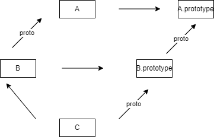

http://caibaojian.com/es6/

# ES6

## let和const

`let`和`const`。其中，`let`完全可以取代`var`，因为两者语义相同，而且`let`没有副作用。在`let`和`const`之间，建议优先使用`const`，尤其是在全局环境，不应该设置变量，只应设置常量。同时JavaScript 编译器会对`const`进行优化，所以多使用`const`，有利于提高程序的运行效率 

### 作用域

作用域定义了变量的可见性或可访问性。大白话来说，就是一个变量能不能被访问或引用，是由它的作用域决定的。

- **全局作用域（Global Scope）**

  在代码中任何地方都能访问到的对象拥有全局作用域，一般来说以下几种情形拥有全局作用域：

  （1）最外层函数和在最外层函数外面定义的变量拥有全局作用域

  （2）所有末定义直接赋值的变量自动声明为拥有全局作用域

  （3）所有window对象的属性拥有全局作用域

- **局部作用域（Local Scope）**

  - **函数作⽤域**：函数体中的局部变量只在函数执行时生成，函数执行完毕时局部变量即刻销毁

  - **块级作⽤域**：ES6引⼊了 let 和 const 关键字,和 var 关键字不同，在⼤括号中使⽤ let 和 const 声明的变量存 在于块级作⽤域中。在⼤括号之外不能访问这些变量

**作用域链**

当一个变量在当前作用域无法找到时，便会尝试寻找其外层的作用域，如果还找不到，再继续往上寻找

**好处**

1. `防止命名冲突`：你写了一万行的代码文件，如果没有作用域，你要给每个变量取独一无二的名字，屁股想想也知道是种折磨。
2. `安全性`： 变量不会被外部访问，保证了变量值不会被随意修改。你定义在函数内的变量，如果能在几千行之后不小心被修改，脚趾头想想也知道是种折磨。
3. `更高级的语法`：封装、面向对象等的实现离不开对变量的隔离，这是依靠作用域所达到的。

### var变量和函数提升

**词法分析阶段/预解析**：在JS代码执行之前，浏览器的解析器在**遇到 var 变量名 和function 整个函数** 提升到当前作用域的最前面。

- 变量提升只会提升变量名的声明，而不会提升变量的赋值初始化。

  ```js
  console.log(foo); // undefined
  var foo = '小花猫';
  console.log(foo)  // 小花猫
  ```

- **函数声明会提升而函数，表达式不会提升**

  ```js
  console.log(test1()) // 'this is test1'
  function test1(){
    return 'this is test1';
  }
  
  console.log(test2) // undefined
  var test2 = function(){
    return 'this is test2'
  }
  ```

- **函数提升的优先级大于变量提升的优先级**

  ```js
  let foo = 3;
  function hoistVariable() {
    var foo = foo || 5;
    console.log(foo); // 5
  }
  hoistVariable();
  
  //预编译后
  var foo;
  function hoistVariable() {
    foo = foo || 5; // 此时 等号右侧 foo 为 undefined
    console.log(foo); // 5
  }
  foo = 3
  hoistVariable();
  ```

### 不存在变量提升

暂时性死区: 区级作用域中存在`let`和`const`命令，这个区块对这些命令声明的变量，从一开始就形成了封闭作用域。**凡是在声明之前就使用这些变量，就会报错。** 

```javascript
function bar(x = y, y = 2) {
  return [x, y];
}
//(x = y, y = 2)作为函数参数作用域，父作用域
//函数内部是一个单独的子作用域
bar(); // 报错。参数x默认值等于另一个参数y，而此时y还没有声明，属于”死区“。
```

### 暂时性死区

只要块级作用域内存在`let`命令，它所声明的变量就“绑定”（binding）这个区域，不再受外部的影响。

```javascript
var tmp = 123;
if (true) {
  tmp = 'abc'; // Cannot access 'tmp' before initialization 
  let tmp;
}
```

上面代码中，存在全局变量`tmp`，但是块级作用域内`let`又声明了一个局部变量`tmp`，导致后者绑定这个块级作用域，所以在`let`声明变量前，对`tmp`赋值会报错。

ES6 明确规定，如果区块中存在`let`和`const`命令，这个区块对这些命令声明的变量，从一开始就形成了封闭作用域。凡是在声明之前就使用这些变量，就会报错。

### 不允许重复声明

```javascript
// 报错。let不允许在相同作用域内，重复声明同一个变量
function () {
  let a = 10;
  var a = 1;
}
```

### 块级作用域与函数

> 为什么需要块级作用域
>
> ```javascript
> //1.变量提升,内层变量可能会覆盖外层变量。 
> var tmp = new Date();
> function f() {
> console.log(tmp);
> if (false) {
>  var tmp = "hello world";
> }
> }
> f(); // undefined
> 
> //2.用来计数的循环变量泄露为全局变量。
> var s = 'hello';
> for (var i = 0; i < s.length; i++) {
> console.log(s[i]);
> }
> console.log(i); // 5
> ```

 `let`实际上为 JavaScript 新增了块级作用域。

```javascript
function f1() {
  let n = 5;
  if (true) {
    let n = 10;
  }
  console.log(n); // 5
}
```

上面的函数有两个代码块，都声明了变量`n`，运行后输出 5。这表示外层代码块不受内层代码块的影响,即**块级作用域也属于作用域链中**。如果两次都使用`var`定义变量`n`，最后输出的值才是 10。

### const命令

 `const`声明一个只读的常量。一旦声明，常量的值就不能改变。

 只在声明所在的块级作用域内有效 

 对于**复合类型**的变量，变量名不指向数据，而是指向数据所在的地址。`const`命令只是保证变量名指向的地址不变，并不保证该地址的数据不变  

### 顶层对象的属性

顶层对象，在浏览器环境指的是`window`对象，在Node指的是`global`对象。 

ES5之中，顶层对象的属性与全局变量是等价的。  这样的设计带来了几个很大的问题，首先是没法在编译时就报出变量未声明的错误，只有运行时才能知道 。 其次，程序员很容易不知不觉地就创建了全局变量 。 顶层对象的属性是到处可以读写的，这非常不利于模块化编程。 

 ES6为了改变这一点，一方面规定，为了保持兼容性，`var`命令和`function`命令声明的全局变量，依旧是顶层对象的属性；另一方面规定，`let`命令、`const`命令、`class`命令声明的全局变量，不属于顶层对象的属性。也就是说，从ES6开始，全局变量将逐步与顶层对象的属性脱钩。 

```javascript
var a = 1;
// 如果在Node的REPL环境，可以写成global.a
// 或者采用通用方法，写成this.a
window.a // 1

let b = 1;
window.b // undefined
```


## 变量的解构赋值

### 数组

如果等号的右边不是数组（或者严格地说，不是可遍历的结构，参见《Iterator》一章），那么将会报错。 

```javascript
1//“模式匹配”
var [a, b, c] = [1, 2, 3];
let [x, y, z] = new Set(["a", "b", "c"]);//x="a"
let [ , , third] = ["foo", "bar", "baz"]; //third = "baz"

2//另一种情况是不完全解构，即等号左边的模式，只匹配一部分的等号右边的数组。
let [x, y] = [1, 2, 3];//x = 1  y = 2
let [x, y, ...z] = ['a'];
x // "a"
y // undefined
z // []

3//嵌套
let [a, [b], d] = [1, [2, 3], 4];//b=2

4//展开运算符
let [head, ...tail] = [1, 2, 3, 4];//head=1	tail=[2, 3, 4]

5//只要某种数据结构具有 Iterator 接口，都可以采用数组形式的解构赋值。
function* fibs() {
  let a = 0;
  let b = 1;
  while (true) {
    yield a;
    [a, b] = [b, a + b];
  }
}
let [first, second, third, fourth, fifth, sixth] = fibs();
//sixth=5

6//解构赋值允许指定默认值。
var [x = 1] = [undefined]; x // 1
var [x = 1] = [null]; x // null
[x, y = 'b'] = ['a']; // x='a', y='b'
[x, y = 'b'] = ['a', undefined]; // x='a', y='b'

7//ES6 内部使用严格相等运算符（===），判断一个位置是否有值。所以，只有当一个数组成员严格等于undefined，默认值才会生效。
let [x = 1] = [undefined];//x=1
let [x = 1] = [null];//x=null
//undefined == null 	true
```

### 对象

```javascript
//数组的元素是按次序排列的，变量的取值由它的位置决定；对象的属性没有次序，变量必须与属性同名，才能取到正确的值。
var { foo, bar } = { foo: "aaa", bar: "bbb" };

//如果变量名与属性名不一致，必须写成下面这样。
const { foo: fooN, bar: barN } = { foo: "aaa", bar: "bbb" };
console.log(fooN, barN);

//
let obj = { first: 'hello', last: 'world' };
let { first: f, last: l } = obj;
//f = 'hello'
//l = 'world'

//与数组一样，解构也可以用于嵌套结构的对象。
const obj = {
  p: ["Hello", { y: "World" }],
};
const {
  p: [x, { y }],
}: any = obj;

console.log(x, y);//Hello World 

//对象的解构也可以指定默认值。
var {x = 3} = {};
x // 3
var {x, y = 5} = {x: 1};
x // 1
y // 5
const { x: y = 3 } = { x: 5 };
console.log(y); // 5

//默认值生效的条件是，对象的属性值严格等于undefined。
var {x = 3} = {x: undefined};
x // 3
var {x = 3} = {x: null};
x // null

```

- //注意点

  - /如果要将一个已经声明的变量用于解构赋值，必须非常小心。

    ```js
    //JavaScript 引擎会将{x}理解成一个代码块，从而发生语法错误。只有不将大括号写在行首，避免 JavaScript 将其解释为代码块，才能解决这个问题。
    let x;
    {x} = {x: 1};// SyntaxError: syntax error
    // 正确的写法
    let x;
    ({x} = {x: 1});
    ```

  - 由于数组本质是特殊的对象，因此可以对数组进行对象属性的解构。

    ```js
    let arr = [1, 2, 3];
    let {0 : first, [arr.length - 1] : last} = arr;
    first // 1
    last // 3
    ```

### 字符串

```javascript
const [a, b, c, d, e] = 'hello';
a // "h"
b // "e"
c // "l"
d // "l"
e // "o"
//类似数组的对象都有一个length属性
let {length : len} = 'hello';
len // 5
```

### 函数参数

```javascript
function add([x, y]){
  return x + y;
}
//函数add的参数表面上是一个数组，但在传入参数的那一刻，数组参数就被解构成变量x和y
add([1, 2]); // 3

[[1, 2], [3, 4]].map(([a, b]) => a + b);
// [ 3, 7 ]
```

**函数参数的默认值**

```js
function move({ x = 0, y = 0 } = {}) {
  console.log(x, y);
}

move({ x: 3, y: 8 })// [3, 8]
move({ x: 3 }); // [3, 0]
move({}); // [0, 0]
move(); // [0, 0]
```

```js
function foo({ x, y = 5 }) {
  console.log(x, y);
}

foo({}) // undefined 5
foo({ x: 1 }) // 1 5
foo({ x: 1, y: 2 }) // 1 2
//解构赋值没有设置默认值
foo() // TypeError: Cannot read property 'x' of undefined
```

**解构赋值的默认值**

```js
function move({ x, y } = { x: 0, y: 0 }) {
  console.log(x, y);
}

move({ x: 3, y: 8 }); // [3, 8]
move({ x: 3 }); // [3, undefined]
move({}); // [undefined, undefined]
move(); // [0, 0]
```

上面代码是为函数`move`的参数指定默认值，而不是为变量`x`和`y`指定默认值

**为了更容易理解，将上面两个代码合成一个，如下。**

```js
function move({x = 0, y = 0} = { x: 1, y: 1 }) {
    return [x, y];
}
// 解构赋值的模式 {x, y}
// 解构赋值的默认值 x = 0, y = 0

console.log(move({x: 3, y: 8})); // 被解构赋值的参数 : {x: 3, y: 8} 
// [3, 8]
console.log(move({x: 3})); // 被解构赋值的参数 : {x: 3} 
// [3, 0]
console.log(move({})); // 被解构赋值的参数 : {} 
// [0, 0]
console.log(move()); // 被解构赋值的参数 : {x: 1, y: 1} 
// [1, 1]
console.log(move(undefined)); // 被解构赋值的参数 : {x: 1, y: 1} 
// [1, 1]
```

### 变量的解构赋值的作用

（1）交换变量的值

（2）从函数返回多个值

```js
// 返回一个数组
function example() {
  return [1, 2, 3];
}
let [a, b, c] = example();
```

（3）函数参数的定义

```js
//有序的参数：
function f([x,y,z]){
    console.log([x,y,z])
}
f([1,2,3]);
//无序的参数：
function f({x,y,z}){
    console.log({x,z,y})
}
f({z:3,x:22,y:31});
```

（4）提取 JSON 数据

```js
let jsonData = {
  id: 42,
  status: "OK",
  data: [867, 5309]
};
let { id, status, data: number } = jsonData;
```

（4）函数参数的默认值(数组或者对象的默认值)

```js
function foo({ x, y = 5 }) {
  console.log(x, y);
}

foo({}) // undefined 5
foo({ x: 1 }) // 1 5
foo({ x: 1, y: 2 }) // 1 2
foo() // TypeError: Cannot read property 'x' of undefined
```

（5）遍历 Map 结构

```js
var map = new Map();
map.set('first' ,'hello');
map.set('second' ,'world');
for(let [key,value] of map){
	console.log(key + "is" + value);
}
```

（6）输入模块的指定方法

```js
const {first,second} = require('xxx');
```

## 数据类型扩展

### 字符串的扩展

#### String.fromCodePoint()

ES5 提供`String.fromCharCode()`方法，用于从 Unicode 码点返回对应字符，但是这个方法不能识别码点大于`0xFFFF`的字符。

```javascript
String.fromCharCode(0x20BB7)
// "ஷ"
```

上面代码中，`String.fromCharCode()`不能识别大于`0xFFFF`的码点，所以`0x20BB7`就发生了溢出，最高位`2`被舍弃了，最后返回码点`U+0BB7`对应的字符，而不是码点`U+20BB7`对应的字符。

ES6 提供了`String.fromCodePoint()`方法，可以识别大于`0xFFFF`的字符，弥补了`String.fromCharCode()`方法的不足。在作用上，正好与下面的`codePointAt()`方法相反。

```javascript
String.fromCodePoint(0x20BB7)
// "𠮷"
String.fromCodePoint(0x78, 0x1f680, 0x79) === 'x\uD83D\uDE80y'
// true
```

上面代码中，如果`String.fromCodePoint`方法有多个参数，则它们会被合并成一个字符串返回。

注意，`fromCodePoint`方法定义在`String`对象上，而`codePointAt`方法定义在字符串的实例对象上。

#### String.raw()

ES6 还为原生的 String 对象，提供了一个`raw()`方法。该方法返回一个斜杠都被转义（即斜杠前面再加一个斜杠）的字符串，往往用于模板字符串的处理方法。

```javascript
String.raw`Hi\n${2+3}!`
// 实际返回 "Hi\\n5!"，显示的是转义后的结果 "Hi\n5!"

String.raw`Hi\u000A!`;
// 实际返回 "Hi\\u000A!"，显示的是转义后的结果 "Hi\u000A!"
```

如果原字符串的斜杠已经转义，那么`String.raw()`会进行再次转义。

```javascript
String.raw`Hi\\n`
// 返回 "Hi\\\\n"

String.raw`Hi\\n` === "Hi\\\\n" // true
```

`String.raw()`方法可以作为处理模板字符串的基本方法，它会将所有变量替换，而且对斜杠进行转义，方便下一步作为字符串来使用。

`String.raw()`本质上是一个正常的函数，只是专用于模板字符串的标签函数。如果写成正常函数的形式，它的第一个参数，应该是一个具有`raw`属性的对象，且`raw`属性的值应该是一个数组，对应模板字符串解析后的值。

```javascript
// `foo${1 + 2}bar`
// 等同于
String.raw({ raw: ['foo', 'bar'] }, 1 + 2) // "foo3bar"
```

上面代码中，`String.raw()`方法的第一个参数是一个对象，它的`raw`属性等同于原始的模板字符串解析后得到的数组。

作为函数，`String.raw()`的代码实现基本如下。

```javascript
String.raw = function (strings, ...values) {
  let output = '';
  let index;
  for (index = 0; index < values.length; index++) {
    output += strings.raw[index] + values[index];
  }

  output += strings.raw[index]
  return output;
}
```

#### codePointAt()

JavaScript 内部，字符以 UTF-16 的格式储存，每个字符固定为`2`个字节。对于那些需要`4`个字节储存的字符（Unicode 码点大于`0xFFFF`的字符），JavaScript 会认为它们是两个字符。

```javascript
var s = "𠮷";

s.length // 2
s.charAt(0) // ''
s.charAt(1) // ''
s.charCodeAt(0) // 55362
s.charCodeAt(1) // 57271
```

上面代码中，汉字“𠮷”（注意，这个字不是“吉祥”的“吉”）的码点是`0x20BB7`，UTF-16 编码为`0xD842 0xDFB7`（十进制为`55362 57271`），需要`4`个字节储存。对于这种`4`个字节的字符，JavaScript 不能正确处理，字符串长度会误判为`2`，而且`charAt()`方法无法读取整个字符，`charCodeAt()`方法只能分别返回前两个字节和后两个字节的值。

ES6 提供了`codePointAt()`方法，能够正确处理 4 个字节储存的字符，返回一个字符的码点。

```javascript
let s = '𠮷a';

s.codePointAt(0) // 134071
s.codePointAt(1) // 57271

s.codePointAt(2) // 97
```

`codePointAt()`方法的参数，是字符在字符串中的位置（从 0 开始）。上面代码中，JavaScript 将“𠮷a”视为三个字符，codePointAt 方法在第一个字符上，正确地识别了“𠮷”，返回了它的十进制码点 134071（即十六进制的`20BB7`）。在第二个字符（即“𠮷”的后两个字节）和第三个字符“a”上，`codePointAt()`方法的结果与`charCodeAt()`方法相同。

总之，`codePointAt()`方法会正确返回 32 位的 UTF-16 字符的码点。对于那些两个字节储存的常规字符，它的返回结果与`charCodeAt()`方法相同。

`codePointAt()`方法返回的是码点的十进制值，如果想要十六进制的值，可以使用`toString()`方法转换一下。

```javascript
let s = '𠮷a';

s.codePointAt(0).toString(16) // "20bb7"
s.codePointAt(2).toString(16) // "61"
```

你可能注意到了，`codePointAt()`方法的参数，仍然是不正确的。比如，上面代码中，字符`a`在字符串`s`的正确位置序号应该是 1，但是必须向`codePointAt()`方法传入 2。解决这个问题的一个办法是使用`for...of`循环，因为它会正确识别 32 位的 UTF-16 字符。

```javascript
let s = '𠮷a';
for (let ch of s) {
  console.log(ch.codePointAt(0).toString(16));
}
// 20bb7
// 61
```

另一种方法也可以，使用扩展运算符（`...`）进行展开运算。

```javascript
let arr = [...'𠮷a']; // arr.length === 2
arr.forEach(
  ch => console.log(ch.codePointAt(0).toString(16))
);
// 20bb7
// 61
```

`codePointAt()`方法是测试一个字符由两个字节还是由四个字节组成的最简单方法。

```javascript
function is32Bit(c) {
  return c.codePointAt(0) > 0xFFFF;
}

is32Bit("𠮷") // true
is32Bit("a") // false
```

#### normalize()

许多欧洲语言有语调符号和重音符号。为了表示它们，Unicode 提供了两种方法。一种是直接提供带重音符号的字符，比如`Ǒ`（\u01D1）。另一种是提供合成符号（combining character），即原字符与重音符号的合成，两个字符合成一个字符，比如`O`（\u004F）和`ˇ`（\u030C）合成`Ǒ`（\u004F\u030C）。

这两种表示方法，在视觉和语义上都等价，但是 JavaScript 不能识别。

```javascript
'\u01D1'==='\u004F\u030C' //false

'\u01D1'.length // 1
'\u004F\u030C'.length // 2
```

上面代码表示，JavaScript 将合成字符视为两个字符，导致两种表示方法不相等。

ES6 提供字符串实例的`normalize()`方法，用来将字符的不同表示方法统一为同样的形式，这称为 Unicode 正规化。

```javascript
'\u01D1'.normalize() === '\u004F\u030C'.normalize()
// true
```

`normalize`方法可以接受一个参数来指定`normalize`的方式，参数的四个可选值如下。

- `NFC`，默认参数，表示“标准等价合成”（Normalization Form Canonical Composition），返回多个简单字符的合成字符。所谓“标准等价”指的是视觉和语义上的等价。
- `NFD`，表示“标准等价分解”（Normalization Form Canonical Decomposition），即在标准等价的前提下，返回合成字符分解的多个简单字符。
- `NFKC`，表示“兼容等价合成”（Normalization Form Compatibility Composition），返回合成字符。所谓“兼容等价”指的是语义上存在等价，但视觉上不等价，比如“囍”和“喜喜”。（这只是用来举例，`normalize`方法不能识别中文。）
- `NFKD`，表示“兼容等价分解”（Normalization Form Compatibility Decomposition），即在兼容等价的前提下，返回合成字符分解的多个简单字符。

```javascript
'\u004F\u030C'.normalize('NFC').length // 1
'\u004F\u030C'.normalize('NFD').length // 2
```

上面代码表示，`NFC`参数返回字符的合成形式，`NFD`参数返回字符的分解形式。

不过，`normalize`方法目前不能识别三个或三个以上字符的合成。这种情况下，还是只能使用正则表达式，通过 Unicode 编号区间判断。

#### includes(), startsWith(), endsWith()

传统上，JavaScript 只有`indexOf`方法，可以用来确定一个字符串是否包含在另一个字符串中。ES6 又提供了三种新方法。

- **includes()**：返回布尔值，表示是否找到了参数字符串。
- **startsWith()**：返回布尔值，表示参数字符串是否在原字符串的头部。
- **endsWith()**：返回布尔值，表示参数字符串是否在原字符串的尾部。

```javascript
let s = 'Hello world!';

s.startsWith('Hello') // true
s.endsWith('!') // true
s.includes('o') // true
```

这三个方法都支持第二个参数，表示开始搜索的位置。

```javascript
let s = 'Hello world!';

s.startsWith('world', 6) // true
s.endsWith('Hello', 5) // true
s.includes('Hello', 6) // false
```

上面代码表示，使用第二个参数`n`时，`endsWith`的行为与其他两个方法有所不同。它针对前`n`个字符，而其他两个方法针对从第`n`个位置直到字符串结束。

#### repeat()

`repeat`方法返回一个新字符串，表示将原字符串重复`n`次。

```javascript
'x'.repeat(3) // "xxx"
'hello'.repeat(2) // "hellohello"
'na'.repeat(0) // ""
```

参数如果是小数，会被取整。

```javascript
'na'.repeat(2.9) // "nana"
```

如果`repeat`的参数是负数或者`Infinity`，会报错。

```javascript
'na'.repeat(Infinity)
// RangeError
'na'.repeat(-1)
// RangeError
```

但是，如果参数是 0 到-1 之间的小数，则等同于 0，这是因为会先进行取整运算。0 到-1 之间的小数，取整以后等于`-0`，`repeat`视同为 0。

```javascript
'na'.repeat(-0.9) // ""
```

参数`NaN`等同于 0。

```javascript
'na'.repeat(NaN) // ""
```

如果`repeat`的参数是字符串，则会先转换成数字。

```javascript
'na'.repeat('na') // ""
'na'.repeat('3') // "nanana"
```

#### padStart()，padEnd()

ES2017 引入了字符串补全长度的功能。如果某个字符串不够指定长度，会在头部或尾部补全。`padStart()`用于头部补全，`padEnd()`用于尾部补全。

```javascript
'x'.padStart(5, 'ab') // 'ababx'
'x'.padStart(4, 'ab') // 'abax'

'x'.padEnd(5, 'ab') // 'xabab'
'x'.padEnd(4, 'ab') // 'xaba'
```

上面代码中，`padStart()`和`padEnd()`一共接受两个参数，第一个参数是字符串补全生效的最大长度，第二个参数是用来补全的字符串。

如果原字符串的长度，等于或大于最大长度，则字符串补全不生效，返回原字符串。

```javascript
'xxx'.padStart(2, 'ab') // 'xxx'
'xxx'.padEnd(2, 'ab') // 'xxx'
```

如果用来补全的字符串与原字符串，两者的长度之和超过了最大长度，则会截去超出位数的补全字符串。

```javascript
'abc'.padStart(10, '0123456789')
// '0123456abc'
```

如果省略第二个参数，默认使用空格补全长度。

```javascript
'x'.padStart(4) // '   x'
'x'.padEnd(4) // 'x   '
```

`padStart()`的常见用途是为数值补全指定位数。下面代码生成 10 位的数值字符串。

```javascript
'1'.padStart(10, '0') // "0000000001"
'12'.padStart(10, '0') // "0000000012"
'123456'.padStart(10, '0') // "0000123456"
```

另一个用途是提示字符串格式。

```javascript
'12'.padStart(10, 'YYYY-MM-DD') // "YYYY-MM-12"
'09-12'.padStart(10, 'YYYY-MM-DD') // "YYYY-09-12"
```

#### trimStart()，trimEnd()

[ES2019](https://github.com/tc39/proposal-string-left-right-trim) 对字符串实例新增了`trimStart()`和`trimEnd()`这两个方法。它们的行为与`trim()`一致，`trimStart()`消除字符串头部的空格，`trimEnd()`消除尾部的空格。它们返回的都是新字符串，不会修改原始字符串。

```javascript
const s = '  abc  ';

s.trim() // "abc"
s.trimStart() // "abc  "
s.trimEnd() // "  abc"
```

上面代码中，`trimStart()`只消除头部的空格，保留尾部的空格。`trimEnd()`也是类似行为。

除了空格键，这两个方法对字符串头部（或尾部）的 tab 键、换行符等不可见的空白符号也有效。

浏览器还部署了额外的两个方法，`trimLeft()`是`trimStart()`的别名，`trimRight()`是`trimEnd()`的别名。

#### matchAll()

`matchAll()`方法返回一个正则表达式在当前字符串的所有匹配，详见《正则的扩展》的一章。

#### replaceAll()

历史上，字符串的实例方法`replace()`只能替换第一个匹配。

```javascript
'aabbcc'.replace('b', '_')
// 'aa_bcc'
```

上面例子中，`replace()`只将第一个`b`替换成了下划线。

如果要替换所有的匹配，不得不使用正则表达式的`g`修饰符。

```javascript
'aabbcc'.replace(/b/g, '_')
// 'aa__cc'
```

正则表达式毕竟不是那么方便和直观，[ES2021](https://github.com/tc39/proposal-string-replaceall) 引入了`replaceAll()`方法，可以一次性替换所有匹配。

```javascript
'aabbcc'.replaceAll('b', '_')
// 'aa__cc'
```

它的用法与`replace()`相同，返回一个新字符串，不会改变原字符串。

```javascript
String.prototype.replaceAll(searchValue, replacement)
```

上面代码中，`searchValue`是搜索模式，可以是一个字符串，也可以是一个全局的正则表达式（带有`g`修饰符）。

如果`searchValue`是一个不带有`g`修饰符的正则表达式，`replaceAll()`会报错。这一点跟`replace()`不同。

```javascript
// 不报错
'aabbcc'.replace(/b/, '_')

// 报错
'aabbcc'.replaceAll(/b/, '_')
```

上面例子中，`/b/`不带有`g`修饰符，会导致`replaceAll()`报错。

`replaceAll()`的第二个参数`replacement`是一个字符串，表示替换的文本，其中可以使用一些特殊字符串。

- `$&`：匹配的字符串。
- `$` `：匹配结果前面的文本。
- `$'`：匹配结果后面的文本。
- `$n`：匹配成功的第`n`组内容，`n`是从1开始的自然数。这个参数生效的前提是，第一个参数必须是正则表达式。
- `$$`：指代美元符号`$`。

下面是一些例子。

```javascript
// $& 表示匹配的字符串，即`b`本身
// 所以返回结果与原字符串一致
'abbc'.replaceAll('b', '$&')
// 'abbc'

// $` 表示匹配结果之前的字符串
// 对于第一个`b`，$` 指代`a`
// 对于第二个`b`，$` 指代`ab`
'abbc'.replaceAll('b', '$`')
// 'aaabc'

// $' 表示匹配结果之后的字符串
// 对于第一个`b`，$' 指代`bc`
// 对于第二个`b`，$' 指代`c`
'abbc'.replaceAll('b', `$'`)
// 'abccc'

// $1 表示正则表达式的第一个组匹配，指代`ab`
// $2 表示正则表达式的第二个组匹配，指代`bc`
'abbc'.replaceAll(/(ab)(bc)/g, '$2$1')
// 'bcab'

// $$ 指代 $
'abc'.replaceAll('b', '$$')
// 'a$c'
```

`replaceAll()`的第二个参数`replacement`除了为字符串，也可以是一个函数，该函数的返回值将替换掉第一个参数`searchValue`匹配的文本。

```javascript
'aabbcc'.replaceAll('b', () => '_')
// 'aa__cc'
```

上面例子中，`replaceAll()`的第二个参数是一个函数，该函数的返回值会替换掉所有`b`的匹配。

这个替换函数可以接受多个参数。第一个参数是捕捉到的匹配内容，第二个参数捕捉到是组匹配（有多少个组匹配，就有多少个对应的参数）。此外，最后还可以添加两个参数，倒数第二个参数是捕捉到的内容在整个字符串中的位置，最后一个参数是原字符串。

```javascript
const str = '123abc456';
const regex = /(\d+)([a-z]+)(\d+)/g;

function replacer(match, p1, p2, p3, offset, string) {
  return [p1, p2, p3].join(' - ');
}

str.replaceAll(regex, replacer)
// 123 - abc - 456
```

上面例子中，正则表达式有三个组匹配，所以`replacer()`函数的第一个参数`match`是捕捉到的匹配内容（即字符串`123abc456`），后面三个参数`p1`、`p2`、`p3`则依次为三个组匹配。

#### at()

`at()`方法接受一个整数作为参数，返回参数指定位置的字符，支持负索引（即倒数的位置）。

```javascript
const str = 'hello';
str.at(1) // "e"
str.at(-1) // "o"
```

如果参数位置超出了字符串范围，`at()`返回`undefined`。

该方法来自数组添加的`at()`方法，目前还是一个第三阶段的提案，可以参考《数组》一章的介绍。

### 正则的扩展

 字符串对象共有4个方法，可以使用正则表达式：`match()`、`replace()`、`search()`和`split()`。 

ES6对正则表达式添加了`u`修饰符，含义为“Unicode模式”，用来正确处理大于`\uFFFF`的Unicode字符。也就是说，会正确处理四个字节的UTF-16编码。

```javascript
/^\uD83D/u.test('\uD83D\uDC2A')
// false
/^\uD83D/.test('\uD83D\uDC2A')
// true
```

对于码点大于`0xFFFF`的Unicode字符，点字符不能识别，必须加上`u`修饰符。

```javascript
var s = '𠮷';

/^.$/.test(s) // false
/^.$/u.test(s) // true
```

 ES6新增了使用大括号表示Unicode字符，这种表示法在正则表达式中必须加上`u`修饰符，才能识别。  使用`u`修饰符后，所有量词都会正确识别码点大于`0xFFFF`的Unicode字符。 

 除了`u`修饰符，ES6还为正则表达式添加了`y`修饰符，叫做“粘连”（sticky）修饰符。 

 `g`修饰符只要剩余位置中存在匹配就可，而`y`修饰符确保匹配必须从剩余的第一个位置开始，这也就是“粘连”的涵义。 

### 运算符

#### 指数运算符

ES2016 新增了一个指数运算符（`**`）。

```javascript
2 ** 2 // 4
2 ** 3 // 8
```

这个运算符的一个特点是右结合，而不是常见的左结合。多个指数运算符连用时，是从最右边开始计算的。

```javascript
// 相当于 2 ** (3 ** 2)
2 ** 3 ** 2
// 512
```

上面代码中，首先计算的是第二个指数运算符，而不是第一个。

指数运算符可以与等号结合，形成一个新的赋值运算符（`**=`）。

```javascript
let a = 1.5;
a **= 2;
// 等同于 a = a * a;

let b = 4;
b **= 3;
// 等同于 b = b * b * b;
```

#### 链判断运算符

编程实务中，如果读取对象内部的某个属性，往往需要判断一下，属性的上层对象是否存在。比如，读取`message.body.user.firstName`这个属性，安全的写法是写成下面这样。

```javascript
// 错误的写法
const  firstName = message.body.user.firstName || 'default';

// 正确的写法
const firstName = (message
  && message.body
  && message.body.user
  && message.body.user.firstName) || 'default';
```

上面例子中，`firstName`属性在对象的第四层，所以需要判断四次，每一层是否有值。

三元运算符`?:`也常用于判断对象是否存在。

```javascript
const fooInput = myForm.querySelector('input[name=foo]')
const fooValue = fooInput ? fooInput.value : undefined
```

上面例子中，必须先判断`fooInput`是否存在，才能读取`fooInput.value`。

这样的层层判断非常麻烦，因此 [ES2020](https://github.com/tc39/proposal-optional-chaining) 引入了“链判断运算符”（optional chaining operator）`?.`，简化上面的写法。

```javascript
const firstName = message?.body?.user?.firstName || 'default';
const fooValue = myForm.querySelector('input[name=foo]')?.value
```

上面代码使用了`?.`运算符，直接在链式调用的时候判断，左侧的对象是否为`null`或`undefined`。如果是的，就不再往下运算，而是返回`undefined`。

下面是判断对象方法是否存在，如果存在就立即执行的例子。

```javascript
iterator.return?.()
```

上面代码中，`iterator.return`如果有定义，就会调用该方法，否则`iterator.return`直接返回`undefined`，不再执行`?.`后面的部分。

对于那些可能没有实现的方法，这个运算符尤其有用。

```javascript
if (myForm.checkValidity?.() === false) {
  // 表单校验失败
  return;
}
```

上面代码中，老式浏览器的表单对象可能没有`checkValidity()`这个方法，这时`?.`运算符就会返回`undefined`，判断语句就变成了`undefined === false`，所以就会跳过下面的代码。

链判断运算符`?.`有三种写法。

- `obj?.prop` // 对象属性是否存在
- `obj?.[expr]` // 同上
- `func?.(...args)` // 函数或对象方法是否存在

下面是`obj?.[expr]`用法的一个例子。

```bash
let hex = "#C0FFEE".match(/#([A-Z]+)/i)?.[1];
```

上面例子中，字符串的`match()`方法，如果没有发现匹配会返回`null`，如果发现匹配会返回一个数组，`?.`运算符起到了判断作用。

下面是`?.`运算符常见形式，以及不使用该运算符时的等价形式。

```javascript
a?.b
// 等同于
a == null ? undefined : a.b

a?.[x]
// 等同于
a == null ? undefined : a[x]

a?.b()
// 等同于
a == null ? undefined : a.b()

a?.()
// 等同于
a == null ? undefined : a()
```

上面代码中，特别注意后两种形式，如果`a?.b()`和`a?.()`。如果`a?.b()`里面的`a.b`有值，但不是函数，不可调用，那么`a?.b()`是会报错的。`a?.()`也是如此，如果`a`不是`null`或`undefined`，但也不是函数，那么`a?.()`会报错。

使用这个运算符，有几个注意点。

（1）短路机制

本质上，`?.`运算符相当于一种短路机制，只要不满足条件，就不再往下执行。

```javascript
a?.[++x]
// 等同于
a == null ? undefined : a[++x]
```

上面代码中，如果`a`是`undefined`或`null`，那么`x`不会进行递增运算。也就是说，链判断运算符一旦为真，右侧的表达式就不再求值。

（2）括号的影响

如果属性链有圆括号，链判断运算符对圆括号外部没有影响，只对圆括号内部有影响。

```javascript
(a?.b).c
// 等价于
(a == null ? undefined : a.b).c
```

上面代码中，`?.`对圆括号外部没有影响，不管`a`对象是否存在，圆括号后面的`.c`总是会执行。

一般来说，使用`?.`运算符的场合，不应该使用圆括号。

（3）报错场合

以下写法是禁止的，会报错。

```javascript
// 构造函数
new a?.()
new a?.b()

// 链判断运算符的右侧有模板字符串
a?.`{b}`
a?.b`{c}`

// 链判断运算符的左侧是 super
super?.()
super?.foo

// 链运算符用于赋值运算符左侧
a?.b = c
```

（4）右侧不得为十进制数值

为了保证兼容以前的代码，允许`foo?.3:0`被解析成`foo ? .3 : 0`，因此规定如果`?.`后面紧跟一个十进制数字，那么`?.`不再被看成是一个完整的运算符，而会按照三元运算符进行处理，也就是说，那个小数点会归属于后面的十进制数字，形成一个小数。

#### **Null 判断运算符**

读取对象属性的时候，如果某个属性的值是`null`或`undefined`，有时候需要为它们指定默认值。常见做法是通过`||`运算符指定默认值。

```javascript
const headerText = response.settings.headerText || 'Hello, world!';
const animationDuration = response.settings.animationDuration || 300;
const showSplashScreen = response.settings.showSplashScreen || true;
```

上面的三行代码都通过`||`运算符指定默认值，但是这样写是错的。开发者的原意是，只要属性的值为`null`或`undefined`，默认值就会生效，但是属性的值如果为空字符串或`false`或`0`，默认值也会生效。

为了避免这种情况，[ES2020](https://github.com/tc39/proposal-nullish-coalescing) 引入了一个新的 Null 判断运算符`??`。它的行为类似`||`，但是只有运算符左侧的值为`null`或`undefined`时，才会返回右侧的值。

```javascript
const headerText = response.settings.headerText ?? 'Hello, world!';
const animationDuration = response.settings.animationDuration ?? 300;
const showSplashScreen = response.settings.showSplashScreen ?? true;
```

上面代码中，默认值只有在左侧属性值为`null`或`undefined`时，才会生效。

这个运算符的一个目的，就是跟链判断运算符`?.`配合使用，为`null`或`undefined`的值设置默认值。

```javascript
const animationDuration = response.settings?.animationDuration ?? 300;
```

上面代码中，如果`response.settings`是`null`或`undefined`，或者`response.settings.animationDuration`是`null`或`undefined`，就会返回默认值300。也就是说，这一行代码包括了两级属性的判断。

这个运算符很适合判断函数参数是否赋值。

```javascript
function Component(props) {
  const enable = props.enabled ?? true;
  // …
}
```

上面代码判断`props`参数的`enabled`属性是否赋值，基本等同于下面的写法。

```javascript
function Component(props) {
  const {
    enabled: enable = true,
  } = props;
  // …
}
```

`??`本质上是逻辑运算，它与其他两个逻辑运算符`&&`和`||`有一个优先级问题，它们之间的优先级到底孰高孰低。优先级的不同，往往会导致逻辑运算的结果不同。

现在的规则是，如果多个逻辑运算符一起使用，必须用括号表明优先级，否则会报错。

```javascript
// 报错
lhs && middle ?? rhs
lhs ?? middle && rhs
lhs || middle ?? rhs
lhs ?? middle || rhs
```

上面四个表达式都会报错，必须加入表明优先级的括号。

```javascript
(lhs && middle) ?? rhs;
lhs && (middle ?? rhs);

(lhs ?? middle) && rhs;
lhs ?? (middle && rhs);

(lhs || middle) ?? rhs;
lhs || (middle ?? rhs);

(lhs ?? middle) || rhs;
lhs ?? (middle || rhs);
```

#### 逻辑赋值运算符

ES2021 引入了三个新的[逻辑赋值运算符](https://github.com/tc39/proposal-logical-assignment)（logical assignment operators），将逻辑运算符与赋值运算符进行结合。

```javascript
// 或赋值运算符
x ||= y
// 等同于
x || (x = y)

// 与赋值运算符
x &&= y
// 等同于
x && (x = y)

// Null 赋值运算符
x ??= y
// 等同于
x ?? (x = y)
```

这三个运算符`||=`、`&&=`、`??=`相当于先进行逻辑运算，然后根据运算结果，再视情况进行赋值运算。

它们的一个用途是，为变量或属性设置默认值。

```javascript
// 老的写法
user.id = user.id || 1;

// 新的写法
user.id ||= 1;
```

上面示例中，`user.id`属性如果不存在，则设为`1`，新的写法比老的写法更紧凑一些。

下面是另一个例子。

```javascript
function example(opts) {
  opts.foo = opts.foo ?? 'bar';
  opts.baz ?? (opts.baz = 'qux');
}
```

上面示例中，参数对象`opts`如果不存在属性`foo`和属性`baz`，则为这两个属性设置默认值。有了“Null 赋值运算符”以后，就可以统一写成下面这样。

```javascript
function example(opts) {
  opts.foo ??= 'bar';
  opts.baz ??= 'qux';
}
```

#### `#!`命令

Unix 的命令行脚本都支持`#!`命令，又称为 Shebang 或 Hashbang。这个命令放在脚本的第一行，用来指定脚本的执行器。

比如 Bash 脚本的第一行。

```bash
#!/bin/sh
```

Python 脚本的第一行。

```python
#!/usr/bin/env python
```

[ES2023](https://github.com/tc39/proposal-hashbang) 为 JavaScript 脚本引入了`#!`命令，写在脚本文件或者模块文件的第一行。

```javascript
// 写在脚本文件第一行
#!/usr/bin/env node
'use strict';
console.log(1);

// 写在模块文件第一行
#!/usr/bin/env node
export {};
console.log(1);
```

有了这一行以后，Unix 命令行就可以直接执行脚本。

```bash
# 以前执行脚本的方式
$ node hello.js

# hashbang 的方式
$ ./hello.js
```

对于 JavaScript 引擎来说，会把`#!`理解成注释，忽略掉这一行。

### 数值的扩展

#### 二进制和八进制表达方式

ES6提供了二进制和八进制数值的新的写法，分别用前缀`0b`（或`0B`）和`0o`（或`0O`）表示。

```javascript
0b111110111 === 503 // true
0o767 === 503 // true
```

从ES5开始，在严格模式之中，八进制就不再允许使用前缀`0`表示，ES6进一步明确，要使用前缀`0o`表示。

```javascript
// 非严格模式
(function(){
  console.log(0o11 === 011);
})() // true

// 严格模式
(function(){
  'use strict';
  console.log(0o11 === 011);
})() // Uncaught SyntaxError: Octal literals are not allowed in strict mode.
```

如果要将`0b`和`0o`前缀的字符串数值转为十进制，要使用`Number`方法。

```javascript
Number('0b111')  // 7
Number('0o10')  // 8
```

#### isFinite和isNaN

`Number.isFinite()`用来检查一个数值是否为有限的（finite）。

```javascript
Number.isFinite(15); // true
Number.isFinite(0.8); // true
Number.isFinite(NaN); // false
Number.isFinite(Infinity); // false
Number.isFinite(-Infinity); // false
Number.isFinite('foo'); // false
Number.isFinite('15'); // false
Number.isFinite(true); // false
```

`Number.isNaN()`用来检查一个值是否为`NaN`。

```javascript
Number.isNaN(NaN) // true
Number.isNaN(15) // false
Number.isNaN('15') // false
Number.isNaN(true) // false
Number.isNaN(9/NaN) // true
Number.isNaN('true'/0) // true
Number.isNaN('true'/'true') // true
```

它们与传统的全局方法`isFinite()`和`isNaN()`的区别在于，传统方法先调用`Number()`将非数值的值转为数值，再进行判断，而这两个新方法只对数值有效，非数值一律返回`false`。

#### parseInt和parseFloat 

```javascript
// ES5的写法
parseInt('12.34') // 12
parseFloat('123.45#') // 123.45
// ES6的写法，这样做的目的，是逐步减少全局性方法，使得语言逐步模块化。
Number.parseInt('12.34') // 12
Number.parseFloat('123.45#') // 123.45
```

#### isInteger 

 `Number.isInteger()`用来判断一个数值是否为整数。需要注意的是，在JavaScript内部，整数和浮点数是同样的储存方法，所以3和3.0被视为同一个值。

```javascript
Number.isInteger(25) // true
Number.isInteger(25.0) // true
```

#### Math对象的扩展

##### Math.trunc()

```js
//1.
//Math.trunc方法用于去除一个数的小数部分，返回整数部分。
Math.trunc(4.1) // 4
Math.trunc(4.9) // 4
Math.trunc(-4.1) // -4
Math.trunc(-4.9) // -4
Math.trunc(-0.1234) // -0
//对于非数值，Math.trunc内部使用Number方法将其先转为数值。
Math.trunc('123.456') // 123
Math.trunc(true) //1
Math.trunc(false) // 0
Math.trunc(null) // 0
//对于空值和无法截取整数的值，返回NaN。
Math.trunc(NaN);      // NaN
Math.trunc('foo');    // NaN
Math.trunc();         // NaN
Math.trunc(undefined) // NaN
```

##### Math.sign()

`Math.sign`方法用来判断一个数到底是正数、负数、还是零。

它会返回五种值。

- 参数为正数，返回+1；
- 参数为负数，返回-1；
- 参数为0，返回0；
- 参数为-0，返回-0;
- 其他值，返回NaN。

```js
Math.sign('')  // 0
Math.sign(true)  // +1
Math.sign(false)  // 0
Math.sign(null)  // 0
Math.sign('9')  // +1
Math.sign('foo')  // NaN
Math.sign()  // NaN
Math.sign(undefined)  // NaN
```

##### Math.cbrt()

方法用于计算一个数的立方根。对于非数值，Math.cbrt()方法内部也是先使用Number()方法将其转为数值。

##### Math.logn()

`Math.log2(x)`返回以 2 为底的`x`的对数。如果`x`小于 0，则返回 NaN。

### 数组的扩展

#### from

`Array.from`方法用于将两类对象转为真正的数组：**类似数组的对象（array-like object）和可遍历（iterable）的对象**（包括ES6新增的数据结构Set和Map）。

```javascript
//类似数组的对象
let arrayLike = {
    '0': 'a',
    '1': 'b',
    '2': 'c',
    length: 3
};

// ES5的写法
var arr1 = [].slice.call(arrayLike); // ['a', 'b', 'c']

// ES6的写法
let arr2 = Array.from(arrayLike); // ['a', 'b', 'c']
```

实际应用中，常见的类似数组的对象是DOM操作返回的NodeList集合，以及函数内部的`arguments`对象。`Array.from`都可以将它们转为真正的数组。

只要是部署了**Iterator**接口的数据结构，`Array.from`都能将其转为数组。

```js
// 可遍历（iterable）
Array.from('123123')
// ['1', '2', '3', '1', '2', '3']

let namesSet = new Set(['a', 'b'])
Array.from(namesSet) // ['a', 'b']
```

**值得提醒的是，扩展运算符（...）也可以将某些数据结构转为数组。**

```javascript
// arguments对象
function foo() {
  console.log(arguments); //{ [Iterator]  0: 1, 1: 2 }
  var args = [...arguments];
  return args
}
foo(1,2)

// NodeList对象
[...document.querySelectorAll('div')]
```

扩展运算符背后调用的是遍历器接口（`Symbol.iterator`），如果一个对象没有部署这个接口，就无法转换。`Array.from`方法则是还支持类似数组的对象。所谓类似数组的对象，本质特征只有一点，即必须有`length`属性。因此，任何有`length`属性的对象，都可以通过`Array.from`方法转为数组，而此时扩展运算符就无法转换。

```javascript
Array.from({ length: 3 });
// [ undefined, undefined, undefined ]
```

`Array.from`还可以接受第二个参数，作用类似于数组的`map`方法，用来对每个元素进行处理，将处理后的值放入返回的数组。

```javascript
Array.from(arrayLike, x => x * x);
// 等同于
Array.from(arrayLike).map(x => x * x);

Array.from([1, 2, 3], (x) => x * x)
// [1, 4, 9]
```

下面的例子是取出一组DOM节点的文本内容。

```javascript
let spans = document.querySelectorAll('span.name');

// map()
let names1 = Array.prototype.map.call(spans, s => s.textContent);

// Array.from()
let names2 = Array.from(spans, s => s.textContent)
```

#### Array.of

`Array.of`方法用于将一组值，转换为数组。

```javascript
Array.of(3, 11, 8) // [3,11,8]
Array.of(3) // [3]
Array.of(3).length // 1
```

这个方法的主要目的，是弥补数组构造函数`Array()`的不足。因为参数个数的不同，会导致`Array()`的行为有差异。

```javascript
Array() // []
//参数个数只有一个时，实际上是指定数组的长度。
Array(3) // [, , ,]
Array(3, 11, 8) // [3, 11, 8]
```

`Array.of`基本上可以用来替代`Array()`或`new Array()`，并且不存在由于参数不同而导致的重载。它的行为非常统一。

```javascript
Array.of() // []
Array.of(undefined) // [undefined]
Array.of(1) // [1]
Array.of(1, 2) // [1, 2]
```

#### copyWithin

数组实例的`copyWithin`方法，在当前数组内部，将指定位置的成员复制到其他位置（会覆盖原有成员），然后返回当前数组。也就是说，使用这个方法，**会修改当前数组**。

```javascript
Array.prototype.copyWithin(target, start = 0, end = this.length)
```

它接受三个参数。

- target（必需）：从该位置开始替换数据。
- start（可选）：从该位置开始读取数据，默认为0。如果为负值，表示倒数。
- end（可选）：到该位置前停止读取数据，默认等于数组长度。如果为负值，表示倒数。

这三个参数都应该是数值，如果不是，会自动转为数值。

```javascript
[1, 2, 3, 4, 5].copyWithin(0, 3)
// [4, 5, 3, 4, 5]
```

上面代码表示将从3号位直到数组结束的成员（4和5），复制到从0号位开始的位置，结果覆盖了原来的1和2。

```js
// 将3号位复制到0号位
[1, 2, 3, 4, 5].copyWithin(0, 3, 4)
// [4, 2, 3, 4, 5]
```

#### find和findIndex

数组实例的`find()`方法，用于找出第一个符合条件的数组成员。它的参数是一个回调函数，所有数组成员依次执行该回调函数，直到找出第一个返回值为`true`的成员，然后返回该成员。如果没有符合条件的成员，则返回`undefined`。

```javascript
[1, 4, -5, 10].find((n) => n < 0)
// -5
```

上面代码找出数组中第一个小于 0 的成员。

```javascript
[1, 5, 10, 15].find(function(value, index, arr) {
  return value > 9;
}) // 10
```

上面代码中，`find()`方法的回调函数可以接受三个参数，依次为当前的值、当前的位置和原数组。

数组实例的`findIndex()`方法的用法与`find()`方法非常类似，返回第一个符合条件的数组成员的位置，如果所有成员都不符合条件，则返回`-1`。

```javascript
[1, 5, 10, 15].findIndex(function(value, index, arr) {
  return value > 9;
}) // 2
```

这两个方法都可以接受第二个参数，用来绑定回调函数的`this`对象。

```javascript
function f(v){
  return v > this.age;
}
let person = {name: 'John', age: 20};
[10, 12, 26, 15].find(f, person);    // 26
```

上面的代码中，`find()`函数接收了第二个参数`person`对象，回调函数中的`this`对象指向`person`对象。

另外，这两个方法都可以发现`NaN`，弥补了数组的`indexOf()`方法的不足。

```javascript
[NaN].indexOf(NaN)
// -1

[NaN].findIndex(y => Object.is(NaN, y))
// 0
```

上面代码中，`indexOf()`方法无法识别数组的`NaN`成员，但是`findIndex()`方法可以借助`Object.is()`方法做到。

`find()`和`findIndex()`都是从数组的0号位，依次向后检查。[ES2022](https://github.com/tc39/proposal-array-find-from-last) 新增了两个方法`findLast()`和`findLastIndex()`，从数组的最后一个成员开始，依次向前检查，其他都保持不变。

```javascript
const array = [
  { value: 1 },
  { value: 2 },
  { value: 3 },
  { value: 4 }
];

array.findLast(n => n.value % 2 === 1); // { value: 3 }
array.findLastIndex(n => n.value % 2 === 1); // 2
```

上面示例中，`findLast()`和`findLastIndex()`从数组结尾开始，寻找第一个`value`属性为奇数的成员。结果，该成员是`{ value: 3 }`，位置是2号位。

#### fill()

`fill`方法使用给定值，填充一个数组。

```javascript
['a', 'b', 'c'].fill(7)
// [7, 7, 7]

new Array(3).fill(7)
// [7, 7, 7]
```

上面代码表明，`fill`方法用于空数组的初始化非常方便。

#### entries和keys和values

ES6提供三个新的方法——`entries()`，`keys()`和`values()`——用于遍历数组。它们都返回一个遍历器对象（详见《Iterator》一章），可以用`for...of`循环进行遍历，唯一的区别是`keys()`是对键名的遍历、`values()`是对键值的遍历，`entries()`是对键值对的遍历。

```js
for (let index of ['a', 'b'].keys()) {
  console.log(index);
}
// 0
// 1

for (let elem of ['a', 'b'].values()) {
  console.log(elem);
}
// 'a'
// 'b'

for (let [index, elem] of ['a', 'b'].entries()) {
  console.log(index, elem);
}
// 0 "a"
// 1 "b"
```

如果不使用`for...of`循环，可以手动调用遍历器对象的`next`方法，进行遍历。

```javascript
let letter = ['a', 'b', 'c'];
let entries = letter.entries();
console.log(entries.next()); // { value: [ 0, 'a' ], done: false }
console.log(entries.next().value); // [1, 'b']
console.log(entries.next().value); // [2, 'c']
```

#### includes()

`Array.prototype.includes`方法返回一个布尔值，表示某个数组是否包含给定的值，与字符串的`includes`方法类似。该方法属于ES7，但Babel转码器已经支持。

```javascript
[1, 2, 3].includes(2);     // true
[1, 2, 3].includes(4);     // false
[1, 2, NaN].includes(NaN); // true
```

```
[{a:1},2,3,{b:2}].includes({a:1})//false
```

#### at

```javascript
const arr = [5, 12, 8, 130, 44];
arr.at(2) // 8
arr.at(-2) // 130
```

如果参数位置超出了数组范围，`at()`返回`undefined`。

```javascript
const sentence = 'This is a sample sentence';

sentence.at(0); // 'T'
sentence.at(-1); // 'e'

sentence.at(-100) // undefined
sentence.at(100) // undefined
```

#### 数组的空位

数组的空位指，数组的某一个位置没有任何值。比如，`Array`构造函数返回的数组都是空位。

```javascript
Array(3) // [, , ,]
```

上面代码中，`Array(3)`返回一个具有3个空位的数组。

注意，空位不是`undefined`，一个位置的值等于`undefined`，依然是有值的。空位是没有任何值，`in`运算符可以说明这一点。

```javascript
0 in [undefined, undefined, undefined] // true
0 in [, , ,] // false
```

上面代码说明，第一个数组的0号位置是有值的，第二个数组的0号位置没有值。

ES5对空位的处理，已经很不一致了，大多数情况下会忽略空位。

- `forEach()`, `filter()`, `every()` 和`some()`都会跳过空位。
- `map()`会跳过空位，但会保留这个值
- `join()`和`toString()`会将空位视为`undefined`，而`undefined`和`null`会被处理成空字符串。

```javascript
// forEach方法
[,'a'].forEach((x,i) => console.log(i)); // 1

// filter方法
['a',,'b'].filter(x => true) // ['a','b']

// every方法
[,'a'].every(x => x==='a') // true

// some方法
[,'a'].some(x => x !== 'a') // false

// map方法
[,'a'].map(x => 1) // [,1]

// join方法
[,'a',undefined,null].join('#') // "#a##"

// toString方法
[,'a',undefined,null].toString() // ",a,,"
```

ES6则是明确将空位转为`undefined`。

`Array.from`方法会将数组的空位，转为`undefined`，也就是说，这个方法不会忽略空位。

```javascript
Array.from(['a',,'b'])
// [ "a", undefined, "b" ]
```

扩展运算符（`...`）也会将空位转为`undefined`。

```javascript
[...['a',,'b']]
// [ "a", undefined, "b" ]
```

`copyWithin()`会连空位一起拷贝。

```javascript
[,'a','b',,].copyWithin(2,0) // [,"a",,"a"]
```

`fill()`会将空位视为正常的数组位置。

```javascript
new Array(3).fill('a') // ["a","a","a"]
```

`for...of`循环也会遍历空位。

```javascript
let arr = [, ,];
for (let i of arr) {
  console.log(1);
}
// 1
// 1
```

上面代码中，数组`arr`有两个空位，`for...of`并没有忽略它们。如果改成`map`方法遍历，空位是会跳过的。

`entries()`、`keys()`、`values()`、`find()`和`findIndex()`会将空位处理成`undefined`。

```javascript
// entries()
[...[,'a'].entries()] // [[0,undefined], [1,"a"]]

// keys()
[...[,'a'].keys()] // [0,1]

// values()
[...[,'a'].values()] // [undefined,"a"]

// find()
[,'a'].find(x => true) // undefined

// findIndex()
[,'a'].findIndex(x => true) // 0
```

由于空位的处理规则非常不统一，所以建议避免出现空位。

### 对象的扩展

#### 简洁表示法

##### **属性简写**

ES6允许直接写入变量和函数，作为对象的属性和方法。这样的书写更加简洁。

```javascript
var foo = 'bar';
var baz = {foo};
 // {foo: "bar"}

// 等同于
var baz = {foo: foo};
```

上面代码表明，ES6允许在对象之中，直接写变量。这时，属性名为变量名, 属性值为变量的值。下面是另一个例子。

```javascript
function f(x, y) {
  return {x, y};
}

// 等同于

function f(x, y) {
  return {x: x, y: y};
}

f(1, 2) // Object {x: 1, y: 2}
```

##### **方法简写**

```javascript
var o = {
    method() {
        return "Hello!";
    }
};

// 等同于

var o = {
  method: function() {
    return "Hello!";
  }
};
```

下面是一个实际的例子。

```javascript
var birth = '2000/01/01';

var Person = {
  name: '张三',
  //等同于birth: birth
  birth,
  // 等同于hello: function ()...
  hello() { console.log('我的名字是', this.name); }

};
```

这种写法用于函数的返回值，将会非常方便。

```javascript
function getPoint() {
  var x = 1;
  var y = 10;
  return {x, y};
}

getPoint()
// {x:1, y:10}
```

CommonJS模块输出变量，就非常合适使用简洁写法。

```javascript
var ms = {};
function getItem (key) {
  return key in ms ? ms[key] : null;
}
function setItem (key, value) {
  ms[key] = value;
}
function clear () {
  ms = {};
}
module.exports = { getItem, setItem, clear };
// 等同于
module.exports = {
  getItem: getItem,
  setItem: setItem,
  clear: clear
};
```

属性的赋值器（setter）和取值器（getter），事实上也是采用这种写法。

```javascript
var cart = {
  _wheels: 4,

  get wheels () {
    return this._wheels;
  },

  set wheels (value) {
    if (value < this._wheels) {
      throw new Error('数值太小了！');
    }
    this._wheels = value;
  }
}
```

注意，简洁写法的属性名总是字符串，这会导致一些看上去比较奇怪的结果。

```javascript
var obj = {
  class () {}
};

// 等同于

var obj = {
  'class': function() {}
};
```

上面代码中，`class`是字符串，所以不会因为它属于关键字，而导致语法解析报错。

如果某个方法的值是一个Generator函数，前面需要加上星号。

```javascript
var obj = {
  * m(){
    yield 'hello world';
  }
};
```

#### 属性名表达式

JavaScript语言定义对象的属性，有两种方法。

```javascript
var obj = {
  foo: true,
  abc: 123
};
// 方法一
obj.foo = true;

// 方法二
obj['a' + 'bc'] = 123;
```

方法一是直接用标识符作为属性名，方法二是用表达式作为属性名，这时要将表达式放在方括号之内。

ES6 允许字面量定义对象时，用方法二（表达式）作为对象的属性名，即把表达式放在方括号内。

```javascript
let propKey = 'foo';

let obj = {
  [propKey]: true,
  ['a' + 'bc']: 123
};
```

下面是另一个例子。

```javascript
var lastWord = 'last word';

var a = {
  'first word': 'hello',
  [lastWord]: 'world'
};

a['first word'] // "hello"
a[lastWord] // "world"
a['last word'] // "world"
```

表达式还可以用于定义方法名。

```javascript
let obj = {
  ['h' + 'ello']() {
    return 'hi';
  }
};

obj.hello() // hi
```

注意，**属性名表达式与简洁表示法，不能同时使用**，会报错。

```javascript
// 报错
var foo = 'bar';
var bar = 'abc';
var baz = { [foo] };

// 正确
var foo = 'bar';
var baz = { [foo]: 'abc'};
```

注意，属性名表达式如果是一个对象，默认情况下会自动将对象转为字符串`[object Object]`，这一点要特别小心。

```javascript
const keyA = {a: 1};
const keyB = {b: 2};

const myObject = {
  [keyA]: 'valueA',
  [keyB]: 'valueB'
};

myObject // Object {[object Object]: "valueB"}
```

上面代码中，`[keyA]`和`[keyB]`得到的都是`[object Object]`，所以`[keyB]`会把`[keyA]`覆盖掉，而`myObject`最后只有一个`[object Object]`属性。

#### 方法的name属性

函数的`name`属性，返回函数名。对象方法也是函数，因此也有`name`属性。

```javascript
var person = {
  sayName() {
  },
};
console.log(person.sayName.name);   // "sayName"
```

#### super 关键字

我们知道，`this`关键字总是指向函数所在的当前对象，ES6 又新增了另一个类似的关键字`super`，指向当前对象的原型对象。

```javascript
const proto = {
  foo: 'hello'
};

const obj = {
  foo: 'world',
  find() {
    return super.foo;
  }
};

Object.setPrototypeOf(obj, proto);
obj.find() // "hello"
```

上面代码中，对象`obj.find()`方法之中，通过`super.foo`引用了原型对象`proto`的`foo`属性。

注意，`super`关键字表示原型对象时，只能用在对象的方法之中，用在其他地方都会报错。

```javascript
// 报错
const obj = {
  foo: super.foo
}

// 报错
const obj = {
  foo: () => super.foo
}

// 报错
const obj = {
  foo: function () {
    return super.foo
  }
}
```

上面三种`super`的用法都会报错，因为对于 JavaScript 引擎来说，这里的`super`都没有用在对象的方法之中。第一种写法是`super`用在属性里面，第二种和第三种写法是`super`用在一个函数里面，然后赋值给`foo`属性。目前，只有对象方法的简写法可以让 JavaScript 引擎确认，定义的是对象的方法。

JavaScript 引擎内部，`super.foo`等同于`Object.getPrototypeOf(this).foo`（属性）或`Object.getPrototypeOf(this).foo.call(this)`（方法）。

```javascript
const proto = {
  x: 'hello',
  foo() {
    console.log(this.x);
  },
};

const obj = {
  x: 'world',
  foo() {
    super.foo();
  }
}

Object.setPrototypeOf(obj, proto);

obj.foo() // "world"
```

上面代码中，`super.foo`指向原型对象`proto`的`foo`方法，但是绑定的`this`却还是当前对象`obj`，因此输出的就是`world`。

#### 对象的扩展运算符

目前，ES7有一个[提案](https://github.com/sebmarkbage/ecmascript-rest-spread)，将Rest运算符（解构赋值）/扩展运算符（`...`）引入对象。Babel转码器已经支持这项功能。

##### 解构赋值

对象的解构赋值用于从一个对象取值，相当于将所有可遍历的、但尚未被读取的属性，分配到指定的对象上面。所有的键和它们的值，都会拷贝到新对象上面。

```javascript
let { x, y, ...z } = { x: 1, y: 2, a: 3, b: 4 };
x // 1
y // 2
z // { a: 3, b: 4 }
```

上面代码中，变量`z`是解构赋值所在的对象。它获取等号右边的所有尚未读取的键（`a`和`b`），将它们连同值一起拷贝过来。

由于解构赋值要求等号右边是一个对象，所以如果等号右边是`undefined`或`null`，就会报错，因为它们无法转为对象。

```javascript
let { x, y, ...z } = null; // 运行时错误
let { x, y, ...z } = undefined; // 运行时错误
```

解构赋值必须是最后一个参数，否则会报错。

```javascript
let { ...x, y, z } = obj; // 句法错误
let { x, ...y, ...z } = obj; // 句法错误
```

上面代码中，解构赋值不是最后一个参数，所以会报错。

注意，解构赋值的拷贝是浅拷贝，即如果一个键的值是复合类型的值（数组、对象、函数）、那么解构赋值拷贝的是这个值的引用，而不是这个值的副本。

```javascript
let obj = { a: { b: 1 } };
let { ...x } = obj;
obj.a.b = 2;
x.a.b // 2
```

上面代码中，`x`是解构赋值所在的对象，拷贝了对象`obj`的`a`属性。`a`属性引用了一个对象，修改这个对象的值，会影响到解构赋值对它的引用。

另外，**解构赋值不会拷贝继承自原型对象的属性**。

```javascript
let o1 = { a: 1 };
let o2 = { b: 2 };
o2.__proto__ = o1;
let o3 = { ...o2 };
o3 // { b: 2 }
```

上面代码中，对象`o3`是`o2`的拷贝，但是只复制了`o2`自身的属性，没有复制它的原型对象`o1`的属性。

下面是另一个例子。

```javascript
var o = Object.create({ x: 1, y: 2 });
o.z = 3;

let { x, ...{ y, z } } = o;
x // 1
y // undefined
z // 3
```

上面代码中，变量`x`是单纯的解构赋值，所以可以读取继承的属性；解构赋值产生的变量`y`和`z`，只能读取对象自身的属性，所以只有变量`z`可以赋值成功。

解构赋值的一个用处，是扩展某个函数的参数，引入其他操作。

```javascript
function baseFunction({ a, b }) {
  // ...
}
function wrapperFunction({ x, y, ...restConfig }) {
  // 使用x和y参数进行操作
  // 其余参数传给原始函数
  return baseFunction(restConfig);
}
```

上面代码中，原始函数`baseFunction`接受`a`和`b`作为参数，函数`wrapperFunction`在`baseFunction`的基础上进行了扩展，能够接受多余的参数，并且保留原始函数的行为。

##### 扩展运算符

扩展运算符（`...`）用于取出参数对象的所有可遍历属性，拷贝到当前对象之中。

```javascript
let z = { a: 3, b: 4 };
let n = { ...z };
n // { a: 3, b: 4 }
```

这等同于使用`Object.assign`方法。

```javascript
let aClone = { ...a };
// 等同于
let aClone = Object.assign({}, a);
```

扩展运算符可以用于合并两个对象。

```javascript
let ab = { ...a, ...b };
// 等同于
let ab = Object.assign({}, a, b);
```

如果用户自定义的属性，放在扩展运算符后面，则扩展运算符内部的同名属性会被覆盖掉。

```javascript
let aWithOverrides = { ...a, x: 1, y: 2 };
// 等同于
let aWithOverrides = { ...a, ...{ x: 1, y: 2 } };
// 等同于
let x = 1, y = 2, aWithOverrides = { ...a, x, y };
// 等同于
let aWithOverrides = Object.assign({}, a, { x: 1, y: 2 });
```

上面代码中，`a`对象的`x`属性和`y`属性，拷贝到新对象后会被覆盖掉。

这用来修改现有对象部分的部分属性就很方便了。

```javascript
let newVersion = {
  ...previousVersion,
  name: 'New Name' // Override the name property
};
```

上面代码中，`newVersion`对象自定义了`name`属性，其他属性全部复制自`previousVersion`对象。

如果把自定义属性放在扩展运算符前面，就变成了设置新对象的默认属性值。

```javascript
let aWithDefaults = { x: 1, y: 2, ...a };
// 等同于
let aWithDefaults = Object.assign({}, { x: 1, y: 2 }, a);
// 等同于
let aWithDefaults = Object.assign({ x: 1, y: 2 }, a);
```

扩展运算符的参数对象之中，如果有取值函数`get`，这个函数是会执行的。

```javascript
// 并不会抛出错误，因为x属性只是被定义，但没执行
let aWithXGetter = {
  ...a,
  get x() {
    throws new Error('not thrown yet');
  }
};

// 会抛出错误，因为x属性被执行了
let runtimeError = {
  ...a,
  ...{
    get x() {
      throws new Error('thrown now');
    }
  }
};
```

如果扩展运算符的参数是`null`或`undefined`，这个两个值会被忽略，不会报错。

```javascript
let emptyObject = { ...null, ...undefined }; // 不报错
```

#### 属性描述对象

> 对象的每个属性都有一个描述对象（Descriptor），用来控制该属性的行为。`Object.getOwnPropertyDescriptor`方法可以获取该属性的描述对象。

JavaScript 提供了一个内部数据结构，用来描述对象的属性，控制它的行为，比如该属性是否可写、可遍历等等。这个内部数据结构称为“属性描述对象”（attributes object）。每个属性都有自己对应的属性描述对象，保存该属性的一些元信息。属性描述对象提供6个元属性。

| 属性         | 说明                                                         |
| ------------ | ------------------------------------------------------------ |
| configurable | 表示新创建的对象是否是可配置的，即对象的属性是否可以被删除或修改，默认false |
| enumerable   | 对象属性是否可枚举的，即是否可以枚举，默认false              |
| writable     | 对象是否可写，是否或以为对象添加新属性，**默认false**        |
| get          | 对象getter函数，默认undefined                                |
| set          | 对象setter函数，默认undefined                                |

- value

  `value`是该属性的属性值，默认为`undefined`。

- writable

  `writable`是一个布尔值，表示属性值（value）是否可改变（即是否可写），默认为`true`。

- `enumerable`

  `enumerable`是一个布尔值，**表示该属性是否可遍历**，默认为`true`。如果设为`false`，会使得某些操作（比如`for...in`循环、`Object.keys()`）跳过该属性。

- configurable

  `configurable`是一个布尔值，表示属性的可配置性，默认为`true`。如果设为`false`，将阻止某些操作改写属性描述对象，比如无法删除该属性，也不得改变各种元属性（`value`属性除外）。也就是说，`configurable`属性控制了属性描述对象的可写性。

- get

  `get`是一个函数，表示该属性的取值函数（getter），默认为`undefined`。

- set

  set是一个函数，表示该属性的存值函数（setter），默认为undefined

##### 属性的可枚举性

```javascript
const obj = { foo: 123 };
console.log(Object.getOwnPropertyDescriptor(obj, "foo"));

//  {
//    value: 123,
//    writable: true,
//    enumerable: true,
//    configurable: true
//  }
```

描述对象的`enumerable`属性，称为”可枚举性“，如果该属性为`false`，就表示某些操作会忽略当前属性。

ES5有三个操作会台跳过`enumerable`为`false`的属性。

- `for...in`循环：只遍历对象自身的和**继承**的可枚举的属性
- `Object.keys()`：返回对象自身的所有可枚举的属性的键名
- `JSON.stringify()`：只串行化对象自身的可枚举的属性
- ES6新增了一个操作`Object.assign()`，会忽略`enumerable`为`false`的属性，只拷贝对象自身的可枚举的属性。

**这四个操作之中，只有`for...in`会返回继承的属性。实际上，引入`enumerable`的最初目的，就是让某些属性可以规避掉`for...in`操作。**

比如，对象原型的`toString`方法，以及数组的`length`属性，就通过这种手段，不会被`for...in`遍历到。

```javascript
Object.getOwnPropertyDescriptor(Object.prototype, 'toString').enumerable
// false

Object.getOwnPropertyDescriptor([], 'length').enumerable
// false
```

上面代码中，`toString`和`length`属性的`enumerable`都是`false`，**因此`for...in`不会遍历到这两个继承自原型的属性。**


**另外，ES6规定，所有Class的原型的方法都是不可枚举的。**

```javascript
Object.getOwnPropertyDescriptor(class {foo() {}}.prototype, 'foo').enumerable
// false
```

总的来说，操作中引入继承的属性会让问题复杂化，大多数时候，我们只关心对象自身的属性。所以，尽量不要用`for...in`循环，而用`Object.keys()`代替。

##### get和set

```js
const person = {
  firstName: "liming",
  sayName() {
    return this.secondName;
  },
  get secondName() {
    return "Nicholas";
  },
  set secondName(a) {
    //set里面不能给secondName赋值
    console.log(a, this.firstName); //newliming liming
    this.firstName = a;
  },
};
person.secondName = "newliming";
console.log(person.firstName, person.secondName); //newliming Nicholas
console.log(person.sayName()); //Nicholas
console.log(Object.getOwnPropertyNames(person)); //[ 'firstName', 'sayName', 'secondName' ]
```

#### 属性的遍历

```js
const a = { a: 1 };
Object.setPrototypeOf(a, { b: 2 });
console.log(a, Object.getPrototypeOf(a), a.b);

for (let val in a) {
  console.log(val);
}
console.log(Object.keys(a));

Object.defineProperty(a, "b", { enumerable: false });
for (let val in a) {
  console.log(val);
}
```

##### **for...in**

`for...in`循环遍历对象自身的和**继承**的可枚举属性（不含Symbol属性）。

##### Object.keys()

ES5引入了`Object.keys`方法，返回一个数组，成员是参数对象自身的（不含继承的）所有可遍历（enumerable）属性的键名。

```javascript
var obj = { foo: "bar", baz: 42 };
Object.keys(obj)
// ["foo", "baz"]
```

目前，ES7有一个[提案](https://github.com/tc39/proposal-object-values-entries)，引入了跟`Object.keys`配套的`Object.values`和`Object.entries`。

```javascript
let {keys, values, entries} = Object;
let obj = { a: 1, b: 2, c: 3 };

for (let key of keys(obj)) {
  console.log(key); // 'a', 'b', 'c'
}

for (let value of values(obj)) {
  console.log(value); // 1, 2, 3
}

for (let [key, value] of entries(obj)) {
  console.log([key, value]); // ['a', 1], ['b', 2], ['c', 3]
}
```

##### Object.values()

`Object.values`方法返回一个数组，成员是参数对象自身的（不含继承的）所有可遍历（enumerable）属性的键值。

```javascript
var obj = { foo: "bar", baz: 42 };
Object.values(obj)
// ["bar", 42]
```

返回数组的成员顺序，与本章的《属性的遍历》部分介绍的排列规则一致。

```javascript
var obj = { 100: 'a', 2: 'b', 7: 'c' };
Object.values(obj)
// ["b", "c", "a"]
```

上面代码中，属性名为数值的属性，是按照数值大小，从小到大遍历的，因此返回的顺序是`b`、`c`、`a`。

`Object.values`只返回对象自身的可遍历属性。

```javascript
var obj = Object.create({}, {p: {value: 42}});
Object.values(obj) // []
```

上面代码中，`Object.create`方法的第二个参数添加的对象属性（属性`p`），如果不显式声明，默认是不可遍历的。`Object.values`不会返回这个属性。

`Object.values`会过滤属性名为Symbol值的属性。

```javascript
Object.values({ [Symbol()]: 123, foo: 'abc' });
// ['abc']
```

如果`Object.values`方法的参数是一个字符串，会返回各个字符组成的一个数组。

```javascript
Object.values('foo')
// ['f', 'o', 'o']
```

上面代码中，字符串会先转成一个类似数组的对象。字符串的每个字符，就是该对象的一个属性。因此，`Object.values`返回每个属性的键值，就是各个字符组成的一个数组。

如果参数不是对象，`Object.values`会先将其转为对象。由于数值和布尔值的包装对象，都不会为实例添加非继承的属性。所以，`Object.values`会返回空数组。

```javascript
Object.values(42) // []
Object.values(true) // []
```

##### Object.entries

`Object.entries`方法返回一个数组，成员是参数对象自身的（不含继承的）所有可遍历（enumerable）属性的键值对数组。

```javascript
var obj = { foo: 'bar', baz: 42 };
console.log(Object.entries(obj));
// [ ["foo", "bar"], ["baz", 42] ]
```

除了返回值不一样，该方法的行为与`Object.values`基本一致。

如果原对象的属性名是一个Symbol值，该属性会被省略。

```javascript
Object.entries({ [Symbol()]: 123, foo: 'abc' });
// [ [ 'foo', 'abc' ] ]
```

上面代码中，原对象有两个属性，`Object.entries`只输出属性名非Symbol值的属性。将来可能会有`Reflect.ownEntries()`方法，返回对象自身的所有属性。

`Object.entries`的基本用途是遍历对象的属性。

```javascript
let obj = { one: 1, two: 2 };
for (let [k, v] of Object.entries(obj)) {
  console.log(`${JSON.stringify(k)}: ${JSON.stringify(v)}`);
}
// "one": 1
// "two": 2
```

`Object.entries`方法的一个用处是，将对象转为真正的`Map`结构。

```javascript
var obj = { foo: 'bar', baz: 42 };
var map = new Map(Object.entries(obj));
map // Map { foo: "bar", baz: 42 }
```

自己实现`Object.entries`方法，非常简单。

```javascript
// Generator函数的版本
function* entries(obj) {
  for (let key of Object.keys(obj)) {
    yield [key, obj[key]];
  }
}

// 非Generator函数的版本
function entries(obj) {
  let arr = [];
  for (let key of Object.keys(obj)) {
    arr.push([key, obj[key]]);
  }
  return arr;
}
```

#### 方法

##### 属性删除

`delete`命令用于删除对象的属性，删除成功后返回`true`。 

```js
var obj = {};
delete obj.p // true
```

 删除一个不存在的属性，`delete`不报错，而且返回`true`。 

 只有一种情况，`delete`命令会返回`false`，那就是该属性存在，且不得删除。 

```js
var obj = Object.defineProperty({}, 'p', {
  value: 123,
  configurable: false
});

obj.p // 123
delete obj.p // false
```

 **`delete`命令只能删除对象本身的属性，无法删除继承的属性** 

```js
var obj = {};
delete obj.toString // true
obj.toString // function toString() { [native code] }
```

##### 属性是否存在：in

```js
var obj = { p: 1 };
'p' in obj // true
'toString' in obj // true
```

 `in`运算符的一个问题是，**它不能识别哪些属性是对象自身的，哪些属性是继承的。** 

 可以使用对象的`hasOwnProperty`方法判断一下，是否为对象自身的属性。 

```js
var obj = {};
if ('toString' in obj) {
  console.log(obj.hasOwnProperty('toString')) // false
}
```

##### valueOf()

**`valueOf`方法的作用是返回一个对象的“值”，默认情况下返回对象本身。**

```js
var obj = new Object({ a: 1 });
console.log(obj.valueOf(), obj);//{ a: 1 } { a: 1 } 
console.log(obj.valueOf() === obj); // true
```

```js
var obj = new Object();
console.log(1 + obj, obj.valueOf().toString()); //1[object Object] [object Object]
//上面代码将对象`obj`与数字`1`相加，这时 JavaScript 就会默认调用`valueOf()`和`toString`方法，求出`obj`的值再与`1`相加。

let obj = new Object();
obj ={
  valueOf:function(){
    return {}
  },
  toString:function(){
    return 1
  }
}
console.log(1 + obj);// 2
```

##### toString() 

`Object.prototype.toString`方法**返回对象的类型字符串，因此可以用来判断一个值的类型。**

```js
var obj = {};
obj.toString() // "[object Object]"
```

返回一个字符串`object Object`，其中第二个`Object`表示该值的构造函数。

由于实例对象可能会自定义`toString`方法，覆盖掉`Object.prototype.toString`方法，所以为了得到类型字符串，最好直接使用`Object.prototype.toString`方法。通过函数的`call`方法，可以在任意值上调用这个方法，帮助我们判断这个值的类型。

```js
Object.prototype.toString.call(value)
```

上面代码表示对`value`这个值调用`Object.prototype.toString`方法。

不同数据类型的`Object.prototype.toString`方法返回值如下。

- 数值：返回`[object Number]`。
- 字符串：返回`[object String]`。
- 布尔值：返回`[object Boolean]`。
- undefined：返回`[object Undefined]`。
- null：返回`[object Null]`。
- 数组：返回`[object Array]`。
- arguments 对象：返回`[object Arguments]`。
- 函数：返回`[object Function]`。
- Error 对象：返回`[object Error]`。
- Date 对象：返回`[object Date]`。
- RegExp 对象：返回`[object RegExp]`。
- 其他对象：返回`[object Object]`。

https://wangdoc.com/javascript/stdlib/attributes.html

##### Object.is

ES5比较两个值是否相等，只有两个运算符：相等运算符（`==`）和严格相等运算符（`===`）。它们都有缺点，前者会**自动转换数据类型**，后者的`NaN`不等于自身，以及`+0`等于`-0`。JavaScript缺乏一种运算，在所有环境中，只要两个值是一样的，它们就应该相等。

ES6提出“Same-value equality”（同值相等）算法，用来解决这个问题。`Object.is`就是部署这个算法的新方法**。它用来比较两个值是否严格相等，与严格比较运算符（===）的行为基本一致。**

```javascript
Object.is('foo', 'foo')
// true
Object.is({}, {})
// false
```

不同之处只有两个：一是`+0`不等于`-0`，二是`NaN`等于自身。

```javascript
+0 === -0 //true
NaN === NaN // false

Object.is(+0, -0) // false
Object.is(NaN, NaN) // true
```

ES5可以通过下面的代码，部署`Object.is`。

```javascript
Object.defineProperty(Object, 'is', {
  value: function(x, y) {
    if (x === y) {
      // 针对+0 不等于 -0的情况
      return x !== 0 || 1 / x === 1 / y;
    }
    // 针对NaN的情况
    return x !== x && y !== y;
  },
  configurable: true,
  enumerable: false,
  writable: true
});
```

##### Object.create

```js
Object.create(proto，[propertiesObject])
```

- proto
  新创建对象的**原型对象**。

- propertiesObject

  为新创建的对象指定属性对象。该属性对象可能包含以下值：

  | 属性         | 说明                                                         |
  | ------------ | ------------------------------------------------------------ |
  | configurable | 表示新创建的对象是否是可配置的，即对象的属性是否可以被删除或修改，默认false |
  | enumerable   | 对象属性是否可枚举的，即是否可以枚举，**默认false**          |
  | writable     | 对象是否可写，是否或以为对象添加新属性，默认false            |
  | get          | 对象getter函数，默认undefined                                |
  | set          | 对象setter函数，默认undefined                                |

```js
let obj = Object.create({a:1}, {b:3})
// Uncaught TypeError: Property description must be an object: 3

let obj = Object.create({ a: 1 }, { b: { value: 2 } });
console.log(Object.getPrototypeOf(obj));//{ a: 1 }
console.log(obj); // {},b默认为不可枚举
console.log(obj.a, obj.b); // 1，2
obj.b = 3;
console.log(obj.b); // 2，b默认为不可写
console.log(Object.keys(obj)); // []
 
 
let obj = Object.create(
  { a: 1 },
  {
    b: {
      value: 2, // 属性值
      writable: true, //  是否可以重写值
      enumerable: true, //是否可枚举
      configurable: true, //是否可以修改以上几项配置
    },
  }
);

console.log(Object.getPrototypeOf(obj)); //{ a: 1 }
console.log(obj); // { b: 2 }
console.log(obj.a, obj.b); // 1，2
obj.b = 3;
console.log(obj.b); // 3
console.log(Object.keys(obj)); // ['b']
```

##### Object.assign

https://www.cnblogs.com/xiaoxiaoxun/p/12157591.html

###### 基本用法

`Object.assign`方法用于对象的合并，将源对象（source）的**所有可枚举属性**，复制到目标对象（target）。

```javascript
var target = { a: 1 };
var source1 = { b: 2 };
var source2 = { c: 3 };

Object.assign(target, source1, source2);
console.log(Object.getPrototypeOf(target), target);//{} { a: 1, b: 2, c: 3 }
```

`Object.assign`方法的第一个参数是目标对象，后面的参数都是源对象。

- 注意，如果目标对象与源对象有同名属性，或多个源对象有同名属性，则后面的属性会覆盖前面的属性。

  ```
  var target = { a: 1, b: 1 };
  
  var source1 = { b: 2, c: 2 };
  var source2 = { c: 3 };
  
  Object.assign(target, source1, source2);
  target // {a:1, b:2, c:3}
  ```

- 如果只有一个参数，`Object.assign`会直接返回该参数。

  ```
  var obj = {a: 1};
  Object.assign(obj) === obj // true
  ```

  - **如果该参数不是对象，则会先转成对象，然后返回**。布尔值、数值、字符串分别转成对应的包装对象，可以看到它们的原始值都在包装对象的内部属性`[[PrimitiveValue]]`上面，这个属性是不会被`Object.assign`拷贝的。只有字符串的包装对象，会产生可枚举的实义属性，那些属性则会被拷贝。

    ```js
    Object(true) // {[[PrimitiveValue]]: true}
    Object(10)  //  {[[PrimitiveValue]]: 10}
    Object('abc') // {0: "a", 1: "b", 2: "c", length: 3, [[PrimitiveValue]]: "abc"}
    
    //由于`undefined`和`null`无法转成对象，所以如果它们作为参数，就会报错。
    Object.assign(undefined) // 报错
    Object.assign(null) // 报错
    ```

- 如果非对象参数出现在源对象的位置（即非首参数），那么处理规则有所不同。首先，这些参数都会转成对象，**如果无法转成对象，就会跳过**。这意味着，如果`undefined`和`null`不在首参数，就不会报错。

  ```js
  let obj = {a: 1};
  Object.assign(obj, undefined) === obj // true
  Object.assign(obj, null) === obj // true
  ```

  其他类型的值（即数值、字符串和布尔值）不在首参数，也不会报错。但是，除了字符串会以数组形式，拷贝入目标对象，其他值都不会产生效果。

  ```js
  var v1 = 'abc';
  var v2 = true;
  var v3 = 10;
  
  var obj = Object.assign({}, v1, v2, v3);
  console.log(obj); // { "0": "a", "1": "b", "2": "c" }
  ```

  上面代码中，`v1`、`v2`、`v3`分别是字符串、布尔值和数值，结果只有字符串合入目标对象（以字符数组的形式），数值和布尔值都会被忽略。这是因为只有字符串的包装对象，会产生可枚举属性。

###### 拷贝内容

`Object.assign`拷贝的属性是有限制的，**只拷贝源对象的自身属性（不拷贝继承属性）**，也不拷贝不可枚举的属性（`enumerable: false`）。

```javascript
Object.assign({b: 'c'},
  Object.defineProperty({}, 'invisible', {
    enumerable: false,
    value: 'hello'
  })
)
// { b: 'c' }
```

上面代码中，`Object.assign`要拷贝的对象只有一个不可枚举属性`invisible`，这个属性并没有被拷贝进去。

属性名为Symbol值的属性，也会被`Object.assign`拷贝。

```javascript
Object.assign({ a: 'b' }, { [Symbol('c')]: 'd' })
// { a: 'b', Symbol(c): 'd' }
```

###### 注意点

`Object.assign`方法实行的是**浅拷贝**，而不是深拷贝。也就是说，如果源对象某个属性的值是对象，那么目标对象拷贝得到的是这个对象的引用。

```javascript
var obj1 = {a: {b: 1}};
var obj2 = Object.assign({}, obj1);

obj1.a.b = 2;
obj2.a.b // 2
```

上面代码中，源对象`obj1`的`a`属性的值是一个对象，`Object.assign`拷贝得到的是这个对象的引用。这个对象的任何变化，都会反映到目标对象上面。

对于这种嵌套的对象，一旦遇到同名属性，`Object.assign`的处理方法是替换，而不是添加。

```javascript
var target = { a: { b: 'c', d: 'e' } }
var source = { a: { b: 'hello' } }
Object.assign(target, source)
// { a: { b: 'hello' } }
```

上面代码中，`target`对象的`a`属性被`source`对象的`a`属性整个替换掉了，而不会得到`{ a: { b: 'hello', d: 'e' } }`的结果。这通常不是开发者想要的，需要特别小心。

有一些函数库提供`Object.assign`的定制版本（比如Lodash的`_.defaultsDeep`方法），可以解决浅拷贝的问题，得到深拷贝的合并。

注意，`Object.assign`可以用来处理数组，但是会把数组视为对象。

```javascript
Object.assign([1, 2, 3], [4, 5])
// [4, 5, 3]
```

上面代码中，`Object.assign`把数组视为属性名为0、1、2的对象，因此目标数组的0号属性`4`覆盖了原数组的0号属性`1`。

###### 常见用途

`Object.assign`方法有很多用处。

**（1）为对象添加属性**

```javascript
class Point {
  constructor(x, y) {
    Object.assign(this, {x, y});
  }
}
```

上面方法通过`Object.assign`方法，将`x`属性和`y`属性添加到`Point`类的对象实例。

**（2）为对象添加方法**

```javascript
Object.assign(SomeClass.prototype, {
  someMethod(arg1, arg2) {
    ···
  },
  anotherMethod() {
    ···
  }
});

// 等同于下面的写法
SomeClass.prototype.someMethod = function (arg1, arg2) {
  ···
};
SomeClass.prototype.anotherMethod = function () {
  ···
};
```

上面代码使用了对象属性的简洁表示法，直接将两个函数放在大括号中，再使用assign方法添加到SomeClass.prototype之中。

**（3）克隆对象**

```javascript
function clone(origin) {
  return Object.assign({}, origin);
}
```

上面代码将原始对象拷贝到一个空对象，就得到了原始对象的克隆。

**不过，采用这种方法克隆，只能克隆原始对象自身的值，不能克隆它继承的值。如果想要保持继承链，可以采用下面的代码。**

```javascript
function clone(origin) {
  let originProto = Object.getPrototypeOf(origin);
  return Object.assign(Object.create(originProto), origin);
}
```

**（4）合并多个对象**

将多个对象合并到某个对象。

```javascript
const merge =
  (target, ...sources) => Object.assign(target, ...sources);
```

如果希望合并后返回一个新对象，可以改写上面函数，对一个空对象合并。

```javascript
const merge =
  (...sources) => Object.assign({}, ...sources);
```

**（5）为属性指定默认值**

```javascript
const DEFAULTS = {
  logLevel: 0,
  outputFormat: 'html'
};

function processContent(options) {
  options = Object.assign({}, DEFAULTS, options);
}
```

上面代码中，`DEFAULTS`对象是默认值，`options`对象是用户提供的参数。`Object.assign`方法将`DEFAULTS`和`options`合并成一个新对象，如果两者有同名属性，则`option`的属性值会覆盖`DEFAULTS`的属性值。

注意，由于存在深拷贝的问题，`DEFAULTS`对象和`options`对象的所有属性的值，都只能是简单类型，而不能指向另一个对象。否则，将导致`DEFAULTS`对象的该属性不起作用。

##### Prototype

###### proto

`__proto__`属性（前后各两个下划线），用来读取或设置当前对象的`prototype`对象。目前，所有浏览器（包括IE11）都部署了这个属性。

```javascript
// es6的写法
const obj1 = {
  method: function () {},
};
obj1.__proto__ = { a: 1 };
console.log(Object.getPrototypeOf(obj1));//{ a: 1 }

// es5的写法
const obj2 = Object.create({ a: 2 });
obj2.method = function () {};
console.log(Object.getPrototypeOf(obj2));//{ a: 2 }

```

该属性没有写入ES6的正文，而是写入了附录，原因是`__proto__`前后的双下划线，说明它**本质上是一个内部属性，而不是一个正式的对外的API**，只是由于浏览器广泛支持，才被加入了ES6。标准明确规定，只有浏览器必须部署这个属性，其他运行环境不一定需要部署，而且新的代码最好认为这个属性是不存在的。因此，**无论从语义的角度，还是从兼容性的角度，都不要使用这个属性**

而是使用下面的`Object.setPrototypeOf()`（写操作）、`Object.getPrototypeOf()`（读操作）、`Object.create()`（生成操作）代替。

在实现上，`__proto__`调用的是`Object.prototype.__proto__`，具体实现如下。

```javascript
Object.defineProperty(Object.prototype, '__proto__', {
  get() {
    let _thisObj = Object(this);
    return Object.getPrototypeOf(_thisObj);
  },
  set(proto) {
    if (this === undefined || this === null) {
      throw new TypeError();
    }
    if (!isObject(this)) {
      return undefined;
    }
    if (!isObject(proto)) {
      return undefined;
    }
    let status = Reflect.setPrototypeOf(this, proto);
    if (!status) {
      throw new TypeError();
    }
  },
});
function isObject(value) {
  return Object(value) === value;
}
```

如果一个对象本身部署了`__proto__`属性，则该属性的值就是对象的原型。

```javascript
Object.getPrototypeOf({ __proto__: null })
// null
```

###### getPrototypeOf

该方法与setPrototypeOf方法配套，用于读取一个对象的prototype对象。

```javascript
Object.getPrototypeOf(obj);
```

下面是一个例子。

```javascript
function Rectangle() {
}

var rec = new Rectangle();

Object.getPrototypeOf(rec) === Rectangle.prototype
// true

Object.setPrototypeOf(rec, Object.prototype);
Object.getPrototypeOf(rec) === Rectangle.prototype
// false
```

###### setPrototypeOf

`Object.setPrototypeOf`方法的作用与`__proto__`相同，用来设置一个对象的`prototype`对象。它是ES6正式推荐的设置原型对象的方法。

```javascript
// 格式
Object.setPrototypeOf(object, prototype)

// 用法
var o = Object.setPrototypeOf({}, null);
```

该方法等同于下面的函数。

```javascript
function (obj, proto) {
  obj.__proto__ = proto;
  return obj;
}
```

下面是一个例子。

```javascript
let proto = {};
let obj = { x: 10 };
Object.setPrototypeOf(obj, proto);

proto.y = 20;
proto.z = 40;

obj.x // 10
obj.y // 20
obj.z // 40

//上面代码将proto对象设为obj对象的原型，所以从obj对象可以读取proto对象的属性。
```

##### Property

###### defineProperty

```
Object.defineProperty(obj, prop, descriptor)
```

- **参数**
  obj要定义属性的对象。

- prop要定义或修改的属性的名称或 Symbol 。

- descriptor要定义或修改的属性描述符。

  对象里目前存在的属性描述符有两种主要形式：***数据描述符*和*存取描述符***。*数据描述符*是一个具有值的属性，该值可以是可写的，也可以是不可写的。*存取描述符*是由 getter 函数和 setter 函数所描述的属性。一个描述符只能是这两者其中之一；**不能同时是两者**。

  - value
    与属性关联的值。可以是任何有效的JavaScript值（数字，对象，函数等）。
    默认为 undefined

  - configurable 该属性是否可被删除/被改变。默认为 false

  - enumerable 该属性在循环中是否会被枚举。默认为 false

    `enumerable` 定义了对象的属性是否可以在 [`for...in`](https://developer.mozilla.org/zh-CN/docs/Web/JavaScript/Reference/Statements/for...in) 循环和 [`Object.keys()`](https://developer.mozilla.org/zh-CN/docs/Web/JavaScript/Reference/Global_Objects/Object/keys) 中被枚举。

    ```js
    var o = {};
    Object.defineProperty(o, "a", { value : 1, enumerable: true });
    Object.defineProperty(o, "b", { value : 2, enumerable: false });
    Object.defineProperty(o, "c", { value : 3 }); // enumerable 默认为 false
    o.d = 4; // 如果使用直接赋值的方式创建对象的属性，则 enumerable 为 true
    Object.defineProperty(o, Symbol.for('e'), {
      value: 5,
      enumerable: true
    });
    Object.defineProperty(o, Symbol.for('f'), {
      value: 6,
      enumerable: false
    });
    for (var i in o) {
      console.log(i);
    }
    // a,d
    Object.keys(o); // ['a', 'd']
    ```


- writable 该属性是否可写。默认为 false

- get 获取属性值时所调用的函数。默认为 undefined

- set 该属性的更新操作所调用的函数。默认为 undefined

###### hasOwnProperty

方法会返回一个布尔值，指示对象**自身属性**中是否具有指定的属性（也就是，是否有指定的键）。

```js
const object1 = {};
object1.property1 = 42;

console.log(object1.hasOwnProperty('property1'));
// expected output: true
```

即使属性的值是 null 或 undefined，只要属性存在，hasOwnProperty 依旧会返回 true。

```js
o = new Object();
o.propOne = null;
o.hasOwnProperty('propOne'); // 返回 true
o.propTwo = undefined;
o.hasOwnProperty('propTwo'); // 返回 true
```

**自身属性与继承属性**

```js
o = new Object();
o.prop = 'exists';
o.hasOwnProperty('prop');             // 返回 true
o.hasOwnProperty('toString');         // 返回 false
o.hasOwnProperty('hasOwnProperty');   // 返回 false
```

###### getOwnPropertyDescriptors

ES5有一个`Object.getOwnPropertyDescriptor`方法，返回某个对象属性的描述对象（descriptor）。

```javascript
var obj = { p: 'a' };

Object.getOwnPropertyDescriptor(obj, 'p')
// Object { value: "a",
//   writable: true,
//   enumerable: true,
//   configurable: true
// }
```

ES7有一个提案，提出了`Object.getOwnPropertyDescriptors`方法，返回指定对象所有自身属性（非继承属性）的描述对象。

```javascript
const obj = {
  foo: 123,
  get bar() { return 'abc' }
};

Object.getOwnPropertyDescriptors(obj)
// { foo:
//    { value: 123,
//      writable: true,
//      enumerable: true,
//      configurable: true },
//   bar:
//    { get: [Function: bar],
//      set: undefined,
//      enumerable: true,
//      configurable: true } }
```

`Object.getOwnPropertyDescriptors`方法返回一个对象，所有原对象的属性名都是该对象的属性名，对应的属性值就是该属性的描述对象。

该方法的实现非常容易。

```javascript
function getOwnPropertyDescriptors(obj) {
  const result = {};
  for (let key of Reflect.ownKeys(obj)) {
    result[key] = Object.getOwnPropertyDescriptor(obj, key);
  }
  return result;
}
```

该方法的提出目的，主要是为了解决`Object.assign()`无法正确拷贝`get`属性和`set`属性的问题。

```javascript
const source = {
  set foo(value) {
    console.log(value);
  }
};

const target1 = {};
Object.assign(target1, source);

Object.getOwnPropertyDescriptor(target1, 'foo')
// { value: undefined,
//   writable: true,
//   enumerable: true,
//   configurable: true }
```

上面代码中，`source`对象的`foo`属性的值是一个赋值函数，`Object.assign`方法将这个属性拷贝给`target1`对象，结果该属性的值变成了`undefined`。这是因为`Object.assign`方法总是拷贝一个属性的值，而不会拷贝它背后的赋值方法或取值方法。

这时，`Object.getOwnPropertyDescriptors`方法配合`Object.defineProperties`方法，就可以实现正确拷贝。

```javascript
const source = {
  set foo(value) {
    console.log(value);
  }
};

const target2 = {};
Object.defineProperties(target2, Object.getOwnPropertyDescriptors(source));
Object.getOwnPropertyDescriptor(target2, 'foo')
// { get: undefined,
//   set: [Function: foo],
//   enumerable: true,
//   configurable: true }
```

上面代码中，将两个对象合并的逻辑提炼出来，就是下面这样。

```javascript
const shallowMerge = (target, source) => Object.defineProperties(
  target,
  Object.getOwnPropertyDescriptors(source)
);
```

`Object.getOwnPropertyDescriptors`方法的另一个用处，是配合`Object.create`方法，将对象属性克隆到一个新对象。这属于浅拷贝。

```javascript
const clone = Object.create(Object.getPrototypeOf(obj),
  Object.getOwnPropertyDescriptors(obj));

// 或者

const shallowClone = (obj) => Object.create(
  Object.getPrototypeOf(obj),
  Object.getOwnPropertyDescriptors(obj)
);
```

上面代码会克隆对象`obj`。

另外，`Object.getOwnPropertyDescriptors`方法可以实现，一个对象继承另一个对象。以前，继承另一个对象，常常写成下面这样。

```javascript
const obj = {
  __proto__: prot,
  foo: 123,
};
```

ES6规定`__proto__`只有浏览器要部署，其他环境不用部署。如果去除`__proto__`，上面代码就要改成下面这样。

```javascript
const obj = Object.create(prot);
obj.foo = 123;

// 或者

const obj = Object.assign(
  Object.create(prot),
  {
    foo: 123,
  }
);
```

有了`Object.getOwnPropertyDescriptors`，我们就有了另一种写法。

```javascript
const obj = Object.create(
  prot,
  Object.getOwnPropertyDescriptors({
    foo: 123,
  })
);
```

`Object.getOwnPropertyDescriptors`也可以用来实现Mixin（混入）模式。

```javascript
let mix = (object) => ({
  with: (...mixins) => mixins.reduce(
    (c, mixin) => Object.create(
      c, Object.getOwnPropertyDescriptors(mixin)
    ), object)
});

// multiple mixins example
let a = {a: 'a'};
let b = {b: 'b'};
let c = {c: 'c'};
let d = mix(c).with(a, b);
```

上面代码中，对象`a`和`b`被混入了对象`c`。

出于完整性的考虑，`Object.getOwnPropertyDescriptors`进入标准以后，还会有`Reflect.getOwnPropertyDescriptors`方法。

###### getOwnPropertyNames

该方法返回一个数组，其中包含了当前对象**所有属性**的名称（字符串），不论它们是否可枚举。当然，也可以用`Object.keys()`来单独返回可枚举的属性。（不含Symbol属性，但是包括不可枚举属性）

### 函数的扩展

#### 默认值

##### 函数参数的默认值

在ES6之前，不能直接为函数的参数指定默认值，只能采用变通的方法。

```javascript
function log(x, y) {
  y = y || 'World';
  console.log(x, y);
}

log('Hello') // Hello World
log('Hello', 'China') // Hello China
log('Hello', '') // Hello World
```

上面代码检查函数`log`的参数`y`有没有赋值，如果没有，则指定默认值为`World`。这种写法的缺点在于，如果参数`y`赋值了，但是对应的布尔值为`false`，则该赋值不起作用。就像上面代码的最后一行，参数`y`等于空字符，结果被改为默认值。

为了避免这个问题，通常需要先判断一下参数`y`是否被赋值，如果没有，再等于默认值。

```javascript
if (typeof y === 'undefined') {
  y = 'World';
}
```

ES6允许为函数的参数设置默认值，即直接写在参数定义的后面。

```javascript
function log(x, y = 'World') {
  console.log(x, y);
}

log('Hello') // Hello World
log('Hello', 'China') // Hello China
log('Hello', '') // Hello
```

参数变量是默认声明的，所以不能用`let`或`const`再次声明。

```javascript
function foo(x = 5) {
  let x = 1; // error
  const x = 2; // error
}
```

##### 解构赋值默认值

参数默认值可以与解构赋值的默认值，结合起来使用。

```javascript
function foo({x, y = 5}) {
  console.log(x, y);
}

foo({}) // undefined, 5
foo({x: 1}) // 1, 5
foo({x: 1, y: 2}) // 1, 2
foo() // TypeError: Cannot read property 'x' of undefined
```

##### 对比

```
// 写法一
function m1({x = 0, y = 0} = {}) {
  return [x, y];
}

// 写法二
function m2({x, y} = { x: 0, y: 0 }) {
  return [x, y];
}
上面两种写法都对函数的参数设定了默认值，
区别是写法一函数参数的默认值是空对象，但是设置了对象解构赋值的默认值；
写法二函数参数的默认值是一个有具体属性的对象，但是没有设置对象解构赋值的默认值。
// 函数没有参数的情况
m1() // [0, 0]
m2() // [0, 0]

// x和y都有值的情况
m1({x: 3, y: 8}) // [3, 8]
m2({x: 3, y: 8}) // [3, 8]

// x有值，y无值的情况
m1({x: 3}) // [3, 0]
m2({x: 3}) // [3, undefined]

// x和y都无值的情况
m1({}) // [0, 0];
m2({}) // [undefined, undefined]

m1({z: 3}) // [0, 0]
m2({z: 3}) // [undefined, undefined]
```


#### 函数的length属性

指定了默认值以后，函数的`length`属性，将返回没有指定默认值的参数个数。也就是说，指定了默认值后，`length`属性将失真。

```javascript
(function (a) {}).length // 1
(function (a = 5) {}).length // 0
(function (a, b, c = 5) {}).length // 2
```

#### rest参数

ES6引入rest参数（形式为“...变量名”），用于获取函数的多余参数，这样就不需要使用arguments对象了。rest参数搭配的变量是一个数组，该变量将多余的参数放入数组中。

```javascript
function add(...values) {
  let sum = 0;

  for (var val of values) {
    sum += val;
  }

  return sum;
}

add(2, 5, 3) // 10
```

#### 扩展运算符

##### **含义**

扩展运算符（spread）是三个点（`...`）。它好比rest参数的逆运算，将一个数组转为用逗号分隔的参数序列。

```javascript
console.log(...[1, 2, 3])
// 1 2 3

console.log(1, ...[2, 3, 4], 5)
// 1 2 3 4 5
```

该运算符主要用于函数调用。

```javascript
function push(array, ...items) {
  array.push(...items);
}
```

##### 扩展运算符的应用

**（1）合并数组**

扩展运算符提供了数组合并的新写法。

```javascript
// ES5
[1, 2].concat(more)
// ES6
[1, 2, ...more]
```

**（2）与解构赋值结合**

扩展运算符可以与解构赋值结合起来，用于生成数组。

```javascript
const [first, ...rest] = [1, 2, 3, 4, 5];
first // 1
rest  // [2, 3, 4, 5]
```

如果将扩展运算符用于数组赋值，只能放在参数的最后一位，否则会报错。

```javascript
const [...butLast, last] = [1, 2, 3, 4, 5];
// 报错

const [first, ...middle, last] = [1, 2, 3, 4, 5];
// 报错
```

**（4）字符串**

扩展运算符还可以将字符串转为真正的数组。

```javascript
[...'hello']
// [ "h", "e", "l", "l", "o" ]
```

**（5）实现了Iterator接口的对象**

任何Iterator接口的对象，都可以用扩展运算符转为真正的数组。

```javascript
var nodeList = document.querySelectorAll('div');
var array = [...nodeList];
```

上面代码中，`querySelectorAll`方法返回的是一个`nodeList`对象。它不是数组，而是一个类似数组的对象。这时，扩展运算符可以将其转为真正的数组，原因就在于`NodeList`对象实现了Iterator接口。

对于那些没有部署Iterator接口的类似数组的对象，扩展运算符就无法将其转为真正的数组。

```javascript
let arrayLike = {
  '0': 'a',
  '1': 'b',
  '2': 'c',
  length: 3
};

// TypeError: Cannot spread non-iterable object.
let arr = [...arrayLike];
```

上面代码中，`arrayLike`是一个类似数组的对象，但是没有部署Iterator接口，扩展运算符就会报错。这时，可以改为使用`Array.from`方法将`arrayLike`转为真正的数组。

#### 箭头函数

##### 基本用法

ES6允许使用“箭头”（`=>`）定义函数。

```javascript
var f = v => v;

//上面的箭头函数等同于：
javascript
var f = function(v) {
  return v;
};
```

如果箭头函数的代码块部分多于一条语句，就要使用大括号将它们括起来，并且使用`return`语句返回。

```javascript
var sum = (num1, num2) => { return num1 + num2; }
```

由于大括号被解释为代码块，所以如果箭头函数直接返回一个对象，必须在对象外面加上括号。

```javascript
var getTempItem = id => ({ id: id, name: "Temp" });
```

##### 注意点

- 函数体内的`this`对象，就是定义时所在的对象，而不是使用时所在的对象。

  **箭头函数没有自己的作用域，没有自己的this值，绑定的是父级作用域的上下文**

  ```js
  var name = 'window'; // 其实是window.name = 'window'
  var A = {
     name: 'A',
     sayHello: function(){
        console.log(this.name)
     }
  }
  A.sayHello();// 输出A
  var B = {
    name: 'B'
  }
  A.sayHello.call(B);//输出B
  A.sayHello.call();//不传参数指向全局window对象，输出window.name也就是window
  
  
  var name = 'window'; 
  var A = {
     name: 'A',
     sayHello: () => {
        console.log(this.name)
     }
  }
  A.sayHello();// 还是以为输出A ? 错啦，其实输出的是window
  ```

- 不可以当作构造函数，也就是说，不可以使用`new`命令，否则会抛出一个错误。

- 不可以使用`arguments`对象，该对象在函数体内不存在。如果要用，可以用Rest参数代替。

- 不可以使用`yield`命令，因此箭头函数不能用作Generator函数。

## Iterator循环

### 概念

JavaScript表示“**集合**”的数据结构：数组（`Array`）和对象（`Object`），Map和Set

若数组的成员是`Map`，`Map`的成员是对象 ， 这样就需要一种统一的接口机制，来处理所有不同的数据结构。  

遍历器（Iterator）就是这样一种机制。它是一种接口，为各种不同的数据结构**提供统一的访问机制**。 任何数据结构只要部署 Iterator 接口，就可以完成遍历操作 

**Iterator 的遍历过程是这样的。**

（1）创建一个指针对象，指向当前数据结构的起始位置。也就是说，**遍历器对象本质上，就是一个指针对象。**

（2）第一次调用指针对象的`next`方法，可以将指针指向数据结构的第一个成员。

（3）第二次调用指针对象的`next`方法，指针就指向数据结构的第二个成员。

（4）不断调用指针对象的`next`方法，直到它指向数据结构的结束位置。

 每一次调用`next`方法，都会返回数据结构的当前成员的信息。具体来说，就是返回一个包含`value`和`done`两个属性的对象。其中，`value`属性是当前成员的值，`done`属性是一个布尔值，表示遍历是否结束。 

模拟`next`方法返回值的例子。

```javascript
const it = makeIterator(['a', 'b']);

function makeIterator(array) {
  let nextIndex = 0;
  return {
    next: function () {
      //闭包
      console.log(nextIndex); // 0，1，2
      return nextIndex < array.length ?
        { value: array[nextIndex++], done: false } :
        { value: undefined, done: true };
    }
  };
}

console.log(it.next()); // { value: "a", done: false }
console.log(it.next()); // { value: "b", done: false }
console.log(it.next());// { value: undefined, done: true }
```

### 数据结构的默认Iterator接口

Iterator接口的目的，就是为所有数据结构，提供了一种统一的访问机制，即`for...of`循环（详见下文）。当使用`for...of`循环遍历某种数据结构时，该循环会自动去寻找Iterator接口。

**一种数据结构只要部署了Iterator接口，我们就称这种数据结构是”可遍历的“（iterable）。**

ES6规定，**默认的Iterator接口部署在数据结构的`Symbol.iterator`属性**，或者说，一个数据结构只要具有`Symbol.iterator`属性，就可以认为是“可遍历的”（iterable）。

`Symbol.iterator`属性本身是一个函数，就是当前数据结构默认的遍历器生成函数。执行这个函数，就会返回一个遍历器。至于属性名`Symbol.iterator`，它是一个表达式，返回`Symbol`对象的`iterator`属性，这是一个预定义好的、类型为Symbol的特殊值，所以要放在**方括号**内

```
const obj = {
  [Symbol.iterator] : function () {
    return {
      next: function () {
        return {
          value: 1,
          done: true
        };
      }
    };
  }
};
```

**对象（Object）之所以没有默认部署Iterator接口，是因为对象的哪个属性先遍历，哪个属性后遍历是不确定的，需要开发者手动指定。**

一个对象如果要有可被`for...of`循环调用的Iterator接口，就必须在`Symbol.iterator`的属性上部署遍历器生成方法（原型链上的对象具有该方法也可）。

```javascript
class RangeIterator {
  constructor(start, stop) {
    this.value = start;
    this.stop = stop;
  }

  [Symbol.iterator]() { return this; }

  next() {
    var value = this.value;
    if (value < this.stop) {
      this.value++;
      return {done: false, value: value};
    } else {
      return {done: true, value: undefined};
    }
  }
}

function range(start, stop) {
  return new RangeIterator(start, stop);
}

for (var value of range(0, 3)) {
  console.log(value);
}
```

上面代码是一个类部署Iterator接口的写法。`Symbol.iterator`属性对应一个函数，执行后返回当前对象的遍历器对象。

### 调用Iterator接口的场合

#### 解构赋值

对数组和 Set 结构进行解构赋值时，会默认调用`Symbol.iterator`方法。

#### 扩展运算符

扩展运算符（...）也会调用默认的 Iterator 接口。

#### ****yield****

`yield*`后面跟的是一个可遍历的结构，它会调用该结构的遍历器接口。

```javascript
let generator = function* () {
  yield 1;
  yield* [2,3,4];
  yield 5;
};

var iterator = generator();

iterator.next() // { value: 1, done: false }
```

#### ****其他场合****

由于数组的遍历会调用遍历器接口，所以任何接受数组作为参数的场合，其实都调用了遍历器接口。下面是一些例子。

- for...of
- Array.from()
- Map(), Set(), WeakMap(), WeakSet()（比如`new Map([['a',1],['b',2]])`）
- Promise.all()
- Promise.race()

###  for...of 

当使用`for...of`循环遍历某种数据结构时，该循环会自动去寻找 Iterator 接口。 

 默认的 Iterator 接口部署在数据结构的`Symbol.iterator`属性，或者说，一个数据结构只要具有`Symbol.iterator`属性，就可以认为是“可遍历的”（iterable）。**`Symbol.iterator`属性本身是一个函数**，就是当前数据结构默认的遍历器生成函数。  执行这个函数，就会返回一个遍历器对象。

```javascript
const obj = {
  [Symbol.iterator] : function () {
    return {
      next: function () {
        return {
          value: 1,
          done: true
        };
      }
    };
  }
};
```

 对象`obj`是可遍历的（iterable），因为具有`Symbol.iterator`属性。执行这个属性，会返回一个遍历器对象。

 一个对象如果要具备可被`for...of`循环调用的 Iterator 接口，就必须在`Symbol.iterator`的属性上部署遍历器生成方法（原型链上的对象具有该方法也可）。 如果`Symbol.iterator`方法对应的不是遍历器生成函数（即会返回一个遍历器对象），解释引擎将会报错。  

 **原生具备 Iterator 接口的数据结构如下。**

- Array
- Map
- Set
- String
- TypedArray
- 函数的 arguments 对象
- NodeList 对象

```javascript
let arr = ['a', 'b', 'c'];
let iter = arr[Symbol.iterator]();

iter.next() // { value: 'a', done: false }
iter.next() // { value: 'b', done: false }
iter.next() // { value: 'c', done: false }
iter.next() // { value: undefined, done: true }
```

 变量`arr`是一个数组，原生就具有遍历器接口，部署在`arr`的`Symbol.iterator`属性上面。所以，调用这个属性，就得到遍历器对象。 

对于原生部署 Iterator 接口的数据结构，不用自己写遍历器生成函数，`for...of`循环会自动遍历它们。除此之外，其他数据结构（主要是对象）的 Iterator 接口，都需要自己在`Symbol.iterator`属性上面部署，这样才会被`for...of`循环遍历。

### 与其他遍历语法的比较

1. 最原始的写法就是`for`循环。

   ```javascript
   for (var index = 0; index < myArray.length; index++) {
     console.log(myArray[index]);
   }
   ```

2. 数组提供内置的`forEach`方法。

   ```javascript
   myArray.forEach(function (value) {
     console.log(value);
   });
   //这种写法的问题在于，无法中途跳出forEach循环，break命令或return命令都不能奏效。
   ```

3. `for...in`循环可以遍历数组的键名。 

   ```javascript
   for (var index in myArray) {
     console.log(myArray[index]);
   }
   //for...in循环主要是为遍历对象而设计的，不适用于遍历数组。
   ```

4. `for...of`循环相比上面几种做法，有一些显著的优点。

   ```javascript
   for (var n of fibonacci) {
     if (n > 1000)
       break;
     console.log(n);
   }
   //不同于forEach方法，它可以与break、continue和return配合使用。
   ```

## Class

 [ECMAScript 6 入门 - Class](http://es6.ruanyifeng.com/#docs/class)

传统方法中，JavaScript 通过构造函数实现类的概念，通过原型链实现继承。而在 ES6 中，我们终于迎来了 `class`。TypeScript 除了实现了所有 ES6 中的类的功能以外，还添加了一些新的用法。

### 类的概念

虽然 JavaScript 中有类的概念，但是可能大多数 JavaScript 程序员并不是非常熟悉类，这里对类相关的概念做一个简单的介绍。

- 类（Class）：定义了一件事物的抽象特点，包含它的属性和方法
- 对象（Object）：类的实例，通过 `new` 生成
- 面向对象（OOP）的三大特性：封装、继承、多态
  - 封装（Encapsulation）：将对数据的操作细节隐藏起来，只暴露对外的接口。外界调用端不需要（也不可能）知道细节，就能通过对外提供的接口来访问该对象，同时也保证了外界无法任意更改对象内部的数据
  - 继承（Inheritance）：子类继承父类，子类除了拥有父类的所有特性外，还有一些更具体的特性
  - 多态（Polymorphism）：由继承而产生了相关的不同的类，对同一个方法可以有不同的响应。比如 `Cat` 和 `Dog` 都继承自 `Animal`，但是分别实现了自己的 `eat` 方法。此时针对某一个实例，我们无需了解它是 `Cat` 还是 `Dog`，就可以直接调用 `eat` 方法，程序会自动判断出来应该如何执行 `eat`

- 存取器（getter & setter）：用以改变属性的读取和赋值行为
- 修饰符（Modifiers）：修饰符是一些关键字，用于限定成员或类型的性质。比如 `public` 表示公有属性或方法
- 抽象类（Abstract Class）：抽象类是供其他类继承的基类，抽象类不允许被实例化。抽象类中的抽象方法必须在子类中被实现
- 接口（Interfaces）：不同类之间公有的属性或方法，可以抽象成一个接口。接口可以被类实现（implements）。一个类只能继承自另一个类，但是可以实现多个接口

### 基本概念和构造函数比较

```js
class Point {
  constructor(x, y) {
    this.x = x;
    this.y = y;
  }

  toString() {
    return '(' + this.x + ', ' + this.y + ')';
  }
}
var b = new Point(1,2);
```

上面代码定义了一个“类”，可以看到里面有一个`constructor`方法，这就是构造方法，而`this`关键字则代表实例对象。也就是说，ES5的构造函数`Point`，对应ES6的`Point`类的构造方法。

`Point`类除了构造方法，还定义了一个`toString`方法。注意，**定义“类”的方法的时候，前面不需要加上`function`这个关键字**，直接把函数定义放进去了就可以了。另外，**方法之间不需要逗号分隔**，加了会报错。

```javascript
class Point {
  // ...
}
console.log(typeof Point)// "function"
console.log(Point === Point.prototype.constructor); //true
```

上面代码表明，**类的数据类型就是函数，类本身就指向构造函数。**

**构造函数的`prototype`属性，在ES6的“类”上面继续存在**。事实上，类的所有方法都定义在类的`prototype`属性上面。

```javascript
class Point {
  constructor(){
    // ...
  }
  fn(){}
}
// 等同于
Point.prototype = {
  fn(){}
};

console.log(Point.prototype); // constructor，fn
```


`b`是B类的实例，它的`constructor`方法就是B类原型的`constructor`方法。

```javascript
class B {}
let b = new B();

b.constructor === B
b.constructor === B.prototype.constructor // true
```

`Object.assign`方法可以很方便地一次向类添加多个方法。

```javascript
class Point {
  constructor(){
    // ...
  }
}

Object.assign(Point.prototype, {
  toString(){},
  toValue(){}
});
```

另外，**类的内部所有定义的方法，都是不可枚举的**（non-enumerable）。

```javascript
class Point {
  constructor(x, y) {
    // ...
  }

  toString() {
    // ...
  }
}

Object.keys(Point.prototype)
// []
Object.getOwnPropertyNames(Point.prototype)
// ["constructor","toString"]
```

**这一点与ES5的行为不一致。**

```javascript
var Point = function (x, y) {
  // ...
};

Point.prototype.toString = function() {
  // ...
};

Object.keys(Point.prototype)
// ["toString"]
Object.getOwnPropertyNames(Point.prototype)
// ["constructor","toString"]
```

### constructor方法

`constructor`方法是类的默认方法，通过`new`命令生成对象实例时，**自动调用**该方法。一个类必须有`constructor`方法，如果没有显式定义，一个空的`constructor`方法会被默认添加。

**`constructor`方法默认返回实例对象（即`this`），可以指定返回另外一个对象。**

```javascript
class Foo {
  constructor() {
    console.log(this);//Foo {}
    return Object.create(null);
    // return Object.create(this);将Foo赋值给了实例对象的原型对象
  }
}

console.log(new Foo() instanceof Foo);//false
```

上面代码中，`constructor`函数返回一个全新的对象，结果导致实例对象不是`Foo`类的实例。

### this的指向

类的方法内部如果含有`this`，它默认指向类的实例。但是，必须非常小心，一旦单独使用该方法，很可能报错。

```javascript
class Logger {
  printName(name = 'there') {
    this.print(`Hello ${name}`);
  }

  print(text) {
    console.log(text);
  }
}

const logger = new Logger();
const { printName } = logger;
printName(); // TypeError: Cannot read property 'print' of undefined
```

上面代码中，`printName`方法中的`this`，默认指向`Logger`类的实例。但是，如果将这个方法提取出来单独使用，`this`会指向该方法运行时所在的环境，因为找不到`print`方法而导致报错。

一个比较简单的解决方法是，在构造方法中绑定`this`，这样就不会找不到`print`方法了。

```javascript
class Logger {
  constructor() {
    this.printName = this.printName.bind(this);
  }

  // ...
}
```

另一种解决方法是使用箭头函数。

```javascript
class Logger {
  constructor() {
    this.printName = (name = 'there') => {
      this.print(`Hello ${name}`);
    };
  }

  // ...
}
```

还有一种解决方法是使用`Proxy`，获取方法的时候，自动绑定`this`。

```javascript
function selfish (target) {
  const cache = new WeakMap();
  const handler = {
    get (target, key) {
      const value = Reflect.get(target, key);
      if (typeof value !== 'function') {
        return value;
      }
      if (!cache.has(value)) {
        cache.set(value, value.bind(target));
      }
      return cache.get(value);
    }
  };
  const proxy = new Proxy(target, handler);
  return proxy;
}

const logger = selfish(new Logger());
```

### 类的实例对象

类的构造函数，不使用`new`是没法调用的，会报错。这是它跟普通构造函数的一个主要区别，后者不用`new`也可以执行。

```javascript
//定义类
class Point {

  constructor(x, y) {
    this.x = x;
    this.y = y;
  }

  toString() {
    return '(' + this.x + ', ' + this.y + ')';
  }

}

var point = new Point(2, 3);
point.toString() // (2, 3)
point.hasOwnProperty('x') // true
point.hasOwnProperty('y') // true
point.hasOwnProperty('toString') // false
point.__proto__.hasOwnProperty('toString') // true
```

上面代码中，`x`和`y`都是实例对象`point`**自身的属性**（因为定义在`this`变量上），所以`hasOwnProperty`方法返回`true`，而`toString`是原型对象的属性（因为定义在`Point`类上），所以`hasOwnProperty`方法返回`false`。这些都与ES5的行为保持一致。

与ES5一样，类的所有实例共享一个原型对象。这也意味着，**可以通过实例的`__proto__`属性为Class添加方法。**

```javascript
var p1 = new Point(2,3);
var p2 = new Point(3,2);
p1.__proto__ === p2.__proto__ //true

p1.__proto__.printName = function () { return 'Oops' };

p1.printName() // "Oops"
p2.printName() // "Oops"

var p3 = new Point(4,2);
p3.printName() // "Oops"
```

### 属性和方法

```js
class Foo {
  _count = 0; //除了可以定义在constructor()方法里面的this上面，也可以定义在类内部的最顶层。新写法定义的属性是实例对象自身的属性，而不是定义在实例对象的原型上面。
  static a1 = 1;
  static classMethod() {
    return "hello";
  }
}

console.log(Foo.a1, Foo.classMethod()); //1 'hello'

const foo = new Foo();
console.log(foo.a1); //undefined
// TypeError: foo.classMethod is not a function

```

#### 类的实例属性

类的实例属性**可以用等式**，写入类的定义之中。

```javascript
class MyClass {
  myProp = 42;//除了可以定义在constructor()方法里面的this上面，也可以定义在类内部的最顶层。新写法定义的属性是实例对象自身的属性，而不是定义在实例对象的原型上面。

  constructor() {
    console.log(this.myProp); // 42
  }
}
```

以前，我们定义实例属性，只能写在类的`constructor`方法里面。上面代码中，`myProp`就是`MyClass`的实例属性。在`MyClass`的实例上，可以读取这个属性。

```javascript
class ReactCounter extends React.Component {
  constructor(props) {
    super(props);
    this.state = {
      count: 0
    };
  }
}
```

上面代码中，构造方法`constructor`里面，定义了`this.state`属性。有了新的写法以后，可以不在`constructor`方法里面定义。

#### 类的静态属性

静态属性指的是Class本身的属性，即`Class.myStaticProp`，而不是定义在实例对象（`this`）上的属性。

```js
// 老写法
class Foo {
}
Foo.prop = 1;

// 新写法
class Foo {
  static prop = 1;
}
```

```javascript
class MyClass {
  static myStaticProp = 42;

  constructor() {
    console.log(MyClass.age, MyClass.myStaticProp); // 2 42
  }
}
MyClass.age = 2;
new MyClass();
const foo = new MyClass();
console.log(foo.age); //undefined  
// 静态属性是MyClass本身的属性, 而不是定义在实例对象this上的属性, 只能通过 MyClass.prop 访问。静态属性是继承的。
```

#### 类的静态方法

类相当于实例的原型，所有在类中定义的方法，都会被实例继承。如果在一个方法前，加上`static`关键字，就表示该方法不会被实例继承，而是直接通过类来调用，这就称为“静态方法”。

```javascript
class Foo {
  static classMethod() {
    return 'hello';
  }
}

console.log(Foo.classMethod()); // 'hello'

var foo = new Foo();
foo.classMethod()
// TypeError: foo.classMethod is not a function
```

上面代码中，`Foo`类的`classMethod`方法前有`static`关键字，表明该方法是一个静态方法，可以直接在`Foo`类上调用（`Foo.classMethod()`），而不是在`Foo`类的实例上调用。如果在实例上调用静态方法，会抛出一个错误，表示不存在该方法。**静态属性指的是Class本身的属性，即`Class.propname`，而不是定义在实例对象（`this`）上的属性。**

**父类的静态方法，可以被子类继承。**

```javascript
class Foo {
  static classMethod() {
    return 'hello';
  }
}

class Bar extends Foo {
}

Bar.classMethod(); // 'hello'
```

上面代码中，父类`Foo`有一个静态方法，子类`Bar`可以调用这个方法。

静态方法也是可以从`super`对象上调用的。

```javascript
class Foo {
  static classMethod() {
    return 'hello';
  }
}

class Bar extends Foo {
  static classMethod() {
    return super.classMethod() + ', too';
  }
}

Bar.classMethod();
```

#### 访问修饰符

访问修饰符（Access Modifiers），分别是 `public`、`private` 和 `protected`。

- `public` 修饰的属性或方法是公有的，可以在任何地方被访问到，默认所有的属性和方法都是 `public` 的
- `private` 修饰的属性或方法是私有的，不能在声明它的类的外部访问
- `protected` 修饰的属性或方法是受保护的，它和 `private` 类似，区别是它在子类中也是允许被访问的

下面举一些例子：

```ts
class Animal {
  public name;
  public constructor(name) {
    this.name = name;
  }
}

let a = new Animal('Jack');
console.log(a.name); // Jack
a.name = 'Tom';
console.log(a.name); // Tom
```

上面的例子中，`name` 被设置为了 `public`，所以直接访问实例的 `name` 属性是允许的。

很多时候，我们希望有的属性是无法直接存取的，这时候就可以用 `private` 了：

```ts
class Animal {
  private name;
  public constructor(name) {
    this.name = name;
  }
}

let a = new Animal('Jack');
console.log(a.name); // Jack
a.name = 'Tom';

// index.ts(9,13): error TS2341: Property 'name' is private and only accessible within class 'Animal'.
// index.ts(10,1): error TS2341: Property 'name' is private and only accessible within class 'Animal'.
```

需要注意的是，TypeScript 编译之后的代码中，并没有限制 `private` 属性在外部的可访问性。

上面的例子编译后的代码是：

```javascript
var Animal = (function () {
  function Animal(name) {
    this.name = name;
  }
  return Animal;
})();
var a = new Animal('Jack');
console.log(a.name);
a.name = 'Tom';
```

使用 `private` 修饰的属性或方法，在子类中也是不允许访问的：

```ts
class Animal {
  private name;
  public constructor(name) {
    this.name = name;
  }
}

class Cat extends Animal {
  constructor(name) {
    super(name);
    console.log(this.name);
  }
}

// index.ts(11,17): error TS2341: Property 'name' is private and only accessible within class 'Animal'.
```

而如果是用 `protected` 修饰，则允许在子类中访问：

```ts
class Animal {
  protected name;
  public constructor(name) {
    this.name = name;
  }
}

class Cat extends Animal {
  constructor(name) {
    super(name);
    console.log(this.name);
  }
}
```

当构造函数修饰为 `private` 时，该类不允许被继承或者实例化：

```ts
class Animal {
  public name;
  private constructor(name) {
    this.name = name;
  }
}
class Cat extends Animal {
  constructor(name) {
    super(name);
  }
}

let a = new Animal('Jack');

// index.ts(7,19): TS2675: Cannot extend a class 'Animal'. Class constructor is marked as private.
// index.ts(13,9): TS2673: Constructor of class 'Animal' is private and only accessible within the class declaration.
```

当构造函数修饰为 `protected` 时，该类只允许被继承：

```ts
class Animal {
  public name;
  protected constructor(name) {
    this.name = name;
  }
}
class Cat extends Animal {
  constructor(name) {
    super(name);
  }
}

let a = new Animal('Jack');

// index.ts(13,9): TS2674: Constructor of class 'Animal' is protected and only accessible within the class declaration.
```

#### readonly

只读属性关键字，只允许出现在属性声明或索引签名或构造函数中。

```ts
class Animal {
  readonly name;
  public constructor(name) {
    this.name = name;
  }
}

let a = new Animal('Jack');
console.log(a.name); // Jack
a.name = 'Tom';

// index.ts(10,3): TS2540: Cannot assign to 'name' because it is a read-only property.
```

注意如果 `readonly` 和其他访问修饰符同时存在的话，需要写在其后面。

```ts
class Animal {
  // public readonly name;
  public constructor(public readonly name) {
    // this.name = name;
  }
}
```

#### 抽象类

`abstract` 用于定义抽象类和其中的抽象方法。

什么是抽象类？

首先，抽象类是不允许被实例化的：

```ts
abstract class Animal {
  public name;
  public constructor(name) {
    this.name = name;
  }
  public abstract sayHi();
}

let a = new Animal('Jack');

// index.ts(9,11): error TS2511: Cannot create an instance of the abstract class 'Animal'.
```

上面的例子中，我们定义了一个抽象类 `Animal`，并且定义了一个抽象方法 `sayHi`。在实例化抽象类的时候报错了。

其次，抽象类中的抽象方法必须被子类实现：

```ts
abstract class Animal {
  public name;
  public constructor(name) {
    this.name = name;
  }
  public abstract sayHi();
}

class Cat extends Animal {
  public eat() {
    console.log(`${this.name} is eating.`);
  }
}

let cat = new Cat('Tom');

// index.ts(9,7): error TS2515: Non-abstract class 'Cat' does not implement inherited abstract member 'sayHi' from class 'Animal'.
```

上面的例子中，我们定义了一个类 `Cat` 继承了抽象类 `Animal`，但是没有实现抽象方法 `sayHi`，所以编译报错了。

下面是一个正确使用抽象类的例子：

```ts
abstract class Animal {
  public name;
  public constructor(name) {
    this.name = name;
  }
  public abstract sayHi();
}

class Cat extends Animal {
  public sayHi() {
    console.log(`Meow, My name is ${this.name}`);
  }
}

let cat = new Cat('Tom');
```

上面的例子中，我们实现了抽象方法 `sayHi`，编译通过了。

需要注意的是，即使是抽象方法，TypeScript 的编译结果中，仍然会存在这个类，上面的代码的编译结果是：

```javascript
var __extends =
  (this && this.__extends) ||
  function (d, b) {
    for (var p in b) if (b.hasOwnProperty(p)) d[p] = b[p];
    function __() {
      this.constructor = d;
    }
    d.prototype = b === null ? Object.create(b) : ((__.prototype = b.prototype), new __());
  };
var Animal = (function () {
  function Animal(name) {
    this.name = name;
  }
  return Animal;
})();
var Cat = (function (_super) {
  __extends(Cat, _super);
  function Cat() {
    _super.apply(this, arguments);
  }
  Cat.prototype.sayHi = function () {
    console.log('Meow, My name is ' + this.name);
  };
  return Cat;
})(Animal);
var cat = new Cat('Tom');
```

#### 类的类型

给类加上 TypeScript 的类型很简单，与接口类似：

```ts
class Animal {
  name: string;
  constructor(name: string) {
    this.name = name;
  }
  sayHi(): string {
    return `My name is ${this.name}`;
  }
}

let a: Animal = new Animal('Jack');
console.log(a.sayHi()); // My name is Jack
```


#### 属性表达式

```
let methodName = 'getArea';

class Square {
  constructor(length) {
    // ...
  }

  [methodName]() {
    // ...
  }
}
```


#### 私有属性

[ES2022](https://github.com/tc39/proposal-class-fields)正式为`class`添加了私有属性，方法是在属性名之前使用`#`表示。

```javascript
class IncreasingCounter {
  #count = 0;
  get value() {
    console.log('Getting the current value!');
    return this.#count;
  }
  increment() {
    this.#count++;
  }
}
```

上面代码中，`#count`就是私有属性，只能在类的内部使用（`this.#count`）。如果在类的外部使用，就会报错。

```javascript
const counter = new IncreasingCounter();
counter.#count // 报错
counter.#count = 42 // 报错
```

这种写法不仅可以写私有属性，还可以用来写私有方法。

```javascript
class Foo {
  #a;
  #b;
  constructor(a, b) {
    this.#a = a;
    this.#b = b;
  }
  #sum() {
    return this.#a + this.#b;
  }
  printSum() {
    console.log(this.#sum());
  }
}
```

上面示例中，`#sum()`就是一个私有方法。

另外，**私有属性也可以设置 getter 和 setter 方法。**

```javascript
class Counter {
  #xValue = 0;

  constructor() {
    console.log(this.#x);
  }

  get #x() { return this.#xValue; }
  set #x(value) {
    this.#xValue = value;
  }
}
```

#### get和set

与ES5一样，在Class内部可以使用`get`和`set`关键字，对某个属性设置存值函数和取值函数，拦截该属性的存取行为。

```javascript
class MyClass {
  constructor() {
    // ...
  }
  get prop() {
    return 'getter';
  }
  set prop(value) {
    console.log('setter: '+value);
  }
}

let inst = new MyClass();

inst.prop = 123;
// setter: 123

inst.prop
// 'getter'
```

上面代码中，`prop`属性有对应的存值函数和取值函数，因此赋值和读取行为都被自定义了。

存值函数和取值函数是设置在属性的descriptor对象上的。

```javascript
class CustomHTMLElement {
  constructor(element) {
    this.element = element;
  }

  get html() {
    return this.element.innerHTML;
  }

  set html(value) {
    this.element.innerHTML = value;
  }
}

var descriptor = Object.getOwnPropertyDescriptor(
  CustomHTMLElement.prototype,
  "html"
);
console.log(descriptor.get);
//get html() {
//    return this.element.innerHTML;
//}
```

上面代码中，存值函数和取值函数是定义在`html`属性的描述对象上面，这与ES5完全一致。

#### in 运算符

前面说过，直接访问某个类不存在的私有属性会报错，但是访问不存在的公开属性不会报错。这个特性可以用来判断，某个对象是否为类的实例。

```javascript
class C {
  #brand;

  static isC(obj) {
    try {
      obj.#brand;
      return true;
    } catch {
      return false;
    }
  }
}
```

上面示例中，类`C`的静态方法`isC()`就用来判断，某个对象是否为`C`的实例。它采用的方法就是，访问该对象的私有属性`#brand`。如果不报错，就会返回`true`；如果报错，就说明该对象不是当前类的实例，从而`catch`部分返回`false`。

因此，`try...catch`结构可以用来判断某个私有属性是否存在。但是，这样的写法很麻烦，代码可读性很差，[ES2022](https://github.com/tc39/proposal-private-fields-in-in) 改进了`in`运算符，使它也可以用来判断私有属性。

```javascript
class C {
  #brand;

  static isC(obj) {
    if (#brand in obj) {
      // 私有属性 #brand 存在
      return true;
    } else {
      // 私有属性 #foo 不存在
      return false;
    }
  }
}
```

上面示例中，`in`运算符判断某个对象是否有私有属性`#brand`。它不会报错，而是返回一个布尔值。

这种用法的`in`，也可以跟`this`一起配合使用。

```javascript
class A {
  #foo = 0;
  m() {
    console.log(#foo in this); // true
  }
}
```

注意，判断私有属性时，`in`只能用在类的内部。另外，判断所针对的私有属性，一定要先声明，否则会报错。

```javascript
class A {
  m() {
    console.log(#foo in this); // 报错
  }
}
```

上面示例中，私有属性`#foo`没有声明，就直接用于`in`运算符的判断，导致报错。

子类从父类继承的私有属性，也可以使用`in`运算符来判断。

```javascript
class A {
  #foo = 0;
  static test(obj) {
    console.log(#foo in obj);
  }
}

class SubA extends A {};

A.test(new SubA()) // true
```

上面示例中，`SubA`从父类继承了私有属性`#foo`，`in`运算符也有效。

注意，`in`运算符对于`Object.create()`、`Object.setPrototypeOf`形成的继承，是无效的，因为这种继承不会传递私有属性。

```javascript
class A {
  #foo = 0;
  static test(obj) {
    console.log(#foo in obj);
  }
}
const a = new A();

const o1 = Object.create(a);
A.test(o1) // false
A.test(o1.__proto__) // true

const o2 = {};
Object.setPrototypeOf(o2, a);
A.test(o2) // false
A.test(o2.__proto__) // true
```

上面示例中，对于修改原型链形成的继承，子类都取不到父类的私有属性，所以`in`运算符无效。

#### new.target属性

**new是从构造函数生成实例的命令**。

ES6为`new`命令**引入了一个`new.target`属性，（在构造函数中）返回`new`命令作用于的那个构造函数**。如果构造函数不是通过`new`命令调用的，`new.target`会返回`undefined`，因此这个属性可以用来确定构造函数是怎么调用的。

```
class A {
  constructor() {
    console.log(new.target.name);
  }
}
class B extends A {
  constructor() {
    super();
  }
}
new A() // A
new B() // B
```


```javascript
// 另一种写法
function Person(name) {
  if (new.target === Person) {
    this.name = name;
  } else {
    // throw new Error("必须使用new生成实例");
  }
}

var person = new Person("张三"); // 正确
var notAPerson = Person.call(person, "张三"); // 报错
console.log(person.name);//张三
console.log(notAPerson.name); //Cannot read property 'name' of undefined 
```

上面代码确保构造函数只能通过`new`命令调用。

需要注意的是，子类继承父类时，`new.target`会返回子类。

```javascript
class Rectangle {
  constructor(length, width) {
    console.log(new.target === Rectangle, new.target === Square);//false true
    // ...
  }
}

class Square extends Rectangle {
  constructor(length) {
    console.log(new.target === Rectangle, new.target === Square);//false true
    super(length, length);
  }
}

var obj = new Square(3); // 输出 false

```

利用这个特点，**可以写出不能独立使用、必须继承后才能使用的类**。

```javascript
class Shape {
  constructor() {
    if (new.target === Shape) {
      throw new Error('本类不能实例化');
    }
  }
}

class Rectangle extends Shape {
  constructor(length, width) {
    super();
    // ...
  }
}

var x = new Shape();  // 报错
var y = new Rectangle(3, 4);  // 正确
```

### Class的继承

Class之间可以通过`extends`关键字实现继承，让子类继承父类的属性和方法。除了私有属性，实例属性，父类的所有属性和方法，都会被子类继承，其中**包括静态方法**。这比ES5的通过修改原型链实现继承，要清晰和方便很多。

```javascript
class parent {
  constructor(x) {
    this.x = x;
  }
}
parent.name1 = 1;
class child extends parent {
  constructor(x, y) {
    super(); //新建父类的`this`对象
    this.y = y;
  }
  toString() {
    return this.y + " " + super.toString(); // 调用父类的toString()
  }
}
console.log(child.name1); //1

const obj = new child(1, 2);
console.log(obj.x, obj.y);//undefined 2
console.log(obj.toString());//2 [object Object]
```

上面代码中，`constructor`方法和`toString`方法之中，都出现了`super`关键字

- constructor表示函数：**super它在这里表示调用父类的构造函数**
- toString表示父类对象

```js
class A {
  name = "A";

  constructor() {
    console.log("My name is " + this.name);//由于super()在子类构造方法中执行时，子类的属性和方法还没有绑定到this，所以如果存在同名属性，此时拿到的是父类的属性。
    console.log(new.target.name);
  }
}
class B extends A {
  name = "B";
  constructor() {
    super(); //其内部的this指向的是子类B的构造函数
  }
}
new A(); //A
new B(); //B

```

上面代码中，虽然super代表的是父类的构造函数，但它内部的**this指向的是当前子类的构造函数**

子类必须在`constructor`方法中调用`super`方法，否则新建实例时会报错。这是因为**子类没有自己的`this`对象，而是继承父类的`this`对象**，然后对其进行加工。如果不调用`super`方法，子类就得不到`this`对象。

- ES5 的继承机制，是先创造一个独立的子类的实例对象，然后再将父类的属性和方法添加到这个对象上面`Parent.apply(this)`，即“实例在前，继承在后”。

- ES6 的继承机制，调用`super()`的作用是形成子类的`this`对象。

  super方法先初始化父类，子类实例继承父类，把父类的实例属性和方法放到子类的`this`对象上面。子类在调用`super()`之前，是没有`this`对象的，任何对`this`的操作都要放在`super()`的后面。

  注意，这意味着新建子类实例时，父类的构造函数必定会先运行一次。

```js
class Animal {
  name = 'animal';
  constructor() {
    //执行a,this是指向Animal
    //执行b,super先创建Animal实例对象，this指向Rabbit，但子类的属性和方法还没有绑定到this，所以如果存在同名属性，此时拿到的是父类的属性，此时还是animal
    console.log(this) //Animal { name: 'animal' } Rabbit { name: 'animal' }
    console.log(this.name); //animal,animal
  }
}

class Rabbit extends Animal {
  name = 'rabbit';
  constructor() {
    super()
    console.log(this);//Rabbit { name: 'rabbit' }
    console.log(this.name); // rabbit
  }
}
console.log(Rabbit.prototype); //Animal {constructor: ƒ}
let a = new Animal(); // *
let b = new Rabbit(); // *

```

如果子类没有定义`constructor`方法，这个方法会被默认添加，代码如下。也就是说，不管有没有显式定义，任何一个子类都有`constructor`方法。

```javascript
constructor(...args) {
  super(...args);
}
```

#### prototype和`proto`

大多数浏览器的ES5实现之中，每一个对象都有`__proto__`属性，指向对应的构造函数的prototype属性。Class作为构造函数的语法糖，同时有prototype属性和`__proto__`属性，因此同时存在两条继承链。

（1）子类的`__proto__`属性，表示构造函数的继承，总是指向父类。

（2）子类`prototype`属性的`__proto__`属性，表示方法的继承，总是指向父类的`prototype`属性。

```javascript
class A {
}

class B extends A {
}
let C = new B()
B.__proto__ === A // true
B.prototype.__proto__ === A.prototype // true
C.__proto__ === B.prototype // true
C.__proto__.__proto__===A.prototype // true
```



#### getPrototypeOf

`Object.getPrototypeOf()`方法可以用来从子类上获取父类。

```javascript
class Point { /*...*/ }

class ColorPoint extends Point { /*...*/ }

Object.getPrototypeOf(ColorPoint) === Point
// true
```

因此，可以使用这个方法判断，一个类是否继承了另一个类。

#### Mixin模式的实现

Mixin 指的是多个对象合成一个新的对象，新对象具有各个组成成员的接口。它的最简单实现如下。

```javascript
const a = {
  a: 'a'
};
const b = {
  b: 'b'
};
const c = {...a, ...b}; // {a: 'a', b: 'b'}
```

上面代码中，`c`对象是`a`对象和`b`对象的合成，具有两者的接口。

下面是一个更完备的实现，将多个类的接口“混入”（mix in）另一个类。

```javascript
function mix(...mixins) {
  class Mix {
    constructor() {
      for (let mixin of mixins) {
        copyProperties(this, new mixin()); // 拷贝实例属性
      }
    }
  }

  for (let mixin of mixins) {
    copyProperties(Mix, mixin); // 拷贝静态属性
    copyProperties(Mix.prototype, mixin.prototype); // 拷贝原型属性
  }

  return Mix;
}

function copyProperties(target, source) {
  for (let key of Reflect.ownKeys(source)) {
    if ( key !== 'constructor'
      && key !== 'prototype'
      && key !== 'name'
    ) {
      let desc = Object.getOwnPropertyDescriptor(source, key);
      Object.defineProperty(target, key, desc);
    }
  }
}
```

上面代码的`mix`函数，可以将多个对象合成为一个类。使用的时候，只要继承这个类即可。

```javascript
class DistributedEdit extends mix(Loggable, Serializable) {
  // ...
}
```

### 特性

- **不存在变量提升**
- 类的所有实例共享一个原型对象（_proto_）
- 类本身就指向构造函数
- 类的所有方法都定义在类的`prototype`属性上面
- 类的内部所有定义的方法，都是不可枚举的
- 类没有自身属性，所有方法都定义在类的`prototype`属性上面。而类创造的实例，有自身属性，这是类中constructor赋值给实例的，相当于调用了类中的constructor方法，并返回给实例对象。

## 修饰器(TS)

### 类的修饰

修饰器对类的行为的改变，是代码编译时发生的，而不是在运行时。这意味着，修饰器能在编译阶段运行代码。

```ts
function testable(target) {
  console.log(target);//[λ: MyTestableClass]
  target.isTestable = true;
}

@testable
class MyTestableClass {}

console.log(MyTestableClass.isTestable) // true
```

上面代码中，`@testable`就是一个修饰器。它修改了`MyTestableClass`这个类的行为，为它加上了静态属性`isTestable`

```ts
如果觉得一个参数不够用，可以在修饰器外面再封装一层函数。

function testable(isTestable) {
  return function(target) {
    target.isTestable = isTestable;
  }
}

@testable(true)
class MyTestableClass {}
MyTestableClass.isTestable // true

@testable(false)
class MyClass {}
MyClass.isTestable // false
```

### 方法的修饰

修饰器不仅可以修饰类，还可以修饰类的属性。

```javascript
class Person {
  @readonly
  name() { return `${this.first} ${this.last}` }
}
```

上面代码中，修饰器`readonly`用来修饰“类”的`name`方法。

此时，修饰器函数一共可以接受三个参数，第一个参数是所要修饰的目标对象，第二个参数是所要修饰的属性名，第三个参数是该属性的描述对象。

```javascript
function readonly(target, name, descriptor){
  // descriptor对象原来的值如下
  // {
  //   value: specifiedFunction,
  //   enumerable: false,
  //   configurable: true,
  //   writable: true
  // };
  descriptor.writable = false;
  return descriptor;
}

readonly(Person.prototype, 'name', descriptor);
// 类似于
Object.defineProperty(Person.prototype, 'name', descriptor);
```

上面代码说明，修饰器（readonly）会修改属性的描述对象（descriptor），然后被修改的描述对象再用来定义属性。

### 为什么修饰器不能用于函数？

**修饰器只能用于类和类的方法，不能用于函数，因为存在函数提升。**

```javascript
var counter = 0;

var add = function () {
  counter++;
};

@add
function foo() {
}
```

上面的代码，意图是执行后`counter`等于1，但是实际上结果是`counter`等于0。因为函数提升，使得实际执行的代码是下面这样。

```javascript
var counter;
var add;

@add
function foo() {
}

counter = 0;

add = function () {
  counter++;
};
```

### Mixin

在修饰器的基础上，可以实现`Mixin`模式。所谓`Mixin`模式，就是对象继承的一种替代方案，中文译为“混入”（mix in），意为在一个对象之中混入另外一个对象的方法。

```javascript
const Foo = {
  foo() { console.log('foo') }
};

class MyClass {}

Object.assign(MyClass.prototype, Foo);

let obj = new MyClass();
obj.foo() // 'foo'
```

上面代码之中，对象`Foo`有一个`foo`方法，通过`Object.assign`方法，可以将`foo`方法“混入”`MyClass`类，导致`MyClass`的实例`obj`对象都具有`foo`方法。这就是“混入”模式的一个简单实现。

下面，我们部署一个通用脚本`mixins.js`，将mixin写成一个修饰器。

```javascript
export function mixins(...list) {
  return function (target) {
    Object.assign(target.prototype, ...list);
  };
}
```

然后，就可以使用上面这个修饰器，为类“混入”各种方法。

```javascript
import { mixins } from './mixins';

const Foo = {
  foo() { console.log('foo') }
};

@mixins(Foo)
class MyClass {}

let obj = new MyClass();
obj.foo() // "foo"
```

通过mixins这个修饰器，实现了在MyClass类上面“混入”Foo对象的`foo`方法。

### 第三方模块

[core-decorators.js](https://github.com/jayphelps/core-decorators.js)是一个第三方模块，提供了几个常见的修饰器，通过它可以更好地理解修饰器。

### Babel转码器的支持

目前，Babel转码器已经支持Decorator。

首先，安装`babel-core`和`babel-plugin-transform-decorators`。由于后者包括在`babel-preset-stage-0`之中，所以改为安装`babel-preset-stage-0`亦可。

```bash
$ npm install babel-core babel-plugin-transform-decorators
```

然后，设置配置文件`.babelrc`。

```javascript
{
  "plugins": ["transform-decorators"]
}
```

这时，Babel就可以对Decorator转码了。

脚本中打开的命令如下。

```javascript
babel.transform("code", {plugins: ["transform-decorators"]})
```

Babel的官方网站提供一个[在线转码器](https://babeljs.io/repl/)，只要勾选Experimental，就能支持Decorator的在线转码。

## 异步

### 背景

**js语言执行环境是单线程**

JavaScript 之所以采用单线程，而不是多线程，跟历史有关系。JavaScript 从诞生起就是单线程，原因是不想让浏览器变得太复杂，因为多线程需要共享资源、且有可能修改彼此的运行结果，对于一种网页脚本语言来说，这就太复杂了。如果 JavaScript 同时有两个线程，一个线程在网页 DOM 节点上添加内容，另一个线程删除了这个节点，这时浏览器应该以哪个线程为准？

这种模式的好处是实现起来比较简单，执行环境相对单纯；坏处是只要有一个任务耗时很长，后面的任务都必须排队等着，会拖延整个程序的执行。常见的浏览器无响应（假死），往往就是因为某一段 JavaScript 代码长时间运行（比如死循环），导致整个页面卡在这个地方，其他任务无法执行。JavaScript 语言本身并不慢，慢的是读写外部数据，比如等待 Ajax 请求返回结果。这个时候，如果对方服务器迟迟没有响应，或者网络不通畅，就会导致脚本的长时间停滞。

如果排队是因为计算量大，CPU 忙不过来，倒也算了，但是很多时候 CPU 是闲着的，因为 IO 操作（输入输出）很慢（比如 Ajax 操作从网络读取数据），不得不等着结果出来，再往下执行。JavaScript 语言的设计者意识到，这时 CPU 完全可以不管 IO 操作，挂起处于等待中的任务，先运行排在后面的任务。等到 IO 操作返回了结果，再回过头，把挂起的任务继续执行下去。这种机制就是 JavaScript 内部采用的“**事件循环**”机制（Event Loop）

### 回调函数

回调函数就是一个参数，将这个函数作为参数传到另一个函数里面，当主函数执行完之后，再执行传进去的这个函数。这个过程就叫做回调。回调，回调，就是回头调用的意思。

```js
function f1(callback){
	setTimeout(function(){
	callback()//f1的任务
	},1000)
}
f1(f2);
```

但是回调函数有一个致命的弱点，就是容易写出**回调地狱（Callback hell）**。假设多个请求存在依赖性，你可能就会写出如下代码：

```scss
ajax(url, () => {
    // 处理逻辑
    ajax(url1, () => {
        // 处理逻辑
        ajax(url2, () => {
            // 处理逻辑
        })
    })
})
```

回调函数的优点是简单、容易理解和实现，缺点是不利于代码的阅读和维护，各个部分之间高度耦合，使得程序结构混乱、流程难以追踪（尤其是多个回调函数嵌套的情况），而且每个任务只能指定一个回调函数。此外它不能使用 try catch 捕获错误，不能直接 return。

### 事件监听

这种方式下，**异步任务的执行不取决于代码的顺序，而取决于某个事件是否发生**。

监听函数:on,bind,listen,addEventListener

监听方法:onclick...

### 发布/订阅

事件完全可以理解成“信号”，如果存在一个“信号中心”，某个任务执行完成，就向信号中心“发布”（publish）一个信号，其他任务可以向信号中心“订阅”（subscribe）这个信号，从而知道什么时候自己可以开始执行。这就叫做”[发布/订阅模式](https://en.wikipedia.org/wiki/Publish-subscribe_pattern)”（publish-subscribe pattern），又称“[观察者模式](https://en.wikipedia.org/wiki/Observer_pattern)”（observer pattern）。

首先，`f2`向信号中心`jQuery`订阅`done`信号。

```
jQuery.subscribe('done', f2);
```

然后，`f1`进行如下改写。

```
function f1() {
  setTimeout(function () {
    // ...
    jQuery.publish('done');
  }, 1000);
}
```

上面代码中，`jQuery.publish('done')`的意思是，`f1`执行完成后，向信号中心`jQuery`发布`done`信号，从而引发`f2`的执行。

`f2`完成执行后，可以取消订阅（unsubscribe）。

```
jQuery.unsubscribe('done', f2);	
```

这种方法的性质与“事件监听”类似，但是明显优于后者。因为可以通过查看“消息中心”，了解存在多少信号、每个信号有多少订阅者，从而监控程序的运行。

### promise

#### 概念

- **状态**

  一共有三种状态，分别为`pending`（进行中）、`fulfilled`（已成功）和`rejected`（已失败）。

- **特点**

  - 只有异步操作的结果，可以决定当前是哪一种状态，任何其他操作都无法改变这个状态

  - 一旦状态改变，就不会在变。状态改变的过程只可能是：从`pending`变为`fulfilled`和从`pending`变为`rejected`。如果状态发生上述变化后，此时状态就不会在改

    变了，这时就称为`resolved`（已定型）

    为了行文方便，本章后面的`resolved`统一只指`fulfilled`状态，不包含`rejected`状态。

- **优点：** 可以将异步操作以同步操作的流程表达出来，避免了层层嵌套的回调函数 

- **缺点：** 无法取消`Promise`  其次，如果没有使用`catch()`方法指定错误处理的回调函数，`Promise`内部抛出的错误，不会反应到外部。 **Promise 内部的错误不会影响到 Promise 外部的代码，通俗的说法就是“Promise 会吃掉错误”。**    

  ```js
  const someAsyncThing = function () {
    return new Promise(function (resolve, reject) {
      // 下面一行会报错，因为x没有声明
      throw new Error("x 必须为正数");
    });
  };
  try {
    someAsyncThing()
      .then(function () {
        console.log("everything is great");
      })
      .catch((err) => {
        console.log(err);
      });
  } catch (error) {
    setTimeout(() => {
      console.log(123);
    }, 3000);
  }
  
  ```

#### 基本用法

- **`Promise`对象是一个构造函数，用来生成`Promise`实例。** 

  ```js
  const promise = new Promise(function(resolve, reject) {
    if (/* 异步操作成功 */){
      resolve(value);
    } else {
      reject(error);//在异步操作失败时调用，并将异步操作报出的错误，作为参数传递出去
    }
  });
  
  //Promise实例生成以后，可以用then方法分别指定resolved状态和rejected状态的回调函数。第二个函数是可选的，不一定要提供。
  promise.then(function(value) {
    // success
  }, function(error) {
    // failure
  });
  ```

- `Promise`对象实现的 Ajax 操作的例子。

  ```js
  const getJSON = function(url) {
    const promise = new Promise(function(resolve, reject){
      const handler = function() {
        if (this.readyState !== 4) {
          return;
        }
        if (this.status === 200) {
          resolve(this.response);
        } else {
          reject(new Error(this.statusText));
        }
      };
      const client = new XMLHttpRequest();
      client.open("GET", url);
      client.onreadystatechange = handler;
      client.responseType = "json";
      client.setRequestHeader("Accept", "application/json");
      client.send();
    });
    return promise;
  };
  getJSON("/posts.json").then(function(json) {
    console.log('Contents: ' + json);
  }, function(error) {
    console.error('出错了', error);
  });
  ```

- 调用`resolve`函数和`reject`函数时带有参数,参数是另一个Promise对象

  ```js
  const p1 = new Promise(function (resolve, reject) {
    // ...
  });
  
  const p2 = new Promise(function (resolve, reject) {
    // ...
    resolve(p1);
  })
  ```

  注意，这时`p1`的状态就会传递给`p2`，也就是说，`p1`的状态决定了`p2`的状态。如果`p1`的状态是`pending`，那么`p2`的回调函数就会等待`p1`的状态改变；如果`p1`的状态已经是`resolved`或者`rejected`，那么`p2`的回调函数将会立刻执行。

  ```js
  const p1 = new Promise(function (resolve, reject) {
    setTimeout(() => reject(new Error('fail')), 3000)
  })
  
  const p2 = new Promise(function (resolve, reject) {
    setTimeout(() => resolve(p1), 1000)
  })
  
  p2
    .then(result => console.log('result', result))
    .catch(error => console.log('error', error))
  // error [Error: fail] 
  ```

  上面代码中，`p1`是一个 Promise，3 秒之后变为`rejected`。`p2`的状态在 1 秒之后改变，`resolve`方法返回的是`p1`。由于`p2`返回的是另一个 Promise，导致`p2`自己的状态无效了，由`p1`的状态决定`p2`的状态。所以，后面的`then`语句都变成针对后者（`p1`）。又过了 2 秒，`p1`变为`rejected`，导致触发`catch`方法指定的回调函数。

- 调用`resolve`或`reject`并不会终结 Promise 的参数函数的执行。

  ```javascript
  new Promise((resolve, reject) => {
    resolve(1);
    console.log(2);
  }).then(r => {
    console.log(r);
  });
  // 2
  // 1
  ```

  上面代码中，调用`resolve(1)`以后，后面的`console.log(2)`还是会执行，并且会首先打印出来。这是因为**立即 resolved 的 Promise 是在本轮事件循环的末尾执行，总是晚于本轮循环的同步任务。**

  一般来说，调用`resolve`或`reject`以后，Promise 的使命就完成了，后继操作应该放到`then`方法里面，而不应该直接写在`resolve`或`reject`的后面。所以，最好在它们前面加上`return`语句，这样就不会有意外。

#### API

##### then

它的作用是**为 Promise 实例添加状态改变时的回调函数。**

`Promise.prototype.then()`方法返回的是一个新的`Promise`实例（注意，不是原来那个`Promise`实例）。因此可以采用链式写法，即`then`方法后面再调用另一个`then`方法。 

```javascript
new Promise((resolved) => {
  setTimeout(() => {
    resolved(1);
    console.log(3);
  }, 2000);
  console.log(2);
})
  .then(function (res) {
    // throw new Error("12");
    console.log(res);
    return 2;
  })
  .then(
    function (res) {
      console.log("resolved: ", res);
    },
    function (err) {
      console.log("rejected: ", err);
    }
  );
console.log(4);

2 ​​​​​at ​​​​​​quokka.js:6:3​

4 ​​​​​at ​​​​​​quokka.js:21:1​

3 ​​​​​at ​​​​​​quokka.js:4:5​

1 ​​​​​at ​​​​​​​​res​​​ ​quokka.js:10:5​

resolved:  2 ​​​​​at ​​​​​​quokka.js:15:7​
```

上面代码中，第一个`then`方法指定的回调函数，返回的是另一个`Promise`对象。这时，第二个`then`方法指定的回调函数，就会等待这个新的`Promise`对象状态发生变化。如果变为`resolved`，就调用第一个回调函数，如果状态变为`rejected`，就调用第二个回调函数。

##### catch

`Promise.prototype.catch`方法是`.then(null, rejection)`的别名，用于指定发生错误时的回调函数。

```javascript
getJSON('/posts.json').then(function(posts) {
  // ...
}).catch(function(error) {
  // 处理 getJSON 和 前一个回调函数运行时发生的错误
  console.log('发生错误！', error);
});
```

`getJSON()`方法返回一个 Promise 对象，如果该对象状态变为`resolved`，则会调用`then()`方法指定的回调函数；如果异步操作抛出错误，状态就会变为`rejected`，就会调用`catch()`方法指定的回调函数，处理这个错误。另外，**`then()`方法指定的回调函数**，如果运行中抛出错误，也会被`catch()`方法捕获。 

```javascript
var promise = new Promise(function(resolve, reject) {
  throw new Error('test');
});
promise.catch(function(error) {
  console.log(error);// Error: test
});

// 写法二
var promise = new Promise(function(resolve, reject) {
  reject(new Error('test'));
});
promise.catch(function(error) {
  console.log(error);// Error: test
});
```

**如果Promise状态已经变成`Resolved`，再抛出错误是无效的。**

```javascript
var promise = new Promise(function(resolve, reject) {
  resolve('ok');
  throw new Error('test');
});
promise
  .then(function(value) { console.log(value) })
  .catch(function(error) { console.log(error) });
// ok
```

一般来说，不要在`then`方法里面定义Reject状态的回调函数（即`then`的第二个参数），总是使用`catch`方法。理由是catch可以捕获前面`then`方法执行中的错误，也更接近同步的写法（`try/catch`）。因此，建议总是使用`catch`方法，而不使用`then`方法的第二个参数。

```js
// bad
new Promise((resolve) => {
  resolve(1)
}).then(
  function (data) {
    throw new Error("test"); // test
  },
  function (err) {
    // error
    console.log(err);
  }
);

// good
new Promise((resolve) => {
  resolve(1)
})
  .then(function (data) {
    throw new Error("test");
  })
  .catch(function (err) {
    // error
    console.log(err); //[Error: test] ​​​​​at ​​​​​​​​err​​
  });

```

`catch()`方法返回的还是一个 Promise 对象，因此**后面还可以接着调用`then()`方法。**

```js
const someAsyncThing = function() {
  return new Promise(function(resolve, reject) {
    // 下面一行会报错，因为x没有声明
    resolve(x + 2);
  });
};

someAsyncThing()
.catch(function(error) {
  console.log('oh no', error);
})
.then(function() {
  console.log('carry on');
});
// oh no [ReferenceError: x is not defined]
// carry on
```

##### all

`Promise.prototype.all()`方法用于将多个 Promise 实例，包装成一个新的 Promise 实例。

```javascript
const p = Promise.all([p1, p2, p3]);
```

 `Promise.all()`方法接受一个数组作为参数，`p1`、`p2`、`p3`都是 Promise 实例，**如果不是，就会先调用下面讲到的`Promise.resolve`方法，将参数转为 Promise 实例，再进一步处理**。另外，`Promise.all()`方法的参数可以不是数组，但**必须具有 Iterator 接口**，且返回的每个成员都是 Promise 实例。 

`p`的状态由`p1`、`p2`、`p3`决定，分成两种情况。

（1）只有`p1`、`p2`、`p3`的状态都变成`fulfilled`，`p`的状态才会变成`fulfilled`，此时`p1`、`p2`、`p3`的返回值组成一个数组，传递给`p`的回调函数。

（2）只要`p1`、`p2`、`p3`之中有一个被`rejected`，`p`的状态就变成`rejected`，此时第一个被`reject`的实例的返回值，会传递给`p`的回调函数。

```javascript
const p1 = new Promise((resolve, reject) => {
  resolve('hello');
})
.then(result => result)
.catch(e => e);

const p2 = new Promise((resolve, reject) => {
  throw new Error('报错了');
})
.then(result => result)
.catch(e => e);

Promise.all([p1, p2])
.then(result => console.log(result))
.catch(e => console.log(e));
// ["hello", Error: 报错了]
```

上面代码中，`p1`会`resolved`，`p2`首先会`rejected`，**但是`p2`有自己的`catch`方法，该方法返回的是一个新的 Promise 实例，`p2`指向的实际上是这个实例**。该实例执行完`catch`方法后，也会变成`resolved`，导致`Promise.all()`方法参数里面的两个实例都会`resolved`，因此会调用`then`方法指定的回调函数，而不会调用`catch`方法指定的回调函数。

如果`p2`没有自己的`catch`方法，就会调用`Promise.all(`

##### race/any

`Promise.race`方法同样是将多个Promise实例，包装成一个新的Promise实例。

```javascript
var p = Promise.race([p1, p2, p3]);
```

上面代码中，只要`p1`、`p2`、`p3`之中有一个实例率先改变状态，`p`的状态就跟着改变。那个率先改变的 Promise 实例的返回值，就传递给`p`的回调函数。

`Promise.race`方法的参数与`Promise.all`方法一样，如果不是 Promise 实例，就会先调用下面讲到的`Promise.resolve`方法，将参数转为 Promise 实例，再进一步处理。

下面是一个例子，**如果指定时间内没有获得结果，就将Promise的状态变为`reject`，否则变为`resolve`。**

```javascript
var p = Promise.race([
  fetch('/resource-that-may-take-a-while'),
  new Promise(function (resolve, reject) {
    setTimeout(() => reject(new Error('request timeout')), 5000)
  })
])
p.then(response => console.log(response))
p.catch(error => console.log(error))
```

上面代码中，如果5秒之内`fetch`方法无法返回结果，变量`p`的状态就会变为`rejected`，从而触发`catch`方法指定的回调函数。

> any参数实例**只要有一个**变成fulfilled状态，包装实例就会变成fulfilled状态；如果所有参数实例**都变成**rejected状态，包装实例就会变成rejected状态。
>
> Promise.any()跟Promise.race()方法很像，只有一点不同，就是Promise.any()不会因为某个 Promise 变成rejected状态而结束，必须等到所有参数 Promise 变成rejected状态才会结束。

##### finally

 `finally()`方法用于指定不管 Promise 对象最后状态如何，都会执行的操作。 `finally`方法的回调函数不接受任何参数，这意味着没有办法知道，前面的 Promise 状态到底是`fulfilled`还是`rejected`。 

```javascript
promise
.then(result => {···})
.catch(error => {···})
.finally(() => {···});
```

 在执行完`then`或`catch`指定的回调函数以后，都会执行`finally`方法指定的回调函数。  

##### resolve

有时需要将现有对象转为Promise对象，`Promise.resolve`方法就起到这个作用。

**（1）参数是一个Promise实例**

如果参数是Promise实例，那么`Promise.resolve`将不做任何修改、原封不动地返回这个实例。

**（3）参数不是一个Promise实例**

如果参数是一个原始值，或者是一个不具有`then`方法的对象，则`Promise.resolve`方法返回一个新的Promise对象，状态为`Resolved`。

```javascript
var p = Promise.resolve('Hello');
// 等价于
var p = new Promise(resolve => resolve('Hello'))

p.then(function (s){
  console.log(s)
});
// Hello
```

**（4）不带有任何参数**

`Promise.resolve`方法允许调用时不带参数，直接返回一个`Resolved`状态的Promise对象。

所以，如果希望得到一个Promise对象，比较方便的方法就是直接调用`Promise.resolve`方法。

```javascript
var p = Promise.resolve();

p.then(function () {
  // ...
});
```

上面代码的变量`p`就是一个Promise对象。

需要注意的是，立即`resolve`的Promise对象，是在本轮“事件循环”（event loop）的结束时，而不是在下一轮“事件循环”的开始时。

```javascript
setTimeout(function () {
  console.log('three');
}, 0);

Promise.resolve().then(function () {
  console.log('two');
});

console.log('one');

// one
// two
// three
```


```js
Promise.resolve(() => {
  console.log(8888);
  throw new Error("出错了");
}).catch(() => {
  console.log(1);//不会执行
});

Promise.reject(() => {
  console.log(8888);
  throw new Error("出错了");
}).catch(() => {
  console.log(1);//会执行
});
```


##### reject 

`Promise.reject(reason)`方法也会返回一个新的Promise实例，该实例的状态为`rejected`。它的参数用法与`Promise.resolve`方法完全一致。

```javascript
var p = Promise.reject('出错了');
// 等同于
var p = new Promise((resolve, reject) => reject('出错了'))

p.then(null, function (s){
  console.log(s)
});
// 出错了
```

上面代码生成一个Promise对象的实例`p`，状态为`rejected`，回调函数会立即执行。

`Promise.reject()`方法的参数，会原封不动地作为`reject`的理由，变成后续方法的参数。

```javascript
Promise.reject('出错了')
.catch(e => {
  console.log(e === '出错了')
})
// true
```

上面代码中，`Promise.reject()`方法的参数是一个字符串，后面`catch()`方法的参数`e`就是这个字符串。

#### 源码

https://zhuanlan.zhihu.com/p/76811638

#### 代码

```js
const a = new Promise((resolve, reject) => {
  reject(1)
})
a.catch((i) => {
  console.log(i)
  return new Promise((resolve, reject) => {
    resolve(2)
  })
}).then((i) => {
  console.log(i)
})
// 1
//返回新的promise，那么下一级.then()会在新的promise状态改变之后执行
```

- 返回新的promise，那么下一级.then()会在新的promise状态改变之后执行
- 没有return，相当于return Promise.resolve(undefined);
- return非Promise的数据data，相当于return Promise.resolve(data);

```js
let a = new Promise((resolve, reject) => {
  console.log(1);
  setTimeout(() => {
    console.log(2);
    resolve(3)
}, 1000);
});
a.then((index) => {
  console.log(index);
});
console.log(a);

1 ​​​​​at ​​​​​​quokka.js:2:3​

Promise { <pending> }
  ​​​​​at ​​​​​​​​a​​​ ​quokka.js:11:1​

2 ​​​​​at ​​​​​​quokka.js:4:5​

3 ​​​​​at ​​​​​​​​index​​​ ​quokka.js:9:3​
```


```js
new Promise((resolved,reject)=>{
  console.log(1);
  resolved(2)
  console.log(3);
  resolved(4)
  console.log(5);
  reject(4)
}).then((res)=>{
  console.log(res);
}).catch((res)=>{
  console.log(res);
})

1 ​​​​​at ​​​​​​quokka.js:2:3​

3 ​​​​​at ​​​​​​quokka.js:4:3​

5 ​​​​​at ​​​​​​quokka.js:6:3​

2 ​​​​​at ​​​​​​​​res​​​ ​quokka.js:9:3​
```


```js
new Promise((resolved, reject) => {
  throw new Error('x 必须为正数');
}).then((res) => {
  console.log(res);
}).catch((res) => {
  console.log(res);
})
[Error: x 必须为正数] ​​​​​at ​​​​​​​​res​​​ ​quokka.js:6:3​
```


### async

#### Generator 

#### async含义

定义：使异步函数以同步函数的形式书写(Generator函数语法糖)

原理：将`Generator函数`和自动执行器`spawn`包装在一个函数里

形式：将`Generator函数`的`*`替换成`async`，将`yield`替换成`await`

```javascript
const fs = require('fs');

const readFile = function (fileName) {
  return new Promise(function (resolve, reject) {
    fs.readFile(fileName, function(error, data) {
      if (error) return reject(error);
      resolve(data);
    });
  });
};

const gen = function* () {
  const f1 = yield readFile('/etc/fstab');
  const f2 = yield readFile('/etc/shells');
  console.log(f1.toString());
  console.log(f2.toString());
};
```

上面代码的函数`gen`可以写成`async`函数，就是下面这样。

```javascript
const asyncReadFile = async function () {
  const f1 = await readFile('/etc/fstab');
  const f2 = await readFile('/etc/shells');
  console.log(f1.toString());
  console.log(f2.toString());
};
```

一比较就会发现，`async`函数就是将 Generator 函数的星号（`*`）替换成`async`，将`yield`替换成`await`，仅此而已。

`async`函数对 Generator 函数的改进，体现在以下四点。 

（1）内置执行器

Generator 函数的执行必须靠执行器，所以才有了`co`模块，而`async`函数自带执行器。也就是说，`async`函数的执行，与普通函数一模一样，只要一行。 不像 Generator 函数，需要调用`next`方法，或者用`co`模块，才能真正执行 

（2）更好的语义

`async`和`await`，比起星号和`yield`，语义更清楚了。

（3）更广的适用性。

`co`模块约定，`yield`命令后面只能是 Thunk 函数或 Promise 对象，而`async`函数的`await`命令后面，可以是 Promise 对象和原始类型的值（数值、字符串和布尔值，但这时会自动转成立即 resolved 的 Promise 对象）。

（4）**返回值是 Promise**

`async`函数的返回值是 Promise 对象，这比 Generator 函数的返回值是 Iterator 对象方便多了。你可以用`then`方法指定下一步的操作。 `async`函数内部`return`语句返回的值，会成为`then`方法回调函数的参数。 

#### async语法

##### 声明

- 函数：`async function Func() {}`
- 函数表达式：`const func = async function() {}`
- 箭头函数：`const func = async() => {}`
- 对象方法：`const obj = { async func() {} }`
- 类方法：`class Cla { async Func() {} }`

##### 例子

- 没有显式return，相当于return Promise.resolve(undefined);

  ```js
  async function f() {
      let a = 1
      //没有return，就类似于resolved(undefined)
  }
  
  f().then(
      v => console.log(v),//undefined
      e => console.log(e)
  )
  ```

- return非Promise的数据data，相当于return Promise.resolve(data);

  `async`函数内部`return`语句返回的值，会成为`then`方法回调函数的参数。如果在函数中 `return` 一个直接量，async 会把这个直接量通过 `Promise.resolve()` 封装成 Promise 对象。

  ```js
  async function f() {
    return 'hello world';
  }
  
  f().then(v => console.log(v))
  // "hello world"
  ```

- `async`函数返回一个Promise对象。

  - return Promise, 会得到Promise对象本身。

    `async`函数返回的Promise对象，必须等到内部所有`await`命令的Promise对象执行完，才会发生状态改变。也就是说，只有`async`函数内部的异步操作执行完，才会执行`then`方法指定的回调函数。

  - 返回rejected

    `async`函数内部抛出错误，会导致返回的Promise对象变为`reject`状态。抛出的错误对象会被`catch`方法回调函数接收到。**只要一个`await`语句后面的Promise变为`reject`，那么整个`async`函数都会中断执行。**

    ```js
    async function f() {
      throw new Error('出错了');
      //await Promise.reject('出错了');
      await Promise.resolve('hello world'); // 不会执行
    }
    
    f().then(
      v => console.log(v),
      e => console.log(e)
    )
    // Error: 出错了
    ```

    为了避免这个问题，可以将第一个`await`放在`try...catch`结构里面，这样第二个`await`就会执行。

#### 错误处理

如果`await`后面的异步操作出错，那么等同于`async`函数返回的 Promise 对象被`reject`。且下面的代码不会被执行

```javascript
async function f() {
  await Promise.reject('出错了');
  await Promise.resolve('hello world'); // 不会执行
}

f()
.then(v => console.log(v))
.catch(e => console.log(e))
//出错了
```

**为了防止状态变为rejected，中断后面的异步操作**，将报错代码放在`try...catch`代码块之中。

```javascript
async function f() {
  try {
    await new Promise(function (resolve, reject) {
      throw new Error('出错了');
    });
  } catch (e) {
  }
  return await ('hello world');
}

f()
  .then(v => console.log(v))
  .catch(v => console.log(v))
// hello world
```

另一种方法是`await`后面的Promise对象再跟一个`catch`方面，处理前面可能出现的错误。

```js
async function f() {
  await Promise.reject('出错了')
    .catch(e => console.log(e));
  return await Promise.resolve('hello world');
}

f()
.then(v => console.log(v))
// 出错了
// hello world
```

#### 优化

- 多个`await`命令后面的异步操作，如果不存在继发关系，最好让它们同时触发。

  ```
  let foo = await getFoo();
  let bar = await getBar();
  ```

  上面代码中，`getFoo`和`getBar`是两个独立的异步操作（即互不依赖），被写成继发关系。这样比较耗时，因为只有`getFoo`完成以后，才会执行`getBar`，完全可以让它们同时触发。

  ```
  // 写法一
  let [foo, bar] = await Promise.all([getFoo(), getBar()]);
  
  // 写法二
  let fooPromise = getFoo();
  let barPromise = getBar();
  let foo = await fooPromise;
  let bar = await barPromise;
  ```

#### 代码

````js
const fn = async () => {
  console.log(1);
  const a = await 2;
  console.log(a);
  const b = await new Promise((resolve, reject) => {
    console.log(3);
    resolve(5);
  }).then((res) => {
    console.log(4);
    return res;
  });
  console.log(b);
  console.log("end");
};

fn();


1 ​​​​​at ​​​​​​quokka.js:2:3​

2 ​​​​​at ​​​​​​​​a​​​ ​quokka.js:4:3​

3 ​​​​​at ​​​​​​quokka.js:6:5​

4 ​​​​​at ​​​​​​quokka.js:9:5​

5 ​​​​​at ​​​​​​​​b​​​ ​quokka.js:12:3​

'end' ​​​​​at ​​​​​​quokka.js:13:3​


//在async中将异步的代码同步执行
var a = async () => {
  console.log(1);

  new Promise((resolved) => {
    console.log(2);
    resolved(3);
  }).then((v) => {
    console.log(v);
  });

  function fn() {
    setTimeout(() => {
      console.log(5);
    });
  }
  await fn(); //阻塞等待上面promise执行完成

  new Promise((resolved) => {
    console.log(6);
    resolved(7);
  }).then((v) => {
    console.log(v);
  });
  console.log("end");
};
a();

1 ​​​​​at ​​​​​​quokka.js:3:3​

2 ​​​​​at ​​​​​​quokka.js:6:5​

3 ​​​​​at ​​​​​​​​v​​​ ​quokka.js:9:5​

6 ​​​​​at ​​​​​​quokka.js:20:5​

'end' ​​​​​at ​​​​​​quokka.js:25:3​

7 ​​​​​at ​​​​​​​​v​​​ ​quokka.js:23:5​

5 ​​​​​at ​​​​​​quokka.js:14:7​


js
async function f1(){
  console.log(2);
  await f2()
  console.log(6);
}
async function f2(){
  console.log(3);
}
console.log(1);
setTimeout(() => {
  console.log(8);
}, 0);
f1()
new Promise((resolved)=>{
  console.log(4);
  resolved(7)
}).then((res)=>{
  console.log(res);
})
console.log(5);

1 ​​​​​at ​​​​​​quokka.js:9:1​

2 ​​​​​at ​​​​​​quokka.js:2:3​

3 ​​​​​at ​​​​​​quokka.js:7:3​

4 ​​​​​at ​​​​​​quokka.js:15:3​

5 ​​​​​at ​​​​​​quokka.js:20:1​

6 ​​​​​at ​​​​​​quokka.js:4:3​

7 ​​​​​at ​​​​​​​​res​​​ ​quokka.js:18:3​

8 ​​​​​at ​​​​​​quokka.js:11:3​
```
````

## symbol

JavaScript 的 [Symbol](https://so.csdn.net/so/search?q=Symbol&spm=1001.2101.3001.7020) 类型是一种原始数据类型，可以用来表示独一无二的值。

Symbol 类型的主要用途是创建对象的唯一属性名，因此可以用来防止属性名冲突，保证属性名的独特性。例如：

```js
const id = Symbol();
 
const user = {
  name: 'John',
  [id]: 123,
};
 
console.log(user[id]);  // 123
```

还可以用来做为私有属性，因为 Symbol 类型的值是不能被枚举的(即不能被 Object.keys()、Object.getOwnPropertyNames() 和 for

## set和map

https://juejin.cn/post/70800667426422784

### Set

#### 简介

Set是ES6新增的数据结构，类似于数组，但它的一大特性就是所有元素都是唯一的，没有重复的值，我们一般称为集合。Set是一个构造函数，用来生成set的数据结构。

set打印出来的数据结构，是一个对象

```
var set=new Set([1,2,3])
console.log(set)  // Set(3) {1,2,3}
```

#### 常用语法

要创建一个Set，需要提供一个Array作为输入，或者直接创建一个空Set

```
//初始化一个Set ，需要一个Array数组，要么空Set
var set = new Set([1,2,3,5,6]) 
console.log(set)  // {1, 2, 3, 5, 6}

//添加元素 add()
//返回 Set 结构本身，当添加实例中已经存在的元素，set不会进行处理添加。也可以采用链式写法
set.add(7) //{1, 2, 3, 5, 6, 7}

//删除元素 delete()， 返回一个布尔值。
set.delete(3) // {1, 2, 5, 6, 7}

//检测是否含有此元素，有为true，没有则为false
set.has(2) //true

//清除所有元素，没有返回值。
```

#### 用途

最常用来数组去重，去重方法有很多但是都没有它运行的快

```
var arr = [2, 3, 5, 3, 5, 2];
var arrSet = new Set(arr);
console.log(arrSet);    // Set(6) {2, 3, 5}

//方法一：用ES6的...结构
let newArr1 = [...arrSet];
console.log(newArr1 );    // [2, 3, 5]

//方法二：用Array.from()将类数组转化为数组
let newArr2 = Array.from(arrSet);
console.log(newArr2 );    // [2, 3, 5]
```


字符串去重

```
var str = "2234332244";
var newStr = [...new Set(str)].join("");
console.log(newStr);    //234
```

**实现并集、交集、差集**

```
let a = new Set([1, 2, 3]),
b = new Set([2, 3, 4]);

//并集
var res1 = new Set([...a, ...b]);
console.log('并集：', res1);

//交集
var res2 = new Set([...a].filter(x => b.has(x)));
console.log('交集：', res2);

//差集（a 相对于 b）
var res3 = new Set([...a].filter(x => !b.has(x)));
console.log('差集：', res3);

//并集 Set(4) {1,2,3,4}
//交集 Set(2) {2,3}
//差集 Set(1) {1}
```

#### 遍历方法

Set结构的实例有四个遍历方法，可用于遍历成员。
keys(), values(), entries()返回的都是遍历器对象。
Set结构没有键名，只有键值，所以keys()和values()方法的行为完全一致

- keys()：返回键名的遍历器

- values()：返回键值的遍历器
- entries()：返回键值对的遍历器
- forEach()：使用回调函数遍历每个成员

```
var list = new Set(["a", 1, 2, 3]);
for(let key of list.keys()) {
    console.log(key);    // a 1 2 3
}

var list = new Set(["a", 1, 2, 3]);
for(let value of list.values()) {
    console.log(value);    // a 1 2 3
}

var list = new Set(["a", 1, 2, 3]);
for(let row of list.entries()) {
    console.log(row);    // ["a", "a"] [1, 1] [2, 2] [3, 3]
}

var list = new Set(["a", 1, 2, 3]);
list.forEach((value, key) => {
    console.log(key + ":" + value);    // a:a  1:1  2:2  3:3
});
```

### Map

#### 简介

JS的对象有个小问题，就是**键必须是字符串**。但实际上Number或者其他数据类型作为键也是非常合理的。为了解决这个问题，最新的ES6规范引入了新的数据类型Map。

Map类似于对象，数据结构是一个键值对的结构，但是**“键”的范围不限制于字符串，各种类型的值（包含对象）都可以当作键。**

Map 也可以接受一个数组作为参数，数组的成员是一个个表示键值对的数组。注意Map里面也不可以放重复的项。

#### 常用语法

一个key只能对应一个value，多次对一个key放入value，后面的值会把前面的值覆盖掉；

初始化Map需要一个二维数组，或者直接初始化一个空Map

```
//初始化`Map`需要一个二维数组(请看 Map 数据结构)，或者直接初始化一个空`Map` 
let map = new Map();

//添加key和value值
map.set('Amy','女')
map.set('liuQi','男')

//是否存在key，存在返回true,反之为false
map.has('Amy') //true
map.has('amy') //false

//根据key获取value
map.get('Amy') //女

//删除 key为Amy的value
map.delete('Amy')
map.get('Amy') //undefined  删除成功
```

### 区别

map和set一样是关联式容器,它们的底层容器都是红黑树

两种方法具有极快的查找速度

Map 和 Set 都不允许键重复

初始化需要值不一样，Map需要的是一个二维数组，而Set 需要的是一维 Array 数组

Map 是键值对的存在，键和值是分开的；Set 没有 value 只有 key，value 就是 key；

## Proxy 和 Reflect

https://mp.weixin.qq.com/s/Ez2Cf6w4SwX1HOjnE1wl6g

### defineProperty&Proxy区别

https://blog.csdn.net/qq_38290251/article/details/135280017

> Vue3摒弃了传统的Object.defineProperty，转而使用Proxy来代替响应式，使用前者来完成劫持对象的属性时，不仅需要对每个涉及响应式的对象(以及该对象中的每个属性进行遍历，且如果属性值是对象，还需要深度遍历)，而如果是对数组进行响应式，那这就又是另外一个头疼的话题了，但这一切的一切都可以使用“天生不凡”的 **Proxy** 来避免

一、Object.defineProperty()
文档：Object.defineProperty() - JavaScript | MDN 

作用：对一个对象进行操作的方法。可以为一个对象增加一个属性，同时也可以对一个属性进行修改和删除。

它是在 ES5 中引入的，使用了 getter 和 setter 方法来实现 Vue2 的响应式。

1、劣势 
Object.defineProperty() 的问题主要有三个：

不能监听数组的变化 
无法监控到数组下标的变化，导致通过数组下标添加元素，不能实时响应

必须遍历对象的每个属性
只能劫持对象的属性，从而需要对每个对象，每个属性进行遍历。

如果属性值是对象，还需要深度遍历。Proxy 可以劫持整个对象，并返回一个新的对象

必须深层遍历嵌套的对象
2、优势
 兼容性好，支持 IE9

而 Proxy 的存在浏览器兼容性问题，而且无法用 polyfill 磨平
3、代码 
      Object.defineProperty(obj, prop, descriptor);
      // obj 要定义属性的对象
      // prop 要定义或修改的属性的名称
      // descriptor 要定义或修改的属性描述符

      Object.defineProperty(obj, "name", {
        value: "小草莓", // 初始值
        writable: true, // 该属性是否可写入
        enumerable: true, // 该属性是否可被遍历得到（for...in， Object.keys等）
        configurable: true, // 定该属性是否可被删除，且除writable外的其他描述符是否可被修改
        get: function () {},
        set: function (newVal) {},
      });

二、proxy
1、对 Proxy 的理解
Proxy 可以理解成，在目标对象之前架设一层“拦截”，外界对该对象的访问，都必须先通过这层拦截，因此提供了一种机制，可以对外界的访问进行过滤和改写。

Proxy 这个词的原意是代理，用在这里表示由它来“代理”某些操作，可以译为“代理器”。

ES6 入门教程

var obj = new Proxy({}, {
  get: function (target, propKey, receiver) {
    console.log(`getting ${propKey}!`);
    return Reflect.get(target, propKey, receiver);
  },
  set: function (target, propKey, value, receiver) {
    console.log(`setting ${propKey}!`);
    return Reflect.set(target, propKey, value, receiver);
  }
});


obj.count = 1
//  setting count!
++obj.count
//  getting count!
//  setting count!
//  2
上面代码对一个空对象架设了一层拦截，重定义了属性的读取（get）和设置（set）行为。

2、语法
ES6 原生提供 Proxy 构造函数，用来生成 Proxy 实例

var proxy = new Proxy(target, handler);
第一个参数：target参数表示所要拦截的目标对象

第二个参数：handler参数也是一个对象，用来定制拦截行为。 它是一个配置对象，对于每一个被代理的操作，需要提供一个对应的处理函数，该函数将拦截对应的操作。

Proxy 对象可以拦截目标对象的任意属性，这使得它很合适用来写 Web 服务的客户端。

3、Proxy的优势
针对对象
针对整个对象，而不是对象的某个属性 ，所以也就不需要对 keys 进行遍历

支持数组
Proxy 不需要对数组的方法进行重载，省去了众多 hack，减少代码量等于减少了维护成本，而且标准的就是最好的

Proxy的第二个参数可以有 13 种拦截方法
不限于apply、ownKeys、deleteProperty、has等等，是Object.defineProperty不具备的

Proxy返回的是一个新对象
我们可以只操作新的对象达到目的。而Object.defineProperty只能遍历对象属性直接修改

Proxy作为新标准将受到浏览器厂商重点持续的性能优化
也就是传说中的新标准的性能红利

4、使用 proxy 创建一个响应式对象
        import { isObject } from "./util"; // 工具方法

        // 创建一个响应式对象
        export function reactive(target) {
            // 根据不同参数创建不同响应式对象
            return createReactiveObject(target, mutableHandlers);
        }
     
        // 根据不同参数创建不同响应式对象
        function createReactiveObject(target, baseHandler) {
            if (!isObject(target)) {
                return target;
            }
            const observed = new Proxy(target, baseHandler);
            return observed;
        }
     
        const get = createGetter();
        const set = createSetter();
     
        function createGetter() {
            return function get(target, key, receiver) {
                // 对获取的值进行放射
                const res = Reflect.get(target, key, receiver);
                console.log("属性获取", key);
                if (isObject(res)) {
                    // 如果获取的值是对象类型，则返回当前对象的代理对象
                    return reactive(res);
                }
                return res;
            };
        }
        function createSetter() {
            return function set(target, key, value, receiver) {
                const oldValue = target[key];
                const hadKey = hasOwn(target, key);
                const result = Reflect.set(target, key, value, receiver);
                if (!hadKey) {
                    console.log("属性新增", key, value);
                } else if (hasChanged(value, oldValue)) {
                    console.log("属性值被修改", key, value);
                }
                return result;
            };
        }
        export const mutableHandlers = {
            get, // 当获取属性时调用此方法
            set // 当修改属性时调用此方法
        };

三、问题
1、Proxy只会代理对象的第一层，那么 Vue3 又是怎样处理这个问题的呢？

判断当前 Reflect.get 的返回值是否为 Object  ，如果是则再通过 reactive 方法做代理， 这样就实现了深度观测。
2、监测数组的时候可能触发多次get/set，那么如何防止触发多次呢？

我们可以判断 key 是否为当前被代理对象 target 自身属性，也可以判断旧值与新值是否相等，只有满足以上两个条件之一时，才有可能执行 trigger
四、Vue3.0 里为什么要用 Proxy 替代 defineProperty ?
主要是从性能方面考量 


defineProperty：该 API 存在一些局限性，比如对于数组的拦截有问题，为此 Vue 需要专门为数组响应式做一套实现。另外不能拦截那些新增、删除属性。最后 defineProperty 方案在初始化时需要深度递归遍历待处理的对象才能对它进行完全拦截，明显增加了初始化的时间。

以上两点在 Proxy 出现之后迎刃而解。

Proxy：不仅可以对数组实现拦截，还能对 Map、Set 实现拦截。另外 Proxy 的拦截也是懒处理行为。如果用户没有访问嵌套对象，那么也不会实施拦截，这就让初始化的速度和内存占用都改善了。

Vue的代理也是最开始只代理最外层的对象，在访问的时候去判断是否为一个 object，然后再去用 proxy 包裹

当然 Proxy 是有兼容性问题的，IE 完全不支持，所以如果需要 IE 兼容就不合适 

五、底层拦截原理


六、Proxy 和 Object.defineProperty 的区别？
Vue2 和 Vue3 响应式上有什么区别？ / 使用 Object.defineProperty() 来进行数据劫持有什么缺点？_vue 2响应式和vue 3响应式区别-CSDN博客

都可以用来实现 JavaScript 对象的响应式，但是它们有一些区别：

① 实现方式

Proxy 是 ES6 新增的一种特性，使用了一种代理机制来实现响应式。

Object.defineProperty 是在 ES5 中引入的，使用了 getter 和 setter 方法来实现。

② 作用对象

Proxy 可以代理整个对象，包括对象的所有属性、数组的所有元素以及类似数组对象的所有元素。

Object.defineProperty 只能代理对象上定义的属性。

③ 监听属性

Proxy 可以监听到新增属性和删除属性的操作

Object.defineProperty 只能监听到已经定义的属性的变化。

④ 性能

由于 Proxy 是 ES6 新增特性，其内部实现采用了更加高效的算法，相对于 Object.defineProperty来说在性能方面有一定的优势。

综上所述，虽然 Object.defineProperty 在 Vue.js 2.x 中用来实现响应式，但是在 Vue.js 3.0 中已经采用了 Proxy 来替代。

这是因为 Proxy 相对于 Object.defineProperty 拥有更优异的性能和更强大的能力。


### 概念

- **Proxy**代理，它内置了一系列”陷阱“用于创建一个**对象的代理**，从而实现基本操作的拦截和自定义（如属性查找、赋值、枚举、函数调用等）

- **Reflect**反射，它提供拦截 JavaScript 操作的方法。

  - 将`Object`对象的一些明显属于语言内部的方法（比如`Object.defineProperty`），放到`Reflect`对象上

  - 修改某些`Object`方法的返回结果，让其变得更合理。比如，`Object.defineProperty(obj, name, desc)` 在无法定义属性时，会抛出一个错误，而`Reflect.defineProperty(obj, name, desc)`则会返回`false`。

    ```js
    // 老写法
    try {
      Object.defineProperty(target, property, attributes);
      // success
    } catch (e) {
      // failure
    }
    
    // 新写法
    if (Reflect.defineProperty(target, property, attributes)) {
      // success
    } else {
      // failure
    }
    ```

  - 让`Object`操作都变成`函数行为`。某些`Object`操作是`命令式`，比如`name in obj`和`delete obj[name]`，而`Reflect.has(obj, name)`和`Reflect.deleteProperty(obj, name)`让它们变成了函数行为

  - Reflect对象的方法与Proxy对象的方法一一对应，只要是Proxy对象的方法，就能在Reflect对象上找到对应的方法。这就让Proxy对象可以方便地调用对应的Reflect方法，完成默认行为，作为修改行为的基础。Proxy可以捕获13种不同的基本操作，这些操作有各自不同的Reflect API方法。

    ```
    Proxy(target, {
      set: function(target, name, value, receiver) {
        var success = Reflect.set(target,name, value, receiver);
        if (success) {
          log('property ' + name + ' on ' + target + ' set to ' + value);
        }
        return success;
      }
    });
    ```

    上面代码中，`Proxy`方法拦截`target`对象的属性赋值行为。它采用`Reflect.set`方法将值赋值给对象的属性，然后再部署额外的功能。

**简单来说，我们可以通过 Proxy 创建对于原始对象的代理对象，从而在代理对象中使用 Reflect 达到对于 JavaScript 原始操作的拦截。**

### Proxy代理

Proxy 用于修改某些操作的默认行为，等同于在语言层面做出修改，所以属于一种“元编程” （meta programming），即对编程语言进行编程。

Proxy 可以理解成，在目标对象之前架设一层“拦截”，外界对该对象的访问，都必须先通过这层拦截，因此提供了一种机制，可以对外界的访问进行过滤和改写。Proxy 这个词的原意是代理，用在这里表示由它来“代理”某些操作，可以译为“代理器”。

ES6 原生提供 Proxy 构造函数，用来生成 Proxy 实例。`new Proxy()`表示生成一个`Proxy`实例，`target`参数表示所要拦截的目标对象，`handler`参数也是一个对象，用来定制拦截行为。

```javascript
var proxy = new Proxy(target, handler);
```

下面代码对一个空对象架设了一层拦截，重定义了属性的读取（`get`）和设置（`set`）行为。对设置了拦截行为的对象`obj`，去读写它的属性，就会得到下面的结果。

```javascript
var obj = new Proxy({}, {
  get: function (target, key, receiver) {
    console.log(`getting ${key}!`);
    return Reflect.get(target, key, receiver);
  },
  set: function (target, key, value, receiver) {
    console.log(`setting ${key}!`,target, key, value, receiver);
    return Reflect.set(target, key, value, receiver);
  }
});

obj.count = 1
//  setting count!
++obj.count
//  getting count!
//  setting count!
//  2
```

下面是另一个拦截读取属性行为的例子。

```javascript
var proxy = new Proxy({}, {
  get: function(target, property) {
    return 35;
  }
});

proxy.time // 35
proxy.name // 35
proxy.title // 35
```

**如果`handler`没有设置任何拦截，那就等同于直接通向原对象。**

```javascript
var target = {};
var handler = {};
var proxy = new Proxy(target, handler);
proxy.a = 'b';
target.a // "b"
```

Proxy 实例也可以作为其他对象的原型对象。

```javascript
var proxy = new Proxy({}, {
  get: function(target, property) {
    return 35;
  }
});

let obj = Object.create(proxy);
obj.time // 35
```

上面代码中，`proxy`对象是`obj`对象的原型，`obj`对象本身并没有`time`属性，所以根据原型链，会在`proxy`对象上读取该属性，导致被拦截。

### Reflect映射对象

`Reflect`对象与`Proxy`对象一样，也是ES6为了操作对象而提供的新API。

### Proxy 中的 target

- 代理对象

  ```js
  const obj = {
    name: 'wang.haoyu',
  };
  
  const proxy = new Proxy(obj, {
    get(target, key, receiver) {
      console.log(target === obj);//true
      return target[key];
    },
  });
  
  proxy.name;
  ```

- 继承代理对象

  ```js
  const parent = {
    get value() {
      return '19Qingfeng';
    },
  };
  
  const proxy = new Proxy(parent, {
    // get陷阱中target表示原对象 key表示访问的属性名
    get(target, key, receiver) {
      console.log(target === parent) // log:true
      console.log(target === proxy) // log:false
      console.log(target === obj) // log:false
      return target[key];
    },
  });
  
  const obj = {
    name: 'wang.haoyu',
  };
  
  // 设置obj继承与parent的代理对象proxy
  Object.setPrototypeOf(obj, proxy);
  
  obj.value
  
  ```

### Proxy 中的 receiver

receiver指向调用者

- 代理对象

  ```js
  const obj = {
    name: 'wang.haoyu',
  };
  
  const proxy = new Proxy(obj, {
    get(target, key, receiver) {
      console.log(receiver === proxy);//true
      return target[key];
    },
  });
  
  proxy.name;
  ```

- 继承代理对象

  **receiver传递正确的调用者指向**

  ```
  const parent = {
    get value() {
      return '19Qingfeng';
    },
  };
  
  const proxy = new Proxy(parent, {
    get(target, key, receiver) {
  -   console.log(receiver === proxy) // log:false
  +   console.log(receiver === obj) // log:true
      return target[key];
    },
  });
  
  const obj = {
    name: 'wang.haoyu',
  };
  
  // 设置obj继承与parent的代理对象proxy
  Object.setPrototypeOf(obj, proxy);
  
  obj.value
  
  ```

> receiver 不仅仅代表的是 Proxy 代理对象本身，同时也许他会代表继承 Proxy 的那个对象。**其实本质上来说它还是为了确保陷阱函数中调用者的正确的上下文访问，谁调用就指向的谁**


 **receiver可以修改属性访问中的 this 指向为传入的 receiver 对象。**

```js
const parent = {
  name: '19Qingfeng',
  get value() {
    return this.name; //this指向parent
  },
};

const handler = {
  get(target, key, receiver) {
    return Reflect.get(target, key);
    // 这里相当于 return target[key]
  },
};

const proxy = new Proxy(parent, handler);

const obj = {
  name: 'wang.haoyu',
};

// 设置obj继承与parent的代理对象proxy
Object.setPrototypeOf(obj, proxy);

console.log(obj.value); //19Qingfeng
```


```js
const parent = {
  name: '19Qingfeng',
  get value() {
    return this.name;//this指向obj
  },
};

const handler = {
  get(target, key, receiver) {
-   return Reflect.get(target, key);
+   return Reflect.get(target, key, receiver);
  },
};

const proxy = new Proxy(parent, handler);

const obj = {
  name: 'wang.haoyu',
};

// 设置obj继承与parent的代理对象proxy
Object.setPrototypeOf(obj, proxy);

// log: wang.haoyu
console.log(obj.value);
```

> 为什么Proxy一定要配合Reflect使用？要保证正确的 this 上下文指向。

get 陷阱中第三个参数传递了 Proxy 中的 receiver 也就是 obj 作为形参，它会作为修改调用时的 this 指向

你可以简单的将 `Reflect.get(target, key, receiver)` 理解成为 `target[key].call(receiver)`，不过这是一段伪代码，但是这样你可能更好理解。

### this指向

虽然 Proxy 可以代理针对目标对象的访问，但它不是目标对象的透明代理，即不做任何拦截的情况下，也无法保证与目标对象的行为一致。主要原因就是**在Proxy 代理的情况下，目标对象内部的`this`关键字会指向 Proxy 代理。**

```js
const target = {
  m: function () {
    console.log(this === proxy);
  }
};
const handler = {};

const proxy = new Proxy(target, handler);

target.m() // false
proxy.m()  // true
```

上面代码中，一旦`proxy`代理`target.m`，后者内部的`this`就是指向`proxy`，而不是`target`。

下面是一个例子，由于`this`指向的变化，导致 Proxy 无法代理目标对象。

```javascript
const _name = new WeakMap();

class Person {
  constructor(name) {
    _name.set(this, name);
  }
  get name() {
    return _name.get(this);
  }
}

const jane = new Person('Jane');
const proxy = new Proxy(jane, {});

console.log(jane.name) ; // 'Jane'
console.log(proxy.name ) ; // undefined
```

上面代码中，目标对象`jane`的`name`属性，实际保存在外部`WeakMap`对象`_name`上面，通过`this`键区分。由于通过`proxy.name`访问时，`this`指向`proxy`，导致无法取到值，所以返回`undefined`。

此外，有些原生对象的内部属性，只有通过正确的`this`才能拿到，所以 Proxy 也无法代理这些原生对象的属性。

```javascript
const target = new Date();
const handler = {};
const proxy = new Proxy(target, handler);

proxy.getDate();
// TypeError: this is not a Date object.
```

上面代码中，`getDate`方法只能在`Date`对象实例上面拿到，如果`this`不是`Date`对象实例就会报错。这时，**`this`绑定原始对象，就可以解决这个问题。**

```javascript
const target = new Date('2015-01-01');
const handler = {
  get(target, prop) {
    if (prop === 'getDate') {
      return target.getDate.bind(target);
    }
    return Reflect.get(target, prop);
  }
};
const proxy = new Proxy(target, handler);

proxy.getDate() // 1
```

### defineProperty

如果Reflect传入`receiver`，那么会触发`Proxy.defineProperty`捕获器。

```js
const obj = {
  name: "_island"
};

const objProxy = new Proxy(obj, {
  get: function (target, key, receiver) {
    // 原来的写法
    // return target[key]
    // 使用Reflect
    return Reflect.get(target, key, receiver);
  },
  set: function (target, key, newVal, receiver) {
    // 原来的写法
    // target[key]=newVal
    // 使用Reflect
    Reflect.set(target, key, newVal, receiver);
  },
  defineProperty: function (target, key, attr) {
    console.log("defineProperty");
    console.log(target, key, attr);
    Reflect.defineProperty(target, key, attr);
  }
});

objProxy.name = "abc";
console.log(objProxy.name); 
// defineProperty
// { name: '_island' } name { value: 'abc' }
// { name: 'abc' }
// abc

```

### 监听案例

在`ES5`中使用`Object.defineProperty`（对象属性描述符）对对象的监听，将一个对象进行遍历，并设定`getter`、`setter`方法进行监听和拦截。

```javascript
// 定义一个Object对象
const obj = {
  name: "_island",
  age: 18
};

Object.keys(obj).forEach((key) => {
  let val = obj[key];
  Object.defineProperty(obj, key, {
    get: function () {
      console.log(key + "调用了get方法");
      return val;
    },
    set: function (newVal) {
      console.log(key + "调用了set方法");
      val = newVal;
    }
  });
});

// 操作obj对象
obj.name = "QC2125";
// name调用了set方法
obj.age = 30;
// age调用了set方法
console.log(obj.name); 
// name调用了get方法
// QC2125
```

`Object.defineProperty`的设计初衷并不是为了去监听拦截一个对象中的属性，且他也实现不了更加丰富的操作，例如添加、删除属性等操作。

我们将上面通过`Object.defineProperty`实现对象监听的方法修改成`Proxy`方案。在Vue3框架中的响应式原理也是用到了Proxy对象进行对属性的监听操作。

```javascript
const obj = {
  name: "_island",
  age: 18
};

const objProxy = new Proxy(obj, {
  // 获取值时的捕获器
  get: function (target, key) {
    console.log(`监听到了${key}被获取值`);
    return target[key];
  },
  // 设置值时的捕获器
  set: function (target, key, newValue) {
    console.log(`监听到了${key}被设置值`);
    target[key] = newValue;
  }
});

console.log(objProxy.name);
// 监听到了name被获取值
// _island
console.log(objProxy.age);
// 监听到了age被获取值
// 18
objProxy.name = "QC2125";
// 监听到了name被设置值
console.log(objProxy.name);
// 监听到了name被获取值
// QC2125
```

### 方法

`Reflect`对象的方法与`Proxy`对象的方法一一对应，只要是`Proxy`对象的方法，就能在`Reflect`对象上找到对应的方法。

下面是 Proxy 支持的拦截操作一览，一共 13 种。

- **get(target, propKey, receiver)**：拦截对象属性的读取，比如`proxy.foo`和`proxy['foo']`。
- **set(target, propKey, value, receiver)**：拦截对象属性的设置，比如`proxy.foo = v`或`proxy['foo'] = v`，返回一个布尔值。
- **has(target, propKey)**：拦截`propKey in proxy`的操作，返回一个布尔值。
- **deleteProperty(target, propKey)**：拦截`delete proxy[propKey]`的操作，返回一个布尔值。
- **ownKeys(target)**：拦截`Object.getOwnPropertyNames(proxy)`、`Object.getOwnPropertySymbols(proxy)`、`Object.keys(proxy)`、`for...in`循环，返回一个数组。该方法返回目标对象所有自身的属性的属性名，而`Object.keys()`的返回结果仅包括目标对象自身的可遍历属性。
- **getOwnPropertyDescriptor(target, propKey)**：拦截`Object.getOwnPropertyDescriptor(proxy, propKey)`，返回属性的描述对象。
- **defineProperty(target, propKey, propDesc)**：拦截`Object.defineProperty(proxy, propKey, propDesc）`、`Object.defineProperties(proxy, propDescs)`，返回一个布尔值。
- **preventExtensions(target)**：拦截`Object.preventExtensions(proxy)`，返回一个布尔值。
- **getPrototypeOf(target)**：拦截`Object.getPrototypeOf(proxy)`，返回一个对象。
- **isExtensible(target)**：拦截`Object.isExtensible(proxy)`，返回一个布尔值。
- **setPrototypeOf(target, proto)**：拦截`Object.setPrototypeOf(proxy, proto)`，返回一个布尔值。如果目标对象是函数，那么还有两种额外操作可以拦截。
- **apply(target, object, args)**：拦截 Proxy 实例作为函数调用的操作，比如`proxy(...args)`、`proxy.call(object, ...args)`、`proxy.apply(...)`。
- **construct(target, args)**：拦截 Proxy 实例作为构造函数调用的操作，比如`new proxy(...args)`。

| 对象中的方法                                      | 说明                      |
| ------------------------------------------------- | ------------------------- |
| Reflect.apply()                                   | 对一个函数进行`apply`调用 |
| Reflect.construct()                               | 对构造函数进行`new`操作   |
| Reflect.defineProperty()                          | 定义一个属性              |
| Reflect.deleteProperty(**target, propKey**)       | 删除一个属性              |
| Reflect.get(**target, propKey, receiver**)        | 获取一个属性              |
| Reflect.getOwnPropertyDescriptor()                | 获取一个属性描述符        |
| Reflect.getPrototypeOf()                          | 获取一个对象的原型        |
| Reflect.has(**target, propKey**)                  | 判断一个属性是否在对象中  |
| Reflect.isExtensible()                            | 判断可以扩展              |
| Reflect.ownKeys()                                 | 获取一个对象中的`key`集合 |
| Reflect.preventExtensions()                       | 使一个对象不可扩展        |
| Reflect.set(**target, propKey, value, receiver**) | 设置一个属性              |
| Reflect.setPrototypeOf()                          | 设置一个对象的原型        |

# TS

TypeScript 是一门基于 JavaScript 拓展的语言，它是 JavaScript 的超集，并且给 JavaScript 添加了静态类型检查系统。TypeScript 能让我们在开发时发现程序中类型定义不一致的地方，及时消除隐藏的风险，大大增强了代码的可读性以及可维护性。

## TS和JS

### 编译

具体可在中查看[常识文档](./02-常识.md)

### 类型绑定

**JavaScript**

JavaScript 是一门解释型语言，没有编译阶段，所以它是动态类型。`JavaScript`**动态**绑定类型，只有运行程序才能知道类型，在程序运行之前`JavaScript`对类型一无所知

**TypeScript**

`TypeScript`是在程序运行前（也就是编译时）就会知道当前是什么类型。当然如果该变量没有定义类型，那么`TypeScript`会自动类型推导出来。

### 类型转换

**JavaScript弱类型语言**

比如在`JavaScript`中`1 + true`这样一个代码片段，`JavaScript`存在隐式转换，这时`true`会变成`number`类型`number(true)`和1相加。

**TypeScript强类型语言**

在`TypeScript`中，`1+true`这样的代码会在`TypeScript`中报错，提示`number`类型不能和`boolean`类型进行运算。

### 何时检查类型

**JavaScript**

在`JavaScript`中只有在程序运行时才能检查类型。类型也会存在隐式转换，很坑。

**TypeScript**

在`TypeScript`中，在编译时就会检查类型，如果和预期的类型不符合直接会在编辑器里报错、爆红

## TS特殊符号

https://blog.csdn.net/qiwoo_weekly/article/details/108557466

### ?. 运算符

可选链（Optional Chaining）运算符是一种先检查属性是否存在，再尝试访问该属性的运算符

```go
a?.b;
// 相当于 a == null ? undefined : a.b;
// 如果 a 是 null/undefined，那么返回 undefined，否则返回 a.b 的值.

a?.[x];
// 相当于 a == null ? undefined : a[x];
// 如果 a 是 null/undefined，那么返回 undefined，否则返回 a[x] 的值

a?.b();
// 相当于a == null ? undefined : a.b();
// 如果 a 是 null/undefined，那么返回 undefined
// 如果 a.b 不是函数的话，会抛类型错误异常，否则计算 a.b() 的结果
```

### ?:

在 TypeScript 中使用 `interface` 关键字就可以声明一个接口：

```go
interface Person {
  name: string;
  age: number;
}
let semlinker: Person = {
  name: "semlinker",
  age: 33,
};
```

在以上代码中，我们声明了 `Person` 接口，它包含了两个必填的属性 `name` 和 `age`。在初始化 Person 类型变量时，如果缺少某个属性，TypeScript 编译器就会提示相应的错误信息，比如：

```go
// Property 'age' is missing in type '{ name: string; }' but required in type 'Person'.(2741)
let lolo: Person  = { // Error
  name: "lolo"  
}
```

为了解决上述的问题，我们可以把某个属性声明为可选的：

```go
interface Person {
  name: string;
  age?: number;
}

let lolo: Person  = {
  name: "lolo"  
}
```

### !:


### | 分隔符

在 TypeScript 中联合类型（Union Types）表示取值可以为多种类型中的一种，联合类型使用 `|` 分隔每个类型。联合类型通常与 `null` 或 `undefined` 一起使用：

```go
const sayHello = (name: string | undefined) => { /* ... */ };
```

以上示例中 `name` 的类型是 `string | undefined` 意味着可以将 `string` 或 `undefined` 的值传递给 `sayHello` 函数。

### type

定义类型由两种方式：接口（interface）和类型别名（type alias）

interface只能定义对象类型，type声明的方式可以定义组合类型，交叉类型和原始类型

## 基础类型

### 布尔值

最基本的数据类型就是简单的true/false值，在JavaScript和TypeScript里叫做`boolean`（其它语言中也一样）。

```ts
let isDone: boolean = false;
```

### 数字

和JavaScript一样，TypeScript里的所有数字都是浮点数。 这些浮点数的类型是 `number`。 除了支持十进制和十六进制字面量，TypeScript还支持ECMAScript 2015中引入的二进制和八进制字面量。

```ts
let decLiteral: number = 6;// 十进制
let hexLiteral: number = 0xf00d; // 十六进制
let binaryLiteral: number = 0b1010;// 二进制
let octalLiteral: number = 0o744;  // 八进制
```

### 字符串

```ts
let name: string = "bob";
name = "smith";
```

你还可以使用*模版字符串*，它可以定义多行文本和内嵌表达式。 这种字符串是被反引号包围（ ```），并且以`${ expr }`这种形式嵌入表达式

```ts
let name: string = `Gene`;
let age: number = 37;
let sentence: string = `Hello, my name is ${ name }.I'll be ${ age + 1 } years old next month.`;
```

这与下面定义`sentence`的方式效果相同：

```ts
let sentence: string = "Hello, my name is " + name + ".\n\n" +"I'll be " + (age + 1) + " years old next month.";
```

### Null 和 Undefined

**null**

null是一个只有一个值的特殊类型。表示一个空对象引用。在 JavaScript 中 null 表示 "什么都没有"。用 typeof 检测 null 返回是 object。

**undefined**

在 JavaScript 中, undefined 是一个没有设置值的变量。typeof 一个没有值的变量会返回 undefined。

与 `void` 的区别是，`undefined` 和 `null` 是所有类型的子类型。也就是说 `undefined` 类型的变量，可以赋值给 `number` 类型的变量：

```ts
// 这样不会报错
let num: number = undefined;
// 这样也不会报错
let u: undefined;
let num: number = u;
```

而 `void` 类型的变量不能赋值给 `number` 类型的变量：

```ts
let u: void;
let num: number = u;

// Type 'void' is not assignable to type 'number'.
```

### 数组

TypeScript像JavaScript一样可以操作数组元素。 有两种方式可以定义数组。 第一种，可以在**元素类型**后面接上 `[]`，表示由此类型元素组成的一个数组：

```ts
let list: number[] = [1, 2, 3];
```

第二种方式是使用**数组泛型**，`Array<元素类型>`：

```ts
let list: Array<number> = [1, 2, 3];
```

### 元组 Tuple

**元组类型允许表示一个已知元素数量和类型的数组**，各元素的类型不必相同。 比如，你可以定义一对值分别为 `string`和`number`类型的元组。

```ts
// Declare a tuple type
let x: [string, number];
// Initialize it
x = ['hello', 10]; // OK
// Initialize it incorrectly
x = [10, 'hello']; // Error
```

当访问一个已知索引的元素，会得到正确的类型：

```ts
console.log(x[0].substr(1)); // OK
console.log(x[1].substr(1)); // Error, 'number' does not have 'substr'
```

当访问一个越界的元素，会使用**联合类型**替代：

```ts
x[3] = 'world'; // OK, 字符串可以赋值给(string | number)类型

console.log(x[5].toString()); // OK, 'string' 和 'number' 都有 toString

x[6] = true; // Error, 布尔不是(string | number)类型
```

### Object

`object`表示非原始类型，也就是除`number`，`string`，`boolean`，`symbol`，`null`或`undefined`之外的类型。

使用`object`类型，就可以更好的表示像`Object.create`这样的API。例如：

```ts
declare function create(o: object | null): void;

create({ prop: 0 }); // OK
create(null); // OK

create(42); // Error
create("string"); // Error
create(false); // Error
create(undefined); // Error
```

### Any

有时候，**我们会想要为那些在编程阶段还不清楚类型的变量指定一个类型。 这些值可能来自于动态的内容，比如来自用户输入或第三方代码库**。 这种情况下，我们不希望类型检查器对这些值进行检查而是直接让它们通过编译阶段的检查。 那么我们可以使用 `any`类型来标记这些变量：

```ts
let notSure: any = 4;
notSure = "maybe a string instead";
notSure = false; // okay, definitely a boolean
```

在对现有代码进行改写的时候，`any`类型是十分有用的，它允许你在**编译时**可选择地包含或移除类型检查。 

```ts
let notSure: any = 4;
notSure.ifItExists(); // okay, ifItExists might exist at runtime
notSure.toFixed(); // okay, toFixed exists (but the compiler doesn't check)

let prettySure: Object = 4;
prettySure.toFixed(); // Error: Property 'toFixed' doesn't exist on type 'Object'.
```

当你只知道一部分数据的类型时，`any`类型也是有用的。 比如，你有一个数组，它包含了不同的类型的数据：

```ts
let list: any[] = [1, true, "free"];

list[1] = 100;
```

**变量如果在声明的时候，未指定其类型，那么它会被识别为任意值类型**：

```ts
let something;
something = 'seven';
something = 7;

something.setName('Tom');
```

等价于

```ts
let something: any;
something = 'seven';
something = 7;

something.setName('Tom');
```

### Void空值

某种程度上来说，`void`类型像是与`any`类型相反，它表示没有任何类型。 当一个函数没有返回值时，你通常会见到其返回值类型是 `void`：

```ts
function warnUser(): void {
    console.log("This is my warning message");
}
```

声明一个`void`类型的变量没有什么大用，因为你只能为它赋予`undefined`和`null`：

```ts
let unusable: void = undefined;
```

### Never

never 是其它类型（包括 null 和 undefined）的子类型，代表那些永不存在的值的类型。这意味着声明为 never 类型的变量只能被 never 类型所赋值。 例如， `never`类型是那些总是会抛出异常或根本就不会有返回值的函数表达式或箭头函数表达式的返回值类型；

```ts
let x: never;
let y: number;

// 运行错误，数字类型不能转为 never 类型
x = 123;
y = 123;

// 运行正确，never 类型可以赋值给 never类型
x = (()=>{ throw new Error('exception')})();

// 运行正确，never 类型可以赋值给 数字类型
y = (()=>{ throw new Error('exception')})();

// 返回值为 never 的函数可以是抛出异常的情况
function error(message: string): never {
    throw new Error(message);
}

// 返回值为 never 的函数可以是无法被执行到的终止点的情况
function loop(): never {
    while (true) {}
}
```

### 类型断言

类型断言（Type Assertion）可以用来手动指定一个值的类型。

通过*类型断言*这种方式可以告诉编译器，“相信我，我知道自己在干什么”。 它没有运行时的影响，只是在编译阶段起作用。 **类型断言会假设程序员，已经进行了必须的检查，让TypeScript跳过类型检测。**

```
语法：<类型>值 或 值 as 类型
在 tsx 语法（React 的 jsx 语法的 ts 版）中必须用后一种
```

类型断言有两种形式。 其一是“尖括号”语法：

```ts
let someValue: any = "this is a string";

let strLength: number = (<string>someValue).length;
```

另一个为`as`语法：

```ts
let someValue: any = "this is a string";

let strLength: number = (someValue as string).length;
```

- 例子一

  ```tsx
  function func(val: string | number): number {
    if (val.length) {
      return val.length
    } else {
      return val.toString().length
    }
  }
  ```

  函数的参数 val 是一个联合类型，在这里的意思是说 val 可以是字符串类型也可以是数值类型。代码中要返回参数的长度，但是 length 是字符串的属性，而数值是没有这个属性的，所以当 val 是数值时，就先用 toSting() 来将数字转换为字符串再取长度。这样的逻辑本身没问题，但是在编译阶段一访问 val.length 时就报错了，因为 **访问联合类型值的属性时，这个属性必须是所有可能类型的共有属性，**而length不是共有属性，val 的类型此时也没确定，所以编译不通过。为了通过编译，此时就可以使用类型断言了

  ```tsx
  function func(val: string | number): number {
    if ((<string>val).length) {
      return (<string>val).length
    } else {
      return val.toString().length
    }
  }
  ```

- 例子二

  ```tsx
  const foo = {};
  foo.bar = 123; // Error: 'bar' 属性不存在于 ‘{}’
  foo.bas = 'hello'; // Error: 'bas' 属性不存在于 '{}'
  
  interface Foo {
    bar: number;
    bas: string;
  }
  const foo = {} as Foo;
  foo.bar = 123;
  foo.bas = 'hello';
  ```

#### const 断言

TypeScript 3.4 引入了一种新的字面量构造方式，也称为 const 断言。当我们使用 const 断言构造新的字面量表达式时，我们可以向编程语言发出以下信号

- 表达式中的任何字面量类型都不应该被扩展；
- **对象字面量的属性**，将使用 `readonly` 修饰；
- **数组字面量**将变成 `readonly` 元组。

下面我们来举一个 const 断言的例子：

```ts
let x = "hello" as const;
type X = typeof x; // type X = "hello"
let y:X='hello';

let y = [10, 20] as const;
type Y = typeof y; // type Y = readonly [10, 20]

let z = { text: "hello" } as const;
type Z = typeof z; // let z: { readonly text: "hello"; }
```

#### 类型断言的用途

- 将一个联合类型断言为其中一个类型
- 将一个父类断言为更加具体的子类
- 将任何一个类型断言为 `any`
- 将 `any` 断言为一个具体的类型

### 类型推论

如果没有明确的指定类型，那么 TypeScript 会依照类型推论（Type Inference）的规则推断出一个类型。

以下代码虽然没有指定类型，但是会在编译的时候报错：

```ts
let myFavoriteNumber = 'seven';
myFavoriteNumber = 7;

// index.ts(2,1): error TS2322: Type 'number' is not assignable to type 'string'.
```

事实上，它等价于：

```ts
let myFavoriteNumber: string = 'seven';
myFavoriteNumber = 7;

// index.ts(2,1): error TS2322: Type 'number' is not assignable to type 'string'.
```

TypeScript 会在没有明确的指定类型的时候推测出一个类型，这就是类型推论。

**如果定义的时候没有赋值，不管之后有没有赋值，都会被推断成 `any` 类型而完全不被类型检查**：

```ts
let myFavoriteNumber;
myFavoriteNumber = 'seven';
myFavoriteNumber = 7;
```

## 枚举

### 是什么

枚举是一个被命名的整型常数的集合，用于声明一组命名的常数,当一个变量有几种可能的取值时,可以将它定义为枚举类型。通俗来说，枚举就是一个对象的所有可能取值的集合。

在日常生活中也很常见，例如表示星期的SUNDAY、MONDAY、TUESDAY、WEDNESDAY、THURSDAY、FRIDAY、SATURDAY就可以看成是一个枚举。

枚举的说明与结构和联合相似，其形式为：

```tsx
enum 枚举名{
    标识符①[=整型常数],
    标识符②[=整型常数],
    ...
    标识符N[=整型常数],
}枚举变量;
```

### 使用

枚举的使用是通过`enum`关键字进行定义，形式如下：

```tsx
enum xxx { ... }
```

声明关键字为枚举类型的方式如下：

```tsx
// 声明d为枚举类型Direction
let d: Direction;
```

类型可以分成：

- 数字枚举
- 字符串枚举
- 异构枚举

#### 数字枚举

当我们声明一个枚举类型是,虽然没有给它们赋值,但是它们的值其实是默认的数字类型,而且**默认从0开始依次累加:**

```tsx
enum Direction {
    Up,   // 值默认为 0
    Down, // 值默认为 1
    Left, // 值默认为 2
    Right // 值默认为 3
}

console.log(Direction.Up === 0); // true
console.log(Direction.Down === 1); // true
console.log(Direction.Left === 2); // true
console.log(Direction.Right === 3); // true
```

**如果我们将第一个值进行赋值后，后面的值也会根据前一个值进行累加1：**

```tsx
enum Direction {
    Up = 10,
    Down,
    Left,
    Right
}

console.log(Direction.Up, Direction.Down, Direction.Left, Direction.Right); // 10 11 12 13
```

#### 字符串枚举

```tsx
枚举类型的值其实也可以是字符串类型：

enum Direction {
    Up = 'Up',
    Down = 'Down',
    Left = 'Left',
    Right = 'Right'
}

console.log(Direction['Right'], Direction.Up); // Right Up
```

如果设定了一个变量为字符串之后，后续的字段也需要赋值字符串，否则报错：

```tsx
enum Direction {
 Up = 'UP',
 Down, // error TS1061: Enum member must have initializer
 Left, // error TS1061: Enum member must have initializer
 Right // error TS1061: Enum member must have initializer
}
```

#### 异构枚举

即将数字枚举和字符串枚举结合起来混合起来使用，如下：

```tsx
enum BooleanLikeHeterogeneousEnum {
    No = 0,
    Yes = "YES",
}
```

通常情况下我们很少会使用异构枚举

#### 本质

现在一个枚举的案例如下：

```tsx
enum Direction {
    Up,
    Down,
    Left,
    Right
}
```

通过编译后，`javascript`如下：

```tsx
var Direction;
(function (Direction) {
    Direction[Direction["Up"] = 0] = "Up";
    Direction[Direction["Down"] = 1] = "Down";
    Direction[Direction["Left"] = 2] = "Left";
    Direction[Direction["Right"] = 3] = "Right";
})(Direction || (Direction = {}));
```

上述代码可以看到， `Direction[Direction["Up"] = 0] = "Up"`可以分成

- Direction["Up"] = 0
- Direction[0] = "Up"

所以定义枚举类型后，可以通过正反映射拿到对应的值，如下：

```tsx
enum Direction {
    Up,
    Down,
    Left,
    Right
}

console.log(Direction.Up === 0); // true
console.log(Direction[0]); // Up
```

**并且多处定义的枚举是可以进行合并操作**，如下：

```tsx
enum Direction {
    Up = 'Up',
    Down = 'Down',
    Left = 'Left',
    Right = 'Right'
}

enum Direction {
    Center = 1
}
```

编译后，`js`代码如下：

```tsx
var Direction;
(function (Direction) {
    Direction["Up"] = "Up";
    Direction["Down"] = "Down";
    Direction["Left"] = "Left";
    Direction["Right"] = "Right";
})(Direction || (Direction = {}));
(function (Direction) {
    Direction[Direction["Center"] = 1] = "Center";
})(Direction || (Direction = {}));
```

可以看到，`Direction`对象属性回叠加

```tsx
{ 
  1: 'Center',
  Up: 'Up',
  Down: 'Down',
  Left: 'Left',
  Right: 'Right',
  Center: 1 
}
```

### 应用场景

就拿回生活的例子，后端返回的字段使用 0 - 6 标记对应的日期，这时候就可以使用枚举可提高代码可读性，如下：

```tsx
enum Days {Sun, Mon, Tue, Wed, Thu, Fri, Sat};

console.log(Days["Sun"] === 0); // true
console.log(Days["Mon"] === 1); // true
console.log(Days["Tue"] === 2); // true
console.log(Days["Sat"] === 6); // true
```

包括后端日常返回0、1 等等状态的时候，我们都可以通过枚举去定义，这样可以提高代码的可读性，便于后续的维护

```tsx
/**
 * 投放方式
 * 0: 无对接投放
 * 1: 直接投放
 * 2: 事件触发投放
 */
export enum PUT_WAY {
  NO_DOCKING = 0,
  DIRECT = 1,
  EVENT = 2
}

export const PUT_WAY_LABEL = {
  [`${PUT_WAY.NO_DOCKING}`]: '无对接投放',
  [`${PUT_WAY.DIRECT}`]: '直接投放',
  [`${PUT_WAY.EVENT}`]: '事件触发投放'
}
```

## TypeScript 命名空间

> 命名空间一个最明确的目的就是解决重名问题。

假设这样一种情况，当一个班上有两个名叫小明的学生时，为了明确区分它们，我们在使用名字之外，不得不使用一些额外的信息，比如他们的姓（王小明，李小明），或者他们父母的名字等等。

命名空间定义了标识符的可见范围，一个标识符可在多个命名空间中定义，它在不同命名空间中的含义是互不相干的。这样，在一个新的命名空间中可定义任何标识符，它们不会与任何已有的标识符发生冲突，因为已有的定义都处于其他命名空间中。

TypeScript 中命名空间使用 **namespace** 来定义，语法格式如下：

```
namespace SomeNameSpaceName { 
   export interface ISomeInterfaceName {      }  
   export class SomeClassName {      }  
}
```

以上定义了一个命名空间 SomeNameSpaceName，如果我们需要在外部可以调用 SomeNameSpaceName 中的类和接口，则需要在类和接口添加 **export** 关键字。

要在另外一个命名空间调用语法格式为：

```
SomeNameSpaceName.SomeClassName;
```

如果一个命名空间在一个单独的 TypeScript 文件中，则应使用三斜杠 /// 引用它，语法格式如下：

```
/// <reference path = "SomeFileName.ts" />
```

以下实例演示了命名空间的使用，定义在不同文件中：

```
IShape.ts 文件代码：
namespace Drawing { 
    export interface IShape { 
        draw(); 
    }
}
Circle.ts 文件代码：
/// <reference path = "IShape.ts" /> 
namespace Drawing { 
    export class Circle implements IShape { 
        public draw() { 
            console.log("Circle is drawn"); 
        }  
    }
}
```

## 接口

**作用：**

- 对“对象”进行约束描述
- 对“类”的一部分行为进行抽象

**特点：**

- 接口与值的结构必须相同

  ```tsx
  interface LabelledValue {
      size: number;
      label: string;
  }
  function printLabel(labelledObj: LabelledValue) {
      console.log(labelledObj.label);
  }
  let myObj1 = { label: "Size 10 Object" };
  let myObj2 = { label: "Size 10 Object", other:1 };
  //少了
  printLabel(myObj1);
  //多了
  printLabel(myObj2);
  ```

- 可以捕获引用了不存在的属性时的错误

  ```tsx
  interface LabelledValue {
      size: number;
      label: string;
  }
  function printLabel(labelledObj: LabelledValue) {
      console.log(labelledObj.labell);
    }
  let myObj = { size:10, label: "Size 10 Object" };
  printLabel(myObj);
  ```

### 可选属性

接口里的属性不全都是必需的。 有些是只在某些条件下存在，或者根本不存在。 可选属性在应用“option bags”模式时很常用，即给函数传入的参数对象中只有部分属性赋值了。

下面是应用了“option bags”的例子：

```ts
interface SquareConfig {
  color?: string;
  width?: number;
}

function createSquare(config: SquareConfig): {color: string; area: number} {
  let newSquare = {color: "white", area: 100};
  if (config.color) {
    newSquare.color = config.color;
  }
  if (config.width) {
    newSquare.area = config.width * config.width;
  }
  return newSquare;
}

let mySquare = createSquare({color: "black"});
```

带有可选属性的接口与普通的接口定义差不多，只是在可选属性名字定义的后面加一个`?`符号。

### 只读属性

一些对象属性只能在对象刚刚创建的时候修改其值。 你可以在属性名前用 `readonly`来指定只读属性:

```ts
interface Point {
    readonly x: number;
    readonly y: number;
}
```

你可以通过赋值一个对象字面量来构造一个`Point`。 赋值后， `x`和`y`再也不能被改变了。

```ts
let p1: Point = { x: 10, y: 20 };
p1.x = 5; // error!
```

TypeScript具有`ReadonlyArray<T>`类型，它与`Array<T>`相似，只是把所有可变方法去掉了，因此可以确保数组创建后再也不能被修改：

```ts
let a: number[] = [1, 2, 3, 4];
let ro: ReadonlyArray<number> = a;
ro[0] = 12; // 类型“readonly number[]”中的索引签名仅允许读取
ro.push(5); // 类型“readonly number[]”上不存在属性“push”
ro.length = 100; // 无法分配到 "length" ，因为它是只读属性
a = ro; // 类型 "readonly number[]" 为 "readonly"，不能分配给可变类型 "number[]"
```

上面代码的最后一行，可以看到就算把整个`ReadonlyArray`赋值到一个普通数组也是不可以的。 但是你可以用类型断言重写：

```ts
a = ro as number[];
```

**`readonly` vs `const`**

最简单判断该用`readonly`还是`const`的方法是看要把它做为变量使用还是做为一个属性。 做为变量使用的话用 `const`，若做为属性则使用`readonly`。

### 额外的属性检查

```ts
interface SquareConfig {
    color?: string;
    width?: number;
}

function createSquare(config: SquareConfig): { color: string; width: number } {
  return {color: '1', width: 1}
}

let mySquare = createSquare({ colour: "red", width: 100 });
```

注意传入`createSquare`的参数拼写为*`colour`*而不是`color`。 在JavaScript里，这会默默地失败。 **编译器能够捕获引用了未声明属性的错误**

```ts
// error: 'colour' not expected in type 'SquareConfig'
let mySquare = createSquare({ colour: "red", width: 100 });
```

**解决**

- 最简便的方法是使用**类型断言**：

```ts
let mySquare = createSquare({ width: 100, opacity: 0.5 } as SquareConfig);
```

- 加上额外属性声明，允许对象引用除可选属性以外的其他属性

```ts
interface SquareConfig {
    color?: string;
    width?: number;
    [propName: string]: any;//加上额外属性声明，允许对象引用除可选属性以外的其他属性
}
```

### 可索引的类型

与使用接口描述函数类型差不多，我们也可以描述那些能够“通过索引得到”的类型，比如`a[10]`或`ageMap["daniel"]`。 可索引类型具有一个 *索引签名*，它描述了对象索引的类型，还有相应的索引返回值类型。 

```ts
// 数字索引——约束数组
// index 是随便取的名字，可以任意取名
// 只要 index 的类型是 number，那么值的类型必须是 string
interface StringArray {
  // key 的类型为 number ，一般都代表是数组
  // 限制 value 的类型为 string
  [index:number]:string
}
let arr:StringArray = ['aaa','bbb'];
console.log(arr);


// 字符串索引——约束对象
// 只要 index 的类型是 string，那么值的类型必须是 string
interface StringObject {
  // key 的类型为 string ，一般都代表是对象
  // 限制 value 的类型为 string
  [index:string]:string
}
let obj:StringObject = {name:'ccc'};

```

字符串索引签名能够很好的描述`dictionary`模式，并且它们也会确保所有属性与其返回值类型相匹配。 因为字符串索引声明了 `obj.property`和`obj["property"]`两种形式都可以。 下面的例子里， `name`的类型与字符串索引类型不匹配，所以类型检查器给出一个错误提示：

```ts
interface NumberDictionary {
  [index: string]: number;
  length: number;    // 可以，length是number类型
  name: string       // 错误，`name`的类型与索引类型返回值的类型不匹配
}
```

最后，你可以将索引签名设置为只读，这样就防止了给索引赋值：

```ts
interface ReadonlyStringArray {
    readonly [index: number]: string;
}
let myArray: ReadonlyStringArray = ["Alice", "Bob"];
myArray[2] = "Mallory"; // error!
```

你不能设置`myArray[2]`，因为索引签名是只读的。

**Element implicitly has an ‘any‘ type because expression of type ‘string‘ can‘t be used to index type**
英文报错：Element implicitly has an ‘any’ type because expression of type ‘string’ can’t be used to index type

中文报错：元素隐式具有 “any” 类型，因为类型为 “string” 的表达式不能用于索引类型 “UserInfo”。

```
interface UserInfo {
  name: string;
  age: number;
  address: string;
}
```

```
let userInfo: UserInfo = {
  name: "刘德华",
  age: 18,
  address: "吉林市长春市九台区其塔木镇",
};
let coontent = userInfo[v.value]
解决方法：
let content = userInfo[v.value as keyof typeof userInfo]
原因分析：

根据英文分析，是断言 v.value 的值是对象 userInfo 的 key
```

### 函数类型

为了使用接口表示函数类型，我们需要给接口定义一个调用签名。 具体的格式是一个只有**参数列表**和**返回值类型**的函数定义。**参数列表**里的每个参数都需要名字和类型。

```ts
interface Func {
  (param1: string, param2: number): boolean;
}
```

这样定义后，我们可以像使用其它接口一样使用这个函数类型的接口。 下例展示了如何**创建一个函数类型的变量，并将一个同类型的函数赋值给这个变量。**

```ts
const myFunc: Func = function(param1, param2){
  return typeof param1 === "string" && typeof param2 === "number";
};
```

**对于函数类型的类型检查来说，函数的参数名不需要与接口里定义的名字相匹配。** 比如，我们使用下面的代码重写上面的例子：

```ts
interface Func {
  (param1: string, param2: number): boolean;
}

const myFunc: Func = function(param2, param3){
  console.log(param2, param3);// 1，2
  return typeof param2 === "string" && typeof param3 === "number";
};

myFunc('1',2)
```

### 继承接口

和类一样，接口也可以相互继承。 这让我们能够从一个接口里复制成员到另一个接口里，可以更灵活地将接口分割到可重用的模块里。

```ts
interface Shape {
    color: string;
}

interface SquareSquare extends Shape {
    sideLength: number;
}

const square ={} as SquareSquare;
square.color = "blue";
square.sideLength = 10;
```

一个接口可以继承多个接口，创建出多个接口的合成接口。

```ts
interface Shape {
    color: string;
}

interface PenStroke {
    penWidth: number;
}

interface Square extends Shape, PenStroke {
    sideLength: number;
}

let square = <Square>{};
square.color = "blue";
square.sideLength = 10;
square.penWidth = 5.0;
```

### 类类型

接口描述了类的公共部分，而不是公共和私有两部分。 它不会帮你检查类是否具有某些私有成员。

#### implements实现类接口

> 类可以实现（implement）接口。通过接口，你可以强制地指明类遵守某个契约。你可以在接口中声明一个方法，然后要求类去具体实现它。**一个类只能继承自另一个类，有时候不同类之间可以有一些共有的特性，这时候就可以把特性提取成接口（interfaces），用 `implements` 关键字来实现**

举例来说，门是一个类，防盗门是门的子类。如果防盗门有一个报警器的功能，我们可以简单的给防盗门添加一个报警方法。这时候如果有另一个类，车，也有报警器的功能，就可以考虑把报警器提取出来，作为一个接口，防盗门和车都去实现它：

```ts
//定义类
interface Alarm {
  alert(): void;
}

class Door {
  alert() {
    console.log('Door');
  }
}
//实现类，继承类
class SecurityDoor extends Door implements Alarm {
  alert() {
    console.log('SecurityDoor alert');
  }
}

class Car implements Alarm {
  alert() {
    console.log('Car alert');
  }
}

let a = new SecurityDoor()
a.alert()
let b = new Car()
b.alert()
```

一个类可以实现多个接口，下例中，`Car` 实现了 `Alarm` 和 `Light` 接口，既能报警，也能开关车灯：

```ts
//定义类
interface Alarm {
  alert(): void;
  lightOn: () => string;
}

class Door {
  alert() {
    console.log('Door');
  }
}
//实现类接口，继承类
class SecurityDoor extends Door implements Alarm {
  alert() {
    console.log('SecurityDoor alert');
  }
  lightOn() {
    return '1'
  }
}

class Car implements Alarm {
  alert() {
    console.log('Car alert');
  }
}

let a = new SecurityDoor()
a.alert()
let b = new Car()
b.alert()
```

#### extends继承类接口

接口可以继承接口，下例中，我们使用 `extends` 使 `LightableAlarm` 继承 `Alarm：`

```ts
interface Alarm {
  alert();
}

interface LightableAlarm extends Alarm {
  lightOn()
  lightOff()
}

class A implements LightableAlarm {
  alert() {
    console.log(1);
  }

  lightOn() {
    console.log(2);
  }

  lightOff() {
    console.log(3);
  }
}

let c = new A();
```

#### 接口继承类

接口也可以继承类：

```ts
class Point {
  x: number;
  y: number;
  constructor(x: number, y: number) {
    this.x = x;
    this.y = y;
  }
  point() {

  }
}

interface Point3d extends Point {
  z: number;
}

let point3d: Point3d = {
  x: 1,
  y: 2,
  z: 3,
  point: function () {
    console.log(this.x)
  }
};
point3d.point()
```

为什么 TypeScript 会支持接口继承类呢？

实际上，当我们在声明 `class Point` 时，除了会创建一个名为 `Point` 的类之外，同时也创建了一个名为 `Point` 的类型（实例的类型）。

所以我们既可以将 `Point` 当做一个类来用（使用 `new Point` 创建它的实例）,也可以将 `Point` 当做一个类型来用（使用 `: Point` 表示参数的类型）

## 函数

### 函数类型

#### 为函数定义类型

```ts
// 函数声明
function add(x: number, y: number): number {
    return x + y;
}
// 函数表达式
let myAdd = function(x: number, y: number): number { return x + y; };
```

**书写完整函数类型**

现在我们已经为函数指定了类型，下面让我们写出函数的完整类型。

```ts
let myAdd: (x: number, y: number) => number = function(x: number, y: number): number { return x + y; };
```

函数类型包含两部分：参数类型和返回值类型。 当写出完整函数类型的时候，这两部分都是需要的

```
let myAdd: (baseValue: number, increment: number) => number = 
	function(x: number, y: number): number { return x + y; };
```

只要参数类型是匹配的，那么就认为它是有效的函数类型，**而不在乎参数名是否正确。**

**推断类型**

如果你在赋值语句的一边指定了类型但是另一边没有类型的话，TypeScript编译器会自动识别出类型：

```
// myAdd has the full function type
let myAdd = function(x: number, y: number): number { return x + y; };

// The parameters `x` and `y` have the type number
let myAdd: (baseValue: number, increment: number) => number =
    function(x, y) { return x + y; };
```

这叫做“按上下文归类”，是类型推论的一种。

#### 可选参数

前面提到，输入多余的（或者少于要求的）参数，是不允许的。那么如何定义可选的参数呢？

与接口中的可选属性类似，我们用 `?` 表示可选的参数：

```ts
function buildName(firstName: string, lastName?: string) {
    if (lastName) {
        return firstName + ' ' + lastName;
    } else {
        return firstName;
    }
}
let tomcat = buildName('Tom', 'Cat');
let tom = buildName('Tom');
```

需要注意的是，可选参数必须接在必需参数后面。换句话说，**可选参数后面不允许再出现必需参数了**：

```ts
function buildName(firstName?: string, lastName: string) {
    if (firstName) {
        return firstName + ' ' + lastName;
    } else {
        return lastName;
    }
}
let tomcat = buildName('Tom', 'Cat');
let tom = buildName(undefined, 'Tom');

// index.ts(1,40): error TS1016: A required parameter cannot follow an optional parameter.
```

#### 默认参数

在 ES6 中，我们允许给函数的参数添加默认值，**TypeScript 会将添加了默认值的参数识别为可选参数**：

```ts
function buildName(firstName: string, lastName: string = 'Cat') {
    return firstName + ' ' + lastName;
}
let tomcat = buildName('Tom', 'Cat');
let tom = buildName('Tom');
```

**此时就不受「可选参数必须接在必需参数后面」的限制了：**

```ts
function buildName(firstName: string = 'Tom', lastName: string) {
    return firstName + ' ' + lastName;
}
let tomcat = buildName('Tom', 'Cat');
let cat = buildName(undefined, 'Cat');
```

#### 剩余参数

ES6 中，可以使用 `...rest` 的方式获取函数中的剩余参数（rest 参数）：

```javascript
function push(array, ...items) {
    items.forEach(function(item) {
        array.push(item);
    });
}

let a: any[] = [];
push(a, 1, 2, 3);
```

事实上，`items` 是一个数组。所以我们可以用数组的类型来定义它：

```ts
function push(array: any[], ...items: any[]) {
    items.forEach(function(item) {
        array.push(item);
    });
}

let a = [];
push(a, 1, 2, 3);
```

注意，rest 参数只能是最后一个参数，关于 rest 参数，可以参考 [ES6 中的 rest 参数](http://es6.ruanyifeng.com/#docs/function#rest参数)。

### `this`

学习如何在JavaScript里正确使用`this`就好比一场成年礼。 由于TypeScript是JavaScript的超集，TypeScript程序员也需要弄清 `this`工作机制并且当有bug的时候能够找出错误所在。 幸运的是，TypeScript能通知你错误地使用了 `this`的地方。 如果你想了解JavaScript里的 `this`是如何工作的，那么首先阅读Yehuda Katz写的[Understanding JavaScript Function Invocation and "this"](http://yehudakatz.com/2011/08/11/understanding-javascript-function-invocation-and-this/)。 Yehuda的文章详细的阐述了 `this`的内部工作原理，因此我们这里只做简单介绍。

#### `this`和箭头函数

JavaScript里，`this`的值在函数被调用的时候才会指定。 这是个既强大又灵活的特点，但是你需要花点时间弄清楚函数调用的上下文是什么。 但众所周知，这不是一件很简单的事，尤其是在返回一个函数或将函数当做参数传递的时候。

下面看一个例子：

```ts
let deck = {
    suits: ["hearts", "spades", "clubs", "diamonds"],
    cards: Array(52),
    createCardPicker: function() {
        return function() {
            let pickedCard = Math.floor(Math.random() * 52);
            let pickedSuit = Math.floor(pickedCard / 13);

            return {suit: this.suits[pickedSuit], card: pickedCard % 13};
        }
    }
}

let cardPicker = deck.createCardPicker();
let pickedCard = cardPicker();

alert("card: " + pickedCard.card + " of " + pickedCard.suit);
```

可以看到`createCardPicker`是个函数，并且它又返回了一个函数。 如果我们尝试运行这个程序，会发现它并没有弹出对话框而是报错了。 因为 `createCardPicker`返回的函数里的`this`被设置成了`window`而不是`deck`对象。 因为我们只是独立的调用了 `cardPicker()`。 顶级的非方法式调用会将 `this`视为`window`。 （注意：在严格模式下， `this`为`undefined`而不是`window`）。

为了解决这个问题，我们可以在函数被返回时就绑好正确的`this`。 这样的话，无论之后怎么使用它，都会引用绑定的‘deck’对象。 我们需要改变函数表达式来使用ECMAScript 6箭头语法。 **箭头函数能保存函数创建时的 `this`值，而不是调用时的值**：

```ts
let deck = {
    suits: ["hearts", "spades", "clubs", "diamonds"],
    cards: Array(52),
    createCardPicker: function() {
        // NOTE: the line below is now an arrow function, allowing us to capture 'this' right here
        return () => {
            let pickedCard = Math.floor(Math.random() * 52);
            let pickedSuit = Math.floor(pickedCard / 13);

            return {suit: this.suits[pickedSuit], card: pickedCard % 13};
        }
    }
}

let cardPicker = deck.createCardPicker();
let pickedCard = cardPicker();

alert("card: " + pickedCard.card + " of " + pickedCard.suit);
```

更好事情是，TypeScript会警告你犯了一个错误，如果你给编译器设置了`--noImplicitThis`标记。 它会指出 `this.suits[pickedSuit]`里的`this`的类型为`any`。

#### `this`参数

不幸的是，`this.suits[pickedSuit]`的类型依旧为`any`。 这是因为 `this`来自对象字面量里的函数表达式。 修改的方法是，提供一个显式的 `this`参数。 `this`参数是个假的参数，它出现在参数列表的最前面：

```ts
function f(this: void) {
    // make sure `this` is unusable in this standalone function
}
```

让我们往例子里添加一些接口，`Card` 和 `Deck`，让类型重用能够变得清晰简单些：

```ts
interface Card {
    suit: string;
    card: number;
}
interface Deck {
    suits: string[];
    cards: number[];
    createCardPicker(this: Deck): () => Card;
}
let deck: Deck = {
    suits: ["hearts", "spades", "clubs", "diamonds"],
    cards: Array(52),
    // NOTE: The function now explicitly specifies that its callee must be of type Deck
    createCardPicker: function(this: Deck) {
        return () => {
            let pickedCard = Math.floor(Math.random() * 52);
            let pickedSuit = Math.floor(pickedCard / 13);

            return {suit: this.suits[pickedSuit], card: pickedCard % 13};
        }
    }
}

let cardPicker = deck.createCardPicker();
let pickedCard = cardPicker();

alert("card: " + pickedCard.card + " of " + pickedCard.suit);
```

现在TypeScript知道`createCardPicker`期望在某个`Deck`对象上调用。 也就是说 `this`是`Deck`类型的，而非`any`，因此`--noImplicitThis`不会报错了。

#### `this`参数在回调函数里

你可以也看到过在回调函数里的`this`报错，当你将一个函数传递到某个库函数里稍后会被调用时。 因为当回调被调用的时候，它们会被当成一个普通函数调用， `this`将为`undefined`。 稍做改动，你就可以通过 `this`参数来避免错误。 首先，库函数的作者要指定 `this`的类型：

```ts
interface UIElement {
    addClickListener(onclick: (this: void, e: Event) => void): void;
}
```

`this: void` means that `addClickListener` expects `onclick` to be a function that does not require a `this` type. Second, annotate your calling code with `this`:

```ts
class Handler {
    info: string;
    onClickBad(this: Handler, e: Event) {
        // oops, used this here. using this callback would crash at runtime
        this.info = e.message;
    }
}
let h = new Handler();
uiElement.addClickListener(h.onClickBad); // error!
```

指定了`this`类型后，你显式声明`onClickBad`必须在`Handler`的实例上调用。 然后TypeScript会检测到 `addClickListener`要求函数带有`this: void`。 改变 `this`类型来修复这个错误：

```ts
class Handler {
    info: string;
    onClickGood(this: void, e: Event) {
        // can't use this here because it's of type void!
        console.log('clicked!');
    }
}
let h = new Handler();
uiElement.addClickListener(h.onClickGood);
```

因为`onClickGood`指定了`this`类型为`void`，因此传递`addClickListener`是合法的。 当然了，这也意味着不能使用 `this.info`. 如果你两者都想要，你不得不使用箭头函数了：

```ts
class Handler {
    info: string;
    onClickGood = (e: Event) => { this.info = e.message }
}
```

这是可行的因为箭头函数不会捕获`this`，所以你总是可以把它们传给期望`this: void`的函数。 缺点是每个 `Handler`对象都会创建一个箭头函数。 另一方面，方法只会被创建一次，添加到 `Handler`的原型链上。 它们在不同 `Handler`对象间是共享的。

### 重载

重载允许一个函数接受不同数量或类型的参数时，作出不同的处理。

比如，我们需要实现一个函数 `reverse`，输入数字 `123` 的时候，输出反转的数字 `321`，输入字符串 `'hello'` 的时候，输出反转的字符串 `'olleh'`。

利用联合类型，我们可以这么实现：

```ts
function reverse(x: number | string): number | string {
    if (typeof x === 'number') {
        return Number(x.toString().split('').reverse().join(''));
    } else if (typeof x === 'string') {
        return x.split('').reverse().join('');
    }
}
```

**然而这样有一个缺点，就是不能够精确的表达，输入为数字的时候，输出也应该为数字，输入为字符串的时候，输出也应该为字符串。**

这时，我们可以使用重载定义多个 `reverse` 的函数类型：为同一个函数提供多个函数类型定义来进行函数重载。 编译器会根据这个列表去处理函数的调用

```ts
function reverse(x: number): number;
function reverse(x: string): string;
function reverse(x: number | string): number | string {
    if (typeof x === 'number') {
        return Number(x.toString().split('').reverse().join(''));
    } else if (typeof x === 'string') {
        return x.split('').reverse().join('');
    }
}
```

## 泛型

### 介绍

> 考虑可重用性。 组件不仅能够支持当前的数据类型，同时也能支持未来的数据类型

泛型（Generics）是指在定义函数、接口或类的时候，不预先指定具体的类型，而在使用的时候再指定类型的一种特性。

当我们需要写一个传入什么类型就得到什么类型的函数

- ```ts
  function one(a: any) : any{
    return a;
  }
  ```

- ```ts
  function one(a: any) : any{
      if(typeof a === 'number') {
          let ret = (a as number)
          return ret ;
      }
      return a;
  }
  //每一种类型都写一个方法
  ```

- ```ts
  function one<T>(a: T) : T{
      return a;
  }
  let a1 = one<number>(1)
  let a2 = one(520)
  //描述T是什么类型的时候，可以在<number>描述它是一个number类型，
  //也可以类型推论
  ```

### 使用泛型变量

如果我们想同时打印出`arg`的长度。 我们很可能会这样做：

```ts
function loggingIdentity<T>(arg: T): T {
    console.log(arg.length);  // Error: T doesn't have .length
    return arg;
}
```

如果这么做，编译器会报错说我们使用了`arg`的`.length`属性，但是没有地方指明`arg`具有这个属性。 记住，这些类型变量代表的是任意类型，所以使用这个函数的人可能传入的是个数字，而数字是没有 `.length`属性的。

现在假设我们想操作是`T`类型的数组而不直接是`T`。由于我们操作的是数组，所以`.length`属性是应该存在的。 我们可以像创建其它数组一样创建这个数组：

```ts
function loggingIdentity<T>(arg: T[]): T[] {
    console.log(arg.length);  // Array has a .length, so no more error
    return arg;
}

function loggingIdentity<T>(arg: Array<T>): Array<T> {
    console.log(arg.length);  // Array has a .length, so no more error
    return arg;
}
```

### 泛型类型

泛型函数的类型与非泛型函数的类型没什么不同，只是有一个类型参数在最前面，像函数声明一样：

```ts
function identity<T>(arg: T): T {
    return arg;
}

let myIdentity: <T>(arg: T) => T = identity;
```

我们也可以使用不同的泛型参数名，只要在数量上和使用方式上能对应上就可以。

```ts
function identity<T>(arg: T): T {
    return arg;
}

let myIdentity: <U>(arg: U) => U = identity;
```

我们还可以使用带有调用签名的对象字面量来定义泛型函数：

```ts
function identity<T>(arg: T): T {
    return arg;
}

let myIdentity: {<T>(arg: T): T} = identity;
```

这引导我们去写第一个泛型接口了。 我们把上面例子里的对象字面量拿出来做为一个接口：

```ts
interface GenericIdentityFn {
    <T>(arg: T): T;
}

function identity<T>(arg: T): T {
    return arg;
}

let myIdentity: GenericIdentityFn = identity;
```

一个相似的例子，我们可以把**泛型参数当作整个接口的一个参数**。 这样我们就能清楚的知道使用的具体是哪个泛型类型（比如： `Dictionary<string>而不只是Dictionary`）。 这样接口里的其它成员也能知道这个参数的类型了。

```ts
interface GenericIdentityFn<T> {
    (arg: T): T;
}

function identity<T>(arg: T): T {
    return arg;
}

let myIdentity: GenericIdentityFn<number> = identity;
```

### 泛型类

泛型类看上去与泛型接口差不多。 泛型类使用（ `<>`）括起泛型类型，跟在类名后面。

```ts
class GenericNumber<T> {
    zeroValue: T;
    add: (x: T, y: T) => T;
}

let myGenericNumber = new GenericNumber<number>();
myGenericNumber.zeroValue = 0;
myGenericNumber.add = function(x, y) { return x + y; };
console.log(myGenericNumber.add(1,2))
```

类有两部分：静态部分和实例部分。 泛型类指的是实例部分的类型，所以类的静态属性不能使用这个泛型类型。

### 泛型约束extends

你应该会记得之前的一个例子，我们有时候想操作某类型的一组值，并且我们知道这组值具有什么样的属性。 在 `loggingIdentity`例子中，我们想访问`arg`的`length`属性，但是编译器并不能证明每种类型都有`length`属性，所以就报错了。

```ts
function loggingIdentity<T>(arg: T): T {
    console.log(arg.length);  // Error: T doesn't have .length
    return arg;
}
```

相比于操作any所有类型，我们想要限制函数去处理任意带有`.length`属性的所有类型。 只要传入的类型有这个属性，我们就允许，就是说至少包含这一属性。 为此，我们需要列出对于T的约束要求。

为此，我们定义一个接口来描述约束条件。 创建一个包含 `.length`属性的接口，使用这个接口和`extends`关键字来实现约束：

```ts
interface Lengthwise {
    length: number;
}

function loggingIdentity<T extends Lengthwise>(arg: T): T {
    console.log(arg.length);  // Now we know it has a .length property, so no more error
    return arg;
}
```

现在这个泛型函数被定义了约束，因此它不再是适用于任意类型：

```ts
loggingIdentity(3);  // Error, 类型“number”的参数不能赋给类型“Lengthwise”的参数。
```

我们需要传入符合约束类型的值，必须包含必须的属性：

```ts
loggingIdentity({length: 10, value: 3});
```

### 案例

- Promise的泛型T(Promise<T>)的含义

  interface AxiosInstance {  <T = any>(value: T): Promise<T> }

  [Promise](https://so.csdn.net/so/search?q=Promise&spm=1001.2101.3001.7020)的泛型T代表promise变成成功态之后resolve的值，resolve(value)

## 高级类型

### 交叉类型

交叉类型是将多个类型合并为一个类型。 这让我们可以把现有的多种类型叠加到一起成为一种类型，它包含了所需的所有类型的特性。 例如，type是type1和type2接口的交集。 就是说这个类型的对象同时拥有了这二种类型的成员。

```ts
interface type1{
    a1:number,
    a2:string
}
interface type2{
    b1:number,
    b2:string
}
interface type<t,k>{
   a:t,
   b:k
}
let c:type<type1,type2> = {
   a:{
       a1:1,
       a2:'1'
   },
   b:{
       b1:1,
       b2:'1'
   }
}
console.log(c)//{ a: { a1: 1, a2: '1' }, b: { b1: 1, b2: '1' } } 
```

```ts
interface type1{
    a1:number,
    a2:string
}
interface type2{
    b1:number,
    b2:string
}
interface type<t,k>{
   a1,
   a2,
   b1,
   b2
}
let c:type<type1,type2> = {
       a1:1,
       a2:'1',
       b1:1,
       b2:'1'
}
console.log(c)//{ a1: 1, a2: '1', b1: 1, b2: '1' } 
```

### 联合类型

联合类型（Union Types）表示取值可以为多种类型中的一种。

#### 简单的例子

```ts
let myFavoriteNumber: string | number;
myFavoriteNumber = 'seven';
myFavoriteNumber = 7;
let myFavoriteNumber: string | number;
myFavoriteNumber = true;

// index.ts(2,1): error TS2322: Type 'boolean' is not assignable to type 'string | number'.
//   Type 'boolean' is not assignable to type 'number'.
```

联合类型使用 `|` 分隔每个类型。

这里的 `let myFavoriteNumber: string | number` 的含义是，允许 `myFavoriteNumber` 的类型是 `string` 或者 `number`，但是不能是其他类型。

#### 访问联合类型的属性或方法

当 TypeScript 不确定一个联合类型的变量到底是哪个类型的时候，我们**只能访问此联合类型的所有类型里共有的属性或方法**：

```ts
function getLength(something: string | number): number {
    return something.length;
}

// index.ts(2,22): error TS2339: Property 'length' does not exist on type 'string | number'.
//   Property 'length' does not exist on type 'number'.
```

上例中，`length` 不是 `string` 和 `number` 的共有属性，所以会报错。

访问 `string` 和 `number` 的共有属性是没问题的：

```ts
function getString(something: string | number): string {
    return something.toString();
}
```

联合类型的变量在被赋值的时候，会根据**类型推论**的规则推断出一个类型：

```ts
let myFavoriteNumber: string | number;
myFavoriteNumber = 'seven';
console.log(myFavoriteNumber.length); // 5
myFavoriteNumber = 7;
console.log(myFavoriteNumber.length); // 编译时报错

// index.ts(5,30): error TS2339: Property 'length' does not exist on type 'number'.
```

上例中，第二行的 `myFavoriteNumber` 被推断成了 `string`，访问它的 `length` 属性不会报错。

而第四行的 `myFavoriteNumber` 被推断成了 `number`，访问它的 `length` 属性时就报错了。

### `typeof`类型保护

### `instanceof`类型保护

*`instanceof`类型保护*是通过构造函数来细化类型的一种方式。 比如，我们借鉴一下之前字符串填充的例子：

```ts
interface Padder {
    getPaddingString(): string
}

class SpaceRepeatingPadder implements Padder {
    constructor(private numSpaces: number) { }
    getPaddingString() {
        return Array(this.numSpaces + 1).join(" ");
    }
}

class StringPadder implements Padder {
    constructor(private value: string) { }
    getPaddingString() {
        return this.value;
    }
}

function getRandomPadder() {
    return Math.random() < 0.5 ?
        new SpaceRepeatingPadder(4) :
        new StringPadder("  ");
}

// 类型为SpaceRepeatingPadder | StringPadder
let padder: Padder = getRandomPadder();

if (padder instanceof SpaceRepeatingPadder) {
    padder; // 类型细化为'SpaceRepeatingPadder'
}
if (padder instanceof StringPadder) {
    padder; // 类型细化为'StringPadder'
}
```

`instanceof`的右侧要求是一个构造函数，TypeScript将细化为：

1. 此构造函数的 `prototype`属性的类型，如果它的类型不为 `any`的话
2. 构造签名所返回的类型的联合

以此顺序。

### 类型别名type

#### type关键字

说明：字面意思，用来给一个类型起个新名字。生成一个接口

```ts
type str1 = string;
type str2 = ()=>string;   //此为函数类型形状，注意跟下面区分
type str = str1 | str2;

let s:str = "hello";
let s1:str = () =>"heihei";   //为箭头函数
```

类型别名会给一个类型起个新名字。 类型别名有时和接口很像，但是可以作用于原始值，联合类型，元组以及其它任何你需要手写的类型。

```ts
type Name = string;
type NameResolver = () => string;
type NameOrResolver = Name | NameResolver;
function getName(n: NameOrResolver): Name {
    if (typeof n === 'string') {
        return n;
    }
    else {
        return n();
    }
}
```

起别名不会新建一个类型 - 它创建了一个新 *名字*来引用那个类型。 给原始类型起别名通常没什么用，尽管可以做为文档的一种形式使用。

同接口一样，类型别名也可以是泛型 - 我们可以添加类型参数并且在别名声明的右侧传入：

```ts
type Container<T> = { value: T };
```

我们也可以使用类型别名来在属性里引用自己：

```ts
type Tree<T> = {
    value: T;
    left: Tree<T>;
    right: Tree<T>;
}
```

与交叉类型一起使用，我们可以创建出一些十分稀奇古怪的类型。

```ts
type LinkedList<T> = T & { next: LinkedList<T> };

interface Person {
    name: string;
}

var people: LinkedList<Person>;
var s = people.name;
var s = people.next.name;
var s = people.next.next.name;
var s = people.next.next.next.name;
```

然而，类型别名不能出现在声明右侧的任何地方。

```ts
type Yikes = Array<Yikes>; // error
```

#### type 与 interface 的区别

相同点：

- 都可以描述一个对象或者函数
- 都允许拓展（extends和交叉类型）

不同点：

- type 可以声明基本类型别名，联合类型，元组等类型
- type 语句中还可以使用 typeof 获取实例的类型进行赋值
- interface 能够声明合并

##### 相似的

`type` 用于定义数据的类型别名。`interface` 用于定义数据的类型别名。

```ts
type User = {
    name1: string
    age: number
  };
let user:User={
    name1:'1',
    age:1
}

interface User {
    name1: string
    age: number
  };
let user:User={
    name1:'1',
    age:1
}
```

##### 不相似的

`type` 与 `interface` 都可以实现继承，但是他们的表现形式不同。

```ts
//interface extends interface

interface Name {
  name: string;
}
interface User extends Name {
  age: number;
}

//type 与 type 交叉

type Name = {
  name: string;
}
type User = Name & { age: number  };

//interface extends type

type Name = {
  name: string;
}
interface User extends Name {
  age: number;
}

//type 与 interface 交叉

interface Name {
  name: string;
}
type User = Name & {
  age: number;
}
```

因为 `type` 作为类型的别名，因此可以轻易的实现声明基本类型别名，联合类型，元组等类型，而 interface 则不行。

```ts
// 基本类型别名
type Name = string

// 联合类型,
interface Dog {
    a:number
}
interface Cat {
    b:string
}
type Pet = Dog | Cat
let c:Pet={a:1}

// 具体定义数组每个位置的类型
type PetList = [Dog, Pet]
```

interface 能够声明合并，而 type 不行（会报重复声明错误）。

```ts
interface User {
    name: string,
    age: number,
}
interface User {
    sex: string,
}
let a:User={
    name:'q',
    age:1,
    sex:'men'
}
type guest = {
    name: string,
    age: number,
}
type guest = {
    sex: string,
}
//type 报错
```

# 编程题

## 代码合集收藏

https://mp.weixin.qq.com/s/w9iLd56H4xyXSlRwiKs04g

## 异步

### **async**

```js
//在async中将异步的代码同步执行
var a = async () => {
  console.log(1);
  function fn(){
    setTimeout(()=>{
        console.log(5)
    })
  }
  await fn()
  // await的Promise会同步执行完
  await的 new Promise((resolved) => {
    console.log(2);
    resolved(3);
  }).then((v) => {
    console.log(v);
  });
  console.log(4);
};
a();
```

```
1 ​​​​​at ​quokka.js:2:2​

2 ​​​​​at ​quokka.js:10:4​

3 ​​​​​at ​​​v​​​ ​quokka.js:13:4​

4 ​​​​​at ​quokka.js:16:2​

5 ​​​​​at ​quokka.js:5:8​
```

```js
async function f1(){
  console.log(2);
  await f2()
  console.log(6);
}
async function f2(){
  console.log(3);
}
console.log(1);
setTimeout(() => {
  console.log(8);
}, 0);
f1()
new Promise((resolved)=>{
  console.log(4);
  resolved(7)
}).then((res)=>{
  console.log(res);
})
console.log(5);

很多人以为await会一直等待之后的表达式执行完之后才会继续执行后面的代码，实际上await会产生一个微任务(Promise.then是微任务)。await后面的函数会执行一遍，然后就会跳出整个async函数来执行后面js栈的代码。等本轮事件循环执行完了之后又会跳回到async函数中执行剩下的代码

```


```
1 ​​​​​at ​​​​​​quokka.js:9:1​

2 ​​​​​at ​​​​​​quokka.js:2:3​

3 ​​​​​at ​​​​​​quokka.js:7:3​

4 ​​​​​at ​​​​​​quokka.js:15:3​

5 ​​​​​at ​​​​​​quokka.js:20:1​

6 ​​​​​at ​​​​​​quokka.js:4:3​

7 ​​​​​at ​​​​​​​​res​​​ ​quokka.js:18:3​

8 ​​​​​at ​​​​​​quokka.js:11:3​
```

### **promise**

```js
let a = new Promise((resolve, reject) => {
  console.log(1);
  setTimeout(() => {
    console.log(2);
    resolve(3)
}, 1000);
});
a.then((index) => {
  console.log(index);
});
console.log(a);
```

```
1 ​​​​​at ​​​​​​quokka.js:2:3​

Promise { <pending> }
  ​​​​​at ​​​​​​​​a​​​ ​quokka.js:11:1​

2 ​​​​​at ​​​​​​quokka.js:4:5​

3 ​​​​​at ​​​​​​​​index​​​ ​quokka.js:9:3​
```

```js
new Promise((resolved,reject)=>{
  console.log(1);
  resolved(2)
  console.log(3);
  resolved(4)
  console.log(5);
  reject(4)
}).then((res)=>{
  console.log(res);
}).catch((res)=>{
  console.log(res);
})

JavaScript具有"从头到尾"的概念。 除非抛出错误/return，否则函数将一直执行直到return语句或其结尾。
```

```
1 ​​​​​at ​​​​​​quokka.js:2:3​

3 ​​​​​at ​​​​​​quokka.js:4:3​

5 ​​​​​at ​​​​​​quokka.js:6:3​

2 ​​​​​at ​​​​​​​​res​​​ ​quokka.js:9:3​
```

```js
new Promise((resolved, reject) => {
  throw new Error('x 必须为正数');
}).then((res) => {
  console.log(res);
}).catch((res) => {
  console.log(res);
})
```

```
[Error: x 必须为正数] ​​​​​at ​​​​​​​​res​​​ ​quokka.js:6:3​
```

## 时间空间复杂度

log：https://blog.csdn.net/weixin_39888180/article/details/111268391

### 时间复杂度

其实就是一个函数，用大 O 表示， 比如 O(1)、 O(n)...

它的作用就是用来`定义描述算法的运行时间`

- **O(1)**

```
    let i = 0
    i += 1
复制代码
```

- **O(n)：** 如果是 O(1) + O(n) 则还是 O(n)

```
    for (let i = 0; i < n; i += 1) {
      console.log(i)
    }
复制代码
```

- **O(n^2)：** O(n) * O(n), 也就是双层循环，自此类推：O(n^3)...

```
    for (let i = 0; i < n; i += 1) {
      for (let j = 0; j < n; j += 1) {
        console.log(i, j)
      }
    }
复制代码
```

- **O(logn)：** 就是求 log 以 2 为底的多少次方等于 n

```
    // 这个例子就是求2的多少次方会大于i，然后就会结束循环。 这就是一个典型的 O(logn)
    let i = 1
    while (i < n) {
      console.log(i)
      i *= 2
    }
复制代码
```

###  空间复杂度

和时间复杂度一样，空间复杂度也是用大 O 表示，比如 O(1)、 O(n)...

它用来`定义描述算法运行过程中临时占用的存储空间大小`

> 占用越少 代码写的就越好

- **O(1)：** 单个变量，所以占用永远是 O(1)

```
    let i = 0
    i += 1
复制代码
```

- **O(n)：** 声明一个数组， 添加 n 个值， 相当于占用了 n 个空间单元

```
    const arr = []
    for (let i = 0; i < n; i += 1) {
      arr.push(i)
    }
复制代码
```

- **O(n^2)：** 类似一个矩阵的概念，就是二维数组的意思

```
    const arr = []
    for (let i = 0; i < n; i += 1) {
      arr.push([])
      for (let j = 0; j < n; j += 1) {
        arr[i].push(j)
      }
    }
```

### 查找

#### 二分法

二分法查找是一种速度非常快的算法，但是它有固定的应用范围。仅当列表是有序的时候，二分查找才管用。

  > 采用二分法，取出中间数，数组每次和中间数比较，小的放到左边，大的放到右边

### 排序

#### 快速排序

  - （1）在数据集之中，找一个基准点
  - （2）建立两个数组，分别存储左边和右边的数组
  - （3）利用递归进行下次比较

```js
var arr = [3, 1, 4, 6, 5, 7, 2];

function quickSort(arr) {
    if(arr.length == 0) {
        return [];    // 返回空数组
    }

    var cIndex = Math.floor(arr.length / 2);
    var c = arr.splice(cIndex, 1);
    var l = [];
    var r = [];

    for (var i = 0; i < arr.length; i++) {
        if(arr[i] < c) {
            l.push(arr[i]);
        } else {
            r.push(arr[i]);
        }
    }

    return quickSort(l).concat(c, quickSort(r));
}

console.log(quickSort(arr));
```

## 深拷贝与浅拷贝

https://mp.weixin.qq.com/s/BQ3_RJQcCZiXphMoyMRaTg

基本数据类型的特点：直接存储在栈(stack)中的数据
引用数据类型的特点：存储的是该对象在栈中引用地址，真实的数据存放在堆内存里。引用数据类型在栈中存储了指针，指针指向堆中该实体的起始地址

浅拷贝只复制指向某个对象的指针，而不复制对象本身，新旧对象还是共享同一块内存。但深拷贝会另外创造一个一模一样的对象，新对象跟原对象不共享内存，修改新对象不会改到原对象。

#### 实现浅拷贝

浅拷贝只拷贝基本数据的内容，引用数据虽然栈不同但会共用一个堆

##### Object.assign()


注意：当object只有一层的时候，是深拷贝

##### 展开运算符...

```
let obj1 = { name: 'Kobe', address:{x:100,y:100}}
let obj2= {... obj1}
obj1.address.x = 200;
obj1.name = 'wade'
console.log('obj2',obj2) // obj2 { name: 'Kobe', address: { x: 200, y: 100 } }
```

##### concat()

```
let arr = [1, 3, {
    username: 'kobe'
    }];
let arr2 = arr.concat();    
arr2[2].username = 'wade';
console.log(arr); //[ 1, 3, { username: 'wade' } ]
```

##### slice()

```
let arr =[1,{username:'kobe'}]
let arr1 = arr.slice();
arr1[1].username ='wade'
console.log(arr); //[ 1, { username: 'wade' } ]
```

#### 实现深拷贝


```js
function checkedType(e) {
  return Object.prototype.toString.call(e).slice(8, -1);
}

function clone(target) {
  let result;
  if (checkedType(target) === 'Object') {
    result = {};
  } else if (checkedType(target) === 'Array') {
    result = [];
  } else {
    return target;
  }

  for (let i in target) {
    if (
      checkedType(target[i]) === 'Object' ||
      checkedType(target[i]) === 'Array'
    ) {
      result[i] = clone(target[i]);
    } else {
      result[i] = target[i];
    }
  }
  return result;
}
let a = { a: { b: 1 } };
let b = clone(a);
b.a.b = 2;
console.log(b);

```


```js
function deepClone(obj, newObj) {
  var newObj = newObj || {};
  for (let key in obj) {
    if (typeof obj[key] == 'object') {
      let isArray = Array.isArray(obj[key]);//判断是否数组
      newObj[key] = (isArray == true ? [] : {})
      deepClone(obj[key], newObj[key]);
    } else {
      newObj[key] = obj[key]
    }
  }
  console.log(newObj);
  return newObj;
}

let a1 = { a: { b: 1 } }
let a2 = deepClone(a1);
a1.a.b = 2;
console.log(a2.a);
```


```js
function deepClone(source) {
    let target;
    if (typeof source === 'object') {
      target = Array.isArray(source) ? [] : {}
      for (let key in source) {
        if (source.hasOwnProperty(key)) {
          if (typeof source[key] !== 'object') {
            target[key] = source[key]
          } else {
            target[key] = deepClone(source[key])
          }
        }
      }
    } else {
      target = source
    }
    return target
  }
  let a ={name:['a','b'],age:[10,15],book:{1:[2,3,k]}}
  let b = deepClone(a)
  console.log(a)
  console.log(a == b)
  let c = a
  console.log(c)
  console.log(c == a)
```

```js
JSON.parse(JSON.stringify(xxx))

我们在使⽤ JSON.parse(JSON.stringify(xxx))时应该注意⼀下⼏点：
1、如果obj⾥⾯存在时间对象，JSON.parse(JSON.stringify(obj))之后，时间对象变成了字符串。
2、如果obj⾥有RegExp、Error对象，则序列化的结果将只得到空对象。
3、如果obj⾥有函数，undefined，则序列化的结果会把函数， undefined丢失。
4、如果obj⾥有NaN、Infinity和-Infinity，则序列化的结果会变成null。
5、JSON.stringify()只能序列化对象的可枚举的⾃有属性。如果obj中的对象是有构造函数⽣成的，则使⽤JSON.parse(JSON.stringify(obj))
深拷贝后，会丢弃对象的constructor。
6、如果对象中存在循环引⽤的情况也⽆法正确实现深拷贝。
```

## 递归

### 阶乘

```js
  const factorial = function(n) {
      if (n <= 1) {
          return 1;
      }
      return n * factorial(n - 1);
  }
```

f(6) = n * f(5)，所以 f(6) 需要拆解成 f(5) 子问题进行求解，以此类推 f(5) = n * f(4) ，也需要进一步拆分 ... 直到 f(1)，「这是递的过程。」 f(1) 解决后，依次可以解决f(2).... f(n)最后也被解决，「这是归的过程。」

归无非就是把问题拆解成具有相同解决思路的子问题，直到最后被拆解的子问题不能够拆分，这个过程是“递”。当解决了最小粒度可求解的子问题后，在“归”的过程中顺其自然的解决了最开始的问题。

  **复杂度分析**

  - 空间复杂度为 O(n)
  - 时间复杂度 O(2^n)

```
  总时间 = 子问题个数 * 解决一个子问题需要的时间
```

  - 子问题个数即递归树中的节点总数 2^n
  - 解决一个子问题需要的时间，因为只有一个加法操作 `fib(n-1) + fib(n-2)` ，所以解决一个子问题的时间为 `O(1)`

  二者相乘，得出算法的时间复杂度为 `O(2^n)`

### 实现深拷贝


```js
function deepClone(obj, newObj) {
  var newObj = newObj || {};
  for (let key in obj) {
    if (typeof obj[key] == 'object') {
      let isArray = Array.isArray(obj[key]);//判断是否数组
      newObj[key] = (isArray == true ? [] : {})
      deepClone(obj[key], newObj[key]);
    } else {
      newObj[key] = obj[key]
    }
  }
  console.log(newObj);
  return newObj;
}

let a1 = { a: { b: 1 } }
let a2 = deepClone(a1);
a1.a.b = 2;
console.log(a2.a);
```


```js
function deepClone(source) {
    let target;
    if (typeof source === 'object') {
      target = Array.isArray(source) ? [] : {}
      for (let key in source) {
        if (source.hasOwnProperty(key)) {
          if (typeof source[key] !== 'object') {
            target[key] = source[key]
          } else {
            target[key] = deepClone(source[key])
          }
        }
      }
    } else {
      target = source
    }
    return target
  }
  let a ={name:['a','b'],age:[10,15],book:{1:[2,3,k]}}
  let b = deepClone(a)
  console.log(a)
  console.log(a == b)
  let c = a
  console.log(c)
  console.log(c == a)
```

```js
JSON.parse(JSON.stringify(xxx))

我们在使⽤ JSON.parse(JSON.stringify(xxx))时应该注意⼀下⼏点：
1、如果obj⾥⾯存在时间对象，JSON.parse(JSON.stringify(obj))之后，时间对象变成了字符串。
2、如果obj⾥有RegExp、Error对象，则序列化的结果将只得到空对象。
3、如果obj⾥有函数，undefined，则序列化的结果会把函数， undefined丢失。
4、如果obj⾥有NaN、Infinity和-Infinity，则序列化的结果会变成null。
5、JSON.stringify()只能序列化对象的可枚举的⾃有属性。如果obj中的对象是有构造函数⽣成的，则使⽤JSON.parse(JSON.stringify(obj))
深拷贝后，会丢弃对象的constructor。
6、如果对象中存在循环引⽤的情况也⽆法正确实现深拷贝。
```

### 树形结构

```js
const input = [
  {
    name: "浙江",
    children: [
      {
        name: "杭州",
        children: [
          { name: "余杭区" },
          { name: "上城区" },
          { name: "下城区" },
          { name: "西湖区" },
          { name: "拱墅区" },
        ],
      },
      {
        name: "绍兴",
        children: [
          { name: "柯桥区" },
          { name: "越城区" },
          { name: "上虞区" },
          { name: "新昌县" },
        ],
      },
    ],
  },
  {
    name: "湖北",
    children: [
      {
        name: "武汉",
        children: [
          { name: "江岸区" },
          { name: "江汉区" },
          { name: "硚口区" },
          { name: "汉阳区" },
          { name: "武昌区" },
          { name: "青山区" },
          { name: "洪山区" },
        ],
      },
    ],
  },
];
```

#### 获取树的叶子节点并赋值到树结构中

```js
const input = [
  {
    name: "浙江",
    children: [
      {
        name: "杭州",
        children: [
          { name: "余杭区" },
          { name: "上城区" },
          { name: "下城区" },
          { name: "西湖区" },
          { name: "拱墅区" },
        ],
      },
      {
        name: "绍兴",
        children: [
          { name: "柯桥区" },
          { name: "越城区" },
          { name: "上虞区" },
          { name: "新昌县" },
        ],
      },
    ],
  },
  {
    name: "湖北",
    children: [
      {
        name: "武汉",
        children: [
          { name: "江岸区" },
          { name: "江汉区" },
          { name: "硚口区" },
          { name: "汉阳区" },
          { name: "武昌区" },
          { name: "青山区" },
          { name: "洪山区" },
        ],
      },
    ],
  },
];
function process(input) {
  function getLeafCountTree(arr) {
    if (!arr.children) {
      return 1;
    } else {
      arr.leafCount = 0;
      for (var i = 0; i < arr.children.length; i++) {
        arr.leafCount = arr.leafCount + getLeafCountTree(arr.children[i]);
      }
      //需要将次层的叶子节点return给父级
      return arr.leafCount;
    }
  }
  function finalQuery() {
    //因为是数组，不是树形结构，需要以树形结构处理
    for (var r = 0; r < input.length; r++) {
      getLeafCountTree(input[r]);
    }
  }
  finalQuery();
  return input
}
console.log(process(input));

const output = [
  {
    name: "浙江",
    path: "浙江",
    leafCount: 9,
    children: [
      {
        name: "杭州",
        path: "浙江-杭州",
        leafCount: 5,
        children: [
          { name: "余杭区", path: "浙江-杭州-余杭区" },
          { name: "上城区", path: "浙江-杭州-上城区" },
          { name: "下城区", path: "浙江-杭州-下城区" },
          { name: "西湖区", path: "浙江-杭州-西湖区" },
          { name: "拱墅区", path: "浙江-杭州-拱墅区" },
        ],
      },
      {
        name: "绍兴",
        path: "浙江-绍兴",
        leafCount: 4,
        children: [
          { name: "柯桥区", path: "浙江-绍兴-柯桥区" },
          { name: "越城区", path: "浙江-绍兴-越城区" },
          { name: "上虞区", path: "浙江-绍兴-上虞区" },
          { name: "新昌县", path: "浙江-绍兴-新昌县" },
        ],
      },
    ],
  },
  {
    name: "湖北",
    path: "湖北",
    leafCount: 7,
    children: [
      {
        name: "武汉",
        path: "湖北-武汉",
        leafCount: 7,
        children: [
          { name: "江岸区", path: "湖北-武汉-江岸区" },
          { name: "江汉区", path: "湖北-武汉-江汉区" },
          { name: "硚口区", path: "湖北-武汉-硚口区" },
          { name: "汉阳区", path: "湖北-武汉-汉阳区" },
          { name: "武昌区", path: "湖北-武汉-武昌区" },
          { name: "青山区", path: "湖北-武汉-青山区" },
          { name: "洪山区", path: "湖北-武汉-洪山区" },
        ],
      },
    ],
  },
];
```

#### 根据id，拿到id数组

```js
// (tree为目标树，targetId为目标节点id)
function getNodeRoute(tree, targetId) {
  let nodePathArray = []
  let fn = (tree, targetId) => {
    for (let index = 0; index < tree.length; index++) {
      if (tree[index].children) {
        let endRecursiveLoop = fn(tree[index].children, targetId)
        if (endRecursiveLoop) {
          nodePathArray.push(tree[index].name)
          return true
        }
      }
      if (tree[index].name === targetId) {
        nodePathArray.push(tree[index].name)
        return true
      }
    }
  }
  fn(tree, targetId)
  return nodePathArray;
}

getNodeRoute(input, '余杭区')
console.log(getNodeRoute(input, '余杭区').reverse());
//[ '浙江', '杭州', '余杭区' ]
```

####   案例

- 使用递归实现`getElementsByClassName`

  ```js
  let arr = [];
     function byClass(node, className, arr){
         //得到传入节点的所有子节点
         var lists = node.childNodes;
         for(var i = 0;i< lists.length;i++){
             //判断是否有相同className元素
             if(arr[i],className == className){
                 arr.push(arr[i]);
             }
             //判断子节点是否还有子节点
             if(arr[i].childNodes.length > 0){
                 byClass(arr[i],className,arr);
             }
         }
     }
  复制代码
  ```

- 有一堆桃子，每天吃掉一半，挑出一个坏的扔掉，第6天的时候发现还剩1个桃子，问原来有多少个桃子。


```js
  function fn(n) {
    if (n === 1) {
      return 1
    }
    var a = (fn(n - 1) + 1) * 2
    return a
  }
  console.log(fn(2)) //190
```

