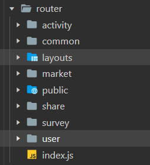

# 基本概念

## 标签数据

- {{msg}} , msg也可以是js表达式，但只能包含**单个**表达式

  > 一个表达式会产生一个值,它可以放在任何需要一个值的地方
  > 语句可以理解成一个行为.循环语句和if语句就是典型的语句
  > 需要语句的地方,你可以使用一个表达式来代替.这样的语句称之为表达式语句

- v-model="msg"建立双向绑定 	

  ```html
  <input type="text" v-model="name">
  ```

  相当于：

  ```html
  <input type="text" :value="name" @input="name = $event.target.value">
  ```

- v-once指令： 执行一次性地插值，当数据改变时，插值处的内容不会更新 

  ```
  <span v-once>这个将不会改变: {{ msg }}</span>
  ```

- 编译html元素  {{msg}} 	v-html	

- v-text

## 标签属性

```vue


//缩写

//动态参数的缩写 
// 可以用方括号括起来的 JavaScript 表达式作为一个指令的参数 

```

**内联样式**

```vue

```

**class**

  ```vue
a:'red',
b:'blue',
json:{
    red:true,
    blue:false
}

<strong :class="[条件?a:b]">文字。。</strong>//可以用三元表达式  
<strong :class="[a,b]">文字。。</strong>
<strong :class="{red:true,blue:false}">文字。。</strong>
<strong :class="json">文字。。</strong>

//添加动态class
<strong :class="[条件?'className':'className',条件?'className':'className',]">
  ```

- 组件内部引入第三方的css文件只在当前组件生效的办法

  <style src="" scoped></style>

- vue样式穿透 ::v-deep   https://www.jb51.net/article/188038.htm

  修改vantUI样式，直接在 <style lang="scss" scoped> .... </style> 中编写的话只会影响当前组件内的样式，但如果去掉scoped话又会影响全局样式。

  如果你希望 scoped 样式中的一个选择器能够作用得“更深”，例如影响子组件，你可以使用 >>> 操作符：

  <style scoped> .a >>> .b { /* ... */ } </style> 上述代码将会编译成：.a[data-v-f3f3eg9] .b { /* … */ }
可以使用 /deep/ 或 ::v-deep 操作符取而代之——两者都是 >>> 的别名，同样可以正常工作。

## 指令

### v-for和虚拟DOM

```js
v-for="(val,index) in array"
//:key="index"
//每次更改数组数据，全部的数据都会重新渲染，添加key值，从而只渲染更改的数据.这是因为每一个列表渲染的元素加上了唯一标识符，编译器通过标识符渲染指定列表，高效渲染虚拟DOM树
```

 打个🌰。把F元素插入到A B C D E中。 


其实是这么插的：新的dom和旧的dom比较， 第一个原来是A，更新之后还是A，所以就不变，第二个是B，更新之后还是B，所以还是不变，第三个是C，更新之后变成了F。  然后后面的都变化了 


但是如果给每一个列表渲染的元素加上了唯一标识符。列表更新之后，编译器通过标识符知道第一个元素是A。第三个是C，就不会更新成F。就像下图。


vue和react的虚拟DOM的Diff算法大致相同


- 如果dom树有三层，在没加ID的情况下。

  先比较第一层。比较一次

  再比较第二层。比较第一层第一个节点和第二层第一个节点，第一层第一个节点和第二层第二个节点，比较第一层第二个节点和第二层两个节点。比较了四次。

  算法复杂度，2的n次方。

- 如果加上ID。

  比较第一个节点。再比较第二个节点。再比较第三个节点。再比较第四个节点。再比较第五个节点。一直比到第n个节点。

  算法复杂度为n。

### v-if和v-show

https://blog.csdn.net/zg0601/article/details/123632608

#### v-if

```js
v-if 指令用于条件性地渲染一块内容。这块内容只会在指令的表达式返回 true 值的时候被渲染。
<h1 v-if="awesome">Vue is awesome!</h1>
也可以用 v-else 添加一个“else 块”：	
<h1 v-else>Oh no 😢</h1>

在 <template> 元素上使用 v-if 条件渲染分组
<template v-if="loginType === 'username'">
  <label>Username</label>
  <input placeholder="Enter your username">
</template>
<template v-else>
  <label>Email</label>
  <input placeholder="Enter your email address">
</template>
```

当它们处于同一节点，`v-for` 的优先级比 `v-if` 更高，这意味着 `v-if` 将分别重复运行于每个 `v-for` 循环中。当你只想为*部分*项渲染节点时，这种优先级的机制会十分有用，如下：

```js
<li v-for="todo in todos" v-if="!todo.isComplete">
  {{ todo }}
</li>
```

#### v-show

```js
 <div v-show="a"> 
 v-show="a"//a是布尔值， 切换元素的 CSS property `display`

//Vue2.+ 中data数据对象是通过Object.defineProerty来进行数据的双向数据绑定，
//而数组则是监听数组的push和pop等操作数组的方法进行双向绑定的，
//因此当是通过下标来修改时便不能更新视图

//使用数组中的值来控制展示
 <div v-show="arr[index]"> 
this.$set(this.arr,index,!this.arr[index]);
//第一个参数为数组，第二个参数为数组下标，第三个参数为设置的值，
```

#### 区别

既然 v-show 和 v-if 这两个指令都可以控制DOM元素的行为，那么它们有什么区别呢？

1、控制手段不同

v-show指令设置隐藏是给绑定的DOM元素添加CSS样式：display:none，但是DOM元素仍然存在；
v-if指令设置隐藏是将DOM元素整个删除，此时DOM元素不再存在。
2、编译过程不同

v-if  切换有一个局部编译/卸载的过程，切换过程中合适地销毁和重建内部的事件监听和子组件；而 v-show 只是简单的基于CSS切换，不管初始条件是什么，元素总是会被渲染。

3、编译条件不同

v-show是在任何条件下（首次条件是否为真）都被编译，然后被缓存，而且DOM元素保留；

v-if 由false变为true时，触发组件的beforeCreate、create、beforeMount、mounter钩子，由true变为false时，触发组件的

beforeDestory、destoryed方法。v-if 是真正的条件渲染，它会确保在切换过程中条件块内的事件监听器和子组件适当地被销毁和重建；

v-if 也是惰性的，如果初始渲染时条件为假，则什么也不做——直到为真时才开始渲染条件块。

4、性能消耗不同

 v-show 由更高的初始渲染消耗， v-if 有更高的切换消耗。

#### 使用场景

如果需要非常频繁地切换，则使用v-show较好；

如果在运行时条件很少改变，则使用v-if较好。

### v-cloak

### 自定义指令

	Vue.directive(指令名称,function(参数){
		this.el	-> 原生DOM元素
	});
	
	<div v-red="参数"></div>

指令定义函数提供了几个钩子函数（可选）：

- bind: 只调用一次，指令第一次绑定到元素时调用，可以定义一个在绑定时执行一次的初始化动作。
- inserted: 被绑定元素插入父节点时调用（父节点存在即可调用，不必存在于 document 中）。
- update: 被绑定元素所在的模板更新时调用，而不论绑定值是否变化。通过比较更新前后的绑定值。
- componentUpdated: 被绑定元素所在模板完成一次更新周期时调用。
- unbind: 只调用一次， 指令与元素解绑时调用。

例子：https://juejin.cn/post/6906028995133833230#heading-5

##  computed和watch

如果一个值依赖多个属性（多对一），用computed肯定是更加方便的。如果一个值变化后会引起一系列操作，或者一个值变化会引起一系列值的变化（一对多），用watch更加方便一些

### **计算属性computed**

- computed是计算属性，用来计算一个属性的值。
  1. 调用的时候不需要加括号，可以直接当属性来用
  2. 根据依赖自动缓存，依赖不变的时候，值不会重新计算
- computed的getter和setter
  - computed的属性可以读取和设值。因此，在computed中可以分为getter(读取)和setter(设值).
  - 一般情况下没有setter，computed只预设了getter，只能读取，不能设值。所以，computed默认格式（是不表明getter函数的）.
  - 当赋值给计算属性的时候，将调用setter函数。

计算属性是为了模板中的表达式简洁，易维护

```vue
<p id="app">{{ myname.substring(0,1).toUpperCase() + myname.substring(1) }}</p>
```

运算过于复杂，冗长，且不好维护，因此我们对于复杂的运算应该 使用计算属性的方式去书写。

```vue
<template>
  <div id="app">
    {{ changewords }}
    //通过在表达式中调用方法来达到同样的效果 //{{ changewords() }}
    //不同的是计算属性是基于它们的响应式依赖进行缓存的。只在相关响应式依赖发生改变时它们才会重新求值。这就意味着只要message
    还没有发生改变，多次访问 reversedMessage,计算属性会立即返回之前的计算结果，而不必再次执行函数。
  </div>
</template>
<script>
export default {
  data() {
    return {};
  },
  method: {
    changewords() {
      return;
      //this.myname.substring(0, 1).toUpperCase() + this.myname.substring(1);
    },
  },
  computed: {
    changewords() {
      return 0;
      //this.myname.substring(0, 1).toUpperCase() + this.myname.substring(1);
    },
    //完整写法
    changewords: {
      get: function () {
        return; //一定要return
      },
      set: function (newVal) { },
    },
  },
};
</script>
```

- 变量不在 data中定义，而是定义在computed中

- **计算属性基于响应式依赖进行缓存。**如其中的任意一个值未发生变化，它调用的就是上一次 计算缓存的数据，而不是从新计算。因此提高了程序的性能。而methods中每调用一次就会重新计算一次，为了进行不必要的资源消耗，选择用计算属性

- **支持缓存**，只有依赖数据发生改变，才会重新进行计算
- 不支持异步，当computed内有异步操作时无效，无法监听数据的变化

###   侦听器 **watch**

watch的意思是监听，当发生变化时，监听并且执行。

1. immediat：ture表示让值最初时候watch就执行
2. deep表示对对象里面的变化进行深度监听
3. 不支持缓存，数据变，直接会触发相应的操作

```js
  var vm = new Vue({
  	data: {
      question: '',
      answer: 'I cannot give you an answer until you ask a question!'
   	 },
    watch: {
      // 如果 `question` 发生改变，这个函数就会运行
      question: function (newQuestion, oldQuestion) {
        this.answer = 'Waiting for you to stop typing...'
        this.debouncedGetAnswer()
      }
    },
  })

  vm.$watch(name,fnCb);  //浅度
  vm.$watch(name,fnCb,{deep:true});  //深度监视 
```

- 不支持缓存，数据变，直接会触发相应的操作；

- **watch支持异步**；

- 监听的函数接收两个参数，第一个参数是最新的值；第二个参数是输入之前的值；

- 当一个属性发生变化时，需要执行对应的操作；一对多；

- 监听数据必须是data中声明过或者父组件传递过来的props中的数据，当数据变化时，触发其他操作，函数有两个参数
  - immediate：组件加载立即触发回调函数执行，
  - deep: 深度监听，为了发现**对象内部值**的变化，复杂类型的数据时使用，例如数组中的对象内容的改变，注意监听数组的变动不需要这么做。注意：deep无法监听到数组的变动和对象的新增
- **不应该使用箭头函数来定义 watcher 函数**，因为箭头函数没有 this，它的 this 会继承它的父级函数，但是它的父级函数是 window，导致箭头函数的 this 指向 window，而不是 Vue 实例

### 区别

- 功能上：computed是计算属性，watch是监听一个值的变化，然后执行对应的回调。
- 是否调用缓存：computed中的函数所依赖的属性没有发生变化，那么调用当前的函数的时候会从缓存中读取，而watch在每次监听的值发生变化的时候都会执行回调。
- 是否调用return：computed中的函数必须要用return返回，watch中的函数不是必须要用return。
- computed默认第一次加载的时候就开始监听；watch默认第一次加载不做监听，如果需要第一次加载做监听，添加immediate属性，设置为true（immediate:true）
- 使用场景：computed----当一个属性受多个属性影响的时候，使用computed-----购物车商品结算。watch–当一条数据影响多条数据的时候，使用watch-----搜索框.

 ## 事件

### 使用方法

  ```js
  <!-- 完整语法 -->
  <a v-on:click="doSomething">...</a>
  
  <!-- 缩写 -->
  <a @click="doSomething">...</a>
  
  <!-- 动态参数的缩写 -->
  <a @[event]="doSomething"> ... </a>
  ```

```js
//使用原生的事件
mounted() {
    //不能直接定义事件，需要从methods中引入this.handleScroll
    //TODO,是否是this指向的问题
    window.addEventListener('scroll', this.handleScroll, true)
    this.boxTop = this.$refs.tabList.offsetTop;
},
```

### 键盘

@keydown	$event	ev.keyCode

```vue
常用键:
回车
a). @keyup.13
b). @keyup.enter
上、下、左、右
@keyup/keydown.left
@keyup/keydown.right
@keyup/keydown.up
@keyup/keydown.down
自定义键盘信息:
Vue.directive('on').keyCodes.ctrl=17;
//vue2.0	
通过全局 config.keyCodes 对象自定义按键修饰符别名：
Vue.config.keyCodes.ctrl=17;
@keyup.ctrl="fn()"
```

`.exact` 修饰符允许你控制由精确的系统修饰符组合触发的事件。

```vue
<!-- 即使 Alt 或 Shift 被一同按下时也会触发 -->
<button v-on:click.ctrl="onClick">A</button>

<!-- 有且只有 Ctrl 被按下的时候才触发 -->
<button v-on:click.ctrl.exact="onCtrlClick">A</button>

<!-- 没有任何系统修饰符被按下的时候才触发 -->
<button v-on:click.exact="onClick">A</button>
```

## 修饰符

### lazy

在默认情况下，v-model 在每次 input 事件触发后将输入框的值与数据进行同步 (除了上述输入法组合文字时)。你可以添加 lazy 修饰符，从而转为在 change 事件_之后_进行同步。
意思是什么呢，就是说当我们在input输入框输入数据时，v-model绑定的值不会发发生变化，但是当我们停止输入，输入框失去焦点或者按下回车时，v-model绑定的值才会发生变化，即在“change”时而非“input”时更新

### **trim**

 **用户输入的前后的空格去掉**

### stop

stop防止事件冒泡  

```vue
@click.stop="show()"   
阻止冒泡:  
a). ev.cancelBubble=true;
b). @click.stop	推荐
c). event.stopPropagation();
```

### prevent

```
<!-- 阻止默认行为，提交事件不再重载页面 -->
<form v-on:submit.prevent="onSubmit"></form>
```

修饰符可以串联

```
<!-- 修饰符可以串联 -->
<a v-on:click.stop.prevent="doThat"></a>
```

#### capture

```
<!-- 添加事件监听器时使用事件捕获模式 -->
<!-- 即内部元素触发的事件先在此处理，然后才交由内部元素进行处理 -->
<div v-on:click.capture="doThis">...</div>
```

#### self

```
<!-- 只当在 event.target 是当前元素自身时触发处理函数 -->
<!-- 即事件不是从内部元素触发的 -->
<div v-on:click.self="doThat">...</div>
```

#### target

```
<!-- 只当在 event.target 是当前元素自身时触发处理函数 -->
<!-- 即事件不是从内部元素触发的 -->
<div v-on:click.self="doThat">...</div>
```

#### once

```
<!-- 点击事件将只会触发一次 -->
<a v-on:click.once="doThis"></a>
```

#### passive


```html
<!-- 滚动事件的默认行为 (即滚动行为) 将会立即触发 -->
<!-- 而不会等待 `onScroll` 完成  -->
<!-- 这其中包含 `event.preventDefault()` 的情况 -->
<div v-on:scroll.passive="onScroll">...</div>
```

#### exact

`.exact` 修饰符允许你控制由精确的系统修饰符组合触发的事件。

```vue
<!-- 即使 Alt 或 Shift 被一同按下时也会触发 -->
<button v-on:click.ctrl="onClick">A</button>

<!-- 有且只有 Ctrl 被按下的时候才触发 -->
<button v-on:click.ctrl.exact="onCtrlClick">A</button>

<!-- 没有任何系统修饰符被按下的时候才触发 -->
<button v-on:click.exact="onClick">A</button>
```

#### sync

日常开发时，我们总会遇到需要父子组件双向绑定的问题，但是考虑到组件的可维护性，vue中是不允许子组件改变父组件传的props值的。那么同时，vue中也提供了一种解决方案.[sync](https://so.csdn.net/so/search?q=sync&spm=1001.2101.3001.7020)修饰符。sync修饰符，与我们平常使用$emit实现子组件向父组件通信没有区别，只不过是写法上方便一些。

- $emit

  子组件使用$emit向父组件发送事件：

  ```vue
  this.$emit('update:title', newTitle)
  ```

  父组件监听这个事件并更新一个本地的数据title：

  ```vue
  <text-document
    :title="title"
    @update:title="val => title = val"
  ></text-document>
  ```

- .sync修饰符

  只需要修两个地方：

  1. 子组件内触发的事件名称以“update:title”命名
  2. 父组件v-bind:title 加上.sync修饰符，即 v-bind:title.sync

  这样父组件就不用再手动绑定@update:title事件了。

  ```vue
  // 子组件
  ...
  methods: {
      onInput(e) {
          this.$emit("update:title", e.target.value)
      }
  }
  // index.vue组件
  <info :title.sync="title"></info>
  ```

## filter

```js
<p>1.msg|filterA</p>
{{'welcome'|uppercase}}  
<p>2.msg|filterA</p>
{{'WELCOME'|lowercase|capitalize}}
```

 数据配合使用过滤器:
		limitBy	限制几个
		limitBy   参数(取几个)
		limitBy 取几个  从哪开始

```
	filterBy	过滤数据
	filterBy ‘谁’

	orderBy	排序
	orderBy 谁 1/-1
		1  -> 正序
		2  -> 倒序

自定义过滤器:  model ->过滤 -> view
	Vue.filter(name,function(msg,[a,b]){
		
	});
{{msg | name([a,b])}}
```

## 过渡动画

https://cn.vuejs.org/v2/guide/transitions.html

### 过渡条件

Vue 提供了 `transition` 的封装组件，在下列情形中，可以给任何元素和组件添加进入/离开过渡

- 条件渲染 (使用 `v-if`)
- 条件展示 (使用 `v-show`)
- 动态组件
- 组件根节点

### 过渡的类名

在进入/离开的过渡中，会有 6 个 class 切换。

1. `v-enter`：定义进入过渡的开始状态。在元素被插入之前生效，在元素被插入之后的下一帧移除。
2. `v-enter-active`：定义进入过渡生效时的状态。在整个进入过渡的阶段中应用，在元素被插入之前生效，在过渡/动画完成之后移除。这个类可以被用来定义进入过渡的过程时间，延迟和曲线函数。
3. `v-enter-to`：**2.1.8 版及以上**定义进入过渡的结束状态。在元素被插入之后下一帧生效 (与此同时 `v-enter` 被移除)，在过渡/动画完成之后移除。
4. `v-leave`：定义离开过渡的开始状态。在离开过渡被触发时立刻生效，下一帧被移除。
5. `v-leave-active`：定义离开过渡生效时的状态。在整个离开过渡的阶段中应用，在离开过渡被触发时立刻生效，在过渡/动画完成之后移除。这个类可以被用来定义离开过渡的过程时间，延迟和曲线函数。
6. `v-leave-to`：**2.1.8 版及以上**定义离开过渡的结束状态。在离开过渡被触发之后下一帧生效 (与此同时 `v-leave` 被删除)，在过渡/动画完成之后移除。

**实例**

```vue
<div id="demo">
  <button v-on:click="show = !show">
    Toggle
  </button>
  <transition name="fade">
    <p v-if="show">hello</p>
  </transition>
</div>

new Vue({
  el: '#demo',
  data: {
    show: true
  }
})

<style>
.fade-enter-active, .fade-leave-active {
  transition: opacity .5s;
}
.fade-enter, .fade-leave-to /* .fade-leave-active below version 2.1.8 */ {
  opacity: 0;
}
</style>>
```

### 过渡组件transition

https://cn.vuejs.org/v2/api/#transition

#### **Prop**

- `name` - string，用于自动生成 CSS 过渡类名。例如：`name: 'fade'` 将自动拓展为 `.fade-enter`，`.fade-enter-active` 等。默认类名为 `"v"`
- `appear` - boolean，是否在初始渲染时使用过渡。默认为 `false`。
- `css` - boolean，是否使用 CSS 过渡类。默认为 `true`。如果设置为 `false`，将只通过组件事件触发注册的 JavaScript 钩子。
- `type` - string，指定过渡事件类型，侦听过渡何时结束。有效值为 `"transition"` 和 `"animation"`。默认 Vue.js 将自动检测出持续时间长的为过渡事件类型。
- `mode` - string，控制离开/进入过渡的时间序列。有效的模式有 `"out-in"` 和 `"in-out"`；默认同时进行。
- `duration` - number | { `enter`: number, `leave`: number } 指定过渡的持续时间。默认情况下，Vue 会等待过渡所在根元素的第一个 `transitionend` 或 `animationend` 事件。
- `enter-class` - string
- `leave-class` - string
- `appear-class` - string
- `enter-to-class` - string
- `leave-to-class` - string
- `appear-to-class` - string
- `enter-active-class` - string
- `leave-active-class` - string
- `appear-active-class` - string

#### 事件

- `before-enter`
- `before-leave`
- `before-appear`
- `enter`
- `leave`
- `appear`
- `after-enter`
- `after-leave`
- `after-appear`
- `enter-cancelled`
- `leave-cancelled` (`v-show` only)
- `appear-cancelled`

#### 用法

`<transition>` 元素作为**单个**元素/组件的过渡效果。`<transition>` 只会把过渡效果应用到其包裹的内容上，而不会额外渲染 DOM 元素，也不会出现在可被检查的组件层级中。

```
<!-- 简单元素 -->
<transition>
  <div v-if="ok">toggled content</div>
</transition>

<!-- 动态组件 -->
<transition name="fade" mode="out-in" appear>
  <component :is="view"></component>
</transition>

<!-- 事件钩子 -->
<div id="transition-demo">
  <transition @after-enter="transitionComplete">
    <div v-show="ok">toggled content</div>
  </transition>
</div>
```

```
new Vue({
  ...
  methods: {
    transitionComplete: function (el) {
      // 传入 'el' 这个 DOM 元素作为参数。
    }
  }
  ...
}).$mount('#transition-demo')
```

- **参考**：[过渡：进入，离开和列表](https://cn.vuejs.org/v2/guide/transitions.html)

## 混入mixin

https://cn.vuejs.org/v2/guide/mixins.html

混入 (mixin) 提供了一种非常灵活的方式，来分发 Vue 组件中的可复用功能。一个混入对象可以包含任意组件选项。当组件使用混入对象时，所有混入对象的选项将被“混合”进入该组件本身的选项。


与组件的区别

组件：在父组件中引入组件，相当于在父组件中给出一片独立的空间供子组件使用，然后根据props来传值，但本质上两者是相对独立的。
Mixins：则是在引入组件之后与组件中的对象和方法进行合并，相当于扩展了父组件的对象与方法，可以理解为形成了一个新的组件。


特点
当组件和混入对象含有同名选项时，这些选项将以恰当的方式进行“合并”。

选项为data ：在发生冲突时以组件数据优先。
值为函数的选项，如生命周期钩子函数created,mounted等，就会被合并调用，混合对象里的钩子函数在组件里的钩子函数之前调用
值为对象的选项，例如 methods、components和 directives，将被合并为同一个对象。两个对象键名冲突时，取组件对象的键值对。
方法和参数在各组件中不共享

# vm实例

当一个 Vue 实例被创建时，它将 `data` 对象中的所有的 property 加入到 Vue 的**响应式系统**中。当这些 property 的值发生改变时，视图将会产生“响应”，即匹配更新为新的值。

```js
var data = { a: 1 }
var vm = new Vue({
  el: '#box',
  components: { //局部组件
    'aaa': Aaa
  },
  data: {
    data: data
  },
  methods: {
    fn() { }
  }
});
// 获得这个实例上的 property
vm.a == data.a // => true
//设置 property 也会影响到原始数据
vm.a = 2
data.a // => 2
```

当这些数据改变时，视图会进行重渲染。值得注意的是只有当实例被创建时就已经存在于 `data` 中的 property 才是**响应式**的。也就是说如果你添加一个新的 property，比如：

```
vm.b = 'hi'
```

那么对 `b` 的改动将不会触发任何视图的更新。

## 全局Api

### Vue.component

### Vue.use( plugin )

安装 Vue.js 插件。如果插件是一个对象，必须提供 `install` 方法。如果插件是一个函数，它会被作为 install 方法。install 方法调用时，会将 Vue 作为参数传入。

该方法需要在调用 `new Vue()` 之前被调用。

当 install 方法被同一个插件多次调用，插件将只会被安装一次。

## property

### vm.$options

```js
var vm=new Vue({
    // el:'#box',
    aa:11,//自定义属性
    show:function(){
        alert(1);
    },
    data:{
        a:1
    }
});
console.log(vm.$options.aa);//获取自定义属性
vm.$options.show();
```

### vm.$data

Vue 实例观察的数据对象。Vue 实例代理了对其 data 对象 property 的访问。

```js
var data = { a: 1 }
var vm = new Vue({
  el: '#example',
  data: data
})

vm.$data === data // => true
vm.$el === document.getElementById('example') // => true

// $watch 是一个实例方法
vm.$watch('a', function (newValue, oldValue) {
  // 这个回调将在 `vm.a` 改变后调用
})
```

### vm.$props

当前组件接收到的 props 对象。Vue 实例代理了对其 props 对象 property 的访问。

### vm.$el

获取Vue实例挂载的元素节点

### vm.$refs

一个对象，持有注册过 [`ref` attribute](https://cn.vuejs.org/v2/api/#ref) 的所有 DOM 元素和组件实例。

### vm.$parent

父实例，如果当前实例有的话。子组件可以通过`this.$parent.fn`(父组件的函数)去调用父组件的函数

### vm.$children

当前实例的直接子组件。**需要注意 `$children` 并不保证顺序，也不是响应式的。**如果你发现自己正在尝试使用 `$children` 来进行数据绑定，考虑使用一个数组配合 `v-for` 来生成子组件，并且使用 Array 作为真正的来源。

### vm.$root

当前组件树的根 Vue 实例。如果当前实例没有父实例，此实例将会是其自己。

## 方法

### vm.$watch

vm.$watch( expOrFn, callback, [options] )

观察 Vue 实例上的一个表达式或者一个函数计算结果的变化。回调函数得到的参数为新值和旧值。

### vm.$set

vm.$set( target, propertyName/index, value )

🌹调用方法：this.$set( target, key, value )

🌹 target：要更改的数据源(可以是对象或者数组)

🌹 key：要更改的具体数据

🌹 value ：重新赋的值

**当你发现你给对象加了一个属性，在控制台能打印出来，但是却没有更新到视图上时，也许这个时候就需要用到this.$set（）这个方法了**


给data定义的对象`新增属性`,同时`又要视图实时更新`,除了用`Vue.$set()`方法,也可以通过`Object.assign()`实现

### vm.$once

$once有两个参数，第一个参数为字符串类型，用来指定绑定的事件名称，第二个参数设置事件的回调函数

自定义事件

```
<template>
  <div>
    <button @click="$emit('onceHander')">按钮</button>
  </div>
</template>
 
<script>
export default {
  mounted() {
    this.$once('onceHander', () => {
      console.log('该事件只能够被触发一次，触发后立刻被移除11');
    });
  }
}
</script>
```

生命周期

```
let timer = setInterval(()=>{
    // to do
    console.log("定时器打印111");
},1000);
this.$once('hook:beforeDestroy',()=>{
    clearInterval(timer);
    timer = null;
})
```

## 生命周期

### vm.$mount

挂载,将数据转化为dom

### vm.$forceUpdate()

### nextTick

https://www.jianshu.com/p/a7550c0e164f

https://mp.weixin.qq.com/s/lf9uKtTAKNplJeSwFSM_Uw

在下次 DOM 更新循环结束之后执行延迟回调。

```js
// 修改数据
vm.msg = 'Hello'
// DOM 还没有更新
Vue.nextTick(function () {
  // DOM 更新了
})

// 作为一个 Promise 使用 (2.1.0 起新增，详见接下来的提示)
Vue.nextTick()
  .then(function () {
    // DOM 更新了
  })
```

# 组件

## **组件命名**

- #### kebab-case(短横线分隔命名) 

  ```
  Vue.component('my-component-name', { /* ... */ })
  ```

- #### PascalCase  (首字母大写命名)    

  ```
  Vue.component('MyComponentName', { /* ... */ })
  ```
  
  当使用 PascalCase (首字母大写命名) 定义一个组件时，你在引用这个自定义元素时两种命名法都可以使用。也就是说 `<my-component-name>` 和 `<MyComponentName>` 都是可接受的。注意，尽管如此，直接在 DOM (即非字符串的模板) 中使用时只有 kebab-case 是有效的。
  

## 创建组件

### 局部注册

- **定义组件**

```js
//vue2.0组件定义
<template id="Aaa">
  <h1 @click="change">{{ msg }}</h1>
</template >
var Aaa = {
  data() {
    return { isCollapse: true };
  },
  methods: {
  },
};
//导出组件
export default Aaa
```

- **组件使用**

```js
//导入组件
import Aaa from './Aaa'
export default {
  components: {
    Aaa,
  },
  // ...
}
```

### 全局组件

```
Vue.component('component-a', { /* ... */ })
Vue.component('component-b', { /* ... */ })
Vue.component('component-c', { /* ... */ })

new Vue({ el: '#app' })
<div id="app">
  <component-a></component-a>
  <component-b></component-b>
  <component-c></component-c>
</div>
```

如果你恰好使用了 webpack (或在内部使用了 webpack 的 [Vue CLI 3+](https://github.com/vuejs/vue-cli))，那么就可以使用 `require.context` 只全局注册这些非常通用的基础组件

```js
import Vue from 'vue'
import upperFirst from 'lodash/upperFirst'
import camelCase from 'lodash/camelCase'

const requireComponent = require.context(
  // 其组件目录的相对路径
  './components',
  // 是否查询其子目录
  false,
  // 匹配基础组件文件名的正则表达式
  /Base[A-Z]\w+\.(vue|js)$/
)

requireComponent.keys().forEach(fileName => {
  // 获取组件配置
  const componentConfig = requireComponent(fileName)

  // 获取组件的 PascalCase 命名
  const componentName = upperFirst(
    camelCase(
      // 获取和目录深度无关的文件名
      fileName
        .split('/')
        .pop()
        .replace(/\.\w+$/, '')
    )
  )

  // 全局注册组件
  Vue.component(
    componentName,
    // 如果这个组件选项是通过 `export default` 导出的，
    // 那么就会优先使用 `.default`，
    // 否则回退到使用模块的根。
    componentConfig.default || componentConfig
  )
})
```

**全局注册的行为必须在根 Vue 实例 (通过 `new Vue`) 创建之前发生**。[这里](https://github.com/chrisvfritz/vue-enterprise-boilerplate/blob/master/src/components/_globals.js)有一个真实项目情景下的示例。

## 内置组件

### 插槽：slot

https://v2.cn.vuejs.org/v2/guide/components-slots.html

#### 原理

Vue 实现了一套内容分发的 API，这套 API 的设计灵感源自 [Web Components 规范草案](https://github.com/w3c/webcomponents/blob/gh-pages/proposals/Slots-Proposal.md)，将 `<slot>` 元素作为承载分发内容的出口。

#### 编译作用域

**父级模板里的所有内容都是在父级作用域中编译的；子模板里的所有内容都是在子作用域中编译的。**

```vue
<navigation-link url="/profile">
  Clicking here will send you to: {{ url }}
  <!--
  这里的 `url` 会是 undefined，因为其 (指该插槽的) 内容是
  _传递给_ <navigation-link> 的而不是
  在 <navigation-link> 组件*内部*定义的。
  -->
</navigation-link>
```

#### 具名插槽

> 自 2.6.0 起有所更新。已废弃的使用 `slot` attribute 的语法在[这里](https://v2.cn.vuejs.org/v2/guide/components-slots.html#废弃了的语法)。

有时我们需要多个插槽。例如对于一个带有如下模板的 `<base-layout>` 组件：

```vue
<div class="container">
  <header>
    <!-- 我们希望把页头放这里 -->
  </header>
  <main>
    <!-- 我们希望把主要内容放这里 -->
  </main>
  <footer>
    <!-- 我们希望把页脚放这里 -->
  </footer>
</div>
```

对于这样的情况，`<slot>` 元素有一个特殊的 attribute：`name`。这个 attribute 可以用来定义额外的插槽：

```vue
<div class="container">
  <header>
    <slot name="header"></slot>
  </header>
  <main>
    <slot></slot>
  </main>
  <footer>
    <slot name="footer"></slot>
  </footer>
</div>
```

一个不带 `name` 的 `<slot>` 出口会带有隐含的名字“default”。

在向具名插槽提供内容的时候，我们可以在一个 `<template>` 元素上使用 `v-slot` 指令，并以 `v-slot` 的参数的形式提供其名称：

```vue
<base-layout>
  <template v-slot:header>
    <h1>Here might be a page title</h1>
  </template>

  <p>A paragraph for the main content.</p>
  <p>And another one.</p>

  <template v-slot:footer>
    <p>Here's some contact info</p>
  </template>
</base-layout>
```

现在 `<template>` 元素中的所有内容都将会被传入相应的插槽。**任何没有被包裹在带有 `v-slot` 的 `<template>` 中的内容都会被视为默认插槽的内容**。

然而，如果你希望更明确一些，仍然可以在一个 `<template>` 中包裹默认插槽的内容：

```vue
<base-layout>
  <template v-slot:header>
    <h1>Here might be a page title</h1>
  </template>

  <template v-slot:default>
    <p>A paragraph for the main content.</p>
    <p>And another one.</p>
  </template>

  <template v-slot:footer>
    <p>Here's some contact info</p>
  </template>
</base-layout>
```

任何一种写法都会渲染出：

```vue
<div class="container">
  <header>
    <h1>Here might be a page title</h1>
  </header>
  <main>
    <p>A paragraph for the main content.</p>
    <p>And another one.</p>
  </main>
  <footer>
    <p>Here's some contact info</p>
  </footer>
</div>
```

注意 **`v-slot` 只能添加在 `<template>` 上** (只有[一种例外情况](https://v2.cn.vuejs.org/v2/guide/components-slots.html#独占默认插槽的缩写语法))，这一点和已经废弃的 [`slot` attribute](https://v2.cn.vuejs.org/v2/guide/components-slots.html#废弃了的语法) 不同。

#### 作用域插槽

> 自 2.6.0 起有所更新。已废弃的使用 `slot-scope` attribute 的语法在[这里](https://v2.cn.vuejs.org/v2/guide/components-slots.html#废弃了的语法)。

**让插槽内容能够访问子组件中才有的数据是很有用的**。例如，设想一个带有如下模板的 `<current-user>` 组件：

```vue
<span>
  <slot>{{ user.lastName }}</slot>
</span>
```

我们可能想换掉备用内容，用名而非姓来显示。如下：

```vue
<current-user>
  {{ user.firstName }}
</current-user>
```

然而上述代码不会正常工作，因为只有 `<current-user>` 组件可以访问到 `user`，而我们提供的内容是在父级渲染的。

为了让 `user` 在父级的插槽内容中可用，我们可以将 `user` 作为 `<slot>` 元素的一个 attribute 绑定上去：

```vue
<span>
  <slot v-bind:user="user">
    {{ user.lastName }}
  </slot>
</span>
```

绑定在 `<slot>` 元素上的 attribute 被称为**插槽 prop**。现在在父级作用域中，我们可以使用带值的 `v-slot` 来定义我们提供的插槽 prop 的名字：

```vue
<current-user>
  <template v-slot:default="slotProps">
    {{ slotProps.user.firstName }}
  </template>
</current-user>

解构插槽 Prop
<current-user v-slot="{ user }">
  {{ user.firstName }}
</current-user>
```

在这个例子中，我们选择将包含所有插槽 prop 的对象命名为 `slotProps`，但你也可以使用任意你喜欢的名字。

#### 动态插槽

```vue
<base-layout>
  <template v-slot:[dynamicSlotName]>
    ...
  </template>
</base-layout>
```


### **动态组件**

### **keep-alive**

```vue
<component v-bind:is="currentTabComponent"></component>
```

如果你选择了一篇文章，切换到 *Archive* 标签，然后再切换回 *Posts*，是不会继续展示你之前选择的文章的。这是因为你每次切换新标签的时候，Vue 都创建了一个新的 `currentTabComponent` 实例。

当在这些组件之间切换的时候，你有时会想保持这些组件的状态，以避免反复重渲染导致的性能问题。
用一个 <keep-alive> 元素将其动态组件包裹起来，**组件将会被缓存**

- **Props**：

  - `include` - 字符串或正则表达式。只有名称匹配的组件会被缓存。
  - `exclude` - 字符串或正则表达式。任何名称匹配的组件都不会被缓存。
  - `max` - 数字。最多可以缓存多少组件实例。

- **用法**：

  `<keep-alive>` 包裹动态组件时，会缓存不活动的组件实例，而不是销毁它们。和 `<transition>` 相似，`<keep-alive>` 是一个抽象组件：它自身不会渲染一个 DOM 元素，也不会出现在组件的父组件链中。

  当组件在 `<keep-alive>` 内被切换，它的 `activated` 和 `deactivated` 这两个生命周期钩子函数将会被对应执行。

  - 页面第一次进入，钩子的触发顺序created-> mounted-> activated
  - 退出时触发deactivated
  - 当再次进入（前进或者后退）时，只触发activated。

## props

```vue
<!-- 在 HTML 中是 kebab-case(短横线分隔命名)  的 -->
<blog-post post-title="hello!"></blog-post>
<!-- 在 HTML 中是 的 camelCase (小驼峰)-->
<blog-post postTitle="hello!"></blog-post>、
//都可以用postTitle来获取
Vue.component('blog-post', {T
  // 在 JavaScript 中是 camelCase 的
  props: ['postTitle'],
  template: '<h3>{{ postTitle }}</h3>'
})
```

每个 prop 都可以指定的值类型

```json
props: {
    // 基础的类型检查 (`null` 和 `undefined` 会通过任何类型验证)
    propA: Number,
    // 多个可能的类型
    propB: [String, Number],
    // 必填的字符串
    propC: {
      type: String,
      required: true
    },
    // 带有默认值的数字
    propD: {
      type: Number,
      default: 100
    },
    // 带有默认值的对象
    propE: {
      type: Object,
      // 对象或数组默认值必须从一个工厂函数获取
      default: function () {
        return { message: 'hello' }
      }
    },
    // 自定义验证函数
    propF: {
      validator: function (value) {
        //使用 prop 定义中的 validator 选项，可以将一个 prop 类型限制在一组特定的值中。
        // 这个值必须匹配下列字符串中的一个
        return ['success', 'warning', 'danger'].indexOf(value) !== -1
      }
    },
    propG: Promise, // or any other constructor
  }
```

所有的 prop 都使得其父子 prop 之间形成了一个**单向下行绑定**：父级 prop 的更新会向下流动到子组件中，但是反过来则不行。这样会防止从子组件意外变更父级组件的状态，从而导致你的应用的数据流向难以理解。每次父级组件发生变更时，子组件中所有的 prop 都将会刷新为最新的值。

## 组件手动更新

- v-if

  ```vue
  <div v-if="isUpdate"></div>
  
  // 移除组件
  this.isUpdate = false;
  //在组件移除后，重新渲染组件
  //this.$nextTick可实现在DOM 状态更新后，执行传入的方法。
  this.$nextTick(() => {
  this.isUpdate = true;
  });
  ```

- :key

  ```vue
  <div v-if="isUpdate" :key="test || Math.random() || new Data()"></div>
  this.test++
  ```

- 调用强制更新方法this.$forceUpdate()会更新视图和数据，强制触发vue的update方法

- this.$set

## 组件通信

https://segmentfault.com/a/1190000019208626

### 父组件向子组件通信

```js
父级 prop 的更新会向下流动到子组件中，但是反过来则不行。这样会防止从子组件意外变更父级组件的状态，从而导致你的应用的数据流向难以理解。
子组件中使用mounted编译完成，将父组件数据赋值给子组件的数据，而直接不使用父组件数据
mounted(){
    console.log(this.msg)
    this.b=this.msg;
    //   vue2.0不允许直接给父级的数据做赋值操作
    //若父组件每次传一个对象给子组件，则可以赋值
}
```

### 子组件向父组件通信

#### emit

emit用于子组件调用父组件的方法并传递数据；子组件可以使用“$emit”触发父组件的自定义事件，触发事件后附加参数都会传给监听器回调，语法为“vm.$emit(事件, arg )”。

```vue
<div id="box">
    <aaa>
    </aaa>
</div>

<template id="aaa">
  <span>我是父级 -> {{ msg }}</span>
  <bbb @child-msg="get"></bbb>
</template>

<template id="bbb">
  <h3>子组件-> {{ a }}</h3>
  <input type="button" value="send" @click="send" />
</template>

<script>
var vm = new Vue({
  el: "#box",
  data: {
    a: "aaa",
  },
  components: {
    aaa: {
      data() {
        return {
          msg: "我是父组件的数据",
        };
      },
      template: "#aaa",
      methods: {
        get(msg) {
          alert(msg);
          this.msg = msg;
        },
      },
      components: {
        bbb: {
          data() {
            return {
              a: "我是子组件的数据",
            };
          },
          template: "#bbb",
          methods: {
            send() {
              //将子组件的数据传递给父组件
              this.$emit("child-msg", this.a);
            },
          },
        },
      },
    },
  },
});
</script>
```

#### sync修饰符

#### 自定义组件的v-model

https://blog.csdn.net/weixin_47232046/article/details/109738816

一个组件上的 `v-model` 默认会利用名为 `value` 的 prop 和名为 `input` 的事件，但是像单选框、复选框等类型的输入控件可能会将 `value` attribute 用于[不同的目的](https://developer.mozilla.org/en-US/docs/Web/HTML/Element/input/checkbox#Value)。`model` 选项可以用来避免这样的冲突：

```
Vue.component('base-checkbox', {
  model: {
    prop: 'checked',
    event: 'change'
  },
  props: {
    checked: Boolean
  },
  template: `
    <input
      type="checkbox"
      v-bind:checked="checked"
      v-on:change="$emit('change', $event.target.checked)"
    >
  `
})
```

现在在这个组件上使用 `v-model` 的时候：

```
<base-checkbox v-model="lovingVue"></base-checkbox>
```

这里的 `lovingVue` 的值将会传入这个名为 `checked` 的 prop。同时当 `<base-checkbox>` 触发一个 `change` 事件并附带一个新的值的时候，这个 `lovingVue` 的 property 将会被更新。

### 中央事件总线

**这种方法通过一个空的Vue实例作为中央事件总线（事件中心），用它来触发事件和监听事件,巧妙而轻量地实现了任何组件间的通信，包括父子、兄弟、跨级**。当我们的项目比较大时，可以选择更好的状态管理解决方案vuex。

```
var Event = new Vue();　　　　　　相当于又new了一个vue实例，Event中含有vue的全部方法；

Event.$emit('msg',this.msg);　　 发送数据，第一个参数是发送数据的名称，接收时还用这个名字接收，第二个参数是这个数据现在的位置；

Event.$on('msg',function(msg){　 接收数据，第一个参数是数据的名字，与发送时的名字对应，第二个参数是一个方法，要对数据的操作

事件总线eventBus主要是在要相互通信的两个Vue页面之中，都引入一个新的vue实例，然后通过分别调用这个实例的事件触发和监听来实现通信和参数传递。
```

```js
//准备一个空的实例对象
var Event=new Vue();
var A={
    template:`
                    <div>
                        <span>我是A组件</span> -> {{a}}
                        <input type="button" value="把A数据给C" @click="send">
                    </div>
            `,
    methods:{
        send(){
            Event.$emit('a-msg',this.a);
        }
    },
    data(){
        return {
            a:'我是a数据'
        }
    }
};
var C={
    template:`
                <div>
                    <h3>我是C组件</h3>
                    <span>接收过来的A的数据为: {{a}}</span>
                </div>
            `,
    data(){
        return {
            a:''
        }
    },
    mounted(){
        //var _this=this;
        Event.$on('a-msg',function(a){
            this.a=a;
        }.bind(this));
    }
};
```

### provide/inject

**允许一个祖先组件向其所有子孙后代注入一个依赖，不论组件层次有多深，并在起上下游关系成立的时间里始终生效**。

一言而蔽之：祖先组件中通过provider来提供变量，然后在子孙组件中通过inject来注入变量。

**provide / inject API 主要解决了跨级组件间的通信问题，不过它的使用场景，主要是子组件获取上级组件的状态，跨级组件间建立了一种主动提供与依赖注入的关系**。

### `$parent` / `$children`与 `ref`

- `ref`：如果在普通的 DOM 元素上使用，引用指向的就是 DOM 元素；如果用在子组件上，引用就指向组件实例
- `$parent` / `$children`：访问父 / 子实例
- **这两种方法的弊端是，无法在跨级或兄弟间通信**。

```js
// component-a 子组件
export default {
  data () {
    return {
      title: 'Vue.js'
    }
  },
  methods: {
    sayHello () {
      window.alert('Hello');
    }
  }
}
```

```js
// 父组件
<template>
  <component-a ref="comA"></component-a>
</template>
<script>
  export default {
    mounted () {
      const comA = this.$refs.comA;
      console.log(comA.title);  // Vue.js
      comA.sayHello();  // 弹窗
    }
  }
</script>
```

### 使用场景

- 父子通信：

父向子传递数据是通过 props，子向父是通过 events（`$emit`）；通过父链 / 子链也可以通信（`$parent` / `$children`）；ref 也可以访问组件实例；provide / inject API；`$attrs/$listeners`

- 兄弟通信：

Bus；Vuex

- 跨级通信：

Bus；Vuex；provide / inject API、`$attrs/$listeners`

## 组件懒加载

- 异步方法

  ```
   components:{
      "One-com":resolve=>(['./one'],resolve)
    }
  ```

- const方法

  ```
  const One = ()=>import("./one");
  components:{
       "One-com":One
  }
  ```

# 注入

`Vue.use`和`Vue.prototype`没有本质区别，`Vue.use`就是在`Vue.prototype`基础上又封装了一层而已，他们实现的原理都是在`Vue.prototype`上添加了一个方法，`Vue.prototype`适合于注册Vue生态外的插件，`Vue.use`适合于注册Vue生态内的插件。

## 依赖注入

```
<google-map>
  <google-map-region v-bind:shape="cityBoundaries">
    <google-map-markers v-bind:places="iceCreamShops"></google-map-markers>
  </google-map-region>
</google-map>
```

在这个组件里，所有 `<google-map>` 的后代都需要访问一个 `getMap` 方法，以便知道要跟哪个地图进行交互。不幸的是，使用 `$parent` property 无法很好的扩展到更深层级的嵌套组件上。这也是依赖注入的用武之地，它用到了两个新的实例选项：`provide` 和 `inject`。

`provide` 选项允许我们指定我们想要**提供**给后代组件的数据/方法。在这个例子中，就是 `<google-map>` 内部的 `getMap` 方法：

```
provide: function () {
  return {
    getMap: this.getMap
  }
}
```

然后在任何后代组件里，我们都可以使用 `inject` 选项来接收指定的我们想要添加在这个实例上的 property：

```
inject: ['getMap']
```

## Vue.use

Vue.use(Object | Function)

- Object ,必须提供 install 方法

  ```
  
  ```

- Function,它会被作为 install 方法

  ```
  import moment from "moment";
  const momentPlugin = {
    install: function (Vue: any) {
      Object.defineProperty(Vue.prototype, "$moment", { value: moment });
    },
  };
  
  export default momentPlugin;
  
  ```

  

install 方法调用时，会将 Vue 作为参数传入。 该方法需要在调用 new Vue() **之前**被调用。当 install 方法被同一个插件多次调用，插件将只会被安装一次。

还是看代码比较直接，新建plugin文件夹，文件夹下新建plugin.js

```javascript
var install = function(Vue) {
    Object.defineProperties(Vue.prototype, {
        $Plugin: {
            value: function() { console.log('I am a plugin') }
        }
    })
}
module.exports = install
```

 main.js导入

```javascript
// 测试插件
import Plugin from "./plugin/plugin"
Vue.use(Plugin)
```

使用插件

```javascript
this.$Plugin()
```

总结：

Vue.use主要是执行install方法，而install主要也是执行Vue.prototype方法。所以，其实Vue.use()方法的核心就是Vue.prototype，只不过又封装了一层,更加的灵活，扩展性更好

### 饿了么

> 用饿了么UI举例

```javascript
import Vue from 'vue'
import Element from 'element-ui'
Vue.use(Element)
```

> 饿了么部分源码

```tsx
//types/element-ui.d.ts
export interface InstallationOptions {
  locale: any,
  i18n: any,
  size: string
}
export function install (vue: typeof Vue, options: InstallationOptions): void

//src/index.js
const install = function(Vue, opts = {}) {
  locale.use(opts.locale);
  locale.i18n(opts.i18n);

  components.forEach(component => {
    Vue.component(component.name, component);
  });

  Vue.use(InfiniteScroll);
  Vue.use(Loading.directive);

  Vue.prototype.$ELEMENT = {
    size: opts.size || '',
    zIndex: opts.zIndex || 2000
  };

  Vue.prototype.$loading = Loading.service;
  Vue.prototype.$msgbox = MessageBox;
  Vue.prototype.$alert = MessageBox.alert;
  Vue.prototype.$confirm = MessageBox.confirm;
  Vue.prototype.$prompt = MessageBox.prompt;
  Vue.prototype.$notify = Notification;
  Vue.prototype.$message = Message;

};
/* istanbul ignore if */
if (typeof window !== 'undefined' && window.Vue) {
  install(window.Vue);
}
```

 `ue.use`就是要运行这个`install`对应的函数 

**总结**

1. Vue的插件是一个**对象**, 就像`Element`.
2. 插件**对象**必须有`install`字段.
3. `install`字段是一个函数.
4. 初始化插件**对象**需要通过`Vue.use()`

## Vue.prototype.$xxx

如果需要设置全局变量，在main.js中，Vue实例化的代码里添加。 不想污染全局作用域。这种情况下，你可以通过在 原型 上定义它们使其在每个Vue实例中可用。

```text
vue.prototype.$echarts = echarts
```

这样`$echarts`就在所有Vue实例中可用了,变量前加上$，是防止被组件中的变量意外覆盖。

# vue生命周期

Vue 实例在被创建时都要经过一系列的初始化过程 ， 编译模板、将实例挂载到 DOM 并在数据变化时更新 DOM 等 。 在这个过程中也会运行一些叫做**生命周期钩子**的函数，这给了用户在不同阶段添加自己的代码的机会。 


```vue
beforeCreate	
组件实例刚刚被创建，组件的el（Vue实例挂载的元素节点，简单来说el的作用就是将当前vue组件生成的实例插入到页面元素中）和data，methods都未被初始化，调用不了
new Vue({
    el: '#app'
})

created			     
实例已经创建完成，data，methods都已经被初始化，可以被调用但是el还处于未被创建状态。如果要调用 methods 中的方法，或者操作 data 中的数据，最早可以在这个阶段中操作

beforeMount		
template模板已经编译完成，el已经创建完成，但是还没有挂载到页面上，而只是放在内存中

mounted			
页面渲染完成初始化完毕。可以在 mounted 内部使用 vm.$nextTick。 如果我们想要通过插件操作页面上的DOM节点，最早可以在和这个阶段中进行

beforeUpdate	组件更新之前
updated			组件更新完毕	
更新前/后：当data变化时，会触发beforeUpdate和updated方法。

beforeDestroy	组件销毁前
destroyed		组件销毁后
销毁前/后：在执行destroy方法后，对data的改变不会再触发周期函数，说明此时vue实例已经解除了事件监听以及和dom的绑定，但是dom结构依然存在。

activated	keep-alive 组件激活时调用。
deactivated	keep-alive 组件停用时调用。
```

不要在生命周期函数或者回调上使用箭头函数， 因为箭头函数并没有 `this` ,this指向调用它的VUE实例

 比如 `created: () => console.log(this.a)` 或 `vm.$watch('a', newValue => this.myMethod())` 

# vue-router路由

## **hash和history**

```js
const router = new VueRouter({
  mode: 'history',
  routes: [...]
})
```

### 原理

**hash**

hash模式下，它指 # 号之后的所有字符，但是他虽然包含在url中，但是不包含在http请求中，所以**改变hash值不会重新加载页面**，对传给后端的url没有任何影响，因此不会重新加载页面。它每次改变都会触发hashchange事件，可以通过给window加上hashchange事件进行监听。它是单页面的标配。

**history**

利用了HTML5 History Interface中新增的pushState和replaceState方法。这两个方法应用于浏览器的历史记录栈， **而不会引起页面的刷新** ，在当前已有的 back、forward、go 的基础之上，它们提供了对**历史记录进行修改**的功能。 history模式下有一个问题，就是当页面刷新时，他会实实在在的发送请求，把url给传送过去，因此，如果后端没有做处理的话，就会因找不到资源而报404错误，因此使用history模式时可以跟后端进行配合。

下面阐述几种 `HTML5` 新增的 `history API` 。**具体如下表：**

| API                                       | 定义                                                         |
| ----------------------------------------- | ------------------------------------------------------------ |
| history.pushState(data, title [, url])    | pushState主要用于**往历史记录堆栈顶部添加一条记录**。各参数解析如下：**①data**会在onpopstate事件触发时作为参数传递过去；**②title**为页面标题，当前所有浏览器都会忽略此参数；③**url**为页面地址，可选，缺少时表示为当前页地址 |
| history.replaceState(data, title [, url]) | 更改当前的历史记录，参数同上； 上面的pushState是添加，这个更改 |
| history.state                             | 用于存储以上方法的data数据（即state对象），如果当前URL不是通过pushState或者replaceState产生的，那么history.state是null。 |
| window.onpopstate                         | 响应pushState或者replaceState的调用。                        |

### 总结

**hash**

- url中有#
- 原理是onhashchange事件
- **仅 hash 符号之前的内容会被包含在请求中**
- hash修改的url是同文档的url
- hash不会修改浏览器历史记录栈
- 生成二维码、微信分享页面的时候都会自动过滤掉#后面的参数

**history**

- url中没有#，美观

- 原理是popstate事件,浏览历史（即history对象）出现变化时，就会触发popstate事件。history.pushState用于在浏览历史中添加历史记录，history.replaceState修改浏览历史中当前纪录，但是并不触发页面刷新

  ```
  history.pushState({color:'red'}, 'red', 'red'})
  window.onpopstate = function(event){
    console.log(event.state)
    if(event.state && event.state.color === 'red'){
      document.body.style.color = 'red';
    }
  }
  ```

- **全路径内容会被包含在请求中**

- history修改的url可以是同域的任意url

- history会修改浏览器历史记录栈

- history模式往往需要后端支持，如果后端nginx没有覆盖路由地址，就会返回404

## 配置路由

### 手动配置路由

直接`vue add router`,或者

1. 下载vue-router模块  

   ```bash
   npm install vue-router
   ```

2. 创建文件夹，存放路由配置

   ```js
   import Vue from "vue";
   import VueRouter from "vue-router";
   import login from "../components/login.vue";
   import register from "../components/register.vue"
   
   Vue.use(VueRouter);
   
   const routes = [
     {
       path: "/",
       component: login,
     },
     {
       path: "/register",
       component: register,
     },
   ];
   
   const router = new VueRouter({
     mode: "history",
     base: process.env.BASE_URL,
     routes,
   });
   
   export default router;
   
   ```

   ```js
   //4.0
   // 1. 定义路由组件.
   // 也可以从其他文件导入
   const Home = { template: '<div>Home</div>' }
   const About = { template: '<div>About</div>' }
   
   // 2. 定义一些路由
   // 每个路由都需要映射到一个组件。
   // 我们后面再讨论嵌套路由。
   const routes = [
     { path: '/', component: Home },
     { path: '/about', component: About },
   ]
   
   // 3. 创建路由实例并传递 `routes` 配置
   // 你可以在这里输入更多的配置，但我们在这里
   // 暂时保持简单
   const router = VueRouter.createRouter({
     // 4. 内部提供了 history 模式的实现。为了简单起见，我们在这里使用 hash 模式。
     history: VueRouter.createWebHashHistory(),
     routes, // `routes: routes` 的缩写
   })
   
   
   ```

3. main.js文件中引入router

   ```js
   import Vue from "vue";
   import App from "./App.vue";
   import VueRouter from "vue-router";
   import router from "./router/index";
   
   Vue.config.productionTip = false;
   
   Vue.use(VueRouter);
   new Vue({
     router: router,
     render: (h) => h(App),
   }).$mount("#app");
   ```
   
   ```js
   // 5. 创建并挂载根实例
   const app = Vue.createApp({})
   //确保 _use_ 路由实例使
   //整个应用支持路由。
   app.use(router)
   
   app.mount('#app')
   
   // 现在，应用已经启动了！
   
   ```
   
   

### 自动配置路由

根据文件夹自动配置路由



```js
//index.js
import Vue from 'vue'
import VueRouter from 'vue-router'
Vue.use(VueRouter)

let routes = []
const isProd = process.env.NODE_ENV === 'production'
const routerContext = require.context('./', true, /index\.js$/)

routerContext.keys().forEach(route => {
  // route就是路径
  // 如果是根目录的index不做处理
  if (route.startsWith('./index')) {
    return
  }
  const routerModule = routerContext(route)
  routes = [...routes, ...(routerModule.default || routerModule)]
  console.log(routes)
});

console.log(process.env.BASE_URL)

const router = new VueRouter({
  mode: 'history',
  base: isProd && process.env.VUE_APP_PREVIEW !== 'true' ? '/wechatpub/' : process.env.BASE_URL,
  routes
})

export default router
```

```js
//activity/index.js
/**
 * 活动路由配置
 */
export default [
  {
    path: '/activity/smashedEgg/:id',
    name: 'SmashedEgg',
    component: () => import(/* webpackChunkName: "survey" */ 					'@/views/activity/SmashedEgg.vue'),
  }
]
```

## 标签

### router-view

`router-view` 将显示与 url 对应的组件。你可以把它放在任何地方，以适应你的布局。`<router-view>` 渲染的组件还可以内嵌自己的 `<router-view>`，**根据嵌套路径，渲染嵌套组件**。

因为它也是个组件，所以可以配合 `<transition>` 和 `<keep-alive>` 使用。如果两个结合一起用，要确保在内层使用 `<keep-alive>`：

```html
<transition>
  <keep-alive>
    <router-view></router-view>
  </keep-alive>
</transition>
```

### router-link

```vue
<!-- 使用 router-link 组件来导航. -->
<!-- 通过传入 `to` 属性指定链接. -->
<!-- <router-link> 默认会被渲染成一个 `<a>` 标签 -->
<router-link to="/foo">Go to Foo</router-link>
<router-link to="/bar">Go to Bar</router-link>
```

要注意，当 `<router-link>` 对应的路由匹配成功，将自动设置 class 属性值 `.router-link-active`

要链接到一个命名路由，可以给 `router-link` 的 `to` 属性传一个对象：

```html
<router-link :to="{ name: 'user', params: { userId: 123 }}">User</router-link>
```

这跟代码调用 `router.push()` 是一回事：

```js
router.push({ name: 'user', params: { userId: 123 } })
```

## 路由用法

### 动态路由匹配 

| 模式                          | 匹配路径            | $route.params                          |
| ----------------------------- | ------------------- | -------------------------------------- |
| /user/:username               | /user/evan          | `{ username: 'evan' }`                 |
| /user/:username/post/:post_id | /user/evan/post/123 | `{ username: 'evan', post_id: '123' }` |

除了 `$route.params` 外，[API 文档](https://router.vuejs.org/zh/api/#路由对象)

当使用路由参数时，例如从 `/user/foo` 导航到 `/user/bar`，**原来的组件实例会被复用**。因为两个路由都渲染同个组件，比起销毁再创建，复用则显得更加高效。**不过，这也意味着组件的生命周期钩子不会再被调用**。

复用组件时，想对路由参数的变化作出响应的话，你可以简单地 watch (监测变化) `$route` 对象

```js
const User = {
  template: '...',
  watch: {
    $route(to, from) {
      // 对路由变化作出响应...
    }
  }
}
```

或者，使用 `beforeRouteUpdate` [导航守卫](https://router.vuejs.org/zh/guide/advanced/navigation-guards.html)，它也可以取消导航：

```js
const User = {
  template: '...',
  beforeRouteUpdate(to, from, next) {
    // react to route changes...
    // don't forget to call next()
  }
}
```

#### 捕获所有路由

```js
//当使用通配符路由时，请确保路由的顺序是正确的，也就是说含有通配符的路由应该放在最后
//路由 { path: '*' } 通常用于客户端 404 错误。
{
  // 会匹配所有路径
  path: '*'
}

{
  // 会匹配以 `/user-` 开头的任意路径
  path: '/user-*'
}
```

当使用一个*通配符*时，`$route.params` 内会自动添加一个名为 `pathMatch` 参数。它包含了 URL 通过*通配符*被匹配的部分：

```js
// 给出一个路由 { path: '/user-*' }
this.$router.push('/user-admin')
this.$route.params.pathMatch // 'admin'
// 给出一个路由 { path: '*' }
this.$router.push('/non-existing')
this.$route.params.pathMatch // '/non-existing'
```

### 嵌套路由

<router-view> 是最顶层的出口，渲染最高级路由匹配到的组件。同样地，一个被渲染组件同样可以包含自己的嵌套 <router-view>

嵌套路由的现象：点击了路由跳转之后父路由组件的内容一直呈现；子路由的内容进行切换，地址栏的路径也随之改变。

```js
// 嵌套路由
const routes = [
  {
    path: '/travel', component: TravelPage,
    children: [
      { path: '/travel/america', component: TravelAmericaPage },
      { path: '/travel/china', component: TravelChinaPage}
    ]
  },
  {
    path: '/about', component: AboutPage
  }
];
```


```vue
//TravelPage.vue
<template>
  <div id="travel">
    <h2>Travels</h2>
    <div>
      //这里展示子组件的内容
      <router-link to="/travel/america">America</router-link>
      <router-link to="/travel/china">China</router-link>
    </div>
    <router-view></router-view>
  </div>
</template>
```

### 命名路由

有时候，通过一个名称来标识一个路由显得更方便一些（有些路径很长，直接写太麻烦），特别是在链接一个路由，或者是执行一些跳转的时候。你可以在创建 Router 实例的时候，在 `routes` 配置中给某个路由设置名称。 

```js
const router = new VueRouter({
  routes: [
    {
      path: '/user/:userId',
      name: 'user',
      component: User
    }
  ]
})
```

要链接到一个命名路由，可以给 `router-link` 的 `to` 属性传一个对象：

```html
<router-link :to="{ name: 'user', params: { userId: 123 }}">User</router-link>
```

这跟代码调用 `router.push()` 是一回事：

```js
router.push({ name: 'user', params: { userId: 123 } })
```

这两种方式都会把路由导航到 `/user/123` 路径。

### 命名视图

命名视图只需两步：第一在router-view添加name属性，第二在路由中用`components。`

有时候想同时（同级）展示多个视图，而不是嵌套展示，例如创建一个布局，有 `sidebar`（侧导航） 和 `main`（主内容） 两个视图，这个时候命名视图就派上用场了。你可以在界面中拥有多个单独命名的视图，而不是只有一个单独的出口。如果 `router-view` 没有设置名字，那么默认为 `default`。

```vue
<router-view class="view one"></router-view>
<router-view class="view two" name="a"></router-view>
<router-view class="view three" name="b"></router-view>
```

一个视图使用一个组件渲染，因此对于同个路由，多个视图就需要多个组件。确保正确使用 **`components` 配置（带上 s）**：

```vue
const router = new VueRouter({
  routes: [
    {
      path: '/',
      components: {
        default: Foo,
        a: Bar,
        b: Baz
      }
    }
  ]
})
```

### 重定向和别名

#### 重定向

重定向也是通过 `routes` 配置来完成，下面例子是从 `/a` 重定向到 `/b`：

```js
const router = new VueRouter({
  routes: [
    { path: '/a', redirect: '/b' }
  ]
})
```

重定向的目标也可以是一个命名的路由：

```js
const router = new VueRouter({
  routes: [
    { path: '/a', redirect: { name: 'foo' }}
  ]
})
```

甚至是一个方法，动态返回重定向目标：

```js
const router = new VueRouter({
  routes: [
    { path: '/a', redirect: to => {
      // 方法接收 目标路由 作为参数
      // return 重定向的 字符串路径/路径对象
    }}
  ]
})
```

#### 别名

“重定向”的意思是，**当用户访问 `/a`时**，URL 将会被替换成 `/b`，然后匹配路由为 `/b`，那么“别名”又是什么呢？

`/a` 的别名是 `/b`，意味着，**当用户访问 `/b` 时**，URL 会保持为 `/b`，但是路由匹配则为 `/a`，就像用户访问 `/a` 一样。

上面对应的路由配置为：

```js
const router = new VueRouter({
  routes: [
    { path: '/a', component: A, alias: '/b' }
  ]
})
```

“别名”的功能让你可以自由地将 UI 结构映射到任意的 URL，而不是受限于配置的嵌套路由结构。

## 路由传参

**方式一：通过 params 传参**

- 编程式：

  - ```
    data:{
      username: ''
    },
    login() {
      ...
      this.$router.push({
        name: 'home', //注意使用 params 时一定不能使用 path
        params: { username: this.username },
      })
    }
    ```

- 声明式：

  - ```
    <router-link :to="{ name: 'home', params: { username: username } }">
    ```

- 取值：`this.$route.params.username`

**方式二：通过 query 传参**

- 编程式：

  - ```
    data:{
      username: ''
    },
    login() {
      ...
      this.$router.push({
        path: '/home',
        query: { username: this.username },
      })
    }
    ```

- 声明式：

  - ```
    <router-link :to="{ path: '/home', query: { username: username } }">
    ```

- 取值：`this.$route.query.username`

**params 传参后，刷新页面会失去拿到的参数。所以路由参数要修改为 `'/login/:username'`（官方称为动态路由）**

## 路由守卫

路由守卫就是路由跳转过程中的一些[钩子函数](https://so.csdn.net/so/search?q=钩子函数&spm=1001.2101.3001.7020) ，在路由跳转的时候，做一些判断或其它的操作。 类似于组件生命周期钩子函数 。

### 分类

- 全局路由守卫(全局路由守卫，就是小区大门，整个小区就这一个大门)

  beforeEach(to, from, next) 全局前置守卫，路由跳转前触发
  beforeResolve(to, from, next) 全局解析守卫 在所有组件内守卫和异步路由组件被解析之后触发
  afterEach(to, from) 全局后置守卫，路由跳转完成后触发

- 路由独享守卫

  beforeEnter(to,from,next) 路由对象单个路由配置 ，单个路由进入前触发

- 组件路由守卫(跟 methods: {}等同级别书写，组件路由守卫是写在每个单独的 vue 文件里面的路由守卫)

  beforeRouteEnter(to,from,next) 在组件生命周期beforeCreate阶段触发
  beforeRouteUpdadte(to,from,next) 当前路由改变时触发
  beforeRouteLeave(to,from,next) 导航离开该组件的对应路由时触发

**参数**
to： 即将要进入的目标路由对象

from： 即将要离开的路由对象

next：一定要调用该方法来 **resolve** 这个钩子。执行效果依赖 `next` 方法的调用参数。

- `next()` : 进行管道中的下一个钩子。如果全部钩子执行完了，则导航的状态就是 `confirmed` (确认的)。
- `next(false)` : 中断当前的导航。如果浏览器的 `URL` 改变了 (可能是用户手动或者浏览器后退按钮)，那么 `URL` 地址会重置到 `from` 路由对应的地址。
- `next('/')` 或者 `next({ path: '/' })` : 跳转到一个不同的地址。当前的导航被中断，然后进行一个新的导航。你可以向 `next` 传递任意位置对象，且允许设置诸如 `replace: true`、`name: 'home'` 之类的选项以及任何用在 [`router-link` 的 `to` prop](https://link.juejin.cn?target=https%3A%2F%2Frouter.vuejs.org%2Fzh%2Fapi%2F%23to) 或 [`router.push`](https://link.juejin.cn?target=https%3A%2F%2Frouter.vuejs.org%2Fzh%2Fapi%2F%23router-push) 中的选项。
- **`next(error)`** : (2.4.0+) 如果传入 `next` 的参数是一个 `Error` 实例，则导航会被终止且该错误会被传递给 [`router.onError()`](https://link.juejin.cn?target=https%3A%2F%2Frouter.vuejs.org%2Fzh%2Fapi%2F%23router-onerror) 注册过的回调。。

### 路由前置守卫

```js
const router = new VueRouter({ ... })

router.beforeEach((to, from, next) => {
  // ...
})
```

**确保 `next` 函数在任何给定的导航守卫中都被严格调用一次。它可以出现多于一次，但是只能在所有的逻辑路径都不重叠的情况下，否则钩子永远都不会被解析或报错**

以一个简单的例子来解释router.beforeEach
假设我们现在做一个这样的需求，用户在未登录的时候进入任意页面，我们就让用户跳转到登录页面，在已登录的时候让用户正常跳转到点击的页面。

```js
// BAD
router.beforeEach((to, from, next) => {
  if (to.name !== 'Login' && !isAuthenticated) next({ name: 'Login' })
  // 如果用户未能验证身份，则 `next` 会被调用两次
  next()
})
// GOOD
router.beforeEach((to, from, next) => {
  if (to.name !== 'Login' && !isAuthenticated) next({ name: 'Login' })
  else next()
})
```

### 组件内的守卫

- `beforeRouteEnter`
- `beforeRouteUpdate` (2.2 新增)
- `beforeRouteLeave`

```js
 beforeRouteEnter(to, from) {
    // 在渲染该组件的对应路由被验证前调用
    // 不能获取组件实例 `this` ！
    // 因为当守卫执行时，组件实例还没被创建！
  },
  beforeRouteUpdate(to, from) {
    // 在当前路由改变，但是该组件被复用时调用
    // 举例来说，对于一个带有动态参数的路径 `/users/:id`，在 `/users/1` 和 `/users/2` 之间跳转的时候，
    // 由于会渲染同样的 `UserDetails` 组件，因此组件实例会被复用。而这个钩子就会在这个情况下被调用。
    // 因为在这种情况发生的时候，组件已经挂载好了，导航守卫可以访问组件实例 `this`
  },
  beforeRouteLeave(to, from) {
    // 在导航离开渲染该组件的对应路由时调用
    // 与 `beforeRouteUpdate` 一样，它可以访问组件实例 `this`
  },
```


## API

### router.push

**注意：在 Vue 实例内部，你可以通过 `$router` 访问路由实例。因此你可以调用 `this.$router.push`。**

`router.push` 这个方法会向 history 栈添加一个新的记录，所以，当用户点击浏览器后退按钮时，则回到之前的 URL。

当你点击 `<router-link>` 时，这个方法会在内部调用，所以说，点击 `<router-link :to="...">` 等同于调用 `router.push(...)`

| 声明式                    | 编程式             |
| ------------------------- | ------------------ |
| `<router-link :to="...">` | `router.push(...)` |

```js
// 字符串
router.push('home')

// 对象
router.push({ path: 'home' })

// 命名的路由
router.push({ name: 'user', params: { userId: '123' }})

// 带查询参数，变成 /register?plan=private
router.push({ path: 'register', query: { plan: 'private' }})
```

**注意：如果提供了 `path`，`params` 会被忽略，上述例子中的 `query` 并不属于这种情况。取而代之的是下面例子的做法，你需要提供路由的 `name` 或手写完整的带有参数的 `path`：**

```js
const userId = '123'
router.push({ name: 'user', params: { userId }}) // -> /user/123
router.push({ path: `/user/${userId}` }) // -> /user/123
// 这里的 params 不生效
router.push({ path: '/user', params: { userId }}) // -> /user
```

### router.replace

跟 `router.push` 很像，唯一的不同就是，它不会向 history 添加新记录，而是跟它的方法名一样 —— 替换掉当前的 history 记录。

| 声明式                            | 编程式                |
| --------------------------------- | --------------------- |
| `<router-link :to="..." replace>` | `router.replace(...)` |

### router.go

这个方法的参数是一个整数，意思是在 history 记录中向前或者后退多少步，类似 `window.history.go(n)`。

例子

```js
// 在浏览器记录中前进一步，等同于 history.forward()
router.go(1)

// 后退一步记录，等同于 history.back()
router.go(-1)

// 前进 3 步记录
router.go(3)

// 如果 history 记录不够用，那就默默地失败呗
router.go(-100)
router.go(100)
```

# vuex

## 开始

每一个 Vuex 应用的核心就是 store（仓库）。“store”基本上就是一个容器，它包含着你的应用中大部分的**状态 (state)**。Vuex 和单纯的全局对象有以下两点不同：

1. Vuex 的状态存储是响应式的。当 Vue 组件从 store 中读取状态的时候，若 store 中的状态发生变化，那么相应的组件也会相应地得到高效更新。
2. 你不能直接改变 store 中的状态。改变 store 中的状态的唯一途径就是显式地**提交 (commit) mutation**。这样使得我们可以方便地跟踪每一个状态的变化，从而让我们能够实现一些工具帮助我们更好地了解我们的应用。

```js
import Vue from 'vue'
import Vuex from 'vuex'

Vue.use(Vuex)
// 创建一个新的 store 实例
const store = new Vuex.Store({
  state: {
    count: 0
  },
  mutations: {
    increment (state) {
      state.count++
    }
  }
})
store.commit('increment')
console.log(store.state.count) // -> 1

//Vuex 通过store选项，提供了一种机制将状态从根组件“注入”到每一个子组件中
new Vue({
  el: '#app',
  store: store,
})
methods: {
  increment() {
    this.$store.commit('increment')
    console.log(this.$store.state.count)
  }
}
```

## 结构

### state

由于 Vuex 的状态存储是响应式的，从 store 实例中读取状态最简单的方法就是在[计算属性](https://cn.vuejs.org/guide/computed.html)中返回某个状态

```js
//main.js
new Vue({
  // 创建和挂载根实例。
  // 记得要通过 router 配置参数注入路由，
  // 从而让整个应用都有路由功能
  router: router,
  store,
  render: h => h(App),
}).$mount('#app')

//通过在根实例中注册 store 选项，该 store 实例会注入到根组件下的所有子组件中，且子组件能通过 this.$store 访问到
const Counter = {
  template: `<div>{{ count }}</div>`,
  //从 store 实例中读取状态最简单的方法就是在计算属性中返回某个状态
  computed: {
    count () {
      return this.$store.state.count
    }
  }
}
```

```js
//当一个组件需要获取多个状态的时候，将这些状态都声明为计算属性会有些重复和冗余。为了解决这个问题，我们可以使用 mapState 辅助函数帮助我们生成计算属性
// 在单独构建的版本中辅助函数为 Vuex.mapState
import { mapState } from 'vuex'

export default {
  // ...
  computed: mapState({
    // 箭头函数可使代码更简练
    count: state => state.count,

    // 传字符串参数 'count' 等同于 `state => state.count`
    countAlias: 'count',

    // 为了能够使用 `this` 获取局部状态，必须使用常规函数
    countPlusLocalState (state) {
      return state.count + this.localCount
    }
  })
}
```

当映射的计算属性的名称与 state 的子节点名称相同时，我们也可以给 `mapState` 传一个字符串数组。

```js
computed: mapState([
  // 映射 this.count 为 store.state.count
  'count'
])
```

### getters

Vuex 允许我们在 store 中定义“getter”（可以认为是 store 的计算属性）。就像计算属性一样，getter 的返回值会根据它的依赖被缓存起来，且只有当它的依赖值发生了改变才会被重新计算。

```js
computed: {
  doneTodosCount () {
    return this.$store.state.todos.filter(todo => todo.done).length
  }
}
```

```js
const store = new Vuex.Store({
  state: {
    todos: [
      { id: 1, text: '...', done: true },
      { id: 2, text: '...', done: false }
    ]
  },
  getters: {
    doneTodos: state => {
      return state.todos.filter(todo => todo.done)
    }
  }
})

computed: {
  doneTodosCount () {
    //Getter 会暴露为 store.getters 对象，你可以以属性的形式访问这些值
    return this.$store.getters.doneTodosCount
  }
}
```

`mapGetters` 辅助函数仅仅是将 store 中的 getter 映射到局部计算属性：

```js
import { mapGetters } from 'vuex'

export default {
  // ...
  computed: {
  // 使用对象展开运算符将 getter 混入 computed 对象中
    ...mapGetters([
      'doneTodosCount',
      'anotherGetter',
      // ...
    ])
  }
}
```

如果你想将一个 getter 属性另取一个名字，使用对象形式：

```js
...mapGetters({
  // 把 `this.doneCount` 映射为 `this.$store.getters.doneTodosCount`
  doneCount: 'doneTodosCount'
})
```

###  Mutation

更改 Vuex 的 store 中的状态的唯一方法是提交 mutation。Vuex 中的 mutation 非常类似于事件：每个 mutation 都有一个字符串的 **事件类型 (type)** 和 一个 **回调函数 (handler)**。这个回调函数就是我们实际进行状态更改的地方，并且它会接受 state 作为第一个参数：

```js
const store = new Vuex.Store({
  state: {
    count: 1
  },
  mutations: {
    increment (state,n) {
      // 变更状态
      state.count+=n
    }
  }
})

store.commit('increment')
```

你可以向 `store.commit` 传入额外的参数，即 mutation 的**载荷（payload）**：

```js
//两种方式提交
store.commit("increment", {
  mount: n,
});

store.commit({
  type: "increment",
  mount: n,
});
```

> Mutation 必须是同步函数

### Action

Action 类似于 mutation，不同在于：

- Action 提交的是 mutation，而不是直接变更状态。
- Action 可以包含任意**异步操作**(请求在这里操作)。

```js
const store = new Vuex.Store({
  state: {
    count: 0
  },
  mutations: {
    increment (state) {
      state.count++
    }
  },
  actions: {
    increment (context) {
      context.commit('increment')
    }
  }
})
```

Action 函数接受一个与 **store 实例**具有相同方法和属性的 context 对象，因此你可以调用 `context.commit` 提交一个 mutation，或者通过 `context.state` 和 `context.getters` 来获取 state 和 getters。

```js
actions: {
    increment (context) {
        context.commit('increment')
    }
}
//实践中，我们会经常用到 ES2015 的 参数解构 (opens new window)来简化代码
actions: {
    increment ({ commit }) {
        commit('increment')
    }
}
```

Action 通过 `store.dispatch` 方法触发：

```js
store.dispatch('increment')
```

Actions 支持同样的载荷方式和对象方式进行分发：

```js
// 以载荷形式分发
store.dispatch('incrementAsync', {
  amount: 10
})

// 以对象形式分发
store.dispatch({
  type: 'incrementAsync',
  amount: 10
})
```

> 可以在 action 内部执行**异步**操作

###  Module

由于使用单一状态树，应用的所有状态会集中到一个比较大的对象。当应用变得非常复杂时，store 对象就有可能变得相当臃肿。

为了解决以上问题，Vuex 允许我们将 store 分割成**模块（module）**。每个模块拥有自己的 state、mutation、action、getter、甚至是嵌套子模块——从上至下进行同样方式的分割：

```js
const moduleA = {
  state: () => ({ ... }),
  mutations: { ... },
  actions: { ... },
  getters: { ... }
}

const moduleB = {
  state: () => ({ ... }),
  mutations: { ... },
  actions: { ... }
}

const store = new Vuex.Store({
  modules: {
    a: moduleA,
    b: moduleB
  }
})

store.state.a // -> moduleA 的状态
store.state.b // -> moduleB 的状态
```

## vuex项目

```
├── index.html
├── main.js
├── api
│   └── ... # 抽取出API请求
├── components
│   ├── App.vue
│   └── ...
└── store
    ├── index.js          # 我们组装模块并导出 store 的地方
    ├── getters.js        # 根级别的 action
    ├── mutations.js      # 根级别的 mutation
    └── modules
        ├── user.js       # 
        └── market.js     # 
```

### index.js

```js
import Vue from 'vue'
import Vuex from 'vuex'
import getters from './getters'
import user from './modules/user'
import market from './modules/market'
Vue.use(Vuex)
export default new Vuex.Store({
  modules: {
    user,
    market
  },
  state: {
  },
  mutations: {
  },
  actions: {
  },
  getters
})

```

### getters.js

```js
const user = {
  userInfo: state => state.user.userInfo,
  fullInfo: state => state.user.fullInfo,
  areaList: state => state.user.areaList,
}

const market = {
  homePage: state => state.market.homePage,
  goodsInfo: state => state.market.goodsInfo,
}

const getters = {
  ...user,
  ...market
}

export default getters

```

### user.js

```js
/* eslint-disable no-unused-vars */
/**
 * 初始化，向后端请求用户信息
 */
import {
  getUserCoreInfo,
  getUserFullInfo,
  getCityDropDown,
 } from '@/api/user'

const user = {
  state: {
    userInfo: {},
    fullInfo: {},
    areaList: {},
  },
  mutations: {
    SET_CORE_INFO: (state, data) => {
      state.userInfo = data
    },
    SET_FULL_INFO: (state, data) => {
      state.fullInfo = data
    },
    SET_AREA_LIST: (state, data) => {
      state.areaList = data
    },
  },
  actions: {
    async GetUserCoreInfo ({ commit }) {
      const result = await getUserCoreInfo()
      commit('SET_CORE_INFO', result.data)
    },
    async GetUserFullInfo ({ commit }) {
      const result = await getUserFullInfo()
      commit('SET_FULL_INFO', result.data)
    },
    async EditUserFullInfo ({ commit }, params) {
      return await editUserFullInfo(params)
    },
  }
}

export default user

```

### 调用

```js
computed: {
    userCoreInfo () {
    return this.$store.getters.userInfo
   }
},
created () {
    const { dispatch } = this.$store
    dispatch('GetUserCoreInfo')
},
```

# 权限

## 路由权限

- 静态路由：固定的路由，没有权限。如login页面
- 动态路由：根据不同的角色，后端返回不同的路由接口。通过meta中的roles去做筛选

### store存储路由

```js
//地址：store/modules/permission
import { routes as constantRoutes } from '@/router'

// 根据meta.roles去判断该角色是否有路由权限
function hasPermission(roles, route) {
  if (route.meta && route.meta.roles) {
    return route.meta.roles.some(val => val === roles)
  }
  return true
}

/**
 * 递归动态路由
 * @param routes 动态路由
 * @param roles 角色
 */
export function filterAsyncRoutes(routes, roles) {
  const res = []
  routes.forEach(route => {
    const tmp = { ...route }
    if (hasPermission(roles, tmp)) {
      if (tmp.children) {
        //后台传来的路由字符串，转换为组件对象
        //       let a = `../views/${route.component}`;
        //       route.component = () => import(a); // 导入组件
        tmp.children = filterAsyncRoutes(tmp.children, roles)
      }
      res.push(tmp)
    }
  })

  return res
}

//模拟后端传过来的路由
export const asyncRoutes = [
  {
    path: '/',
    name: 'home',
    redirect: '/PickupTask',
    meta: {
      title: '首页',
      //纯前端去做动态路由
      roles: ['admin']
    },
    component: () => import('@/views/HomeView.vue'),
    children: [
      {
        path: 'PickupTask',
        name: 'PickupTask',
        meta: {
          title: 'PickupTask',
        },
        component: () => import('@/views/Sd/PickupTask.vue'),
      },
      {
        path: 'access',
        hidden: true,
        component: () => import('@/views/demo/Access.vue'),
        meta: {
          title: 'access',
          roles: ['admin'],
          //按钮权限标识
          button: {
            'btn:access:createUser': 'hidden',
            'btn:access:editUser': 'disable'
          },
        },
      },
    ],
  }
]

const permisssion = {
  // namespaced: true, -> store.dispatch('permisssion/generateRoutes', 'admin');
  state: {
    //静态路由+动态路由
    routes: [],
    //动态路由
    addRoutes: []
  },
  mutations: {
    SET_ROUTES: (state, routes) => {
      state.addRoutes = routes
      state.routes = constantRoutes.concat(routes)
    }
  },
  actions: {
    generateRoutes({ commit }, roles) {
      return new Promise(resolve => {
        let accessedRoutes = filterAsyncRoutes(asyncRoutes, roles)
        commit('SET_ROUTES', accessedRoutes)
        resolve(accessedRoutes)
      })
    }
  }
}

export default permisssion
```

### router添加路由

将store中的动态路由使用addRoute添加(**最新版本去掉了addRoutes只能使用addRoute添加路由**)。

```js
//地址：router/index
import Vue from 'vue';
import VueRouter, { RouteConfig } from 'vue-router';
import store from '@/store';

Vue.use(VueRouter);

const isProd = process.env.NODE_ENV === 'production';
const routerContext = require.context('./', true, /index\.js$/);
//静态路由
export let routes: any = [];

routerContext.keys().forEach((route) => {
  // route就是路径
  // 如果是根目录的index不做处理
  if (route.startsWith('./index')) {
    return;
  }
  const routerModule = routerContext(route);
  routes = [...routes, ...(routerModule.default || routerModule)];
});

// 创建 router 实例，然后传 `routes` 配置
const router = new VueRouter({
  mode: 'history',
  base: isProd ? '/vue-demo/' : process.env.BASE_URL,
  routes,
  scrollBehavior(to, from, savedPosition) {
    if (to.hash) {
      return {
        selector: to.hash,
      };
    }
  },
});

let registerRouteFresh = true;
/**
 * 全局全局前置守卫
 * to : 将要进入的目标路由对象
 * from : 即将离开的目标路由对象
 */
router.beforeEach(async (to: any, from, next) => {
  //设置当前页的title
  document.title = to.meta.title;
  if (to.path === '/login' && localStorage.getItem('token')) {
    next('/');
  }
  console.log(registerRouteFresh);
  //如果首次或者刷新界面，next(...to, replace: true)会循环遍历路由，
  //如果to找不到对应的路由那么他会再执行一次beforeEach((to, from, next))直到找到对应的路由，
  //我们的问题在于页面刷新以后异步获取数据，直接执行next()感觉路由添加了但是在next()之后执行的，
  //所以我们没法导航到相应的界面。这里使用变量registerRouteFresh变量做记录，直到找到相应的路由以后，把值设置为false然后走else执行next(),整个流程就走完了，路由也就添加完了。
  if (registerRouteFresh) {
    //设置路由
    const accessRoutes = await store.dispatch('generateRoutes', 'admin');
    let errorPage = {
      path: '*',
      name: '404',
      component: () => import('../views/404.vue'),
    };
    // 将404添加进去
    // 现在才添加的原因是：作为一级路由，当刷新，动态路由还未加载，路由就已经做了匹配，找不到就跳到了404
    router.addRoute({ ...errorPage });
    accessRoutes.forEach((item: RouteConfig) => {
      router.addRoute(item);
    });
    //获取路由配置
    console.log(router.getRoutes());
    //通过next({...to, replace})解决刷新后路由失效的问题
    next({ ...to, replace: true });
    registerRouteFresh = false;
  } else {
    next();
  }
  next();
});

export default router;
```

## 菜单权限

路由遍历，通过store路由权限中的permission.state.routes去做处理

## 按钮权限

### 准备：存储按钮标识

```js
//地址：store/modules/user
import {
  userInfo,
} from '@/api'

const user = {
  state: {
    role: 'admin',
    mockButton: {
      'btn:access:createUser': 'show',
      'btn:access:editUser': 'show'
    }
  },
  //更改 Vuex 的 store 中的状态的唯一方法是提交 mutation
  mutations: {
    change_role: (state, data) => {
      state.role = data.role
    },
    change_btn: (state, data) => {
      state.mockButton = data.mockButton
    }
  },
}

export default user
```

### 指令

通过模拟传入按钮标识的属性，去判断按钮是否隐藏或者禁用

```js
//地址：directive/permission/index
import permission from './permissionBtn'

const install = function(Vue) {
  Vue.directive('permission', permission)
}

if (window.Vue) {
  window['permission'] = permission
  Vue.use(install); // eslint-disable-line
}

permission.install = install
export default permission

```

```js
//地址：directive/permission/permissionBtn
import store from '@/store'

function checkPermission(el, binding) {
  const { value } = binding
  const roles = store.getters && store.getters.role
  // 获取模拟权限按钮标识
  const mockButton = store.getters && store.getters.mockButton
  // 设置按钮属性
  if (mockButton[value] === 'disabled') {
    el.disabled = true
    el.setAttribute('disabled', true)
  }

  if (mockButton[value] === 'hidden') {
    el.style.display = 'none'
  }
  if (mockButton[value] === 'show') {
    el.style.display = 'block'
    el.disabled = false
  }
  // throw new Error(`need roles! Like v-permission="['admin','editor']"`)
}

export default {
  inserted(el, binding) {
    checkPermission(el, binding)
  },
  update(el, binding) {
    checkPermission(el, binding)
  }
}

```

//应用

```vue
<template>
  <div>
    <a-button @click="changeRole">切换角色</a-button>
    <span>当前角色：{{ role }}</span>
    <!-- 注意一定要加disabled属性，才能设置它的disabled值 -->
    <a-button :disabled="false" v-permission="'btn:access:createUser'">
      新建用户
    </a-button>
    <a-button :disabled="false" v-permission="'btn:access:editUser'">
      编辑用户
    </a-button>
  </div>
</template>

<script lang='ts'>
import { Vue, Component, Watch } from "vue-property-decorator";
import permission from "@/directive/permission/index.js"; // 权限判断指令
// import checkPermission from '@/utils/permission' // 权限判断函数
@Component({
  directives: {
    permission,
  },
  computed: {
    role() {
      return this.$store.getters.role;
    },
  },
})
export default class Access extends Vue {
  get role() {
    return this.$store.getters.role;
  }

  changeRole() {
    //设置按钮权限
    this.$store.commit("change_btn", {
      mockButton:
        this.role === "admin"
          ? {
              "btn:access:createUser": "hidden",
              "btn:access:editUser": "disabled",
            }
          : {
              "btn:access:createUser": "show",
              "btn:access:editUser": "show",
            },
    });
    //设置角色
    this.$store.commit("change_role", {
      role: this.role === "admin" ? "edit" : "admin",
    });
  }
}
</script>
```

### 函数

```js
/**
 * @param {Array} value
 * @returns {Boolean}
 * @example see @/views/permission/directive.vue
 * 除了使用指令，也可以使用函数
 */
export default function checkPermission(value) {
  if (value && value instanceof Array && value.length > 0) {
    const roles = store.getters && store.getters.roles
    const permissionRoles = value

    const hasPermission = roles.some(role => {
      return permissionRoles.includes(role)
    })
    return hasPermission
  }
    console.error(`need roles! Like v-permission="['admin','editor']"`)
    return false

}
```

```vue
<template>
  <div>
    <a-button
      v-if="hasPerms('btn:access:createUser')"
      :disable="hasPerms('btn:access:createUser')"
    >
      新建用户
    </a-button>
    <a-button
      v-if="hasPerms('btn:access:editUser')"
      :disable="hasPerms('btn:access:editUser')"
    >
      编辑用户
    </a-button>
  </div>
</template>

<script lang='ts'>
import { Vue, Component, Watch } from "vue-property-decorator";
import checkPermission from "@/utils/permission"; // 权限判断函数
@Component
export default class Access extends Vue {
  hasPerms(params) {
    return checkPermission(params);
  }
}
</script>
```

# vue-class-component

vue2.x 对 TS 的支持并不友好，所以 vue2.x 跟 TS 的整合，通常需要基于 vue-class-component 来用基于 class（类） 的组件书写方式。

然后现在 vue3.x 已出，对 TS 很友好的支持，所以使用 vue3.x 的话暂时就不需要这种写法了。

## 构建

https://www.jianshu.com/p/adfe275b731e

## 基本

Vue Class Component 是一个可以让你使用Class风格语法编写Vue组件的库

```vue
<template>
  <div>
    <button v-on:click="decrement">-</button>
    {{ count }}
    <button v-on:click="increment">+</button>
  </div>
</template>

<script>
import Vue from 'vue'
import Component from 'vue-class-component'

// 使用Class风格定义组件
@Component
export default class Counter extends Vue {
  // Class的属性将是组件的data
  count = 0

  // Methods will be component methods
  increment() {
    this.count++
  }

  decrement() {
    this.count--
  }
}
</script>
```

可以使用通过`@Component`装饰器标注Class, 来用直观和标准的Class语法定义组件的data和方法. 你可以简单地使用Class风格的组件代替组件定义, 因为它等价于普通的使用对象定义的组件.

通过使用Class风格定义的组件, 你不但要改变语法, 还要利用一些ECMAScript语法特性, 比如Class继承和装饰器. Vue Class Component 也提供了一个[`mixins` 帮助](https://links.jianshu.com/go?to=guide%2Fextend-and-mixins.md%23Mixins) 来继承mixin, 以及一个 [`createDecorator` 方法](https://links.jianshu.com/go?to=guide%2Fcustom-decorators.md)来简单地创建你自己的修饰器.你或许也需要使用  [Vue Property Decorator](https://links.jianshu.com/go?to=https%3A%2F%2Fgithub.com%2Fkaorun343%2Fvue-property-decorator) 提供的 `@Prop` 和 `@Watch` 装饰器.

### Class 组件

`@Componen`装饰器使你的类成为一个Vue组件:

```js
import Vue from 'vue'
import Component from 'vue-class-component'

// HelloWorld class will be a Vue component
@Component
export default class HelloWorld extends Vue {}
```

### Data

使用Class属性来初始化 `data`:

```html
<template>
  <div>{{ message }}</div>
</template>

<script>
import Vue from 'vue'
import Component from 'vue-class-component'

@Component
export default class HelloWorld extends Vue {
  // 定义 component 的 data
  message = 'Hello World!'
}
</script>
```

The above component renders 上面的组件会在`<div>`中的组件data `message`中渲染`Hello World!`

**注意如果初始化的值是 `undefined`,** Class属性将不是响应式的, 意思就是当其发生修改后, 将不会被侦测到:

```js
import Vue from 'vue'
import Component from 'vue-class-component'

@Component
export default class HelloWorld extends Vue {
  // `message` 将不是响应式数据
  message = undefined
}
```

为了防止这种情况, 你需要使用 `null` 来赋值, 或者使用 `data` 钩子来代替:

```js
import Vue from 'vue'
import Component from 'vue-class-component'

@Component
export default class HelloWorld extends Vue {
  // `message` 将是响应式
  message = null

  data() {
    return {
      // `hello` 将是响应式的, 因为在data钩子里
      hello: undefined
    }
  }
}
```

### Methods

组件 `methods` 将直接定义在Class方法属性中:

```html
<template>
  <button v-on:click="hello">Click</button>
</template>

<script>
import Vue from 'vue'
import Component from 'vue-class-component'

@Component
export default class HelloWorld extends Vue {
  // 定义一个组件方法
  hello() {
    console.log('Hello World!')
  }
}
</script>
```

### Computed计算属性

计算属性可以通过Class属性的 getter / setter 定义:

```html
<template>
  <input v-model="name">
</template>

<script>
import Vue from 'vue'
import Component from 'vue-class-component'

@Component
export default class HelloWorld extends Vue {
  firstName = 'John'
  lastName = 'Doe'

  // 定义计算属性的 getter
  get name() {
    return this.firstName + ' ' + this.lastName
  }

  // 定义计算属性的 setter
  set name(value) {
    const splitted = value.split(' ')
    this.firstName = splitted[0]
    this.lastName = splitted[1] || ''
  }
}
</script>
```

### 额外的钩子

如果你使用Vue的插件, 比如[Vue Router](https://links.jianshu.com/go?to=https%3A%2F%2Frouter.vuejs.org%2F), 你或许需要Class组件来解决它们提供的钩子. 在这个例子中, `Component.registerHooks`允许你注册这些钩子:

```js
// class-component-hooks.js
import Component from 'vue-class-component'

// 使用路由钩子函数的名字注册
Component.registerHooks([
  'beforeRouteEnter',
  'beforeRouteLeave',
  'beforeRouteUpdate'
])
```

在注册完这些钩子后, 就可以在Class组件中把它们当作Class属性方法来使用:

```js
import Vue from 'vue'
import Component from 'vue-class-component'

@Component
export default class HelloWorld extends Vue {
  beforeRouteEnter(to, from, next) {
    console.log('beforeRouteEnter')
    next()
  }

  beforeRouteUpdate(to, from, next) {
    console.log('beforeRouteUpdate')
    next()
  }

  beforeRouteLeave(to, from, next) {
    console.log('beforeRouteLeave')
    next()
  }
}
```

推荐在单独的文件中写注册钩子的代码, 因为你需要在其他组件定义前注册它们. 你可以在文件顶部使用 `import` 引入:

```js
// main.js

// 确定在引入其他组件前注册
import './class-component-hooks'

import Vue from 'vue'
import App from './App'

new Vue({
  el: '#app',
  render: h => h(App)
})
```

### 扩展 和 Mixins

#### 扩展

你可以扩展一个存在的Class组件, 类似于原生的Class继承. 想象你有下面的名为Super的Class组件:

```js
// super.js
import Vue from 'vue'
import Component from 'vue-class-component'

// 定义一个叫super的Class组件
@Component
export default class Super extends Vue {
  superValue = 'Hello'
}
```

你可以扩展他, 通过使用原生的Class继承语法:

```js
import Super from './super'
import Component from 'vue-class-component'

// 扩展  名为Super的Class组件
@Component
export default class HelloWorld extends Super {
  created() {
    console.log(this.superValue) // -> Hello
  }
}
```

注意 名为Super的Class组件必须是一个Class组件. 换句话说, 它需要继承作为原本的`Vue`构造器以及被 `@Component` 装饰器装饰.

#### Mixins

Vue Class Component 提供 `mixins` 助手函数来在Class风格中使用 [mixins](https://links.jianshu.com/go?to=https%3A%2F%2Fvuejs.org%2Fv2%2Fguide%2Fmixins.html). 通过使用`mixins`助手, TypeScript 可以推断mixin类型以及在组件类型中继承它们.

例子中定义了名为`Hello` 和 `World` 的 mixins :

```js
// mixins.js
import Vue from 'vue'
import Component from 'vue-class-component'

// 你可以定义和组件风格一样的 mixins .
@Component
export class Hello extends Vue {
  hello = 'Hello'
}

@Component
export class World extends Vue {
  world = 'World'
}
```

在Class组件中使用它们:

```js
import Component, { mixins } from 'vue-class-component'
import { Hello, World } from './mixins'

// 使用 `mixins` 助手函数代替 `Vue`.
// `mixins` 可以接收任何数量的参数.
@Component
export class HelloWorld extends mixins(Hello, World) {
  created () {
    console.log(this.hello + ' ' + this.world + '!') // -> Hello World!
  }
}
```

和名为Super的Class组件一样, 所有的mixins 必须被定义为一个 Class 组件.

## 装饰器

https://github.com/kaorun343/vue-property-decorator#readme

https://zhuanlan.zhihu.com/p/191443950

https://blog.csdn.net/yusirxiaer/article/details/112364800

vue-property-decorator 是在 `vue-class-component` 上增强了更多的结合 `Vue` 特性的装饰器

### Prop

**@Prop(options: (PropOptions | Constructor[] | Constructor) = {})**

`@Prop`装饰器接收一个参数，这个参数可以有三种写法：

- `Constructor`，例如`String，Number，Boolean`等，指定 `prop` 的类型；
- `Constructor[]`，指定 `prop` 的可选类型；
- `PropOptions`，可以使用以下选项：`type，default，required，validator`

```js
import { Vue, Component, Prop } from 'vue-property-decorator'

export default class MyComponent extends Vue {
  @Prop(String) public propA: string | undefined
  @Prop([String, Number]) public propB!: string | number
  @Prop({
    type: String,
    default: 'abc'
  })
  public readonly propC!: string
}
//等同于下面的js写法 
export default {
  props: {
    propA: {
      type: String
    },
    propB: {
      type: [String, Number]
    },
    propC: {
      type: String,
      defalut: 'abc'
    }
  }
}

```

### **PropSync**

`@PropSync`装饰器与`@prop`用法类似，二者的区别在于：

- `@PropSync` 装饰器接收两个参数：
  -  `propName: string` 表示父组件传递过来的属性名；
  -  `options: Constructor | Constructor[] | PropOptions` 与`@Prop`的第一个参数一致；

- `@PropSync` 会生成一个新的计算属性。

```js
import { Vue, Component, PropSync } from 'vue-property-decorator'

@Component
export default class MyComponent extends Vue {
@PropSync('propA', { type: String, default: 'abc' }) public syncedPropA!: string
}
//等同于下面的js写法
export default {
  props: {
    propA: {
      type: String,
      default: 'abc'
    }
  },
  computed: {
    syncedPropA: {
      get() {
        return this.propA
      },
      set(value) {
        this.$emit('update:propA', value)
      }
    }
  }
}
```

**注意： @PropSync 需要配合父组件的 .sync 修饰符使用**

<comp :propA.sync="bar"></comp>
会被扩展为：

<comp :propA="bar" @update:propA="val => bar = val"></comp>
当子组件需要更新 propA的值时，它需要显式地触发一个更新事件：

this.$emit('update:propA', newValue)

### **Model**

https://blog.csdn.net/weixin_47232046/article/details/109738816

**@Model(event?: string, options: (PropOptions | Constructor[] | Constructor) = {})**

`@Model`装饰器允许我们在一个组件上自定义`v-model`，接收两个参数：

- `event: string` 事件名。
- `options: Constructor | Constructor[] | PropOptions` 与`@Prop`的第一个参数一致。

```js
import { Vue, Component, Model } from 'vue-property-decorator'

@Component
export default class MyInput extends Vue {
  @Model('change', { type: String, default: '123' }) public value!: string
}
//等同于下面的js写法
export default {
  model: {
    prop: 'value',
    event: 'change'
  },
  props: {
    value: {
      type: String,
      default: '123'
    }
  }
}
```

上面例子中指定的是`change`事件，所以我们还需要在`template`中加上相应的事件：

```html
 <template>
   <input
     type="text"
     :value="value"
     @change="$emit('change', $event.target.value)"
   />
 </template>
```

### watch

**@Watch(path: string, options: WatchOptions = {})**

`@Watch` 装饰器接收两个参数：

- `path: string` 被侦听的属性名；
- options可以包含两个属性 ：
  `immediate?:boolean` 侦听开始之后是否立即调用该回调函数； `deep?:boolean` 被侦听的对象的属性被改变时，是否调用该回调函数；

```js
import { Vue, Component, Watch } from 'vue-property-decorator'

@Component
export default class MyInput extends Vue {
  @Watch('msg')
  public onMsgChanged(newValue: string, oldValue: string) { }

  @Watch('arr', { immediate: true, deep: true })
  public onArrChanged1(newValue: number[], oldValue: number[]) { }

  @Watch('arr')
  public onArrChanged2(newValue: number[], oldValue: number[]) { }
}

//等同于下面的js写法 
export default {
watch: {
  msg: [
    {
      handler: 'onMsgChanged',
      immediate: false,
      deep: false
    }
  ],
  arr: [
    {
      handler: 'onArrChanged1',
      immediate: true,
      deep: true
    },
    {
      handler: 'onArrChanged2',
      immediate: false,
      deep: false
    }
  ]
},
methods: {
  onMsgVhanged(newValue, oldValue) { },
  onArrChange1(newValue, oldValue) { },
  onArrChange2(newValue, oldValue) { }
}
}
```

### Emit

**@Emit(event?: string)**

- `@Emit` 装饰器接收一个可选参数，该参数是`$Emit`的第一个参数，充当事件名。如果没有提供这个参数，`$Emit`会将回调函数名的`camelCase`转为`kebab-case`，并将其作为事件名；
- `@Emit`会将回调函数的返回值作为第二个参数，如果返回值是一个`Promise`对象，`$emit`会在`Promise`对象被标记为`resolved`之后触发；
- `@Emit`的回调函数的参数，会放在其返回值之后，一起被`$emit`当做参数使用。

```js
import { Vue, Component, Emit } from 'vue-property-decorator'
 @Component
 export default class MyComponent extends Vue {
   count = 0
   @Emit()
   public addToCount(n: number) {
     this.count += n
   }
   @Emit('reset')
   public resetCount() {
     this.count = 0
   }
   @Emit()
   public returnValue() {
     return 10
   }
   @Emit()
   public onInputChange(e) {
     return e.target.value
   }
   @Emit()
   public promise() {
     return new Promise(resolve => {
       setTimeout(() => {
         resolve(20)
       }, 0)
     })
   }
 }

等同于下面的js写法 
export default {
   data() {
     return {
       count: 0
     }
   },
   methods: {
     addToCount(n) {
       this.count += n
       this.$emit('add-to-count', n)
     },
     resetCount() {
       this.count = 0
       this.$emit('reset')
     },
     returnValue() {
       this.$emit('return-value', 10)
     },
     onInputChange(e) {
       this.$emit('on-input-change', e.target.value, e)
     },
     promise() {
       const promise = new Promise(resolve => {
         setTimeout(() => {
           resolve(20)
         }, 0)
       })
       promise.then(value => {
         this.$emit('promise', value)
       })
     }
   }
 }
```

### ref

**@Ref(refKey?: string)**

`@Ref` 装饰器接收一个可选参数，用来指向元素或子组件的引用信息。如果没有提供这个参数，会使用装饰器后面的属性名充当参数

```js
import { Vue, Component, Ref } from 'vue-property-decorator'
import { Form } from 'element-ui'
@Componentexport default class MyComponent extends Vue {
  @Ref() readonly loginForm!: Form
  @Ref('changePasswordForm') readonly passwordForm!: Form
  public handleLogin() {
    this.loginForm.validate(valide => {
      if (valide) {
        // login...
      } else {
        // error tips
      }
    })
  }
}
//等同于下面的js写法 export default {
computed: {
  loginForm: {
    cache: false,
    get() {
      return this.$refs.loginForm
    }
  },
  passwordForm: {
    cache: false,
    get() {
      return this.$refs.changePasswordForm
    }
  }
}


```


### 自定义装饰器

Vue Class Component 提供 `createDecorator` 帮助创建自定义装饰器. `createDecorator` 接受一个回调函数作为第一个参数, 回调将接受下面的参数:

- `options`: Vue 组件选项. 改变这个对象将影响所提供的组件.
- `key`: 装饰器所需要的属性或方法的键.
- `parameterIndex`: 如果自定义装饰器用于参数，则装饰参数的索引.

下面例子是创建一个 `Log` 装饰器, 当修饰器方法被调用时, 打印log信息, 包括方法名和参数:

```js
// decorators.js
import { createDecorator } from 'vue-class-component'

// 定义 Log 装饰器.
export const Log = createDecorator((options, key) => {
  // 保存原始方法.
  const originalMethod = options.methods[key]

  // 覆盖方法.
  options.methods[key] = function wrapperMethod(...args) {
    // 打印一个 log.
    console.log(`Invoked: ${key}(`, ...args, ')')

    // 调用原始方法
    originalMethod.apply(this, args)
  }
})
```

作为方法修饰器使用它:

```js
import Vue from 'vue'
import Component from 'vue-class-component'
import { Log } from './decorators'

@Component
class MyComp extends Vue {
  // 当`hello`方法被调用, 打印一个log
  @Log
  hello(value) {
    // ...
  }
}
```

在上面代码中, 当 `hello` 被调用, 并传入 `42`, 将会打印处下面的log:

```undefined
Invoked: hello( 42 )
```

## Tip

### 在属性中初始化`this`的值

如果你在类的属性中定义一个箭头函数, 箭头函数中访问 `this` 时, 将无法获取实例. 这是因为当初始化Class属性时, `this`仅仅时Vue实例的代理:

```js
import Vue from 'vue'
import Component from 'vue-class-component'

@Component
export default class MyComp extends Vue {
  foo = 123

  // 不要这么做
  bar = () => {
    // 不能这样更新属性
    // 事实上`this` 不是Vue实例.
    this.foo = 456
  }
}
```

### 通常使用生命周期函数代替constructor

由于原始构造函数被调用来收集初始组件数据, 建议不要自己声明 `constructor`:


```js
import Vue from 'vue'
import Component from 'vue-class-component'

@Component
export default class Posts extends Vue {
  posts = []

  // 不要这么做
  constructor() {
    fetch('/posts.json')
      .then(res => res.json())
      .then(posts => {
        this.posts = posts
      })
  }
}
```

**上面的代码打算在组件初始化的时候用fetch来获取post列表, 但是fetch将会被调用两次, 因为Vue Class Component的运作**

所以推荐写在生命周期函数里, 比如用`created` 代替 `constructor`:

```js
import Vue from 'vue'
import Component from 'vue-class-component'

@Component
export default class Posts extends Vue {
  posts = []

  // 这样做才对哦
  created() {
    fetch('/posts.json')
      .then(res => res.json())
      .then(posts => {
        this.posts = posts
      })
  }
}
```

# Vue3快速上手

深度剖析 Vue3 响应式：https://mp.weixin.qq.com/s/W5mc4Lb15ve-oJFiCKQKug

## Vue3带来了什么

### 性能的提升

- 打包大小减少41%

- 初次渲染快55%, 更新渲染快133%

- 内存减少54%

  ......

### 源码的升级

- 使用Proxy代替defineProperty实现响应式

- 重写虚拟DOM的实现和Tree-Shaking

  ......

### 拥抱TypeScript

- Vue3可以更好的支持TypeScript

### 新的特性

1. Composition API（组合API）

   - setup配置
   - ref与reactive
   - watch与watchEffect
   - provide与inject
   - ......
2. 新的内置组件
   - Fragment 
   - Teleport
   - Suspense
3. 其他改变

   - 新的生命周期钩子
   - data 选项应始终被声明为一个函数
   - 移除keyCode支持作为 v-on 的修饰符
   - ......

## 常用 Composition API

官方文档: https://v3.cn.vuejs.org/guide/composition-api-introduction.html

### 拉开序幕的setup

1. 理解：Vue3.0中一个新的配置项，值为一个函数。
2. setup是所有<strong style="color:#DD5145">Composition API（组合API）</strong><i style="color:gray;font-weight:bold">“ 表演的舞台 ”</i>。
3. 组件中所用到的：数据、方法等等，均要配置在setup中。
4. setup函数的两种返回值：
   1. 若返回一个对象，则对象中的属性、方法, 在模板中均可以直接使用。（重点关注！）
   2. <span style="color:#aad">若返回一个渲染函数：则可以自定义渲染内容。（了解）</span>
5. 注意点：
   1. 尽量不要与Vue2.x配置混用
      - Vue2.x配置（data、methos、computed...）中<strong style="color:#DD5145">可以访问到</strong>setup中的属性、方法。
      - 但在setup中<strong style="color:#DD5145">不能访问到</strong>Vue2.x配置（data、methos、computed...）。
      - 如果有重名, setup优先。
   2. setup不能是一个async函数，因为返回值不再是return的对象, 而是promise, 模板看不到return对象中的属性。（后期也可以返回一个Promise实例，但需要Suspense和异步组件的配合）

### setup的两个注意点

- setup执行的时机
  - 在beforeCreate之前执行一次，this是undefined。

- setup的参数
  - props：值为对象，包含：组件外部传递过来，且组件内部声明接收了的属性。
  - context：上下文对象
    - attrs: 值为对象，包含：组件外部传递过来，但没有在props配置中声明的属性, 相当于 ```this.$attrs```。
    - slots: 收到的插槽内容, 相当于 ```this.$slots```。
    - emit: 分发自定义事件的函数, 相当于 ```this.$emit```。

###  ref函数

- 作用: **定义一个响应式的数据**
- 语法: ```const xxx = ref(initValue)``` 
  - 创建一个包含响应式数据的<strong style="color:#DD5145">引用对象（reference对象，简称ref对象）</strong>。
  - JS中操作数据： ```xxx.value```
  - 模板中读取数据: 不需要.value，直接：```<div>{{xxx}}</div>```
- 备注：
  - 接收的数据可以是：基本类型、也可以是对象类型。
  - 基本类型的数据：响应式依然是靠``Object.defineProperty()``的```get```与```set```完成的。
  - 对象类型的数据：内部 <i style="color:gray;font-weight:bold">“ 求助 ”</i> 了Vue3.0中的一个新函数—— ```reactive```函数。

### reactive函数

- 作用: 定义一个<strong style="color:#DD5145">对象类型</strong>的响应式数据（基本类型不要用它，要用```ref```函数）
- 语法：```const 代理对象= reactive(源对象)```接收一个对象（或数组），返回一个<strong style="color:#DD5145">代理对象（Proxy的实例对象，简称proxy对象）</strong>
- reactive定义的响应式数据是“深层次的”。
- 内部基于 ES6 的 Proxy 实现，通过代理对象操作源对象内部数据进行操作。

### Vue3.0中的响应式原理

#### vue2.x的响应式

- 实现原理：

  - 对象类型：通过```Object.defineProperty()```对属性的读取、修改进行拦截（数据劫持）。

  - 数组类型：通过重写更新数组的一系列方法来实现拦截。（对数组的变更方法进行了包裹）。

    ```js
    Object.defineProperty(data, 'count', {
        get () {}, 
        set () {}
    })
    ```

- 存在问题：

  - 新增属性、删除属性, 界面不会更新。
  - 直接通过下标修改数组, 界面不会自动更新。

#### Vue3.0的响应式

- 实现原理: 

  - 通过Proxy（代理）:  拦截对象中任意属性的变化, 包括：属性值的读写、属性的添加、属性的删除等。

  - 通过Reflect（反射）:  对源对象的属性进行操作。

  - MDN文档中描述的Proxy与Reflect：

    - Proxy：https://developer.mozilla.org/zh-CN/docs/Web/JavaScript/Reference/Global_Objects/Proxy

    - Reflect：https://developer.mozilla.org/zh-CN/docs/Web/JavaScript/Reference/Global_Objects/Reflect

      ```js
      new Proxy(data, {
      	// 拦截读取属性值
          get (target, prop) {
          	return Reflect.get(target, prop)
          },
          // 拦截设置属性值或添加新属性
          set (target, prop, value) {
          	return Reflect.set(target, prop, value)
          },
          // 拦截删除属性
          deleteProperty (target, prop) {
          	return Reflect.deleteProperty(target, prop)
          }
      })
      
      proxy.name = 'tom'   
      ```

### reactive对比ref

-  从定义数据角度对比：
   -  ref用来定义：<strong style="color:#DD5145">基本类型数据</strong>。
   -  reactive用来定义：<strong style="color:#DD5145">对象（或数组）类型数据</strong>。
   -  备注：ref也可以用来定义<strong style="color:#DD5145">对象（或数组）类型数据</strong>, 它内部会自动通过```reactive```转为<strong style="color:#DD5145">代理对象</strong>。
-  从原理角度对比：
   -  ref通过``Object.defineProperty()``的```get```与```set```来实现响应式（数据劫持）。
   -  reactive通过使用<strong style="color:#DD5145">Proxy</strong>来实现响应式（数据劫持）, 并通过<strong style="color:#DD5145">Reflect</strong>操作<strong style="color:orange">源对象</strong>内部的数据。
-  从使用角度对比：
   -  ref定义的数据：操作数据<strong style="color:#DD5145">需要</strong>```.value```，读取数据时模板中直接读取<strong style="color:#DD5145">不需要</strong>```.value```。
   -  reactive定义的数据：操作数据与读取数据：<strong style="color:#DD5145">均不需要</strong>```.value```。


### 计算属性与监视

#### computed函数

- 与Vue2.x中computed配置功能一致

- 写法

  ```js
  import {computed} from 'vue'
  
  setup(){
      ...
  	//计算属性——简写
      let fullName = computed(()=>{
          return person.firstName + '-' + person.lastName
      })
      //计算属性——完整
      let fullName = computed({
          get(){
              return person.firstName + '-' + person.lastName
          },
          set(value){
              const nameArr = value.split('-')
              person.firstName = nameArr[0]
              person.lastName = nameArr[1]
          }
      })
  }
  ```

#### watch函数

- 与Vue2.x中watch配置功能一致

- 两个小“坑”：

  - 监视reactive定义的响应式数据时：oldValue无法正确获取、强制开启了深度监视（deep配置失效）。
  - 监视reactive定义的响应式数据中某个属性时：deep配置有效。

  ```js
  //情况一：监视ref定义的响应式数据
  watch(sum,(newValue,oldValue)=>{
  	console.log('sum变化了',newValue,oldValue)
  },{immediate:true})
  
  //情况二：监视多个ref定义的响应式数据
  watch([sum,msg],(newValue,oldValue)=>{
  	console.log('sum或msg变化了',newValue,oldValue)
  }) 
  
  /* 情况三：监视reactive定义的响应式数据
  			若watch监视的是reactive定义的响应式数据，则无法正确获得oldValue！！
  			若watch监视的是reactive定义的响应式数据，则强制开启了深度监视 
  */
  watch(person,(newValue,oldValue)=>{
  	console.log('person变化了',newValue,oldValue)
  },{immediate:true,deep:false}) //此处的deep配置不再奏效
  
  //情况四：监视reactive定义的响应式数据中的某个属性
  watch(()=>person.job,(newValue,oldValue)=>{
  	console.log('person的job变化了',newValue,oldValue)
  },{immediate:true,deep:true}) 
  
  //情况五：监视reactive定义的响应式数据中的某些属性
  watch([()=>person.job,()=>person.name],(newValue,oldValue)=>{
  	console.log('person的job变化了',newValue,oldValue)
  },{immediate:true,deep:true})
  
  //特殊情况
  watch(()=>person.job,(newValue,oldValue)=>{
      console.log('person的job变化了',newValue,oldValue)
  },{deep:true}) //此处由于监视的是reactive素定义的对象中的某个属性，所以deep配置有效
  ```

1. watch监听 props 中的基本类型数据，需要通过 getter 函数返回值的形式（()=>props.xxx）才能监听

2. watch监听 props 中的引用类型数据，且父组件中没有改变地址指向时，可以直接监听

3. watch监听 props 中的引用类型数据，且父组件中改变了地址指向时，需要通过 getter 函数返回值的形式（()=>props.xxx）才能监听


#### watchEffect函数

- watch的套路是：既要指明监视的属性，也要指明监视的回调。

- watchEffect的套路是：不用指明监视哪个属性，监视的回调中用到哪个属性，那就监视哪个属性。

- watchEffect有点像computed：

  - 但computed注重的计算出来的值（回调函数的返回值），所以必须要写返回值。
  - 而watchEffect更注重的是过程（回调函数的函数体），所以不用写返回值。

  ```js
  //watchEffect所指定的回调中用到的数据只要发生变化，则直接重新执行回调。
  watchEffect(()=>{
      const x1 = sum.value
      const x2 = person.age
      console.log('watchEffect配置的回调执行了')
  })
  ```

### 生命周期

- Vue3.0中可以继续使用Vue2.x中的生命周期钩子，但有有两个被更名：
  - ```beforeDestroy```改名为 ```beforeUnmount```
  - ```destroyed```改名为 ```unmounted```
- Vue3.0也提供了 Composition API 形式的生命周期钩子，与Vue2.x中钩子对应关系如下：
  - `beforeCreate`===>`setup()`
  - `created`=======>`setup()`
  - `beforeMount` ===>`onBeforeMount`
  - `mounted`=======>`onMounted`
  - `beforeUpdate`===>`onBeforeUpdate`
  - `updated` =======>`onUpdated`
  - `beforeUnmount` ==>`onBeforeUnmount`
  - `unmounted` =====>`onUnmounted`

### 自定义hook函数

- 什么是hook？—— 本质是一个函数，把setup函数中使用的Composition API进行了封装。

- 类似于vue2.x中的mixin。

- 自定义hook的优势: 复用代码, 让setup中的逻辑更清楚易懂。


### toRef

- 作用：创建一个 ref 对象，其value值指向另一个对象中的某个属性。
- 语法：```const name = toRef(person,'name')```
- 应用:   要将响应式对象中的某个属性单独提供给外部使用时。


- 扩展：```toRefs``` 与```toRef```功能一致，但可以批量创建多个 ref 对象，语法：```toRefs(person)```


## 其它 Composition API

#### 1.shallowReactive 与 shallowRef

- shallowReactive：只处理对象最外层属性的响应式（浅响应式）。
- shallowRef：只处理基本数据类型的响应式, 不进行对象的响应式处理。

- 什么时候使用?
  -  如果有一个对象数据，结构比较深, 但变化时只是外层属性变化 ===> shallowReactive。
  -  如果有一个对象数据，后续功能不会修改该对象中的属性，而是生新的对象来替换 ===> shallowRef。

#### 2.readonly 与 shallowReadonly

- readonly: 让一个响应式数据变为只读的（深只读）。
- shallowReadonly：让一个响应式数据变为只读的（浅只读）。
- 应用场景: 不希望数据被修改时。

#### 3.toRaw 与 markRaw

- toRaw：
  - 作用：将一个由```reactive```生成的<strong style="color:orange">响应式对象</strong>转为<strong style="color:orange">普通对象</strong>。
  - 使用场景：用于读取响应式对象对应的普通对象，对这个普通对象的所有操作，不会引起页面更新。
- markRaw：
  - 作用：标记一个对象，使其永远不会再成为响应式对象。
  - 应用场景:
    1. 有些值不应被设置为响应式的，例如复杂的第三方类库等。
    2. 当渲染具有不可变数据源的大列表时，跳过响应式转换可以提高性能。

#### 4.customRef

- 作用：创建一个自定义的 ref，并对其依赖项跟踪和更新触发进行显式控制。

- 实现防抖效果：

  ```vue
  <template>
  	<input type="text" v-model="keyword">
  	<h3>{{keyword}}</h3>
  </template>
  
  <script>
  	import {ref,customRef} from 'vue'
  	export default {
  		name:'Demo',
  		setup(){
  			// let keyword = ref('hello') //使用Vue准备好的内置ref
  			//自定义一个myRef
  			function myRef(value,delay){
  				let timer
  				//通过customRef去实现自定义
  				return customRef((track,trigger)=>{
  					return{
  						get(){
  							track() //告诉Vue这个value值是需要被“追踪”的
  							return value
  						},
  						set(newValue){
  							clearTimeout(timer)
  							timer = setTimeout(()=>{
  								value = newValue
  								trigger() //告诉Vue去更新界面
  							},delay)
  						}
  					}
  				})
  			}
  			let keyword = myRef('hello',500) //使用程序员自定义的ref
  			return {
  				keyword
  			}
  		}
  	}
  </script>
  ```

  

#### 5.provide 与 inject


- 作用：实现<strong style="color:#DD5145">祖与后代组件间</strong>通信

- 套路：父组件有一个 `provide` 选项来提供数据，后代组件有一个 `inject` 选项来开始使用这些数据

- 具体写法：

  1. 祖组件中：

     ```js
     setup(){
     	......
         let car = reactive({name:'奔驰',price:'40万'})
         provide('car',car)
         ......
     }
     
     ```

  2. 后代组件中：

     ```js
     setup(props,context){
     	......
         const car = inject('car')
         return {car}
     	......
     }
     
     ```

#### 6.响应式数据的判断

- isRef: 检查一个值是否为一个 ref 对象
- isReactive: 检查一个对象是否是由 `reactive` 创建的响应式代理
- isReadonly: 检查一个对象是否是由 `readonly` 创建的只读代理
- isProxy: 检查一个对象是否是由 `reactive` 或者 `readonly` 方法创建的代理

## Composition API 的优势

### Options API 存在的问题

使用传统OptionsAPI中，新增或者修改一个需求，就需要分别在data，methods，computed里修改 。


## 组件

### 父子组件通信

https://blog.csdn.net/qq_26018335/article/details/124986459

### 全局注册

```
import { createApp } from 'vue'
import MyComponent from './App.vue'

const app = createApp({})
app.component('MyComponent', MyComponent)
```

`app.component()` 方法可以被链式调用：

```
app
  .component('ComponentA', ComponentA)
  .component('ComponentB', ComponentB)
  .component('ComponentC', ComponentC)
```

### Props 声明

在使用 `<script setup>` 的单文件组件中，props 可以使用 `defineProps()` 宏来声明：

```
<script setup>
const props = defineProps(['foo'])

console.log(props.foo)
</script>
```

### 新的组件

#### 1.Fragment

- 在Vue2中: 组件必须有一个根标签
- 在Vue3中: 组件可以没有根标签, 内部会将多个标签包含在一个Fragment虚拟元素中
- 好处: 减少标签层级, 减小内存占用

#### 2.Teleport

- 什么是Teleport？—— `Teleport` 是一种能够将我们的<strong style="color:#DD5145">组件html结构</strong>移动到指定位置的技术。

  ```vue
  <teleport to="移动位置">
  	<div v-if="isShow" class="mask">
  		<div class="dialog">
  			<h3>我是一个弹窗</h3>
  			<button @click="isShow = false">关闭弹窗</button>
  		</div>
  	</div>
  </teleport>
  
  ```

#### 3.Suspense

- 等待异步组件时渲染一些额外内容，让应用有更好的用户体验

- 使用步骤：

  - 异步引入组件

    ```js
    import {defineAsyncComponent} from 'vue'
    const Child = defineAsyncComponent(()=>import('./components/Child.vue'))
    
    ```

  - 使用```Suspense```包裹组件，并配置好```default``` 与 ```fallback```

    ```vue
    <template>
    	<div class="app">
    		<h3>我是App组件</h3>
    		<Suspense>
    			<template v-slot:default>
    				<Child/>
    			</template>
    			<template v-slot:fallback>
    				<h3>加载中.....</h3>
    			</template>
    		</Suspense>
    	</div>
    </template>
    
    ```

## HOOK

https://juejin.cn/post/7181712900094951483

## 其他

### 1.全局API的转移

- Vue 2.x 有许多全局 API 和配置。

  - 例如：注册全局组件、注册全局指令等。

    ```js
    //注册全局组件
    Vue.component('MyButton', {
      data: () => ({
        count: 0
      }),
      template: '<button @click="count++">Clicked {{ count }} times.</button>'
    })
    
    //注册全局指令
    Vue.directive('focus', {
      inserted: el => el.focus()
    }
    
    ```

- Vue3.0中对这些API做出了调整：

  - 将全局的API，即：```Vue.xxx```调整到应用实例（```app```）上

    | 2.x 全局 API（```Vue```） | 3.x 实例 API (`app`)                        |
    | ------------------------- | ------------------------------------------- |
    | Vue.config.xxxx           | app.config.xxxx                             |
    | Vue.config.productionTip  | <strong style="color:#DD5145">移除</strong> |
    | Vue.component             | app.component                               |
    | Vue.directive             | app.directive                               |
    | Vue.mixin                 | app.mixin                                   |
    | Vue.use                   | app.use                                     |
    | Vue.prototype             | app.config.globalProperties                 |

### 2.其他改变

- data选项应始终被声明为一个函数。

- 过度类名的更改：

  - Vue2.x写法

    ```css
    .v-enter,
    .v-leave-to {
      opacity: 0;
    }
    .v-leave,
    .v-enter-to {
      opacity: 1;
    }
    
    ```

  - Vue3.x写法

    ```css
    .v-enter-from,
    .v-leave-to {
      opacity: 0;
    }
    
    .v-leave-from,
    .v-enter-to {
      opacity: 1;
    }
    
    ```

- <strong style="color:#DD5145">移除</strong>keyCode作为 v-on 的修饰符，同时也不再支持```config.keyCodes```

- <strong style="color:#DD5145">移除</strong>```v-on.native```修饰符

  - 父组件中绑定事件

    ```vue
    <my-component
      v-on:close="handleComponentEvent"
      v-on:click="handleNativeClickEvent"
    />
    
    ```

  - 子组件中声明自定义事件

    ```vue
    <script>
      export default {
        emits: ['close']
      }
    </script>
    
    ```

- <strong style="color:#DD5145">移除</strong>过滤器（filter）

  > 过滤器虽然这看起来很方便，但它需要一个自定义语法，打破大括号内表达式是 “只是 JavaScript” 的假设，这不仅有学习成本，而且有实现成本！建议用方法调用或计算属性去替换过滤器。

- ......


# tip

采用了空对象初始化的形式，来初始化对象，这样对象中的字段在赋值的时候是**不存在响应式的**

http://e.betheme.net/article/show-90795.html?action=onClick
