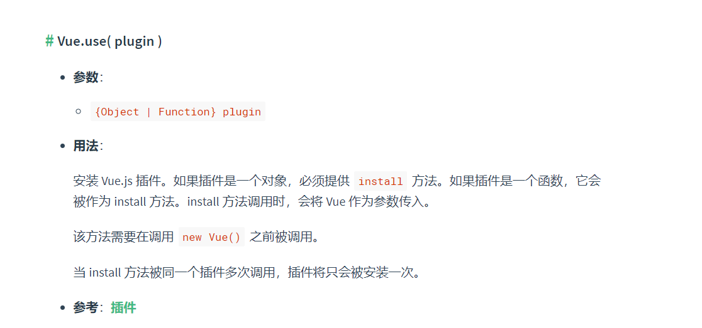

# 项目搭建

## vue脚手架

https://cli.vuejs.org/zh/guide/

**CLI**

CLI (`@vue/cli`) 是一个全局安装的 npm 包，提供了终端里的 `vue` 命令。它可以通过 `vue create` 快速搭建一个新项目，也可以通过 `vue ui` 通过一套图形化界面管理你的所有项目

**CLI 服务**

CLI 服务 (`@vue/cli-service`) 是一个开发环境依赖。它是一个 npm 包，局部安装在每个 `@vue/cli` 创建的项目中。

CLI 服务是构建于 [webpack](http://webpack.js.org/) 和 [webpack-dev-server](https://github.com/webpack/webpack-dev-server) 之上的。它包含了：

- 加载其它 CLI 插件的核心服务；
- 一个针对绝大部分应用优化过的内部的 webpack 配置；
- 项目内部的 `vue-cli-service` 命令，提供 `serve`、`build` 和 `inspect` 命令。

### vue-cli:项目生成

1. 安装脚手架：`npm install -g @vue/cli`	
2. 生成项目模板-可以自定义
   vue create 文件夹名称

### vue-cli-service:环境配置

```text
用法：vue-cli-service build [options] [entry|pattern]

选项：

  --mode        指定环境模式 (默认值：production)
  --dest        指定输出目录 (默认值：dist)
  --modern      面向现代浏览器带自动回退地构建应用
  --target      app | lib | wc | wc-async (默认值：app)
  --name        库或 Web Components 模式下的名字 (默认值：package.json 中的 "name" 字段或入口文件名)
  --no-clean    在构建项目之前不清除目标目录
  --report      生成 report.html 以帮助分析包内容
  --report-json 生成 report.json 以帮助分析包内容
  --watch       监听文件变化
```

#### 模式

> 可以通过传递 `--mode` 选项参数为命令行覆写默认的模式

- `development` 模式用于 `vue-cli-service serve`
- `test` 模式用于 `vue-cli-service test:unit`
- `production` 模式用于 `vue-cli-service build` 和 `vue-cli-service test:e2e`

如果你想要在构建命令中使用开发环境变量：

```text
vue-cli-service build --mode development
```

当运行 `vue-cli-service` 命令时，所有的环境变量都从对应的[环境文件](https://cli.vuejs.org/zh/guide/mode-and-env.html#环境变量)中载入

#### 环境变量

项目根目录中放置下列**环境文件**来指定环境变量：

```bash
.env                # 在所有的环境中被载入
.env.local          # 在所有的环境中被载入，但会被 git 忽略
.env.[mode]         # 只在指定的模式中被载入
.env.[mode].local   # 只在指定的模式中被载入，但会被 git 忽略
```

只有 `NODE_ENV`，`BASE_URL` 和以 `VUE_APP_` 开头的变量将通过 `webpack.DefinePlugin` 静态地嵌入到*客户端侧*的代码中

使用环境变量:`console.log(process.env.VUE_APP_SECRET)`

#### 缓存导致编译问题

`cache-loader` 会默认为 Vue/Babel/TypeScript 编译开启。文件会缓存在 `node_modules/.cache` 中——如果你遇到了编译方面的问题，记得先删掉缓存目录之后再试试看。

## 插件

### 工具类

#### 循环滚动列表

- vue-seamless-scroll

#### 展示动态图片

- https://svga.io/index.html

### 框架功能类

- vue-class-component： **用类的方式编写组件** ， vue2.x 对 TS 的支持并不友好，所以 vue2.x 跟 TS 的整合，通常需要基于 vue-class-component 来用基于 class（类） 的组件书写方式。 
- vue/cli-plugin-pwa**只能在https,或者本地生产环境使用**

### 存储

- vue-ls:用于从Vue上下文中使用本地Storage，会话Storage和内存Storage

## tip

- 组件内部引入第三方的js文件只在当前组件生效的办法

  https://www.cnblogs.com/qianxiaox/p/13826334.html

- UI使用

  Muse https://www.cnblogs.com/randomlee/p/10782710.html

# 基本概念

## 原理

### 响应式

https://zhuanlan.zhihu.com/p/53217382

数据发生改变的时候，视图会重新渲染，匹配更新为最新的值

**Object.defineProperty**可以为对象中的每一个属性，设置 get 和 set 方法

get 值是一个函数，当属性被访问时，会触发 get 函数

set 值同样是一个函数，当属性被赋值时，会触发 set 函数

```text
var obj={    
    name:"神仙朱"
}
Object.defineProperty(obj,"name",{
    get(){        
        console.log("get 被触发")
    },
    set(val){        
        console.log("set 被触发")
    }
})
```

当我访问 obj.name 时，会打印 ' get 被触发 '

当我为 obj.name 赋值时，obj.name = 5，会打印 ' set 被触发 '

### 虚拟DOM

> 见：v-for和虚拟DOM

## 标签数据

- **绑定数据**

1. {{msg}} , msg也可以是js表达式，但只能包含**单个**表达式

   > 一个表达式会产生一个值,它可以放在任何需要一个值的地方
   > 语句可以理解成一个行为.循环语句和if语句就是典型的语句
   > 需要语句的地方,你可以使用一个表达式来代替.这样的语句称之为表达式语句
   
2. v-model="msg"建立双向绑定 	

3. v-once指令： 执行一次性地插值，当数据改变时，插值处的内容不会更新 

   ```
   <span v-once>这个将不会改变: {{ msg }}</span>
   ```

- 编译html元素  {{msg}} 	v-html	
- v-text

## 标签属性

```vue


//缩写

//动态参数的缩写 
// 可以用方括号括起来的 JavaScript 表达式作为一个指令的参数 

```


  ```vue
a:'red',
b:'blue',
json:{
    red:true,
    blue:false
}

<strong :class="[条件?a:b]">文字。。</strong>//可以用三元表达式  
<strong :class="[a,b]">文字。。</strong>
<strong :class="{red:true,blue:false}">文字。。</strong>
<strong :class="json">文字。。</strong>

添加动态class
<strong :class="[条件?'className':'className',条件?'className':'className',]">
  ```

- 组件内部引入第三方的css文件只在当前组件生效的办法

  <style src="" scoped></style>

- vue样式穿透 ::v-deep   https://www.jb51.net/article/188038.htm

  修改vantUI样式，直接在 <style lang="scss" scoped> .... </style> 中编写的话只会影响当前组件内的样式，但如果去掉scoped话又会影响全局样式。

  如果你希望 scoped 样式中的一个选择器能够作用得“更深”，例如影响子组件，你可以使用 >>> 操作符：

  <style scoped> .a >>> .b { /* ... */ } </style> 上述代码将会编译成：.a[data-v-f3f3eg9] .b { /* … */ }
可以使用 /deep/ 或 ::v-deep 操作符取而代之——两者都是 >>> 的别名，同样可以正常工作。


##  computed和watch

- **watch 适用场景：一个数据影响多个数据；**
- **computed适用场景：一个数据受多个数据影响；**

### **计算属性computed**

计算属性是为了模板中的表达式简洁，易维护

```vue
<p id="app">{{ myname.substring(0,1).toUpperCase() + myname.substring(1) }}</p>
```

运算过于复杂，冗长，且不好维护，因此我们对于复杂的运算应该 使用计算属性的方式去书写。

```vue
<template>
  <div id="app">
    {{ changewords }}
    //通过在表达式中调用方法来达到同样的效果 //{{ changewords() }}
    //不同的是计算属性是基于它们的响应式依赖进行缓存的。只在相关响应式依赖发生改变时它们才会重新求值。这就意味着只要message 还没有发生改变，多次访问 reversedMessage,计算属性会立即返回之前的计算结果，而不必再次执行函数。
  </div>
</template>
<script>
export default {
  data() {
    return {};
  },
  method: {
    changewords() {
      return;
      //this.myname.substring(0, 1).toUpperCase() + this.myname.substring(1);
    },
  },
  computed: {
    changewords() {
      return 0;
      //this.myname.substring(0, 1).toUpperCase() + this.myname.substring(1);
    },
    //完整写法
    changewords: {
      get: function () {
        return; //一定要return
      },
      set: function (newVal) {},
    },
  },
};
</script>

```

- 变量不在 data中定义，而是定义在computed中

- 计算属性基于响应式依赖进行缓存。如其中的任意一个值未发生变化，它调用的就是上一次 计算缓存的数据，而不是从新计算。因此提高了程序的性能。而methods中每调用一次就会重新计算一次，为了进行不必要的资源消耗，选择用计算属性

- **支持缓存**，只有依赖数据发生改变，才会重新进行计算
- 不支持异步，当computed内有异步操作时无效，无法监听数据的变化

###   侦听器 **watch**

```js
  var vm = new Vue({
  	data: {
      question: '',
      answer: 'I cannot give you an answer until you ask a question!'
   	 },
    watch: {
      // 如果 `question` 发生改变，这个函数就会运行
      question: function (newQuestion, oldQuestion) {
        this.answer = 'Waiting for you to stop typing...'
        this.debouncedGetAnswer()
      }
    },
  })

  vm.$watch(name,fnCb);  //浅度
  vm.$watch(name,fnCb,{deep:true});  //深度监视 
```

- 不支持缓存，数据变，直接会触发相应的操作；

- **watch支持异步**；

- 监听的函数接收两个参数，第一个参数是最新的值；第二个参数是输入之前的值；

-  当一个属性发生变化时，需要执行对应的操作；一对多；

- 监听数据必须是data中声明过或者父组件传递过来的props中的数据，当数据变化时，触发其他操作，函数有两个参数
  - immediate：组件加载立即触发回调函数执行，
  - deep: 深度监听，为了发现**对象内部值**的变化，复杂类型的数据时使用，例如数组中的对象内容的改变，注意监听数组的变动不需要这么做。注意：deep无法监听到数组的变动和对象的新增
- **不应该使用箭头函数来定义 watcher 函数**，因为箭头函数没有 this，它的 this 会继承它的父级函数，但是它的父级函数是 window，导致箭头函数的 this 指向 window，而不是 Vue 实例

## 指令

### v-for和虚拟DOM

```js
v-for="(val,index) in array"
//:key="index"
//每次更改数组数据，全部的数据都会重新渲染，添加key值，从而只渲染更改的数据.这是因为每一个列表渲染的元素加上了唯一标识符，编译器通过标识符渲染指定列表，高效渲染虚拟DOM树
```

 打个🌰。把F元素插入到A B C D E中。 


其实是这么插的：新的dom和旧的dom比较， 第一个原来是A，更新之后还是A，所以就不变，第二个是B，更新之后还是B，所以还是不变，第三个是C，更新之后变成了F。  然后后面的都变化了 


但是如果给每一个列表渲染的元素加上了唯一标识符。列表更新之后，编译器通过标识符知道第一个元素是A。第三个是C，就不会更新成F。就像下图。


vue和react的虚拟DOM的Diff算法大致相同


- 如果dom树有三层，在没加ID的情况下。

  先比较第一层。比较一次

  再比较第二层。比较第一层第一个节点和第二层第一个节点，第一层第一个节点和第二层第二个节点，比较第一层第二个节点和第二层两个节点。比较了四次。

  算法复杂度，2的n次方。

- 如果加上ID。

  比较第一个节点。再比较第二个节点。再比较第三个节点。再比较第四个节点。再比较第五个节点。一直比到第n个节点。

  算法复杂度为n。

### v-if

```js
v-if 指令用于条件性地渲染一块内容。这块内容只会在指令的表达式返回 truthy 值的时候被渲染。
<h1 v-if="awesome">Vue is awesome!</h1>
也可以用 v-else 添加一个“else 块”：	
<h1 v-else>Oh no 😢</h1>

在 <template> 元素上使用 v-if 条件渲染分组
<template v-if="loginType === 'username'">
  <label>Username</label>
  <input placeholder="Enter your username">
</template>
<template v-else>
  <label>Email</label>
  <input placeholder="Enter your email address">
</template>
切换按钮将不会清除用户已经输入的内容。因为两个模板使用了相同的元素，<input> 不会被替换掉——仅仅是替换了它的 placeholder（替换成用户已经输入的内容）。
```

当它们处于同一节点，`v-for` 的优先级比 `v-if` 更高，这意味着 `v-if` 将分别重复运行于每个 `v-for` 循环中。当你只想为*部分*项渲染节点时，这种优先级的机制会十分有用，如下：

```js
<li v-for="todo in todos" v-if="!todo.isComplete">
  {{ todo }}
</li>
```

### v-show

```js
 <div v-show="a"> 
 v-show="a"//a是布尔值， 切换元素的 CSS property `display`

//Vue2.+ 中data数据对象是通过Object.defineProerty来进行数据的双向数据绑定，
//而数组则是监听数组的push和pop等操作数组的方法进行双向绑定的，
//因此当是通过下标来修改时便不能更新视图

//使用数组中的值来控制展示
 <div v-show="arr[index]"> 
this.$set(this.arr,index,!this.arr[index]);
//第一个参数为数组，第二个参数为数组下标，第三个参数为设置的值，
```

### 自定义指令

	Vue.directive(指令名称,function(参数){
		this.el	-> 原生DOM元素
	});
	
	<div v-red="参数"></div>

用户会看到花括号标记:v-cloak		防止闪烁, 比较大段落

交互：vue-resource.js

 ## 事件

### 使用方法

  ```js
  <!-- 完整语法 -->
  <a v-on:click="doSomething">...</a>
  
  <!-- 缩写 -->
  <a @click="doSomething">...</a>
  
  <!-- 动态参数的缩写 -->
  <a @[event]="doSomething"> ... </a>
  ```

```js
//使用原生的事件
mounted() {
    //不能直接定义事件，需要从methods中引入this.handleScroll
    //TODO,是否是this指向的问题
    window.addEventListener('scroll', this.handleScroll, true)
    this.boxTop = this.$refs.tabList.offsetTop;
},
```

### 修饰符

@click.stop="show1()"   stop防止事件冒泡  

```
阻止冒泡:  
    a). ev.cancelBubble=true;
    b). @click.stop	推荐
    c). event.stopPropagation();
```


```html

<!-- 阻止默认行为，提交事件不再重载页面 -->
<form v-on:submit.prevent="onSubmit"></form>

<!-- 修饰符可以串联 -->
<a v-on:click.stop.prevent="doThat"></a>

<!-- 添加事件监听器时使用事件捕获模式 -->
<!-- 即内部元素触发的事件先在此处理，然后才交由内部元素进行处理 -->
<div v-on:click.capture="doThis">...</div>

<!-- 只当在 event.target 是当前元素自身时触发处理函数 -->
<!-- 即事件不是从内部元素触发的 -->
<div v-on:click.self="doThat">...</div>

<!-- 点击事件将只会触发一次 -->
<a v-on:click.once="doThis"></a>

<!-- 滚动事件的默认行为 (即滚动行为) 将会立即触发 -->
<!-- 而不会等待 `onScroll` 完成  -->
<!-- 这其中包含 `event.preventDefault()` 的情况 -->
<div v-on:scroll.passive="onScroll">...</div>
```

### 键盘

@keydown	$event	ev.keyCode

```vue
常用键:
        回车
            a). @keyup.13
            b). @keyup.enter
        上、下、左、右
            @keyup/keydown.left
            @keyup/keydown.right
            @keyup/keydown.up
            @keyup/keydown.down
自定义键盘信息:
Vue.directive('on').keyCodes.ctrl=17;
//vue2.0	
通过全局 config.keyCodes 对象自定义按键修饰符别名：
Vue.config.keyCodes.ctrl=17;
@keyup.ctrl="fn()"
```

`.exact` 修饰符允许你控制由精确的系统修饰符组合触发的事件。

```vue
<!-- 即使 Alt 或 Shift 被一同按下时也会触发 -->
<button v-on:click.ctrl="onClick">A</button>

<!-- 有且只有 Ctrl 被按下的时候才触发 -->
<button v-on:click.ctrl.exact="onCtrlClick">A</button>

<!-- 没有任何系统修饰符被按下的时候才触发 -->
<button v-on:click.exact="onClick">A</button>
```

## filter

```js
<p>1.msg|filterA</p>
{{'welcome'|uppercase}}  
<p>2.msg|filterA</p>
{{'WELCOME'|lowercase|capitalize}}
```

 数据配合使用过滤器:
		limitBy	限制几个
		limitBy   参数(取几个)
		limitBy 取几个  从哪开始

```
	filterBy	过滤数据
	filterBy ‘谁’

	orderBy	排序
	orderBy 谁 1/-1
		1  -> 正序
		2  -> 倒序

自定义过滤器:  model ->过滤 -> view
	Vue.filter(name,function(msg,[a,b]){
		
	});
{{msg | name([a,b])}}
```

## 单元素/组件的过渡动画

https://cn.vuejs.org/v2/guide/transitions.html

Vue 提供了 `transition` 的封装组件，在下列情形中，可以给任何元素和组件添加进入/离开过渡

- 条件渲染 (使用 `v-if`)
- 条件展示 (使用 `v-show`)
- 动态组件
- 组件根节点

在进入/离开的过渡中，会有 6 个 class 切换。

1. `v-enter`：定义进入过渡的开始状态。在元素被插入之前生效，在元素被插入之后的下一帧移除。
2. `v-enter-active`：定义进入过渡生效时的状态。在整个进入过渡的阶段中应用，在元素被插入之前生效，在过渡/动画完成之后移除。这个类可以被用来定义进入过渡的过程时间，延迟和曲线函数。
3. `v-enter-to`：**2.1.8 版及以上**定义进入过渡的结束状态。在元素被插入之后下一帧生效 (与此同时 `v-enter` 被移除)，在过渡/动画完成之后移除。
4. `v-leave`：定义离开过渡的开始状态。在离开过渡被触发时立刻生效，下一帧被移除。
5. `v-leave-active`：定义离开过渡生效时的状态。在整个离开过渡的阶段中应用，在离开过渡被触发时立刻生效，在过渡/动画完成之后移除。这个类可以被用来定义离开过渡的过程时间，延迟和曲线函数。
6. `v-leave-to`：**2.1.8 版及以上**定义离开过渡的结束状态。在离开过渡被触发之后下一帧生效 (与此同时 `v-leave` 被删除)，在过渡/动画完成之后移除。


**实例**

```vue
<div id="demo">
  <button v-on:click="show = !show">
    Toggle
  </button>
  <transition name="fade">
    <p v-if="show">hello</p>
  </transition>
</div>

new Vue({
  el: '#demo',
  data: {
    show: true
  }
})

<style>
.fade-enter-active, .fade-leave-active {
  transition: opacity .5s;
}
.fade-enter, .fade-leave-to /* .fade-leave-active below version 2.1.8 */ {
  opacity: 0;
}
</style>>
```

## 混入mixin

https://cn.vuejs.org/v2/guide/mixins.html

混入 (mixin) 提供了一种非常灵活的方式，来分发 Vue 组件中的可复用功能。一个混入对象可以包含任意组件选项。当组件使用混入对象时，所有混入对象的选项将被“混合”进入该组件本身的选项。

# vm实例

```js
var data = { a: 1 }
var vm=new Vue({
    el:'#box',
    components:{ //局部组件
        'aaa':Aaa
    }，
    data:{
    	data:data
	},
    methods:{
        fn(){}
	}
});
// 获得这个实例上的 property
vm.a == data.a // => true
//设置 property 也会影响到原始数据
vm.a = 2
data.a // => 2
```

## property

### vm.$options

```js
 var vm=new Vue({
            // el:'#box',
            aa:11,//自定义属性
            show:function(){
                alert(1);
            },
            data:{
                a:1
            }
        });
console.log(vm.$options.aa);//获取自定义属性
vm.$options.show();
```

### vm.$data

Vue 实例观察的数据对象。Vue 实例代理了对其 data 对象 property 的访问。

```js
var data = { a: 1 }
var vm = new Vue({
  el: '#example',
  data: data
})

vm.$data === data // => true
vm.$el === document.getElementById('example') // => true

// $watch 是一个实例方法
vm.$watch('a', function (newValue, oldValue) {
  // 这个回调将在 `vm.a` 改变后调用
})
```

### vm.$props

当前组件接收到的 props 对象。Vue 实例代理了对其 props 对象 property 的访问。

### vm.$el

获取Vue实例挂载的元素节点

### vm.$refs

一个对象，持有注册过 [`ref` attribute](https://cn.vuejs.org/v2/api/#ref) 的所有 DOM 元素和组件实例。

### vm.$parent

父实例，如果当前实例有的话。

### vm.$children

当前实例的直接子组件。**需要注意 `$children` 并不保证顺序，也不是响应式的。**如果你发现自己正在尝试使用 `$children` 来进行数据绑定，考虑使用一个数组配合 `v-for` 来生成子组件，并且使用 Array 作为真正的来源。

### vm.$root

当前组件树的根 Vue 实例。如果当前实例没有父实例，此实例将会是其自己。

## 方法

### vm.$watch

vm.$watch( expOrFn, callback, [options] )

观察 Vue 实例上的一个表达式或者一个函数计算结果的变化。回调函数得到的参数为新值和旧值。

### vm.$set

vm.$set( target, propertyName/index, value )

## 生命周期

### vm.$mount

挂载,将数据转化为dom

### vm.$forceUpdate()

### nextTick

https://www.jianshu.com/p/a7550c0e164f

在下次 DOM 更新循环结束之后执行延迟回调。

```js
// 修改数据
vm.msg = 'Hello'
// DOM 还没有更新
Vue.nextTick(function () {
  // DOM 更新了
})

// 作为一个 Promise 使用 (2.1.0 起新增，详见接下来的提示)
Vue.nextTick()
  .then(function () {
    // DOM 更新了
  })
```

# 组件

## **组件命名**

- #### kebab-case(短横线分隔命名) 

  ```
  Vue.component('my-component-name', { /* ... */ })
  ```

- #### PascalCase  (首字母大写命名)    

  ```
  Vue.component('MyComponentName', { /* ... */ })
  ```


## 创建组件

### 局部注册

- **定义组件**

```js
//vue1.0组件定义
var Aaa = Vue.extend({
  //必须以函数的形式返回
  data() {
    return {
      msg: ''
    }
  },
  methods: {
    change() {
      this.msg = 'change'
    }
  },
  template: '<h1 @click="change">{{msg}}</h1>'
  //或者template:'#Aaa';
  components: {
    //组件里面还可以嵌套一个组件
  }
});
//vue2.0组件定义
<template id="Aaa">
  <h1 @click="change">{{ msg }}</h1>
</template >
var Aaa = {
  data() {
    return { isCollapse: true };
  },
  methods: {
  },
};
//导出组件
export default Aaa
```

- **组件使用**

```js
//导入组件
import Aaa from './Aaa'
export default {
  components: {
    Aaa,
  },
  // ...
}
```

### 全局组件

https://cn.vuejs.org/v2/guide/components-registration.html#%E5%9C%A8%E6%A8%A1%E5%9D%97%E7%B3%BB%E7%BB%9F%E4%B8%AD%E5%B1%80%E9%83%A8%E6%B3%A8%E5%86%8C

```js
import Vue from 'vue'
import upperFirst from 'lodash/upperFirst'
import camelCase from 'lodash/camelCase'

// 自动加载 global 目录下的 .js|vue 结尾的文件
const requireComponent = require.context(
  // 其组件目录的相对路径
  './components',
  // 是否查询其子目录
  true,
  // 匹配基础组件文件名的正则表达式
  /\.(vue|js)$/
)

requireComponent.keys().forEach(fileName => {
  // 获取组件配置
  const componentConfig = requireComponent(fileName)

  // 获取组件的 PascalCase 命名
  const componentName = upperFirst(
      const componentConfig = componentsContext(component)
      /**
      * 兼容 import export 和 require module.export 两种规范
      */
      const ctrl = componentConfig.default || componentConfig
      Vue.component(ctrl.name, ctrl)
})
```

记住**全局注册的行为必须在根 Vue 实例 (通过 `new Vue`) 创建之前发生**。[这里](https://github.com/chrisvfritz/vue-enterprise-boilerplate/blob/master/src/components/_globals.js)有一个真实项目情景下的示例。

## **动态组件**

<component :is="componentArr[i]"></component>

componentArr=[component1,component2]

## 内置组件

### 插槽：slot

组件里所有标签赋值给slot标签

```js
<aaa>
<ul slot="ul-slot">
	<li>1111</li>
	<li>2222</li>
	<li>3333</li>
</ul>
<ol slot="ol-slot">
	<li>111</li>
	<li>222</li>
	<li>333</li>
</ol>
</aaa>

	<template id="aaa">
		<div>
			<h1>xxxx</h1>
		<slot name="ol-slot">这是默认的情况</slot>
		<p>welcome vue</p>
		<slot name="ul-slot">这是默认的情况2</slot>
		</div>
	</template>
```

### keep-alive

#### 背景

Aaa和Baa组件，Aaa中有3个Tab栏（1，2，3），点击2后，点击Baa,再点击Aaa，会出现1的内容。这是因为你每次切换新标签的时候，Vue 都创建了一个新的 **currentTabComponent** 实例。

当在这些组件之间切换的时候，你有时会想保持这些组件的状态，以避免反复重渲染导致的性能问题。
用一个 <keep-alive> 元素将其动态组件包裹起来，**组件将会被缓存**

#### keep-alive

- **Props**：

  - `include` - 字符串或正则表达式。只有名称匹配的组件会被缓存。
  - `exclude` - 字符串或正则表达式。任何名称匹配的组件都不会被缓存。
  - `max` - 数字。最多可以缓存多少组件实例。

- **用法**：

  `<keep-alive>` 包裹动态组件时，会缓存不活动的组件实例，而不是销毁它们。和 `<transition>` 相似，`<keep-alive>` 是一个抽象组件：它自身不会渲染一个 DOM 元素，也不会出现在组件的父组件链中。

  当组件在 `<keep-alive>` 内被切换，它的 `activated` 和 `deactivated` 这两个生命周期钩子函数将会被对应执行。

  - 页面第一次进入，钩子的触发顺序created-> mounted-> activated
  - 退出时触发deactivated
  - 当再次进入（前进或者后退）时，只触发activated。

### [transition](https://cn.vuejs.org/v2/api/#transition)

#### **Prop**

- `name` - string，用于自动生成 CSS 过渡类名。例如：`name: 'fade'` 将自动拓展为 `.fade-enter`，`.fade-enter-active` 等。默认类名为 `"v"`
- `appear` - boolean，是否在初始渲染时使用过渡。默认为 `false`。
- `css` - boolean，是否使用 CSS 过渡类。默认为 `true`。如果设置为 `false`，将只通过组件事件触发注册的 JavaScript 钩子。
- `type` - string，指定过渡事件类型，侦听过渡何时结束。有效值为 `"transition"` 和 `"animation"`。默认 Vue.js 将自动检测出持续时间长的为过渡事件类型。
- `mode` - string，控制离开/进入过渡的时间序列。有效的模式有 `"out-in"` 和 `"in-out"`；默认同时进行。
- `duration` - number | { `enter`: number, `leave`: number } 指定过渡的持续时间。默认情况下，Vue 会等待过渡所在根元素的第一个 `transitionend` 或 `animationend` 事件。
- `enter-class` - string
- `leave-class` - string
- `appear-class` - string
- `enter-to-class` - string
- `leave-to-class` - string
- `appear-to-class` - string
- `enter-active-class` - string
- `leave-active-class` - string
- `appear-active-class` - string

#### 事件

- `before-enter`
- `before-leave`
- `before-appear`
- `enter`
- `leave`
- `appear`
- `after-enter`
- `after-leave`
- `after-appear`
- `enter-cancelled`
- `leave-cancelled` (`v-show` only)
- `appear-cancelled`

#### 用法

`<transition>` 元素作为**单个**元素/组件的过渡效果。`<transition>` 只会把过渡效果应用到其包裹的内容上，而不会额外渲染 DOM 元素，也不会出现在可被检查的组件层级中。

```
<!-- 简单元素 -->
<transition>
  <div v-if="ok">toggled content</div>
</transition>

<!-- 动态组件 -->
<transition name="fade" mode="out-in" appear>
  <component :is="view"></component>
</transition>

<!-- 事件钩子 -->
<div id="transition-demo">
  <transition @after-enter="transitionComplete">
    <div v-show="ok">toggled content</div>
  </transition>
</div>
```

```
new Vue({
  ...
  methods: {
    transitionComplete: function (el) {
      // 传入 'el' 这个 DOM 元素作为参数。
    }
  }
  ...
}).$mount('#transition-demo')
```

- **参考**：[过渡：进入，离开和列表](https://cn.vuejs.org/v2/guide/transitions.html)

## 类组件

vue-class-component 用类的方式编写组件 

## props

```vue
<!-- 在 HTML 中是 kebab-case(短横线分隔命名)  的 -->
<blog-post post-title="hello!"></blog-post>
<!-- 在 HTML 中是 的 camelCase (小驼峰)-->
<blog-post postTitle="hello!"></blog-post>、
//都可以用postTitle来获取
Vue.component('blog-post', {T
  // 在 JavaScript 中是 camelCase 的
  props: ['postTitle'],
  template: '<h3>{{ postTitle }}</h3>'
})
```

- ​	每个 prop 都可以指定的值类型

  ```json
  props: {
    title: String,
    likes: Number,
    isPublished: Boolean,
    commentIds: Array,
    author: Object,
    callback: Function,
    contactsPromise: Promise // or any other constructor
    src: {
        type: String,
      },
    style: {
        type: String,
        //使用 prop 定义中的 validator 选项，可以将一个 prop 类型限制在一组特定的值中。
        validator: s => ['square', 'rounded'].includes(s)
    }
  }
  ```

- 所有的 prop 都使得其父子 prop 之间形成了一个**单向下行绑定**：父级 prop 的更新会向下流动到子组件中，但是反过来则不行。这样会防止从子组件意外变更父级组件的状态，从而导致你的应用的数据流向难以理解。每次父级组件发生变更时，子组件中所有的 prop 都将会刷新为最新的值。

## 组件手动更新

- v-if

  ```vue
  <div v-if="isUpdate"></div>
  
  // 移除组件
  this.isUpdate = false;
  //在组件移除后，重新渲染组件
  //this.$nextTick可实现在DOM 状态更新后，执行传入的方法。
  this.$nextTick(() => {
  this.isUpdate = true;
  });
  ```

- :key

  ```vue
  <div v-if="isUpdate" :key="test"></div>
  
  this.test++
  ```

  

## 组件通信

https://segmentfault.com/a/1190000019208626

### 子组件获取父组件的数据

```js
父级 prop 的更新会向下流动到子组件中，但是反过来则不行。这样会防止从子组件意外变更父级组件的状态，从而导致你的应用的数据流向难以理解。
子组件中使用mounted编译完成，将父组件数据赋值给子组件的数据，而直接不使用父组件数据
mounted(){
            console.log(this.msg)
             this.b=this.msg;
       //   vue2.0不允许直接给父级的数据做赋值操作
       //若父组件每次传一个对象给子组件，则可以赋值
}
```

### 父组件获取子组件的数据

组件通信: 实现子组件向父组件通信

父组件监听子组件的触发的事件，从而处理事件

```vue
	<div id="box">
		<aaa>
		</aaa>
	</div>
	
	<template id="aaa">
		<span>我是父级 -> {{msg}}</span>
		<bbb @child-msg="get"></bbb>
	</template>
	<template id="bbb">
		<h3>子组件-> {{a}}</h3>
		<input type="button" value="send" @click="send">
	</template>
	
	<script>
		var vm=new Vue({
			el:'#box',
			data:{
				a:'aaa'
			},
			components:{
				'aaa':{
					data(){
						return {
							msg:'我是父组件的数据'
						}
					},
					template:'#aaa',
					methods:{
						get(msg){
							alert(msg);
							this.msg=msg;
						}
					},
					components:{
						'bbb':{
							data(){
								return {
									a:'我是子组件的数据'
								}
							},
							template:'#bbb',
							methods:{
								send(){
									//将子组件的数据传递给父组件
									this.$emit('child-msg',this.a);
								}
							}
						}
					}
				}
			}
		});

	</script>
```

### 中央事件总线

**这种方法通过一个空的Vue实例作为中央事件总线（事件中心），用它来触发事件和监听事件,巧妙而轻量地实现了任何组件间的通信，包括父子、兄弟、跨级**。当我们的项目比较大时，可以选择更好的状态管理解决方案vuex。

```
var Event = new Vue();　　　　　　相当于又new了一个vue实例，Event中含有vue的全部方法；

Event.$emit('msg',this.msg);　　　   发送数据，第一个参数是发送数据的名称，接收时还用这个名字接收，第二个参数是这个数据现在的位置；

Event.$on('msg',function(msg){　　接收数据，第一个参数是数据的名字，与发送时的名字对应，第二个参数是一个方法，要对数据的操作

事件总线eventBus主要是在要相互通信的两个Vue页面之中，都引入一个新的vue实例，然后通过分别调用这个实例的事件触发和监听来实现通信和参数传递。
```

```js
//准备一个空的实例对象
        var Event=new Vue();
        var A={
            template:`
                <div>
                    <span>我是A组件</span> -> {{a}}
                    <input type="button" value="把A数据给C" @click="send">
                </div>
            `,
            methods:{
                send(){
                    Event.$emit('a-msg',this.a);
                }
            },
            data(){
                return {
                    a:'我是a数据'
                }
            }
        };
        var C={
            template:`
                <div>
                    <h3>我是C组件</h3>
                    <span>接收过来的A的数据为: {{a}}</span>
                </div>
            `,
            data(){
                return {
                    a:''
                }
            },
            mounted(){
                //var _this=this;
                Event.$on('a-msg',function(a){
                    this.a=a;
                }.bind(this));
            }
        };
```

### provide/inject

**允许一个祖先组件向其所有子孙后代注入一个依赖，不论组件层次有多深，并在起上下游关系成立的时间里始终生效**。

一言而蔽之：祖先组件中通过provider来提供变量，然后在子孙组件中通过inject来注入变量。

**provide / inject API 主要解决了跨级组件间的通信问题，不过它的使用场景，主要是子组件获取上级组件的状态，跨级组件间建立了一种主动提供与依赖注入的关系**。

### `$parent` / `$children`与 `ref`

- `ref`：如果在普通的 DOM 元素上使用，引用指向的就是 DOM 元素；如果用在子组件上，引用就指向组件实例
- `$parent` / `$children`：访问父 / 子实例
- **这两种方法的弊端是，无法在跨级或兄弟间通信**。

```js
// component-a 子组件
export default {
  data () {
    return {
      title: 'Vue.js'
    }
  },
  methods: {
    sayHello () {
      window.alert('Hello');
    }
  }
}
```

```js
// 父组件
<template>
  <component-a ref="comA"></component-a>
</template>
<script>
  export default {
    mounted () {
      const comA = this.$refs.comA;
      console.log(comA.title);  // Vue.js
      comA.sayHello();  // 弹窗
    }
  }
</script>
```

### 使用场景

- 父子通信：

父向子传递数据是通过 props，子向父是通过 events（`$emit`）；通过父链 / 子链也可以通信（`$parent` / `$children`）；ref 也可以访问组件实例；provide / inject API；`$attrs/$listeners`

- 兄弟通信：

Bus；Vuex

- 跨级通信：

Bus；Vuex；provide / inject API、`$attrs/$listeners`

## 第三方组件

### Vue.use



> 用饿了么UI举例

```javascript
import Vue from 'vue'
import Element from 'element-ui'
Vue.use(Element)
```

> 饿了么部分源码

```tsx
//types/element-ui.d.ts
export interface InstallationOptions {
  locale: any,
  i18n: any,
  size: string
}
export function install (vue: typeof Vue, options: InstallationOptions): void

//src/index.js
const install = function(Vue, opts = {}) {
  locale.use(opts.locale);
  locale.i18n(opts.i18n);

  components.forEach(component => {
    Vue.component(component.name, component);
  });

  Vue.use(InfiniteScroll);
  Vue.use(Loading.directive);

  Vue.prototype.$ELEMENT = {
    size: opts.size || '',
    zIndex: opts.zIndex || 2000
  };

  Vue.prototype.$loading = Loading.service;
  Vue.prototype.$msgbox = MessageBox;
  Vue.prototype.$alert = MessageBox.alert;
  Vue.prototype.$confirm = MessageBox.confirm;
  Vue.prototype.$prompt = MessageBox.prompt;
  Vue.prototype.$notify = Notification;
  Vue.prototype.$message = Message;

};
/* istanbul ignore if */
if (typeof window !== 'undefined' && window.Vue) {
  install(window.Vue);
}
```

 `ue.use`就是要运行这个`install`对应的函数 

**总结**

1. Vue的插件是一个**对象**, 就像`Element`.
2. 插件**对象**必须有`install`字段.
3. `install`字段是一个函数.
4. 初始化插件**对象**需要通过`Vue.use()`

### Vue.prototype.$xxx

vue.prototype去定义实例对象，定义一个全局的方法

# vue生命周期

## 背景

Vue 实例在被创建时都要经过一系列的初始化过程 ， 编译模板、将实例挂载到 DOM 并在数据变化时更新 DOM 等 。 在这个过程中也会运行一些叫做**生命周期钩子**的函数，这给了用户在不同阶段添加自己的代码的机会。 

## 生命周期函数	

- vue1.0

```js
created	->   实例已经创建	√
beforeCompile	->   编译之前
compiled	->   编译之后
ready		->   插入到文档中	√
beforeDestroy	->   销毁之前
destroyed	->   销毁之后
```

- vue2.0

  https://zhuanlan.zhihu.com/p/53039906


```
beforeCreate	
组件实例刚刚被创建,属性都没有，组件的el（Vue实例挂载的元素节点）和data都未被创建

created			     
实例已经创建完成，组件的数据data已经被创建好，但是el还处于未被创建状态。

beforeMount		
模板编译之前,组件的el会被创建，render 函数首次被调用。但是值得注意的是：虽然数据data早已经被创建好，但是它还未被应用到真实的DOM元素中,而是render将data中的数据和vue声明的模板template编译成浏览器可读的HTML挂载到对应虚拟dom触发的钩子。

mounted			
模板编译之后，组件的el,data都已经全部被创建好，触发虚拟dom的钩子将编译好的HTML替换掉el属性所指的dom，应用到真实DOM元素中。可以在 mounted 内部使用 vm.$nextTick：

beforeUpdate	组件更新之前
updated			组件更新完毕	
beforeDestroy	组件销毁前
destroyed		组件销毁后

activated	keep-alive 组件激活时调用。
deactivated	keep-alive 组件停用时调用。
```

  

不要在生命周期函数或者回调上使用箭头函数， 因为箭头函数并没有 `this` ,this指向调用它的VUE实例

 比如 `created: () => console.log(this.a)` 或 `vm.$watch('a', newValue => this.myMethod())` 


# vue-router路由

## **hash和history**

最直观的区别就是在url中 hash 带了一个很丑的 # 而history是没有#的

### 原理

**hash**

window监听到哈希值的变化，触发**onhashchage事件**。hash虽然出现在URL中，但不会被包括在HTTP请求中，对后端完全没有影响，因此改变hash不会重新加载页面，只是按需加载前端的代码块。哈希模式也是当下单页面应用的标配,所谓前端路由的强大之处也就在这里：路由分发不需要服务器来做，前端自己就可以完成。

**history**

利用了HTML5 History Interface中新增的pushState和replaceState方法。这两个方法应用于浏览器的历史记录栈， **而不会引起页面的刷新** ，在当前已有的 back、forward、go 的基础之上，它们提供了对**历史记录进行修改**的功能。

下面阐述几种 `HTML5` 新增的 `history API` 。**具体如下表：**

| API                                       | 定义                                                         |
| ----------------------------------------- | ------------------------------------------------------------ |
| history.pushState(data, title [, url])    | pushState主要用于**往历史记录堆栈顶部添加一条记录**。各参数解析如下：**①data**会在onpopstate事件触发时作为参数传递过去；**②title**为页面标题，当前所有浏览器都会忽略此参数；③**url**为页面地址，可选，缺少时表示为当前页地址 |
| history.replaceState(data, title [, url]) | 更改当前的历史记录，参数同上； 上面的pushState是添加，这个更改 |
| history.state                             | 用于存储以上方法的data数据（即state对象），如果当前URL不是通过pushState或者replaceState产生的，那么history.state是null。 |
| window.onpopstate                         | 响应pushState或者replaceState的调用。                        |

### 总结


## 配置

### 手动配置路由

直接`vue add router`,或者

1. 下载vue-router模块  

   ```bash
   npm install vue-router
   ```

2. 创建文件夹，存放路由配置

   ```js
   import Vue from "vue";
   import VueRouter from "vue-router";
   import login from "../components/login.vue";
   import register from "../components/register.vue"
   
   Vue.use(VueRouter);
   
   const routes = [
     {
       path: "/",
       component: login,
     },
     {
       path: "/register",
       component: register,
     },
   ];
   
   const router = new VueRouter({
     mode: "history",
     base: process.env.BASE_URL,
     routes,
   });
   
   export default router;
   
   ```

3. main.js文件中引入router

   ```js
   import Vue from "vue";
   import App from "./App.vue";
   import VueRouter from "vue-router";
   import router from "./router/index";
   
   Vue.config.productionTip = false;
   
   Vue.use(VueRouter);
   new Vue({
     router: router,
     render: (h) => h(App),
   }).$mount("#app");
   ```

### 自动配置路由

根据文件夹自动配置路由


```js
//index.js
import Vue from 'vue'
import VueRouter from 'vue-router'
Vue.use(VueRouter)

let routes = []
const isProd = process.env.NODE_ENV === 'production'
const routerContext = require.context('./', true, /index\.js$/)

routerContext.keys().forEach(route => {
  // route就是路径
  // 如果是根目录的index不做处理
  if (route.startsWith('./index')) {
    return
  }
  const routerModule = routerContext(route)
  routes = [...routes, ...(routerModule.default || routerModule)]
  console.log(routes)
});

console.log(process.env.BASE_URL)

const router = new VueRouter({
  mode: 'history',
  base: isProd && process.env.VUE_APP_PREVIEW !== 'true' ? '/wechatpub/' : process.env.BASE_URL,
  routes
})

export default router
```

```js
//activity/index.js
/**
 * 活动路由配置
 */
export default [
  {
    path: '/activity/smashedEgg/:id',
    name: 'SmashedEgg',
    component: () => import(/* webpackChunkName: "survey" */ 					'@/views/activity/SmashedEgg.vue'),
  }
]
```

## 动态路由匹配 

| 模式                          | 匹配路径            | $route.params                          |
| ----------------------------- | ------------------- | -------------------------------------- |
| /user/:username               | /user/evan          | `{ username: 'evan' }`                 |
| /user/:username/post/:post_id | /user/evan/post/123 | `{ username: 'evan', post_id: '123' }` |

除了 `$route.params` 外，[API 文档](https://router.vuejs.org/zh/api/#路由对象)

当使用路由参数时，例如从 `/user/foo` 导航到 `/user/bar`，**原来的组件实例会被复用**。因为两个路由都渲染同个组件，比起销毁再创建，复用则显得更加高效。**不过，这也意味着组件的生命周期钩子不会再被调用**。

复用组件时，想对路由参数的变化作出响应的话，你可以简单地 watch (监测变化) `$route` 对象

```js
const User = {
  template: '...',
  watch: {
    $route(to, from) {
      // 对路由变化作出响应...
    }
  }
}
```

或者使用 2.2 中引入的 `beforeRouteUpdate` [导航守卫](https://router.vuejs.org/zh/guide/advanced/navigation-guards.html)：

```js
const User = {
  template: '...',
  beforeRouteUpdate(to, from, next) {
    // react to route changes...
    // don't forget to call next()
  }
}
```

### 捕获所有路由

```js
//当使用通配符路由时，请确保路由的顺序是正确的，也就是说含有通配符的路由应该放在最后
//路由 { path: '*' } 通常用于客户端 404 错误。
{
  // 会匹配所有路径
  path: '*'
}

{
  // 会匹配以 `/user-` 开头的任意路径
  path: '/user-*'
}
```

当使用一个*通配符*时，`$route.params` 内会自动添加一个名为 `pathMatch` 参数。它包含了 URL 通过*通配符*被匹配的部分：

```js
// 给出一个路由 { path: '/user-*' }
this.$router.push('/user-admin')
this.$route.params.pathMatch // 'admin'
// 给出一个路由 { path: '*' }
this.$router.push('/non-existing')
this.$route.params.pathMatch // '/non-existing'
```

## 嵌套路由

<router-view> 是最顶层的出口，渲染最高级路由匹配到的组件。同样地，一个被渲染组件同样可以包含自己的嵌套 <router-view>

例如，在 `User` 组件的模板添加一个 `<router-view>`：

```vue
//app.vue
<div id="app">
  <router-view></router-view>
</div>
//user.vue
const User = {
  template: `
    <div class="user">
      <h2>User {{ $route.params.id }}</h2>
      <router-view></router-view>
    </div>
  `
}
```

要在嵌套的出口中渲染组件，需要在 `VueRouter` 的参数中使用 `children` 配置：

```js
const router = new VueRouter({
  routes: [
    {
      path: '/user/:id',
      component: User,
      children: [
        {
          // 当 /user/:id/profile 匹配成功，
          // UserProfile 会被渲染在 User 的 <router-view> 中
          path: 'profile',
          component: UserProfile
        },
        {
          // 当 /user/:id/posts 匹配成功
          // UserPosts 会被渲染在 User 的 <router-view> 中
          path: 'posts',
          component: UserPosts
        }
      ]
    }
  ]
})
```

**要注意，以 `/` 开头的嵌套路径会被当作根路径。 这让你充分的使用嵌套组件而无须设置嵌套的路径。**

## 命名路由

 有时候，通过一个名称来标识一个路由显得更方便一些，特别是在链接一个路由，或者是执行一些跳转的时候。你可以在创建 Router 实例的时候，在 `routes` 配置中给某个路由设置名称。 

```js
const router = new VueRouter({
  routes: [
    {
      path: '/user/:userId',
      name: 'user',
      component: User
    }
  ]
})
```

要链接到一个命名路由，可以给 `router-link` 的 `to` 属性传一个对象：

```html
<router-link :to="{ name: 'user', params: { userId: 123 }}">User</router-link>
```

这跟代码调用 `router.push()` 是一回事：

```js
router.push({ name: 'user', params: { userId: 123 } })
```

这两种方式都会把路由导航到 `/user/123` 路径。

## 路由守卫

 全局路由一共分为三类：全局守卫，路由独享的守卫，组件内的守卫。

```stylus
全局守卫有三种：
    1.router.beforeEach（全局前置守卫）
    2.router.beforeResolve（全局解析守卫）
    3.router.afterEach（全局后置守卫）
```

 1.router.beforeEach（全局前置守卫）

```stylus
以一个简单的例子来解释router.beforeEach
假设我们现在做一个这样的需求，用户在未登录的时候进入任意页面，我们就让用户跳转到登录页面，在已登录的时候让用户正常跳
转到点击的页面。
```

2.router.beforeResolve(全局解析守卫)

```undefined
和全局前置守卫类似，区别是在跳转被确认之前，同时在所有组件内守卫和异步路由组件都被解析之后，解析守卫才调用。
```

3.router.afterEach(全局后置钩子)

```vbnet
只接受to和from,不会接受 next 函数也不会改变导航本身
```

二、路由独享守卫

```mipsasm
独享守卫只有一种:beforeEnter。
该守卫接收的参数与全局守卫是一样的，但是该守卫只在其他路由跳转至配置有beforeEnter路由表信息时才生效。
router配置文件内容：
{
   path: '/about',
   name: 'about',
   component: about,
   beforeEnter:(to,from,next)=>{
      console.log(to);
      console.log(from);
      next()
   }
```

三、组件内守卫

```mipsasm
组件内守卫一共有三个：
    beforeRouteEnter，
    beforeRouteUpdate，
    beforeRouteLeave
三者分别对应：进入该路由时执行，该路由中参数改变时执行，离开该路由时执行。
<template>
  <div>关于页面</div>
</template>
<script>
  export default {
    name: "about",
    beforeRouteEnter(to, from, next) {
      //进入该路由时执行
    },
    beforeRouteUpdate(to, from, next) {
      //该路由参数更新时执行
    },
    beforeRouteLeave(to, from, next) {
      //离开该路由时执行
    }
  }
</script>
<style scoped>
</style>
```

## 标签

### router-view

`<router-view>` 组件是一个 function 组件，渲染路径匹配到的视图组件。`<router-view>` 渲染的组件还可以内嵌自己的 `<router-view>`，根据嵌套路径，渲染嵌套组件。

因为它也是个组件，所以可以配合 `<transition>` 和 `<keep-alive>` 使用。如果两个结合一起用，要确保在内层使用 `<keep-alive>`：

```html
<transition>
  <keep-alive>
    <router-view></router-view>
  </keep-alive>
</transition>
```

### router-link

```
<!-- 使用 router-link 组件来导航. -->
<!-- 通过传入 `to` 属性指定链接. -->
<!-- <router-link> 默认会被渲染成一个 `<a>` 标签 -->
<router-link to="/foo">Go to Foo</router-link>
<router-link to="/bar">Go to Bar</router-link>
```

要注意，当 `<router-link>` 对应的路由匹配成功，将自动设置 class 属性值 `.router-link-active`

要链接到一个命名路由，可以给 `router-link` 的 `to` 属性传一个对象：

```html
<router-link :to="{ name: 'user', params: { userId: 123 }}">User</router-link>
```

这跟代码调用 `router.push()` 是一回事：

```js
router.push({ name: 'user', params: { userId: 123 } })
```

## API

### 路由

#### router.push

**注意：在 Vue 实例内部，你可以通过 `$router` 访问路由实例。因此你可以调用 `this.$router.push`。**

`router.push` 这个方法会向 history 栈添加一个新的记录，所以，当用户点击浏览器后退按钮时，则回到之前的 URL。

当你点击 `<router-link>` 时，这个方法会在内部调用，所以说，点击 `<router-link :to="...">` 等同于调用 `router.push(...)`

```js
// 字符串
router.push('home')

// 对象
router.push({ path: 'home' })

// 命名的路由
router.push({ name: 'user', params: { userId: '123' }})

// 带查询参数，变成 /register?plan=private
router.push({ path: 'register', query: { plan: 'private' }})
```

**注意：如果提供了 `path`，`params` 会被忽略，上述例子中的 `query` 并不属于这种情况。取而代之的是下面例子的做法，你需要提供路由的 `name` 或手写完整的带有参数的 `path`：**

```js
const userId = '123'
router.push({ name: 'user', params: { userId }}) // -> /user/123
router.push({ path: `/user/${userId}` }) // -> /user/123
// 这里的 params 不生效
router.push({ path: '/user', params: { userId }}) // -> /user
```

#### router.replace

跟 `router.push` 很像，唯一的不同就是，它不会向 history 添加新记录，而是跟它的方法名一样 —— 替换掉当前的 history 记录。

| 声明式                            | 编程式                |
| --------------------------------- | --------------------- |
| `<router-link :to="..." replace>` | `router.replace(...)` |

#### `router.go(n)`

这个方法的参数是一个整数，意思是在 history 记录中向前或者后退多少步，类似 `window.history.go(n)`。

例子

```js
// 在浏览器记录中前进一步，等同于 history.forward()
router.go(1)

// 后退一步记录，等同于 history.back()
router.go(-1)

// 前进 3 步记录
router.go(3)

// 如果 history 记录不够用，那就默默地失败呗
router.go(-100)
router.go(100)
```

# vuex

vuex是一个专为 Vue.js 应用程序开发的**状态管理模式** 。它采用集中式存储管理应用的所有组件的状态 


这个状态自管理应用包含以下几个部分：

- **state**，驱动应用的数据源；
- **view**，以声明方式将 **state** 映射到视图；
- **actions**，响应在 **view** 上的用户输入导致的状态变化。


## 开始

每一个 Vuex 应用的核心就是 store（仓库）。“store”基本上就是一个容器，它包含着你的应用中大部分的**状态 (state)**。Vuex 和单纯的全局对象有以下两点不同：

1. Vuex 的状态存储是响应式的。当 Vue 组件从 store 中读取状态的时候，若 store 中的状态发生变化，那么相应的组件也会相应地得到高效更新。
2. 你不能直接改变 store 中的状态。改变 store 中的状态的唯一途径就是显式地**提交 (commit) mutation**。这样使得我们可以方便地跟踪每一个状态的变化，从而让我们能够实现一些工具帮助我们更好地了解我们的应用。

```js
import Vue from 'vue'
import Vuex from 'vuex'

Vue.use(Vuex)
const store = new Vuex.Store({
  state: {
    count: 0
  },
  mutations: {
    increment (state) {
      state.count++
    }
  }
})
store.commit('increment')
console.log(store.state.count) // -> 1

//Vuex 提供了一个从根组件向所有子组件，以 store 选项的方式“注入”该 store 的机制
new Vue({
  el: '#app',
  store: store,
})
methods: {
  increment() {
    this.$store.commit('increment')
    console.log(this.$store.state.count)
  }
}
```

## 结构

### state

Vuex 通过 `store` 选项，提供了一种机制将状态从根组件“注入”到每一个子组件中

```js
//main.js
new Vue({
  // 创建和挂载根实例。
  // 记得要通过 router 配置参数注入路由，
  // 从而让整个应用都有路由功能
  router: router,
  store,
  render: h => h(App),
}).$mount('#app')

//通过在根实例中注册 store 选项，该 store 实例会注入到根组件下的所有子组件中，且子组件能通过 this.$store 访问到
const Counter = {
  template: `<div>{{ count }}</div>`,
  //从 store 实例中读取状态最简单的方法就是在计算属性中返回某个状态
  computed: {
    count () {
      return this.$store.state.count
    }
  }
}
```

```js
//当一个组件需要获取多个状态的时候，将这些状态都声明为计算属性会有些重复和冗余。为了解决这个问题，我们可以使用 mapState 辅助函数帮助我们生成计算属性
// 在单独构建的版本中辅助函数为 Vuex.mapState
import { mapState } from 'vuex'

export default {
  // ...
  computed: mapState({
    // 箭头函数可使代码更简练
    count: state => state.count,

    // 传字符串参数 'count' 等同于 `state => state.count`
    countAlias: 'count',

    // 为了能够使用 `this` 获取局部状态，必须使用常规函数
    countPlusLocalState (state) {
      return state.count + this.localCount
    }
  })
}
```

### getters

Vuex 允许我们在 store 中定义“getter”（可以认为是 store 的计算属性）。就像计算属性一样，getter 的返回值会根据它的依赖被缓存起来，且只有当它的依赖值发生了改变才会被重新计算。

```js
computed: {
  doneTodosCount () {
    return this.$store.state.todos.filter(todo => todo.done).length
  }
}
```

```js
const store = new Vuex.Store({
  state: {
    todos: [
      { id: 1, text: '...', done: true },
      { id: 2, text: '...', done: false }
    ]
  },
  getters: {
    doneTodos: state => {
      return state.todos.filter(todo => todo.done)
    }
  }
})

computed: {
  doneTodosCount () {
    //Getter 会暴露为 store.getters 对象，你可以以属性的形式访问这些值
    return this.$store.getters.doneTodosCount
  }
}
```

```js
import { mapGetters } from 'vuex'
export default {
  // ...
  computed: {
  // 使用对象展开运算符将 getter 混入 computed 对象中
    ...mapGetters([
      'doneTodosCount',
      'anotherGetter',
    ])
  }
}
```

###  Mutation

更改 Vuex 的 store 中的状态的唯一方法是提交 mutation。Vuex 中的 mutation 非常类似于事件：每个 mutation 都有一个字符串的 **事件类型 (type)** 和 一个 **回调函数 (handler)**。这个回调函数就是我们实际进行状态更改的地方，并且它会接受 state 作为第一个参数：

```js
const store = new Vuex.Store({
  state: {
    count: 1
  },
  mutations: {
    increment (state,n) {
      // 变更状态
      state.count+=n
    }
  }
})
```

唤醒一个 mutation handler，你需要以相应的 type 调用 **store.commit** 方法：

```js
store.commit("increment", {
  mount: n,
});

store.commit({
  type: "increment",
  amount: n,
});

```

> Mutation 必须是同步函数

### Action

Action 类似于 mutation，不同在于：

- Action 提交的是 mutation，而不是直接变更状态。
- Action 可以包含任意**异步操作**(请求在这里操作)。

```js
const store = new Vuex.Store({
  state: {
    count: 0
  },
  mutations: {
    increment (state) {
      state.count++
    }
  },
  actions: {
    increment (context) {
      context.commit('increment')
    }
  }
})
```

Action 函数接受一个与 **store 实例**具有相同方法和属性的 context 对象，因此你可以调用 `context.commit` 提交一个 mutation，或者通过 `context.state` 和 `context.getters` 来获取 state 和 getters。

```js
actions: {
    increment (context) {
        context.commit('increment')
    }
}
//实践中，我们会经常用到 ES2015 的 参数解构 (opens new window)来简化代码
actions: {
    increment ({ commit }) {
        commit('increment')
    }
}
```

Action 通过 `store.dispatch` 方法触发：

```js
store.dispatch('increment')
```

Actions 支持同样的载荷方式和对象方式进行分发：

```js
// 以载荷形式分发
store.dispatch('incrementAsync', {
  amount: 10
})

// 以对象形式分发
store.dispatch({
  type: 'incrementAsync',
  amount: 10
})
```

> 可以在 action 内部执行**异步**操作

###  Module

由于使用单一状态树，应用的所有状态会集中到一个比较大的对象。当应用变得非常复杂时，store 对象就有可能变得相当臃肿。

为了解决以上问题，Vuex 允许我们将 store 分割成**模块（module）**。每个模块拥有自己的 state、mutation、action、getter、甚至是嵌套子模块——从上至下进行同样方式的分割：

```js
const moduleA = {
  state: () => ({ ... }),
  mutations: { ... },
  actions: { ... },
  getters: { ... }
}

const moduleB = {
  state: () => ({ ... }),
  mutations: { ... },
  actions: { ... }
}

const store = new Vuex.Store({
  modules: {
    a: moduleA,
    b: moduleB
  }
})

store.state.a // -> moduleA 的状态
store.state.b // -> moduleB 的状态
```

## vuex项目

```
├── index.html
├── main.js
├── api
│   └── ... # 抽取出API请求
├── components
│   ├── App.vue
│   └── ...
└── store
    ├── index.js          # 我们组装模块并导出 store 的地方
    ├── getters.js        # 根级别的 action
    ├── mutations.js      # 根级别的 mutation
    └── modules
        ├── user.js       # 
        └── market.js   # 
```

### index.js

```js
import Vue from 'vue'
import Vuex from 'vuex'
import getters from './getters'
import user from './modules/user'
import market from './modules/market'
Vue.use(Vuex)
export default new Vuex.Store({
  modules: {
    user,
    market
  },
  state: {
  },
  mutations: {
  },
  actions: {
  },
  getters
})

```

### getters.js

```js
const user = {
  userInfo: state => state.user.userInfo,
  fullInfo: state => state.user.fullInfo,
  areaList: state => state.user.areaList,
}

const market = {
  homePage: state => state.market.homePage,
  goodsInfo: state => state.market.goodsInfo,
}

const getters = {
  ...user,
  ...market
}

export default getters

```

### user.js

```js
/* eslint-disable no-unused-vars */
/**
 * 初始化，向后端请求用户信息
 */
import {
  getUserCoreInfo,
  getUserFullInfo,
  getCityDropDown,
 } from '@/api/user'

const user = {
  state: {
    userInfo: {},
    fullInfo: {},
    areaList: {},
  },
  mutations: {
    SET_CORE_INFO: (state, data) => {
      state.userInfo = data
    },
    SET_FULL_INFO: (state, data) => {
      state.fullInfo = data
    },
    SET_AREA_LIST: (state, data) => {
      state.areaList = data
    },
  },
  actions: {
    async GetUserCoreInfo ({ commit }) {
      const result = await getUserCoreInfo()
      commit('SET_CORE_INFO', result.data)
    },
    async GetUserFullInfo ({ commit }) {
      const result = await getUserFullInfo()
      commit('SET_FULL_INFO', result.data)
    },
    async EditUserFullInfo ({ commit }, params) {
      return await editUserFullInfo(params)
    },
  }
}

export default user

```

### 调用

```js
  computed: {
    userCoreInfo () {
      return this.$store.getters.userInfo
    }
  },
  created () {
    const { dispatch } = this.$store
    dispatch('GetUserCoreInfo')
  },
```


# vue3

## Vue3快速上手


### 1.Vue3简介

- 2020年9月18日，Vue.js发布3.0版本，代号：One Piece（海贼王）
- 耗时2年多、[2600+次提交](https://github.com/vuejs/vue-next/graphs/commit-activity)、[30+个RFC](https://github.com/vuejs/rfcs/tree/master/active-rfcs)、[600+次PR](https://github.com/vuejs/vue-next/pulls?q=is%3Apr+is%3Amerged+-author%3Aapp%2Fdependabot-preview+)、[99位贡献者](https://github.com/vuejs/vue-next/graphs/contributors) 
- github上的tags地址：https://github.com/vuejs/vue-next/releases/tag/v3.0.0

### 2.Vue3带来了什么

### 1.性能的提升

- 打包大小减少41%

- 初次渲染快55%, 更新渲染快133%

- 内存减少54%

  ......

### 2.源码的升级

- 使用Proxy代替defineProperty实现响应式

- 重写虚拟DOM的实现和Tree-Shaking

  ......

### 3.拥抱TypeScript

- Vue3可以更好的支持TypeScript

### 4.新的特性

1. Composition API（组合API）

   - setup配置
   - ref与reactive
   - watch与watchEffect
   - provide与inject
   - ......
2. 新的内置组件
   - Fragment 
   - Teleport
   - Suspense
3. 其他改变

   - 新的生命周期钩子
   - data 选项应始终被声明为一个函数
   - 移除keyCode支持作为 v-on 的修饰符
   - ......

## 一、创建Vue3.0工程

### 1.使用 vue-cli 创建

官方文档：https://cli.vuejs.org/zh/guide/creating-a-project.html#vue-create

```bash
## 查看@vue/cli版本，确保@vue/cli版本在4.5.0以上
vue --version
## 安装或者升级你的@vue/cli
npm install -g @vue/cli
## 创建
vue create vue_test
## 启动
cd vue_test
npm run serve
```

### 2.使用 vite 创建

官方文档：https://v3.cn.vuejs.org/guide/installation.html#vite

vite官网：https://vitejs.cn

- 什么是vite？—— 新一代前端构建工具。
- 优势如下：
  - 开发环境中，无需打包操作，可快速的冷启动。
  - 轻量快速的热重载（HMR）。
  - 真正的按需编译，不再等待整个应用编译完成。
- 传统构建 与 vite构建对比图


```bash
## 创建工程
npm init vite-app <project-name>
## 进入工程目录
cd <project-name>
## 安装依赖
npm install
## 运行
npm run dev
```

## 二、常用 Composition API

官方文档: https://v3.cn.vuejs.org/guide/composition-api-introduction.html

### 1.拉开序幕的setup

1. 理解：Vue3.0中一个新的配置项，值为一个函数。
2. setup是所有<strong style="color:#DD5145">Composition API（组合API）</strong><i style="color:gray;font-weight:bold">“ 表演的舞台 ”</i>。
3. 组件中所用到的：数据、方法等等，均要配置在setup中。
4. setup函数的两种返回值：
   1. 若返回一个对象，则对象中的属性、方法, 在模板中均可以直接使用。（重点关注！）
   2. <span style="color:#aad">若返回一个渲染函数：则可以自定义渲染内容。（了解）</span>
5. 注意点：
   1. 尽量不要与Vue2.x配置混用
      - Vue2.x配置（data、methos、computed...）中<strong style="color:#DD5145">可以访问到</strong>setup中的属性、方法。
      - 但在setup中<strong style="color:#DD5145">不能访问到</strong>Vue2.x配置（data、methos、computed...）。
      - 如果有重名, setup优先。
   2. setup不能是一个async函数，因为返回值不再是return的对象, 而是promise, 模板看不到return对象中的属性。（后期也可以返回一个Promise实例，但需要Suspense和异步组件的配合）

###  2.ref函数

- 作用: 定义一个响应式的数据
- 语法: ```const xxx = ref(initValue)``` 
  - 创建一个包含响应式数据的<strong style="color:#DD5145">引用对象（reference对象，简称ref对象）</strong>。
  - JS中操作数据： ```xxx.value```
  - 模板中读取数据: 不需要.value，直接：```<div>{{xxx}}</div>```
- 备注：
  - 接收的数据可以是：基本类型、也可以是对象类型。
  - 基本类型的数据：响应式依然是靠``Object.defineProperty()``的```get```与```set```完成的。
  - 对象类型的数据：内部 <i style="color:gray;font-weight:bold">“ 求助 ”</i> 了Vue3.0中的一个新函数—— ```reactive```函数。

### 3.reactive函数

- 作用: 定义一个<strong style="color:#DD5145">对象类型</strong>的响应式数据（基本类型不要用它，要用```ref```函数）
- 语法：```const 代理对象= reactive(源对象)```接收一个对象（或数组），返回一个<strong style="color:#DD5145">代理对象（Proxy的实例对象，简称proxy对象）</strong>
- reactive定义的响应式数据是“深层次的”。
- 内部基于 ES6 的 Proxy 实现，通过代理对象操作源对象内部数据进行操作。

### 4.Vue3.0中的响应式原理

#### vue2.x的响应式

- 实现原理：

  - 对象类型：通过```Object.defineProperty()```对属性的读取、修改进行拦截（数据劫持）。

  - 数组类型：通过重写更新数组的一系列方法来实现拦截。（对数组的变更方法进行了包裹）。

    ```js
    Object.defineProperty(data, 'count', {
        get () {}, 
        set () {}
    })
    ```

- 存在问题：

  - 新增属性、删除属性, 界面不会更新。
  - 直接通过下标修改数组, 界面不会自动更新。

#### Vue3.0的响应式

- 实现原理: 

  - 通过Proxy（代理）:  拦截对象中任意属性的变化, 包括：属性值的读写、属性的添加、属性的删除等。

  - 通过Reflect（反射）:  对源对象的属性进行操作。

  - MDN文档中描述的Proxy与Reflect：

    - Proxy：https://developer.mozilla.org/zh-CN/docs/Web/JavaScript/Reference/Global_Objects/Proxy

    - Reflect：https://developer.mozilla.org/zh-CN/docs/Web/JavaScript/Reference/Global_Objects/Reflect

      ```js
      new Proxy(data, {
      	// 拦截读取属性值
          get (target, prop) {
          	return Reflect.get(target, prop)
          },
          // 拦截设置属性值或添加新属性
          set (target, prop, value) {
          	return Reflect.set(target, prop, value)
          },
          // 拦截删除属性
          deleteProperty (target, prop) {
          	return Reflect.deleteProperty(target, prop)
          }
      })
      
      proxy.name = 'tom'   
      ```

### 5.reactive对比ref

-  从定义数据角度对比：
   -  ref用来定义：<strong style="color:#DD5145">基本类型数据</strong>。
   -  reactive用来定义：<strong style="color:#DD5145">对象（或数组）类型数据</strong>。
   -  备注：ref也可以用来定义<strong style="color:#DD5145">对象（或数组）类型数据</strong>, 它内部会自动通过```reactive```转为<strong style="color:#DD5145">代理对象</strong>。
-  从原理角度对比：
   -  ref通过``Object.defineProperty()``的```get```与```set```来实现响应式（数据劫持）。
   -  reactive通过使用<strong style="color:#DD5145">Proxy</strong>来实现响应式（数据劫持）, 并通过<strong style="color:#DD5145">Reflect</strong>操作<strong style="color:orange">源对象</strong>内部的数据。
-  从使用角度对比：
   -  ref定义的数据：操作数据<strong style="color:#DD5145">需要</strong>```.value```，读取数据时模板中直接读取<strong style="color:#DD5145">不需要</strong>```.value```。
   -  reactive定义的数据：操作数据与读取数据：<strong style="color:#DD5145">均不需要</strong>```.value```。

### 6.setup的两个注意点

- setup执行的时机
  - 在beforeCreate之前执行一次，this是undefined。

- setup的参数
  - props：值为对象，包含：组件外部传递过来，且组件内部声明接收了的属性。
  - context：上下文对象
    - attrs: 值为对象，包含：组件外部传递过来，但没有在props配置中声明的属性, 相当于 ```this.$attrs```。
    - slots: 收到的插槽内容, 相当于 ```this.$slots```。
    - emit: 分发自定义事件的函数, 相当于 ```this.$emit```。


### 7.计算属性与监视

#### 1.computed函数

- 与Vue2.x中computed配置功能一致

- 写法

  ```js
  import {computed} from 'vue'
  
  setup(){
      ...
  	//计算属性——简写
      let fullName = computed(()=>{
          return person.firstName + '-' + person.lastName
      })
      //计算属性——完整
      let fullName = computed({
          get(){
              return person.firstName + '-' + person.lastName
          },
          set(value){
              const nameArr = value.split('-')
              person.firstName = nameArr[0]
              person.lastName = nameArr[1]
          }
      })
  }
  ```

#### 2.watch函数

- 与Vue2.x中watch配置功能一致

- 两个小“坑”：

  - 监视reactive定义的响应式数据时：oldValue无法正确获取、强制开启了深度监视（deep配置失效）。
  - 监视reactive定义的响应式数据中某个属性时：deep配置有效。

  ```js
  //情况一：监视ref定义的响应式数据
  watch(sum,(newValue,oldValue)=>{
  	console.log('sum变化了',newValue,oldValue)
  },{immediate:true})
  
  //情况二：监视多个ref定义的响应式数据
  watch([sum,msg],(newValue,oldValue)=>{
  	console.log('sum或msg变化了',newValue,oldValue)
  }) 
  
  /* 情况三：监视reactive定义的响应式数据
  			若watch监视的是reactive定义的响应式数据，则无法正确获得oldValue！！
  			若watch监视的是reactive定义的响应式数据，则强制开启了深度监视 
  */
  watch(person,(newValue,oldValue)=>{
  	console.log('person变化了',newValue,oldValue)
  },{immediate:true,deep:false}) //此处的deep配置不再奏效
  
  //情况四：监视reactive定义的响应式数据中的某个属性
  watch(()=>person.job,(newValue,oldValue)=>{
  	console.log('person的job变化了',newValue,oldValue)
  },{immediate:true,deep:true}) 
  
  //情况五：监视reactive定义的响应式数据中的某些属性
  watch([()=>person.job,()=>person.name],(newValue,oldValue)=>{
  	console.log('person的job变化了',newValue,oldValue)
  },{immediate:true,deep:true})
  
  //特殊情况
  watch(()=>person.job,(newValue,oldValue)=>{
      console.log('person的job变化了',newValue,oldValue)
  },{deep:true}) //此处由于监视的是reactive素定义的对象中的某个属性，所以deep配置有效
  ```

#### 3.watchEffect函数

- watch的套路是：既要指明监视的属性，也要指明监视的回调。

- watchEffect的套路是：不用指明监视哪个属性，监视的回调中用到哪个属性，那就监视哪个属性。

- watchEffect有点像computed：

  - 但computed注重的计算出来的值（回调函数的返回值），所以必须要写返回值。
  - 而watchEffect更注重的是过程（回调函数的函数体），所以不用写返回值。

  ```js
  //watchEffect所指定的回调中用到的数据只要发生变化，则直接重新执行回调。
  watchEffect(()=>{
      const x1 = sum.value
      const x2 = person.age
      console.log('watchEffect配置的回调执行了')
  })
  ```

### 8.生命周期

<div style="border:1px solid black;width:380px;float:left;margin-right:20px;"><strong>vue2.x的生命周期</strong></div><div style="border:1px solid black;width:510px;height:985px;float:left"><strong>vue3.0的生命周期</strong></div>


1

- Vue3.0中可以继续使用Vue2.x中的生命周期钩子，但有有两个被更名：
  - ```beforeDestroy```改名为 ```beforeUnmount```
  - ```destroyed```改名为 ```unmounted```
- Vue3.0也提供了 Composition API 形式的生命周期钩子，与Vue2.x中钩子对应关系如下：
  - `beforeCreate`===>`setup()`
  - `created`=======>`setup()`
  - `beforeMount` ===>`onBeforeMount`
  - `mounted`=======>`onMounted`
  - `beforeUpdate`===>`onBeforeUpdate`
  - `updated` =======>`onUpdated`
  - `beforeUnmount` ==>`onBeforeUnmount`
  - `unmounted` =====>`onUnmounted`

### 9.自定义hook函数

- 什么是hook？—— 本质是一个函数，把setup函数中使用的Composition API进行了封装。

- 类似于vue2.x中的mixin。

- 自定义hook的优势: 复用代码, 让setup中的逻辑更清楚易懂。


### 10.toRef

- 作用：创建一个 ref 对象，其value值指向另一个对象中的某个属性。
- 语法：```const name = toRef(person,'name')```
- 应用:   要将响应式对象中的某个属性单独提供给外部使用时。


- 扩展：```toRefs``` 与```toRef```功能一致，但可以批量创建多个 ref 对象，语法：```toRefs(person)```


## 三、其它 Composition API

#### 1.shallowReactive 与 shallowRef

- shallowReactive：只处理对象最外层属性的响应式（浅响应式）。
- shallowRef：只处理基本数据类型的响应式, 不进行对象的响应式处理。

- 什么时候使用?
  -  如果有一个对象数据，结构比较深, 但变化时只是外层属性变化 ===> shallowReactive。
  -  如果有一个对象数据，后续功能不会修改该对象中的属性，而是生新的对象来替换 ===> shallowRef。

#### 2.readonly 与 shallowReadonly

- readonly: 让一个响应式数据变为只读的（深只读）。
- shallowReadonly：让一个响应式数据变为只读的（浅只读）。
- 应用场景: 不希望数据被修改时。

#### 3.toRaw 与 markRaw

- toRaw：
  - 作用：将一个由```reactive```生成的<strong style="color:orange">响应式对象</strong>转为<strong style="color:orange">普通对象</strong>。
  - 使用场景：用于读取响应式对象对应的普通对象，对这个普通对象的所有操作，不会引起页面更新。
- markRaw：
  - 作用：标记一个对象，使其永远不会再成为响应式对象。
  - 应用场景:
    1. 有些值不应被设置为响应式的，例如复杂的第三方类库等。
    2. 当渲染具有不可变数据源的大列表时，跳过响应式转换可以提高性能。

#### 4.customRef

- 作用：创建一个自定义的 ref，并对其依赖项跟踪和更新触发进行显式控制。

- 实现防抖效果：

  ```vue
  <template>
  	<input type="text" v-model="keyword">
  	<h3>{{keyword}}</h3>
  </template>
  
  <script>
  	import {ref,customRef} from 'vue'
  	export default {
  		name:'Demo',
  		setup(){
  			// let keyword = ref('hello') //使用Vue准备好的内置ref
  			//自定义一个myRef
  			function myRef(value,delay){
  				let timer
  				//通过customRef去实现自定义
  				return customRef((track,trigger)=>{
  					return{
  						get(){
  							track() //告诉Vue这个value值是需要被“追踪”的
  							return value
  						},
  						set(newValue){
  							clearTimeout(timer)
  							timer = setTimeout(()=>{
  								value = newValue
  								trigger() //告诉Vue去更新界面
  							},delay)
  						}
  					}
  				})
  			}
  			let keyword = myRef('hello',500) //使用程序员自定义的ref
  			return {
  				keyword
  			}
  		}
  	}
  </script>
  ```

  

#### 5.provide 与 inject


- 作用：实现<strong style="color:#DD5145">祖与后代组件间</strong>通信

- 套路：父组件有一个 `provide` 选项来提供数据，后代组件有一个 `inject` 选项来开始使用这些数据

- 具体写法：

  1. 祖组件中：

     ```js
     setup(){
     	......
         let car = reactive({name:'奔驰',price:'40万'})
         provide('car',car)
         ......
     }
     
     ```

  2. 后代组件中：

     ```js
     setup(props,context){
     	......
         const car = inject('car')
         return {car}
     	......
     }
     
     ```

#### 6.响应式数据的判断

- isRef: 检查一个值是否为一个 ref 对象
- isReactive: 检查一个对象是否是由 `reactive` 创建的响应式代理
- isReadonly: 检查一个对象是否是由 `readonly` 创建的只读代理
- isProxy: 检查一个对象是否是由 `reactive` 或者 `readonly` 方法创建的代理

## 四、Composition API 的优势

### 1.Options API 存在的问题

使用传统OptionsAPI中，新增或者修改一个需求，就需要分别在data，methods，computed里修改 。

<div style="width:600px;height:370px;overflow:hidden;float:left">
    
</div>
<div style="width:300px;height:370px;overflow:hidden;float:left">
     
</div>


### 2.Composition API 的优势

我们可以更加优雅的组织我们的代码，函数。让相关功能的代码更加有序的组织在一起。

<div style="width:500px;height:340px;overflow:hidden;float:left">
    
</div>
<div style="width:430px;height:340px;overflow:hidden;float:left">
    
</div>


## 五、新的组件

#### 1.Fragment

- 在Vue2中: 组件必须有一个根标签
- 在Vue3中: 组件可以没有根标签, 内部会将多个标签包含在一个Fragment虚拟元素中
- 好处: 减少标签层级, 减小内存占用

#### 2.Teleport

- 什么是Teleport？—— `Teleport` 是一种能够将我们的<strong style="color:#DD5145">组件html结构</strong>移动到指定位置的技术。

  ```vue
  <teleport to="移动位置">
  	<div v-if="isShow" class="mask">
  		<div class="dialog">
  			<h3>我是一个弹窗</h3>
  			<button @click="isShow = false">关闭弹窗</button>
  		</div>
  	</div>
  </teleport>
  
  ```

#### 3.Suspense

- 等待异步组件时渲染一些额外内容，让应用有更好的用户体验

- 使用步骤：

  - 异步引入组件

    ```js
    import {defineAsyncComponent} from 'vue'
    const Child = defineAsyncComponent(()=>import('./components/Child.vue'))
    
    ```

  - 使用```Suspense```包裹组件，并配置好```default``` 与 ```fallback```

    ```vue
    <template>
    	<div class="app">
    		<h3>我是App组件</h3>
    		<Suspense>
    			<template v-slot:default>
    				<Child/>
    			</template>
    			<template v-slot:fallback>
    				<h3>加载中.....</h3>
    			</template>
    		</Suspense>
    	</div>
    </template>
    
    ```

## 六、其他

### 1.全局API的转移

- Vue 2.x 有许多全局 API 和配置。

  - 例如：注册全局组件、注册全局指令等。

    ```js
    //注册全局组件
    Vue.component('MyButton', {
      data: () => ({
        count: 0
      }),
      template: '<button @click="count++">Clicked {{ count }} times.</button>'
    })
    
    //注册全局指令
    Vue.directive('focus', {
      inserted: el => el.focus()
    }
    
    ```

- Vue3.0中对这些API做出了调整：

  - 将全局的API，即：```Vue.xxx```调整到应用实例（```app```）上

    | 2.x 全局 API（```Vue```） | 3.x 实例 API (`app`)                        |
    | ------------------------- | ------------------------------------------- |
    | Vue.config.xxxx           | app.config.xxxx                             |
    | Vue.config.productionTip  | <strong style="color:#DD5145">移除</strong> |
    | Vue.component             | app.component                               |
    | Vue.directive             | app.directive                               |
    | Vue.mixin                 | app.mixin                                   |
    | Vue.use                   | app.use                                     |
    | Vue.prototype             | app.config.globalProperties                 |

### 2.其他改变

- data选项应始终被声明为一个函数。

- 过度类名的更改：

  - Vue2.x写法

    ```css
    .v-enter,
    .v-leave-to {
      opacity: 0;
    }
    .v-leave,
    .v-enter-to {
      opacity: 1;
    }
    
    ```

  - Vue3.x写法

    ```css
    .v-enter-from,
    .v-leave-to {
      opacity: 0;
    }
    
    .v-leave-from,
    .v-enter-to {
      opacity: 1;
    }
    
    ```

- <strong style="color:#DD5145">移除</strong>keyCode作为 v-on 的修饰符，同时也不再支持```config.keyCodes```

- <strong style="color:#DD5145">移除</strong>```v-on.native```修饰符

  - 父组件中绑定事件

    ```vue
    <my-component
      v-on:close="handleComponentEvent"
      v-on:click="handleNativeClickEvent"
    />
    
    ```

  - 子组件中声明自定义事件

    ```vue
    <script>
      export default {
        emits: ['close']
      }
    </script>
    
    ```

- <strong style="color:#DD5145">移除</strong>过滤器（filter）

  > 过滤器虽然这看起来很方便，但它需要一个自定义语法，打破大括号内表达式是 “只是 JavaScript” 的假设，这不仅有学习成本，而且有实现成本！建议用方法调用或计算属性去替换过滤器。

- ......

